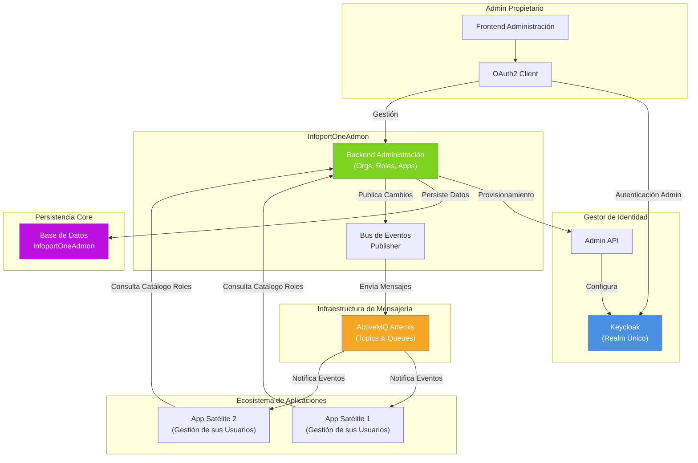
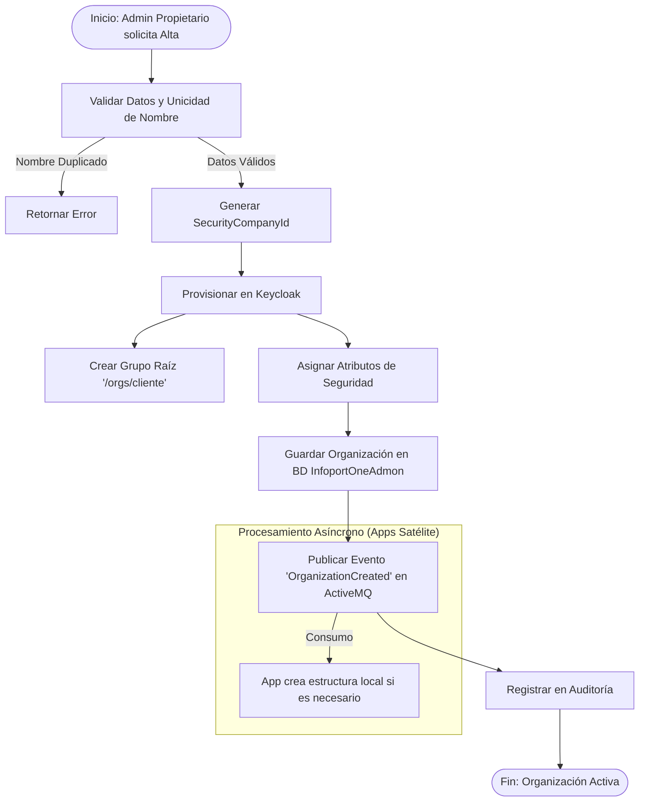
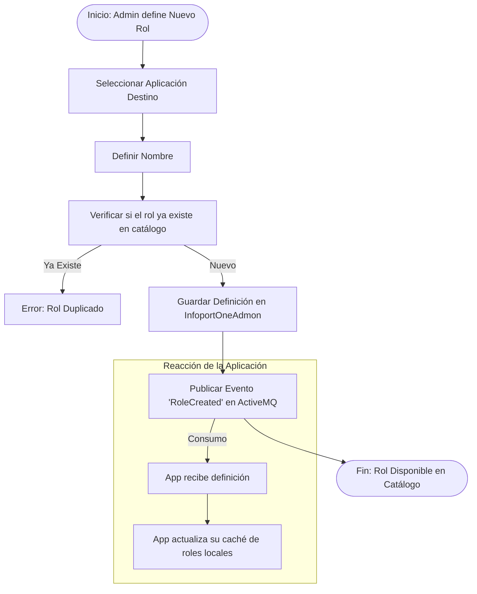
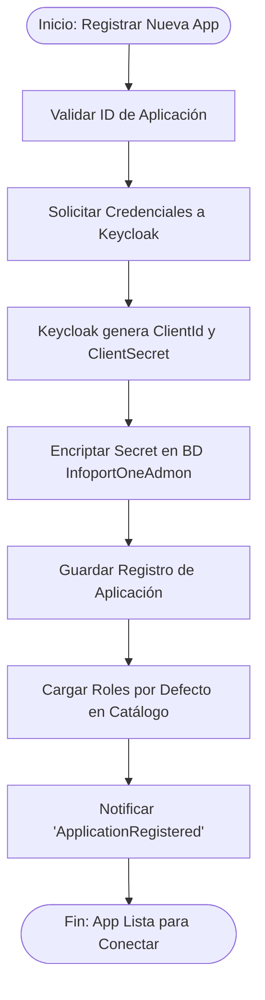
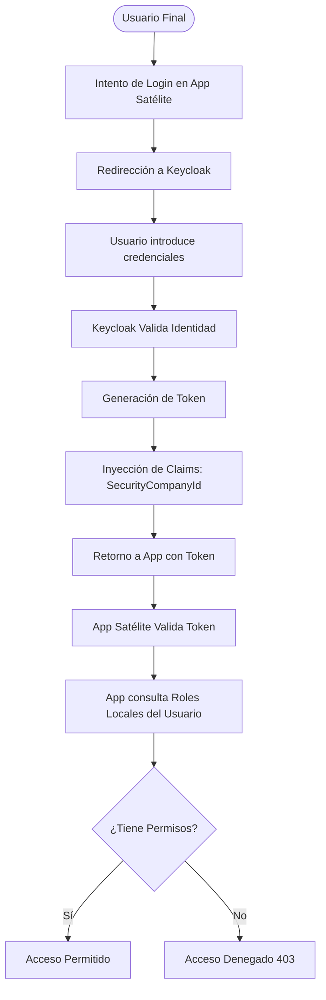
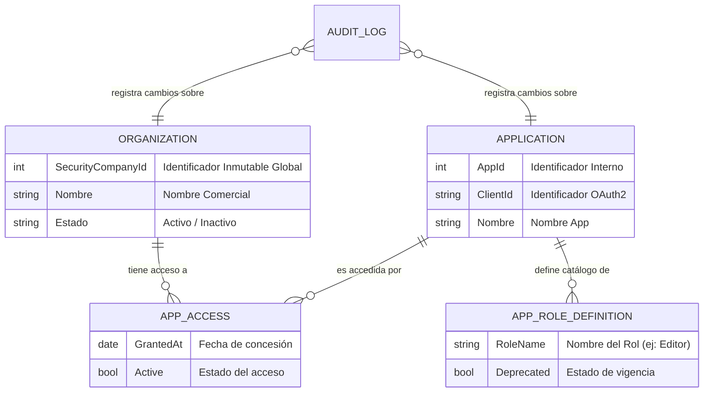
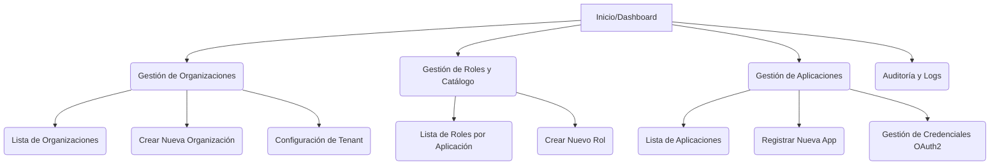

# 🧭 InfoportOneAdmon - Sistema de Gestión Centralizada de Organizaciones y Roles

## 📚 Tabla de Contenidos

1. [📝 Descripción General del Producto](#-descripción-general-del-producto)
2. [⚙️ Funcionalidades Principales](#️-funcionalidades-principales)
3. [🏗️ Arquitectura Lógica del Sistema](#️-arquitectura-lógica-del-sistema)
4. [🔀 Flujos de Proceso de Negocio](#-flujos-de-proceso-de-negocio)
5. [🗃️ Modelo de Datos Conceptual](#️-modelo-de-datos-conceptual)
6. [🚀 Estrategia de Optimización y Rendimiento](#️-estrategia-de-optimización-y-rendimiento)
7. [👥 Identificación y Clasificación de Stakeholders](#-identificación-y-clasificación-de-stakeholders)
8. [🧱 Componentes Principales y Sitemaps](#️-componentes-principales-y-sitemaps)
9. [🎨 Diseño y Experiencia del Usuario (UX/UI)](#-diseño-y-experiencia-del-usuario-uxui)
10. [🛠️ Requisitos Técnicos](#️-requisitos-técnicos)
11. [🗓️ Planificación del Proyecto (MVP de 30 Horas)](#️-planificación-del-proyecto-mvp-de-30-horas)

---

## 📝 Descripción General del Producto

### 🌟 Visión del Producto

**InfoportOneAdmon** es la plataforma administrativa centralizada ("Back-Office") diseñada exclusivamente para que la **Organización Propietaria** del ecosistema gestione el ciclo de vida de los clientes (Organizaciones) y la seguridad transversal de las aplicaciones satélites.

A diferencia de modelos SaaS de auto-servicio, en este ecosistema **las organizaciones no se registran por sí mismas**. Es la Organización Propietaria quien, a través de InfoportOneAdmon, da de alta, configura y provisiona los entornos para sus clientes, garantizando un control total sobre quién accede al ecosistema.

**Misión**: Centralizar la complejidad administrativa (altas de clientes, seguridad OAuth2, catálogo de roles) para que las aplicaciones de negocio (CRM, ERP, etc.) puedan centrarse exclusivamente en su lógica funcional y en la gestión de sus propios usuarios.

### 🎯 Alcance y Responsabilidades

InfoportOneAdmon actúa como la **Fuente de la Verdad** para:

1.  **Gestión de Inquilinos (Tenants)**: Control del ciclo de vida de las organizaciones clientes.
2.  **Catálogo Maestro de Roles**: Definición única de qué roles existen en cada aplicación.
3.  **Gobierno de Identidad**: Orquestación de Keycloak para la seguridad de las aplicaciones.

**🔑 PRINCIPIO CLAVE DE RESPONSABILIDAD**:
* **InfoportOneAdmon**: Define *quién* es el cliente (Organización) y *qué* roles existen (Definiciones).
* **Aplicaciones Satélite**: Gestionan *quiénes* son los usuarios finales y *qué* roles tienen asignados.

### 🧩 Principios de Diseño

| Principio | Descripción | Justificación de Negocio |
|-----------|-------------|--------------------------|
| **Administración Centralizada** | Gestión exclusiva por la Organización Propietaria | Control total sobre el onboarding de clientes y licencias. |
| **Single Realm** | Un único realm (InfoportOne) en Keycloak | Simplifica la gestión de identidades y permite SSO real. |
| **Usuarios Descentralizados** | Las Apps crean sus propios usuarios | Permite a cada aplicación escalar y gestionar sus usuarios sin cuellos de botella centrales. |
| **Roles como Catálogo** | InfoportOneAdmon define, Apps asignan | Asegura coherencia en los nombres y flexibilidad en la asignación. |
| **Event-Driven** | Uso de ActiveMQ Artemis | Garantiza que los cambios administrativos se propaguen a las apps sin acoplamiento fuerte. |

---

## ⚙️ Funcionalidades Principales

### 1️⃣ Gestión de Organizaciones (Clientes)

**📝 Descripción**:
Este módulo permite a los administradores de la Organización Propietaria gestionar el ciclo de vida completo de las empresas clientes que utilizarán el ecosistema de aplicaciones. Su objetivo es centralizar el alta administrativa y técnica en un solo paso, evitando configuraciones manuales en sistemas de terceros (como Keycloak).

**🧠 Capacidades**:
* ✅ **Onboarding de Clientes**: Alta de nueva organización, generando automáticamente su estructura de seguridad (Grupos en Keycloak) y su identificador único de seguridad (`SecurityCompanyId`).
* 🛠️ **Gestión de Configuración**: Modificación de datos corporativos y configuraciones globales del tenant.
* 🔌 **Kill-Switch (Desactivación)**: Capacidad de bloquear el acceso de una organización completa al ecosistema de forma inmediata en caso de impago o baja del servicio.
* 🧾 **Auditoría de Tenant**: Trazabilidad completa de cuándo se creó o modificó una organización.

### 2️⃣ Gestión de Definiciones de Roles (Catálogo)

**📝 Descripción**:
Funciona como un repositorio maestro de roles. Permite definir qué "perfiles" existen dentro de cada aplicación (ej: "Vendedor", "Gerente", "Auditor") y qué permisos técnicos conllevan gestionados desde las propias aplicaciones. Esto evita que los roles se definan "hardcoded" dentro del código de las aplicaciones, permitiendo cambios dinámicos.

**🧠 Capacidades**:
* 📘 **Creación de Catálogo**: Definir nuevos roles para una aplicación específica.
* 🧪 **Deprecación**: Marcar roles como obsoletos para evitar nuevas asignaciones, guiando la migración hacia nuevos roles.
* 🔎 **Consulta de Roles**: Endpoint público para que las aplicaciones descarguen su lista actualizada de roles disponibles.

### 3️⃣ Gestión de Aplicaciones (Ecosistema)

**📝 Descripción**:
Permite registrar nuevas aplicaciones satélite en el ecosistema. Al registrar una app, InfoportOneAdmon se encarga de toda la "fontanería" de seguridad OAuth2, entregando a la aplicación las credenciales necesarias para operar.

**🧠 Capacidades**:
* 🆕 **Registro de Aplicación**: Alta de nueva app (ej: "Módulo de Finanzas"), generando automáticamente el `client_id` y `client_secret` en Keycloak.
* 🔐 **Gestión de Secretos**: Rotación y administración segura de credenciales OAuth2.
* 🚦 **Control de Acceso**: Definir si una aplicación está activa o en mantenimiento para todo el ecosistema.

### 4️⃣ Integración Transparente con Keycloak

**📝 Descripción**:
InfoportOneAdmon abstrae la complejidad de Keycloak. Los administradores no necesitan entrar a la consola de Keycloak; InfoportOneAdmon traduce las acciones de negocio (ej: "Crear Cliente") en comandos técnicos hacia el servidor de identidad.

**🧠 Capacidades**:
* 🔄 **Sincronización de Estructuras**: Creación automática de grupos raíz (`/orgs/{nombre}`) y atributos de seguridad.
* 🧩 **Configuración de Claims**: Garantiza que los tokens emitidos incluyan siempre el `SecurityCompanyId`, vital para que las aplicaciones sepan a qué datos puede acceder un usuario.

### 5️⃣ Arquitectura Orientada a Eventos (ActiveMQ Artemis)

**📝 Descripción**:
Mecanismo de comunicación asíncrona que mantiene la coherencia entre InfoportOneAdmon y las aplicaciones satélite. Cuando ocurre un cambio administrativo, se emite un evento para que las aplicaciones interesadas reaccionen.

**📣 Eventos Principales**:
* `OrganizationCreated` / `Updated` / `Deactivated`
* `ApplicationRegistered`
* `RoleCreated` / `Updated` / `Deprecated`

## 🏗️ Arquitectura Lógica del Sistema

El siguiente diagrama ilustra cómo InfoportOneAdmon orquesta la seguridad y los datos maestros, sirviendo a las aplicaciones del ecosistema.

## 🔀 Flujos de Proceso de Negocio

### 1️⃣ Alta de Nueva Organización (Onboarding)

Este proceso es ejecutado exclusivamente por el personal de la Organización Propietaria cuando se cierra un contrato con un nuevo cliente.

### 2️⃣ Definición de Nuevo Rol en una Aplicación

El administrador define un nuevo perfil funcional que estará disponible para una aplicación específica.

### 3️⃣ Registro de Nueva Aplicación en el Ecosistema

Proceso técnico para dar de alta una nueva aplicación satélite y permitirle interactuar con Keycloak.

### 4️⃣ Autenticación y Autorización (Vista de Usuario Final)

Cómo un usuario de una Organización Cliente accede a una App Satélite. InfoportOneAdmon no participa activamente en el login (solo configuró el entorno previamente), pero su configuración es vital.

## 🗃️ Modelo de Datos Conceptual

A continuación, se presentan las entidades principales que maneja InfoportOneAdmon. Este modelo no busca detallar tipos de datos SQL, sino las relaciones de negocio.

### 🧱 Entidades Clave

1.  **Organization (Organización): Representa al cliente legal. Su atributo más crítico es el SecurityCompanyId, que es el pegamento de seguridad entre Keycloak, InfoportOneAdmon y las Apps Satélite.

2.  **Application (Aplicación): Representa un software del ecosistema (ej: "ERP", "Portal Clientes"). Contiene las credenciales para hablar con Keycloak.

3.  **AppRoleDefinition (Definición de Rol): Es la plantilla del rol. InfoportOneAdmon guarda la definición (qué puede hacer el rol "Admin"), pero no guarda quién tiene ese rol (eso está en la base de datos de cada App).

4.  **AuditLog: Registro inmutable de todas las operaciones realizadas por los administradores propietarios.

## 🚀 Estrategia de Optimización y Rendimiento

Aunque InfoportOneAdmon es un sistema de administración (tráfico bajo comparado con las apps satélite), su disponibilidad es crítica. Se aplican las siguientes estrategias no funcionales:

1. **Desacoplamiento mediante ActiveMQ Artemis
El uso de un bus de mensajes empresarial garantiza que si una aplicación satélite está caída durante una actualización administrativa (ej: cambio de nombre de una organización), no se pierda el dato. La aplicación procesará el mensaje al reconectarse.

2. **Estrategia de Caché en Aplicaciones
Para evitar latencia en la validación de permisos:

InfoportOneAdmon es la fuente de la verdad de las definiciones de roles.

Las aplicaciones *deben cachear* estas definiciones localmente.

Las aplicaciones solo consultan a InfoportOneAdmon en el arranque o cuando reciben un evento de RoleUpdated.

Esto elimina el tráfico de red en cada request HTTP del usuario final.

3. **Seguridad Stateless (Tokens)
La validación de seguridad en tiempo de ejecución se basa en el estándar *JWT (JSON Web Tokens)*.

*** El token es autosuficiente: contiene el SecurityCompanyId.

*** InfoportOneAdmon no es consultado para validar tokens; esta validación es matemática (criptografía) y local en cada app, garantizando máxima velocidad.

4. **Auditoría Asíncrona
El registro de auditoría no bloquea la operación principal. Se procesa en segundo plano para asegurar una experiencia de usuario fluida para el administrador.

## 👥 Identificación y Clasificación de Stakeholders

A continuación, se presenta la lista de partes interesadas clave para el proyecto **InfoportOneAdmon**, clasificadas según su rol, interés y nivel de influencia en la plataforma de administración centralizada.

---

### 🧑‍💼 Partes Interesadas Primarias (Usuarios y Decisiones)

| Categoría | Stakeholder | Interés Principal | Impacto de InfoportOneAdmon |
| :--- | :--- | :--- | :--- |
| **Usuarios Directos / Operacionales** | **Administradores de la Organización Propietaria** | Ejecutar el *onboarding* de nuevos clientes y la gestión del catálogo maestro de roles. | Son los **usuarios finales** de la plataforma. Necesitan una interfaz eficiente y un 100% de disponibilidad para garantizar el servicio a los clientes. |
| **Compradores / Financiadores** | **Dirección Ejecutiva (CEO, CTO, Sponsors del Proyecto)** | Retorno de la inversión (ROI), escalabilidad del ecosistema y control centralizado del negocio B2B. | **Aprueban el presupuesto** y definen la estrategia del modelo multi-organización. Son los responsables de negocio. |
| **Fabricantes / Desarrollo** | **Equipo de Desarrollo de InfoportOneAdmon** | Definición técnica, estabilidad del código, correcta integración con Keycloak y ActiveMQ Artemis. | Responsables de la **implementación técnica** y del mantenimiento. Son clave para la calidad y el rendimiento. |
| **Asistencia al Cliente** | **Equipo de Soporte y Operaciones (Tier 2/3)** | Diagnóstico rápido de problemas de acceso, autenticación, y estado (activo/inactivo) de una organización cliente. | Necesitan **herramientas de búsqueda y registros de auditoría claros** para reducir el tiempo de resolución (MTTR) de las incidencias de clientes. |

---

### 🤝 Partes Interesadas Secundarias (Consumidores y Proveedores)

| Categoría | Stakeholder | Interés Principal | Impacto de InfoportOneAdmon |
| :--- | :--- | :--- | :--- |
| **Socios Internos (Apps)** | **Equipos de Desarrollo de Aplicaciones Satélite** | Consumo estable de la API de roles y del bus de eventos de **ActiveMQ Artemis**. Validación del `SecurityCompanyId` en el token. | Son **consumidores de la información maestra** de InfoportOneAdmon. La estabilidad de este sistema es crucial para su desarrollo y operación. |
| **Socios Externos / Proveedores** | **Proveedores de Tecnología (Keycloak, ActiveMQ Artemis)** | Garantizar la estabilidad y el soporte de los componentes clave de infraestructura orquestados por InfoportOneAdmon. | El proyecto depende de la salud y el rendimiento de estos servicios de terceros. |
| **Usuarios Finales (de las Organizaciones Clientes)** | **Usuarios finales de las Apps Satélite** | Acceso ininterrumpido (SSO) y correcta asignación de roles y permisos funcionales. | Su experiencia de acceso y seguridad está determinada por la **configuración orquestada** a través de InfoportOneAdmon, aunque no interactúan directamente con él. |

---

### 🏛️ Partes Interesadas de Gobierno y Mercado

| Categoría | Stakeholder | Interés Principal | Impacto de InfoportOneAdmon |
| :--- | :--- | :--- | :--- |
| **Instancias Reguladoras** | **Asesoría Legal y Equipo de Seguridad (CISO)** | Garantizar el *compliance* (cumplimiento) de la segregación de datos por organización y la trazabilidad de todos los cambios administrativos. | El sistema debe proveer la **evidencia de auditoría** (logs) necesaria para demostrar el aislamiento de tenants y el control de acceso. |
| **Marketing y Ventas** | **Equipo de Ventas B2B y Marketing** | Capacidad de promocionar y asegurar un proceso de *onboarding* de clientes rápido, estandarizado y de alta seguridad a nuevos prospectos. | La eficiencia del módulo de `Gestión de Organizaciones` es un **argumento de venta (USP)** fundamental para la adquisición de nuevos clientes. |
| **Minoristas / Distribuidores** | **N/A** | N/A. | El proyecto **InfoportOneAdmon** es un sistema B2B interno de gestión administrativa y no tiene relación con el canal minorista o distribución física. |

## 🧱 Componentes Principales y Sitemaps

### 8.1. Componentes Principales (Estructura Lógica)

El sistema **InfoportOneAdmon** se compone de tres módulos internos de aplicación y tres sistemas de infraestructura crítica, desacoplados mediante una arquitectura orientada a eventos (EDA) utilizando **ActiveMQ Artemis**.

| Componente | Rol en el Ecosistema | Interacción con Otros Sistemas |
| :--- | :--- | :--- |
| **Módulo de Organizaciones** | Gestiona el ciclo de vida de los clientes (alta, activación, desactivación). | Escribe en la Base de Datos. Utiliza el **Servicio de Orquestación** para interactuar con Keycloak. |
| **Módulo Catálogo de Roles** | Define y almacena las plantillas de roles. | Publica eventos `RoleUpdated` en **ActiveMQ Artemis**. |
| **Módulo de Aplicaciones** | Registra nuevas aplicaciones satélite y gestiona sus credenciales OAuth2 (`client_id`, `client_secret`). | Utiliza el **Servicio de Orquestación** para dar de alta clientes en Keycloak. |
| **Servicio de Orquestación Keycloak** | Microservicio interno que traduce las acciones de negocio (ej. "Crear Org") en llamadas administrativas a Keycloak. | **Keycloak Admin API**. |
| **ActiveMQ Artemis** | Bus de mensajería empresarial. Garantiza la entrega asíncrona y la coherencia de datos entre InfoportOneAdmon y las aplicaciones satélite. | **Aplicaciones Satélite** (Consumidores) y **InfoportOneAdmon** (Productor). |
| **Base de Datos Core** | Persistencia de la fuente de la verdad: lista de organizaciones, definiciones de roles y registros de auditoría. | **Módulos de InfoportOneAdmon**. |

### 8.2. Sitemap (Navegación Administrativa)

La navegación del administrador propietario debe ser sencilla y basarse en las entidades clave del negocio.

## 🎨 Diseño y Experiencia del Usuario (UX/UI)

El diseño de **InfoportOneAdmon** se centrará en la **usabilidad para el rol especializado de administración**, priorizando la seguridad y la claridad sobre la estética visual avanzada. La audiencia son usuarios *expertos* que ejecutan tareas críticas.

### 9.1. Principios de Usabilidad

* 🔍 **Claridad en Aislamiento**: Cada acción relacionada con una organización (tenant) debe mostrar claramente el `SecurityCompanyId` afectado para evitar errores de gestión. El identificador único debe ser visible en el contexto de cualquier operación de modificación o eliminación.
* 📊 **Diseño Orientado al Dato (Data-Driven)**: Interfaz basada en tablas de datos filtrables, ordenables y paginadas. El administrador pasa la mayor parte del tiempo revisando listas de organizaciones, roles y logs.
* 🧭 **Flujos Lineales para Tareas Críticas**: El proceso de **"Crear Nueva Organización"** será un asistente (wizard) paso a paso, ya que es una operación de alta criticidad que debe ser auditable y minimizando la posibilidad de omisión de datos.
* ✨ **Minimalismo Funcional**: Evitar decoraciones innecesarias. La interfaz debe ser rápida y responsiva, enfocada en la eficiencia del flujo de trabajo del administrador.

### 9.2. Especificaciones de Diseño (Estándares)

| Aspecto | Especificación | Objetivo UX/UI |
| :--- | :--- | :--- |
| **Identidad Visual** | Uso de una paleta de colores corporativos. Uso de colores de alerta (rojo/ámbar) para señalar acciones irreversibles (ej. Desactivar Organización, Eliminar Rol). | Reforzar la identidad de marca y alertar visualmente sobre acciones de alto impacto y riesgo. |
| **Controles de Entrada** | Uso de *Dropdowns* con búsqueda (Searchable Select) para seleccionar Aplicaciones y Roles. | Reducir errores de tipeo y aumentar la velocidad en la gestión de catálogos extensos. |
| **Feedback del Sistema** | Notificaciones **asíncronas** de éxito/error. Por ejemplo, "Organización creada, sincronizando en Keycloak...". | Informar al usuario sobre los procesos que se ejecutan en segundo plano (arquitectura Event-Driven) para evitar la percepción de lentitud. |
| **Usabilidad Móvil** | **Prioridad Baja (Administración)**. La interfaz se diseñará y optimizará primariamente para **Desktop** (resoluciones de 1920x1080 o superior), dado que es una aplicación de back-office de uso especializado. | Concentrar recursos en la experiencia de escritorio del administrador donde se realizan las tareas más complejas. |

## 🛠️ Requisitos Técnicos

### 10.1. Stack Tecnológico Principal

El core de **InfoportOneAdmon** debe construirse sobre tecnologías probadas y escalables, dada su función como sistema central de seguridad y administración.

| Requisito | Especificación | Justificación |
| :--- | :--- | :--- |
| **Backend Lenguaje/Runtime** | ASP.NET Core C#. Framework Helix6. | Entornos robustos, con alto rendimiento en microservicios y excelente soporte para la construcción de APIs REST. |
| **Frontend Lenguaje/Runtime** | Angular 20. | Cliente SPA muy adecuado para e desarrollo en este proyecto. |
| **Base de Datos** | PostgreSQL. | Se requiere un motor de base de datos relacional para garantizar la integridad transaccional (ACID) y la capacidad de realizar auditoría detallada y transacciones de alta criticidad. |
| **Servicio de Identidad** | **Keycloak** (Configurado como un Realm Único llamado `InfoportOne`). | Estándar de facto para OpenID Connect y OAuth2, necesario para la seguridad transversal de todo el ecosistema de aplicaciones satélite. |
| **Mensajería** | **ActiveMQ Artemis**. | Bus de mensajería empresarial para la arquitectura Event-Driven. Garantiza la entrega asíncrona confiable de eventos críticos (ej. `OrganizationDeactivated`). |
| **Despliegue** | Contenedores Docker. | Máxima escalabilidad horizontal, resiliencia y despliegue automatizado para un servicio de la plataforma Core. |

### 10.2. Aspectos Técnicos Críticos

* **📡 API y Estructura de Datos**:
    * 🔗 **Interactividad (REST)**: La API de InfoportOneAdmon debe ser 100% RESTful, desacoplada y utilizar versiones (ej. `/v1/`).
    * 📄 **Paginación Obligatoria**: Todos los *endpoints* que devuelvan listas de recursos (Organizaciones, Roles, Logs) deben implementar la **Paginación Obligatoria** (`skip`/`take` o similar) para evitar problemas de rendimiento y sobrecarga de la base de datos.
    * 🧠 **Caching**: Implementar una capa de caché de solo lectura (ej. Redis) para la consulta del Catálogo de Roles, ya que será un *endpoint* de alta concurrencia consultado por las aplicaciones satélite.

* **🔐 Seguridad y Confidencialidad**:
    * 🗝️ **Almacenamiento de Secretos**: Todas las credenciales sensibles (ej. `client_secret` de las Apps) deben almacenarse **encriptadas en reposo** utilizando un almacén de secretos dedicado (como Azure Key Vault, AWS Secrets Manager o HashiCorp Vault).
    * 🔒 **Orquestación Segura**: La comunicación entre InfoportOneAdmon y Keycloak (vía Admin API) debe realizarse siempre a través de un canal seguro (TLS/HTTPS).

* **📏 Normativas y Compliance**:
    * 🧱 **Aislamiento de Datos**: El diseño de la base de datos debe ser inherentemente *Tenant-Aware* o *Tenant-Safe* para garantizar que el `SecurityCompanyId` sea el factor principal de aislamiento, cumpliendo con la necesidad de segregación de datos.
    * 🧾 **Auditoría (ISO 27001)**: El registro de auditoría (`AuditLog`) debe ser inmutable y registrar el *antes y el después* de los datos de todas las operaciones críticas (creación, modificación, desactivación). Esto es un requisito obligatorio para demostrar el control interno sobre el sistema.

## 🗓️ Planificación del Proyecto (MVP de 30 Horas)

Dada la restricción de tiempo impuesta (30 horas) para la fase de definición e implementación del **PMV (Producto Mínimo Viable)**, el alcance del proyecto se reducirá a lo estrictamente necesario para validar el flujo más crítico y fundamental: **La creación exitosa de una Organización (Tenant) y su correcta orquestación de seguridad**.

### 11.1. Definición del Producto Mínimo Viable (PMV)

El PMV de 30 horas se enfocará exclusivamente en el **Flujo 1: Alta de Nueva Organización (Onboarding)**. Este PMV debe demostrar el funcionamiento de los tres pilares arquitectónicos: Base de Datos, Keycloak (Seguridad) y ActiveMQ Artemis (Mensajería).

| Requisito del PMV | Justificación |
| :--- | :--- |
| **Core Funcionalidad** | Creación de una Organización (registro de nombre y estado). |
| **Integración Requerida** | Orquestación exitosa con **Keycloak**: El sistema debe crear el grupo raíz y establecer los atributos de seguridad del tenant en el servidor de identidad. |
| **Desacoplamiento** | Publicación del evento `OrganizationCreated` en **ActiveMQ Artemis**. |
| **Visibilidad** | Persistencia de los datos de la Organización en la Base de Datos Core y registro del evento en el Log de Auditoría. |

### 11.2. Hitos y Asignación de Horas (PMV) (30h)

La planificación se divide en cinco fases secuenciales y limitadas, que deben cumplirse para considerar el PMV como finalizado.

| Hito / Tarea | Módulo | Horas Estimadas | Dependencias | Criterio de Finalización |
| :--- | :--- | :--- | :--- | :--- |
| **Fase 1: Preparación del Entorno** | Arquitectura | **5h** | Ninguna | Repositorio inicial, configuración de conexiones a Base de Datos y *mock* / configuración básica de Keycloak y ActiveMQ Artemis. |
| **Fase 2: Módulo Organizaciones (Core)** | Organizaciones | **8h** | Fase 1 | Desarrollo de la lógica de negocio core. Entidad `Organization` persistida con el `SecurityCompanyId` generado. API `POST /organizations` funcional y auditada. |
| **Fase 3: Orquestación Keycloak** | Servicio Orquestación | **9h** | Fase 2 | Implementación de la capa de integración. Al crear una Org, se llama con éxito a la Admin API de Keycloak para crear el Grupo y asignar los atributos de seguridad. |
| **Fase 4: Mensajería (ActiveMQ Artemis)** | Bus de Eventos | **5h** | Fase 2 | Integración del productor. El evento `OrganizationCreated` se publica con éxito y es visible en el broker de mensajes. |
| **Fase 5: Test y Documentación** | Transversal | **3h** | Fases 2, 3, 4 | Flujo completo de *Onboarding* validado de extremo a extremo. Creación de tests unitarios/integración mínimos y documentación de la API del PMV finalizada. |
| **TOTAL** | | **30 Horas** | | **PMV Aceptado** |

### 11.3. Fases Restantes Tras el PMV (Hoja de Ruta Completa)

Una vez completado y aceptado el PMV (Flujo de Onboarding de Organización), el proyecto se enfocará en las siguientes fases, priorizando las funcionalidades administrativas críticas y los datos maestros (Catálogo de Roles y Apps).

| Fase | Objetivo Principal | Módulos Clave | Hitos a Completar |
| :--- | :--- | :--- | :--- |
| **Fase 6** | **Gestión Completa del Ciclo de Vida de la Organización** | Módulo Organizaciones, Orquestación Keycloak | 1. Implementación de la funcionalidad **Actualizar Datos** de la Organización. 2. Desarrollo del **Kill-Switch (Desactivación)** y su correspondiente sincronización en Keycloak (bloqueo de grupo). 3. Publicación del evento crítico `OrganizationDeactivated` en ActiveMQ Artemis. |
| **Fase 7** | **Catálogo Maestro de Roles (Definición)** | Módulo Catálogo de Roles | 1. Implementación de la API para **Crear y Modificar** la definición de Roles y sus Permisos. 2. API de consulta pública (lectura) para que las Apps Satélite descarguen su catálogo de roles. 3. Implementación de los eventos `RoleCreated` y `RoleUpdated` en ActiveMQ Artemis. |
| **Fase 8** | **Gestión de Aplicaciones y Credenciales** | Módulo de Aplicaciones, Orquestación Keycloak | 1. Implementación de la funcionalidad para **Registrar una Nueva Aplicación** en el ecosistema. 2. Orquestación Keycloak para generar el `client_id` y `client_secret` de la App. 3. Implementación segura del almacén de secretos (cifrado en reposo del `client_secret`). |
| **Fase 9** | **Operaciones y Cumplimiento (Compliance)** | Módulo de Auditoría y Logs, Transversal | 1. Finalización de la implementación del **Log de Auditoría Inmutable** para todas las operaciones críticas (Organizaciones, Roles, Apps). 2. Desarrollo de la interfaz de consulta para los equipos de Soporte. 3. Implementación de la capa de caché (ej. Redis) para el *endpoint* de consulta de Roles, cumpliendo el CA 4.1. |
| **Fase 10** | **Pruebas de Aceptación y Estabilidad** | Transversal | 1. Pruebas de Carga/Estrés en la API de Roles (para verificar la estrategia de caché). 2. Pruebas de Resiliencia del Bus de Eventos (ActiveMQ Artemis). 3. Documentación técnica completa para consumo de la API y los eventos. 4. **Pruebas de Aceptación del Usuario (UAT)** por parte de los Administradores Propietarios. |