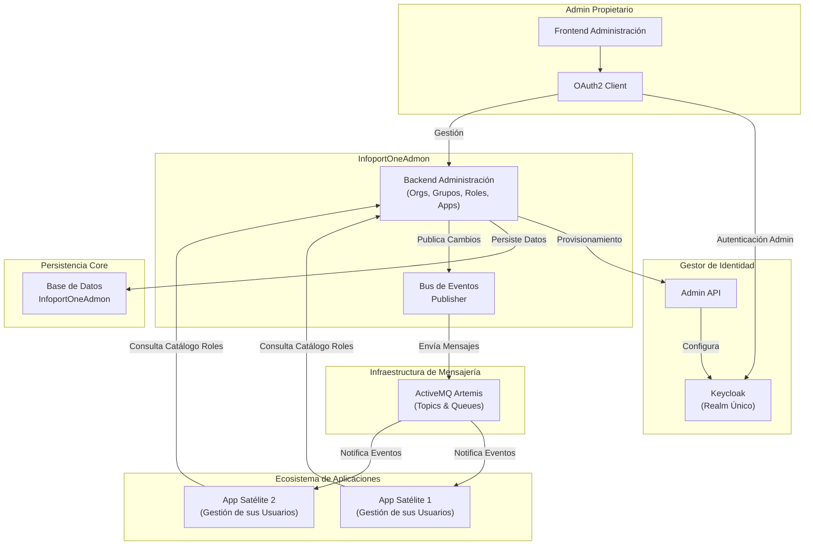
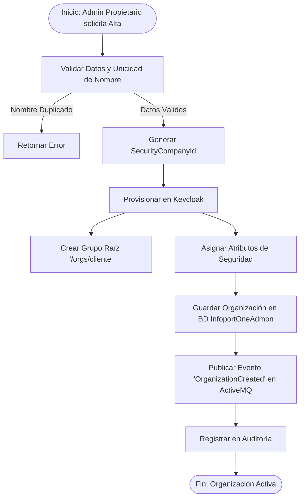
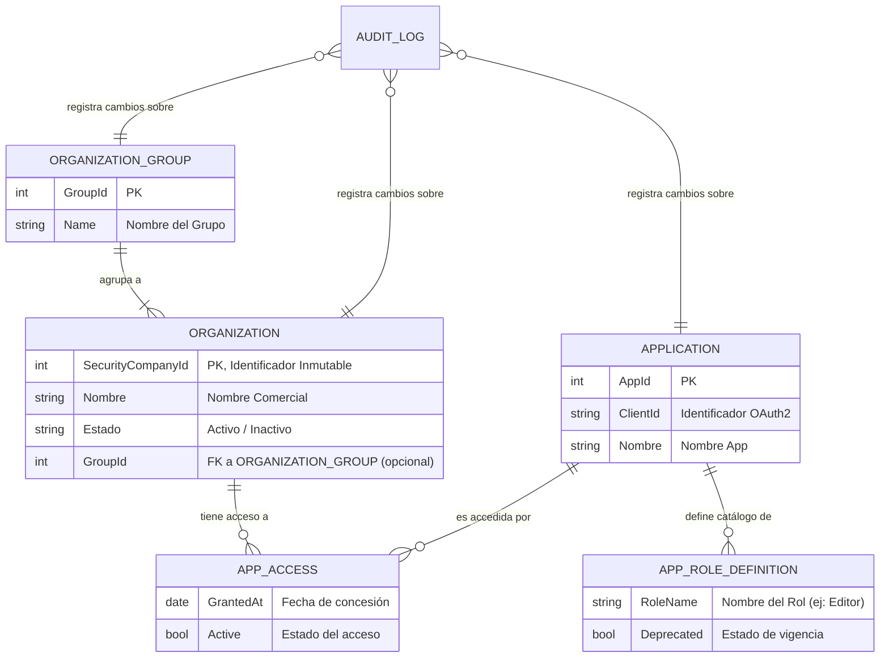
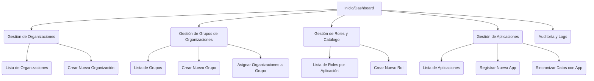

# 🧭 1. InfoportOneAdmon - Sistema de Gestión Centralizada de Organizaciones y Roles

## 📚 Tabla de Contenidos

1. [📝 1. Descripción General del Producto](#-1-descripción-general-del-producto)
2. [⚙️ 2. Funcionalidades Principales](#%EF%B8%8F-2-funcionalidades-principales)
3. [🏗️ 3. Arquitectura Lógica del Sistema](#%EF%B8%8F-3-arquitectura-lógica-del-sistema)
4. [🔀 4. Flujos de Proceso de Negocio](#-4-flujos-de-proceso-de-negocio)
5. [🗃️ 5. Modelo de Datos Conceptual](#%EF%B8%8F-5-modelo-de-datos-conceptual)
6. [🚀 6. Estrategia de Optimización y Rendimiento](#-6-estrategia-de-optimización-y-rendimiento)
7. [👥 7. Identificación y Clasificación de Stakeholders](#-7-identificación-y-clasificación-de-stakeholders)
8. [🧱 8. Componentes Principales y Sitemaps](#-8-componentes-principales-y-sitemaps)
9. [🎨 9. Diseño y Experiencia del Usuario (UX/UI)](#-9-diseño-y-experiencia-del-usuario-uxui)
10. [🛠️ 10. Requisitos Técnicos](#%EF%B8%8F-10-requisitos-técnicos)
11. [🗓️ 11. Planificación del Proyecto (MVP de 30 Horas)](#%EF%B8%8F-11-planificación-del-proyecto-mvp-de-30-horas)

---

## 📝 1. Descripción General del Producto

### 🌟 Visión del Producto

**InfoportOneAdmon** es la plataforma administrativa centralizada ("Back-Office") diseñada exclusivamente para que la **Organización Propietaria** del ecosistema gestione el ciclo de vida de los clientes (Organizaciones), sus agrupaciones, y la seguridad transversal de las aplicaciones satélites.

A diferencia de modelos SaaS de auto-servicio, en este ecosistema **las organizaciones no se registran por sí mismas**. Es la Organización Propietaria quien, a través de InfoportOneAdmon, da de alta, configura y provisiona los entornos para sus clientes, garantizando un control total sobre quién accede al ecosistema y cómo se relacionan entre sí.

**Misión**: Centralizar la complejidad administrativa (altas de clientes, grupos de clientes, seguridad OAuth2, catálogo de roles) para que las aplicaciones de negocio (CRM, ERP, etc.) puedan centrarse exclusivamente en su lógica funcional y en la gestión de sus propios usuarios.

### 🎯 Alcance y Responsabilidades

InfoportOneAdmon actúa como la **Fuente de la Verdad** para:

1.  **Gestión de Inquilinos (Tenants)**: Control del ciclo de vida de las organizaciones clientes.
2.  **Gestión de Grupos de Organizaciones**: Creación y mantenimiento de agrupaciones lógicas de organizaciones.
3.  **Catálogo Maestro de Roles**: Definición única de qué roles existen en cada aplicación.
4.  **Gobierno de Identidad**: Orquestación de Keycloak para la seguridad de las aplicaciones.

**🔑 PRINCIPIO CLAVE DE RESPONSABILIDAD**:
* **InfoportOneAdmon**: Define *quién* es el cliente (Organización), *cómo se agrupan* y *qué* roles existen (Definiciones).
* **Aplicaciones Satélite**: Gestionan *quiénes* son los usuarios finales y *qué* roles tienen asignados.

### 🧩 Principios de Diseño

| Principio | Descripción | Justificación de Negocio |
|-----------|-------------|--------------------------|
| **Administración Centralizada** | Gestión exclusiva por la Organización Propietaria | Control total sobre el onboarding y la estructura de clientes. |
| **Single Realm** | Un único realm (InfoportOne) en Keycloak | Simplifica la gestión de identidades y permite SSO real. |
| **Usuarios Descentralizados** | Las Apps crean sus propios usuarios | Permite a cada aplicación escalar y gestionar sus usuarios sin cuellos de botella centrales. |
| **Roles como Catálogo** | InfoportOneAdmon define, Apps asignan | Asegura coherencia en los nombres y flexibilidad en la asignación. |
| **Event-Driven** | Uso de ActiveMQ Artemis | Garantiza que los cambios administrativos se propaguen a las apps sin acoplamiento fuerte. |
| **Sincronización por Eventos**| La inicialización de datos en nuevas aplicaciones se realiza mediante la emisión de eventos desde InfoportOneAdmon | Asegura un bajo acoplamiento y permite a las aplicaciones inicializarse o resincronizarse bajo demanda y de forma asíncrona |
---

## ⚙️ 2. Funcionalidades Principales

### 2.1️⃣ Gestión de Organizaciones (Clientes)

**📝 Descripción**:
Este módulo permite a los administradores de la Organización Propietaria gestionar el ciclo de vida completo de las empresas clientes. Su objetivo es centralizar el alta administrativa y técnica en un solo paso.

**🧠 Capacidades**:
* ✅ **Onboarding de Clientes**: Alta de nueva organización, generando su `SecurityCompanyId`.
* 🛠️ **Gestión de Configuración**: Modificación de datos corporativos.
* 🔌 **Kill-Switch (Desactivación)**: Bloqueo de acceso de una organización.
* 🧾 **Auditoría de Tenant**: Trazabilidad completa de cambios.

### 2.2️⃣ Gestión de Grupos de Organizaciones

**📝 Descripción**:
Permite crear y gestionar agrupaciones lógicas de organizaciones. Estas agrupaciones son cruciales para las aplicaciones que necesitan implementar funcionalidades transversales entre varias organizaciones que pertenecen a un mismo "consorcio" o "holding".

**🧠 Capacidades**:
* 🆕 **Creación de Grupos**: Definir un nuevo grupo de organizaciones (ej: "Grupo Logístico Peninsular").
* 🔄 **Asociación de Miembros**: Añadir o eliminar organizaciones de un grupo existente.
* 🗑️ **Gestión del Ciclo de Vida**: Modificar o eliminar grupos.
* 📢 **Propagación de Cambios**: Cada cambio (creación de grupo, adición/eliminación de miembro) genera un evento que se publica en el bus para notificar a las aplicaciones.

### 2.3️⃣ Gestión de Definiciones de Roles (Catálogo)

**📝 Descripción**:
Funciona como un repositorio maestro de roles. Permite definir qué "perfiles" existen dentro de cada aplicación (ej: "Vendedor", "Gerente").

**🧠 Capacidades**:
* 📘 **Creación de Catálogo**: Definir nuevos roles para una aplicación.
* 🧪 **Deprecación**: Marcar roles como obsoletos.
* 🔎 **Consulta de Roles**: Endpoint para que las aplicaciones descarguen su lista de roles.

### 2.4️⃣ Gestión de Aplicaciones (Ecosistema)

**📝 Descripción**:
Permite registrar nuevas aplicaciones satélite en el ecosistema, gestionando su configuración de seguridad OAuth2.

**🧠 Capacidades**:
* 🆕 **Registro de Aplicación**: Alta de nueva app, generando `client_id` y `client_secret`.
* 🔐 **Gestión de Secretos**: Rotación y administración segura de credenciales.
* 🚦 **Control de Acceso**: Definir si una aplicación está activa o en mantenimiento.
* ✨ **Sincronización de Datos**: Funcionalidad para enviar catálogos completos (ej: de aplicaciones, de organizaciones) a una aplicación específica mediante eventos, útil para inicializar una nueva instancia.

### 2.5️⃣ Integración Transparente con Keycloak

**📝 Descripción**:
Abstrae la complejidad de Keycloak. Los administradores no necesitan acceder a su consola.

**🧠 Capacidades**:
* 🔄 **Sincronización de Estructuras**: Creación automática de grupos y atributos en Keycloak.
* 🧩 **Configuración de Claims**: Garantiza que los tokens incluyan el `SecurityCompanyId`.

### 2.6️⃣ Arquitectura Orientada a Eventos (ActiveMQ Artemis)

**📝 Descripción**:
Mecanismo de comunicación asíncrona que mantiene la coherencia entre InfoportOneAdmon y las aplicaciones satélite.

**📣 Eventos Principales**:
* `OrganizationCreated` / `Updated` / `Deactivated`
* `OrganizationGroupCreated` / `Updated` / `Deleted`
* `OrganizationAddedToGroup` / `OrganizationRemovedFromGroup`
* `ApplicationRegistered`
* `FullApplicationListRequested` / `FullOrganizationListRequested` (para sincronización)
* `RoleCreated` / `Updated` / `Deprecated`

## 🏗️ 3. Arquitectura Lógica del Sistema

(El diagrama de arquitectura no requiere cambios significativos para estas nuevas funcionalidades, ya que se apoyan en los flujos existentes de Backend -> Bus de Eventos -> Aplicaciones).



## 🔀 4. Flujos de Proceso de Negocio

### 4.1️⃣ Alta de Nueva Organización (Onboarding)
*(Sin cambios)*


### 4.2️⃣ Gestión de un Grupo de Organizaciones

Este flujo permite al administrador asociar varias organizaciones bajo una misma entidad lógica.

```mermaid
graph TD
    subgraph "Flujo Principal"
        Start([Inicio: Admin gestiona Grupo]) --> Choose{¿Acción?}
        Choose -->|Crear Grupo| Create[Definir Nombre de Grupo]
        Create --> SaveGroup[Guardar Grupo en BD]
        SaveGroup --> PubCreate[Publicar Evento 'OrganizationGroupCreated']
        PubCreate --> EndCreate([Fin])
        
        Choose -->|Añadir/Quitar Miembro| Manage[Seleccionar Grupo y Organización]
        Manage --> UpdateMember[Actualizar Asociación en BD]
        UpdateMember --> PubUpdate[Publicar Evento 'OrganizationAddedToGroup' o '...RemovedFromGroup']
        PubUpdate --> EndUpdate([Fin])
    end
    
    subgraph "Reacción en Aplicaciones Satélite"
        PubCreate --> AppListener1[App recibe evento y actualiza su caché de grupos]
        PubUpdate --> AppListener2[App recibe evento y refresca la pertenencia de la organización a grupos]
    end
end
```

### 4.3️⃣ Sincronización de Datos para una Nueva Aplicación

Este proceso sustituye la necesidad de que una aplicación consulte activamente la API al arrancar. Es un flujo iniciado desde InfoportOneAdmon.

```mermaid
graph TD
    Start([Inicio: Admin solicita Sincronización]) --> SelectApp[Seleccionar Aplicación Destino]
    SelectApp --> SelectData[Elegir el Catálogo a Enviar<br/>(ej: Todas las Aplicaciones)]
    
    SelectData --> FetchData[InfoportOneAdmon recopila los datos]
    FetchData --> BuildEvent[Construir Mensaje de Evento Masivo<br/>(ej: 'FullApplicationListRequested')]
    
    BuildEvent --> Publish[Publicar Evento en cola específica de la App]
    Publish --> End([Fin: Datos enviados para procesado asíncrono])
    
    subgraph "Procesamiento en la Aplicación Satélite"
        Publish -->|Consumo| AppConsumer[La nueva App consume el evento]
        AppConsumer --> AppInit[App inicializa su base de datos/caché local]
    end
```

### 4.4️⃣ Autenticación y Autorización (Vista de Usuario Final)
*(Sin cambios)*

## 🗃️ 5. Modelo de Datos Conceptual

El modelo se extiende para incluir los grupos de organizaciones.



### 🧱 Entidades Clave

1.  **OrganizationGroup**: Nueva entidad que representa una agrupación lógica de clientes (Organizaciones). Permite a las aplicaciones consultar si dos organizaciones pertenecen al mismo grupo.
2.  **Organization**: Representa al cliente. Ahora incluye una referencia opcional a `OrganizationGroup`. Su `SecurityCompanyId` sigue siendo el pilar de la seguridad.
3.  **Application**: Representa un software del ecosistema.
4.  **AppRoleDefinition**: Plantilla de un rol.
5.  **AuditLog**: Registro inmutable, ahora también audita cambios en `OrganizationGroup`.

## 🚀 6. Estrategia de Optimización y Rendimiento

1. **Desacoplamiento mediante ActiveMQ Artemis**
El uso de un bus de mensajes garantiza que si una aplicación satélite está caída durante una actualización administrativa (ej: una organización se añade a un grupo), el cambio se procesará cuando la aplicación se reconecte.

2. **Estrategia de Caché e Inicialización en Aplicaciones**
Se modifica el enfoque para eliminar el acoplamiento en el arranque y favorecer un modelo de "push".

*   **Fuente de la Verdad**: InfoportOneAdmon es la fuente de la verdad para datos maestros (organizaciones, grupos, roles, aplicaciones).
*   **Prohibida la Sincronización en el Arranque**: Las aplicaciones **NO deben** conectarse a la API de InfoportOneAdmon para sincronizar datos al iniciar. Esto crea un acoplamiento fuerte y puede causar fallos en cascada.
*   **Inicialización por Eventos**: Cuando se despliega una nueva aplicación, o cuando se necesita una resincronización, un administrador desde InfoportOneAdmon **dispara un proceso de sincronización**. Este proceso publica uno o varios eventos masivos (ej: `FullOrganizationListRequested`) a una cola dedicada para esa aplicación. La aplicación consume estos mensajes a su propio ritmo para poblar su caché o base de datos local.
*   **Mantenimiento de Caché**: La caché local se mantiene actualizada escuchando los eventos de grano fino (`OrganizationUpdated`, `OrganizationAddedToGroup`, etc.).

3. **Seguridad Stateless (Tokens)**
*(Sin cambios)*

4. **Auditoría Asíncrona**
*(Sin cambios)*

## 👥 7. Identificación y Clasificación de Stakeholders
*(Sin cambios)*

## 🧱 8. Componentes Principales y Sitemaps

El sitemap se actualiza para incluir la gestión de grupos.

### 8.1. Componentes Principales (Estructura Lógica)
*(Sin cambios, el nuevo módulo de grupos sigue la misma arquitectura)*

### 8.2. Sitemap (Navegación Administrativa)



## 🎨 9. Diseño y Experiencia del Usuario (UX/UI)
*(Sin cambios)*

## 🛠️ 10. Requisitos Técnicos
*(Sin cambios)*

## 🗓️ 11. Planificación del Proyecto (MVP de 30 Horas)
*(Sin cambios en la planificación del MVP inicial, ya que las nuevas funcionalidades se considerarían para fases posteriores)*
