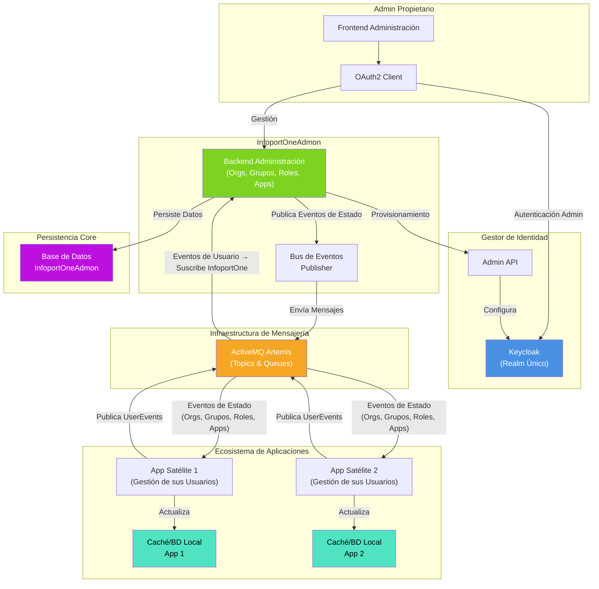
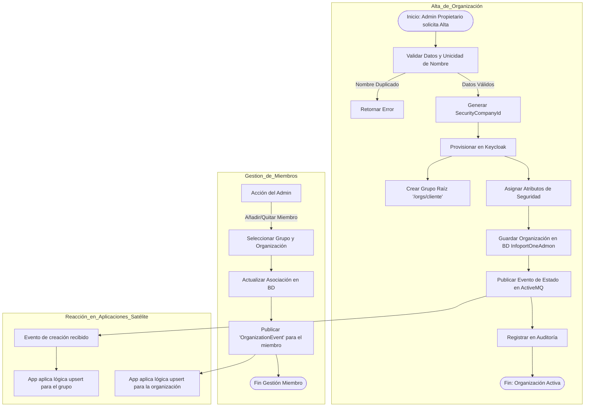
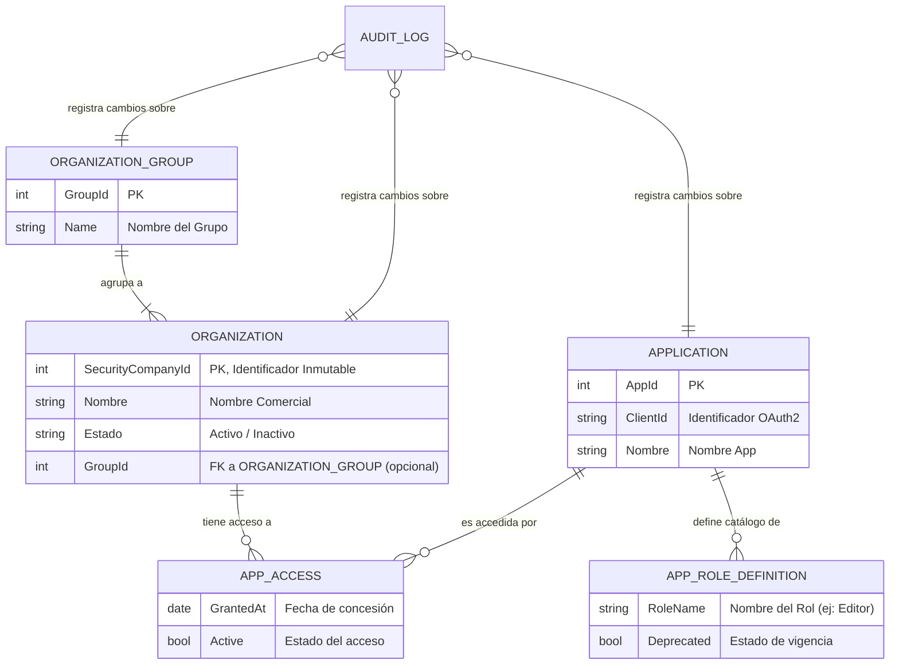
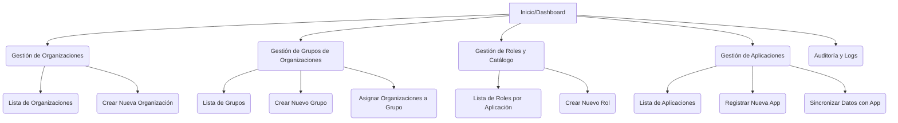

# 🧭 1. InfoportOneAdmon - Sistema de Gestión Centralizada de Organizaciones y Roles

## 📚 Tabla de Contenidos

1. [📝 1. Descripción General del Producto](#-1-descripción-general-del-producto)
2. [⚙️ 2. Funcionalidades Principales](#%EF%B8%8F-2-funcionalidades-principales)
3. [🏗️ 3. Arquitectura Lógica del Sistema](#%EF%B8%8F-3-arquitectura-lógica-del-sistema)
4. [📡 4. Eventos y Modelo de Mensajería](#-4-eventos-y-modelo-de-mensajería)
5. [🔀 5. Flujos de Proceso de Negocio](#-5-flujos-de-proceso-de-negocio)
6. [🗃️ 6. Modelo de Datos Conceptual](#%EF%B8%8F-6-modelo-de-datos-conceptual)
7. [🚀 7. Estrategia de Optimización y Rendimiento](#-7-estrategia-de-optimización-y-rendimiento)
8. [👥 8. Identificación y Clasificación de Stakeholders](#-8-identificación-y-clasificación-de-stakeholders)
9. [🧱 9. Componentes Principales y Sitemaps](#-9-componentes-principales-y-sitemaps)
10. [🎨 10. Diseño y Experiencia del Usuario (UX/UI)](#-10-diseño-y-experiencia-del-usuario-uxui)
11. [🛠️ 11. Requisitos Técnicos](#%EF%B8%8F-11-requisitos-técnicos)
12. [🗓️ 12. Planificación del Proyecto (MVP de 30 Horas)](#%EF%B8%8F-12-planificación-del-proyecto-mvp-de-30-horas)

---

## 📝 1. Descripción General del Producto

### 🌟 Visión del Producto

**InfoportOneAdmon** es la plataforma administrativa centralizada ("Back-Office") diseñada exclusivamente para que la **Organización Propietaria** del ecosistema gestione el ciclo de vida de los clientes (Organizaciones), sus agrupaciones, y la seguridad transversal de las aplicaciones satélites.

A diferencia de modelos SaaS de auto-servicio, en este ecosistema **las organizaciones no se registran por sí mismas**. Es la Organización Propietaria quien, a través de InfoportOneAdmon, da de alta, configura y provisiona los entornos para sus clientes, garantizando un control total sobre quién accede al ecosistema y cómo se relacionan entre sí.

**Misión**: Centralizar la complejidad administrativa (altas de clientes, grupos de clientes, seguridad OAuth2, catálogo de roles) para que las aplicaciones de negocio (CRM, ERP, etc.) puedan centrarse exclusivamente en su lógica funcional y en la gestión de sus propios usuarios.

### 🎯 Alcance y Responsabilidades

InfoportOneAdmon actúa como la **Fuente de la Verdad** para:

1.  **Gestión de Inquilinos (Tenants)**: Control del ciclo de vida de las organizaciones clientes.
2.  **Gestión de Grupos de Organizaciones**: Creación y mantenimiento de agrupaciones lógicas de organizaciones.
3.  **Catálogo Maestro de Roles**: Definición única de qué roles existen en cada aplicación.
4.  **Gobierno de Identidad**: Orquestación de Keycloak para la seguridad de las aplicaciones.

**🔑 PRINCIPIO CLAVE DE RESPONSABILIDAD**:
* **InfoportOneAdmon**: Define *quién* es el cliente (Organización), *cómo se agrupan* y *qué* roles existen (Definiciones).
* **Aplicaciones Satélite**: Gestionan *quiénes* son los usuarios finales y *qué* roles tienen asignados.

### 🧩 Principios de Diseño

| Principio | Descripción | Justificación de Negocio |
|-----------|-------------|--------------------------|
| **Administración Centralizada** | Gestión exclusiva por la Organización Propietaria | Control total sobre el onboarding y la estructura de clientes. |
| **Single Realm** | Un único realm (InfoportOne) en Keycloak | Simplifica la gestión de identidades y permite SSO real. |
| **Usuarios Descentralizados** | Las Apps crean sus propios usuarios | Permite a cada aplicación escalar y gestionar sus usuarios sin cuellos de botella centrales. |
| **Roles como Catálogo** | InfoportOneAdmon define, Apps asignan | Asegura coherencia en los nombres y flexibilidad en la asignación. |
| **State-Transfer-Oriented Events** | Los eventos no comunican la acción (creado, actualizado), sino el **estado final** de la entidad. | **Desacopla al consumidor del productor**. El consumidor no necesita conocer la historia; aplica la lógica "upsert" (si existe, actualiza; si no, crea) o borra si `IsDeleted` es true, haciendo el sistema más resiliente. |
| **Sincronización por Eventos**| La inicialización de datos en nuevas aplicaciones se realiza mediante la emisión de eventos desde InfoportOneAdmon | Asegura un bajo acoplamiento y permite a las aplicaciones inicializarse o resincronizarse bajo demanda y de forma asíncrona |
---

## ⚙️ 2. Funcionalidades Principales

### 2.1️⃣ Gestión de Organizaciones (Clientes)

**📝 Descripción**:
Este módulo permite a los administradores de la Organización Propietaria gestionar el ciclo de vida completo de las empresas clientes. Su objetivo es centralizar el alta administrativa y técnica en un solo paso.

**🧠 Capacidades**:
* ✅ **Onboarding de Clientes**: Alta de nueva organización, generando su `SecurityCompanyId`.
* 🛠️ **Gestión de Configuración**: Modificación de datos corporativos.
* 🔌 **Kill-Switch (Desactivación)**: Bloqueo de acceso de una organización.
* 🧾 **Auditoría de Tenant**: Trazabilidad completa de cambios.

### 2.2️⃣ Gestión de Grupos de Organizaciones

**📝 Descripción**:
Permite crear y gestionar agrupaciones lógicas de organizaciones. Estas agrupaciones son cruciales para las aplicaciones que necesitan implementar funcionalidades transversales entre varias organizaciones que pertenecen a un mismo "consorcio" o "holding".

**🧠 Capacidades**:
* 🆕 **Creación de Grupos**: Definir un nuevo grupo de organizaciones (ej: "Grupo Logístico Peninsular").
* 🔄 **Asociación de Miembros**: Añadir o eliminar organizaciones de un grupo existente.
* 🗑️ **Gestión del Ciclo de Vida**: Modificar o eliminar grupos.
* 📢 **Propagación de Cambios**: Cada cambio (creación, modificación, borrado de grupo, o cambio en sus miembros) genera un evento de estado que se publica en el bus para notificar a las aplicaciones.

### 2.3️⃣ Gestión de Definiciones de Roles (Catálogo)

**📝 Descripción**:
Funciona como un repositorio maestro de roles. Permite definir qué "perfiles" existen dentro de cada aplicación (ej: "Vendedor", "Gerente").

**🧠 Capacidades**:
* 📘 **Creación de Catálogo**: Definir nuevos roles para una aplicación.
* 🧪 **Deprecación**: Marcar roles como obsoletos.
* 🔎 **Consulta de Roles**: Endpoint para que las aplicaciones descarguen su lista de roles.

### 2.4️⃣ Gestión de Aplicaciones (Ecosistema)

**📝 Descripción**:
Permite registrar nuevas aplicaciones satélite en el ecosistema, gestionando su configuración de seguridad OAuth2.

**🧠 Capacidades**:
* 🆕 **Registro de Aplicación**: Alta de nueva app, generando `client_id` y `client_secret`.
* 🔐 **Gestión de Secretos**: Rotación y administración segura de credenciales.
* 🚦 **Control de Acceso**: Definir si una aplicación está activa o en mantenimiento.
* ✨ **Sincronización de Datos**: Funcionalidad para enviar catálogos completos (ej: de aplicaciones, de organizaciones) publicando al mismo tópico de la entidad un evento cuyo `Payload` contiene una lista de objetos. Esto evita la necesidad de tópicos especiales de sincronización.

### 2.5️⃣ Integración Transparente con Keycloak

**📝 Descripción**:
Abstrae la complejidad de Keycloak. Los administradores no necesitan acceder a su consola.

**🧠 Capacidades**:
* 🔄 **Sincronización de Estructuras**: Creación automática de grupos y atributos en Keycloak.
* 🧩 **Configuración de Claims**: Garantiza que los tokens incluyan el `SecurityCompanyId`.

### 2.6️⃣ Arquitectura Orientada a Eventos (ActiveMQ Artemis)

**📝 Descripción**:
Mecanismo de comunicación asíncrona basado en el patrón **"State Transfer Event"** para mantener la coherencia entre InfoportOneAdmon y las aplicaciones satélite. En lugar de notificar acciones (ej. "se creó X"), se notifica el **nuevo estado de la entidad**. Esto hace que los sistemas consumidores sean más robustos y fáciles de sincronizar.

**📣 Tópicos de Eventos Principales**:
Se define un tópico por cada entidad de negocio principal. Para sincronizaciones masivas se publica al mismo tópico de la entidad usando un `Payload` que contiene una lista de objetos.

*   `infoportone.events.organization`
*   `infoportone.events.organization-group`
*   `infoportone.events.application`
*   `infoportone.events.role`
*   `infoportone.events.user`

## 🏗️ 3. Arquitectura Lógica del Sistema

El siguiente diagrama ilustra cómo InfoportOneAdmon orquesta la seguridad y los datos maestros, sirviendo a las aplicaciones del ecosistema. **Nota importante**: Las aplicaciones satélite **nunca** invocan directamente a InfoportOneAdmon; toda la comunicación de datos maestros se realiza exclusivamente mediante eventos a través de ActiveMQ Artemis, garantizando un desacoplamiento total.



## 📡 4. Eventos y Modelo de Mensajería

En InfoportOneAdmon todos los mensajes de sincronización y notificación se realizan mediante eventos publicados en tópicos de ActiveMQ Artemis. Los eventos siguen un patrón de "State Transfer": se publica el estado final de las entidades y los consumidores aplican operaciones idempotentes (upsert/delete) por cada elemento del `Payload`.

### 4.1️⃣ Tipos de Eventos
Se publicará un tópico por entidad de negocio principal. Cada evento transporta un `Payload` que es una lista de objetos del tipo correspondiente. Los tipos principales son:

- `infoportone.events.organization`: Eventos sobre organizaciones (clientes).
- `infoportone.events.organization-group`: Eventos sobre grupos de organizaciones.
- `infoportone.events.application`: Eventos sobre aplicaciones satélite.
- `infoportone.events.role`: Eventos sobre definiciones de roles.
- `infoportone.events.user`: Eventos publicados por las aplicaciones satélite cuando crean, actualizan o eliminan usuarios.

### 4.2️⃣ Estructura Genérica de los Eventos
Todos los eventos usan una estructura común. Importante: el campo `Payload` contiene una lista (array) de objetos de la entidad correspondiente. Cada objeto dentro del `Payload` debe incluir la propiedad `IsDeleted` para indicar si ese elemento debe borrarse o procesarse como creación/actualización.

```json
{
    "EventId": "3fa85f64-5717-4562-b3fc-2c963f66afa6",
    "TraceId": "00000000-0000-4000-8000-000000000000",
    "OriginApplicationId": 100,
    "EventType": "string",
    "EventTimestamp": "2025-12-10T10:00:00Z",
    "Payload": [
        {
            "<EntitySpecificFields>": "...",
            "IsDeleted": false
        }
    ]
}
```

Notas:
- `EventId`: identificador único del evento **debe ser un GUID/UUID (v4 preferido)**. Los productores deben generar un UUID válido para evitar colisiones y permitir trazabilidad.
- `TraceId`: identificador (GUID/UUID) que permite correlacionar eventos causados por una misma operación o flujo. Cuando un consumidor genere nuevos eventos derivados de uno recibido, debe propagar el `TraceId` original al nuevo evento para mantener la causalidad y facilitar el rastreo.
- `OriginApplicationId`: identificador (int) de la aplicación emisora del evento. Permite conocer qué aplicación generó el evento originalmente — útil para reglas de confianza, filtros de consumo, y para enrutar respuestas o eventos derivados de vuelta a la app origen.
- `EventType`: nombre que describe el evento (ej.: `OrganizationEvent`, `UserEvent`).
- `Payload`: lista de objetos completos donde cada objeto contiene su propio `IsDeleted`.

### 4.3️⃣ Ejemplo de Evento
Enviado al tópico `infoportone.events.organization`.

- **`EventType`**: `"OrganizationEvent"`
- **`Payload`**: Lista de objetos `ORGANIZATION`.

Ejemplo con un solo elemento en el `Payload`:

```json
{
    "EventId": "7c9e6679-7425-40de-944b-e07fc1f90ae7",
    "TraceId": "11111111-2222-4fff-8888-aaaaaaaaaaaa",
    "OriginApplicationId": 100,
    "EventType": "OrganizationEvent",
    "EventTimestamp": "2025-12-10T10:00:00Z",
    "Payload": [
        {
            "SecurityCompanyId": 12345,
            "Nombre": "Cliente Final S.L.",
            "Estado": "Activo",
            "GroupId": 101,
            "IsDeleted": false
        }
    ]
}
```

Si un elemento debe representar una eliminación, incluya `"IsDeleted": true` en el propio objeto dentro del `Payload`.


### 4.4️⃣ Lógica del Consumidor
1. Suscribirse al tópico correspondiente (ej.: `infoportone.events.organization`).
2. Deserializar el `Payload` como una lista/array de objetos de la entidad.
3. Para cada objeto `o` en `Payload`:
     - Si `o.IsDeleted` es `true`:
                - Ejecutar la operación de borrado/desactivación correspondiente (`DELETE` o marcar como `disabled`).
     - Si `o.IsDeleted` es `false`:
                - Buscar por el identificador de la entidad (ej.: `SecurityCompanyId` para Organization`).
                - Si existe: `UPDATE` con los nuevos campos.
                - Si no existe: `INSERT`.

Este patrón permite procesar sincronizaciones masivas y simplifica la lógica del consumidor, que debe ser idempotente y tolerante a reordenamientos.

### 4.5️⃣ Clases y Propiedades en el Payload (por Evento)
Cada evento transporta en su `Payload` una lista de objetos cuya estructura depende de la entidad. Todas las clases deben incluir la propiedad `IsDeleted` (boolean) para indicar si el elemento debe ser eliminado o procesado como creación/actualización.

- **Organization** (ejemplo de objeto dentro de `Payload` en `OrganizationEvent`):
    - `SecurityCompanyId` (int): Identificador único inmutable de la organización.
    - `Nombre` (string): Nombre comercial.
    - `Estado` (string): Estado lógico (`Activo` / `Inactivo`).
    - `GroupId` (int, opcional): Identificador del grupo al que pertenece.
    - `IsDeleted` (bool): `true` si la organización debe eliminarse/desactivarse.

- **OrganizationGroup** (en `OrganizationGroupEvent`):
    - `GroupId` (int): Identificador del grupo.
    - `Name` (string): Nombre del grupo.
    - `IsDeleted` (bool): `true` si el grupo debe eliminarse.

- **Application** (en `ApplicationEvent`):
    - `AppId` (int): Identificador de la aplicación en InfoportOne.
    - `ClientId` (string): Identificador OAuth2.
    - `Nombre` (string): Nombre de la aplicación.
    - `IsDeleted` (bool): `true` si la aplicación debe considerarse eliminada o deshabilitada.

- **Role** (en `RoleEvent`):
    - `RolId` (int): Identificador único del rol (PK dentro de InfoportOne).
    - `RoleName` (string): Nombre único del rol dentro de la aplicación.
    - `ApplicationId` (int): Referencia a la aplicación propietaria del rol.
    - `Deprecated` (bool): Marca si el rol está obsoleto.
    - `IsDeleted` (bool): `true` si el rol debe borrarse.

- **User** (en `UserEvent`):
    - `UserId` (string): Identificador único del usuario (puede ser legible por humanos o GUID generado por la app).
    - `Username` (string): Nombre de usuario para login.
    - `Email` (string): Correo electrónico.
    - `SecurityCompanyId` (int): Organización a la que pertenece el usuario.
    - `Attributes` (object): Mapa de atributos opcionales (displayName, phone, etc.).
    - `Rols` (array[int]): Lista de `RolId` (enteros) asignados al usuario desde la aplicación de origen.
    - `IsDeleted` (bool): `true` si el usuario debe eliminarse o deshabilitarse en Keycloak.

Estas definiciones permiten a los consumidores deserializar de forma segura cada elemento del `Payload` y aplicar la lógica por objeto (upsert o delete) usando el flag `IsDeleted`.

## 🔀 5. Flujos de Proceso de Negocio

### 5.1️⃣ Alta de Nueva Organización (Onboarding)
Publica un `OrganizationEvent` cuyo `Payload` contiene uno o varios objetos `Organization`. Cada objeto incluye su propio campo `IsDeleted` (`false` para una creación/actualización).



### 5.2️⃣ Sincronización de Datos para una Nueva Aplicación
Cuando se necesita inicializar o resincronizar una aplicación, InfoportOneAdmon publica en el mismo tópico de la entidad un evento cuyo `Payload` contiene una lista de objetos (p. ej. múltiples `Organization`), que la aplicación consume para poblar su caché o base de datos local.

```mermaid
graph TD
    Start([Inicio: Admin solicita Sincronización]) --> SelectApp[Seleccionar Aplicación Destino]
    SelectApp --> SelectData[[Elegir el Catálogo a Enviar<br/>Ej: Organizaciones]]

    SelectData --> FetchData[InfoportOneAdmon recopila los datos]
    FetchData --> BuildEvent[Construir Evento con Payload (lista de objetos)]

    BuildEvent --> Publish[Publicar Evento en el tópico de la Entidad<br/>(ej: infoportone.events.organization)]
    Publish --> End([Fin: Datos enviados para procesado asíncrono])

    subgraph Procesamiento_en_la_Aplicación_Satélite
        Publish -->|Consumo| AppConsumer[La nueva App consume el evento]
        AppConsumer --> AppInit[App inicializa su base de datos/cache local procesando la lista]
    end
```

### 5.3️⃣ Autenticación y Autorización (Vista de Usuario Final)

Cómo un usuario de una Organización Cliente accede a una App Satélite. InfoportOneAdmon no participa activamente en el login (solo configuró el entorno previamente), pero su configuración es vital.


### 5.4️⃣ Gestión de Usuarios desde Aplicaciones Satélite

Las aplicaciones satélite gestionan sus propios usuarios. Cada vez que una aplicación crea, actualiza o elimina un usuario, publicará un evento en el tópico `infoportone.events.user` con un `Payload` que contiene una lista de objetos `USER`. InfoportOne se suscribe a este tópico para replicar los cambios necesarios en Keycloak mediante su Admin API.

Reglas clave:
- Un usuario pertenece a una única organización identificada por `SecurityCompanyId`.
- El `Payload` es una lista; puede contener uno o varios usuarios (sincronización masiva o individual).

Ejemplo de `UserEvent` (un solo usuario en la lista):

```json
{
    "EventId": "9f8c5a7e-3b2d-4c6f-8a1b-0123456789ab",
    "OriginApplicationId": 100,
    "EventType": "UserEvent",
    "EventTimestamp": "2025-12-11T09:00:00Z",
    "Payload": [
        {
            "UserId": "user-123",
            "Username": "maria.perez",
            "Email": "maria.perez@cliente.com",
            "SecurityCompanyId": 12345,
            "IsDeleted": false,
            "Attributes": {
                "displayName": "María Pérez"
            }
        }
    ]
}
```

Lógica de consumidor (InfoportOne):
1. Suscribirse al tópico `infoportone.events.user`.
2. Deserializar `Payload` como una lista de objetos `USER`.
3. Para cada usuario `u`:
     - Si `u.IsDeleted` es `true`: eliminar o desactivar el usuario en Keycloak (`DELETE` o marcar `disabled`).
     - Si `u.IsDeleted` es `false`:
             - Buscar por `UserId` o `username` en Keycloak.
             - Si existe: actualizar atributos y roles en Keycloak según lo recibido.
             - Si no existe: crear el usuario en Keycloak y asignarle los atributos, además de asociarlo a la organización (mediante claim `SecurityCompanyId` o atributo en Keycloak).

Nota: La sincronización debe ser idempotente y tolerante a reordenamientos; por ello cada evento contiene el estado final del/los usuarios.

## 🗃️ 6. Modelo de Datos Conceptual

A continuación, se presentan las entidades principales que maneja InfoportOneAdmon, incluyendo la relación con los grupos de organizaciones.



### 🧱 Entidades Clave

1.  **OrganizationGroup**: Nueva entidad que representa una agrupación lógica de clientes (Organizaciones). Permite a las aplicaciones consultar si dos organizaciones pertenecen al mismo grupo.
2.  **Organization**: Representa al cliente. Ahora incluye una referencia opcional a `OrganizationGroup`. Su `SecurityCompanyId` sigue siendo el pilar de la seguridad.
3.  **Application**: Representa un software del ecosistema.
4.  **AppRoleDefinition**: Plantilla de un rol.
5.  **AuditLog**: Registro inmutable, ahora también audita cambios en `OrganizationGroup`.

## 🚀 7. Estrategia de Optimización y Rendimiento

1. **Desacoplamiento mediante ActiveMQ Artemis**
El uso de un bus de mensajes empresarial garantiza que si una aplicación satélite está caída durante una actualización administrativa (ej: una organización se añade a un grupo), el cambio se procesará cuando la aplicación se reconecte.

2. **Estrategia de Caché e Inicialización en Aplicaciones**
Se modifica el enfoque para eliminar el acoplamiento en el arranque y favorecer un modelo de "push".

*   **Fuente de la Verdad**: InfoportOneAdmon es la fuente de la verdad para datos maestros (organizaciones, grupos, roles, aplicaciones).
*   **Prohibida la Sincronización en el Arranque**: Las aplicaciones **NO deben** conectarse a la API de InfoportOneAdmon para sincronizar datos al iniciar. Esto crea un acoplamiento fuerte y puede causar fallos en cascada.
*   **Inicialización por Eventos**: Cuando se despliega una nueva aplicación, o cuando se necesita una resincronización, un administrador desde InfoportOneAdmon **dispara un proceso de sincronización**. Este proceso publica uno o varios eventos masivos (ej: `FullOrganizationListRequested`) a una cola dedicada para esa aplicación. La aplicación consume estos mensajes a su propio ritmo para poblar su caché o base de datos local.
*   **Mantenimiento de Caché**: La caché local se mantiene actualizada escuchando los eventos de estado de los tópicos principales.

3. **Seguridad Stateless (Tokens)**
La validación de seguridad en tiempo de ejecución se basa en el estándar *JWT (JSON Web Tokens)*.

* El token es autosuficiente: contiene el `SecurityCompanyId`.
* InfoportOneAdmon no es consultado para validar tokens; esta validación es matemática (criptografía) y local en cada app, garantizando máxima velocidad.

4. **Auditoría Asíncrona**
El registro de auditoría no bloquea la operación principal. Se procesa en segundo plano para asegurar una experiencia de usuario fluida para el administrador.

## 👥 8. Identificación y Clasificación de Stakeholders

A continuación, se presenta la lista de partes interesadas clave para el proyecto **InfoportOneAdmon**, clasificadas según su rol, interés y nivel de influencia en la plataforma de administración centralizada.

---

### 🧑‍💼 Partes Interesadas Primarias (Usuarios y Decisiones)

| Categoría | Stakeholder | Interés Principal | Impacto de InfoportOneAdmon |
| :--- | :--- | :--- | :--- |
| **Usuarios Directos / Operacionales** | **Administradores de la Organización Propietaria** | Ejecutar el *onboarding* de nuevos clientes y la gestión del catálogo maestro de roles. | Son los **usuarios finales** de la plataforma. Necesitan una interfaz eficiente y un 100% de disponibilidad para garantizar el servicio a los clientes. |
| **Compradores / Financiadores** | **Dirección Ejecutiva (CEO, CTO, Sponsors del Proyecto)** | Retorno de la inversión (ROI), escalabilidad del ecosistema y control centralizado del negocio B2B. | **Aprueban el presupuesto** y definen la estrategia del modelo multi-organización. Son los responsables de negocio. |
| **Fabricantes / Desarrollo** | **Equipo de Desarrollo de InfoportOneAdmon** | Definición técnica, estabilidad del código, correcta integración con Keycloak y ActiveMQ Artemis. | Responsables de la **implementación técnica** y del mantenimiento. Son clave para la calidad y el rendimiento. |
| **Asistencia al Cliente** | **Equipo de Soporte y Operaciones (Tier 2/3)** | Diagnóstico rápido de problemas de acceso, autenticación, y estado (activo/inactivo) de una organización cliente. | Necesitan **herramientas de búsqueda y registros de auditoría claros** para reducir el tiempo de resolución (MTTR) de las incidencias de clientes. |

---

### 🤝 Partes Interesadas Secundarias (Consumidores y Proveedores)

| Categoría | Stakeholder | Interés Principal | Impacto de InfoportOneAdmon |
| :--- | :--- | :--- | :--- |
| **Socios Internos (Apps)** | **Equipos de Desarrollo de Aplicaciones Satélite** | Consumo estable de la API de roles y del bus de eventos de **ActiveMQ Artemis**. Validación del `SecurityCompanyId` en el token. | Son **consumidores de la información maestra** de InfoportOneAdmon. La estabilidad de este sistema es crucial para su desarrollo y operación. |
| **Socios Externos / Proveedores** | **Proveedores de Tecnología (Keycloak, ActiveMQ Artemis)** | Garantizar la estabilidad y el soporte de los componentes clave de infraestructura orquestados por InfoportOneAdmon. | El proyecto depende de la salud y el rendimiento de estos servicios de terceros. |
| **Usuarios Finales (de las Organizaciones Clientes)** | **Usuarios finales de las Apps Satélite** | Acceso ininterrumpido (SSO) y correcta asignación de roles y permisos funcionales. | Su experiencia de acceso y seguridad está determinada por la **configuración orquestada** a través de InfoportOneAdmon, aunque no interactúan directamente con él. |

---

### 🏛️ Partes Interesadas de Gobierno y Mercado

| Categoría | Stakeholder | Interés Principal | Impacto de InfoportOneAdmon |
| :--- | :--- | :--- | :--- |
| **Instancias Reguladoras** | **Asesoría Legal y Equipo de Seguridad (CISO)** | Garantizar el *compliance* (cumplimiento) de la segregación de datos por organización y la trazabilidad de todos los cambios administrativos. | El sistema debe proveer la **evidencia de auditoría** (logs) necesaria para demostrar el aislamiento de tenants y el control de acceso. |
| **Marketing y Ventas** | **Equipo de Ventas B2B y Marketing** | Capacidad de promocionar y asegurar un proceso de *onboarding* de clientes rápido, estandarizado y de alta seguridad a nuevos prospectos. | La eficiencia del módulo de `Gestión de Organizaciones` es un **argumento de venta (USP)** fundamental para la adquisición de nuevos clientes. |
| **Minoristas / Distribuidores** | **N/A** | N/A. | El proyecto **InfoportOneAdmon** es un sistema B2B interno de gestión administrativa y no tiene relación con el canal minorista o distribución física. |

## 🧱 9. Componentes Principales y Sitemaps

### 8.1. Componentes Principales (Estructura Lógica)

El sistema **InfoportOneAdmon** se compone de tres módulos internos de aplicación y tres sistemas de infraestructura crítica, desacoplados mediante una arquitectura orientada a eventos (EDA) utilizando **ActiveMQ Artemis**.

| Componente | Rol en el Ecosistema | Interacción con Otros Sistemas |
| :--- | :--- | :--- |
| **Módulo de Organizaciones** | Gestiona el ciclo de vida de los clientes (alta, activación, desactivación). | Escribe en la Base de Datos. Utiliza el **Servicio de Orquestación** para interactuar con Keycloak. |
| **Módulo Catálogo de Roles** | Define y almacena las plantillas de roles. | Publica eventos de estado en **ActiveMQ Artemis**. |
| **Módulo de Aplicaciones** | Registra nuevas aplicaciones satélite y gestiona sus credenciales OAuth2 (`client_id`, `client_secret`). | Utiliza el **Servicio de Orquestación** para dar de alta clientes en Keycloak. |
| **Servicio de Orquestación Keycloak** | Microservicio interno que traduce las acciones de negocio (ej. "Crear Org") en llamadas administrativas a Keycloak. | **Keycloak Admin API**. |
| **ActiveMQ Artemis** | Bus de mensajería empresarial. Garantiza la entrega asíncrona y la coherencia de datos entre InfoportOneAdmon y las aplicaciones satélite. | **Aplicaciones Satélite** (Consumidores) y **InfoportOneAdmon** (Productor). |
| **Base de Datos Core** | Persistencia de la fuente de la verdad: lista de organizaciones, definiciones de roles y registros de auditoría. | **Módulos de InfoportOneAdmon**. |

### 8.2. Sitemap (Navegación Administrativa)

La navegación del administrador propietario debe ser sencilla y basarse en las entidades clave del negocio.



## 🎨 10. Diseño y Experiencia del Usuario (UX/UI)

El diseño de **InfoportOneAdmon** se centrará en la **usabilidad para el rol especializado de administración**, priorizando la seguridad y la claridad sobre la estética visual avanzada. La audiencia son usuarios *expertos* que ejecutan tareas críticas.

### 9.1. Principios de Usabilidad

* 🔍 **Claridad en Aislamiento**: Cada acción relacionada con una organización (tenant) debe mostrar claramente el `SecurityCompanyId` afectado para evitar errores de gestión. El identificador único debe ser visible en el contexto de cualquier operación de modificación o eliminación.
* 📊 **Diseño Orientado al Dato (Data-Driven)**: Interfaz basada en tablas de datos filtrables, ordenables y paginadas. El administrador pasa la mayor parte del tiempo revisando listas de organizaciones, roles y logs.
* 🧭 **Flujos Lineales para Tareas Críticas**: El proceso de **"Crear Nueva Organización"** será un asistente (wizard) paso a paso, ya que es una operación de alta criticidad que debe ser auditable y minimizando la posibilidad de omisión de datos.
* ✨ **Minimalismo Funcional**: Evitar decoraciones innecesarias. La interfaz debe ser rápida y responsiva, enfocada en la eficiencia del flujo de trabajo del administrador.

### 9.2. Especificaciones de Diseño (Estándares)

| Aspecto | Especificación | Objetivo UX/UI |
| :--- | :--- | :--- |
| **Identidad Visual** | Uso de una paleta de colores corporativos. Uso de colores de alerta (rojo/ámbar) para señalar acciones irreversibles (ej. Desactivar Organización, Eliminar Rol). | Reforzar la identidad de marca y alertar visualmente sobre acciones de alto impacto y riesgo. |
| **Controles de Entrada** | Uso de *Dropdowns* con búsqueda (Searchable Select) para seleccionar Aplicaciones y Roles. | Reducir errores de tipeo y aumentar la velocidad en la gestión de catálogos extensos. |
| **Feedback del Sistema** | Notificaciones **asíncronas** de éxito/error. Por ejemplo, "Organización creada, sincronizando en Keycloak...". | Informar al usuario sobre los procesos que se ejecutan en segundo plano (arquitectura Event-Driven) para evitar la percepción de lentitud. |
| **Usabilidad Móvil** | **Prioridad Baja (Administración)**. La interfaz se diseñará y optimizará primariamente para **Desktop** (resoluciones de 1920x1080 o superior), dado que es una aplicación de back-office de uso especializado. | Concentrar recursos en la experiencia de escritorio del administrador donde se realizan las tareas más complejas. |

## 🛠️ 11. Requisitos Técnicos

### 10.1. Stack Tecnológico Principal

El core de **InfoportOneAdmon** debe construirse sobre tecnologías probadas y escalables, dada su función como sistema central de seguridad y administración.

| Requisito | Especificación | Justificación |
| :--- | :--- | :--- |
| **Backend Lenguaje/Runtime** | ASP.NET Core C#. Framework Helix6. | Entornos robustos, con alto rendimiento en microservicios y excelente soporte para la construcción de APIs REST. |
| **Frontend Lenguaje/Runtime** | Angular 20. | Cliente SPA muy adecuado para e desarrollo en este proyecto. |
| **Base de Datos** | PostgreSQL. | Se requiere un motor de base de datos relacional para garantizar la integridad transaccional (ACID) y la capacidad de realizar auditoría detallada y transacciones de alta criticidad. |
| **Servicio de Identidad** | **Keycloak** (Configurado como un Realm Único llamado `InfoportOne`). | Estándar de facto para OpenID Connect y OAuth2, necesario para la seguridad transversal de todo el ecosistema de aplicaciones satélite. |
| **Mensajería** | **ActiveMQ Artemis**. | Bus de mensajería empresarial para la arquitectura Event-Driven. Garantiza la entrega asíncrona confiable de eventos críticos. |
| **Despliegue** | Contenedores Docker. | Máxima escalabilidad horizontal, resiliencia y despliegue automatizado para un servicio de la plataforma Core. |

### 10.2. Aspectos Técnicos Críticos

* **📡 API y Estructura de Datos**:
    * 🔗 **Interactividad (REST)**: La API de InfoportOneAdmon debe ser 100% RESTful, desacoplada y utilizar versiones (ej. `/v1/`).
    * 📄 **Paginación Obligatoria**: Todos los *endpoints* que devuelvan listas de recursos (Organizaciones, Roles, Logs) deben implementar la **Paginación Obligatoria** (`skip`/`take` o similar) para evitar problemas de rendimiento y sobrecarga de la base de datos.
    * 🧠 **Caching**: Implementar una capa de caché de solo lectura (ej. Redis) para la consulta del Catálogo de Roles, ya que será un *endpoint* de alta concurrencia consultado por las aplicaciones satélite.

* **🔐 Seguridad y Confidencialidad**:
    * 🗝️ **Almacenamiento de Secretos**: Todas las credenciales sensibles (ej. `client_secret` de las Apps) deben almacenarse **encriptadas en reposo** utilizando un almacén de secretos dedicado (como Azure Key Vault, AWS Secrets Manager o HashiCorp Vault).
    * 🔒 **Orquestación Segura**: La comunicación entre InfoportOneAdmon y Keycloak (vía Admin API) debe realizarse siempre a través de un canal seguro (TLS/HTTPS).

* **📏 Normativas y Compliance**:
    * 🧱 **Aislamiento de Datos**: El diseño de la base de datos debe ser inherentemente *Tenant-Aware* o *Tenant-Safe* para garantizar que el `SecurityCompanyId` sea el factor principal de aislamiento, cumpliendo con la necesidad de segregación de datos.
    - **Auditoría (ISO 27001)**: El registro de auditoría (`AuditLog`) debe ser inmutable y registrar el *antes y el después* de los datos de todas las operaciones críticas (creación, modificación, desactivación). Esto es un requisito obligatorio para demostrar el control interno sobre el sistema.

## 🗓️ 12. Planificación del Proyecto (MVP de 30 Horas)

Dada la restricción de tiempo impuesta (30 horas) para la fase de definición e implementación del **PMV (Producto Mínimo Viable)**, el alcance del proyecto se reducirá a lo estrictamente necesario para validar el flujo más crítico y fundamental: **La creación exitosa de una Organización (Tenant) y su correcta orquestación de seguridad**.

### 11.1. Definición del Producto Mínimo Viable (PMV)

El PMV de 30 horas se enfocará exclusivamente en el **Flujo 1: Alta de Nueva Organización (Onboarding)**. Este PMV debe demostrar el funcionamiento de los tres pilares arquitectónicos: Base de Datos, Keycloak (Seguridad) y ActiveMQ Artemis (Mensajería).

| Requisito del PMV | Justificación |
| :--- | :--- |
| **Core Funcionalidad** | Creación de una Organización (registro de nombre y estado). |
| **Integración Requerida** | Orquestación exitosa con **Keycloak**: El sistema debe crear el grupo raíz y establecer los atributos de seguridad del tenant en el servidor de identidad. |
| **Desacoplamiento** | Publicación del evento de estado `OrganizationEvent` en **ActiveMQ Artemis**. |
| **Visibilidad** | Persistencia de los datos de la Organización en la Base de Datos Core y registro del evento en el Log de Auditoría. |

### 11.2. Hitos y Asignación de Horas (PMV) (30h)

La planificación se divide en cinco fases secuenciales y limitadas, que deben cumplirse para considerar el PMV como finalizado.

| Hito / Tarea | Módulo | Horas Estimadas | Dependencias | Criterio de Finalización |
| :--- | :--- | :--- | :--- | :--- |
| **Fase 1: Preparación del Entorno** | Arquitectura | **5h** | Ninguna | Repositorio inicial, configuración de conexiones a Base de Datos y *mock* / configuración básica de Keycloak y ActiveMQ Artemis. |
| **Fase 2: Módulo Organizaciones (Core)** | Organizaciones | **8h** | Fase 1 | Desarrollo de la lógica de negocio core. Entidad `Organization` persistida con el `SecurityCompanyId` generado. API `POST /organizations` funcional y auditada. |
| **Fase 3: Orquestación Keycloak** | Servicio Orquestación | **9h** | Fase 2 | Implementación de la capa de integración. Al crear una Org, se llama con éxito a la Admin API de Keycloak para crear el Grupo y asignar los atributos de seguridad. |
| **Fase 4: Mensajería (ActiveMQ Artemis)** | Bus de Eventos | **5h** | Fase 2 | Integración del productor. El evento `OrganizationEvent` se publica con éxito y es visible en el broker de mensajes. |
| **Fase 5: Test y Documentación** | Transversal | **3h** | Fases 2, 3, 4 | Flujo completo de *Onboarding* validado de extremo a extremo. Creación de tests unitarios/integración mínimos y documentación de la API del PMV finalizada. |
| **TOTAL** | | **30 Horas** | | **PMV Aceptado** |

### 11.3. Fases Restantes Tras el PMV (Hoja de Ruta Completa)

Una vez completado y aceptado el PMV (Flujo de Onboarding de Organización), el proyecto se enfocará en las siguientes fases, priorizando las funcionalidades administrativas críticas y los datos maestros (Catálogo de Roles y Apps).

| Fase | Objetivo Principal | Módulos Clave | Hitos a Completar |
| :--- | :--- | :--- | :--- |
| **Fase 6** | **Gestión Completa del Ciclo de Vida de la Organización** | Módulo Organizaciones, Orquestación Keycloak | 1. Implementación de la funcionalidad **Actualizar Datos** de la Organización. 2. Desarrollo del **Kill-Switch (Desactivación)** y su correspondiente sincronización en Keycloak (bloqueo de grupo). 3. Publicación del evento de estado crítico para desactivación. |
| **Fase 7** | **Catálogo Maestro de Roles (Definición)** | Módulo Catálogo de Roles | 1. Implementación de la API para **Crear y Modificar** la definición de Roles y sus Permisos. 2. API de consulta pública (lectura) para que las Apps Satélite descarguen su catálogo de roles. 3. Implementación de los eventos de estado para roles. |
| **Fase 8** | **Gestión de Aplicaciones y Credenciales** | Módulo de Aplicaciones, Orquestación Keycloak | 1. Implementación de la funcionalidad para **Registrar una Nueva Aplicación** en el ecosistema. 2. Orquestación Keycloak para generar el `client_id` y `client_secret` de la App. 3. Implementación segura del almacén de secretos (cifrado en reposo del `client_secret`). |
| **Fase 9** | **Operaciones y Cumplimiento (Compliance)** | Módulo de Auditoría y Logs, Transversal | 1. Finalización de la implementación del **Log de Auditoría Inmutable** para todas las operaciones críticas (Organizaciones, Roles, Apps). 2. Desarrollo de la interfaz de consulta para los equipos de Soporte. 3. Implementación de la capa de caché (ej. Redis) para el *endpoint* de consulta de Roles. |
| **Fase 10** | **Pruebas de Aceptación y Estabilidad** | Transversal | 1. Pruebas de Carga/Estrés en la API de Roles (para verificar la estrategia de caché). 2. Pruebas de Resiliencia del Bus de Eventos (ActiveMQ Artemis). 3. Documentación técnica completa para consumo de la API y los eventos. 4. **Pruebas de Aceptación del Usuario (UAT)** por parte de los Administradores Propietarios. |