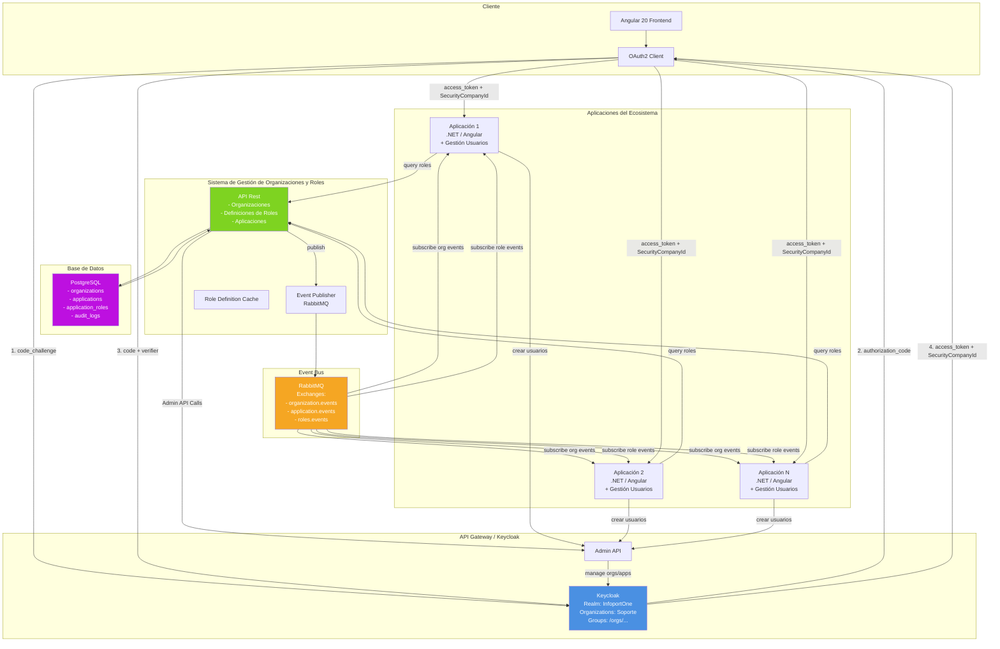
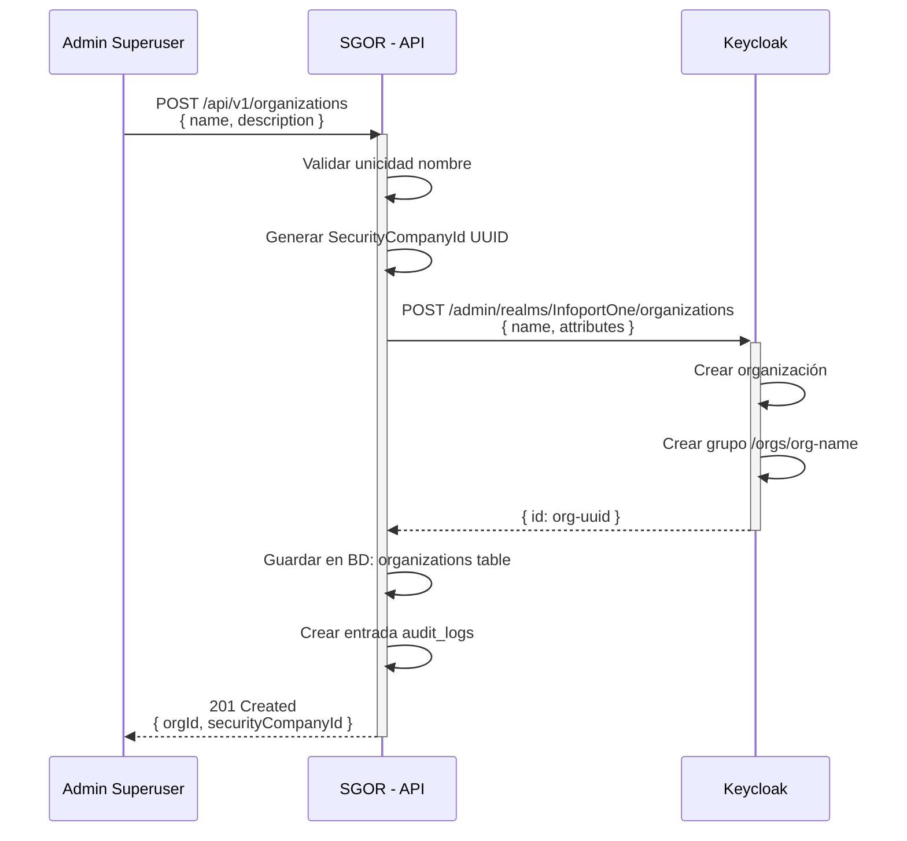
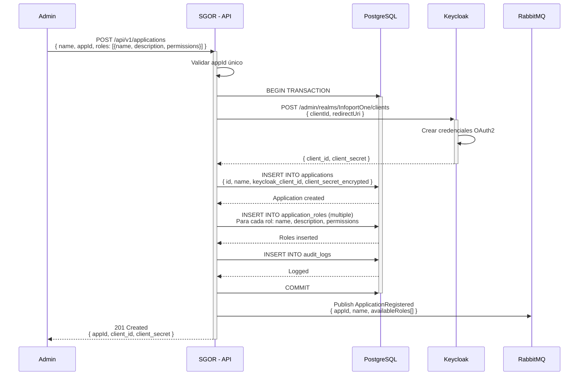
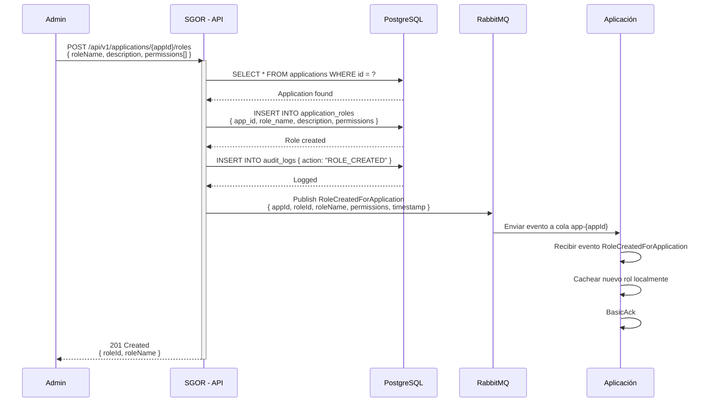
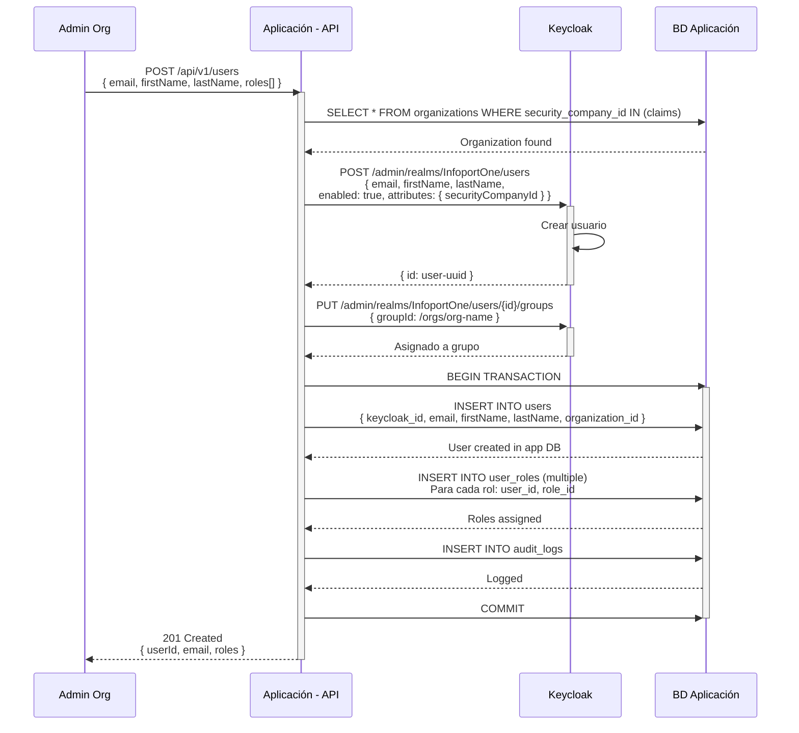
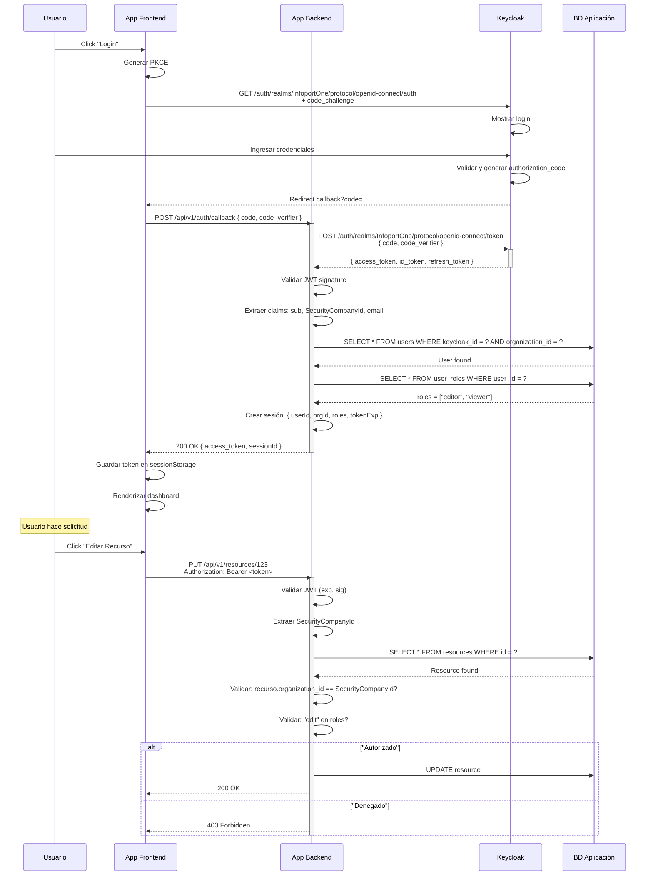
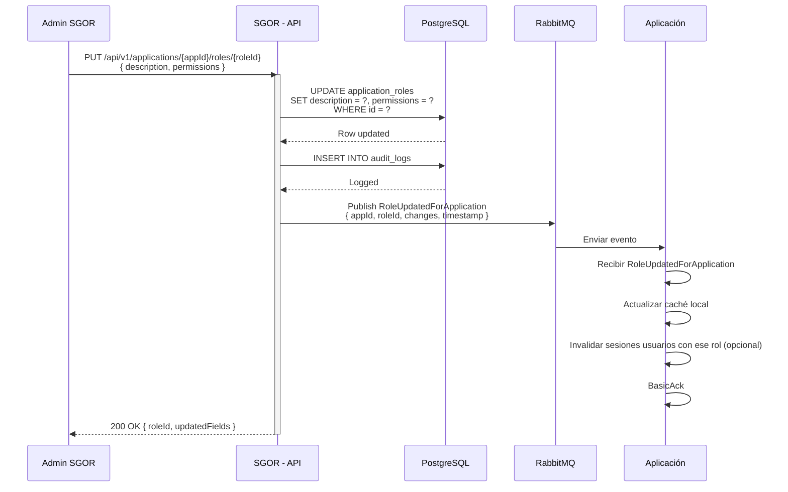
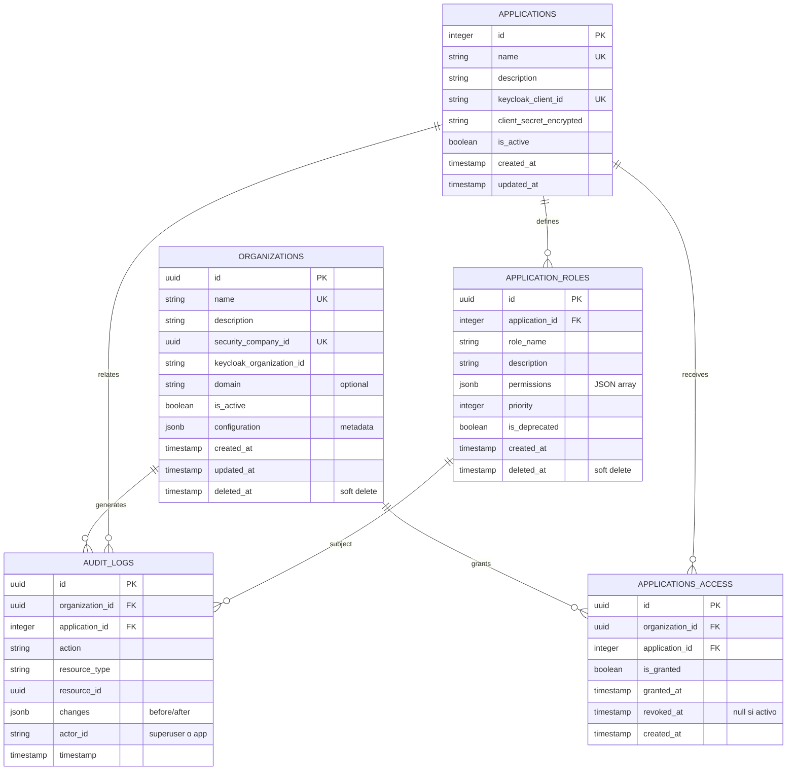

# Sistema de Gestión de Organizaciones y Roles - Arquitectura Simplificada

## Tabla de Contenidos

1. [Descripción General del Proyecto](#descripción-general-del-proyecto)
2. [Funcionalidades Principales](#funcionalidades-principales)
3. [Arquitectura del Sistema](#arquitectura-del-sistema)
4. [Casos de Uso Completos](#casos-de-uso-completos)
5. [Modelo de Datos](#modelo-de-datos)
6. [Patrones de Optimización Cloud](#patrones-de-optimización-cloud)

---

## Descripción General del Proyecto

### Visión General

El **Sistema de Gestión de Organizaciones y Roles (SGOR)** es una plataforma centralizada que gestiona:

- **Organizaciones**: Creación, configuración, activación y desactivación de tenants
- **Definiciones de Roles por Aplicación**: Catálogo de roles disponibles en cada aplicación con permisos
- **Credenciales OAuth2**: Generación de client_id/client_secret en Keycloak para aplicaciones
- **Autorización Distribuida**: Cada aplicación determina qué permisos tiene cada rol en su contexto

**PRINCIPIO CLAVE**: Las aplicaciones son responsables de:
- Crear y gestionar usuarios
- Asignar roles a usuarios
- Validar permisos efectivos en cada request
- Sincronizar cambios de roles con el token

### Propósito y Alcance

El SGOR actúa como **centro de registro y configuración**, proporcionando:

1. **Aislamiento de Datos**: Cada organización completamente aislada
2. **Definición Centralizada de Roles**: Catálogo único de roles por aplicación
3. **Gestión de Credenciales OAuth2**: Control centralizado de acceso a Keycloak
4. **Escalabilidad**: Soporte para miles de organizaciones y aplicaciones
5. **Independencia de Aplicaciones**: Cada app controla su propia autorización

### Principios de Diseño

| Principio | Descripción | Justificación |
|-----------|-------------|--------------|
| **Single Realm** | Un único realm (InfoportOne) en Keycloak | SSO centralizado, simple administración |
| **Descentralized Users** | Apps crean/gestionan usuarios | Escalabilidad, independencia de apps |
| **Centralized Roles** | SGOR define roles, apps asignan | Control coherente, auditoría centralizada |
| **Event-Driven** | RabbitMQ para notificaciones | Desacoplamiento, eventual consistency |
| **Token-Based** | OAuth2 PKCE + JWT claims | Stateless, seguro, optimizado |
| **Lazy Sync** | Cambios de roles via eventos | Reduce transacciones, costos bajos |

---

## Funcionalidades Principales

### 1. Gestión de Organizaciones

#### 1.1 Crear Organización
- **Input**: Nombre, descripción, configuración inicial
- **Proceso**:
  - Validar unicidad de nombre (case-insensitive)
  - Crear organización en BD del SGOR
  - Crear organización en Keycloak vía Admin API
  - Crear grupo raíz en Keycloak: `/orgs/{org_name}`
  - Generar `SecurityCompanyId` único (UUID)
- **Output**: `OrganizationId`, `SecurityCompanyId`
- **Eventos Publicados**:
  - `OrganizationCreated`: `{ organizationId, securityCompanyId, organizationName, timestamp }`

#### 1.2 Actualizar Organización
- **Input**: `OrganizationId`, campos (nombre, descripción, configuración)
- **Proceso**:
  - Validar existencia
  - Actualizar en BD con transacción
  - Sincronizar con Keycloak si necesario
  - Invalidar cachés en aplicaciones vía evento
- **Output**: Organización actualizada
- **Eventos**: `OrganizationUpdated`

#### 1.3 Desactivar/Activar Organización
- **Input**: `OrganizationId`, acción
- **Proceso**:
  - Cambiar flag `IsActive` en BD
  - Desactivar credenciales OAuth2 en Keycloak
  - Notificar a aplicaciones vía evento
- **Output**: Estado actualizado
- **Eventos**: `OrganizationDeactivated`, `OrganizationActivated`

#### 1.4 Eliminación Lógica
- **Input**: `OrganizationId`
- **Proceso**:
  - Soft delete: marcar como eliminada
  - Retener datos para auditoría
- **Output**: Confirmación
- **Eventos**: `OrganizationDeleted`

### 2. Gestión de Definiciones de Roles

#### 2.1 Crear Rol para Aplicación
- **Input**: `ApplicationId`, roleName, description, permissions (array JSON)
- **Proceso**:
  1. Validar que aplicación existe
  2. Validar unicidad de rol en aplicación
  3. Crear registro en BD (`ApplicationRole`)
  4. **NO crear en Keycloak**: Solo almacenamiento en SGOR
  5. Publicar evento para notificar aplicación
- **Output**: `RoleId`, configuración
- **Eventos**: `RoleCreatedForApplication`

**Ejemplo**:
```json
{
  "applicationId": 1,
  "roleName": "editor",
  "description": "Puede editar contactos y crear oportunidades",
  "permissions": ["contacts.view", "contacts.edit", "contacts.delete", "deals.view", "deals.create"]
}
```

#### 2.2 Actualizar Definición de Rol
- **Input**: `ApplicationId`, `RoleId`, cambios
- **Proceso**:
  - Validar rol existe
  - Actualizar en BD
  - Publicar evento (las apps decidirán qué hacer con usuarios existentes)
- **Output**: Rol actualizado
- **Eventos**: `RoleUpdatedForApplication`

#### 2.3 Deprecar/Eliminar Rol
- **Input**: `ApplicationId`, `RoleId`
- **Proceso**:
  - Marcar como deprecated o eliminar (soft delete)
  - Publicar evento para que aplicación migre usuarios
- **Output**: Confirmación
- **Eventos**: `RoleDeprecatedForApplication`

#### 2.4 Obtener Roles Disponibles de Aplicación
- **Input**: `ApplicationId`
- **Proceso**:
  - Query simple: `SELECT * FROM application_roles WHERE application_id = ? AND deleted_at IS NULL`
  - Resultado cacheado (TTL: 1 hora)
- **Output**: Lista de roles: `{ RoleId, RoleName, Description, Permissions[] }`
- **Eventos**: Ninguno

### 3. Gestión de Aplicaciones

#### 3.1 Registrar Aplicación
- **Input**: Nombre, descripción, `ApplicationId` (entero único), rolesDefinidas
- **Proceso**:
  1. Validar `ApplicationId` es único
  2. Crear registro en BD del SGOR
  3. Almacenar roles iniciales en `ApplicationRole`
  4. Generar credenciales OAuth2 en Keycloak (client_id, client_secret)
  5. Guardar referencia a client_id en BD SGOR (encriptado)
- **Output**: `ApplicationId`, OAuth2 credentials (solo en registro), configuración
- **Eventos**: `ApplicationRegistered`

#### 3.2 Actualizar Aplicación
- **Input**: `ApplicationId`, campos (nombre, descripción)
- **Proceso**:
  - Actualizar en BD
  - Sincronizar nombre en Keycloak si necesario
- **Output**: Aplicación actualizada
- **Eventos**: `ApplicationUpdated`

#### 3.3 Desactivar Aplicación
- **Input**: `ApplicationId`
- **Proceso**:
  - Cambiar flag `IsActive: false`
  - Desactivar credenciales OAuth2 en Keycloak
  - Publicar evento para que aplicación cierre acceso
- **Output**: Aplicación desactivada
- **Eventos**: `ApplicationDeactivated`

#### 3.4 Obtener Credenciales de Aplicación
- **Input**: `ApplicationId`
- **Proceso**:
  - Validar autorización (solo superuser)
  - Recuperar y desencriptar client_secret
  - **NUNCA retornar a clientes no autenticados**
- **Output**: `{ client_id, client_secret }` (solo para superuser)
- **Eventos**: Ninguno

### 4. Integración con Keycloak

#### 4.1 Sincronización de Organizaciones
- **Proceso**:
  - SGOR crea organización en BD
  - SGOR invoca: `POST /admin/realms/InfoportOne/organizations`
  - Keycloak crea organización y grupo raíz
  - SGOR almacena `keycloakOrganizationId` para futuras llamadas
- **Mapeo**:
  - `Organization.Name` → `Organization.name` en Keycloak
  - `Organization.SecurityCompanyId` → `Organization.attributes.securityCompanyId`

#### 4.2 Token Claims y Mappers
- **Token Mapper en Keycloak** (tipo Script):
  ```javascript
  // Mapper: "SecurityCompanyId Claim"
  var orgId = user.getAttribute('securityCompanyId');
  if (orgId) {
    token.addClaim('SecurityCompanyId', orgId);
  }
  ```

- **Claims Típicos en Access Token**:
  ```json
  {
    "sub": "user-uuid",
    "email": "user@company.com",
    "organization": "org-name",
    "SecurityCompanyId": "xxxxxxxx-xxxx-xxxx-xxxx-xxxxxxxxxxxx",
    "realm_access": { "roles": ["user"] }
  }
  ```

#### 4.3 Flujo OAuth2 PKCE (Code Authorization)
- Aplicación inicia login con code_challenge
- Usuario autoriza en Keycloak
- Keycloak retorna authorization_code
- Aplicación backend intercambia code+verifier por access_token
- Token contiene `SecurityCompanyId` para validar acceso a datos
- **NOTA**: Roles específicos de aplicación NO viajan en token, vienen via eventos

### 5. Event-Driven Architecture (RabbitMQ)

#### 5.1 Publicación de Eventos desde SGOR

**Exchanges en RabbitMQ**:
- `organization.events` (fanout) - Eventos a todas las apps
- `application.events` (topic) - Eventos específicos por app
- `roles.events` (topic) - Cambios de roles: `roles.{appId}.{action}`

**Eventos Publicados**:

| Evento | Cuando | Payload | Consumidores |
|--------|--------|---------|--------------|
| `OrganizationCreated` | Nueva org | `{ orgId, securityCompanyId, name, timestamp }` | Todas las apps |
| `OrganizationUpdated` | Org modificada | `{ orgId, changes, timestamp }` | Todas las apps |
| `OrganizationDeactivated` | Org desactivada | `{ orgId, timestamp }` | Todas las apps |
| `ApplicationRegistered` | App registrada | `{ appId, name, availableRoles[] }` | La app específica |
| `RoleCreatedForApplication` | Nuevo rol creado | `{ appId, roleId, roleName, permissions, timestamp }` | App específica |
| `RoleUpdatedForApplication` | Rol actualizado | `{ appId, roleId, changes, timestamp }` | App específica |
| `RoleDeprecatedForApplication` | Rol deprecado | `{ appId, roleId, newRoleName, timestamp }` | App específica |

#### 5.2 Patrón de Consumo en Aplicaciones

**Suscripción a cambios de roles**:
```csharp
// Aplicación escucha eventos de su aplicación
var queueName = $"app-{applicationId}-roles-queue";

channel.QueueDeclareAsync(queueName, durable: true, exclusive: false);
channel.QueueBindAsync(queueName, "roles.events", $"roles.{applicationId}.*");

var consumer = new AsyncEventingBasicConsumer(channel);
consumer.ReceivedAsync += async (model, ea) => {
    var body = ea.Body.ToArray();
    var message = Encoding.UTF8.GetString(body);
    var @event = JsonSerializer.Deserialize<RoleEvent>(message);
    
    switch (@event.Action) {
        case "created":
            // Cachear nuevo rol
            await _roleCache.AddRoleAsync(@event.RoleId, @event.RoleName, @event.Permissions);
            break;
        case "updated":
            // Actualizar caché y notificar usuarios activos
            await _roleCache.UpdateRoleAsync(@event.RoleId, @event.Changes);
            break;
        case "deprecated":
            // Marcar rol como deprecated, migrar usuarios
            await _roleCache.DeprecateRoleAsync(@event.RoleId);
            break;
    }
    
    await model.BasicAckAsync(ea.DeliveryTag, false);
};

await channel.BasicConsumeAsync(queueName, autoAck: false, consumer);
```

### 6. Flujos de Autenticación y Autorización

#### 6.1 Flujo de Autenticación del Usuario Final

```
Usuario
  ↓
[1] Click "Login" en App
  ↓
App Frontend redirige a Keycloak (PKCE)
  ↓
GET /auth/realms/InfoportOne/protocol/openid-connect/auth
  ?client_id=app-name
  &redirect_uri=https://app.com/callback
  &response_type=code
  &code_challenge=<PKCE>
  ↓
Usuario se autentica (email/password)
  ↓
Keycloak genera authorization_code
  ↓
Redirecciona: https://app.com/callback?code=...
  ↓
[2] App Backend intercambia code por token
  ↓
POST /auth/realms/InfoportOne/protocol/openid-connect/token
  {
    "grant_type": "authorization_code",
    "code": "...",
    "client_id": "app-name",
    "client_secret": "***",
    "code_verifier": "..."
  }
  ↓
[3] Keycloak retorna access_token con claims
  {
    "sub": "user-uuid",
    "email": "user@company.com",
    "SecurityCompanyId": "org-uuid",
    "organization": "company-name"
  }
  ↓
App almacena token en sesión segura
  ↓
Usuario autenticado
```

#### 6.2 Flujo de Autorización en Aplicación

```
Usuario hace solicitud a API protegida
  ↓
App extrae Authorization: Bearer <token>
  ↓
App valida JWT:
  - Signature (clave pública Keycloak)
  - Expiration
  - Audience
  ↓
App extrae SecurityCompanyId del token
  ↓
App consulta su caché local de roles:
  "¿Qué roles tiene este usuario?"
  ↓
App valida permisos efectivos:
  "¿El rol tiene permiso para esta acción?"
  ↓
[Permitido] ✓ Procesa solicitud
[Denegado] ✗ Retorna 403 Forbidden
```

**IMPORTANTE**: La app conoce sus propios roles y permisos. SGOR solo es el catálogo de definiciones.

### 7. Creación de Usuarios desde Aplicaciones

**Flujo simplificado** (sin participación de SGOR en gestión de usuarios):

```
Aplicación necesita crear usuario nuevo
  ↓
App invoca Keycloak Admin API directamente
  (o usa SGOR como proxy si necesita auditoría)
  ↓
POST /admin/realms/InfoportOne/users
  {
    "email": "new@company.com",
    "firstName": "John",
    "lastName": "Doe",
    "enabled": true,
    "attributes": {
      "securityCompanyId": "org-uuid"
    }
  }
  ↓
Keycloak crea usuario
  ↓
App asigna usuario a grupo Keycloak
  PUT /admin/realms/InfoportOne/users/{id}/groups
  { "groupId": "/orgs/company-name" }
  ↓
App almacena usuario en su BD con roles locales
  ↓
App publica evento (opcional, para auditoría global)
```

---

## Arquitectura del Sistema

### Diagrama de Arquitectura General



### Componentes Detallados

#### 1. Servidor de Identidades (Keycloak)

**Responsabilidades**:
- Almacenamiento centralizado de usuarios y credenciales
- Generación de access/refresh tokens OAuth2
- SSO entre aplicaciones del ecosistema
- Gestión de organizaciones y grupos jerárquicos
- Validación de autenticación

**NO hace** (lo hacen las apps):
- Gestión de usuarios individuales
- Asignación de roles por aplicación

#### 2. Sistema de Gestión de Organizaciones y Roles (.NET 8)

**Componentes**:

```
SGOR Service
├── API Controllers
│   ├── OrganizationController (CRUD organizaciones)
│   ├── ApplicationController (registro aplicaciones)
│   └── RoleController (definiciones de roles)
├── Application Services
│   ├── OrganizationApplicationService
│   ├── ApplicationApplicationService
│   └── RoleApplicationService
├── Domain Services
│   ├── OrganizationDomainService
│   └── PermissionDomainService
├── Infrastructure
│   ├── Keycloak AdminClient
│   ├── RabbitMQ Publisher
│   └── PostgreSQL Repository
└── Shared
    └── DTOs, Mappers, Exceptions
```

**Tecnologías**:
- ASP.NET Core 8
- Entity Framework Core + PostgreSQL
- MassTransit o RabbitMQ.Client (event publishing)
- Keycloak Admin REST Client
- Serilog + OpenTelemetry

#### 3. Event Bus (RabbitMQ)

**Topología**:
```
Exchanges:
├── organization.events (fanout)
│   └── Queues: app-1-org-events, app-2-org-events, ...
├── application.events (topic)
│   └── app.{appId}.* routing
└── roles.events (topic)
    └── roles.{appId}.* routing
```

#### 4. Base de Datos (PostgreSQL)

**Tablas principales** (ver sección [Modelo de Datos](#modelo-de-datos))

---

## Casos de Uso Completos

### Caso de Uso 1: Onboarding de Nueva Organización

#### Descripción
Un nuevo cliente (organización) se suscribe al ecosistema. Administrador SGOR provisiona la organización.

#### Actores
- **Administrador Superuser** (del SGOR)
- **SGOR - API**
- **Keycloak**

#### Flujo Principal



#### Postcondiciones
- Organización creada en BD del SGOR
- Organización creada en Keycloak con grupo
- Audit trail registrado

---

### Caso de Uso 2: Registrar Nueva Aplicación

#### Descripción
Administrador SGOR registra una nueva aplicación con roles disponibles.

#### Actores
- **Administrador Superuser** (SGOR)
- **SGOR - API**
- **Keycloak**

#### Flujo Principal



#### Postcondiciones
- Aplicación registrada en SGOR
- Credenciales OAuth2 creadas en Keycloak
- Roles almacenados en SGOR
- Aplicación notificada via evento (si escucha)

---

### Caso de Uso 3: Definir Nuevo Rol para Aplicación

#### Descripción
Administrador SGOR define nuevo rol para aplicación existente.

#### Actores
- **Administrador Superuser**
- **SGOR - API**
- **Aplicación** (consumer de evento)

#### Flujo Principal



#### Postcondiciones
- Rol definido en BD SGOR
- Evento publicado a RabbitMQ
- Aplicación actualizó caché local
- Audit trail registrado

---

### Caso de Uso 4: Crear Usuario en Aplicación

#### Descripción
Aplicación crea nuevo usuario en organización, asignándole roles.

#### Actores
- **Administrador Aplicación**
- **Aplicación - API**
- **Keycloak**
- **BD de Aplicación**

#### Flujo Principal



#### Postcondiciones
- Usuario creado en Keycloak
- Usuario creado en BD de Aplicación
- Roles asignados localmente
- Audit trail en aplicación

---

### Caso de Uso 5: Autenticación y Autorización

#### Descripción
Usuario final se autentica en aplicación y accede a recursos basado en roles locales.

#### Actores
- **Usuario Final**
- **Navegador**
- **App Frontend**
- **App Backend**
- **Keycloak**

#### Flujo Principal



#### Postcondiciones
- Usuario autenticado con access_token
- Sesión creada en aplicación
- Roles cargados desde BD de aplicación
- Autorización validada en cada request

---

### Caso de Uso 6: Cambio de Definición de Rol

#### Descripción
Administrador SGOR actualiza definición de rol. Aplicación recibe evento y reacciona.

#### Actores
- **Administrador SGOR**
- **SGOR - API**
- **Aplicación**

#### Flujo Principal



#### Postcondiciones
- Definición de rol actualizada en SGOR
- Evento publicado
- Aplicación actualizó caché
- Audit trail registrado

---

## Modelo de Datos

### Diagrama ER (Entity-Relationship)



### Esquema Detallado por Tabla

#### Tabla: `organizations`

```sql
CREATE TABLE organizations (
    id UUID PRIMARY KEY DEFAULT gen_random_uuid(),
    name VARCHAR(255) NOT NULL UNIQUE,
    description TEXT,
    security_company_id UUID NOT NULL UNIQUE,
    keycloak_organization_id VARCHAR(255),
    domain VARCHAR(255) UNIQUE,
    is_active BOOLEAN DEFAULT true,
    configuration JSONB DEFAULT '{}',
    created_at TIMESTAMP DEFAULT CURRENT_TIMESTAMP,
    updated_at TIMESTAMP DEFAULT CURRENT_TIMESTAMP,
    deleted_at TIMESTAMP,
    
    -- Índices
    INDEX idx_name (name),
    INDEX idx_security_company_id (security_company_id),
    INDEX idx_is_active (is_active),
    INDEX idx_deleted_at (deleted_at)
);

COMMENT ON TABLE organizations IS 'Organizaciones/tenants del ecosistema';
COMMENT ON COLUMN organizations.security_company_id IS 'Identificador único que viaja en token como claim';
```

**Ejemplo**:
```json
{
  "id": "550e8400-e29b-41d4-a716-446655440000",
  "name": "ACME Corporation",
  "security_company_id": "org-acme-12345",
  "keycloak_organization_id": "acme-corp-kc",
  "is_active": true,
  "created_at": "2025-12-01T10:00:00Z"
}
```

---

#### Tabla: `applications`

```sql
CREATE TABLE applications (
    id SERIAL PRIMARY KEY,
    name VARCHAR(255) NOT NULL UNIQUE,
    description TEXT,
    keycloak_client_id VARCHAR(255) NOT NULL UNIQUE,
    client_secret_encrypted TEXT NOT NULL,
    is_active BOOLEAN DEFAULT true,
    created_at TIMESTAMP DEFAULT CURRENT_TIMESTAMP,
    updated_at TIMESTAMP DEFAULT CURRENT_TIMESTAMP,
    
    -- Índices
    INDEX idx_name (name),
    INDEX idx_is_active (is_active),
    INDEX idx_keycloak_client_id (keycloak_client_id)
);

COMMENT ON TABLE applications IS 'Registro de aplicaciones en ecosistema';
COMMENT ON COLUMN applications.id IS 'ApplicationId entero usado en eventos';
COMMENT ON COLUMN applications.client_secret_encrypted IS 'Encriptado con KMS - nunca retornar a clientes';
```

**Ejemplo**:
```json
{
  "id": 1,
  "name": "CRM Application",
  "keycloak_client_id": "crm-app",
  "is_active": true,
  "created_at": "2025-10-01T08:00:00Z"
}
```

---

#### Tabla: `application_roles`

```sql
CREATE TABLE application_roles (
    id UUID PRIMARY KEY DEFAULT gen_random_uuid(),
    application_id INTEGER NOT NULL,
    role_name VARCHAR(100) NOT NULL,
    description TEXT,
    permissions JSONB DEFAULT '[]',
    priority INTEGER DEFAULT 0,
    is_deprecated BOOLEAN DEFAULT false,
    created_at TIMESTAMP DEFAULT CURRENT_TIMESTAMP,
    deleted_at TIMESTAMP,
    
    FOREIGN KEY (application_id) REFERENCES applications(id),
    
    -- Índices
    UNIQUE(application_id, role_name),
    INDEX idx_app_id_active (application_id, deleted_at),
    INDEX idx_deprecated (is_deprecated),
    INDEX idx_priority (priority DESC)
);

COMMENT ON TABLE application_roles IS 'Definiciones de roles por aplicación';
COMMENT ON COLUMN application_roles.permissions IS 'Array JSON de permisos granulares';
```

**Ejemplo**:
```json
{
  "id": "770e8400-e29b-41d4-a716-446655440002",
  "application_id": 1,
  "role_name": "editor",
  "description": "Puede editar y crear contactos",
  "permissions": [
    "contacts.view",
    "contacts.edit",
    "contacts.delete",
    "deals.view",
    "deals.create"
  ],
  "priority": 5,
  "is_deprecated": false,
  "created_at": "2025-10-01T08:00:00Z"
}
```

---

#### Tabla: `applications_access`

```sql
CREATE TABLE applications_access (
    id UUID PRIMARY KEY DEFAULT gen_random_uuid(),
    organization_id UUID NOT NULL,
    application_id INTEGER NOT NULL,
    is_granted BOOLEAN DEFAULT true,
    granted_at TIMESTAMP DEFAULT CURRENT_TIMESTAMP,
    revoked_at TIMESTAMP,
    created_at TIMESTAMP DEFAULT CURRENT_TIMESTAMP,
    
    FOREIGN KEY (organization_id) REFERENCES organizations(id),
    FOREIGN KEY (application_id) REFERENCES applications(id),
    
    -- Índices
    UNIQUE(organization_id, application_id),
    INDEX idx_org_id (organization_id),
    INDEX idx_app_id (application_id),
    INDEX idx_is_granted (is_granted)
);

COMMENT ON TABLE applications_access IS 'Control de acceso negocio: qué orgs acceden a qué apps';
```

---

#### Tabla: `audit_logs`

```sql
CREATE TABLE audit_logs (
    id UUID PRIMARY KEY DEFAULT gen_random_uuid(),
    organization_id UUID,
    application_id INTEGER,
    action VARCHAR(50) NOT NULL,
    resource_type VARCHAR(50) NOT NULL,
    resource_id VARCHAR(255),
    changes JSONB DEFAULT '{}',
    actor_id VARCHAR(255),
    actor_type VARCHAR(20) DEFAULT 'superuser',
    created_at TIMESTAMP DEFAULT CURRENT_TIMESTAMP,
    
    -- Índices
    INDEX idx_org_timestamp (organization_id, created_at DESC),
    INDEX idx_action (action),
    INDEX idx_created_at (created_at DESC),
    INDEX idx_resource (resource_type, resource_id)
);

COMMENT ON TABLE audit_logs IS 'Auditoría de todas las operaciones en SGOR';
```

**Ejemplo**:
```json
{
  "id": "990e8400-e29b-41d4-a716-446655440004",
  "organization_id": "550e8400-e29b-41d4-a716-446655440000",
  "application_id": 1,
  "action": "ROLE_UPDATED",
  "resource_type": "APPLICATION_ROLE",
  "resource_id": "770e8400-e29b-41d4-a716-446655440002",
  "changes": {
    "before": { "permissions": ["view"] },
    "after": { "permissions": ["view", "edit"] }
  },
  "actor_id": "admin-1",
  "actor_type": "superuser",
  "created_at": "2025-12-01T10:00:00Z"
}
```

---

### Relaciones Críticas

| Relación | Cardinalidad | Notas |
|----------|--------------|-------|
| Org → Apps | M:N | Vía `applications_access` |
| App → Roles | 1:N | Cada app define sus roles |
| Org → Audit | 1:N | Registro de cambios |
| App → Audit | 1:N | Registro de cambios |

---

## Patrones de Optimización Cloud

### 1. Reducción de Transacciones Database

#### a) Batch Operations
```csharp
// ❌ Ineficiente: N queries
foreach (var role in roles) {
    await _db.ApplicationRoles.AddAsync(role);
    await _db.SaveChangesAsync();
}

// ✅ Eficiente: 1 query
await _db.ApplicationRoles.AddRangeAsync(roles);
await _db.SaveChangesAsync();
```

#### b) Upsert Pattern
```sql
-- ❌ 2-3 queries
SELECT * FROM applications WHERE id = ?
IF EXISTS UPDATE ... ELSE INSERT ...

-- ✅ 1 query
INSERT INTO applications (id, name, description)
VALUES ($1, $2, $3)
ON CONFLICT (id) DO UPDATE SET
  name = $2,
  description = $3,
  updated_at = CURRENT_TIMESTAMP
RETURNING *;
```

#### c) Connection Pooling
```csharp
// Reutilizar conexiones
services.AddDbContext<SgorDbContext>(options =>
    options.UseNpgsql(
        connectionString,
        sqlOptions => {
            sqlOptions.CommandTimeout(30);
            sqlOptions.MaxRetryCount(3);
        }
    ),
    contextLifetime: ServiceLifetime.Transient
);
```

### 2. Caché de Roles

**Patrón Cache-Aside**:
```csharp
public class RoleDefinitionCache {
    private readonly IMemoryCache _cache;
    private readonly IDistributedCache _redis;
    private readonly SgorDbContext _db;
    
    public async Task<List<ApplicationRoleDto>> GetRolesAsync(int appId) {
        var cacheKey = $"roles:app:{appId}";
        
        // Nivel 1: Memory cache
        if (_cache.TryGetValue(cacheKey, out List<ApplicationRoleDto> roles)) {
            return roles;
        }
        
        // Nivel 2: Redis
        var redisCached = await _redis.GetStringAsync(cacheKey);
        if (redisCached != null) {
            roles = JsonSerializer.Deserialize<List<ApplicationRoleDto>>(redisCached);
            _cache.Set(cacheKey, roles, TimeSpan.FromMinutes(5));
            return roles;
        }
        
        // Nivel 3: BD (una sola query)
        roles = await _db.ApplicationRoles
            .Where(r => r.ApplicationId == appId && r.DeletedAt == null)
            .Select(r => new ApplicationRoleDto {
                Id = r.Id,
                RoleName = r.RoleName,
                Description = r.Description,
                Permissions = r.Permissions
            })
            .ToListAsync();
        
        // Almacenar en caché (TTL: 1 hora)
        _cache.Set(cacheKey, roles, TimeSpan.FromHours(1));
        await _redis.SetStringAsync(cacheKey, JsonSerializer.Serialize(roles),
            new DistributedCacheEntryOptions { 
                AbsoluteExpirationRelativeToNow = TimeSpan.FromHours(1) 
            });
        
        return roles;
    }
    
    public async Task InvalidateAsync(int appId) {
        var cacheKey = $"roles:app:{appId}";
        _cache.Remove(cacheKey);
        await _redis.RemoveAsync(cacheKey);
    }
}
```

### 3. Lazy Loading

**Cargar solo metadatos**:
```csharp
// ❌ Cargar todo
var org = await _db.Organizations
    .Include(o => o.Applications)
    .Include(o => o.AuditLogs) // Millones!
    .FirstOrDefaultAsync(o => o.Id == orgId);

// ✅ Cargar solo lo necesario
var org = await _db.Organizations
    .Where(o => o.Id == orgId)
    .Select(o => new OrganizationDto {
        Id = o.Id,
        Name = o.Name,
        SecurityCompanyId = o.SecurityCompanyId,
        IsActive = o.IsActive
    })
    .FirstOrDefaultAsync();

// ✅ Si necesitas aplicaciones, consulta por separado
var apps = await _db.ApplicationsAccess
    .Where(a => a.OrganizationId == orgId && a.IsGranted)
    .ToListAsync();
```

### 4. Índices Estratégicos

| Tabla | Índice | Razón |
|-------|--------|-------|
| `application_roles` | `(application_id, deleted_at, priority)` | Obtener roles activos por app |
| `applications_access` | `(organization_id, is_granted)` | Acceso de org a apps |
| `audit_logs` | `(organization_id, created_at DESC)` | Consultas por fecha |
| `applications` | `(is_active, keycloak_client_id)` | Búsquedas frecuentes |

### 5. Optimización de Contenedores

#### Usar Alpine para reducir tamaño
```dockerfile
# ❌ 1.2 GB
FROM mcr.microsoft.com/dotnet/aspnet:8-ubuntu

# ✅ 250 MB
FROM mcr.microsoft.com/dotnet/aspnet:8-alpine

WORKDIR /app
COPY --from=builder /app .

EXPOSE 5000
ENTRYPOINT ["dotnet", "Sgor.Api.dll"]
```

#### Escalado automático
```yaml
apiVersion: autoscaling/v2
kind: HorizontalPodAutoscaler
metadata:
  name: sgor-api-hpa
spec:
  scaleTargetRef:
    apiVersion: apps/v1
    kind: Deployment
    name: sgor-api
  minReplicas: 1
  maxReplicas: 3
  metrics:
  - type: Resource
    resource:
      name: cpu
      target:
        type: Utilization
        averageUtilization: 70
  - type: Resource
    resource:
      name: memory
      target:
        type: Utilization
        averageUtilization: 80
```

### 6. Optimización de RabbitMQ

#### Persistent Queues
```csharp
await channel.QueueDeclareAsync(
    queue: "sgor-roles-queue",
    durable: true,
    exclusive: false,
    autoDelete: false,
    arguments: null
);

var properties = new BasicProperties { 
    Persistent = true,
    Expiration = "86400000" // 24h TTL
};
```

#### Message Deduplication
```csharp
public class RoleEventMessage {
    public string MessageId { get; set; } = Guid.NewGuid().ToString();
    public int ApplicationId { get; set; }
    public string RoleId { get; set; }
    public string Action { get; set; }
    public DateTime Timestamp { get; set; }
}

// En consumidor
var existingMessage = await _db.ProcessedMessages
    .Where(m => m.MessageId == @event.MessageId)
    .FirstOrDefaultAsync();

if (existingMessage != null) {
    await channel.BasicAckAsync(ea.DeliveryTag, false);
    return; // Ya procesado
}
```

### 7. Compresión de Respuestas

```csharp
services.AddResponseCompression(options => {
    options.Providers.Add<GzipCompressionProvider>();
    options.MimeTypes = ResponseCompressionDefaults.MimeTypes
        .Concat(new[] { "application/json", "application/ld+json" });
});

app.UseResponseCompression();
```

### 8. Paginación Obligatoria

```csharp
// ❌ Retorna millones de roles
GET /api/applications/1/roles

// ✅ Paginado
GET /api/applications/1/roles?skip=0&take=50

public class RoleListResponse {
    public List<ApplicationRoleDto> Data { get; set; }
    public int Total { get; set; }
    public int Skip { get; set; }
    public int Take { get; set; }
    public bool HasMore => Skip + Take < Total;
}
```

---

## Conclusión

Este Sistema de Gestión de Organizaciones y Roles proporciona:

✅ **Arquitectura Descentralizada**: SGOR define, aplicaciones implementan
✅ **Escalabilidad Horizontal**: Cada app gestiona sus usuarios independientemente
✅ **Costos Optimizados**: Menos sincronización, más event-driven
✅ **Seguridad Centralizada**: Keycloak para autenticación, apps para autorización
✅ **Flexibilidad**: Cada aplicación controla autorización en su dominio
✅ **Auditoría Completa**: Trail de cambios de roles y organizaciones

**Diferencias clave vs versión anterior**:
- ❌ NO se sincronizan usuarios en SGOR
- ❌ NO se crean relaciones usuario-rol en SGOR
- ✅ SGOR solo define catálogo de roles
- ✅ Aplicaciones crean usuarios y asignan roles
- ✅ Eventos notifican cambios, no sincronización bidireccional
