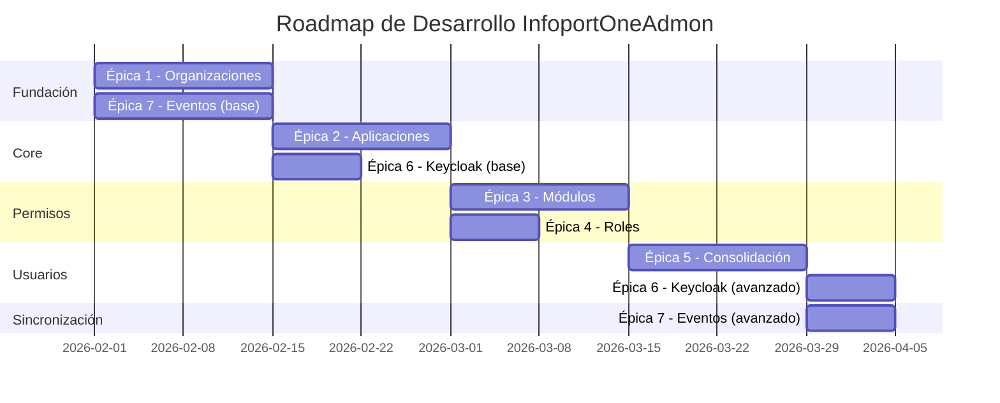

# Epics

## Índice

1. [Roles del Sistema](#1-roles-del-sistema)
2. [Épicas](#2-épicas)
3. [Roadmap y Dependencias](#3-roadmap-y-dependencias)
4. [Product Backlog Priorizado](#4-product-backlog-priorizado)
5. [MVP - Producto Mínimo Viable](#5-mvp---producto-mínimo-viable)

---

## 1. Roles del Sistema

### **Rol 1: OrganizationManager**

**Descripción del rol:**
- **Responsabilidad principal**: Gestión del portfolio de organizaciones clientes y onboarding
- **Alcance**: Creación, edición, desactivación y agrupación de organizaciones clientes
- **Objetivos**: Incorporar nuevos clientes de forma rápida y sin errores, mantener información actualizada de organizaciones
- **Desafíos**: Procesos manuales que generan errores, falta de visibilidad sobre el estado de cada cliente
- **Nivel técnico**: Intermedio - Maneja interfaces web de administración
- **Caso de uso típico**: "Dar de alta una nueva organización cliente en minutos completando un formulario simple con sus datos básicos, para iniciar su proceso de incorporación al ecosistema sin errores que retrasen el acceso a las aplicaciones."

### **Rol 2: SecurityManager**

**Descripción del rol:**
- **Responsabilidad principal**: Administración de accesos, permisos y seguridad del ecosistema
- **Alcance**: Control de autorizaciones, gestión de roles, gobierno de credenciales OAuth2
- **Objetivos**: Garantizar que solo las organizaciones autorizadas accedan a cada aplicación, controlar permisos de forma granular
- **Desafíos**: Procesos de autorización lentos, falta de auditoría clara de cambios de permisos
- **Nivel técnico**: Avanzado - Conocimientos profundos de OAuth2, tokens JWT, conceptos de ciberseguridad
- **Caso de uso típico**: "Desactivar inmediatamente una organización cliente sin eliminar su información, para bloquear su acceso a todas las aplicaciones del ecosistema en caso de impago, incidencia de seguridad o fin de contrato."

### **Rol 3: ApplicationManager**

**Descripción del rol:**
- **Responsabilidad principal**: Gestión del portfolio de aplicaciones satélite y configuración de módulos
- **Alcance**: Registro de aplicaciones, definición de módulos funcionales, configuración de permisos por organización
- **Objetivos**: Configurar qué funcionalidades (módulos) están disponibles para cada cliente, gestionar el catálogo de aplicaciones
- **Desafíos**: Descoordinación entre equipos, configuraciones inconsistentes entre aplicaciones
- **Nivel técnico**: Intermedio-Avanzado - Comprende arquitectura de software y modelos de integración
- **Caso de uso típico**: "Definir los módulos funcionales de una aplicación usando nomenclatura estándar (ej: MCRM_Facturacion), para establecer el catálogo de funcionalidades que se pueden vender y activar de forma granular por cliente."

### **Rol 4: ComplianceOfficer**

**Descripción del rol:**
- **Responsabilidad principal**: Auditoría de sistemas y cumplimiento normativo
- **Alcance**: Verificación de trazabilidad, generación de reportes de compliance (ISO 27001, GDPR)
- **Objetivos**: Verificar trazabilidad de todos los cambios, demostrar cumplimiento en auditorías externas
- **Desafíos**: Logs dispersos, falta de información de "quién hizo qué y cuándo"
- **Nivel técnico**: Intermedio - Consulta logs y reportes, sin acceso directo a bases de datos
- **Caso de uso típico**: "Consultar el historial completo de cambios realizados en una organización específica, para demostrar en auditorías externas que solo usuarios autorizados modificaron datos críticos y verificar trazabilidad completa."

### **Rol 5: EndUser**

**Descripción del rol:**
- **Responsabilidad principal**: Consumidor final de las aplicaciones satélite del ecosistema
- **Alcance**: Acceso a aplicaciones del ecosistema (CRM, ERP, BI) desde organización cliente
- **Objetivos**: Acceder fácilmente a las aplicaciones del ecosistema sin problemas de autenticación
- **Desafíos**: Múltiples contraseñas, retrasos cuando cambia de empresa y necesita nuevos accesos
- **Nivel técnico**: Básico - Usuario de aplicaciones sin conocimientos técnicos
- **Caso de uso típico**: "Hacer login una sola vez y acceder a todas las aplicaciones del ecosistema sin volver a introducir credenciales, para ahorrar tiempo y tener una experiencia fluida sin interrupciones por autenticaciones repetidas (SSO)."

---

## 2. Épicas

- [Epic1_Gestión_de_Organizaciones.md](Epic1_Gestión_de_Organizaciones/Epic1_Gestión_de_Organizaciones.md)
- [Epic2_Administración_de_Aplicaciones.md](Epic2_Administración_de_Aplicaciones/Epic2_Administración_de_Aplicaciones.md)
- [Epic3_Módulos_y_Permisos.md](Epic3_Módulos_y_Permisos/Epic3_Módulos_y_Permisos.md)
- [Epic4_Gobierno_de_Roles_y_Seguridad.md](Epic4_Gobierno_de_Roles_y_Seguridad/Epic4_Gobierno_de_Roles_y_Seguridad.md)
- [Epic5_Consolidación_de_Usuarios.md](Epic5_Consolidación_de_Usuarios/Epic5_Consolidación_de_Usuarios.md)
- [Epic6_Keycloak_e_Identity_Management.md](Epic6_Keycloak_e_Identity_Management/Epic6_Keycloak_e_Identity_Management.md)
- [Epic7_Eventos_y_Sincronización.md](Epic7_Eventos_y_Sincronización/Epic7_Eventos_y_Sincronización.md)

---

## 3. Roadmap y Dependencias

**Hitos clave:**
- **Hito 1 (Semana 2)**: Gestión básica de organizaciones y publicación de eventos
- **Hito 2 (Semana 4)**: Catálogo de aplicaciones y registro en Keycloak
- **Hito 3 (Semana 6)**: Configuración completa de módulos y roles
- **Hito 4 (Semana 8)**: Consolidación de usuarios multi-organización operativa
- **Hito 5 (Semana 9)**: Sistema completo en producción

---

## 4. Product Backlog Priorizado

### **Sprint 1 - Fundación (Semanas 1-2)**
1. US-001 (5 SP) - Crear nueva organización cliente
2. US-035 (5 SP) - Publicar OrganizationEvent al crear/editar
3. US-037 (5 SP) - Prevención de duplicados con hash SHA-256
4. US-002 (3 SP) - Editar información de organización
5. US-003 (2 SP) - Desactivar organización (kill-switch)

**Total Sprint 1:** 20 SP

### **Sprint 2 - Aplicaciones y Keycloak (Semanas 3-4)**
6. US-009 (5 SP) - Registrar aplicación frontend (SPA)
7. US-010 (5 SP) - Registrar aplicación backend (API)
8. US-031 (5 SP) - Registrar aplicación automáticamente en Keycloak
9. US-011 (2 SP) - Definir prefijo único de aplicación
10. US-036 (5 SP) - Publicar ApplicationEvent

**Total Sprint 2:** 22 SP

### **Sprint 3 - Módulos y Permisos (Semanas 5-6)**
11. US-016 (5 SP) - Definir módulos funcionales de aplicación
12. US-017 (5 SP) - Asignar módulos a organización
13. US-021 (5 SP) - Definir catálogo de roles de aplicación
14. US-022 (3 SP) - Validar nomenclatura de roles con prefijo
15. US-024 (3 SP) - Sincronizar roles en ApplicationEvent

**Total Sprint 3:** 21 SP

### **Sprint 4 - Consolidación de Usuarios (Semanas 7-8)**
16. US-025 (5 SP) - Consumir UserEvent desde apps satélite
17. US-026 (5 SP) - Detectar usuarios duplicados por email
18. US-027 (8 SP) - Consolidar organizaciones en claim c_ids
19. US-028 (8 SP) - Consolidar roles multi-aplicación con prefijos
20. US-029 (5 SP) - Sincronizar claim c_ids con Keycloak
21. US-032 (5 SP) - Configurar Protocol Mapper de c_ids

**Total Sprint 4:** 36 SP (Sprint más denso - considerar dividir)

### **Sprint 5 - Completar MVP (Semana 9)**
22. US-030 (5 SP) - Optimizar consolidación con caché
23. US-034 (5 SP) - Implementar SSO entre aplicaciones
24. US-004 (5 SP) - Listar organizaciones con filtros
25. US-014 (3 SP) - Listar catálogo de aplicaciones
26. US-039 (5 SP) - Consumo idempotente en apps satélite

**Total Sprint 5:** 23 SP

---

## 5. MVP - Producto Mínimo Viable

### **Historias Críticas para MVP (Total: ~120 SP)**

El MVP incluye las User Stories esenciales para tener un sistema funcional end-to-end:

**✅ Gestión básica de organizaciones:**
- US-001, US-002, US-003

**✅ Gestión básica de aplicaciones:**
- US-009, US-010, US-011

**✅ Configuración de módulos y roles:**
- US-016, US-017, US-021, US-022

**✅ Consolidación de usuarios multi-organización:**
- US-025, US-026, US-027, US-028, US-029

**✅ Integración con Keycloak:**
- US-031, US-032, US-034

**✅ Arquitectura de eventos:**
- US-035, US-036, US-037, US-039

### **Funcionalidades Excluidas del MVP (para iteraciones futuras):**
- US-006, US-007 (Grupos de organizaciones)
- US-008 (Auditoría completa)
- US-012 (Múltiples credenciales)
- US-015 (Desactivar aplicación)
- US-018, US-019, US-020 (Configuración masiva de permisos, matriz de permisos)
- US-023 (Deprecar roles)
- US-030 (Optimización con caché - se hará en siguiente iteración)
- US-033 (Validación stateless de tokens)
- US-038 (Republicación masiva de eventos)

---

