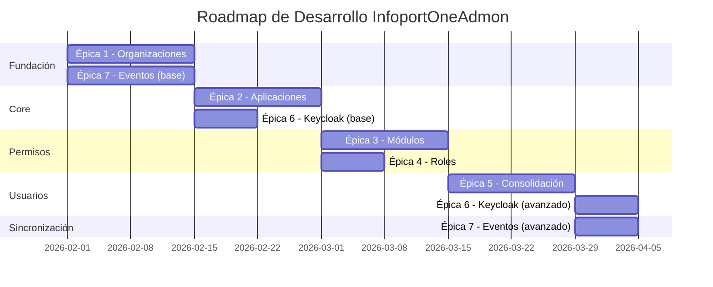

# Epics

## Índice

1. [Roles del Sistema](#1-roles-del-sistema)
2. [Épicas](#2-épicas)
3. [Roadmap y Dependencias](#3-roadmap-y-dependencias)
4. [Product Backlog Priorizado](#4-product-backlog-priorizado)
5. [MVP - Producto Mínimo Viable](#5-mvp---producto-mínimo-viable)

---

## 1. Roles del Sistema
### Roles usados en las historias y tickets

- **OrganizationAdministrator**: Usuario con permisos para crear/editar organizaciones y gestionar módulos asignados dentro de una organización (visto en múltiples tickets y HU).
- **OrganizationManager**: Rol operativo para onboarding y gestión masiva de organizaciones (presente en HU y tests).
- **ApplicationManager**: Responsable de registrar aplicaciones, asignar módulos y gestionar roles de aplicación.
- **SecurityManager**: Responsable de acciones de seguridad y operaciones sensibles (desactivación/reactivación manual, auditoría).
- **EndUser**: Usuario final que consume las aplicaciones (SSO, accesos con token).

---

## 2. Épicas (índice)

 - [Inicialización (Epic 0)](Epic0_Inicializacion/Epic0_Inicializacion.md)
    - [Init: Backend scaffold](Epic0_Inicializacion/Epic0_UserStories/INIT001_Inicialización_Proyecto_Back_Helix6/INIT001_Inicialización_Proyecto_Back_Helix6.md)
    - [Init: Frontend scaffold](Epic0_Inicializacion/Epic0_UserStories/INIT002_Inicialización_Proyecto_Front_Helix6/INIT002_Inicialización_Proyecto_Front_Helix6.md)
    - [Init: Keycloak + Postgres + ActiveMQ Artemis (docker-compose)](Epic0_Inicializacion/Epic0_UserStories/INIT003_Configuración_Contenedores_Keycloak_Postgres_ActiveMQ_Artemis/INIT003_Configuración_Contenedores_Keycloak_Postgres_ActiveMQ_Artemis.md)

 - [Organizaciones (Epic 1)](Epic1_Gestión_de_Organizaciones/Epic1_Gestión_de_Organizaciones.md)
    - [Gestión de organización](Epic1_Gestión_de_Organizaciones/Epic1_UserStories/ORG001_Gestion_Organizacion/ORG001_Gestion_Organizacion.md)
    - [Listar organizaciones (filtros y paginación)](Epic1_Gestión_de_Organizaciones/Epic1_UserStories/ORG002_Listar_Organizaciones_Filtros_Paginación/ORG002_Listar_Organizaciones_Filtros_Paginación.md)
    - [Alta/Baja de organización](Epic1_Gestión_de_Organizaciones/Epic1_UserStories/ORG003_Dar_De_Alta_Baja_Organización/ORG003_Dar_De_Alta_Baja_Organización.md)
    - [Gestionar módulos de organización](Epic1_Gestión_de_Organizaciones/Epic1_UserStories/ORG004_Gestionar_modulos_organizacion/ORG004_Gestionar_modulos_organizacion.md)
    - [Consultar auditoría de organización](Epic1_Gestión_de_Organizaciones/Epic1_UserStories/ORG005_Consultar_Auditoría_Cambios_Organización/ORG005_Consultar_Auditoría_Cambios_Organización.md)

 - [Aplicaciones (Epic 2)](Epic2_Administración_de_Aplicaciones/Epic2_Administración_de_Aplicaciones.md)
    - [Gestión de aplicación](Epic2_Administración_de_Aplicaciones/Epic2_UserStories/APL001_Gestión_Aplicación/APL001_Gestión_Aplicación.md)
    - [Listar aplicaciones (filtros/paginación)](Epic2_Administración_de_Aplicaciones/Epic2_UserStories/APL002_Listar_Aplicaciones_Filtros_Paginación/APL002_Listar_Aplicaciones_Filtros_Paginación.md)
    - [Alta/Baja de aplicación](Epic2_Administración_de_Aplicaciones/Epic2_UserStories/APL003_Dar_De_Alta_Baja_Aplicación/APL003_Dar_De_Alta_Baja_Aplicación.md)
    - [Gestionar módulos de aplicación](Epic2_Administración_de_Aplicaciones/Epic2_UserStories/APL004_Gestionar_Modulos_Aplicación/APL004_Gestionar_Modulos_Aplicación.md)
    - [Gestionar roles de aplicación](Epic2_Administración_de_Aplicaciones/Epic2_UserStories/APL005_Gestionar_Roles_Aplicación/APL005_Gestionar_Roles_Aplicación.md)
    - [Gestionar credenciales de aplicación](Epic2_Administración_de_Aplicaciones/Epic2_UserStories/APL006_Gestionar_Credenciales_Aplicación/APL006_Gestionar_Credenciales_Aplicación.md)

 - [Consolidación de usuarios (Epic 3)](Epic3_Consolidación_de_Usuarios/Epic3_Consolidación_de_Usuarios.md)
    - [Consumir UserEvent desde apps satélite](Epic3_Consolidación_de_Usuarios/Epic3_UserStories/USR001_Consumir_UserEvent_Desde_Satellite/USR001_Consumir_UserEvent_Desde_Satellite.md)
    - [Consolidación de usuarios](Epic3_Consolidación_de_Usuarios/Epic3_UserStories/USR002_Consolidacion_de_Usuarios/USR002_Consolidacion_de_Usuarios.md)
    - [Sincronización de usuarios](Epic3_Consolidación_de_Usuarios/Epic3_UserStories/USR003_Sincronizacion_de_Usuarios/USR003_Sincronizacion_de_Usuarios.md)

 - [Keycloak e Identity (Epic 4)](Epic4_Keycloak_e_Identity_Management/Epic4_Keycloak_e_Identity_Management.md)
    - [Crear realm InfoportOne](Epic4_Keycloak_e_Identity_Management/Epic4_UserStories/KEY001_Crear_Realm_InfoportOne/KEY001_Crear_Realm_InfoportOne.md)
    - [Crear usuario en Keycloak vía API](Epic4_Keycloak_e_Identity_Management/Epic4_UserStories/KEY002_Creación_Usuario_Keycloak_con_Api/KEY002_Creación_Usuario_Keycloak_con_Api.md)
    - [Crear clientes (apps) en Keycloak](Epic4_Keycloak_e_Identity_Management/Epic4_UserStories/KEY003_Creación_Clientes_Keycloak/KEY003_Creación_Clientes_Keycloak.md)

 - [Eventos y sincronización (Epic 5)](Epic5_Eventos_y_Sincronización/Epic5_Eventos_y_Sincronización.md)
    - [OrganizationEvent (publicación/consumo)](Epic5_Eventos_y_Sincronización/EVT001_OrganizationEvent/EVT001_OrganizationEvent.md)
    - [ApplicationEvent](Epic5_Eventos_y_Sincronización/EVT002_ApplicationEvent/EVT002_ApplicationEvent.md)
    - [UserEvent](Epic5_Eventos_y_Sincronización/EVT003_UserEvent/EVT003_UserEvent.md)
    - [Sincronización global de eventos](Epic5_Eventos_y_Sincronización/EVT004_Sincronización_Global_de_Eventos/EVT004_Sincronización_Global_de_Eventos.md)

 - [Auditoría de cambios (Epic 6)](Epic6_Auditoria_de_Cambios/Epic6_Auditoria_de_Cambios.md)
    - [Auditoría por organización](Epic6_Auditoria_de_Cambios/Epic6_UserStories/AUD001_Auditoria_Organización/AUD001_Auditoria_Organización.md)
    - [Auditoría por aplicación](Epic6_Auditoria_de_Cambios/Epic6_UserStories/AUD002_Auditoría_Aplicación/AUD002_Auditoría_Aplicación.md)
    - [Auditoría por usuario](Epic6_Auditoria_de_Cambios/Epic6_UserStories/AUD003_Auditoria_Usuario/AUD003_Auditoria_Usuario.md)

 - [Grupos de organizaciones (Epic 7)](Epic7_Gestión_de_Grupos_Organizaciones/Epic7_Gestión_de_Grupos_Organizaciones.md)
    - [Gestión de grupos de organización](Epic7_Gestión_de_Grupos_Organizaciones/Epic7_UserStories/GRP001_Gestión_Grupo_Organización/GRP001_Gestión_Grupo_Organización.md)
    - [Listas de grupos (filtros y paginación)](Epic7_Gestión_de_Grupos_Organizaciones/Epic7_UserStories/GRP002_Listas_Grupos_Organizaciones_Filtros_Paginación/GRP002_Listas_Grupos_Organizaciones_Filtros_Paginación.md)
    - [Eliminar grupo físicamente](Epic7_Gestión_de_Grupos_Organizaciones/Epic7_UserStories/GRP003_Eliminar_Fisicamente/GRP003_Eliminar_Fisicamente.md)

---

## 3. Roadmap y Dependencias

**Hitos clave:**
- **Hito 1 (Semana 2)**: Gestión básica de organizaciones y publicación de eventos
- **Hito 2 (Semana 4)**: Catálogo de aplicaciones y registro en Keycloak
- **Hito 3 (Semana 6)**: Configuración completa de módulos y roles
- **Hito 4 (Semana 8)**: Consolidación de usuarios multi-organización operativa
- **Hito 5 (Semana 9)**: Sistema completo en producción

---

## 4. Product Backlog Priorizado

### **Sprint 1 - Fundación (Semanas 1-2)**
1. US-001 (5 SP) - Crear nueva organización cliente
2. US-035 (5 SP) - Publicar OrganizationEvent al crear/editar
3. US-037 (5 SP) - Prevención de duplicados con hash SHA-256
4. US-002 (3 SP) - Editar información de organización
5. US-003 (2 SP) - Desactivar organización (kill-switch)

**Total Sprint 1:** 20 SP

### **Sprint 2 - Aplicaciones y Keycloak (Semanas 3-4)**
6. US-009 (5 SP) - Registrar aplicación frontend (SPA)
7. US-010 (5 SP) - Registrar aplicación backend (API)
8. US-031 (5 SP) - Registrar aplicación automáticamente en Keycloak
9. US-011 (2 SP) - Definir prefijo único de aplicación
10. US-036 (5 SP) - Publicar ApplicationEvent

**Total Sprint 2:** 22 SP

### **Sprint 3 - Módulos y Permisos (Semanas 5-6)**
11. US-016 (5 SP) - Definir módulos funcionales de aplicación
12. US-017 (5 SP) - Asignar módulos a organización
13. US-021 (5 SP) - Definir catálogo de roles de aplicación
14. US-022 (3 SP) - Validar nomenclatura de roles con prefijo
15. US-024 (3 SP) - Sincronizar roles en ApplicationEvent

**Total Sprint 3:** 21 SP

### **Sprint 4 - Consolidación de Usuarios (Semanas 7-8)**
16. US-025 (5 SP) - Consumir UserEvent desde apps satélite
17. US-026 (5 SP) - Detectar usuarios duplicados por email
18. US-027 (8 SP) - Consolidar organizaciones en claim c_ids
19. US-028 (8 SP) - Consolidar roles multi-aplicación con prefijos
20. US-029 (5 SP) - Sincronizar claim c_ids con Keycloak
21. US-032 (5 SP) - Configurar Protocol Mapper de c_ids

**Total Sprint 4:** 36 SP (Sprint más denso - considerar dividir)

### **Sprint 5 - Completar MVP (Semana 9)**
22. US-030 (5 SP) - Optimizar consolidación con caché
23. US-034 (5 SP) - Implementar SSO entre aplicaciones
24. US-004 (5 SP) - Listar organizaciones con filtros
25. US-014 (3 SP) - Listar catálogo de aplicaciones
26. US-039 (5 SP) - Consumo idempotente en apps satélite

**Total Sprint 5:** 23 SP

---

## 5. MVP - Producto Mínimo Viable

### **Historias Críticas para MVP (Total: ~120 SP)**

El MVP incluye las User Stories esenciales para tener un sistema funcional end-to-end:

**✅ Gestión básica de organizaciones:**
- US-001, US-002, US-003

**✅ Gestión básica de aplicaciones:**
- US-009, US-010, US-011

**✅ Configuración de módulos y roles:**
- US-016, US-017, US-021, US-022

**✅ Consolidación de usuarios multi-organización:**
- US-025, US-026, US-027, US-028, US-029

**✅ Integración con Keycloak:**
- US-031, US-032, US-034

**✅ Arquitectura de eventos:**
- US-035, US-036, US-037, US-039

### **Funcionalidades Excluidas del MVP (para iteraciones futuras):**
- US-006, US-007 (Grupos de organizaciones)
- US-008 (Auditoría completa)
- US-012 (Múltiples credenciales)
- US-015 (Desactivar aplicación)
- US-018, US-019, US-020 (Configuración masiva de permisos, matriz de permisos)
- US-023 (Deprecar roles)
- US-030 (Optimización con caché - se hará en siguiente iteración)
- US-033 (Validación stateless de tokens)
- US-038 (Republicación masiva de eventos)

---

