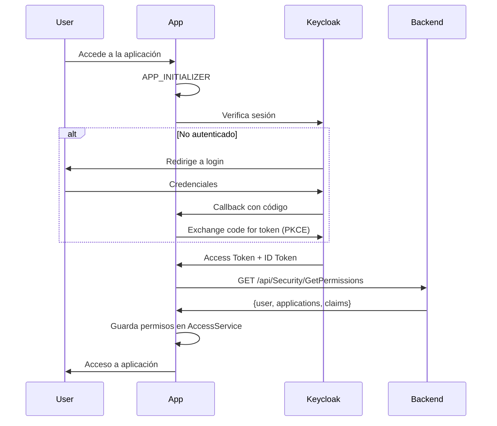
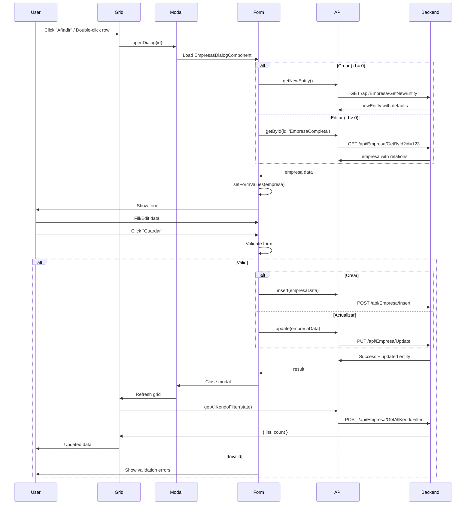

# Helix6 Frontend Architecture - Guía de Desarrollo con Angular y CommonLibrary

**Versión:** 1.0  
**Fecha:** 31 de Enero de 2026  
**Framework:** Angular 20.1.8 + @cl/common-library 2.8.0  
**Propósito:** Guía completa para generación de CRUDs asistida por IA

---

## Índice

1. [Introducción](#1-introducción)
2. [Stack Tecnológico](#2-stack-tecnológico)
3. [Arquitectura Angular](#3-arquitectura-angular)
4. [Autenticación y Seguridad (OIDC)](#4-autenticación-y-seguridad-oidc)
5. [Sistema de Permisos](#5-sistema-de-permisos)
6. [CommonLibrary: ClGrid](#6-commonlibrary-clgrid)
7. [CommonLibrary: ClModal](#7-commonlibrary-clmodal)
8. [CommonLibrary: ClFormFields](#8-commonlibrary-clformfields)
9. [Integración NSwag (API Clients)](#9-integración-nswag-api-clients)
10. [Sistema de Traducciones](#10-sistema-de-traducciones)
11. [Ejemplo Completo: CRUD Empresas](#11-ejemplo-completo-crud-empresas)
12. [APIs Genéricas del Backend](#12-apis-genéricas-del-backend)
13. [Testing Patterns](#13-testing-patterns)
14. [Checklist para Generación de CRUDs](#14-checklist-para-generación-de-cruds)
15. [Buenas Prácticas Angular](#15-buenas-prácticas-angular)

---

## 1. Introducción

Este documento proporciona una guía completa para el desarrollo de módulos CRUD en aplicaciones Angular basadas en el framework **Helix6**. Está diseñado específicamente para facilitar la **generación asistida por IA** de componentes frontend que interactúan con el backend Helix6.

### Objetivos

- Proporcionar patrones estándar para grids, formularios y modales
- Documentar el uso de **@cl/common-library** (componentes reutilizables)
- Establecer convenciones para autenticación, permisos y traducciones
- Facilitar la integración con APIs generadas por **NSwag**
- Ofrecer templates listos para copiar y adaptar

### Arquitectura de Referencia

```
SintraportV4.Front/
├── src/
│   ├── app/
│   │   ├── modules/              # Módulos funcionales
│   │   │   ├── masters/          # Maestros (empresas, empleados, etc.)
│   │   │   ├── viajes/           # Módulo de viajes
│   │   │   └── ...
│   │   ├── theme/                # Servicios core
│   │   │   ├── services/
│   │   │   │   ├── authentication.service.ts
│   │   │   │   └── env-configuration.service.ts
│   │   │   └── access/
│   │   │       └── access.service.ts
│   │   └── config/               # Configuración
│   ├── assets/
│   │   ├── i18n/                 # Archivos de traducción
│   │   │   ├── es.json
│   │   │   ├── en.json
│   │   │   └── ca.json
│   │   └── config/
│   │       └── config.json       # Configuración OIDC
│   └── webServicesReferences/
│       └── api/
│           └── apiClients.ts     # Clientes NSwag generados
└── package.json
```

---

## 2. Stack Tecnológico

### Dependencias Principales

```json
{
  "dependencies": {
    "@angular/core": "20.1.8",
    "@angular/common": "20.1.8",
    "@angular/forms": "20.1.8",
    "@angular/router": "20.1.8",
    
    "@cl/common-library": "2.8.0",
    
    "@progress/kendo-angular-grid": "18.3.1",
    "@progress/kendo-angular-inputs": "18.3.1",
    "@progress/kendo-angular-dialog": "18.3.1",
    "@progress/kendo-angular-buttons": "18.3.1",
    "@progress/kendo-angular-dateinputs": "18.3.1",
    "@progress/kendo-angular-dropdowns": "18.3.1",
    "@progress/kendo-data-query": "2.2.0",
    
    "oidc-client-ts": "3.1.0",
    
    "@ngrx/store": "20.0.1",
    "@ngrx/effects": "20.0.1",
    
    "@ngx-translate/core": "15.0.0",
    "@ngx-translate/http-loader": "8.0.0",
    
    "rxjs": "7.8.1"
  },
  "devDependencies": {
    "jasmine-core": "5.1.0",
    "karma": "6.4.0",
    "karma-jasmine": "5.1.0",
    "karma-chrome-launcher": "3.2.0",
    "karma-coverage": "2.2.0"
  }
}
```

### Versiones Clave

- **Node.js:** 22.12.0
- **npm:** 10.9.0
- **Angular CLI:** 20.1.6
- **TypeScript:** 5.7.2

---

## 3. Arquitectura Angular

### Patrón de Componentes

**Standalone Components** (Angular 14+)

Todos los componentes son **standalone** y declaran sus dependencias directamente:

```typescript
import { Component, inject } from '@angular/core';
import { CommonModule } from '@angular/common';
import { ReactiveFormsModule } from '@angular/forms';
import { ClGridComponent, ClGridConfig } from '@cl/common-library/cl-grid';

@Component({
  selector: 'app-empresas-grid',
  standalone: true,
  imports: [
    CommonModule,
    ReactiveFormsModule,
    ClGridComponent
  ],
  templateUrl: './empresas-grid.component.html',
  styleUrls: ['./empresas-grid.component.scss']
})
export class EmpresasGridComponent {
  // Dependency injection con inject()
  private empresaClient = inject(EmpresaClient);
  private translate = inject(TranslateService);
  
  // ...
}
```

### Inyección de Dependencias

**Patrón moderno con `inject()`:**

```typescript
export class MyComponent {
  // ✅ Recomendado (Angular 14+)
  private myService = inject(MyService);
  private router = inject(Router);
  private fb = inject(FormBuilder);
  
  // ❌ Evitar (patrón antiguo)
  // constructor(
  //   private myService: MyService,
  //   private router: Router
  // ) {}
}
```

### Estructura de Módulo CRUD Típico

```
masters/
└── components/
    └── empresas/
        ├── empresas-grid/
        │   ├── empresas-grid.component.ts       # Grid principal
        │   ├── empresas-grid.component.html
        │   ├── empresas-grid.component.scss
        │   └── empresas-grid.component.spec.ts
        └── empresas-dialog/
            ├── empresas-dialog.component.ts     # Formulario modal
            ├── empresas-dialog.component.html
            ├── empresas-dialog.component.scss
            └── empresas-dialog.component.spec.ts
```

---

## 4. Autenticación y Seguridad (OIDC)

### Flujo de Autenticación



### Configuración OIDC

**Archivo:** `src/assets/config/config.json`

```json
{
  "apiUrl": "https://localhost:42000",
  "authority": "https://keycloak26.dev.infoport.es/realms/IONE",
  "client_id": "angularclient",
  "scope": "STP-service-scope",
  "response_type": "code",
  "redirect_uri": "http://localhost:4200/signin-callback",
  "post_logout_redirect_uri": "http://localhost:4200/signout-callback",
  "silent_redirect_uri": "http://localhost:4200/silent-callback.html",
  "automaticSilentRenew": false,
  "urlAuthorize": "https://localhost:42000/api/Security/GetPermissions",
  "environment": "Test",
  "color_environment": ""
}
```

### AuthenticationService

**Archivo:** `src/app/theme/services/authentication.service.ts`

```typescript
import { Injectable, inject } from '@angular/core';
import { UserManager, User } from 'oidc-client-ts';
import { BehaviorSubject, Observable } from 'rxjs';

@Injectable({ providedIn: 'root' })
export class AuthenticationService {
  private httpClient = inject(HttpClient);
  private envConfigurationService = inject(EnvConfigurationService);
  
  private userManager!: UserManager;
  private userContext!: User;
  
  private allPermissionsSubject = new BehaviorSubject<AuthApplication[]>([]);
  public allPermissionsObs = this.allPermissionsSubject.asObservable();
  
  init(): Promise<void> {
    const settings = this.envConfigurationService.readConfig();
    this.userManager = new UserManager(settings);
    return this.loadUser();
  }
  
  login(): Promise<void> {
    return this.userManager.signinRedirect();
  }
  
  logout(): Promise<void> {
    return this.userManager.signoutRedirect();
  }
  
  getAccessToken(): string {
    return this.userContext ? this.userContext.access_token : '';
  }
  
  private loadPermissions(): void {
    const url = this.envConfigurationService.config.urlAuthorize;
    this.httpClient.get<GetPermissionsResponse>(url)
      .subscribe(response => {
        this.allPermissionsSubject.next(response.applications);
        // Store in localStorage for AccessService
        localStorage.setItem('permissions', JSON.stringify(response.applications));
      });
  }
}
```

### GetPermissions API Response

```typescript
interface GetPermissionsResponse {
  user: {
    userConfiguration: AuthUserConfiguration;  // language, theme, etc.
  };
  applications: AuthApplication[];
  claims?: AuthClaim[];
}

interface AuthApplication {
  application: string;      // e.g., "SINTRAPORT"
  permissions: string[];    // e.g., ["Master companies modification", ...]
  roles: string[];          // e.g., ["Admin", "User"]
}

interface AuthUserConfiguration {
  language: string;         // e.g., "es", "en", "ca"
  // ... other user settings
}
```

---

## 5. Sistema de Permisos

### AccessService

**Archivo:** `src/app/theme/access/access.service.ts`

```typescript
import { Injectable, inject } from '@angular/core';
import { AuthenticationService } from '@app/theme/services/authentication.service';
import { Access } from './access';

@Injectable({ providedIn: 'root' })
export class AccessService {
  private authService = inject(AuthenticationService);
  
  private permissions: string[] = [];
  public permissionsReady$ = new BehaviorSubject<boolean>(false);
  
  constructor() {
    this.authService.allPermissionsObs.subscribe(apps => {
      this.permissions = apps.flatMap(app => app.permissions);
      this.permissionsReady$.next(true);
    });
  }
  
  // Método genérico para verificar permisos
  hasPermissions(permissions: string[], permissionKey: string): boolean {
    return permissions.includes(permissionKey);
  }
  
  // Permisos específicos (ejemplo)
  maestroEmpresasModificacion(): boolean {
    return this.hasPermissions(this.permissions, Access['Master companies modification']);
  }
  
  maestroEmpresasConsulta(): boolean {
    return this.hasPermissions(this.permissions, Access['Master companies query']);
  }
}
```

### Access Enum

**Archivo:** `src/app/theme/access/access.ts`

```typescript
export enum Access {
  'User customization' = 'User customization',
  'Profile query' = 'Profile query',
  'Profile modification' = 'Profile modification',
  'Master companies modification' = 'Master companies modification',
  'Master companies query' = 'Master companies query',
  'Master employees modification' = 'Master employees modification',
  // ... más permisos
}
```

### Uso en Componentes

```typescript
export class EmpresasGridComponent {
  private accessService = inject(AccessService);
  
  // Getter para permisos
  get maestroEmpresasModificacion(): boolean {
    return this.accessService.maestroEmpresasModificacion();
  }
  
  loadGridConfig(): void {
    this.gridConfig = new ClGridConfig({
      // ...
      edition: this.maestroEmpresasModificacion
        ? new ClGridEdition({ mode: 'delete-only', ... })
        : null  // No edition if no permission
    });
  }
}
```

### Control de UI basado en Permisos

**En Grid:**
```typescript
edition: new ClGridEdition({
  external: !this.maestroEmpresasModificacion ? 'both' : null,
  allowAdding: this.maestroEmpresasModificacion
})
```

**En Modal:**
```typescript
submitButton: {
  disabled: !this.maestroEmpresasModificacion,
  text: this.translate.instant('SAVE'),
  action: () => this.onSubmit()
}
```

**Permisos son binarios:** Solo verifican si el usuario tiene o no tiene el permiso.

---

## 6. CommonLibrary: ClGrid

ClGrid es el componente principal para visualización de datos en grids. Envuelve Kendo Grid con configuraciones estandarizadas.

### Importación

```typescript
import { 
  ClGridComponent, 
  ClGridConfig, 
  ClGridColumn,
  ClGridEdition,
  ClPageableSettings,
  ClSortableSettings,
  ClSelectableSettings,
  ClFilterableSettings,
  IClGridEditionEndpoints
} from '@cl/common-library/cl-grid';
```

### ClGridConfig - Interfaz Completa

```typescript
class ClGridConfig {
  // REQUERIDO
  idGrid: string;                     // ID único del grid
  mode: 'client-side' | 'server-side'; // Modo de procesamiento
  selectBy: string | ((context: RowArgs) => any); // Identificador de fila
  columns: ClGridColumn[];            // Definición de columnas
  
  // OPCIONAL - Funcionalidades
  pageable?: boolean | ClPageableSettings;
  selectable?: boolean | ClSelectableSettings;
  sortable?: boolean | ClSortableSettings;
  filterable?: boolean | ClFilterableSettings;
  resizable?: boolean;                // Columnas redimensionables
  reorderable?: boolean;              // Columnas reordenables
  navigable?: boolean;                // Navegación con teclado
  showColumnsConfigurator?: boolean;  // Configurador de columnas
  persistState?: boolean;             // Guardar estado (default: true)
  fitHeightToContent?: boolean;       // Ajustar altura (default: false)
  showRefreshButton?: boolean;        // Botón refrescar (default: true)
  
  // OPTIONAL - State Management
  state?: State;                      // Estado inicial (filtros, orden, etc.)
  
  // OPTIONAL - Edition
  edition?: ClGridEdition;            // Configuración de edición
  
  // OPTIONAL - Templates
  expandTemplate?: TemplateRef<any>;          // Template master-detail
  noRecordsTemplate?: TemplateRef<any>;       // Template sin datos
  toolbarTemplates?: IClGridToolbarTemplates; // Templates toolbar
  footerTemplate?: TemplateRef<any>;          // Template footer
  
  // OPTIONAL - Advanced
  columnMenu?: ColumnMenuSettings;    // Menú de columnas
  actionsMenu?: ClGridActionsMenuConfig; // Menú de acciones
  highlightConfig?: IClGridHighlightConfig;
  showHistoricalValues?: ClGridHistoricalValuesConfig;
  groupable?: ClGroupableSettings;
  exportToExcel?: ClExcelExport;
  gridConfiguratorEndpoints?: IClGridConfiguratorEndpoints;
  rowClassCallback?: (context: RowClassArgs) => any;
  selectedItems?: any[];
}
```

### ClGridColumn - Configuración de Columnas

```typescript
class ClGridColumn {
  field: string;           // Nombre del campo (soporta nested: 'empresa$nombre')
  title?: string;          // Título de la columna
  width?: number;          // Ancho en píxeles
  
  // Filtering & Sorting
  filter?: 'text' | 'numeric' | 'date' | 'boolean' | 'combo';
  filterable?: boolean;
  sortable?: boolean;
  
  // Display
  hidden?: boolean;
  locked?: boolean;        // Sticky izquierda
  sticky?: boolean;        // Sticky en dirección de scroll
  hideTooltip?: boolean;
  
  // Edition
  editor?: ClGridColumnEditor;
  defaultValue?: any | (() => any);
  
  // Templates
  template?: ClGridCustomTemplate;
  headerTemplate?: TemplateRef<any>;
  
  // Configuraciones específicas por tipo
  numericConfig?: ClGridColumnNumericConfig;
  dateConfig?: ClGridColumnDateConfig;
  comboConfig?: IClGridColumnComboConfig;
}
```

### Tipos de Editores

```typescript
class ClGridColumnEditor {
  type: 'text' | 'numeric' | 'boolean' | 'date' | 'combo' | 'custom';
  template?: TemplateRef<any>;   // Para type: 'custom'
  validators?: ValidatorFn[];
  placeholder?: string;
}
```

**Ejemplos:**

```typescript
// Text Editor
{
  field: 'nombre',
  title: 'Nombre',
  filter: 'text',
  editor: { 
    type: 'text', 
    validators: [Validators.required, Validators.maxLength(100)] 
  }
}

// Numeric Editor
{
  field: 'precio',
  title: 'Precio',
  filter: 'numeric',
  numericConfig: { 
    numberOfDecimals: 2, 
    units: '€' 
  },
  editor: { 
    type: 'numeric', 
    validators: [Validators.required, Validators.min(0)] 
  }
}

// Date Editor
{
  field: 'fechaCreacion',
  title: 'Fecha Creación',
  filter: 'date',
  dateConfig: { 
    format: 'dd/MM/yyyy HH:mm',
    min: new Date(2020, 0, 1),
    max: new Date(2030, 11, 31)
  },
  editor: { type: 'date' }
}

// Boolean Editor (Checkbox)
{
  field: 'activo',
  title: 'Activo',
  filter: 'boolean',
  editor: { type: 'boolean' }
}

// Combo Editor
{
  field: 'tipoDocumentoId',
  title: 'Tipo Documento',
  filter: 'combo',
  comboConfig: {
    data: this.tipoDocumentoList,
    textField: 'descripcion',
    valueField: 'id',
    defaultItem: { id: null, descripcion: 'Seleccione...' }
  },
  editor: { type: 'combo', validators: [Validators.required] }
}

// Custom Editor
{
  field: 'localidad',
  title: 'Localidad',
  template: { template: this.localidadTemplate },
  editor: { 
    type: 'custom', 
    template: this.localidadLookupTemplate,
    validators: [Validators.required]
  }
}
```

### Modos de Grid

#### Server-Side Mode

Procesamiento de datos en backend. Ideal para grandes volúmenes.

```typescript
this.gridConfig = new ClGridConfig({
  idGrid: 'empresasGridConfig',
  mode: 'server-side',
  selectBy: 'id',
  
  state: {
    skip: 0,
    take: 20,
    sort: [{ field: 'nombre', dir: 'asc' }],
    filter: {
      filters: [
        { field: 'auditDeletionDate', operator: 'isnull', value: null }
      ],
      logic: 'and'
    }
  },
  
  columns: [/* ... */]
});

// Event handler para cambios de estado
onDataStateChange(state: State): void {
  this.callApi(state);
}

callApi(state: State): void {
  this.empresaClient
    .getAllKendoFilter({ data: state })
    .subscribe(response => {
      this.gridData = { 
        data: response.list, 
        total: response.count 
      };
    });
}
```

#### Client-Side Mode

Procesamiento en navegador. Para volúmenes pequeños (<1000 registros).

```typescript
this.gridConfig = new ClGridConfig({
  idGrid: 'empresaDireccionGrid',
  mode: 'client-side',
  selectBy: 'id',
  persistState: false,
  fitHeightToContent: true,
  
  columns: [/* ... */]
});

// Cargar datos directamente
this.gridData = { 
  data: empresaDireccionList, 
  total: empresaDireccionList.length 
};
```

### Paginación

```typescript
pageable: new ClPageableSettings({
  pageSizes: [10, 20, 50, 100],
  showRowsPerPage: true,
  showTotalResults: true
})
```

### Ordenación

```typescript
sortable: new ClSortableSettings({
  mode: 'multiple',      // 'single' o 'multiple'
  allowUnsort: true,     // Permitir quitar orden
  hideToolbarOrder: false // Mostrar botón de orden en toolbar
})
```

### Selección

```typescript
selectable: new ClSelectableSettings({
  mode: 'single',        // 'single' | 'multiple'
  showSelectAll: true,   // Checkbox "seleccionar todos"
  sticky: true           // Columna sticky
})
```

### Filtrado

```typescript
filterable: new ClFilterableSettings({
  hideToolbarFilter: false,    // Botón "Filtrar" en toolbar
  hideSearcherFilter: false    // Buscador en toolbar
})
```

### Edición

```typescript
edition: new ClGridEdition({
  mode: 'row',                  // 'row' | 'cell' | 'delete-only'
  inCell: false,                // Edición inline en celda
  allowAdding: true,
  editOnly: false,
  deleteOnly: false,
  external: null,               // 'both' | 'edit' | 'delete' (modal externo)
  showEditButtons: true,
  hideEditButtons: false,
  addButtonText: 'Añadir',
  removeRowConfirmationText: '¿Eliminar registro?',
  
  // Endpoints para operaciones CRUD
  endpoints: {
    create: (dataItem) => this.empresaClient.insert(dataItem),
    update: (dataItem) => this.empresaClient.update(dataItem),
    delete: (dataItem) => this.empresaClient.deleteById(dataItem.id)
  }
})
```

### Eventos del Grid

```typescript
export class MyGridComponent {
  @Output() dataStateChangeEvent = new EventEmitter<State>();
  @Output() rowSelected = new EventEmitter<any>();
  @Output() selectionChanged = new EventEmitter<any[]>();
  @Output() dataItemEdited = new EventEmitter<any>();
  @Output() changesSaved = new EventEmitter<any[]>();
  
  onDataStateChange(state: State): void {
    this.dataStateChangeEvent.emit(state);
  }
  
  onRowSelected(item: any): void {
    this.rowSelected.emit(item);
  }
}
```

### Exportar a Excel

```typescript
exportToExcel: {
  fileName: 'empresas',
  endpoint: (state: State) => {
    return this.empresaClient
      .getAllKendoFilter({ data: state })
      .pipe(map(res => res.list));
  }
}
```

### Template HTML Básico

```html
<cl-grid
  [data]="gridData"
  [config]="gridConfig"
  (dataStateChangeEvent)="onDataStateChange($event)"
  (rowSelected)="onRowSelected($event)"
></cl-grid>
```

---

## 7. CommonLibrary: ClModal

ClModal proporciona un servicio para abrir modales (dialogs) con configuración estandarizada.

### Importación

```typescript
import { 
  ClModalService, 
  ClModalConfig, 
  ClModalButton 
} from '@cl/common-library/cl-modal';
```

### ClModalService - Uso Básico

```typescript
export class EmpresasGridComponent {
  private clModalService = inject(ClModalService);
  
  openDialog(id: number = 0): void {
    const modalConfig = new ClModalConfig({
      title: id > 0 ? 'Editar Empresa' : 'Nueva Empresa',
      content: EmpresasDialogComponent,  // Componente a mostrar
      size: 'L',                          // 'XS' | 'S' | 'M' | 'L' | 'XL' | 'XXL'
      type: 'form',                       // 'info' | 'form'
      
      componentInputs: new Map([
        ['id', id],                       // Inputs del componente
        ['tipoEmpresaId', this.tipoEmpresaId]
      ]),
      
      closeButton: {
        text: 'Cancelar',
        action: () => true  // Retornar true cierra el modal
      },
      
      submitButton: {
        text: 'Guardar',
        disabled: false,
        action: () => {
          // Ejecutar lógica de guardado
          return false;  // Retornar false mantiene modal abierto
        }
      }
    });
    
    this.clModalService.openModal<EmpresasDialogComponent>(modalConfig)
      .then(result => {
        const dialogRef = result.dialogRef;
        const component = result.component;
        
        // Escuchar cierre del modal
        dialogRef.result.subscribe(() => {
          this.refreshGrid();
        });
      });
  }
}
```

### ClModalConfig - Interfaz Completa

```typescript
class ClModalConfig {
  title?: string;
  content: string | Type<Component> | TemplateRef<any>;
  size?: 'XS' | 'S' | 'M' | 'L' | 'XL' | 'XXL';  // Default: 'M'
  type?: 'info' | 'form';                         // Default: 'form'
  
  closeButton?: ClModalButton;
  submitButton?: ClModalButton;
  actionsTemplate?: TemplateRef<any>;             // Template personalizado
  
  componentInputs?: Map<string, any>;             // Inputs del componente hijo
  
  headerCustomTemplate?: TemplateRef<any>;
  headerTitleCustomTemplate?: TemplateRef<any>;
  
  cssClasses?: string[];                          // Clases CSS adicionales
}
```

### ClModalButton

```typescript
class ClModalButton {
  text?: string;
  shortcut?: string[];           // e.g., ['Esc'], ['Ctrl', 'Enter']
  style?: 'primary' | 'secondary' | 'tertiary' | 'error' | 'link';
  action?: () => boolean;        // true = cierra modal, false = mantiene abierto
  hidden?: boolean;
  disabled?: boolean;
}
```

### Patrón Avanzado: Control desde Componente Hijo

```typescript
// Componente Dialog
export class EmpresasDialogComponent implements OnInit {
  @Input() id: number = 0;
  @Input() tipoEmpresaId: number = 0;
  
  private empresaClient = inject(EmpresaClient);
  private fb = inject(FormBuilder);
  
  empresasForm!: FormGroup;
  
  ngOnInit(): void {
    // Cargar datos
    const endpoint = this.id > 0
      ? this.empresaClient.getById(this.id, 'EmpresaCompleta')
      : this.empresaClient.getNewEntity();
      
    endpoint.subscribe(empresa => {
      this.setFormValues(empresa);
    });
    
    // Configurar modal desde el hijo
    this.configureModalButtons();
  }
  
  private configureModalButtons(): void {
    // Acceder al ClModalService para modificar botones dinámicamente
    const modalService = inject(ClModalService);
    
    // Deshabilitar botón submit si form inválido
    this.empresasForm.statusChanges.subscribe(status => {
      modalService.updateSubmitButton({
        disabled: status === 'INVALID'
      });
    });
  }
  
  onSubmit(): Observable<boolean> {
    if (this.empresasForm.invalid) return of(false);
    
    const empresaData = this.empresasForm.getRawValue();
    const operation = this.id > 0
      ? this.empresaClient.update(empresaData, 'EmpresaCompleta', true)
      : this.empresaClient.insert(empresaData, 'EmpresaCompleta', true);
    
    return operation.pipe(
      map(() => true),  // Cierra modal al completar
      catchError(() => of(false))  // Mantiene abierto si hay error
    );
  }
}
```

### Ejemplo Modal con Template Personalizado

```typescript
// Modal de información simple
openInfoModal(): void {
  const modalConfig = new ClModalConfig({
    title: 'Información',
    content: 'Este es un mensaje informativo.',
    size: 'S',
    type: 'info',
    
    closeButton: {
      text: 'Cerrar',
      action: () => true
    },
    
    submitButton: {
      hidden: true  // Ocultar botón submit
    }
  });
  
  this.clModalService.openModal(modalConfig);
}
```

---

## 8. CommonLibrary: ClFormFields

Componentes de formulario reutilizables de CommonLibrary.

### Componentes Disponibles

1. **cl-input** - Campo de texto
2. **cl-numeric-input** - Campo numérico
3. **cl-date-picker** - Selector de fecha/hora
4. **cl-checkbox** - Checkbox
5. **cl-combo-box** - Dropdown/Select
6. **cl-look-up** - Autocomplete con carga dinámica

### cl-input

```typescript
import { ClInputComponent } from '@cl/common-library/cl-form-fields';

// En template
<cl-input
  [label]="'Nombre' | translate"
  [formControl]="form.get('nombre')"
  [placeholder]="'Ingrese nombre'"
  [maxLength]="100"
  [disabled]="false"
  [uppercase]="false"
  [helperText]="'Campo obligatorio'"
  [tooltipErrors]="true"
  [inputType]="'string'"
  [icon]="{
    config: { name: 'user' },
    position: 'left'
  }"
></cl-input>
```

**Propiedades:**
- `label: string` - Etiqueta del campo
- `formControl: FormControl` - Control del formulario reactivo
- `placeholder: string` - Texto placeholder
- `maxLength: number` - Longitud máxima
- `disabled: boolean` - Deshabilitar campo
- `uppercase: boolean` - Convertir a mayúsculas
- `helperText: string` - Texto de ayuda
- `tooltipErrors: boolean` - Mostrar errores en tooltip (default: true)
- `inputType: 'string' | 'number'` - Tipo de input
- `icon: ClInputIconConfig` - Icono del campo

### cl-numeric-input

```typescript
import { ClNumericInputComponent } from '@cl/common-library/cl-form-fields';

<cl-numeric-input
  [label]="'Precio' | translate"
  [formControl]="form.get('precio')"
  [min]="0"
  [max]="99999"
  [units]="'€'"
  [numberOfDecimals]="2"
  [showControls]="true"
  [disabled]="false"
  [helperText]="'Precio en euros'"
  [tooltipErrors]="true"
></cl-numeric-input>
```

**Propiedades:**
- `label: string`
- `formControl: FormControl`
- `min: number` - Valor mínimo (default: 0)
- `max: number` - Valor máximo
- `units: string` - Unidades (€, kg, etc.)
- `numberOfDecimals: number` - Decimales (default: 2)
- `showControls: boolean` - Mostrar botones +/- (default: true)
- `disabled: boolean`
- `helperText: string`
- `tooltipErrors: boolean`

### cl-date-picker

```typescript
import { ClDatePickerComponent } from '@cl/common-library/cl-form-fields';

<cl-date-picker
  [label]="'Fecha Creación' | translate"
  [formControl]="form.get('fechaCreacion')"
  [format]="'dd/MM/yyyy HH:mm'"
  [min]="minDate"
  [max]="maxDate"
  [enableTimePicker]="true"
  [disabled]="false"
  [helperText]="'Seleccione fecha'"
  [tooltipErrors]="true"
  (valueChange)="onDateChange($event)"
></cl-date-picker>
```

**Propiedades:**
- `label: string`
- `formControl: FormControl`
- `format: string` - Formato de fecha (default: 'dd/MM/yyyy')
- `min: Date` - Fecha mínima
- `max: Date` - Fecha máxima
- `enableTimePicker: boolean` - Incluir hora (default: true)
- `disabled: boolean`
- `helperText: string`
- `tooltipErrors: boolean`
- **Output:** `valueChange: EventEmitter<Date>`

### cl-checkbox

```typescript
import { ClCheckboxComponent } from '@cl/common-library/cl-form-fields';

<cl-checkbox
  [label]="'Activo' | translate"
  [formControl]="form.get('activo')"
  [indeterminate]="false"
  [disabled]="false"
  [helperText]="'Marcar si está activo'"
  [tooltipErrors]="true"
></cl-checkbox>
```

**Propiedades:**
- `label: string`
- `formControl: FormControl`
- `indeterminate: boolean` - Estado indeterminado
- `disabled: boolean`
- `helperText: string`
- `tooltipErrors: boolean`

### cl-combo-box

```typescript
import { ClComboBoxComponent } from '@cl/common-library/cl-form-fields';

<cl-combo-box
  [label]="'Tipo Documento' | translate"
  [formControl]="form.get('tipoDocumentoId')"
  [items]="tipoDocumentoList"
  [textField]="'descripcion'"
  [valueField]="'id'"
  [defaultItem]="{ id: null, descripcion: 'Seleccione...' }"
  [mode]="'default'"
  [disabled]="false"
  [helperText]="'Seleccione tipo'"
  [tooltipErrors]="true"
  [itemTemplate]="customItemTemplate"
  [valueTemplate]="customValueTemplate"
></cl-combo-box>

<!-- Template personalizado (opcional) -->
<ng-template #customItemTemplate let-dataItem>
  <div class="custom-item">
    <strong>{{ dataItem.codigo }}</strong> - {{ dataItem.descripcion }}
  </div>
</ng-template>
```

**Propiedades:**
- `label: string`
- `formControl: FormControl`
- `items: any[]` - Lista de items
- `textField: string` - Campo a mostrar
- `valueField: string` - Campo del valor
- `defaultItem: any` - Item por defecto (placeholder)
- `mode: 'default' | 'radio'` - Modo de visualización
- `disabled: boolean`
- `helperText: string`
- `tooltipErrors: boolean`
- `itemTemplate: TemplateRef` - Template personalizado para items
- `valueTemplate: TemplateRef` - Template para valor seleccionado

### cl-look-up

**Autocomplete con carga dinámica desde API**

```typescript
import { ClLookUpComponent } from '@cl/common-library/cl-form-fields';

// En componente
export class EmpresasDialogComponent {
  private localidadClient = inject(LocalidadClient);
  private kendoFiltersService = inject(KendoFiltersService);
  
  // Función para cargar datos
  getLocalidad = (input: string): Observable<any[]> => {
    return this.localidadClient
      .getAllKendoFilter(
        this.kendoFiltersService.clLookUpFilter('descripcion', input),
        'LocalidadCompleta'
      )
      .pipe(map(response => response.list));
  };
}
```

```html
<cl-look-up
  [label]="'Localidad' | translate"
  [formControl]="form.get('localidadId')"
  [textField]="'descripcion'"
  [valueField]="'id'"
  [functionToCall]="getLocalidad"
  [placeholder]="'Buscar localidad...'"
  [millisecondsToFire]="500"
  [allowCustom]="false"
  [favorites]="false"
  [disabled]="false"
  [maxLength]="100"
  [helperText]="'Escriba para buscar'"
  [tooltipErrors]="true"
  [multipleDataValues]="['descripcion', 'codigoPostal']"
  (addFavorite)="onAddFavorite($event)"
  (deleteFavorite)="onDeleteFavorite($event)"
></cl-look-up>
```

**Propiedades:**
- `label: string`
- `formControl: FormControl`
- `textField: string` - Campo a mostrar
- `valueField: string` - Campo del valor
- `functionToCall: (input: string) => Observable<any[]>` - Función de búsqueda
- `placeholder: string`
- `millisecondsToFire: number` - Delay antes de buscar (default: 500)
- `allowCustom: boolean` - Permitir valores personalizados
- `favorites: boolean` - Habilitar favoritos
- `disabled: boolean`
- `maxLength: number`
- `helperText: string`
- `tooltipErrors: boolean`
- `multipleDataValues: string[]` - Campos adicionales a mostrar
- **Outputs:**
  - `addFavorite: EventEmitter<any>`
  - `deleteFavorite: EventEmitter<any>`

### Validación de Formularios

**Validators estándar:**

```typescript
import { Validators } from '@angular/forms';

this.form = this.fb.group({
  nombre: ['', [Validators.required, Validators.maxLength(100)]],
  email: ['', [Validators.required, Validators.email]],
  edad: [null, [Validators.required, Validators.min(18), Validators.max(100)]],
  telefono: ['', [Validators.pattern(/^\d{9}$/)]],
  precio: [null, [Validators.required, Validators.min(0)]]
});
```

**Validador personalizado:**

```typescript
function atLeastOneRequiredValidator(form: AbstractControl): ValidationErrors | null {
  const esEntrega = form.get('esEntrega')?.value;
  const esAdmision = form.get('esAdmision')?.value;
  
  if (!esEntrega && !esAdmision) {
    return { atLeastOneRequired: true };
  }
  
  return null;
}

// Uso
this.form = this.fb.group({
  esEntrega: [false],
  esAdmision: [false]
}, { validators: atLeastOneRequiredValidator });
```

---

## 9. Integración NSwag (API Clients)

NSwag genera automáticamente clientes TypeScript desde el backend Swagger/OpenAPI.

### Clientes Generados

**Archivo:** `src/webServicesReferences/api/apiClients.ts`

Todos los clientes siguen el patrón:

```typescript
export class EmpresaClient {
  private http: HttpClient;
  private baseUrl: string;
  
  constructor(@Inject(HttpClient) http: HttpClient, @Optional() @Inject(API_BASE_URL) baseUrl?: string) {
    this.http = http;
    this.baseUrl = baseUrl ?? '';
  }
  
  // GET /api/Empresa/GetById
  getById(id: number, configurationName?: string, accept_Language?: string): Observable<IEmpresaView> {
    // ...
  }
  
  // GET /api/Empresa/GetNewEntity
  getNewEntity(accept_Language?: string): Observable<IEmpresaView> {
    // ...
  }
  
  // POST /api/Empresa/Insert
  insert(body: IEmpresaView, configurationName?: string, reloadView?: boolean, accept_Language?: string): Observable<IEmpresaView> {
    // ...
  }
  
  // PUT /api/Empresa/Update
  update(body: IEmpresaView, configurationName?: string, reloadView?: boolean, accept_Language?: string): Observable<IEmpresaView> {
    // ...
  }
  
  // DELETE /api/Empresa/DeleteById
  deleteById(id: number, configurationName?: string, accept_Language?: string): Observable<boolean> {
    // ...
  }
  
  // POST /api/Empresa/GetAllKendoFilter
  getAllKendoFilter(body: KendoGridFilter, configurationName?: string, includeDeleted?: boolean, accept_Language?: string): Observable<PagingResponse> {
    // ...
  }
}
```

### Métodos Genéricos Disponibles

#### 1. GetById

Obtiene una entidad por ID.

```typescript
getById(
  id: number,
  configurationName?: string,  // 'EntityComplete' para cargar relaciones
  accept_Language?: string     // 'es', 'en', 'ca'
): Observable<EntityView>
```

**Uso:**
```typescript
this.empresaClient
  .getById(123, 'EmpresaCompleta')
  .subscribe(empresa => {
    console.log(empresa);
  });
```

#### 2. GetNewEntity

Obtiene una entidad nueva con valores por defecto.

```typescript
getNewEntity(
  accept_Language?: string
): Observable<EntityView>
```

**Uso:**
```typescript
this.empresaClient
  .getNewEntity()
  .subscribe(newEmpresa => {
    this.form.patchValue(newEmpresa);
  });
```

#### 3. Insert

Inserta una nueva entidad.

```typescript
insert(
  body: EntityView,
  configurationName?: string,  // Configuración para recargar
  reloadView?: boolean,        // true = recarga entidad después de insertar
  accept_Language?: string
): Observable<EntityView>
```

**Uso:**
```typescript
const empresaData = this.form.getRawValue();

this.empresaClient
  .insert(empresaData, 'EmpresaCompleta', true)
  .subscribe(empresaCreada => {
    console.log('ID generado:', empresaCreada.id);
  });
```

#### 4. Update

Actualiza una entidad existente.

```typescript
update(
  body: EntityView,
  configurationName?: string,
  reloadView?: boolean,
  accept_Language?: string
): Observable<EntityView>
```

**Uso:**
```typescript
const empresaData = this.form.getRawValue();

this.empresaClient
  .update(empresaData, 'EmpresaCompleta', true)
  .subscribe(empresaActualizada => {
    console.log('Empresa actualizada');
  });
```

#### 5. DeleteById

Elimina una entidad por ID.

```typescript
deleteById(
  id: number,
  configurationName?: string,
  accept_Language?: string
): Observable<boolean>
```

**Uso:**
```typescript
this.empresaClient
  .deleteById(123)
  .subscribe(success => {
    if (success) {
      console.log('Empresa eliminada');
    }
  });
```

#### 6. GetAllKendoFilter

Obtiene lista paginada con filtros, ordenación y agrupación (compatible con Kendo Grid).

```typescript
getAllKendoFilter(
  body: KendoGridFilter,
  configurationName?: string,
  includeDeleted?: boolean,    // true = incluye registros eliminados (soft delete)
  accept_Language?: string
): Observable<PagingResponse>
```

**Uso:**
```typescript
const state: State = {
  skip: 0,
  take: 20,
  sort: [{ field: 'nombre', dir: 'asc' }],
  filter: {
    filters: [
      { field: 'tipoEmpresaId', operator: 'eq', value: 1 },
      { field: 'auditDeletionDate', operator: 'isnull', value: null }
    ],
    logic: 'and'
  }
};

this.empresaClient
  .getAllKendoFilter({ data: state }, '', false)
  .subscribe(response => {
    this.gridData = {
      data: response.list,
      total: response.count
    };
  });
```

### KendoGridFilter Structure

```typescript
interface KendoGridFilter {
  data: State;
}

interface State {
  skip: number;                // Offset (pagination)
  take: number;                // Page size
  sort?: SortDescriptor[];     // Ordenación
  filter?: CompositeFilterDescriptor; // Filtros
  group?: GroupDescriptor[];   // Agrupación
}

interface SortDescriptor {
  field: string;
  dir: 'asc' | 'desc';
}

interface CompositeFilterDescriptor {
  logic: 'and' | 'or';
  filters: FilterDescriptor[];
}

interface FilterDescriptor {
  field: string;
  operator: 'eq' | 'neq' | 'lt' | 'lte' | 'gt' | 'gte' | 
            'startswith' | 'endswith' | 'contains' | 
            'isnull' | 'isnotnull' | 'isempty' | 'isnotempty';
  value: any;
}
```

### PagingResponse

```typescript
interface PagingResponse {
  list: any[];    // Lista de entidades
  count: number;  // Total de registros (para paginación)
}
```

### Configuration Names

Definen qué relaciones cargar desde el backend:

- **`""`** o **`null`**: Solo entidad básica, sin relaciones
- **`"EntityComplete"`**: Entidad con todas sus relaciones
- **Configuraciones personalizadas**: Definidas en backend

**Ejemplo:**
```typescript
// Sin relaciones
this.empresaClient.getById(123, '');

// Con relaciones completas
this.empresaClient.getById(123, 'EmpresaCompleta');
```

### Manejo de Errores

```typescript
this.empresaClient
  .insert(empresaData)
  .pipe(
    take(1),
    catchError(error => {
      this.sharedMessageService.showError(error);
      return throwError(() => error);
    })
  )
  .subscribe(result => {
    this.sharedMessageService.showMessage('Empresa creada correctamente');
  });
```

---

## 10. Sistema de Traducciones

El sistema de traducciones usa **ngx-translate** con archivos JSON por idioma.

### Archivos de Traducción

**Ubicación:** `src/assets/i18n/`

- `es.json` - Español
- `en.json` - Inglés
- `ca.json` - Catalán

**Estructura:** `es.json`

```json
{
  "ACCEPT": "Aceptar",
  "CANCEL": "Cancelar",
  "SAVE": "Guardar",
  "DELETE": "Borrar",
  "ADD": "Añadir",
  "EDIT": "Editar",
  "REMOVE_ROW_CONFIRMATION": "¿Está seguro de eliminar este registro?",
  
  "MASTERS": {
    "EMPRESAS": {
      "TITULO": "Empresas",
      "NOMBRE": "Nombre",
      "NUMERO_DOCUMENTO": "Número de documento",
      "TIPO_EMPRESA": "Tipo de empresa",
      "TIPO_DOCUMENTO": "Tipo de documento",
      "TELEFONO": "Teléfono",
      "EMAIL": "Email",
      "AUDIT_FECHA_CREACION": "Fecha de creación",
      
      "DIRECCIONES": {
        "TITULO": "Direcciones",
        "DIRECCION": "Dirección",
        "LOCALIDAD": "Localidad",
        "CODIGO_POSTAL": "Código postal",
        "POR_DEFECTO": "Por defecto"
      }
    },
    
    "EMPLEADOS": {
      "TITULO": "Empleados",
      "NOMBRE": "Nombre",
      "APELLIDOS": "Apellidos"
    }
  }
}
```

### Configuración en app.config.ts

```typescript
import { ApplicationConfig } from '@angular/core';
import { provideHttpClient } from '@angular/common/http';
import { importProvidersFrom } from '@angular/core';
import { TranslateModule, TranslateLoader } from '@ngx-translate/core';
import { TranslateHttpLoader } from '@ngx-translate/http-loader';
import { HttpClient } from '@angular/common/http';

export function HttpLoaderFactory(http: HttpClient) {
  return new TranslateHttpLoader(http, './assets/i18n/', '.json');
}

export const appConfig: ApplicationConfig = {
  providers: [
    provideHttpClient(),
    importProvidersFrom(
      TranslateModule.forRoot({
        loader: {
          provide: TranslateLoader,
          useFactory: HttpLoaderFactory,
          deps: [HttpClient]
        }
      })
    )
  ]
};
```

### Uso en Templates (Pipe)

```html
<!-- Simple -->
<button>{{ 'SAVE' | translate }}</button>

<!-- Anidado -->
<h2>{{ 'MASTERS.EMPRESAS.TITULO' | translate }}</h2>

<!-- Con parámetros -->
<span>{{ 'WELCOME_MESSAGE' | translate: { name: userName } }}</span>

<!-- En atributos -->
<input [placeholder]="'MASTERS.EMPRESAS.NOMBRE' | translate">
```

### Uso en TypeScript

```typescript
import { TranslateService } from '@ngx-translate/core';

export class MyComponent {
  private translate = inject(TranslateService);
  
  ngOnInit(): void {
    // Traducción instantánea
    const titulo = this.translate.instant('MASTERS.EMPRESAS.TITULO');
    
    // Traducción con parámetros
    const mensaje = this.translate.instant('WELCOME_MESSAGE', { name: 'Juan' });
    
    // Traducción asíncrona (Observable)
    this.translate.get('MASTERS.EMPRESAS.TITULO')
      .subscribe(text => console.log(text));
      
    // Múltiples traducciones
    this.translate.get(['SAVE', 'CANCEL', 'DELETE'])
      .subscribe(translations => {
        console.log(translations.SAVE);
      });
  }
  
  changeLanguage(lang: string): void {
    this.translate.use(lang);  // 'es', 'en', 'ca'
  }
}
```

### Idioma del Usuario

El idioma se obtiene desde la respuesta de **GetPermissions**:

```typescript
export class AuthenticationService {
  private loadPermissions(): void {
    this.httpClient.get<GetPermissionsResponse>(url)
      .subscribe(response => {
        const userLang = response.user.userConfiguration.language;
        this.translate.use(userLang);  // 'es', 'en', 'ca'
      });
  }
}
```

### Convenciones de Nomenclatura

```
NIVEL1.NIVEL2.CAMPO

Ejemplos:
- MASTERS.EMPRESAS.NOMBRE
- MASTERS.EMPLEADOS.APELLIDOS
- COMMON.ACTIONS.SAVE
- COMMON.ACTIONS.DELETE
- MESSAGES.ERROR.REQUIRED_FIELD
- MESSAGES.SUCCESS.SAVED
```

---

## 11. Ejemplo Completo: CRUD Empresas

### Estructura de Archivos

```
masters/
└── components/
    └── empresas/
        ├── empresas-grid/
        │   ├── empresas-grid.component.ts
        │   ├── empresas-grid.component.html
        │   ├── empresas-grid.component.scss
        │   └── empresas-grid.component.spec.ts
        └── empresas-dialog/
            ├── empresas-dialog.component.ts
            ├── empresas-dialog.component.html
            ├── empresas-dialog.component.scss
            └── empresas-dialog.component.spec.ts
```

### empresas-grid.component.ts

```typescript
import { Component, inject, OnInit, ChangeDetectorRef, ViewChild, TemplateRef } from '@angular/core';
import { CommonModule } from '@angular/common';
import { take } from 'rxjs/operators';
import { State } from '@progress/kendo-data-query';

import { TranslateModule, TranslateService } from '@ngx-translate/core';
import { 
  ClGridComponent, 
  ClGridConfig, 
  ClGridColumn,
  ClGridEdition,
  ClPageableSettings,
  ClSortableSettings,
  ClSelectableSettings,
  ClFilterableSettings,
  IClGridEditionEndpoints
} from '@cl/common-library/cl-grid';
import { ClModalService, ClModalConfig } from '@cl/common-library/cl-modal';

import { EmpresaClient, IEmpresaView } from '@restApi/api/apiClients';
import { SharedMessageService } from '@app/shared/services/shared-message.service';
import { AccessService } from '@app/theme/access/access.service';

import { EmpresasDialogComponent } from '../empresas-dialog/empresas-dialog.component';

@Component({
  selector: 'app-empresas-grid',
  standalone: true,
  imports: [
    CommonModule,
    TranslateModule,
    ClGridComponent
  ],
  templateUrl: './empresas-grid.component.html',
  styleUrls: ['./empresas-grid.component.scss']
})
export class EmpresasGridComponent implements OnInit {
  // Injected services
  private empresaClient = inject(EmpresaClient);
  private translate = inject(TranslateService);
  private clModalService = inject(ClModalService);
  private sharedMessageService = inject(SharedMessageService);
  private accessService = inject(AccessService);
  private cdRef = inject(ChangeDetectorRef);
  
  // Grid configuration
  gridConfigRemote!: ClGridConfig;
  dataGridRemote: { data: IEmpresaView[], total: number } = { data: [], total: 0 };
  state!: State;
  showSpinner = false;
  
  tipoEmpresaId: number = 1;  // Ejemplo: 1 = Cliente, 2 = Proveedor
  
  // Permission
  get maestroEmpresasModificacion(): boolean {
    return this.accessService.maestroEmpresasModificacion();
  }
  
  ngOnInit(): void {
    this.loadEmpresasGridConfig(this.tipoEmpresaId);
  }
  
  loadEmpresasGridConfig(tipoEmpresaId: number, descripcion?: string): void {
    const idGrid = `empresasGridConfig_${descripcion ?? tipoEmpresaId}`;
    
    this.gridConfigRemote = new ClGridConfig({
      idGrid,
      selectBy: 'id',
      mode: 'server-side',
      reorderable: true,
      resizable: true,
      fitHeightToContent: false,
      showRefreshButton: true,
      
      pageable: new ClPageableSettings({
        pageSizes: [10, 20, 50, 100],
        showRowsPerPage: true,
        showTotalResults: true
      }),
      
      sortable: new ClSortableSettings({
        mode: 'multiple',
        allowUnsort: true
      }),
      
      selectable: new ClSelectableSettings({
        mode: 'single'
      }),
      
      filterable: new ClFilterableSettings({
        hideToolbarFilter: false,
        hideSearcherFilter: false
      }),
      
      edition: this.maestroEmpresasModificacion
        ? new ClGridEdition({
            mode: 'delete-only',
            external: 'both',  // Edit/Add via modal
            endpoints: {
              delete: (body) => this.empresaClient.deleteById(body.id)
            },
            removeRowConfirmationText: this.translate.instant('REMOVE_ROW_CONFIRMATION')
          })
        : null,
      
      exportToExcel: {
        fileName: 'empresas',
        endpoint: (state: State) => {
          return this.empresaClient
            .getAllKendoFilter({ data: state }, '', false)
            .pipe(map((res: any) => res.list));
        }
      },
      
      state: {
        skip: 0,
        take: 20,
        sort: [{ field: 'nombre', dir: 'asc' }],
        group: [],
        filter: {
          filters: [
            { field: 'auditDeletionDate', operator: 'isnull', value: null },
            { field: 'tipoEmpresaId', operator: 'eq', value: tipoEmpresaId }
          ],
          logic: 'and'
        }
      },
      
      columns: [
        {
          field: 'nombre',
          title: this.translate.instant('MASTERS.EMPRESAS.NOMBRE'),
          width: 200,
          filterable: true,
          filter: 'text',
          sortable: true
        },
        {
          field: 'numeroDocumento',
          title: this.translate.instant('MASTERS.EMPRESAS.NUMERO_DOCUMENTO'),
          width: 150,
          filter: 'text',
          filterable: true,
          sortable: true
        },
        {
          field: 'tipoDocumento$descripcion',
          title: this.translate.instant('MASTERS.EMPRESAS.TIPO_DOCUMENTO'),
          width: 150,
          filter: 'text',
          sortable: true
        },
        {
          field: 'telefono',
          title: this.translate.instant('MASTERS.EMPRESAS.TELEFONO'),
          width: 120,
          filter: 'text'
        },
        {
          field: 'email',
          title: this.translate.instant('MASTERS.EMPRESAS.EMAIL'),
          width: 200,
          filter: 'text'
        },
        {
          field: 'auditCreationDate',
          title: this.translate.instant('MASTERS.EMPRESAS.AUDIT_FECHA_CREACION'),
          width: 150,
          filter: 'date',
          dateConfig: { 
            format: 'dd/MM/yyyy HH:mm',
            min: new Date(2020, 0, 1)
          },
          sortable: true
        }
      ]
    });
    
    this.callApi(this.gridConfigRemote.state);
  }
  
  // Server-side data loading
  callApi(state?: State): void {
    this.showSpinner = true;
    this.state = state ?? this.state;
    
    this.empresaClient
      .getAllKendoFilter({ data: this.state }, '', false)
      .pipe(take(1))
      .subscribe({
        next: (res: any) => {
          this.dataGridRemote = { 
            data: res.list, 
            total: res.count 
          };
          this.cdRef.detectChanges();
          this.showSpinner = false;
        },
        error: (err) => {
          this.sharedMessageService.showError(err);
          this.showSpinner = false;
        }
      });
  }
  
  // Event: Data state change (pagination, sorting, filtering)
  onDataStateChange(state: State): void {
    this.callApi(state);
  }
  
  // Event: Row double-click (open edit dialog)
  onRowSelected(empresa: IEmpresaView): void {
    this.openDialog(empresa.id);
  }
  
  // Open dialog (create or edit)
  openDialog(id: number = 0): void {
    const modalConfig = new ClModalConfig({
      title: id > 0 
        ? this.translate.instant('MASTERS.EMPRESAS.EDITAR')
        : this.translate.instant('MASTERS.EMPRESAS.NUEVA'),
      content: EmpresasDialogComponent,
      size: 'XL',
      type: 'form',
      
      componentInputs: new Map([
        ['id', id],
        ['tipoEmpresaId', this.tipoEmpresaId]
      ]),
      
      closeButton: {
        text: this.translate.instant('CANCEL'),
        action: () => true
      },
      
      submitButton: {
        text: this.translate.instant('SAVE'),
        disabled: !this.maestroEmpresasModificacion,
        action: () => {
          // La acción se maneja en el componente hijo
          return false;
        }
      }
    });
    
    this.clModalService.openModal<EmpresasDialogComponent>(modalConfig)
      .then(result => {
        result.dialogRef.result.subscribe(() => {
          // Refresh grid after modal closes
          this.callApi(this.state);
        });
      });
  }
}
```

### empresas-grid.component.html

```html
<div class="empresas-grid-container">
  <!-- Header con botón crear -->
  <div class="grid-header">
    <h2>{{ 'MASTERS.EMPRESAS.TITULO' | translate }}</h2>
    
    @if (maestroEmpresasModificacion) {
      <button 
        class="btn-primary"
        (click)="openDialog(0)">
        {{ 'ADD' | translate }}
      </button>
    }
  </div>
  
  <!-- Grid -->
  <cl-grid
    [data]="dataGridRemote"
    [config]="gridConfigRemote"
    (dataStateChangeEvent)="onDataStateChange($event)"
    (rowSelected)="onRowSelected($event)"
  ></cl-grid>
  
  <!-- Spinner -->
  @if (showSpinner) {
    <div class="spinner-overlay">
      <div class="spinner"></div>
    </div>
  }
</div>
```

### empresas-dialog.component.ts

```typescript
import { Component, inject, Input, OnInit, ViewChild, TemplateRef } from '@angular/core';
import { CommonModule } from '@angular/common';
import { FormBuilder, FormGroup, ReactiveFormsModule, Validators } from '@angular/forms';
import { take } from 'rxjs/operators';
import { Observable, of } from 'rxjs';

import { TranslateModule, TranslateService } from '@ngx-translate/core';
import { 
  ClInputComponent,
  ClComboBoxComponent,
  ClLookUpComponent
} from '@cl/common-library/cl-form-fields';
import { 
  ClGridComponent,
  ClGridConfig,
  ClGridEdition
} from '@cl/common-library/cl-grid';

import { 
  EmpresaClient, 
  IEmpresaView,
  IEmpresaDireccionView,
  TipoDocumentoClient,
  LocalidadClient
} from '@restApi/api/apiClients';
import { SharedMessageService } from '@app/shared/services/shared-message.service';
import { AccessService } from '@app/theme/access/access.service';
import { KendoFiltersService } from '@app/theme/services/kendo-filters.service';

@Component({
  selector: 'app-empresas-dialog',
  standalone: true,
  imports: [
    CommonModule,
    ReactiveFormsModule,
    TranslateModule,
    ClInputComponent,
    ClComboBoxComponent,
    ClLookUpComponent,
    ClGridComponent
  ],
  templateUrl: './empresas-dialog.component.html',
  styleUrls: ['./empresas-dialog.component.scss']
})
export class EmpresasDialogComponent implements OnInit {
  @Input() id: number = 0;
  @Input() tipoEmpresaId: number = 0;
  
  // Injected services
  private fb = inject(FormBuilder);
  private empresaClient = inject(EmpresaClient);
  private tipoDocumentoClient = inject(TipoDocumentoClient);
  private localidadClient = inject(LocalidadClient);
  private translate = inject(TranslateService);
  private sharedMessageService = inject(SharedMessageService);
  private accessService = inject(AccessService);
  private kendoFiltersService = inject(KendoFiltersService);
  
  // Form
  empresasForm!: FormGroup;
  
  // Data
  tipoDocumentoList$!: Observable<any[]>;
  
  // Nested grid (Direcciones)
  gridConfigLocal!: ClGridConfig;
  dataGridLocal: { data: IEmpresaDireccionView[], total: number } = { data: [], total: 0 };
  
  @ViewChild('localidadTemplate', { static: true }) localidadTemplate!: TemplateRef<any>;
  @ViewChild('localidadLookupTemplate', { static: true }) localidadLookupTemplate!: TemplateRef<any>;
  
  // Permission
  get maestroEmpresasModificacion(): boolean {
    return this.accessService.maestroEmpresasModificacion();
  }
  
  ngOnInit(): void {
    this.loadTipoDocumento();
    this.loadEmpresa();
  }
  
  loadTipoDocumento(): void {
    this.tipoDocumentoList$ = this.tipoDocumentoClient
      .getAllKendoFilter({ data: { skip: 0, take: 100 } })
      .pipe(map(res => res.list));
  }
  
  loadEmpresa(): void {
    const endpoint = this.id > 0
      ? this.empresaClient.getById(this.id, 'EmpresaCompleta')
      : this.empresaClient.getNewEntity();
    
    endpoint.pipe(take(1)).subscribe((empresa: IEmpresaView) => {
      this.setEmpresasFormValues(empresa);
      this.loadGridConfigEmpresaDireccion(empresa.empresaDireccion ?? []);
    });
  }
  
  setEmpresasFormValues(empresa: IEmpresaView): void {
    this.empresasForm = this.fb.group({
      id: [empresa.id],
      tipoEmpresaId: [this.tipoEmpresaId],
      nombre: [
        empresa.nombre ? { id: 0, nombre: empresa.nombre } : null,
        [Validators.required, Validators.maxLength(100)]
      ],
      numeroDocumento: [
        {
          value: empresa.numeroDocumento ? { id: 0, numeroDocumento: empresa.numeroDocumento } : null,
          disabled: empresa.id > 0  // Disable when editing
        },
        [Validators.required]
      ],
      tipoDocumentoId: [empresa.tipoDocumentoId, [Validators.required]],
      telefono: [empresa.telefono, [Validators.pattern(/^\d{9}$/)]],
      email: [empresa.email, [Validators.email]],
      
      // Nested collection
      empresaDireccion: [[]]
    });
  }
  
  loadGridConfigEmpresaDireccion(empresaDireccion: IEmpresaDireccionView[]): void {
    this.dataGridLocal = { 
      data: empresaDireccion, 
      total: empresaDireccion.length 
    };
    
    this.gridConfigLocal = new ClGridConfig({
      idGrid: 'empresaDireccionGrid',
      selectBy: 'id',
      mode: 'client-side',
      persistState: false,
      fitHeightToContent: true,
      
      edition: new ClGridEdition({
        mode: 'row',
        allowAdding: true,
        external: !this.maestroEmpresasModificacion ? 'both' : null,
        hideEditButtons: false,
        addButtonText: this.translate.instant('ADD'),
        removeRowConfirmationText: this.translate.instant('REMOVE_ROW_CONFIRMATION')
      }),
      
      columns: [
        {
          field: 'porDefecto',
          title: this.translate.instant('MASTERS.EMPRESAS.DIRECCIONES.POR_DEFECTO'),
          width: 100,
          filter: 'boolean',
          editor: { type: 'boolean', validators: [Validators.required] }
        },
        {
          field: 'direccion',
          title: this.translate.instant('MASTERS.EMPRESAS.DIRECCIONES.DIRECCION'),
          width: 220,
          filter: 'text',
          editor: { 
            type: 'text', 
            validators: [Validators.required, Validators.maxLength(200)] 
          }
        },
        {
          field: 'localidad',
          title: this.translate.instant('MASTERS.EMPRESAS.DIRECCIONES.LOCALIDAD'),
          width: 170,
          template: { 
            template: this.localidadTemplate, 
            filterField: 'descripcion' 
          },
          editor: { 
            type: 'custom', 
            validators: [Validators.required], 
            template: this.localidadLookupTemplate 
          }
        },
        {
          field: 'codigoPostal',
          title: this.translate.instant('MASTERS.EMPRESAS.DIRECCIONES.CODIGO_POSTAL'),
          width: 120,
          filter: 'text',
          editor: { 
            type: 'text', 
            validators: [Validators.pattern(/^\d{5}$/)] 
          }
        }
      ]
    });
  }
  
  // LookUp function for Localidad
  getLocalidad = (input: string): Observable<any[]> => {
    return this.localidadClient
      .getAllKendoFilter(
        this.kendoFiltersService.clLookUpFilter('descripcion', input),
        'LocalidadCompleta'
      )
      .pipe(map(response => response.list));
  };
  
  // LookUp function for Empresa (nombre)
  getEmpresasFiltro = (field: string) => {
    return (input: string): Observable<any[]> => {
      return this.empresaClient
        .getAllKendoFilter(
          this.kendoFiltersService.clLookUpFilter(field, input),
          ''
        )
        .pipe(map(response => response.list));
    };
  };
  
  // Grid event: Data changed
  onDireccionesChanged(direcciones: IEmpresaDireccionView[]): void {
    this.empresasForm.patchValue({ empresaDireccion: direcciones });
  }
  
  // Submit form
  onSubmit(): void {
    if (this.empresasForm.invalid) {
      this.sharedMessageService.showError('Formulario inválido');
      return;
    }
    
    const empresaData = this.empresasForm.getRawValue();
    
    // Map nombre from LookUp object
    if (empresaData.nombre?.nombre) {
      empresaData.nombre = empresaData.nombre.nombre;
    }
    
    // Map numeroDocumento from LookUp object
    if (empresaData.numeroDocumento?.numeroDocumento) {
      empresaData.numeroDocumento = empresaData.numeroDocumento.numeroDocumento;
    }
    
    // Get nested grid data
    empresaData.empresaDireccion = this.dataGridLocal.data;
    
    const operation = this.id > 0
      ? this.empresaClient.update(empresaData, 'EmpresaCompleta', true)
      : this.empresaClient.insert(empresaData, 'EmpresaCompleta', true);
    
    operation.pipe(take(1)).subscribe({
      next: (result) => {
        this.sharedMessageService.showMessage(
          this.id > 0 
            ? 'Empresa actualizada correctamente'
            : 'Empresa creada correctamente'
        );
        // Close modal (handled by parent)
      },
      error: (err) => {
        this.sharedMessageService.showError(err);
      }
    });
  }
}
```

### empresas-dialog.component.html

```html
<form [formGroup]="empresasForm" (ngSubmit)="onSubmit()" class="empresas-form">
  <!-- Datos básicos -->
  <div class="form-section">
    <h3>{{ 'MASTERS.EMPRESAS.DATOS_BASICOS' | translate }}</h3>
    
    <div class="form-row">
      <cl-input
        class="col-sm-6"
        formControlName="tipoEmpresaId"
        [label]="'MASTERS.EMPRESAS.TIPO_EMPRESA' | translate"
        [disabled]="true"
      ></cl-input>
      
      <cl-combo-box
        class="col-sm-6"
        formControlName="tipoDocumentoId"
        [items]="tipoDocumentoList$ | async"
        [textField]="'descripcion'"
        [valueField]="'id'"
        [defaultItem]="{ id: null, descripcion: 'Seleccione...' }"
        [label]="'MASTERS.EMPRESAS.TIPO_DOCUMENTO' | translate"
      ></cl-combo-box>
    </div>
    
    <div class="form-row">
      <cl-look-up
        class="col-sm-6"
        formControlName="nombre"
        [label]="'MASTERS.EMPRESAS.NOMBRE' | translate"
        [valueField]="'id'"
        [textField]="'nombre'"
        [functionToCall]="getEmpresasFiltro('nombre')"
        [allowCustom]="true"
      ></cl-look-up>
      
      <cl-look-up
        class="col-sm-6"
        formControlName="numeroDocumento"
        [label]="'MASTERS.EMPRESAS.NUMERO_DOCUMENTO' | translate"
        [valueField]="'id'"
        [textField]="'numeroDocumento'"
        [functionToCall]="getEmpresasFiltro('numeroDocumento')"
        [allowCustom]="true"
      ></cl-look-up>
    </div>
    
    <div class="form-row">
      <cl-input
        class="col-sm-6"
        formControlName="telefono"
        [label]="'MASTERS.EMPRESAS.TELEFONO' | translate"
        [placeholder]="'9 dígitos'"
      ></cl-input>
      
      <cl-input
        class="col-sm-6"
        formControlName="email"
        [label]="'MASTERS.EMPRESAS.EMAIL' | translate"
        [inputType]="'string'"
      ></cl-input>
    </div>
  </div>
  
  <!-- Direcciones (nested grid) -->
  <div class="form-section">
    <h3>{{ 'MASTERS.EMPRESAS.DIRECCIONES.TITULO' | translate }}</h3>
    
    <cl-grid
      [data]="dataGridLocal"
      [config]="gridConfigLocal"
      (changesSaved)="onDireccionesChanged($event)"
    ></cl-grid>
  </div>
</form>

<!-- Templates for nested grid -->
<ng-template #localidadTemplate let-dataItem>
  {{ dataItem.localidad?.descripcion }}
</ng-template>

<ng-template #localidadLookupTemplate let-dataItem let-formGroup="formGroup">
  <cl-look-up
    [formControl]="formGroup.get('localidad')"
    [valueField]="'id'"
    [textField]="'descripcion'"
    [functionToCall]="getLocalidad"
    [multipleDataValues]="['descripcion', 'codigoPostal']"
  ></cl-look-up>
</ng-template>
```

### Flujo CRUD Completo



---

## 12. APIs Genéricas del Backend

### Endpoints Estándar

Todos los controladores Helix6 exponen los siguientes endpoints:

**Base URL:** `{apiUrl}/api/{EntityName}/`

#### 1. GetById
```
GET /api/{Entity}/GetById?id={id}&configurationName={config}
```

**Parámetros:**
- `id` (number): ID de la entidad
- `configurationName` (string, opcional): Configuración de carga
- `Accept-Language` (header): Idioma

**Response:** `EntityView`

---

#### 2. GetNewEntity
```
GET /api/{Entity}/GetNewEntity
```

**Parámetros:**
- `Accept-Language` (header): Idioma

**Response:** `EntityView` (con valores por defecto)

---

#### 3. Insert
```
POST /api/{Entity}/Insert?configurationName={config}&reloadView={reload}
```

**Parámetros:**
- `configurationName` (string, opcional)
- `reloadView` (boolean, opcional): Si true, recarga entidad tras insertar
- `Accept-Language` (header)

**Body:** `EntityView`

**Response:** `EntityView` (con ID generado)

---

#### 4. Update
```
PUT /api/{Entity}/Update?configurationName={config}&reloadView={reload}
```

**Parámetros:**
- `configurationName` (string, opcional)
- `reloadView` (boolean, opcional)
- `Accept-Language` (header)

**Body:** `EntityView`

**Response:** `EntityView` (actualizado)

---

#### 5. DeleteById
```
DELETE /api/{Entity}/DeleteById?id={id}&configurationName={config}
```

**Parámetros:**
- `id` (number)
- `configurationName` (string, opcional)
- `Accept-Language` (header)

**Response:** `boolean`

---

#### 6. GetAllKendoFilter
```
POST /api/{Entity}/GetAllKendoFilter?configurationName={config}&includeDeleted={deleted}
```

**Parámetros:**
- `configurationName` (string, opcional)
- `includeDeleted` (boolean, opcional): Incluir registros eliminados (soft delete)
- `Accept-Language` (header)

**Body:**
```json
{
  "data": {
    "skip": 0,
    "take": 20,
    "sort": [
      { "field": "nombre", "dir": "asc" }
    ],
    "filter": {
      "logic": "and",
      "filters": [
        { "field": "tipoEmpresaId", "operator": "eq", "value": 1 },
        { "field": "auditDeletionDate", "operator": "isnull", "value": null }
      ]
    },
    "group": []
  }
}
```

**Response:**
```json
{
  "list": [ /* array of EntityView */ ],
  "count": 150
}
```

---

### Operadores de Filtro Soportados

```typescript
'eq'          // Igual
'neq'         // No igual
'lt'          // Menor que
'lte'         // Menor o igual
'gt'          // Mayor que
'gte'         // Mayor o igual
'startswith'  // Comienza con
'endswith'    // Termina con
'contains'    // Contiene
'isnull'      // Es nulo
'isnotnull'   // No es nulo
'isempty'     // Vacío
'isnotempty'  // No vacío
```

---

### Ejemplo Completo de Filtro

```typescript
const state: State = {
  skip: 0,
  take: 20,
  sort: [
    { field: 'nombre', dir: 'asc' },
    { field: 'fechaCreacion', dir: 'desc' }
  ],
  filter: {
    logic: 'and',
    filters: [
      // Campo no eliminado (soft delete)
      { field: 'auditDeletionDate', operator: 'isnull', value: null },
      
      // Tipo de empresa
      { field: 'tipoEmpresaId', operator: 'eq', value: 1 },
      
      // Nombre contiene
      { field: 'nombre', operator: 'contains', value: 'Transportes' },
      
      // Filtro OR anidado
      {
        logic: 'or',
        filters: [
          { field: 'activo', operator: 'eq', value: true },
          { field: 'destacado', operator: 'eq', value: true }
        ]
      }
    ]
  }
};
```

---

## 13. Testing Patterns

### Framework de Testing

- **Testing Framework:** Jasmine 5.1.0
- **Test Runner:** Karma 6.4.0
- **Browser:** Chrome (karma-chrome-launcher)
- **Coverage:** karma-coverage 2.2.0

### Estructura de Tests

```
empresas/
├── empresas-grid/
│   ├── empresas-grid.component.ts
│   └── empresas-grid.component.spec.ts
└── empresas-dialog/
    ├── empresas-dialog.component.ts
    └── empresas-dialog.component.spec.ts
```

### TestBed Setup Pattern

#### Service Tests

```typescript
describe('EmpresasGridService', () => {
  let service: EmpresasGridService;
  let translateSpy: jasmine.SpyObj<TranslateService>;
  let empresaClientSpy: jasmine.SpyObj<EmpresaClient>;
  
  beforeEach(() => {
    // Create spies
    translateSpy = jasmine.createSpyObj('TranslateService', ['instant']);
    translateSpy.instant.and.callFake((key: string) => key);
    
    empresaClientSpy = jasmine.createSpyObj('EmpresaClient', [
      'getAllKendoFilter',
      'getById',
      'getNewEntity',
      'insert',
      'update',
      'deleteById'
    ]);
    
    TestBed.configureTestingModule({
      providers: [
        EmpresasGridService,
        { provide: TranslateService, useValue: translateSpy },
        { provide: EmpresaClient, useValue: empresaClientSpy }
      ]
    });
    
    service = TestBed.inject(EmpresasGridService);
  });
  
  it('should be created', () => {
    expect(service).toBeTruthy();
  });
});
```

#### Component Tests

```typescript
describe('EmpresasGridComponent', () => {
  let component: EmpresasGridComponent;
  let fixture: ComponentFixture<EmpresasGridComponent>;
  let empresaClientSpy: jasmine.SpyObj<EmpresaClient>;
  let accessServiceSpy: jasmine.SpyObj<AccessService>;
  let sharedMessageSpy: jasmine.SpyObj<SharedMessageService>;
  
  beforeEach(async () => {
    empresaClientSpy = jasmine.createSpyObj('EmpresaClient', [
      'getAllKendoFilter',
      'deleteById'
    ]);
    
    accessServiceSpy = jasmine.createSpyObj('AccessService', [
      'maestroEmpresasModificacion'
    ]);
    accessServiceSpy.maestroEmpresasModificacion.and.returnValue(true);
    
    sharedMessageSpy = jasmine.createSpyObj('SharedMessageService', [
      'showMessage',
      'showError'
    ]);
    
    await TestBed.configureTestingModule({
      imports: [
        EmpresasGridComponent,
        TranslateModule.forRoot({
          loader: { provide: TranslateLoader, useClass: TranslateFakeLoader }
        })
      ],
      providers: [
        provideHttpClient(),
        provideHttpClientTesting(),
        provideAnimations(),
        { provide: EmpresaClient, useValue: empresaClientSpy },
        { provide: AccessService, useValue: accessServiceSpy },
        { provide: SharedMessageService, useValue: sharedMessageSpy }
      ]
    }).compileComponents();
    
    fixture = TestBed.createComponent(EmpresasGridComponent);
    component = fixture.componentInstance;
  });
  
  it('should create', () => {
    expect(component).toBeTruthy();
  });
});
```

### Mocking NSwag Clients

```typescript
describe('Grid Data Loading', () => {
  it('should load grid data successfully', fakeAsync(() => {
    const mockResponse = {
      list: [
        { id: 1, nombre: 'Empresa 1' },
        { id: 2, nombre: 'Empresa 2' }
      ],
      count: 2
    };
    
    empresaClientSpy.getAllKendoFilter.and.returnValue(
      of(mockResponse)
    );
    
    component.ngOnInit();
    tick();
    
    expect(component.dataGridRemote.data.length).toBe(2);
    expect(component.dataGridRemote.total).toBe(2);
  }));
  
  it('should handle API error gracefully', fakeAsync(() => {
    const testError = new Error('API Error');
    empresaClientSpy.getAllKendoFilter.and.returnValue(
      throwError(() => testError)
    );
    
    component.ngOnInit();
    tick();
    
    expect(component.dataGridRemote).toEqual({ data: [], total: 0 });
    expect(sharedMessageSpy.showError).toHaveBeenCalledWith(testError);
  }));
});
```

### Form Validation Tests

```typescript
describe('Form Validation', () => {
  it('should apply required validator to nombre', () => {
    const form = component.empresasForm;
    const nombreControl = form.get('nombre');
    
    nombreControl?.setValue(null);
    expect(nombreControl?.hasError('required')).toBeTrue();
    
    nombreControl?.setValue('Test');
    expect(nombreControl?.hasError('required')).toBeFalse();
  });
  
  it('should apply email validator', () => {
    const emailControl = component.empresasForm.get('email');
    
    emailControl?.setValue('invalid-email');
    expect(emailControl?.hasError('email')).toBeTrue();
    
    emailControl?.setValue('test@example.com');
    expect(emailControl?.hasError('email')).toBeFalse();
  });
  
  it('should apply maxLength validator', () => {
    const nombreControl = component.empresasForm.get('nombre');
    
    nombreControl?.setValue('a'.repeat(101));
    expect(nombreControl?.hasError('maxLength')).toBeTrue();
    
    nombreControl?.setValue('a'.repeat(100));
    expect(nombreControl?.hasError('maxLength')).toBeFalse();
  });
});
```

### Grid Event Tests

```typescript
describe('Grid Events', () => {
  it('should call API when state changes', () => {
    const newState: State = {
      skip: 20,
      take: 20,
      sort: [{ field: 'nombre', dir: 'desc' }]
    };
    
    spyOn(component, 'callApi');
    
    component.onDataStateChange(newState);
    
    expect(component.callApi).toHaveBeenCalledWith(newState);
  });
  
  it('should open dialog on row selected', () => {
    const mockEmpresa = { id: 123, nombre: 'Test' };
    spyOn(component, 'openDialog');
    
    component.onRowSelected(mockEmpresa);
    
    expect(component.openDialog).toHaveBeenCalledWith(123);
  });
});
```

### Permission Tests

```typescript
describe('Permissions', () => {
  it('should enable edition when user has permission', () => {
    accessServiceSpy.maestroEmpresasModificacion.and.returnValue(true);
    
    component.loadEmpresasGridConfig(1);
    
    expect(component.gridConfigRemote.edition).toBeDefined();
  });
  
  it('should disable edition when user lacks permission', () => {
    accessServiceSpy.maestroEmpresasModificacion.and.returnValue(false);
    
    component.loadEmpresasGridConfig(1);
    
    expect(component.gridConfigRemote.edition).toBeNull();
  });
});
```

### Async Testing Patterns

```typescript
// fakeAsync + tick
it('should load data asynchronously', fakeAsync(() => {
  empresaClientSpy.getById.and.returnValue(
    scheduled([mockEmpresa], asyncScheduler)
  );
  
  component.loadEmpresa();
  tick();
  
  expect(component.empresasForm.get('nombre')?.value).toBe('Test');
}));

// done callback
it('should call API to load data', (done) => {
  empresaClientSpy.getById.and.returnValue(of(mockEmpresa));
  
  component.loadEmpresa();
  
  fixture.whenStable().then(() => {
    expect(component.empresasForm.get('id')?.value).toBe(123);
    done();
  });
});
```

### Mock Data Factories

```typescript
const createMockEmpresa = (overrides: Partial<IEmpresaView> = {}): IEmpresaView => ({
  id: 0,
  nombre: 'Test Empresa',
  numeroDocumento: '12345678A',
  tipoEmpresaId: 1,
  tipoDocumentoId: 1,
  telefono: '123456789',
  email: 'test@example.com',
  empresaDireccion: [],
  ...overrides
});

// Uso
const empresa = createMockEmpresa({ id: 123, nombre: 'Empresa Real' });
```

### Test Constants

```typescript
const MOCK_EMPRESA_ID = 123;
const MOCK_TIPO_EMPRESA_ID = 1;
const MOCK_NOMBRE = 'Test Empresa';
```

---

## 14. Checklist para Generación de CRUDs

### 🎯 Preparación (Antes de Generar Código)

- [ ] **Identificar entidad:** Nombre de la entidad (ej: Empresa, Empleado)
- [ ] **Verificar API client:** Existe `{Entity}Client` en `apiClients.ts`
- [ ] **Definir permisos:** Crear permisos en `Access` enum
- [ ] **Añadir traducciones:** Añadir claves a `i18n/*.json`
- [ ] **Determinar tipo de grid:** Server-side (muchos registros) o Client-side (pocos)

---

### 📋 Estructura de Archivos a Crear

```
modules/{module}/components/{entity}/
├── {entity}-grid/
│   ├── {entity}-grid.component.ts
│   ├── {entity}-grid.component.html
│   ├── {entity}-grid.component.scss
│   └── {entity}-grid.component.spec.ts
└── {entity}-dialog/
    ├── {entity}-dialog.component.ts
    ├── {entity}-dialog.component.html
    ├── {entity}-dialog.component.scss
    └── {entity}-dialog.component.spec.ts
```

---

### 🔧 Grid Component Checklist

#### TypeScript ({entity}-grid.component.ts)

- [ ] **Imports:**
  ```typescript
  import { Component, inject, OnInit, ChangeDetectorRef } from '@angular/core';
  import { CommonModule } from '@angular/common';
  import { TranslateModule, TranslateService } from '@ngx-translate/core';
  import { ClGridComponent, ClGridConfig, /* ... */ } from '@cl/common-library/cl-grid';
  import { ClModalService, ClModalConfig } from '@cl/common-library/cl-modal';
  import { {Entity}Client, I{Entity}View } from '@restApi/api/apiClients';
  import { AccessService } from '@app/theme/access/access.service';
  import { SharedMessageService } from '@app/shared/services/shared-message.service';
  ```

- [ ] **Servicios inyectados:**
  ```typescript
  private {entity}Client = inject({Entity}Client);
  private translate = inject(TranslateService);
  private clModalService = inject(ClModalService);
  private accessService = inject(AccessService);
  private sharedMessageService = inject(SharedMessageService);
  private cdRef = inject(ChangeDetectorRef);
  ```

- [ ] **Propiedades de grid:**
  ```typescript
  gridConfigRemote!: ClGridConfig;
  dataGridRemote: { data: I{Entity}View[], total: number } = { data: [], total: 0 };
  state!: State;
  showSpinner = false;
  ```

- [ ] **Getter de permisos:**
  ```typescript
  get maestro{Entity}Modificacion(): boolean {
    return this.accessService.maestro{Entity}Modificacion();
  }
  ```

- [ ] **Método `loadGridConfig()`:**
  - Configurar `idGrid`, `selectBy`, `mode`
  - Configurar `pageable`, `sortable`, `selectable`, `filterable`
  - Configurar `edition` con endpoints
  - Definir `columns` con field, title, filter, editor
  - Configurar `state` inicial con filtros

- [ ] **Método `callApi(state)`:**
  - Llamar a `{entity}Client.getAllKendoFilter()`
  - Actualizar `dataGridRemote`
  - Manejar errores

- [ ] **Event handlers:**
  - `onDataStateChange(state: State)`
  - `onRowSelected(item: I{Entity}View)`

- [ ] **Método `openDialog(id: number)`:**
  - Configurar `ClModalConfig`
  - Pasar `componentInputs`
  - Configurar botones
  - Refrescar grid al cerrar

#### HTML ({entity}-grid.component.html)

- [ ] **Header con botón crear:**
  ```html
  <div class="grid-header">
    <h2>{{ 'MASTERS.{ENTITY}.TITULO' | translate }}</h2>
    @if (maestro{Entity}Modificacion) {
      <button (click)="openDialog(0)">{{ 'ADD' | translate }}</button>
    }
  </div>
  ```

- [ ] **ClGrid:**
  ```html
  <cl-grid
    [data]="dataGridRemote"
    [config]="gridConfigRemote"
    (dataStateChangeEvent)="onDataStateChange($event)"
    (rowSelected)="onRowSelected($event)"
  ></cl-grid>
  ```

- [ ] **Spinner (opcional):**
  ```html
  @if (showSpinner) {
    <div class="spinner-overlay">
      <div class="spinner"></div>
    </div>
  }
  ```

---

### 🔧 Dialog Component Checklist

#### TypeScript ({entity}-dialog.component.ts)

- [ ] **Imports:**
  ```typescript
  import { Component, inject, Input, OnInit } from '@angular/core';
  import { FormBuilder, FormGroup, ReactiveFormsModule, Validators } from '@angular/forms';
  import { TranslateModule, TranslateService } from '@ngx-translate/core';
  import { Cl*Component } from '@cl/common-library/cl-form-fields';
  import { {Entity}Client, I{Entity}View } from '@restApi/api/apiClients';
  ```

- [ ] **Inputs:**
  ```typescript
  @Input() id: number = 0;
  @Input() /* otros inputs necesarios */
  ```

- [ ] **Servicios inyectados:**
  ```typescript
  private fb = inject(FormBuilder);
  private {entity}Client = inject({Entity}Client);
  private translate = inject(TranslateService);
  private sharedMessageService = inject(SharedMessageService);
  private accessService = inject(AccessService);
  ```

- [ ] **Form:**
  ```typescript
  {entity}Form!: FormGroup;
  ```

- [ ] **Método `ngOnInit()`:**
  - Cargar datos de lookups/combos
  - Llamar a `loadEntity()`

- [ ] **Método `loadEntity()`:**
  - Si `id > 0`: `{entity}Client.getById(id, '{Entity}Complete')`
  - Si `id === 0`: `{entity}Client.getNewEntity()`
  - Llamar a `setFormValues(entity)`

- [ ] **Método `setFormValues(entity)`:**
  - Crear `FormGroup` con `fb.group({})`
  - Añadir `FormControl` para cada campo
  - Añadir validadores (`Validators.required`, `Validators.email`, etc.)

- [ ] **Funciones para cl-look-up:**
  ```typescript
  get{RelatedEntity} = (input: string): Observable<any[]> => {
    return this.{relatedEntity}Client
      .getAllKendoFilter(
        this.kendoFiltersService.clLookUpFilter('field', input)
      )
      .pipe(map(res => res.list));
  };
  ```

- [ ] **Método `onSubmit()`:**
  - Validar form: `if (this.{entity}Form.invalid) return;`
  - Obtener datos: `const data = this.{entity}Form.getRawValue();`
  - Mapear valores de LookUps
  - Llamar a `insert()` o `update()`
  - Manejar errores
  - Mostrar mensaje de éxito

#### HTML ({entity}-dialog.component.html)

- [ ] **Form tag:**
  ```html
  <form [formGroup]="{entity}Form" (ngSubmit)="onSubmit()">
  ```

- [ ] **Campos del formulario:**
  - Usar `cl-input` para textos
  - Usar `cl-numeric-input` para números
  - Usar `cl-date-picker` para fechas
  - Usar `cl-checkbox` para booleanos
  - Usar `cl-combo-box` para selects
  - Usar `cl-look-up` para autocompletes

- [ ] **Ejemplo campo:**
  ```html
  <cl-input
    formControlName="nombre"
    [label]="'MASTERS.{ENTITY}.NOMBRE' | translate"
    [placeholder]="'Ingrese nombre'"
  ></cl-input>
  ```

- [ ] **Grid anidado (si aplica):**
  ```html
  <cl-grid
    [data]="dataGridLocal"
    [config]="gridConfigLocal"
    (changesSaved)="onNestedDataChanged($event)"
  ></cl-grid>
  ```

---

### 🌐 Traducciones (i18n/*.json)

- [ ] **Añadir claves al JSON:**
  ```json
  "MASTERS": {
    "{ENTITY}": {
      "TITULO": "...",
      "NOMBRE": "Nombre",
      "DESCRIPCION": "Descripción",
      "CAMPO1": "Campo 1",
      "NUEVA": "Nueva {Entity}",
      "EDITAR": "Editar {Entity}"
    }
  }
  ```

- [ ] **Traducir a todos los idiomas** (es, en, ca)

---

### 🔐 Permisos (Access)

- [ ] **Añadir al enum:**
  ```typescript
  export enum Access {
    'Master {entity} query' = 'Master {entity} query',
    'Master {entity} modification' = 'Master {entity} modification'
  }
  ```

- [ ] **Añadir métodos a AccessService:**
  ```typescript
  maestro{Entity}Consulta(): boolean {
    return this.hasPermissions(this.permissions, Access['Master {entity} query']);
  }
  
  maestro{Entity}Modificacion(): boolean {
    return this.hasPermissions(this.permissions, Access['Master {entity} modification']);
  }
  ```

---

### 🧪 Tests (si aplica)

- [ ] **Crear archivos .spec.ts**
- [ ] **Configurar TestBed** con spies de servicios
- [ ] **Tests de creación** de componente
- [ ] **Tests de carga de datos**
- [ ] **Tests de validación** de formularios
- [ ] **Tests de permisos**
- [ ] **Tests de eventos** de grid

---

### ✅ Verificación Final

- [ ] **Compilación:** `ng build` sin errores
- [ ] **Tests:** `npm test` pasan
- [ ] **Lint:** `ng lint` sin errores
- [ ] **Funcionalidad:**
  - ✅ Grid carga datos
  - ✅ Paginación funciona
  - ✅ Ordenación funciona
  - ✅ Filtros funcionan
  - ✅ Crear nuevo registro funciona
  - ✅ Editar registro funciona
  - ✅ Eliminar registro funciona
  - ✅ Validaciones del formulario funcionan
  - ✅ Traducciones se muestran correctamente
  - ✅ Permisos se aplican correctamente

---

## 15. Buenas Prácticas Angular

### Standalone Components

✅ **Usar siempre standalone components:**

```typescript
@Component({
  selector: 'app-my-component',
  standalone: true,
  imports: [
    CommonModule,
    ReactiveFormsModule,
    ClGridComponent,
    TranslateModule
  ]
})
export class MyComponent { }
```

### Dependency Injection

✅ **Usar `inject()` en lugar de constructor:**

```typescript
// ✅ Recomendado
export class MyComponent {
  private myService = inject(MyService);
  private router = inject(Router);
}

// ❌ Evitar
export class MyComponent {
  constructor(
    private myService: MyService,
    private router: Router
  ) {}
}
```

### Subscriptions Management

✅ **Usar `take(1)` para subscripciones únicas:**

```typescript
this.empresaClient
  .getById(123)
  .pipe(take(1))
  .subscribe(empresa => { /* ... */ });
```

✅ **Usar `async` pipe en templates cuando sea posible:**

```html
<cl-combo-box
  [items]="tipoDocumentoList$ | async"
></cl-combo-box>
```

### Change Detection

✅ **Usar `ChangeDetectorRef` cuando sea necesario:**

```typescript
private cdRef = inject(ChangeDetectorRef);

loadData(): void {
  this.apiClient.getData().subscribe(data => {
    this.data = data;
    this.cdRef.detectChanges();  // Forzar detección de cambios
  });
}
```

### Error Handling

✅ **Centralizar manejo de errores:**

```typescript
this.empresaClient
  .insert(data)
  .pipe(
    take(1),
    catchError(error => {
      this.sharedMessageService.showError(error);
      return throwError(() => error);
    })
  )
  .subscribe(result => {
    this.sharedMessageService.showMessage('Success');
  });
```

### Reactive Forms

✅ **Usar Reactive Forms sobre Template-driven Forms:**

```typescript
this.form = this.fb.group({
  nombre: ['', [Validators.required, Validators.maxLength(100)]],
  email: ['', [Validators.email]]
});
```

✅ **Usar `getRawValue()` para obtener valores incluyendo disabled:**

```typescript
const data = this.form.getRawValue();
```

### Signals (Angular 16+)

✅ **Considerar usar Signals para estado reactivo:**

```typescript
export class MyComponent {
  data = signal<any[]>([]);
  loading = signal<boolean>(false);
  
  loadData(): void {
    this.loading.set(true);
    this.apiClient.getData().subscribe(result => {
      this.data.set(result);
      this.loading.set(false);
    });
  }
}
```

### TypeScript Strict Mode

✅ **Habilitar strict mode en `tsconfig.json`:**

```json
{
  "compilerOptions": {
    "strict": true,
    "noImplicitAny": true,
    "strictNullChecks": true
  }
}
```

### Naming Conventions

✅ **Seguir convenciones de nomenclatura:**

- **Componentes:** `PascalCase` + `Component` (ej: `EmpresasGridComponent`)
- **Servicios:** `PascalCase` + `Service` (ej: `EmpresaService`)
- **Interfaces:** `I` + `PascalCase` + `View` (ej: `IEmpresaView`)
- **Variables:** `camelCase` (ej: `empresaData`)
- **Constantes:** `UPPER_SNAKE_CASE` (ej: `API_BASE_URL`)

### Code Organization

✅ **Organizar imports por tipo:**

```typescript
// Angular core
import { Component, inject, OnInit } from '@angular/core';

// Angular common
import { CommonModule } from '@angular/common';
import { ReactiveFormsModule } from '@angular/forms';

// Third-party
import { TranslateModule } from '@ngx-translate/core';

// CommonLibrary
import { ClGridComponent } from '@cl/common-library/cl-grid';

// API
import { EmpresaClient } from '@restApi/api/apiClients';

// App
import { AccessService } from '@app/theme/access/access.service';
```

### Performance

✅ **Usar `trackBy` en `*ngFor`:**

```html
<div *ngFor="let item of items; trackBy: trackById">
  {{ item.name }}
</div>
```

```typescript
trackById(index: number, item: any): number {
  return item.id;
}
```

✅ **Lazy loading para módulos grandes:**

```typescript
{
  path: 'masters',
  loadComponent: () => import('./masters/masters.component')
    .then(m => m.MastersComponent)
}
```

---

## Conclusión

Esta guía proporciona todos los patrones, ejemplos y checklists necesarios para generar CRUDs completos en Angular con Helix6 + CommonLibrary.

**Puntos clave:**

1. ✅ **ClGrid** para grids (server-side o client-side)
2. ✅ **ClModal** para dialogs
3. ✅ **ClFormFields** para formularios
4. ✅ **NSwag** para clientes API
5. ✅ **ngx-translate** para traducciones
6. ✅ **OIDC** para autenticación
7. ✅ **AccessService** para permisos
8. ✅ **Jasmine/Karma** para testing

**Para la IA:**

Usa las secciones **14. Checklist** y **11. Ejemplo Completo** como referencia principal para generar código. Todos los templates están listos para copiar y adaptar.

---

**Documentación generada:** 31 de Enero de 2026  
**Versión:** 1.0  
**Mantenedor:** Equipo de Desarrollo SintraportV4
