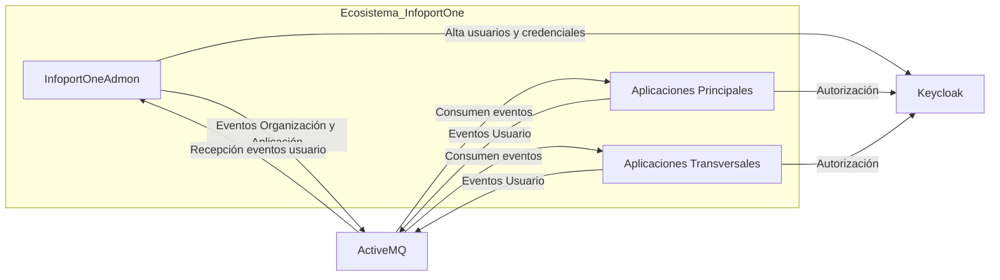
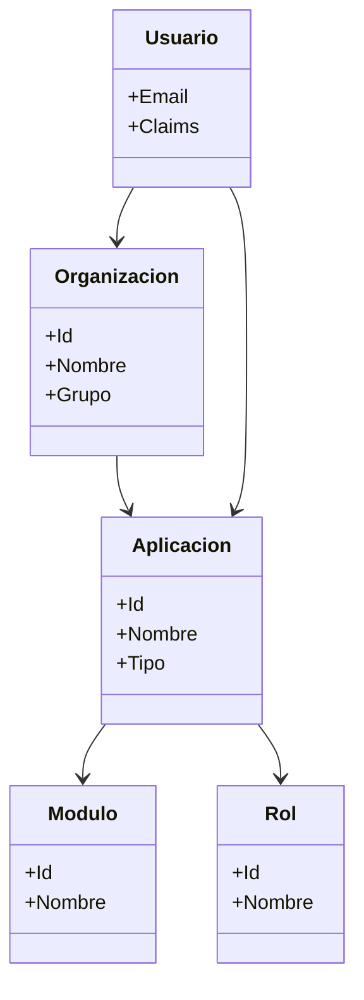
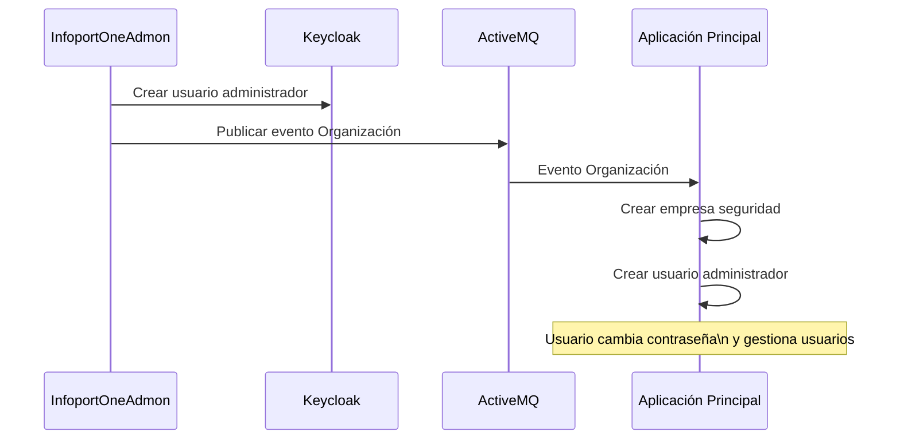
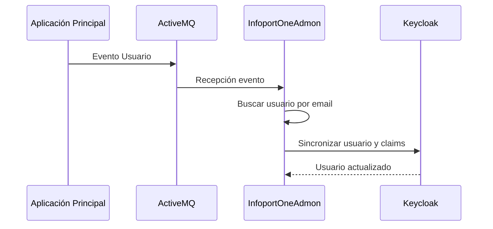
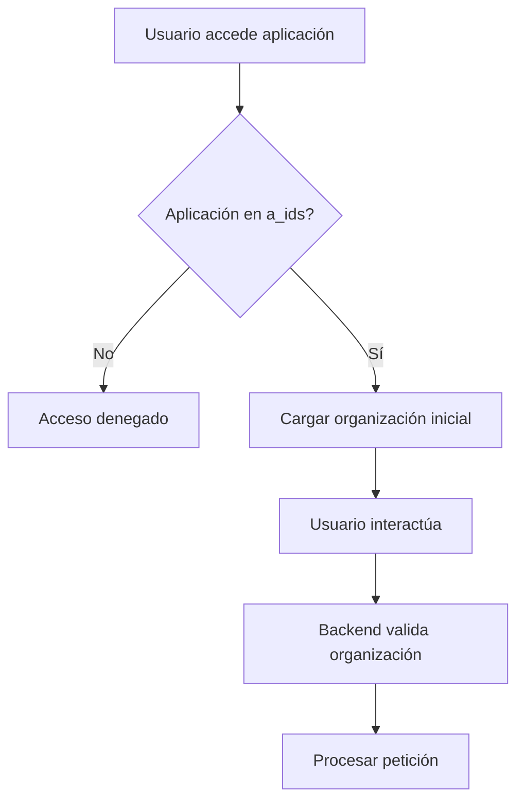
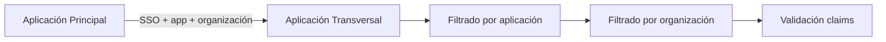
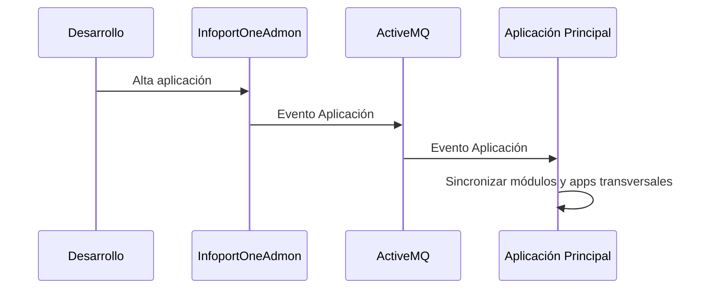
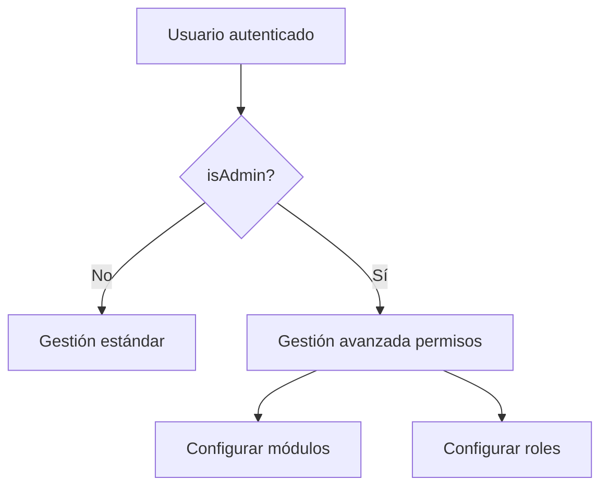
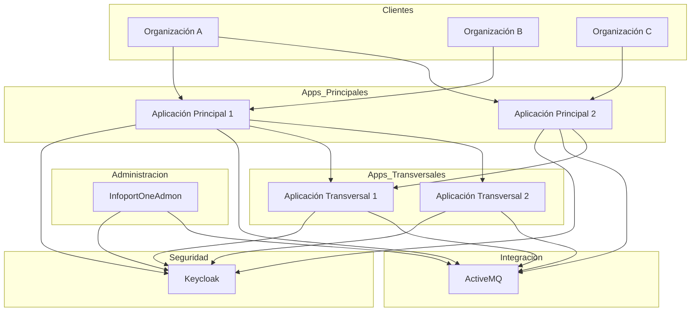

# Arquitectura de Gestión de Organizaciones, Aplicaciones y Usuarios - InfoportOne

## 1. Visión General

La solución propuesta permite gestionar organizaciones, aplicaciones y usuarios dentro del ecosistema **InfoportOne** mediante una arquitectura SaaS desacoplada basada en:

- Aplicaciones Helix7
- Keycloak para autenticación/autorización
- ActiveMQ como bus de eventos
- Arquitectura multi-organización y multi-aplicación

---

# 2. Arquitectura General de la Solución

---

# 3. Componentes de la Arquitectura

## 3.1 InfoportOneAdmon

Aplicación central encargada de:

- Gestión de organizaciones
- Gestión de aplicaciones
- Gestión de credenciales
- Integración con Keycloak
- Integración con ActiveMQ

## Responsabilidades

### Gestión de Organizaciones

- Datos básicos de organización
- Módulos disponibles por organización
- Agrupación de organizaciones

### Gestión de Aplicaciones

- Datos básicos
- Gestión de módulos
- Gestión de roles
- Relación entre aplicaciones principales y transversales
- Gestión de credenciales:
  - CODE PKCE
  - Client Credentials

---

## 3.2 Aplicaciones Principales

Las aplicaciones principales:

- Son multi-organización
- Gestionan usuarios
- Gestionan permisos detallados
- Gestionan acceso a aplicaciones transversales

### Responsabilidades

- Gestión de permisos por módulo
- Gestión de permisos por rol
- Gestión de usuarios
- Asociación de módulos propios y transversales

---

## 3.3 Aplicaciones Transversales

Las aplicaciones transversales:

- No gestionan usuarios
- Son multi-organización
- Son multi-aplicación

### Responsabilidades

- Gestión de módulos
- Gestión de roles
- Filtrado por organización y aplicación

---

# 4. Modelo Conceptual

---

# 5. Flujo de Alta de Nueva Organización

## Descripción

Cuando se crea una organización:

1. Se registra en InfoportOneAdmon
2. Se generan permisos sobre aplicaciones
3. Se crea usuario administrador en Keycloak
4. Se publica evento de organización
5. Las aplicaciones consumen el evento
6. Se crean estructuras internas de seguridad

## Diagrama

---

# 6. Flujo de Alta de Usuario

## Descripción

El alta de usuario se realiza desde una aplicación principal.

## Proceso

1. Se crea usuario
2. Se asignan módulos
3. Se publica evento
4. InfoportOneAdmon verifica existencia
5. Se sincroniza Keycloak
6. Se actualizan claims

## Claims utilizados

| Claim | Descripción |
|---|---|
| c_ids | Organizaciones permitidas |
| a_ids | Aplicaciones permitidas |
| modules | Módulos permitidos |
| isAdmin | Superadministrador |

## Diagrama

---

# 7. Acceso a Aplicación Principal

## Reglas de acceso

- Se valida que la aplicación exista en `a_ids`
- Se carga organización inicial desde `c_ids`
- Todo acceso al backend se filtra por organización
- El backend valida siempre los claims

## Diagrama

---

# 8. Acceso a Aplicación Transversal

## Escenario desde aplicación principal

La aplicación principal abre la transversal enviando:

- Aplicación origen
- Organización origen

## Escenario directo

Si se accede directamente:

- Se selecciona primera aplicación disponible
- Se selecciona primera organización disponible

## Diagrama

---

# 9. Alta de Nueva Aplicación

## Proceso

1. Se desarrolla aplicación Helix7
2. Se configura identificador único
3. Se registra en InfoportOneAdmon
4. Se publican eventos
5. Las aplicaciones sincronizan configuración

## Diagrama

---

# 10. Configuración de Permisos por Superadministrador

## Claim especial

`isAdmin = true`

## Capacidades

- Configurar permisos por módulo
- Configurar permisos por rol
- Administración avanzada

## Diagrama

---

# 11. Arquitectura SaaS Completa

---

# 12. Beneficios de la Arquitectura

## Escalabilidad

- Arquitectura desacoplada mediante eventos
- Nuevas aplicaciones integrables fácilmente

## Seguridad

- Centralización de autenticación en Keycloak
- Claims desacoplados y auditables

## Multi-tenant

- Multi-organización
- Multi-aplicación
- Filtrado contextual

## Mantenibilidad

- Separación clara de responsabilidades
- Integración estándar mediante eventos

## Extensibilidad

- Soporte sencillo para nuevas aplicaciones
- Integración de módulos transversales
