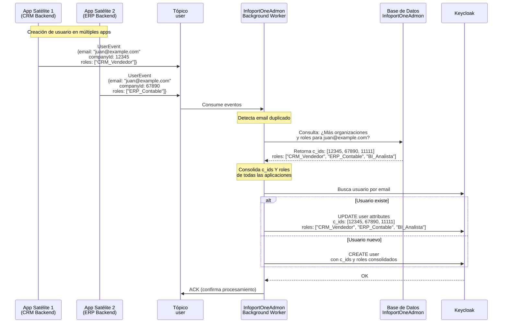
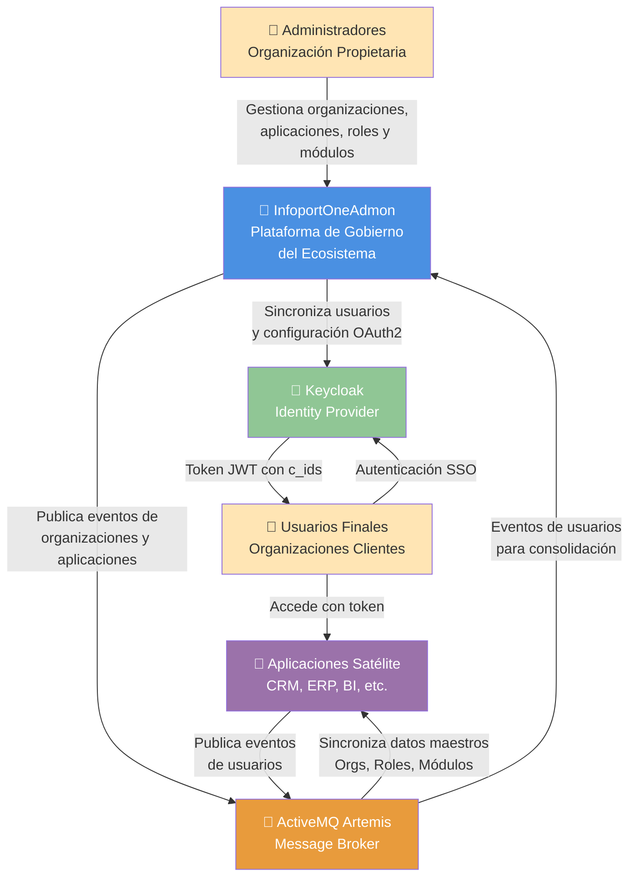
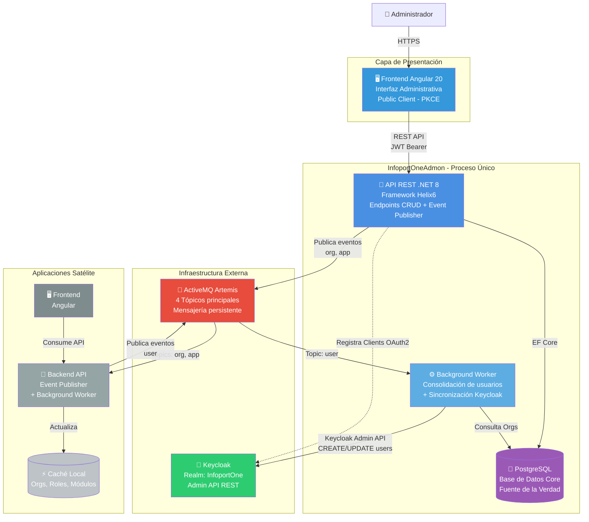
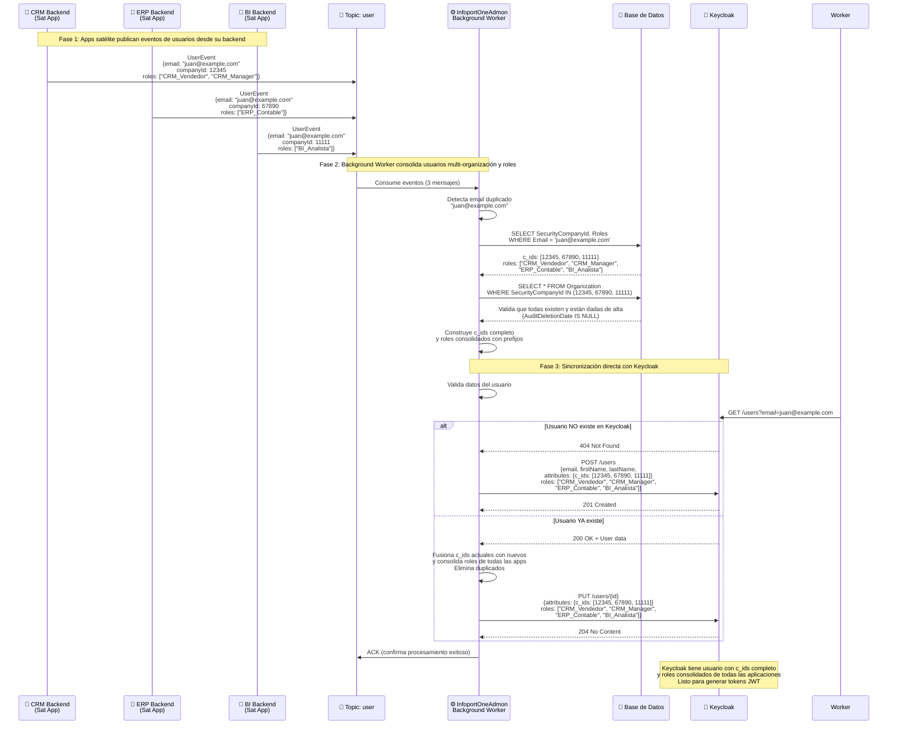
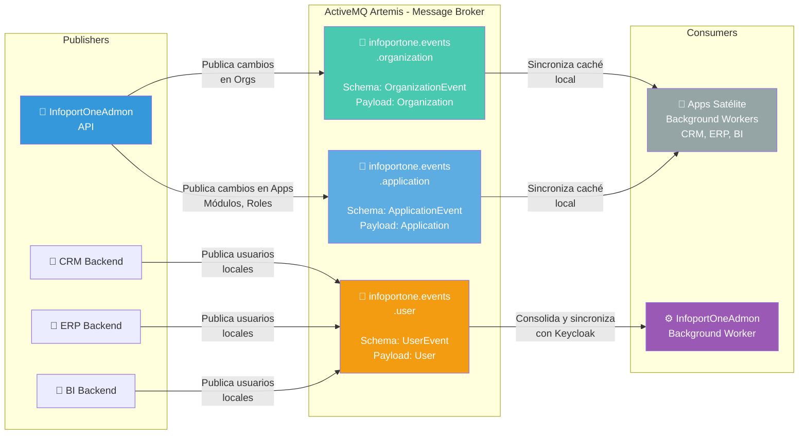
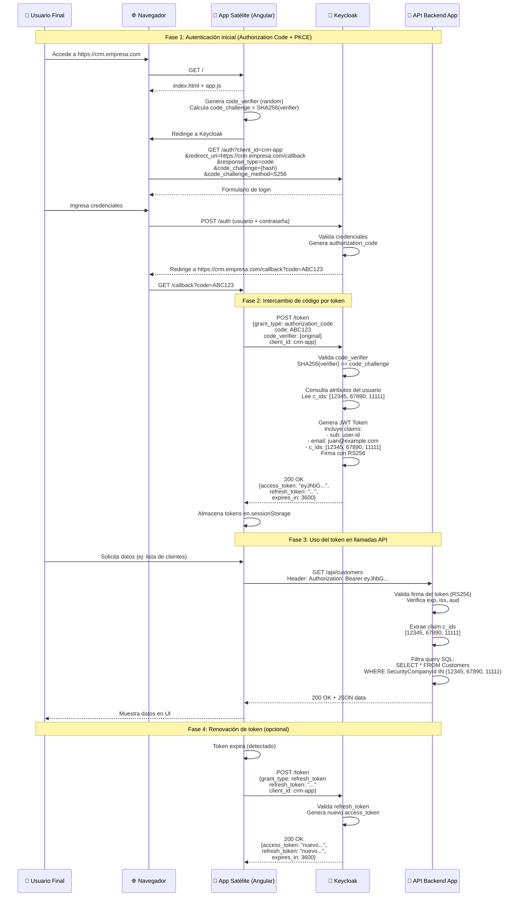

## Índice

0. [Ficha del proyecto](#0-ficha-del-proyecto)
1. [Descripción general del producto](#1-descripción-general-del-producto)
2. [Arquitectura del sistema](#2-arquitectura-del-sistema)
3. [Modelo de datos](#3-modelo-de-datos)
4. [Especificación de la API](#4-especificación-de-la-api)
5. [Historias de usuario](#5-historias-de-usuario)
6. [Tickets de trabajo](#6-tickets-de-trabajo)
7. [Pull requests](#7-pull-requests)

---

## 0. Ficha del proyecto

### **0.1. Tu nombre completo: Miguel Albert Villanova**

### **0.2. Nombre del proyecto: InfoportOneAdmon**

### **0.3. Descripción breve del proyecto:**

**InfoportOneAdmon** es la plataforma administrativa centralizada diseñada para la gestión integral del **portfolio de aplicaciones empresariales** de la Organización Propietaria. Actúa como el núcleo de gobierno y control de acceso del ecosistema, permitiendo a la Organización Propietaria determinar de forma centralizada qué organizaciones clientes tienen acceso a cada aplicación del portfolio, qué módulos funcionales pueden utilizar dentro de cada una, y qué roles de seguridad están disponibles para sus usuarios en el sistema.

A diferencia de modelos SaaS de auto-servicio, en este ecosistema **las organizaciones no se registran por sí mismas**. Es la Organización Propietaria quien, a través de InfoportOneAdmon, ejecuta el proceso completo de onboarding: da de alta las organizaciones clientes, las agrupa lógicamente, configura sus permisos de acceso a aplicaciones y módulos, y provisiona su identidad digital mediante integración con **Keycloak** para la gestión unificada de usuarios y autenticación.

**InfoportOneAdmon actúa como la Fuente de la Verdad para:**
- **Gestión del Portfolio de Aplicaciones**: Registro y configuración de las aplicaciones satélite del ecosistema, incluyendo credenciales OAuth2 y definición de módulos funcionales
- **Control de Acceso por Organización**: Determinación granular de qué organizaciones clientes tienen acceso a qué aplicaciones y a qué módulos específicos dentro de cada aplicación
- **Gestión de Inquilinos (Tenants)**: Control del ciclo de vida completo de las organizaciones clientes, desde el alta hasta la baja
- **Gestión de Grupos de Organizaciones**: Creación y mantenimiento de agrupaciones lógicas (holdings, consorcios) para facilitar la gestión colectiva
- **Catálogo Maestro de Roles**: Definición centralizada y consistente de los roles de seguridad disponibles en cada aplicación del portfolio
- **Gobierno de Identidad y Usuarios**: Orquestación con Keycloak para la gestión de usuarios multi-organización, autenticación SSO y tokens JWT con claims personalizados que habilitan el acceso segmentado por organización

El sistema utiliza una arquitectura orientada a eventos basada en **ActiveMQ Artemis** con patrón "State Transfer Event", garantizando desacoplamiento total entre InfoportOneAdmon y las aplicaciones satélite, permitiendo que cada aplicación mantenga su propia autonomía operacional mientras sincroniza automáticamente los datos maestros de organizaciones, roles y permisos.

### **0.4. URL del proyecto:**

(Sin definir al no tener implementado ni desplegado el producto)

### 0.5. URL o archivo comprimido del repositorio

https://github.com/malbert-infoport/AI4Devs-Final-Project


---

## 1. Descripción general del producto

### **1.1. Objetivo:**

#### **Propósito del Producto**

InfoportOneAdmon centraliza la complejidad administrativa del ecosistema de aplicaciones empresariales para que las aplicaciones de negocio (Sintraport, Translate, etc.) puedan centrarse exclusivamente en su lógica funcional y en la gestión de sus propios usuarios finales.

**Misión**: Centralizar la gestión del portfolio de aplicaciones, el onboarding de organizaciones clientes, la configuración de accesos granulares por aplicación y módulo, y el gobierno de identidad, liberando a las aplicaciones satélite de la complejidad de gestión multi-tenant y seguridad transversal.

#### **Valor que Aporta**

1. **Control Total del Ecosistema**: Permite a la Organización Propietaria mantener un control absoluto sobre quién accede al ecosistema, a qué aplicaciones, y con qué permisos, sin depender de auto-registros incontrolados.

2. **Simplificación de Aplicaciones Satélite**: Las aplicaciones del portfolio no necesitan implementar lógica compleja de multi-organización ni gestión de tenants. Solo deben validar tokens JWT y consumir eventos de sincronización.

3. **Seguridad Centralizada y Consistente**: Al orquestar Keycloak desde un único punto, se garantiza coherencia en la autenticación, autorización y claims personalizados en todo el ecosistema.

4. **Flexibilidad Comercial**: Permite modelos de negocio sofisticados donde no todas las organizaciones contratan todas las funcionalidades. El sistema de módulos habilita ventas granulares por funcionalidad.

5. **Escalabilidad mediante Desacoplamiento**: La arquitectura orientada a eventos (ActiveMQ Artemis) permite que el ecosistema crezca sin crear dependencias síncronas entre sistemas.

6. **Auditoría y Compliance**: Proporciona trazabilidad completa de todos los cambios administrativos (altas, bajas, modificaciones de acceso), esencial para cumplimiento normativo.

#### **Qué Soluciona**

- **Problema de Onboarding Manual**: Elimina procesos manuales y descentralizados de alta de clientes. Todo el provisioning se ejecuta desde una única interfaz.

- **Inconsistencia de Roles**: Sin un catálogo maestro, cada aplicación podría definir roles con nombres diferentes para conceptos similares. InfoportOneAdmon garantiza coherencia.

- **Complejidad de Multi-Organización**: Resuelve el desafío técnico de usuarios que trabajan para múltiples organizaciones mediante claims, algo que la feature nativa de Organizations de Keycloak no soporta.

- **Falta de Gobierno de Acceso**: Sin InfoportOneAdmon, cada aplicación tendría que gestionar individualmente qué organizaciones tienen acceso, creando inconsistencias y agujeros de seguridad.

- **Acoplamiento Técnico**: Evita que las aplicaciones satélite dependan síncronamente de un sistema central de configuración. Los eventos permiten que cada app opere autónomamente con su copia local de datos maestros.

#### **Para Quién**

**Usuario Principal**: **Administradores de la Organización Propietaria**
- Responsables del onboarding de nuevos clientes (organizaciones)
- Gestores de seguridad que configuran accesos a aplicaciones y módulos
- Administradores de identidad que orquestan usuarios y roles

**Beneficiarios Indirectos**:
- **Equipos de Desarrollo de Aplicaciones Satélite**: Consumen datos maestros de organizaciones y roles sin implementar lógica administrativa compleja
- **Usuarios Finales de las Organizaciones Clientes**: Experimentan SSO fluido y acceso coherente a todas las aplicaciones del ecosistema
- **Dirección Ejecutiva**: Obtiene visibilidad y control total sobre el portfolio de aplicaciones y la base de clientes

**Tipo de Ecosistema**: Diseñado para organizaciones que gestionan un **portfolio de aplicaciones B2B propias** donde los clientes son otras empresas (no consumidores finales) y donde la Organización Propietaria necesita control total sobre el acceso y la seguridad.

### **1.2. Características y funcionalidades principales:**

InfoportOneAdmon ofrece seis módulos funcionales principales que cubren todo el ciclo de vida administrativo del ecosistema de aplicaciones:

#### **1.2.1. Gestión de Organizaciones (Clientes)**

Módulo que permite gestionar el ciclo de vida completo de las empresas clientes del ecosistema.

**Capacidades principales:**
- ✅ **Onboarding de Clientes**: Alta de nueva organización en un único paso, generando automáticamente su `SecurityCompanyId` (identificador único inmutable)
- 🛠️ **Gestión de Configuración**: Modificación de datos corporativos (nombre, dirección, datos fiscales)
- 🔌 **Baja de Organizaciones**: Bloqueo inmediato de acceso de una organización a todo el ecosistema mediante `AuditDeletionDate`. Al dar de baja una organización, se propaga automáticamente la baja de todos sus usuarios en Keycloak
- 🔄 **Alta de Organizaciones**: Reversión de una baja estableciendo `AuditDeletionDate = null`, reactivando el acceso de la organización y sus usuarios
- 🧾 **Auditoría Selectiva**: Trazabilidad de cambios críticos en seguridad y permisos (asignación/remoción de módulos, activación/desactivación, cambios de grupo). No se auditan cambios en datos básicos (nombre, dirección, contacto)
- 📢 **Publicación de Eventos**: Cada cambio genera un `OrganizationEvent` que se publica en ActiveMQ Artemis para sincronización con aplicaciones satélite

**Objetivo**: Centralizar el alta administrativa y técnica de clientes en un solo paso, garantizando coherencia en todo el ecosistema.

#### **1.2.2. Gestión de Grupos de Organizaciones**

Permite agrupar organizaciones lógicamente para facilitar la administración colectiva (ej: holdings, consorcios, franquicias).

**Capacidades principales:**
- 🆕 **Creación de Grupos**: Definir nuevos grupos de organizaciones (ej: "Grupo Logístico Peninsular", "Holding Financiero Norte")
- 🔄 **Asociación de Miembros**: Asignar o modificar el `GroupId` de una organización para incluirla en un grupo
- 🗑️ **Gestión del Ciclo de Vida**: Modificar grupos. Las aplicaciones satélite eliminan automáticamente grupos sin organizaciones
- 📢 **Propagación de Cambios**: Los cambios en grupos se publican mediante `OrganizationEvent` (incluyen campos `GroupId` y `GroupName`)

**Nota importante**: Los grupos NO tienen eventos propios; se propagan como parte del evento de organización.

#### **1.2.3. Gestión del Portfolio de Aplicaciones**

Permite registrar y configurar las aplicaciones satélite que forman parte del ecosistema.

**Capacidades principales:**
- 🆕 **Registro de Aplicación Frontend (Angular SPA)**: Alta como public client con `client_id` únicamente, habilitando PKCE para autenticación segura sin secretos
- 🔐 **Registro de Aplicación Backend (API)**: Alta como confidential client con generación de `client_id` y `client_secret`, con gestión segura de credenciales
- 🏷️ **Prefijo de Aplicación**: Cada aplicación tiene un prefijo único (ej: "STP" para Sintraport, "CRM" para CRM) que se utiliza para nomenclatura de roles y módulos. Los módulos usan "M" + prefijo (ej: MSTP_Trafico), los roles usan solo el prefijo (ej: STP_AsignadorTransporte)
- 🔄 **Gestión de Credenciales**: Administración segura de credenciales para confidential clients (backends). Las aplicaciones pueden tener una credencial CODE PKCE para acceso web y múltiples credenciales ClientCredentials para accesos externos
- 🔌 **Baja de Aplicaciones**: Dar de baja aplicaciones mediante `AuditDeletionDate`, revocando automáticamente sus credenciales en Keycloak
- 🧩 **Definición de Módulos**: Cada aplicación debe tener al menos un módulo. Los módulos representan agrupaciones funcionales vendibles por separado
- 📘 **Catálogo de Roles**: Definir qué roles existen dentro de cada aplicación (ej: "Tráfico", "Mensajería", "Administrador")
- ✨ **Sincronización de Datos**: Funcionalidad para enviar catálogos completos publicando eventos cuyo `Payload` contiene listas de objetos

**Nota sobre seguridad**: Las aplicaciones Angular (public clients) utilizan Authorization Code Flow with PKCE (S256) y no requieren almacenar secretos. Solo las APIs backend (confidential clients) requieren `client_secret`.

**Objetivo**: Mantener el inventario completo del portfolio de aplicaciones y sus capacidades (módulos y roles).

#### **1.2.4. Gestión de Módulos por Aplicación**

Define agrupaciones funcionales (módulos) dentro de cada aplicación y configura qué organizaciones tienen acceso a cada módulo.

**Capacidades principales:**
- 🧩 **Definición de Módulos**: Crear módulos para una aplicación siguiendo la nomenclatura "M" + RolePrefix (ej: si RolePrefix="STP", módulos como "MSTP_Trafico", "MSTP_Almacen", "MSTP_Facturacion")
- ⚙️ **Configuración de Acceso**: Asignar qué organizaciones tienen acceso a qué módulos (relación N:M)
- 📢 **Propagación de Cambios**: Los cambios se publican en eventos `ApplicationEvent` (catálogo de módulos) y `OrganizationEvent` (permisos de acceso)
- 📊 **Visibilidad de Contratación**: Permite a las aplicaciones saber exactamente qué funcionalidades están habilitadas para cada organización

**Regla de negocio**: Toda aplicación debe tener como mínimo un módulo. Los módulos son obligatorios.

**Objetivo**: Habilitar un modelo de negocio flexible donde no todas las organizaciones contratan todas las funcionalidades de una aplicación.

#### **1.2.5. Gestión de Definiciones de Roles (Catálogo)**

Define qué roles existen dentro de cada aplicación del ecosistema. Los roles se sincronizan como parte del `ApplicationEvent`.

**Capacidades principales:**
- 📘 **Definición de Roles**: Definir roles para una aplicación siguiendo la nomenclatura RolePrefix + nombre (ej: si RolePrefix="STP", roles como "STP_AsignadorTransporte", "STP_Supervisor", "STP_Operador")
- 🔌 **Baja de Roles**: Dar de baja roles mediante `AuditDeletionDate`. Los roles dados de baja no se pueden asignar a nuevos usuarios, pero los usuarios existentes pueden mantenerlos
- 🔄 **Sincronización**: Los roles se publican automáticamente con el `ApplicationEvent` (junto con módulos)
- 📋 **Catálogo Único**: Asegura que todos los sistemas usen nombres consistentes para los mismos conceptos de rol
- 🏷️ **Prefijos Únicos**: El uso de prefijos de aplicación evita conflictos cuando un usuario tiene roles en múltiples aplicaciones

**Principio clave**: InfoportOneAdmon define los roles (catálogo), las aplicaciones satélite los asignan a usuarios.

**Objetivo**: Garantizar coherencia en los nombres de roles y flexibilidad en su asignación por las aplicaciones.

#### **1.2.6. Integración Transparente con Keycloak**

Abstrae la complejidad de Keycloak. Los administradores no necesitan acceder directamente a su consola.

**Capacidades principales:**
- 🔄 **Sincronización de Usuarios**: Consumo de eventos `UserEvent` publicados por aplicaciones satélite para crear/actualizar usuarios en Keycloak
- 🧩 **Claims Personalizados**: Configuración automática del claim `c_ids` (company ids) con la lista de `SecurityCompanyId` de todas las organizaciones del usuario. Se define como **atributo multivalor** en Keycloak
- 🔑 **Mapeo de Protocol Mappers**: Configuración automática para incluir claims personalizados en tokens JWT
- 👥 **Gestión Multi-Organización**: Detección automática de usuarios existentes por email y fusión de organizaciones en el claim `c_ids`
- 🏢 **Single Realm**: Utiliza un único realm (InfoportOne) para todo el ecosistema, habilitando SSO real
- 🔐 **PKCE para SPAs**: Configuración automática de clientes públicos con PKCE (Proof Key for Code Exchange) para aplicaciones Angular, eliminando la necesidad de secretos en el cliente

**Nota importante**: No se utiliza la feature nativa de Organizations de Keycloak porque no soporta usuarios en múltiples organizaciones.

**Objetivo**: Proporcionar gobierno de identidad centralizado sin que los administradores necesiten conocer Keycloak.

#### **1.2.7. Arquitectura Orientada a Eventos (ActiveMQ Artemis)**

Mecanismo de comunicación asíncrona basado en el patrón **"State Transfer Event"** con especialización para usuarios multi-organización.

**Capacidades principales:**
- 📣 **Publicación de Eventos de Estado**: En lugar de notificar acciones (ej. "se creó X"), se notifica el estado final de la entidad
- 🔄 **Sincronización Robusta**: Los consumidores aplican lógica "upsert" (si existe actualiza, si no crea) o eliminan si `IsDeleted=true`
- 📋 **Tópicos por Entidad**: 
  - `infoportone.events.organization`: Organizaciones y grupos
  - `infoportone.events.application`: Aplicaciones, módulos y roles
  - `infoportone.events.user`: Usuarios publicados por apps satélite (consolidados por InfoportOneAdmon)
- 📦 **Payload como Lista**: Cada evento transporta un array de objetos, permitiendo sincronizaciones masivas
- 🔒 **Prevención de Duplicados**: Sistema de hash SHA-256 que evita publicar eventos idénticos consecutivos, reduciendo tráfico innecesario
- 🆔 **Trazabilidad**: Cada evento incluye `EventId` (UUID), `TraceId` (correlación), `OriginApplicationId` (emisor)
- 🧩 **Patrón Aggregator Integrado**: El Background Worker de InfoportOneAdmon consolida usuarios multi-organización y sincroniza directamente con Keycloak

**Flujo de Sincronización de Usuarios Multi-Organización:**



**Ventajas de la arquitectura integrada**:
1. **Apps satélite simplificadas**: Solo publican eventos con su `companyId` local y sus roles específicos desde su backend
2. **Consistencia garantizada**: InfoportOneAdmon es fuente de verdad para relaciones usuario-organización y consolidación de roles
3. **Keycloak siempre sincronizado**: El claim `c_ids` refleja todas las organizaciones reales del usuario y los roles consolidados de todas las aplicaciones
4. **Evita conflictos de roles**: El uso de prefijos de aplicación en los roles (ej: CRM_Vendedor, ERP_Contable) garantiza unicidad
5. **Menor latencia**: Sincronización directa sin pasos intermedios
6. **Arquitectura simplificada**: Un solo proceso (InfoportOneAdmon) con Background Worker integrado

**Objetivo**: Garantizar desacoplamiento total entre InfoportOneAdmon y las aplicaciones satélite, permitiendo autonomía operacional mientras se mantiene consistencia en la identidad multi-organización.

##### **1.3.1. Modelo de Datos de Eventos (Event Schema)**

InfoportOneAdmon utiliza un modelo estandarizado para todos los eventos publicados en ActiveMQ Artemis, garantizando consistencia y facilidad de integración para las aplicaciones satélite.

###### **Estructura Base de Evento (Envelope)**

Todos los eventos comparten una estructura común (envelope) que contiene metadatos de trazabilidad y el payload específico:

```json
{
  "EventId": "f47ac10b-58cc-4372-a567-0e02b2c3d479",
  "EventType": "USER_SYNC",
  "EventTimestamp": "2026-01-15T14:35:22.123Z",
  "TraceId": "trace-abc-123-xyz",
  "OriginApplicationId": "infoportone-admon",
  "SchemaVersion": "1.0",
  "Payload": [
    { /* objetos específicos del evento */ }
  ]
}
```

**Campos del Envelope:**
- `EventId` (UUID): Identificador único del evento, permite deduplicación
- `EventType` (string): Tipo de evento (`ORGANIZATION`, `APPLICATION`, `USER`, `USER_SYNC`)
- `EventTimestamp` (ISO 8601): Marca temporal de publicación en UTC
- `TraceId` (string): Identificador de correlación para debugging distribuido
- `OriginApplicationId` (string): Aplicación que publicó el evento
- `SchemaVersion` (string): Versión del esquema del payload (versionado evolutivo)
- `Payload` (array): Lista de objetos del tipo correspondiente

###### **Evento de Usuario (Apps Satélite → InfoportOneAdmon)**

**Tópico**: `infoportone.events.user`

**Publicado por**: Aplicaciones satélite cuando crean/modifican/eliminan usuarios

**Estructura del Payload**:
```json
{
  "EventId": "uuid-123",
  "EventType": "USER",
  "EventTimestamp": "2026-01-15T14:35:22Z",
  "TraceId": "trace-crm-001",
  "OriginApplicationId": "crm-app-backend",
  "SchemaVersion": "1.0",
  "Payload": [
    {
      "Email": "juan.perez@example.com",
      "FirstName": "Juan",
      "LastName": "Pérez",
      "SecurityCompanyId": 12345,
      "IsDeleted": false,
      "Roles": ["Sales", "Manager"],
      "Attributes": {
        "Department": "Ventas",
        "Phone": "+34 600 123 456",
        "EmployeeId": "EMP-001"
      },
      "CreatedBy": "admin@crm.com",
      "CreatedDate": "2026-01-15T14:30:00Z"
    }
  ]
}
```

**Campos del objeto USER:**
- `Email` (string, required): Email del usuario (único, clave de búsqueda)
- `FirstName` (string, required): Nombre
- `LastName` (string, required): Apellidos
- `SecurityCompanyId` (int, required): ID de la organización a la que pertenece en esta app
- `IsDeleted` (bool): Flag de soft delete (true = eliminar de Keycloak)
- `Roles` (string[]): Roles asignados en la aplicación origen
- `Attributes` (object): Atributos personalizados adicionales
- `CreatedBy` (string): Usuario que creó el registro
- `CreatedDate` (ISO 8601): Fecha de creación

**Nota importante sobre consolidación**: 
- En esta fase, el evento contiene **solo una organización** (`SecurityCompanyId`). La consolidación multi-organización la realiza el Background Worker de InfoportOneAdmon
- El Background Worker sincroniza directamente con Keycloak mediante Admin API, configurando el atributo `c_ids` como **atributo multivalor** (array de strings en la API de Keycloak) que contiene el array completo de todas las organizaciones del usuario
- No se publica un evento adicional tras la consolidación

###### **Evento de Organización**

**Tópico**: `infoportone.events.organization`

**Publicado por**: InfoportOneAdmon (módulo de Organizaciones)

**Consumido por**: Todas las aplicaciones satélite

**Estructura del Payload**:
```json
{
  "EventId": "uuid-789",
  "EventType": "ORGANIZATION",
  "EventTimestamp": "2026-01-15T15:00:00Z",
  "TraceId": "trace-admin-001",
  "OriginApplicationId": "infoportone-admon",
  "SchemaVersion": "1.0",
  "Payload": [
    {
      "SecurityCompanyId": 12345,
      "Name": "ACME Corporation",
      "TaxId": "A12345678",
      "Address": "Calle Mayor 123",
      "City": "Madrid",
      "Country": "España",
      "IsDeleted": false,
      "GroupId": 100,
      "GroupName": "Holding Empresarial",
      "Apps": [
        {
          "AppId": 5,
          "DatabaseName": "org_12345_crm",
          "AccessibleModules": [10, 11]
        },
        {
          "AppId": 8,
          "DatabaseName": "org_12345_erp",
          "AccessibleModules": [25, 26, 27]
        }
      ],
      "CreatedDate": "2025-06-01T10:00:00Z",
      "ModifiedDate": "2026-01-15T15:00:00Z"
    }
  ]
}
```

**Campos del objeto ORGANIZATION:**
- `SecurityCompanyId` (int, required): Identificador único de la organización
- `Name` (string, required): Nombre de la organización
- `TaxId` (string): Identificador fiscal
- `Address`, `City`, `Country` (string): Datos de ubicación
- `IsDeleted` (bool): Flag de soft delete
- `GroupId` (int, optional): ID del grupo al que pertenece
- `GroupName` (string, optional): Nombre del grupo
- `Apps` (array): **Lista de aplicaciones con acceso y configuración específica de esta organización**
  - `AppId` (int): ID de la aplicación
  - `DatabaseName` (string): Nombre de la base de datos específica para esta org y app
  - `AccessibleModules` (int[]): IDs de los módulos a los que tiene acceso esta organización
- `CreatedDate`, `ModifiedDate` (ISO 8601): Fechas de auditoría

**Ventajas de este diseño:**
- ✅ **Cohesión perfecta**: Toda la información de permisos de una organización está en su propio evento
- ✅ **Eficiencia**: Cambiar acceso a módulos de una org = 1 solo OrganizationEvent (no N ApplicationEvents)
- ✅ **Simplicidad**: Apps satélite procesan solo eventos de organizaciones relevantes
- ✅ **Onboarding natural**: Alta de organización incluye directamente qué puede usar

###### **Evento de Aplicación (Catálogo de Módulos y Roles)**

**Tópico**: `infoportone.events.application`

**Propósito**: Define QUÉ ES la aplicación (su catálogo de módulos y roles disponibles). NO incluye información de permisos por organización, eso va en OrganizationEvent.

**Estructura del Payload**:
```json
{
  "EventId": "uuid-999",
  "EventType": "APPLICATION",
  "EventTimestamp": "2026-01-15T16:00:00Z",
  "TraceId": "trace-admin-002",
  "OriginApplicationId": "infoportone-admon",
  "SchemaVersion": "1.0",
  "Payload": [
    {
      "ApplicationId": 5,
      "Name": "CRM Application",
      "RolePrefix": "CRM",
      "ClientId": "crm-app-backend",
      "Modules": [
        {
          "ApplicationModuleId": 10,
          "Name": "MCRM_Sales",
          "Description": "Gestión de ventas"
        },
        {
          "ApplicationModuleId": 11,
          "Name": "MCRM_Reporting",
          "Description": "Reportes avanzados"
        }
      ],
      "Roles": [
        {
          "RoleId": 20,
          "Name": "CRM_Sales",
          "Description": "Vendedor"
        },
        {
          "RoleId": 21,
          "Name": "CRM_Manager",
          "Description": "Gerente"
        }
      ]
    }
  ]
}
```

**Campos del objeto APPLICATION:**
- `ApplicationId` (int): Identificador único de la aplicación
- `Name` (string): Nombre de la aplicación
- `RolePrefix` (string): Prefijo para nomenclatura de roles y módulos
- `ClientId` (string): OAuth2 client_id
- `Modules` (array): Catálogo de módulos disponibles (sin permisos)
- `Roles` (array): Catálogo de roles disponibles

**Nota importante**: Este evento define el CATÁLOGO de la aplicación. Los permisos de acceso por organización se definen en el `OrganizationEvent`.

###### **Patrones de Procesamiento de Eventos**

**Para consumidores (Apps Satélite y Workers):**

```csharp
// Pseudocódigo de consumo idempotente
public async Task ProcessEvent(EventEnvelope envelope)
{
    foreach (var item in envelope.Payload)
    {
        if (item.IsDeleted)
        {
            await DeleteLocalEntity(item);
        }
        else
        {
            // Upsert: Update si existe, Insert si no
            await UpsertLocalEntity(item);
        }
    }
}
```

**Validación de esquema:**
```csharp
public bool ValidateEventSchema(EventEnvelope envelope)
{
    // Validar que SchemaVersion es compatible
    if (!IsSupportedVersion(envelope.SchemaVersion))
        return false;
    
    // Validar campos requeridos según tipo de evento
    if (envelope.EventType == "USER_SYNC")
    {
        foreach (var user in envelope.Payload)
        {
            if (string.IsNullOrEmpty(user.Email)) return false;
            if (user.CompanyIds == null || user.CompanyIds.Length == 0) return false;
        }
    }
    
    return true;
}
```

###### **Versionado de Esquemas**

El sistema soporta evolución de esquemas mediante el campo `SchemaVersion`:

- **v1.0**: Versión inicial
- **v1.1**: Podría agregar campos opcionales sin romper compatibilidad
- **v2.0**: Cambios que rompen compatibilidad (requieren actualización de consumidores)
 
**Estrategia de migración:**
1. Publicar eventos con ambas versiones durante período de transición 
2. Consumidores implementan lógica para soportar múltiples versiones
3. Deprecación gradual de versiones antiguas con notificaciones

### **1.3. Diseño y experiencia de usuario:**

> Proporciona imágenes y/o videotutorial mostrando la experiencia del usuario desde que aterriza en la aplicación, pasando por todas las funcionalidades principales.0

### **1.4. Instrucciones de instalación:**

**(No son completas al no tener implementado ni desplegado el producto)**

InfoportOneAdmon está construido sobre el framework Helix6 para .NET 8. A continuación se detallan los pasos para instalar y poner en marcha el proyecto en un entorno de desarrollo local.

#### **1.4.1. Requisitos Previos**

**Software necesario**:
- **.NET 8 SDK** (8.0 o superior)
- **Visual Studio 2022** (17.8+) o **Visual Studio Code** con extensión C#
- **PostgreSQL 15+**
- **Node.js 20+** y **npm** (para el frontend Angular)
- **Docker Desktop** (opcional, para ejecutar ActiveMQ Artemis y Keycloak localmente)
- **Git** para control de versiones

**Puertos requeridos** (configurables):
- `5000`: API Backend (HTTP)
- `5001`: API Backend (HTTPS)
- `4200`: Angular Frontend (desarrollo)
- `61616`: ActiveMQ Artemis (AMQP)
- `8080`: Keycloak

#### **1.4.2. Instalación del Backend (InfoportOneAdmon.Api)**

**Paso 1: Clonar el repositorio**
```powershell
git clone https://github.com/organizacion/InfoportOneAdmon.git
cd InfoportOneAdmon
```

**Paso 2: Restaurar dependencias NuGet**
```powershell
cd InfoportOneAdmon.Api
dotnet restore
```

**Dependencias principales de Helix6**:
- `Helix6.Base` (9.0.2) - Framework base
- `Helix6.Base.Domain` (9.0.2) - Dominio y contratos
- `Helix6.Base.Utils` (9.0.2) - Utilidades
- `Microsoft.EntityFrameworkCore` (9.0.2)
- `Mapster` (7.4.0)
- `Serilog.AspNetCore` (9.0.2)

**Paso 3: Configurar la cadena de conexión**

Editar `appsettings.Development.json`:
```json
{
  "ConnectionStrings": {
    "DefaultConnection": "Host=localhost;Database=InfoportOneAdmon;Username=postgres;Password=***;",
    "ConnectionStringType": "PostgreSQL"
  },
  "ApplicationContext": {
    "ApplicationName": "InfoportOneAdmon",
    "DBMSType": "PostgreSQL",
    "RolPrefixes": ["InfoportOne_"]
  },
  "Keycloak": {
    "AdminApiUrl": "http://localhost:8080/admin/realms/InfoportOne",
    "Realm": "InfoportOne",
    "ClientId": "infoportone-admin",
    "ClientSecret": "***"
  },
  "ActiveMQ": {
    "BrokerUri": "tcp://localhost:61616",
    "Username": "artemis",
    "Password": "artemis",
    "Topics": {
      "Organization": "infoportone.events.organization",
      "Application": "infoportone.events.application",
      "User": "infoportone.events.user"
    }
  }
}
```

> **Gestión de secretos en desarrollo**: Para desarrollo local, utilizar `dotnet user-secrets` en lugar de almacenar secretos en archivos:
> ```powershell
> dotnet user-secrets init
> dotnet user-secrets set "Keycloak:ClientSecret" "tu-secret-aqui"
> dotnet user-secrets set "ActiveMQ:Password" "tu-password-aqui"
> ```

**Paso 4: Crear y migrar la base de datos**

El proyecto utiliza **Entity Framework Core Code First**. Para crear la base de datos y aplicar las migraciones:

```powershell
# Instalar herramientas de EF Core (si no están instaladas)
dotnet tool install --global dotnet-ef

# Crear la migración inicial (si no existe)
dotnet ef migrations add InitialCreate --project InfoportOneAdmon.Data --startup-project InfoportOneAdmon.Api

# Aplicar migraciones a la base de datos
dotnet ef database update --project InfoportOneAdmon.Data --startup-project InfoportOneAdmon.Api
```

**Estructura de tablas creadas** (principales):
- `Organization`: Entidades de organizaciones clientes
- `OrganizationGroup`: Agrupaciones de organizaciones
- `Application`: Aplicaciones satélite registradas
- `ApplicationModule`: Módulos funcionales por aplicación
- `OrganizationApplicationModule`: Relación N:M entre módulos y organizaciones
- `ApplicationRole`: Catálogo de roles
- `AuditLog`: Auditoría selectiva de cambios críticos (sin campos JSON)
- `EventHash`: Control de eventos duplicados

> **Nota Helix6 - Auditoría Dual**: 
> - **Auditoría Base (Helix6)**: Todas las entidades heredan de `IEntityBase` e incluyen automáticamente campos de auditoría (`AuditCreationUser`, `AuditModificationUser`, `AuditCreationDate`, `AuditModificationDate`, `AuditDeletionDate`) que registran TODOS los cambios. Ver detalles en [Helix6_Backend_Architecture.md - Sección 2.5](Helix6_Backend_Architecture.md#25-proyectodatamodel-capa-de-modelo-de-datos).
> - **Auditoría Selectiva (AUDITLOG)**: Tabla adicional que registra SOLO cambios críticos en seguridad y permisos con contexto de acción específico. No duplica la funcionalidad de Helix6, sino que complementa con trazabilidad de acciones de negocio críticas.

**Paso 5: Poblar datos semilla (seed data)**

El proyecto puede incluir un seeder inicial. Ejecutar:

```powershell
dotnet run --project InfoportOneAdmon.Api --seed
```

O ejecutar scripts SQL manualmente:
```sql
-- Insertar organización propietaria
INSERT INTO Organization (Name, TaxId, SecurityCompanyId)
VALUES ('Organización Propietaria', 'A12345678', 1);

-- Insertar aplicación de ejemplo
INSERT INTO Application (Name, ClientId, ClientType)
VALUES ('CRM App', 'crm-app-frontend', 'Public');
```

**Paso 6: Ejecutar el backend**

```powershell
dotnet run --project InfoportOneAdmon.Api
```

La API estará disponible en:
- HTTP: `http://localhost:5000`
- HTTPS: `https://localhost:5001`
- Swagger UI: `https://localhost:5001/swagger`

> **Configuración de Serilog**: Los logs se escriben en `logs/log-{Date}.txt` y en consola. Configuración detallada en `appsettings.json` sección `Serilog`. Ver [Helix6_Backend_Architecture.md - Sección 7](Helix6_Backend_Architecture.md#7-bootstrapping-y-programcs) para detalles del bootstrapping.

#### **1.4.3. Instalación del Frontend (Angular)**

**Paso 1: Instalar dependencias**
```powershell
cd InfoportOneAdmon.Frontend
npm install
```

**Dependencias principales**:
- `@angular/core`: 20.x
- `@angular/router`: 20.x
- `@angular/common/http`: 20.x
- `oidc-client-ts`: Autenticación OAuth2/OIDC

**Paso 2: Configurar el entorno**

Editar `src/environments/environment.development.ts`:
```typescript
export const environment = {
  production: false,
  apiUrl: 'https://localhost:5001/api',
  keycloak: {
    issuer: 'http://localhost:8080/realms/InfoportOne',
    clientId: 'infoportone-admin-frontend',
    redirectUri: 'http://localhost:4200/callback',
    scope: 'openid profile email',
    responseType: 'code',
    pkce: true
  }
};
```

**Paso 3: Ejecutar el frontend**
```powershell
npm start
```

El frontend estará disponible en: `http://localhost:4200`

#### **1.4.4. Instalación de ActiveMQ Artemis (Message Broker)**

**Opción 1: Docker (Recomendado para desarrollo)**

```powershell
docker run -d --name artemis `
  -p 61616:61616 `
  -p 8161:8161 `
  -e ARTEMIS_USERNAME=artemis `
  -e ARTEMIS_PASSWORD=artemis `
  apache/activemq-artemis:latest
```

Consola web: `http://localhost:8161` (usuario: `artemis`, password: `artemis`)

**Opción 2: Instalación local**

1. Descargar desde https://activemq.apache.org/components/artemis/
2. Extraer y ejecutar:
```powershell
cd apache-artemis-2.31.0\bin
.\artemis create mybroker
cd ..\mybroker\bin
.\artemis run
```

**Configuración de tópicos**:
Los tópicos se crean automáticamente cuando InfoportOneAdmon publica el primer evento. No requiere configuración previa.

#### **1.4.5. Instalación de Keycloak (Identity Provider)**

**Opción 1: Docker (Recomendado para desarrollo)**

```powershell
docker run -d --name keycloak `
  -p 8080:8080 `
  -e KEYCLOAK_ADMIN=admin `
  -e KEYCLOAK_ADMIN_PASSWORD=admin `
  quay.io/keycloak/keycloak:23.0 `
  start-dev
```

Consola de administración: `http://localhost:8080` (usuario: `admin`, password: `admin`)

**Opción 2: Instalación local**

1. Descargar desde https://www.keycloak.org/downloads
2. Ejecutar:
```powershell
cd keycloak-23.0.0\bin
.\kc.bat start-dev
```

**Configuración inicial de Keycloak**:

1. **Crear el realm `InfoportOne`**:
   - Login en consola de administración
   - Crear nuevo realm: `InfoportOne`

2. **Registrar el cliente de InfoportOneAdmon**:
   ```json
   {
     "clientId": "infoportone-admin-frontend",
     "enabled": true,
     "publicClient": true,
     "redirectUris": ["http://localhost:4200/*"],
     "webOrigins": ["http://localhost:4200"],
     "standardFlowEnabled": true,
     "pkceCodeChallengeMethod": "S256"
   }
   ```

3. **Configurar Protocol Mapper para `c_ids`**:
   - Crear mapper de tipo "User Attribute"
   - Nombre: `company-ids-mapper`
   - User Attribute: `c_ids`
   - Token Claim Name: `c_ids`
   - Claim JSON Type: Array
   - **Multivalued**: ON (✅ importante: habilita manejo de array de organizaciones)
   - Add to ID token: ON
   - Add to access token: ON

> **Nota técnica**: El atributo `c_ids` se define en Keycloak como **atributo multivalor**. Al sincronizar usuarios mediante la Admin API, debe enviarse como un array de strings. Esto permite almacenar múltiples SecurityCompanyIds para usuarios que pertenecen a varias organizaciones.

> **Implementación de claims en Helix6**: El framework proporciona `KeyCloakUserClaimsMapping` que maneja automáticamente la lectura del claim `c_ids` y otros claims de Keycloak. Ver [Helix6_Backend_Architecture.md - Sección 10.5](Helix6_Backend_Architecture.md#105-mapeo-de-claims-según-identity-server).

#### **1.4.6. Verificación de la Instalación**

**Test 1: API Backend**
```powershell
curl https://localhost:5001/api/health
# Respuesta esperada: {"status": "Healthy"}
```

**Test 2: Swagger**
- Abrir navegador: `https://localhost:5001/swagger`
- Verificar que aparecen todos los endpoints generados

**Test 3: Keycloak**
- Login en `http://localhost:8080`
- Verificar realm `InfoportOne`

**Test 4: ActiveMQ Artemis**
- Abrir `http://localhost:8161`
- Verificar broker activo

**Test 5: Frontend Angular**
- Abrir `http://localhost:4200`
- Verificar redirección a Keycloak para login

**Test 6: Flujo completo (End-to-End)**
1. Login en el frontend Angular
2. Crear una organización nueva
3. Verificar en la base de datos que se creó el registro
4. Verificar en Artemis que se publicó el evento `OrganizationEvent`
5. Verificar en la tabla `EventHash` el hash del evento


> **Documentación completa de arquitectura**: Para comprender el flujo de datos, ciclo de vida de peticiones y patrones implementados, consultar [Helix6_Backend_Architecture.md](Helix6_Backend_Architecture.md).

---

## 2. Arquitectura del Sistema

### **2.1. Diagramas de arquitectura:**

La arquitectura de InfoportOneAdmon se presenta en múltiples niveles de detalle, desde una vista general del contexto hasta flujos específicos de casos de uso críticos.

---

#### **2.1.1. Diagrama de Contexto del Sistema**

**Descripción**: Vista de alto nivel que muestra InfoportOneAdmon como caja negra y sus interacciones con actores externos y sistemas de terceros. Este diagrama responde a la pregunta: *¿Qué hace el sistema y con quién interactúa?*



**Elementos clave**:
- **Administradores**: Personal de la Organización Propietaria que gestiona el ecosistema
- **InfoportOneAdmon**: Sistema central de gobierno y configuración
- **Keycloak**: Proveedor de identidad centralizado (OAuth2/OIDC)
- **ActiveMQ Artemis**: Bus de mensajería para comunicación asíncrona
- **Aplicaciones Satélite**: Apps de negocio que consumen datos maestros y autentican usuarios
- **Usuarios Finales**: Empleados de las organizaciones clientes que usan las aplicaciones

---

#### **2.1.2. Diagrama de Contenedores (Componentes Principales)**

**Descripción**: Descompone InfoportOneAdmon en sus contenedores/servicios principales, mostrando la arquitectura física del sistema. Este diagrama responde: *¿Qué componentes conforman el sistema y cómo se comunican?*



**Responsabilidades por componente**:

**InfoportOneAdmon**:
- **Frontend Angular**: Interfaz administrativa para gestión de orgs, apps, roles y módulos
- **API REST**: Lógica de negocio, validaciones, persistencia, publicación de eventos de organizaciones y aplicaciones
- **Background Worker**: Proceso en background que actúa como consumidor de eventos de usuarios, los consolida y sincroniza directamente con Keycloak (patrón Aggregator - NO publica eventos adicionales)
- **Base de Datos Core**: Fuente de verdad para organizaciones, aplicaciones, roles, módulos y auditoría

**Aplicaciones Satélite**:
- **Backend API**: Lógica de negocio específica, publica eventos de usuario cuando se dan de alta
- **Background Worker**: Proceso en background suscrito a eventos de organizaciones y aplicaciones
- **Frontend**: Interfaz de usuario de la aplicación (Angular)
- **Caché Local**: Almacenamiento local de organizaciones, roles y módulos sincronizados

**Infraestructura**:
- **ActiveMQ Artemis**: Bus de mensajería que garantiza entrega eventual y desacoplamiento total
- **Keycloak**: IdP centralizado, genera tokens JWT con claim c_ids, implementa SSO

---

#### **2.1.3. Flujo de Sincronización de Usuarios Multi-Organización**

**Descripción**: Flujo detallado del caso de uso más complejo del sistema: cómo se consolidan usuarios que pertenecen a múltiples organizaciones, se consolidan sus roles de distintas aplicaciones y se sincronizan con Keycloak para generar el claim `c_ids` y asignar roles consolidados. Este es el diferenciador clave del sistema.



**Fases del proceso**:
1. **Publicación desde backend**: Cada app satélite publica eventos de usuario desde su backend cuando se da de alta un usuario, con su `companyId` local y los roles que asigna a ese usuario (usando prefijos de aplicación)
2. **Consolidación en background**: El Background Worker de InfoportOneAdmon consume eventos, detecta duplicados por email y consulta la BD para construir la lista completa de organizaciones y consolidar todos los roles del usuario de las distintas aplicaciones
3. **Sincronización directa**: El mismo Background Worker sincroniza inmediatamente con Keycloak usando Admin API, actualizando el claim `c_ids` y asignando todos los roles consolidados con prefijos únicos

**Ventajas del patrón**:
- Apps satélite solo publican eventos simples con sus roles locales, sin conocer multi-organización ni roles de otras apps
- InfoportOneAdmon mantiene la fuente de verdad de relaciones usuario-organización y consolidación de roles
- El uso de prefijos de aplicación evita conflictos de nombres de roles entre aplicaciones
- Background Worker integrado simplifica la arquitectura (no hay componentes separados)
- Keycloak siempre tiene el claim `c_ids` actualizado y los roles consolidados de todas las aplicaciones
- Tolerante a fallos: eventos persistentes garantizan eventual consistency

---

#### **2.1.4. Arquitectura de Eventos (Tópicos y Patrones)**

**Descripción**: Vista centrada en ActiveMQ Artemis que muestra todos los tópicos, sus publishers, consumers y el patrón de consolidación. Ilustra el desacoplamiento total entre componentes.



**Características clave**:
- **Patrón State Transfer Event**: Los eventos contienen el estado completo de la entidad, no solo notificaciones de cambio
- **Payload como Array**: Permite sincronizaciones masivas (ej: catálogo completo de aplicaciones con sus módulos y roles)
- **Segregación de tópicos**: Cada entidad tiene su tópico, facilitando suscripciones selectivas
- **Solo 3 tópicos activos**: `organization`, `application`, `user` (integración directa con Keycloak desde Background Worker)
- **Mensajería persistente**: ActiveMQ garantiza durabilidad y entrega eventual
- **Background Workers integrados**: 
  - **InfoportOneAdmon**: Worker suscrito a `user`, consolida y sincroniza directamente con Keycloak
  - **Apps Satélite**: Workers suscritos a `organization` y `application`, publican `user` desde su backend

**Patrón de Consumo Idempotente** (implementado por todos los consumers):
```
foreach (item in event.Payload):
    if (item.IsDeleted):
        DELETE FROM local_cache WHERE id = item.Id
    else:
        UPSERT INTO local_cache VALUES (item)
```

---

#### **2.1.5. Flujo de Autenticación y Autorización**

**Descripción**: Secuencia completa de autenticación de un usuario final, desde el login inicial hasta la validación del token JWT con el claim `c_ids` en una aplicación satélite. Muestra cómo funciona el SSO y la seguridad multi-organización.



**Puntos clave de seguridad**:
1. **PKCE (Proof Key for Code Exchange)**: Protege contra ataques de intercepción de código en SPAs
2. **No hay secretos en el cliente**: El frontend Angular nunca almacena `client_secret`
3. **Validación stateless**: El backend valida tokens localmente sin llamar a Keycloak
4. **Claim c_ids multi-organización**: Permite acceso a datos de múltiples organizaciones con un solo token
5. **Tokens de corta duración**: Access tokens expiran en 1 hora, mitigando riesgo de robo
6. **Refresh tokens seguros**: Permiten renovación sin re-autenticación

**Beneficios del SSO**:
- Usuario se autentica una sola vez
- Puede acceder a CRM, ERP, BI sin volver a ingresar credenciales
- Logout centralizado: cerrar sesión en Keycloak cierra todas las apps

#### **Patrón Arquitectónico**

El sistema implementa una **arquitectura híbrida** que combina:

1. **Event-Driven Architecture (EDA)**: Comunicación asíncrona mediante eventos de estado publicados en ActiveMQ Artemis
2. **Microservicios Ligeros**: Módulos internos independientes (Organizaciones, Aplicaciones, Roles, Módulos)
3. **Orchestration Pattern**: Servicio de orquestación que abstrae la complejidad de Keycloak Admin API
4. **CQRS Ligero**: Separación implícita entre escritura (InfoportOneAdmon) y lectura (cachés locales de apps)

#### **Justificación de la Arquitectura**

**¿Por qué Event-Driven con State Transfer?**

1. **Desacoplamiento Total**: Las aplicaciones satélite nunca invocan directamente a InfoportOneAdmon. Pueden operar autónomamente incluso si InfoportOneAdmon está en mantenimiento.

2. **Escalabilidad Horizontal**: Nuevas aplicaciones se añaden al ecosistema simplemente suscribiéndose a los tópicos de eventos, sin modificar InfoportOneAdmon.

3. **Resiliencia**: Si una aplicación está caída durante una actualización administrativa, procesará los cambios cuando se reconecte (mensajería persistente).

4. **Idempotencia Natural**: El patrón "State Transfer" (enviar estado final, no acciones) hace que los consumidores sean más simples y robustos mediante lógica upsert.

5. **Prevención de Cascadas**: El sistema de hash SHA-256 evita publicar eventos duplicados, previniendo actualizaciones circulares infinitas.

**¿Por qué Single Realm en Keycloak?**

- Habilita **SSO real** entre todas las aplicaciones del ecosistema
- Simplifica la administración de usuarios (un único lugar)
- Permite users multi-organización mediante claims personalizados (`c_ids`)

**¿Por qué NO usar Organizations de Keycloak?**

La feature nativa de Organizations de Keycloak **no soporta usuarios en múltiples organizaciones**, requisito fundamental para consultores, auditores y usuarios que trabajan para varias empresas clientes.

#### **Beneficios Principales**

| Beneficio | Descripción | Impacto |
|-----------|-------------|---------|
| **Autonomía de Apps** | Cada app opera con su caché local sin depender de InfoportOneAdmon en tiempo real | Alta disponibilidad del ecosistema |
| **Bajo Acoplamiento** | Comunicación exclusiva por eventos asíncronos | Facilita evolución independiente de componentes |
| **Seguridad Stateless** | Validación de tokens JWT sin consultar servicios centrales | Rendimiento óptimo en autenticación |
| **Escalabilidad Lineal** | Añadir apps no aumenta complejidad de InfoportOneAdmon | Crecimiento sostenible del ecosistema |
| **Trazabilidad Completa** | EventId, TraceId y auditoría en DB | Compliance y debugging facilitados |
| **Tolerancia a Fallos** | Mensajería persistente garantiza entrega eventual | No se pierden cambios administrativos |

#### **Sacrificios y Déficits**

| Sacrificio | Descripción | Mitigación |
|------------|-------------|------------|
| **Consistencia Eventual** | Los cambios en InfoportOneAdmon no se reflejan instantáneamente en apps | Aceptable para datos maestros que cambian poco frecuentemente |
| **Complejidad Operacional** | Requiere gestión de ActiveMQ Artemis y monitorización de colas | Automatización de despliegue y alertas de lag en consumidores |
| **Sincronización Inicial** | Las apps nuevas necesitan poblar su caché en el primer arranque | Proceso de sincronización bajo demanda disparado desde InfoportOneAdmon |
| **Duplicación de Datos** | Cada app mantiene copia de organizaciones, roles y módulos | Trade-off aceptado para ganar autonomía y rendimiento |
| **Debugging Distribuido** | Rastrear un flujo requiere correlación por TraceId entre sistemas | Logging estructurado y herramientas de observabilidad (APM) |

#### **Tecnologías Utilizadas**

- **Backend**: .NET 8 / ASP.NET Core (API REST) sobre **Framework Helix6**
- **Frontend**: Angular 20 (Interfaz administrativa y aplicaciones satélite). Algunas aplicaciones legacy pueden estar en otras tecnologías.
- **Message Broker**: Apache ActiveMQ Artemis
- **Identity Provider**: Keycloak (OAuth2 / OpenID Connect)
- **Base de Datos**: PostgreSQL
- **ORM**: Entity Framework Core 9.0.2 (escrituras) + Dapper 2.1.66 (lecturas optimizadas)
- **Mapeo de Objetos**: Mapster 7.4.0
- **Logging**: Serilog 9.0.2 con sinks a archivo y consola
- **Serialización**: JSON para eventos (System.Text.Json)
- **Prevención de Duplicados**: SHA-256 hashing

> **Framework Base Helix6**: Proporciona la infraestructura técnica completa (repositorios base, servicios genéricos, generación automática de endpoints, sistema de seguridad, validaciones, auditoría automática) permitiendo que InfoportOneAdmon se enfoque exclusivamente en su lógica de negocio específica. Ver documentación completa en [Helix6_Backend_Architecture.md](Helix6_Backend_Architecture.md).

> Usa el formato que consideres más adecuado para representar los componentes principales de la aplicación y las tecnologías utilizadas. Explica si sigue algún patrón predefinido, justifica por qué se ha elegido esta arquitectura, y destaca los beneficios principales que aportan al proyecto y justifican su uso, así como sacrificios o déficits que implica.


### **2.2. Descripción de componentes principales:**

El sistema InfoportOneAdmon se compone de módulos internos de aplicación y sistemas de infraestructura crítica, desacoplados mediante una arquitectura orientada a eventos.

> **Nota sobre el Framework Base**: Los componentes backend de InfoportOneAdmon están implementados sobre el **Framework Helix6**, una arquitectura en N-Capas para Web APIs con .NET 8 que implementa patrones de Clean Architecture y DDD. Helix6 proporciona la infraestructura base (repositorios, servicios, endpoints, seguridad) permitiendo que InfoportOneAdmon se enfoque exclusivamente en su lógica de negocio específica. Para detalles completos sobre la arquitectura base, consultar [Helix6_Backend_Architecture.md](Helix6_Backend_Architecture.md).

#### **2.2.1. Módulo de Organizaciones**

**Responsabilidad**: Gestionar el ciclo de vida completo de los clientes (alta, modificación, baja).

**Tecnología**: 
- ASP.NET Core 8 (Web API) sobre **Framework Helix6**
- Entity Framework Core (ORM)
- FluentValidation (validación de modelos)

**Implementación Helix6**:
- Entidad `Organization` en capa DataModel
- `OrganizationService` hereda de `BaseService<OrganizationView, Organization, OrganizationViewMetadata>`
- `OrganizationRepository` hereda de `BaseRepository<Organization>`
- Endpoints generados automáticamente mediante Helix Generator
- Auditoría automática gestionada por el framework (campos `AuditCreationUser`, `AuditModificationUser`, `AuditDeletionDate`)

**Funcionalidades principales**:
- CRUD de organizaciones con generación automática de `SecurityCompanyId`
- Gestión de grupos de organizaciones (asignación de `GroupId`)
- Baja lógica de organizaciones mediante `AuditDeletionDate` (bloquea acceso inmediato, propaga baja a usuarios en Keycloak)
- Auditoría selectiva de cambios críticos en tabla `AUDITLOG` (sin almacenar JSON de valores anteriores/nuevos)

**Interacciones**:
- Escribe en la **Base de Datos Core**
- Utiliza el **Servicio de Orquestación** para sincronizar con Keycloak
- Publica eventos `OrganizationEvent` a **ActiveMQ Artemis**

#### **2.2.2. Módulo de Aplicaciones**

**Responsabilidad**: Registrar nuevas aplicaciones satélite y gestionar sus credenciales OAuth2.

**Tecnología**:
- ASP.NET Core 8 (Web API)
- Gestión segura de secretos mediante dotnet user-secrets (desarrollo) y variables de entorno/Docker Secrets (producción)
- Entity Framework Core

**Funcionalidades principales**:
- Alta de aplicaciones frontend (Angular SPAs) como public clients con `client_id` únicamente
- Alta de aplicaciones backend como confidential clients con generación de `client_id` y `client_secret`
- Definición de módulos funcionales por aplicación
- Configuración de acceso a módulos por organización (relación N:M)
- Rotación de credenciales OAuth2 para confidential clients

**Interacciones**:
- Escribe en la **Base de Datos Core**
- Utiliza el **Servicio de Orquestación** para registrar clientes en Keycloak
- Publica eventos `ApplicationEvent` (catálogo de módulos y roles) y `OrganizationEvent` (permisos de acceso) a **ActiveMQ Artemis**

#### **2.2.3. Módulo de Catálogo de Roles**

**Responsabilidad**: Definir y almacenar las plantillas de roles disponibles en cada aplicación.

**Tecnología**:
- ASP.NET Core 8 (Web API)
- Entity Framework Core

**Funcionalidades principales**:
- CRUD de definiciones de roles (`ApplicationRole`)
- Baja lógica de roles mediante `AuditDeletionDate`
- Validación de unicidad de nombres de rol por aplicación

**Interacciones**:
- Escribe en la **Base de Datos Core**
- Los roles se sincronizan como parte del **ApplicationEvent** (no tienen evento propio)

**Nota importante**: InfoportOneAdmon define los roles (catálogo), las aplicaciones satélite los asignan a usuarios.

#### **2.2.4. Módulo de Módulos**

**Responsabilidad**: Gestionar los módulos funcionales de cada aplicación y configurar qué organizaciones tienen acceso a cada módulo.

**Tecnología**:
- ASP.NET Core 8 (Web API)
- Entity Framework Core

**Funcionalidades principales**:
- CRUD de módulos por aplicación
- Configuración de acceso por organización (tabla `OrganizationApplicationModule`)
- Validación de regla de negocio: toda aplicación debe tener al menos un módulo

**Interacciones**:
- Escribe en la **Base de Datos Core**
- Publica cambios de permisos mediante **OrganizationEvent** que incluye los módulos accesibles por cada aplicación

#### **2.2.5. Background Worker de InfoportOneAdmon**

**Responsabilidad**: Proceso en background integrado en InfoportOneAdmon que consolida eventos de usuarios multi-organización y sincroniza directamente con Keycloak.

**Tipo de componente**: Hosted Service / Background Service (.NET IHostedService)

**Tecnología**:
- ASP.NET Core 8 (IHostedService)
- Keycloak.AuthServices.Sdk (cliente Admin API)
- Apache.NMS.ActiveMQ (consumidor de eventos)
- Entity Framework Core (consulta de organizaciones)
- Patrón Aggregator (EIP - Enterprise Integration Pattern)

**Funcionalidades principales**:
- **Consumo de eventos de usuario**: Suscripción durable al tópico `infoportone.events.user`
- **Detección de usuarios duplicados**: Búsqueda por email en eventos previos y en base de datos
- **Consolidación de organizaciones**: Agregación de todos los `SecurityCompanyId` asociados al email
- **Consolidación de roles multi-aplicación**: Agregación de todos los roles asignados al usuario desde las distintas aplicaciones, utilizando el prefijo de aplicación para evitar conflictos (ej: CRM_Vendedor, ERP_Contable)
- **Validación de organizaciones**: Verificación de que las organizaciones existen y están dadas de alta (AuditDeletionDate IS NULL)
- **Sincronización directa con Keycloak**: CREATE/UPDATE de usuarios mediante Admin API
- **Gestión del claim c_ids**: Configuración automática del claim multi-organización
- **Gestión de roles consolidados**: Asignación de todos los roles del usuario desde todas las aplicaciones en Keycloak
- **Registro de clientes OAuth2**: Alta de aplicaciones satélite en Keycloak
- **Configuración de Protocol Mappers**: Inyección automática del claim `c_ids` en tokens JWT
- **Retry inteligente**: Política de reintentos con backoff exponencial
- **Telemetría**: Logging estructurado de todas las operaciones

**Flujo de procesamiento integrado**:
1. Consume evento de usuario desde tópico `user`
2. Valida estructura del evento (schema validation)
3. Detecta si el email ya existe en eventos previos (ventana de consolidación)
4. Consulta base de datos para obtener:
   - Lista completa de organizaciones del usuario (para c_ids)
   - Lista completa de roles del usuario desde todas las aplicaciones
5. Construye c_ids completo = [companyId_evento + companyIds_adicionales_BD]
6. Consolida roles de todas las aplicaciones:
   - Obtiene roles del evento actual (incluyen OriginApplicationId y prefijo de aplicación)
   - Consulta roles previos del usuario desde otras aplicaciones en BD
   - Construye array de roles consolidados con prefijos únicos por aplicación
7. Invoca Keycloak Admin API directamente:
   - GET /users?email={email}
   - POST /users (si no existe) o PUT /users/{id} (si existe)
   - Actualiza atributo `c_ids` (multivalor) con array completo de SecurityCompanyIds
   - Asigna/actualiza roles consolidados del usuario en Keycloak
   - **Importante**: `c_ids` debe enviarse como array de strings al API de Keycloak (atributo multivalor)
8. Confirma procesamiento (ACK) o envía a DLQ si falla tras reintentos

**Interacciones**:
- Consume eventos desde tópico **`infoportone.events.user`** (publicados por apps satélite)
- Consulta **Base de Datos Core** para detectar organizaciones adicionales y roles
- Invoca **Keycloak Admin API** (REST) directamente para CREATE/UPDATE de usuarios:
  - Atributo `c_ids`: Definido como **atributo multivalor**, se envía como array de strings con todos los SecurityCompanyIds
  - Roles: Se asignan consolidados de todas las aplicaciones
- Utiliza tabla auxiliar `UserCache` para optimizar detección de duplicados

**Tabla auxiliar: UserCache**
```sql
CREATE TABLE UserCache (
  Email NVARCHAR(255) PRIMARY KEY,
  ConsolidatedCompanyIds NVARCHAR(MAX), -- JSON array de c_ids
  ConsolidatedRoles NVARCHAR(MAX), -- JSON array de roles consolidados de todas las apps
  LastConsolidationDate DATETIME2,
  LastEventHash NVARCHAR(64)
);
```

**Gestión de errores**:
- Retry con backoff exponencial para fallos transitorios de Keycloak
- Dead Letter Queue (DLQ) para mensajes con errores de validación
- Alertas cuando se detectan organizaciones inválidas o eliminadas
- Circuit breaker para proteger Keycloak de sobrecarga

**Ventajas de la integración**:
- **Arquitectura simplificada**: Un solo proceso para InfoportOneAdmon
- **Menor latencia**: Sincronización directa sin pasos intermedios
- **Menos componentes**: Reduce complejidad operacional
- **Fuente de verdad única**: La base de datos de InfoportOneAdmon es autoritativa para relaciones usuario-organización

**🔑 Patrón Arquitectónico - Aggregator Puro**:
- El Background Worker implementa el patrón **Aggregator** de Enterprise Integration Patterns (EIP)
- **NO publica eventos consolidados** de vuelta al broker ActiveMQ Artemis
- Consume N eventos → Consolida información → Ejecuta acción final (sync con Keycloak)
- Esto evita ciclos infinitos de eventos y mantiene la arquitectura simple y predecible
- La sincronización con Keycloak es la acción terminal del proceso de consolidación

#### **2.2.6. Publicador de Eventos (Event Publisher)**

**Responsabilidad**: Componente que gestiona la publicación de eventos al message broker.

**Tecnología**:
- Apache.NMS.ActiveMQ (cliente .NET para Artemis)
- System.Text.Json (serialización)
- SHA-256 para hash de eventos

**Funcionalidades principales**:
- Serialización de eventos a JSON
- Cálculo de hash SHA-256 del `Payload` para prevención de duplicados
- Consulta/actualización de tabla `EventHash`
- Publicación a tópicos específicos en ActiveMQ Artemis
- Gestión de `EventId` (UUID v4) y `TraceId`

**Lógica de prevención de duplicados**:
1. Calcula hash del `Payload` (excluye `EventId`, `EventTimestamp`, `TraceId`)
2. Consulta `EventHash` por `EntityType` y `EntityId`
3. Si el hash coincide con `LastEventHash`, **NO publica** el evento
4. Si difiere, publica y actualiza `EventHash` con nuevo hash y timestamp

#### **2.2.6. Base de Datos Core**

**Responsabilidad**: Persistencia de la fuente de la verdad para organizaciones, aplicaciones, roles y auditoría.

**Tecnología**:
- PostgreSQL 15
- Entity Framework Core 8 (Code First)

**Entidades principales**:
- `Organization`: Clientes del ecosistema
- `OrganizationGroup`: Agrupaciones lógicas de organizaciones
- `Application`: Aplicaciones satélite registradas
- `ApplicationModule`: Módulos funcionales por aplicación
- `OrganizationApplicationModule`: Relación N:M entre módulos y organizaciones
- `ApplicationRole`: Catálogo de roles por aplicación
- `AuditLog`: Registro inmutable de cambios CRÍTICOS (6 acciones en Epic1: ModuleAssigned, ModuleRemoved, OrganizationDeactivatedManual, OrganizationAutoDeactivated, OrganizationReactivatedManual, GroupChanged). Campos: Id, Action, EntityType, EntityId, UserId (nullable), Timestamp, CorrelationId. Sin almacenar JSON de valores anteriores/nuevos
- `EventHash`: Control de duplicados con hash SHA-256

**Restricciones clave**:
- `SecurityCompanyId`: Unique, Auto-increment
- `Email` en usuarios: Unique (índice único)
- Foreign keys con cascada configurada según entidad

#### **2.2.7. ActiveMQ Artemis (Message Broker)**

**Responsabilidad**: Bus de mensajería empresarial que garantiza la entrega asíncrona y coherencia de datos.

**Tecnología**:
- Apache ActiveMQ Artemis 2.31+
- Protocolo AMQP 1.0 / Core Protocol
- Persistencia en disco (Journal)

**Tópicos configurados**:
- `infoportone.events.organization`: Eventos de organizaciones (incluye grupos)
- `infoportone.events.application`: Eventos de aplicaciones (incluye módulos y roles)
- `infoportone.events.user`: Eventos de usuarios publicados por apps satélite

**Segregación de responsabilidades por tópico**:
- **`infoportone.events.organization`**: 
  - Publisher: InfoportOneAdmon API
  - Consumers: Background Workers de Apps Satélite
- **`infoportone.events.application`**: 
  - Publisher: InfoportOneAdmon API
  - Consumers: Background Workers de Apps Satélite
- **`infoportone.events.user`**: 
  - Publishers: Backends de Apps Satélite
  - Consumer: Background Worker de InfoportOneAdmon

**Características**:
- **Mensajería persistente**: Los mensajes sobreviven a reinicios del broker
- **Durabilidad de suscripciones**: Los consumidores offline reciben mensajes al reconectarse
- **Dead Letter Queue (DLQ)**: Mensajes fallidos tras reintentos se mueven a DLQ
- **Monitorización**: JMX y consola web para observabilidad

#### **2.2.8. Keycloak (Identity Provider)**

**Responsabilidad**: Servidor de identidad centralizado para autenticación y autorización.

**Tecnología**:
- Keycloak 23+ (Red Hat SSO)
- OAuth 2.0 / OpenID Connect (OIDC)
- PostgreSQL (base de datos de Keycloak)

**Configuración**:
- **Realm único**: `InfoportOne` (todo el ecosistema)
- **Clients**: Uno por cada aplicación satélite (confidential clients)
- **Protocol Mappers**: Mapper personalizado para claim `c_ids`
- **Users**: Usuarios finales de todas las organizaciones

**Claim personalizado `c_ids`**:
```json
{
  "c_ids": [12345, 67890, 11111]
}
```
Este array contiene los `SecurityCompanyId` de todas las organizaciones a las que pertenece el usuario.

**Razón de NO usar Organizations de Keycloak**: La feature nativa no soporta usuarios en múltiples organizaciones simultáneamente.

#### **2.2.9. Aplicaciones Satélite (Consumidores y Productores)**

**Responsabilidad**: Aplicaciones de negocio del ecosistema (CRM, ERP, BI, etc.) que consumen eventos para sincronizar datos maestros y publican eventos de usuarios.

**Arquitectura de cada App Satélite**:
- **Frontend** (Angular 20 u otras tecnologías)
- **Backend API** (variable: .NET 8, Java, Node.js, Python, etc.)
- **Background Worker** (proceso en background para consumir eventos)
- **Caché Local** (Redis, In-Memory, SQL local)

**Tecnología Frontend**:
- **Angular 20**: Tecnología principal para SPAs del ecosistema
- Aplicaciones legacy ocasionales en otras tecnologías
- Autenticación mediante Authorization Code Flow with PKCE (sin almacenar secretos)

**Tecnología Backend** (variable según aplicación):
- .NET 8, Java, Node.js, Python, etc.
- Cliente AMQP/ActiveMQ según plataforma
- Caché local (Redis, In-Memory, SQL local)

**Funcionalidades del Background Worker**:
- Suscripción durable a tópicos `organization` y `application`
- Deserialización de eventos con `Payload` como lista
- Procesamiento idempotente: para cada objeto en `Payload`, aplicar upsert o delete según `IsDeleted`
- Mantenimiento de caché local de organizaciones, roles y módulos

**Funcionalidades del Backend API**:
- Lógica de negocio específica de la aplicación
- Validación de tokens JWT (verifica firma y claim `c_ids`)
- **Publicación de eventos de usuario**: Cuando se da de alta un usuario, publica `UserEvent` al tópico `infoportone.events.user`
- Filtrado automático de datos por `SecurityCompanyId` según claim `c_ids`

**Principio clave**: Las apps **NUNCA** invocan directamente a InfoportOneAdmon. La comunicación es exclusivamente por eventos.

#### **Tabla Resumen de Componentes**

| Componente | Rol | Tecnología Principal | Interacciones Clave |
|------------|-----|---------------------|---------------------|
| **Módulo Organizaciones** | Gestión de clientes | ASP.NET Core 8 | DB, Keycloak Orch, Artemis |
| **Módulo Aplicaciones** | Gestión de portfolio | ASP.NET Core 8 | DB, Keycloak Orch, Artemis |
| **Módulo Roles** | Catálogo de roles | ASP.NET Core 8 | DB (sincroniza con AppEvent) |
| **Módulo Módulos** | Configuración modular | ASP.NET Core 8 | DB, Artemis (via AppEvent) |
| **Background Worker (InfoportOne)** | Consolidación usuarios + Sync Keycloak | IHostedService .NET 8 | DB, Artemis (consumer), Keycloak API |
| **Event Publisher** | Publicación eventos | Apache.NMS | Artemis, EventHashControl |
| **Base de Datos Core** | Fuente de la verdad | PostgreSQL | Todos los módulos |
| **ActiveMQ Artemis** | Message broker | Artemis 2.31+ | InfoportOne API, Apps Satélite |
| **Keycloak** | Identity Provider | Keycloak 23+ | Background Worker, Apps (OAuth2) |
| **Apps Satélite - Backend** | Lógica negocio + Publisher usuarios | Variable (.NET, Java, etc.) | Artemis (pub), Keycloak (OAuth2) |
| **Apps Satélite - BG Worker** | Consumer de org/app events | Variable | Artemis (consumer), Caché local |

### **2.3. Descripción de alto nivel del proyecto y estructura de ficheros**

InfoportOneAdmon sigue la **arquitectura Helix6**, una implementación de N-Capas con Clean Architecture para proyectos Web API en .NET 8. La estructura se organiza en capas claramente separadas con dependencias unidireccionales hacia el núcleo.

#### **Estructura de Proyectos**

```
InfoportOneAdmon/
├── InfoportOneAdmon.Api/              # Capa de Presentación (Punto de entrada)
│   ├── Endpoints/
│   │   ├── Base/Generator/            # Endpoints generados automáticamente
│   │   │   ├── OrganizationEndpoints.cs
│   │   │   ├── ApplicationEndpoints.cs
│   │   │   └── ...
│   │   ├── GenericEndpoints.cs        # Mapeo centralizado de endpoints
│   │   └── Endpoints.cs               # Endpoints personalizados/manuales
│   ├── Extensions/
│   │   ├── DependencyInjection.cs     # Auto-registro de servicios/repositorios
│   │   └── AuthConfiguration.cs       # Configuración JWT y autenticación
│   ├── Security/
│   │   └── KeyCloakUserClaimsMapping.cs  # Mapeo de claims de Keycloak
│   ├── Program.cs                     # Bootstrapping de la aplicación
│   ├── appsettings.json               # Configuración principal
│   └── HelixEntities.xml              # Configuración de generación de código
│
├── InfoportOneAdmon.Services/         # Capa de Lógica de Negocio
│   ├── OrganizationService.cs         # Servicios de dominio
│   ├── ApplicationService.cs
│   ├── ApplicationModuleService.cs
│   ├── ApplicationRoleService.cs
│   ├── KeycloakOrchestrationService.cs # Orquestación de Keycloak
│   ├── EventPublisherService.cs       # Publicación de eventos
│   ├── EventConsumerService.cs        # Consumo de eventos
│   └── ServiceConsts.cs               # Constantes de validación
│
├── InfoportOneAdmon.Entities/         # Capa de DTOs/Views
│   ├── Views/
│   │   ├── OrganizationView.cs        # Views generadas (partial classes)
│   │   ├── ApplicationView.cs
│   │   └── ...
│   └── Views/Metadata/
│       ├── OrganizationViewMetadata.cs # Metadatos de validación
│       ├── ApplicationViewMetadata.cs
│       └── ...
│
├── InfoportOneAdmon.Data/             # Capa de Acceso a Datos
│   ├── DataModel/
│   │   └── EntityModel.cs             # DbContext de Entity Framework
│   └── Repository/
│       ├── Interfaces/
│       │   ├── IOrganizationRepository.cs
│       │   └── ...
│       ├── OrganizationRepository.cs  # Implementaciones concretas
│       └── ...
│
├── InfoportOneAdmon.DataModel/        # Capa de Modelo de Datos
│   ├── Organization.cs                # Entidades que mapean a BD
│   ├── OrganizationGroup.cs
│   ├── Application.cs
│   ├── ApplicationModule.cs
│   ├── OrganizationApplicationModule.cs
│   ├── ApplicationRole.cs
│   ├── ApplicationSecurity.cs
│   ├── AuditLog.cs
│   ├── EventHash.cs
│   └── UserCache.cs
│
├── Helix6.Base/                       # Framework Base (librería compartida)
│   ├── Repository/                    # Repositorios base genéricos
│   ├── Service/                       # Servicios base genéricos
│   ├── Endpoints/                     # Helpers de generación de endpoints
│   ├── Middleware/                    # Middleware personalizado
│   ├── Security/                      # Componentes de seguridad
│   └── Extensions/                    # Métodos de extensión
│
├── Helix6.Base.Domain/                # Dominio Base (contratos e interfaces)
│   ├── BaseInterfaces/
│   │   ├── IEntityBase.cs
│   │   └── IViewBase.cs
│   ├── Configuration/
│   │   ├── AppSettings.cs
│   │   └── ApplicationContext.cs
│   ├── Security/
│   │   ├── IUserContext.cs
│   │   └── IUserPermissions.cs
│   └── HelixEnums.cs
│
└── Helix6.Base.Utils/                 # Utilidades compartidas
    ├── FileHelper.cs
    └── MailHelper.cs
```

#### **Principios Arquitectónicos Helix6**

**Separación de Responsabilidades (Separation of Concerns)**:
- **Api**: Exposición HTTP, autenticación, inyección de dependencias, configuración
- **Services**: Lógica de negocio, validaciones, orquestación, mapeo Entity↔View
- **Entities**: Contratos de transferencia de datos (DTOs/Views)
- **Data**: Implementación de repositorios, transacciones, patrón Unit of Work
- **DataModel**: Representación fiel de tablas de base de datos
- **Base/Domain**: Infraestructura reutilizable y agnóstica del dominio

**Flujo de Dependencias** (Dependency Rule):
```
Api → Services → Data → DataModel
  ↓       ↓        ↓        ↓
  └───────┴────────┴────────→ Base/Domain
```
Las capas externas dependen de las internas. Las capas base no tienen dependencias de negocio.

**Patrón Repository + Unit of Work**:
- Cada entidad tiene un repositorio que hereda de `BaseRepository<TEntity>`
- `EntityModel` (DbContext) actúa como Unit of Work
- Dual-ORM: Entity Framework para escrituras, Dapper para lecturas optimizadas

**Patrón Service con Hooks Extensibles**:
- Servicios heredan de `BaseService<TView, TEntity, TMetadata>`
- Pipeline estándar: `ValidateView` → `PreviousActions` → `MapViewToEntity` → Repositorio → `PostActions` → `MapEntityToView`
- Hooks virtuales permiten inyectar lógica personalizada sin romper el flujo

**Generación Automática de Código**:
- `HelixEntities.xml` define qué entidades exponer y qué endpoints generar
- Helix Generator produce Views, ViewMetadata y Endpoints automáticamente
- Elimina código boilerplate, enfoca desarrollo en lógica de negocio

#### **Personalización para InfoportOneAdmon**

Además de la estructura base de Helix6, InfoportOneAdmon añade:

**Componentes Específicos**:
- `KeycloakOrchestrationService`: Abstracción de Keycloak Admin API
- `EventPublisherService`: Sistema de publicación de eventos con hash SHA-256
- `EventConsumerService`: Consumo de eventos desde ActiveMQ Artemis
- `EventHashControl` (tabla): Prevención de eventos duplicados

**Configuración Personalizada**:
```json
{
  "ActiveMQ": {
    "BrokerUri": "tcp://artemis.infoportone.com:61616",
    "Topics": {
      "Organization": "infoportone.events.organization",
      "Application": "infoportone.events.application",
      "User": "infoportone.events.user"
    }
  },
  "Keycloak": {
    "AdminApiUrl": "https://keycloak.infoportone.com/admin/realms/InfoportOne",
    "Realm": "InfoportOne"
  }
}
```

**Extensiones del Modelo de Datos**:
- Todas las entidades incluyen auditoría automática (Helix6)
- `EventHashControl` para gestión de duplicados (específico de InfoportOne)
- Soft Delete mediante `AuditDeletionDate` (Helix6)

> **Documentación Técnica Completa**: Para entender en profundidad la arquitectura base, patrones implementados, ciclo de vida de peticiones y convenciones de código, consultar [Helix6_Backend_Architecture.md](Helix6_Backend_Architecture.md).

### **2.4. Infraestructura y despliegue**

> Detalla la infraestructura del proyecto, incluyendo un diagrama en el formato que creas conveniente, y explica el proceso de despliegue que se sigue

### **2.5. Seguridad**

InfoportOneAdmon implementa múltiples capas de seguridad que garantizan la protección de datos, autenticación robusta, autorización granular y trazabilidad completa. A continuación se describen las prácticas de seguridad principales implementadas en el proyecto:

#### **2.5.1. Autenticación y Autorización mediante OAuth 2.0 / OpenID Connect**

**Descripción**: Todo el ecosistema utiliza Keycloak como Identity Provider centralizado, implementando los estándares OAuth 2.0 y OpenID Connect.

**Implementación**:
- **Single Sign-On (SSO)**: Un único realm (`InfoportOne`) permite a los usuarios autenticarse una sola vez para acceder a todas las aplicaciones del ecosistema
- **Public Clients (SPAs)**: Las aplicaciones Angular se registran como clientes públicos sin `client_secret`
- **Confidential Clients (Backend APIs)**: Las APIs backend se registran como clientes confidenciales con `client_id` y `client_secret`
- **Authorization Code Flow with PKCE**: Flujo estándar para Single Page Applications (Angular) que no requiere almacenar secretos en el cliente
- **Authorization Code Flow**: Flujo tradicional para aplicaciones con backend seguro
- **Refresh Tokens**: Tokens de larga duración para renovar access tokens sin re-autenticación

**Ejemplo de configuración de cliente público (SPA Angular) en Keycloak**:
```json
{
  "clientId": "crm-app-frontend",
  "enabled": true,
  "publicClient": true,
  "redirectUris": ["https://crm.infoportone.com/*"],
  "webOrigins": ["https://crm.infoportone.com"],
  "standardFlowEnabled": true,
  "implicitFlowEnabled": false,
  "directAccessGrantsEnabled": false,
  "pkceCodeChallengeMethod": "S256"
}
```

**Ejemplo de configuración de cliente confidencial (Backend API) en Keycloak**:
```json
{
  "clientId": "crm-api-backend",
  "enabled": true,
  "publicClient": false,
  "clientAuthenticatorType": "client-secret",
  "secret": "********************",
  "serviceAccountsEnabled": true,
  "directAccessGrantsEnabled": false
}
```

#### **2.5.2. Tokens JWT con Claims Personalizados (c_ids)**

**Descripción**: Los tokens JWT incluyen un claim personalizado `c_ids` que contiene la lista de `SecurityCompanyId` de todas las organizaciones a las que pertenece el usuario.

**Implementación**:
- **Protocol Mapper personalizado** en Keycloak que inyecta el array `c_ids` en el token
- El claim se genera dinámicamente consultando las relaciones usuario-organización
- Las aplicaciones satélite validan el claim para verificar acceso a recursos específicos de una organización

**Ejemplo de token JWT decodificado**:
```json
{
  "sub": "f47ac10b-58cc-4372-a567-0e02b2c3d479",
  "email": "juan.perez@consultora.com",
  "name": "Juan Pérez",
  "c_ids": [12345, 67890, 11111],
  "iss": "https://keycloak.infoportone.com/realms/InfoportOne",
  "aud": "crm-app-prod",
  "exp": 1736345678,
  "iat": 1736342078
}
```

**Validación en aplicaciones satélite** (ejemplo en C#):
```csharp
// Extraer claim c_ids del token
var companyIds = User.Claims
    .FirstOrDefault(c => c.Type == "c_ids")
    ?.Value;

// Verificar si el usuario tiene acceso a la organización solicitada
if (!companyIds.Contains(requestedCompanyId))
{
    return Forbid(); // 403 Forbidden
}
```

#### **2.5.3. Validación Stateless de Tokens (Sin Llamadas a Keycloak)**

**Descripción**: Las aplicaciones satélite validan tokens JWT localmente mediante verificación criptográfica, sin necesidad de consultar a Keycloak en cada petición.

**Implementación**:
- **Firma Digital**: Los tokens están firmados con RS256 (RSA + SHA-256)
- **Clave Pública**: Las aplicaciones obtienen la clave pública de Keycloak una sola vez y la cachean
- **Validación Local**: Verifica firma, expiración (`exp`), emisor (`iss`) y audiencia (`aud`)

**Beneficios**:
- **Rendimiento**: No hay latencia de red en cada validación
- **Escalabilidad**: Keycloak no se convierte en cuello de botella
- **Disponibilidad**: Las apps pueden validar tokens incluso si Keycloak está temporalmente inaccesible

**Ejemplo de validación** (pseudocódigo):
```csharp
var tokenHandler = new JwtSecurityTokenHandler();
var validationParameters = new TokenValidationParameters
{
    ValidateIssuerSigningKey = true,
    IssuerSigningKey = GetKeycloakPublicKey(), // Cacheada
    ValidateIssuer = true,
    ValidIssuer = "https://keycloak.infoportone.com/realms/InfoportOne",
    ValidateAudience = true,
    ValidAudience = "crm-app-prod",
    ValidateLifetime = true,
    ClockSkew = TimeSpan.FromMinutes(5)
};

var principal = tokenHandler.ValidateToken(token, validationParameters, out _);
```

> **Implementación en Helix6**: El framework proporciona `KeyCloakUserClaimsMapping` que abstrae el mapeo de claims desde la estructura compleja de KeyCloak (`realm_access`, `resource_access`). Ver detalles en [Helix6_Backend_Architecture.md - Sección 10.5](Helix6_Backend_Architecture.md#105-mapeo-de-claims-según-identity-server).

#### **2.5.4. Segregación de Datos por Organización (Multi-Tenancy)**

**Descripción**: Todas las consultas a base de datos en aplicaciones satélite deben filtrar por `SecurityCompanyId` para garantizar aislamiento de datos entre organizaciones.

**Implementación**:
- **Filtro Global en Entity Framework**: Middleware que añade automáticamente `WHERE SecurityCompanyId IN (c_ids)` a todas las queries
- **Row-Level Security (RLS)**: En PostgreSQL, se pueden implementar políticas de seguridad a nivel de fila
- **Validación en API**: Verificar que el `SecurityCompanyId` solicitado está en el claim `c_ids` del usuario

**Ejemplo de filtro global** (C# + Entity Framework):
```csharp
protected override void OnModelCreating(ModelBuilder modelBuilder)
{
    // Obtener c_ids del contexto HTTP
    var companyIds = _httpContext.User.FindFirst("c_ids")?.Value;
    
    // Aplicar filtro global a todas las entidades con SecurityCompanyId
    modelBuilder.Entity<Customer>()
        .HasQueryFilter(e => companyIds.Contains(e.SecurityCompanyId));
    
    modelBuilder.Entity<Invoice>()
        .HasQueryFilter(e => companyIds.Contains(e.SecurityCompanyId));
}
```

#### **2.5.5. Gestión Segura de Secretos**

**Descripción**: Los secretos sensibles (`client_secret` de APIs backend, cadenas de conexión, claves de cifrado) nunca se almacenan en código fuente ni en archivos de configuración.

**Alcance**: Esta gestión aplica **exclusivamente a confidential clients** (APIs backend, servicios del servidor). Las aplicaciones Angular (public clients) utilizan PKCE y **no requieren almacenar secretos**.

**Implementación por Entorno**:
- **Desarrollo Local**: `dotnet user-secrets` para APIs backend - evita commits accidentales y aísla secretos del código
- **Producción (Docker Swarm)**: 
  - **Docker Secrets** (nativo de Swarm): Para datos ultra-sensibles como `client_secret` de Keycloak, passwords de BD
  - **Variables de Entorno**: Para configuraciones menos críticas inyectadas por pipelines CI/CD según entorno (dev/staging/prod)
- **Rotación de Credenciales**: Proceso manual/semiautomático para rotar `client_secret` de APIs backend cada 90 días
- **Principio de Mínimo Privilegio**: Cada aplicación solo tiene acceso a sus propios secretos
- **PKCE para SPAs**: Las aplicaciones Angular no almacenan secretos; usan code verifier/challenge dinámico por sesión

**Ejemplo de uso de Docker Secrets en Swarm** (docker-compose.yml):
```yaml
services:
  infoportoneadmon-api:
    image: infoportone/admon:latest
    secrets:
      - keycloak_client_secret
      - db_password
    environment:
      - Keycloak__ClientId=infoportone-admin
      - Keycloak__ClientSecret_File=/run/secrets/keycloak_client_secret
      - ConnectionStrings__DefaultConnection_File=/run/secrets/db_password

secrets:
  keycloak_client_secret:
    external: true  # Creado previamente: docker secret create keycloak_client_secret secret.txt
  db_password:
    external: true

KeyVaultSecret secret = await client.GetSecretAsync("CrmApp-ClientSecret");
string clientSecret = secret.Value;
```

#### **2.5.6. Auditoría Selectiva de Cambios Críticos**

**Descripción**: Los cambios CRÍTICOS en organizaciones relacionados con seguridad y permisos se registran en una tabla de auditoría inmutable simplificada.

**Filosofía de Auditoría Dual**:
- **Auditoría Base (Helix6)**: El framework gestiona automáticamente campos de auditoría en TODAS las entidades (`AuditCreationUser`, `AuditModificationUser`, `AuditCreationDate`, `AuditModificationDate`, `AuditDeletionDate`) registrando todos los cambios
- **Auditoría Selectiva (AUDITLOG)**: Tabla adicional que registra SOLO 6 acciones críticas con contexto de acción específico (Epic1, expandible en otras épicas)

**Acciones Críticas Auditadas (Epic1)**:
1. `ModuleAssigned` - Asignación de módulo/aplicación a organización
2. `ModuleRemoved` - Remoción de módulo/aplicación de organización
3. `OrganizationDeactivatedManual` - Baja manual por SecurityManager
4. `OrganizationAutoDeactivated` - Baja automática por sistema
5. `OrganizationReactivatedManual` - Alta manual por SecurityManager
6. `GroupChanged` - Cambio de grupo de la organización

**NO se auditan selectivamente**: Cambios en datos básicos (nombre, dirección, email, teléfono, CIF) - estos solo tienen auditoría base de Helix6.

**Implementación**:
- **Tabla `AUDITLOG`**: Estructura simplificada sin JSON de valores anteriores/nuevos
- **Campos**: `Id`, `Action`, `EntityType`, `EntityId`, `UserId` (nullable para acciones del sistema), `Timestamp`, `CorrelationId`
- **IAuditLogService**: Servicio dedicado para registro de acciones críticas

> **Implementación en Helix6**: El framework automáticamente inyecta el `UserId` desde `IUserContext` en las operaciones de escritura. El `DbContext` sobreescribe `SaveChanges` para poblar los campos de auditoría base antes de persistir. Ver [Helix6_Backend_Architecture.md - Sección 2.6](Helix6_Backend_Architecture.md#26-proyectodata-capa-de-acceso-a-datos) para detalles de la implementación del DbContext.

**Ejemplo de registro de auditoría selectiva**:
```json
{
  "id": 98765,
  "action": "ModuleAssigned",
  "entityType": "Organization",
  "entityId": 12345,
  "userId": 42,
  "timestamp": "2026-01-08T14:35:22Z",
  "correlationId": "batch-2026-01-08-001"
}
```

**Uso en compliance**:
- Responder a auditorías regulatorias (GDPR, ISO 27001)
- Investigar incidentes de seguridad relacionados con permisos
- Demostrar trazabilidad de cambios críticos en seguridad y accesos

#### **2.5.7. Protección contra Inyección SQL y XSS**

**Descripción**: Implementación de defensas contra las vulnerabilidades más comunes (OWASP Top 10).

**Implementación**:
- **Prepared Statements**: Entity Framework Core usa queries parametrizadas por defecto, previniendo SQL Injection
- **Validación de Entrada**: FluentValidation para validar datos de entrada en todas las APIs
- **Encoding de Salida**: En frontend, sanitización automática de HTML (Angular escapa por defecto con DomSanitizer)
- **Content Security Policy (CSP)**: Headers HTTP que previenen XSS

**Ejemplo de validación** (FluentValidation):
```csharp
public class CreateOrganizationValidator : AbstractValidator<CreateOrganizationDto>
{
    public CreateOrganizationValidator()
    {
        RuleFor(x => x.Name)
            .NotEmpty()
            .MaximumLength(200)
            .Matches("^[a-zA-Z0-9 .,&()-]+$"); // Solo caracteres seguros
        
        RuleFor(x => x.TaxId)
            .NotEmpty()
            .Matches(@"^[A-Z]\d{8}$"); // Formato específico
    }
}
```

#### **2.5.8. Comunicación Segura (TLS/SSL)**

**Descripción**: Todas las comunicaciones entre componentes utilizan canales cifrados.

**Implementación**:
- **HTTPS obligatorio**: Certificados TLS 1.3 en todas las APIs y frontends
- **mTLS para ActiveMQ Artemis**: Autenticación mutua entre InfoportOneAdmon y el broker
- **Certificados Gestionados**: Let's Encrypt o certificados corporativos con renovación automática

**Configuración de Artemis con TLS**:
```xml
<acceptor name="artemis-ssl">
  tcp://0.0.0.0:61617?sslEnabled=true;
  keyStorePath=/path/to/broker.ks;
  keyStorePassword=***;
  trustStorePath=/path/to/client.ts;
  trustStorePassword=***;
  needClientAuth=true
</acceptor>
```

#### **2.5.9. Control de Acceso Basado en Roles (RBAC) en InfoportOneAdmon**

**Descripción**: La propia interfaz de InfoportOneAdmon implementa RBAC para distinguir entre diferentes tipos de administradores.

**Roles definidos**:
- **OrganizationAdministrator**: Administrador global de la plataforma; permisos para todas las operaciones (organizaciones, aplicaciones, módulos, roles, auditoría).
- **OrganizationManager**: Gestión de organizaciones y grupos (alta/edición/desactivación, asignación de módulos a organizaciones).
- **ApplicationManager**: Gestión del catálogo de aplicaciones, módulos y roles (definición del catálogo, credenciales y módulos).
- **SecurityManager**: Operaciones sensibles de seguridad y gestión de credenciales en Keycloak; revocación y auditoría de accesos.
- **EndUser**: Usuario final de las aplicaciones satélite; no tiene acceso al panel administrativo.

**Implementación**:
```csharp
// Endpoint para gestión de organizaciones: acceso restringido a OrganizationManager y OrganizationAdministrator
[Authorize(Roles = "OrganizationManager,OrganizationAdministrator")]
[HttpPost("api/organization")]
public async Task<IActionResult> CreateOrganization([FromBody] OrganizationView view)
{
  // lógica de creación
}

// Endpoint para gestión del catálogo de aplicaciones: acceso restringido a ApplicationManager y OrganizationAdministrator
[Authorize(Roles = "ApplicationManager,OrganizationAdministrator")]
[HttpPost("api/application")]
public async Task<IActionResult> CreateApplication([FromBody] ApplicationView view)
{
  // lógica de creación
}
```

#### **2.5.10. Prevención de Duplicados mediante Hash (Integridad de Eventos)**

**Descripción**: El sistema de hash SHA-256 no solo optimiza tráfico, también garantiza que los eventos publicados representan cambios reales y no manipulaciones.

**Implementación**:
- Cada evento tiene un hash calculado sobre su `Payload` (excluye metadatos variables)
- Si el hash no cambia, se previene la publicación
- Protege contra ataques de replay o publicación maliciosa de eventos idénticos

**Seguridad adicional**:
```csharp
public string ComputeEventHash(object payload)
{
    var json = JsonSerializer.Serialize(payload, new JsonSerializerOptions 
    { 
        PropertyNamingPolicy = JsonNamingPolicy.CamelCase,
        DefaultIgnoreCondition = JsonIgnoreCondition.WhenWritingNull,
        WriteIndented = false // Formato consistente
    });
    
    using var sha256 = SHA256.Create();
    var hashBytes = sha256.ComputeHash(Encoding.UTF8.GetBytes(json));
    return Convert.ToBase64String(hashBytes);
}
```

#### **Tabla Resumen de Prácticas de Seguridad**

| Práctica | Capa | Tecnología/Estándar | Beneficio Principal |
|----------|------|---------------------|---------------------|
| OAuth 2.0 / OIDC | Autenticación | Keycloak | SSO y estándar de industria |
| PKCE para SPAs | Autenticación | Code + PKCE (S256) | Seguridad sin secretos en cliente |
| Claims personalizados (c_ids) | Autorización | JWT | Multi-organización flexible |
| Validación stateless | Rendimiento | RS256 + JWT | Escalabilidad sin bottleneck |
| Segregación por tenant | Datos | EF Core Filters | Aislamiento de organizaciones |
| Gestión de secretos | Infraestructura | Docker Secrets + user-secrets | Sin secretos en código (solo backends) |
| Auditoría inmutable | Compliance | AuditLog table | Trazabilidad completa |
| Prepared Statements | Datos | EF Core | Prevención SQL Injection |
| TLS/mTLS | Red | TLS 1.3 | Cifrado end-to-end |
| RBAC | Acceso | ASP.NET Core | Principio mínimo privilegio |
| Hash de eventos | Integridad | SHA-256 | Prevención de duplicados/replay |

> Enumera y describe las prácticas de seguridad principales que se han implementado en el proyecto, añadiendo ejemplos si procede

### **2.6. Tests**

**(No aplica todavia en esta fase documental)**

### **2.7. Arquitectura Helix6 (Front + Back)**

Breve descripción de la arquitectura Helix6 empleada en este proyecto. Se combina un backend basado en servicios y generación automática de endpoints con un frontend que consume los `Views` y clientes generados por NSwag.

- **Backend (Helix6)**: Servicio central que implementa `BaseService<TView, TEntity, TMetadata>`, repositorios `BaseRepository<TEntity>` y endpoints generados por el `Helix Generator`. Proporciona pipelines de validación y hooks (`ValidateView`, `PreviousActions`, `PostActions`) para personalización. Documentación técnica: [Helix6_Backend_Architecture.md](Helix6_Backend_Architecture.md).

- **Frontend (patrones Helix6 Front)**: Conjunto de convenciones y componentes (ClGrid, ClModal, AccessService, NSwag clients) para consumir de forma consistente los endpoints y `Views` expuestos por Helix6. Guía de frontend y patrones: [Helix6_Frontend_Architecture.md](Helix6_Frontend_Architecture.md).

Beneficios clave: generación de código que reduce boilerplate, contratos front/back consistentes mediante `Views`, y hooks extensibles para lógica de negocio.

---

## 3. Modelo de Datos

### **3.1. Diagrama del modelo de datos:**

El modelo de datos de InfoportOneAdmon representa la fuente de la verdad para organizaciones, aplicaciones, módulos, roles y auditoría. A continuación se presenta el diagrama completo con todas las relaciones, claves y restricciones:

```mermaid
erDiagram
    ORGANIZATIONGROUP ||--|{ ORGANIZATION : "agrupa a"
    ORGANIZATION ||--|{ ORGANIZATION_APPLICATIONMODULE : "tiene acceso a"
    APPLICATION ||--|{ APPLICATIONMODULE : "contiene"
    APPLICATION ||--|{ APPLICATIONROLE : "define roles"
    APPLICATION ||--|{ APPLICATIONSECURITY : "tiene credenciales"
    APPLICATIONMODULE ||--|{ ORGANIZATION_APPLICATIONMODULE : "asigna acceso"
    ORGANIZATION ||--o{ AUDITLOG : "genera auditoría"
    APPLICATION ||--o{ AUDITLOG : "genera auditoría"
    APPLICATIONMODULE ||--o{ AUDITLOG : "genera auditoría"
    
    ORGANIZATIONGROUP {
        int Id PK "AUTO_INCREMENT, Identificador único del grupo"
        string GroupName UK "NOT NULL, Nombre del grupo (ej: Holding Norte)"
        string Description "Descripción del grupo"
        string AuditCreationUser "Usuario que creó el grupo"
        datetime AuditCreationDate "NOT NULL, Fecha de creación"
        string AuditModificationUser "Usuario que modificó"
        datetime AuditModificationDate "Fecha última actualización"
        datetime AuditDeletionDate "Soft delete - fecha de eliminación lógica"
    }
    
    ORGANIZATION {
        int Id PK "AUTO_INCREMENT, Identificador único autogenerado por Helix6"
        int SecurityCompanyId UK "NOT NULL, Identificador de negocio inmutable"
        int GroupId FK "NULL, Referencia a OrganizationGroup.Id"
        string Name UK "NOT NULL, Nombre de la organización"
        string TaxId UK "NOT NULL, NIF/CIF fiscal"
        string Address "Dirección postal"
        string City "Ciudad"
        string PostalCode "Código postal"
        string Country "País"
        string ContactEmail "Email de contacto"
        string ContactPhone "Teléfono de contacto"
        string AuditCreationUser "Usuario que creó el registro"
        datetime AuditCreationDate "NOT NULL, Fecha de creación"
        string AuditModificationUser "Usuario que modificó"
        datetime AuditModificationDate "Fecha última actualización"
        datetime AuditDeletionDate "Soft delete - fecha de eliminación lógica"
    }
    
    APPLICATION {
        int Id PK "AUTO_INCREMENT, Identificador único de la aplicación"
        string AppName UK "NOT NULL, Nombre de la aplicación (ej: CRM, ERP)"
        string Description "Descripción de la aplicación"
        string RolePrefix UK "NOT NULL, Prefijo para roles y módulos (ej: STP)"
        string AuditCreationUser "Usuario que creó el registro"
        datetime AuditCreationDate "NOT NULL, Fecha de creación"
        string AuditModificationUser "Usuario que modificó"
        datetime AuditModificationDate "Fecha última actualización"
        datetime AuditDeletionDate "Soft delete - fecha de eliminación lógica"
    }
    
    APPLICATIONSECURITY {
        int Id PK "AUTO_INCREMENT, Identificador único de credencial"
        int ApplicationId FK "NOT NULL, Referencia a Application.Id"
        string CredentialType "NOT NULL, Tipo: CODE o ClientCredentials"
        string ClientId UK "NOT NULL, OAuth2 client_id generado"
        string ClientSecretHash "NULL para CODE, Hash bcrypt para ClientCredentials"
        string RedirectUris "JSON array de URIs (solo CODE)"
        string Scope "Scopes OAuth2 permitidos"
        string AuditCreationUser "Usuario que creó la credencial"
        datetime AuditCreationDate "NOT NULL, Fecha de creación"
        string AuditModificationUser "Usuario que modificó"
        datetime AuditModificationDate "Fecha última actualización"
        datetime AuditDeletionDate "Soft delete - fecha de eliminación lógica"
    }
    
    APPLICATIONMODULE {
        int Id PK "AUTO_INCREMENT, Identificador único del módulo"
        int ApplicationId FK "NOT NULL, Referencia a Application.Id"
        string ModuleName "NOT NULL, Nombre del módulo (ej: Módulo Facturación)"
        string Description "Descripción del módulo"
        int DisplayOrder "Orden de visualización"
        string AuditCreationUser "Usuario que creó el módulo"
        datetime AuditCreationDate "NOT NULL, Fecha de creación"
        string AuditModificationUser "Usuario que modificó"
        datetime AuditModificationDate "Fecha última actualización"
        datetime AuditDeletionDate "Soft delete - fecha de eliminación lógica"
    }
    
    ORGANIZATION_APPLICATIONMODULE {
        int Id PK "AUTO_INCREMENT, Identificador único"
        int ApplicationModuleId FK "NOT NULL, Referencia a ApplicationModule.Id"
        int OrganizationId FK "NOT NULL, Referencia a Organization.Id"
        string AuditCreationUser "Usuario que concedió el acceso"
        datetime AuditCreationDate "NOT NULL, Fecha de creación"
        string AuditModificationUser "Usuario que modificó"
        datetime AuditModificationDate "Fecha última actualización"
        datetime AuditDeletionDate "Soft delete - fecha de eliminación lógica"
    }
    
    APPLICATIONROLE {
        int Id PK "AUTO_INCREMENT, Identificador único del rol"
        int ApplicationId FK "NOT NULL, Referencia a Application.Id"
        string RoleName "NOT NULL, Nombre del rol (ej: Vendedor, Gerente)"
        string Description "Descripción del rol"
        string AuditCreationUser "Usuario que creó el rol"
        datetime AuditCreationDate "NOT NULL, Fecha de creación"
        string AuditModificationUser "Usuario que modificó"
        datetime AuditModificationDate "Fecha última actualización"
        datetime AuditDeletionDate "Soft delete - fecha de eliminación lógica"
    }
    
    USERCACHE {
        int Id PK "AUTO_INCREMENT, Identificador único"
        string Email UK "NOT NULL, Email del usuario (clave de búsqueda)"
      string ConsolidatedCompanyIds "NOT NULL, JSON array de SecurityCompanyIds"
      string ConsolidatedRoles "NOT NULL, JSON array de roles consolidados"
      datetime LastConsolidationDate "NOT NULL, Última consolidación"
      string LastEventHash "Hash SHA-256 del último evento procesado"
      datetime LastKeycloakSyncAt "Timestamp última sincronización con Keycloak"
    }
    
    AUDITLOG {
        bigint Id PK "AUTO_INCREMENT, Identificador único del log"
        string EntityType "NOT NULL, Tipo de entidad"
        string EntityId "NOT NULL, ID de la entidad afectada"
        string Action "NOT NULL, Acción: INSERT, UPDATE, DELETE"
        datetime Timestamp "NOT NULL, Momento exacto del cambio"
        string OldValue "JSON con estado anterior (NULL en INSERT)"
        string NewValue "JSON con estado posterior (NULL en DELETE)"
        string AuditCreationUser "Usuario que creó el log"
        datetime AuditCreationDate "NOT NULL, Fecha de creación"
        string AuditModificationUser "Usuario que modificó"
        datetime AuditModificationDate "Fecha última actualización"
        datetime AuditDeletionDate "Soft delete - fecha de eliminación lógica"
    }
    
    EVENTHASH {
        string EntityType PK "NOT NULL, Tipo de entidad"
        string EntityId PK "NOT NULL, ID de la entidad"
        string LastEventHash "NOT NULL, Hash SHA-256 del último evento"
        datetime LastEventTimestamp "NOT NULL, Timestamp del último evento"
    }

    KEYCLOAK_SYNC_LOG {
      int Id PK "AUTO_INCREMENT, Identificador único"
      string Email "NOT NULL, Email del usuario sincronizado"
      datetime AttemptAt "NOT NULL, Timestamp del intento"
      string Status "NOT NULL, 'Pending'|'Processed'|'Error'"
      string Response "Respuesta del API Keycloak (texto)"
      int Attempts "Número de intentos"
      string AuditCreationUser "Usuario que creó el log"
      datetime AuditCreationDate "NOT NULL, Fecha de creación"
    }
```



#### **Descripción de Relaciones**

| Relación | Cardinalidad | Descripción | Comportamiento Cascada |
|----------|--------------|-------------|------------------------|
| OrganizationGroup → Organization | 1:N | Un grupo agrupa múltiples organizaciones | ON DELETE SET NULL |
| Application → ApplicationModule | 1:N | Una aplicación contiene múltiples módulos | ON DELETE CASCADE |
| Application → ApplicationRole | 1:N | Una aplicación define múltiples roles | ON DELETE CASCADE |
| Application → ApplicationSecurity | 1:N | Una aplicación tiene múltiples credenciales OAuth2 | ON DELETE CASCADE |
| ApplicationModule → OrganizationApplicationModule | 1:N | Un módulo puede asignarse a múltiples organizaciones | ON DELETE CASCADE |
| Organization → OrganizationApplicationModule | 1:N | Una organización puede tener acceso a múltiples módulos | ON DELETE CASCADE |
| Organization → AuditLog | 1:N | Una organización genera múltiples registros de auditoría | ON DELETE NO ACTION |
| Application → AuditLog | 1:N | Una aplicación genera múltiples registros de auditoría | ON DELETE NO ACTION |

#### **Índices Principales**

Para optimizar las consultas más frecuentes, se definen los siguientes índices:

```sql
-- Índices únicos (restricciones de negocio)
CREATE UNIQUE INDEX UX_Org_SecurityCompanyId ON ORGANIZATION(SecurityCompanyId);
CREATE UNIQUE INDEX UX_Org_Name ON ORGANIZATION(Name);
CREATE UNIQUE INDEX UX_Org_TaxId ON ORGANIZATION(TaxId);
CREATE UNIQUE INDEX UX_App_AppName ON APPLICATION(AppName);
CREATE UNIQUE INDEX UX_App_RolePrefix ON APPLICATION(RolePrefix);
CREATE UNIQUE INDEX UX_AppSec_ClientId ON APPLICATIONSECURITY(ClientId);
CREATE UNIQUE INDEX UX_OrgGroup_GroupName ON ORGANIZATIONGROUP(GroupName);
CREATE UNIQUE INDEX UX_UserCache_Email ON USERCACHE(Email);

-- Índices compuestos para módulos (evitar duplicados)
CREATE UNIQUE INDEX UX_AppMod_ApplicationId_ModuleName ON APPLICATIONMODULE(ApplicationId, ModuleName);
CREATE UNIQUE INDEX UX_AppRole_ApplicationId_RoleName ON APPLICATIONROLE(ApplicationId, RoleName);
CREATE UNIQUE INDEX UX_OrgAppMod_AppModuleId_OrgId ON ORGANIZATION_APPLICATIONMODULE(ApplicationModuleId, OrganizationId);

-- Índices de búsqueda frecuente
CREATE INDEX IX_Org_GroupId ON ORGANIZATION(GroupId);
CREATE INDEX IX_AppMod_ApplicationId ON APPLICATIONMODULE(ApplicationId);
CREATE INDEX IX_OrgAppMod_OrganizationId ON ORGANIZATION_APPLICATIONMODULE(OrganizationId);
CREATE INDEX IX_AppSec_ApplicationId ON APPLICATIONSECURITY(ApplicationId);
CREATE INDEX IX_AuditLog_EntityType_EntityId ON AUDITLOG(EntityType, EntityId);
CREATE INDEX IX_AuditLog_Timestamp ON AUDITLOG(Timestamp DESC);
CREATE INDEX IX_EventHash_EntityType_EntityId ON EVENTHASH(EntityType, EntityId);
```

#### **Reglas de Integridad y Restricciones**

1. **Organización debe tener nombre, TaxId y SecurityCompanyId únicos**: Previene duplicación de clientes
2. **SecurityCompanyId es índice único**: Es el identificador de negocio, mientras que Id es la PK técnica de Helix6
3. **Aplicación debe tener al menos un módulo**: Validado a nivel de negocio (no FK)
4. **ModuleAccess es relación N:M con restricción única**: Una organización no puede tener el mismo módulo asignado dos veces
5. **AuditLog es append-only**: No permite UPDATE ni DELETE (tabla inmutable)
6. **EventHashControl tiene clave compuesta**: (EntityType, EntityId) para prevención de duplicados
7. **ApplicationSecurity.ClientSecretHash nunca almacena texto plano**: Siempre se hashea con bcrypt antes de insertar
8. **Soft Delete con AuditDeletionDate**: Todas las entidades Helix6 soportan eliminación lógica mediante el campo AuditDeletionDate. Dar de baja una entidad establece este campo, dar de alta lo pone a NULL

#### **Notas sobre el Diseño**

**¿Por qué todas las PKs son Id autonumérico?**
- Sigue el estándar de **Helix6 Framework** que utiliza `Id` como PK técnica en todas las entidades
- `SecurityCompanyId` pasa a ser un índice único de negocio, no la PK física
- Esto facilita la generación automática de repositorios y endpoints en Helix6

**¿Por qué tabla separada ApplicationSecurity?**
- Una aplicación puede tener una credencial CODE PKCE para acceso web y múltiples credenciales ClientCredentials para accesos externos
- Soporta diferentes tipos de flujo OAuth2: CODE (Angular SPAs) vs ClientCredentials (APIs backend)
- Cada credencial puede tener su propio ciclo de vida independiente
- Dar de baja una credencial mediante AuditDeletionDate la revoca automáticamente en Keycloak

**¿Por qué campos de auditoría Helix6?**
- **AuditCreationUser / AuditCreationDate**: Trazabilidad de quién y cuándo creó el registro
- **AuditModificationUser / AuditModificationDate**: Trazabilidad de modificaciones
- **AuditDeletionDate**: Soft delete - permite "eliminar" sin borrar físicamente el registro
- El framework Helix6 gestiona automáticamente estos campos en todas las operaciones CUD

**¿Por qué UserConsolidationCache?**
- Optimiza el proceso de consolidación de usuarios multi-organización
- Evita consultas costosas a la BD en cada evento de usuario recibido
- Almacena el hash del último evento procesado para detección de duplicados
- Contiene los datos consolidados (organizaciones y roles) listos para sincronizar con Keycloak

**¿Por qué OrganizationGroup no tiene campo de baja lógica?**
- Los grupos se mantienen implícitamente por las aplicaciones satélite basándose en el `GroupId` de las organizaciones
- Si un grupo queda sin organizaciones, las apps lo eliminan automáticamente de su caché local
- Simplifica la gestión al no requerir operaciones explícitas de alta/baja de grupos
- InfoportOneAdmon puede eliminar grupos huérfanos mediante un job periódico

**¿Por qué EventHashControl tiene clave compuesta?**
- Permite búsqueda rápida del último hash por entidad específica
- Ejemplo: (EntityType='Organization', EntityId='12345') → último hash conocido
- Evita escaneos de tabla completa en cada publicación de evento

**¿Por qué AuditLog usa EntityId como string y no int?**
- Flexibilidad para auditar diferentes tipos de entidades con diferentes tipos de ID
- Permite auditar usuarios (ID UUID de Keycloak) sin cambiar el esquema

> Recomendamos usar mermaid para el modelo de datos, y utilizar todos los parámetros que permite la sintaxis para dar el máximo detalle, por ejemplo las claves primarias y foráneas.


### **3.2. Descripción de entidades principales:**

A continuación se describen en detalle las 9 entidades principales del modelo de datos de InfoportOneAdmon, incluyendo todos sus atributos, tipos, restricciones, relaciones y reglas de negocio.

> **Nota sobre Helix6**: Todas las entidades siguen el estándar del Framework Helix6, con `Id` como PK autonumérica y campos de auditoría automáticos (`AuditCreationUser`, `AuditCreationDate`, `AuditModificationUser`, `AuditModificationDate`, `AuditDeletionDate`).

---

#### **3.2.1. ORGANIZATIONGROUP**

**Propósito**: Representa agrupaciones lógicas de organizaciones como holdings, consorcios, franquicias o grupos empresariales.

**Tabla de Atributos**:

| Nombre Campo | Tipo | Restricciones | Descripción |
|--------------|------|---------------|-------------|
| **Id** | INT | PK, AUTO_INCREMENT, NOT NULL | Identificador único técnico del grupo (PK Helix6). |
| **GroupName** | VARCHAR(200) | UNIQUE, NOT NULL | Nombre del grupo (ej: "Holding Norte", "Consorcio Logístico"). Debe ser único en toda la base de datos. |
| **Description** | VARCHAR(500) | NULL | Descripción opcional del grupo y su propósito. |
| **AuditCreationUser** | VARCHAR(255) | NULL | Email del usuario que creó el grupo. |
| **AuditCreationDate** | DATETIME | NOT NULL, DEFAULT CURRENT_TIMESTAMP | Fecha y hora de creación del grupo. |
| **AuditModificationUser** | VARCHAR(255) | NULL | Email del usuario que modificó el grupo. |
| **AuditModificationDate** | DATETIME | NULL, ON UPDATE CURRENT_TIMESTAMP | Fecha y hora de la última modificación. |
| **AuditDeletionDate** | DATETIME | NULL | Fecha de eliminación lógica (soft delete). NULL = activo. |

**Relaciones**:
- **1:N con Organization**: Un grupo puede contener múltiples organizaciones. Relación opcional (una organización puede no pertenecer a ningún grupo).

**Restricciones de Negocio**:
- El nombre del grupo debe ser único (índice `UX_OrganizationGroup_GroupName`)
- No requiere baja lógica explícita porque los grupos se mantienen implícitamente basándose en las organizaciones que contienen
- Un grupo sin organizaciones puede ser eliminado automáticamente por jobs de limpieza
- Soft delete mediante `AuditDeletionDate` permite recuperar grupos eliminados

**Índices**:
```sql
PK: Id
UK: GroupName
```

**Nota de Diseño**: Los grupos NO tienen eventos propios; se propagan mediante el campo `GroupId` en los `OrganizationEvent`.

---

#### **3.2.2. ORGANIZATION**

**Propósito**: Representa a las organizaciones clientes del ecosistema. Es la entidad central para la multi-tenancy y segregación de datos.

**Tabla de Atributos**:

| Nombre Campo | Tipo | Restricciones | Descripción |
|--------------|------|---------------|-------------|
| **Id** | INT | PK, AUTO_INCREMENT, NOT NULL | Identificador único técnico (PK Helix6). |
| **SecurityCompanyId** | INT | UNIQUE, NOT NULL, AUTO_INCREMENT | Identificador de negocio inmutable. Es el pilar de la seguridad multi-tenant. Se incluye en el claim `c_ids` de los tokens JWT. |
| **GroupId** | INT | FK → OrganizationGroup.Id, NULL | Referencia opcional al grupo al que pertenece. NULL si no pertenece a ningún grupo. |
| **Name** | VARCHAR(200) | UNIQUE, NOT NULL | Nombre comercial de la organización. Debe ser único. |
| **TaxId** | VARCHAR(50) | UNIQUE, NOT NULL | Identificador fiscal (NIF/CIF/RFC). Debe ser único. |
| **Address** | VARCHAR(300) | NULL | Dirección postal completa. |
| **City** | VARCHAR(100) | NULL | Ciudad. |
| **PostalCode** | VARCHAR(20) | NULL | Código postal. |
| **Country** | VARCHAR(100) | NULL | País. |
| **ContactEmail** | VARCHAR(255) | NULL | Email de contacto administrativo. |
| **ContactPhone** | VARCHAR(50) | NULL | Teléfono de contacto. |
| **AuditCreationUser** | VARCHAR(255) | NULL | Email del administrador que creó la organización. |
| **AuditCreationDate** | DATETIME | NOT NULL, DEFAULT CURRENT_TIMESTAMP | Fecha de creación (onboarding). |
| **AuditModificationUser** | VARCHAR(255) | NULL | Email del administrador que realizó la última modificación. |
| **AuditModificationDate** | DATETIME | NULL, ON UPDATE CURRENT_TIMESTAMP | Fecha de última modificación. |
| **AuditDeletionDate** | DATETIME | NULL | Fecha de eliminación lógica (soft delete). |

**Relaciones**:
- **N:1 con OrganizationGroup** (opcional): Una organización puede pertenecer a un grupo. FK: `GroupId`. ON DELETE SET NULL.
- **1:N con ModuleAccess**: Una organización puede tener acceso a múltiples módulos de diferentes aplicaciones.
- **1:N con AuditLog**: Una organización genera múltiples registros de auditoría a lo largo de su ciclo de vida.

**Restricciones de Negocio**:
- `SecurityCompanyId` debe ser único (índice `UX_Organization_SecurityCompanyId`)
- `Name` debe ser único (índice `UX_Organization_Name`)
- `TaxId` debe ser único (índice `UX_Organization_TaxId`)
- `SecurityCompanyId` es inmutable; una vez creado, nunca cambia
- Cuando `AuditDeletionDate != NULL`, la organización está dada de baja y las aplicaciones satélite deben denegar acceso a todos sus usuarios. Al darla de alta (AuditDeletionDate = NULL), se reactiva automáticamente el acceso
- `SecurityCompanyId` se autogenera mediante secuencia independiente de `Id`

**Índices**:
```sql
PK: Id
UK: SecurityCompanyId
UK: Name
UK: TaxId
IX: GroupId
```

**Ejemplo de Registro**:
```sql
Id: 1
SecurityCompanyId: 12345
GroupId: 10
Name: "Transportes Rápidos S.L."
TaxId: "B12345678"
ContactEmail: "admin@transportesrapidos.com"
AuditCreationUser: "admin@infoportone.com"
AuditCreationDate: "2026-01-08 10:00:00"
```

---

#### **3.2.3. APPLICATION**

**Propósito**: Representa las aplicaciones satélite del ecosistema (CRM, ERP, BI, etc.). Define el catálogo de aplicaciones sin almacenar credenciales OAuth2.

**Tabla de Atributos**:

| Nombre Campo | Tipo | Restricciones | Descripción |
|--------------|------|---------------|-------------|
| **Id** | INT | PK, AUTO_INCREMENT, NOT NULL | Identificador único técnico de la aplicación (PK Helix6). |
| **AppName** | VARCHAR(100) | UNIQUE, NOT NULL | Nombre de la aplicación (ej: "CRM", "ERP Financiero"). Debe ser único. |
| **Description** | VARCHAR(500) | NULL | Descripción de la aplicación y su propósito. |
| **RolePrefix** | VARCHAR(10) | UNIQUE, NOT NULL | Prefijo utilizado para roles y módulos (ej: "STP" para Sintraport, "CRM" para CRM). Los módulos usarán "M" + prefijo, los roles usarán solo el prefijo. Debe ser único. |
| **AuditCreationUser** | VARCHAR(255) | NULL | Usuario que creó la aplicación. |
| **AuditCreationDate** | DATETIME | NOT NULL, DEFAULT CURRENT_TIMESTAMP | Fecha de registro de la aplicación. |
| **AuditModificationUser** | VARCHAR(255) | NULL | Usuario que modificó la aplicación. |
| **AuditModificationDate** | DATETIME | NULL, ON UPDATE CURRENT_TIMESTAMP | Fecha de última modificación. |
| **AuditDeletionDate** | DATETIME | NULL | Fecha de eliminación lógica (soft delete). |

**Relaciones**:
- **1:N con Module**: Una aplicación contiene múltiples módulos. FK en Module: `ApplicationId`. ON DELETE CASCADE.
- **1:N con AppRoleDefinition**: Una aplicación define múltiples roles. FK en AppRoleDefinition: `ApplicationId`. ON DELETE CASCADE.
- **1:N con ApplicationSecurity**: Una aplicación puede tener múltiples credenciales OAuth2. FK en ApplicationSecurity: `ApplicationId`. ON DELETE CASCADE.
- **1:N con AuditLog**: Una aplicación genera registros de auditoría.

**Restricciones de Negocio**:
- `AppName` debe ser único (índice `UX_Application_AppName`)
- `RolePrefix` debe ser único (índice `UX_Application_RolePrefix`)
- **Regla de negocio**: Toda aplicación debe tener al menos un módulo (validado a nivel de aplicación)
- **Nomenclatura de roles**: Los roles deben usar el prefijo definido en `RolePrefix`
- **Nomenclatura de módulos**: Los módulos deben usar "M" + `RolePrefix`

**Índices**:
```sql
PK: Id
UK: AppName
UK: RolePrefix
```

**Ejemplo de Registro**:
```sql
Id: 5
AppName: "CRM Comercial"
RolePrefix: "CRM"
AuditCreationUser: "admin@infoportone.com"
```

**Nota importante**: Las credenciales OAuth2 están en `APPLICATIONSECURITY`, no en esta tabla.

---

#### **3.2.4. APPLICATIONSECURITY**

**Propósito**: Almacena credenciales OAuth2 para aplicaciones. Una aplicación puede tener múltiples credenciales (frontend CODE + backend ClientCredentials).

**Tabla de Atributos**:

| Nombre Campo | Tipo | Restricciones | Descripción |
|--------------|------|---------------|-------------|
| **Id** | INT | PK, AUTO_INCREMENT, NOT NULL | Identificador único de la credencial (PK Helix6). |
| **ApplicationId** | INT | FK → Application.Id, NOT NULL | Aplicación a la que pertenece esta credencial. |
| **CredentialType** | VARCHAR(20) | NOT NULL | Tipo de credencial: "CODE" (Angular SPA con PKCE) o "ClientCredentials" (Backend API). |
| **ClientId** | VARCHAR(255) | UNIQUE, NOT NULL | OAuth2 client_id generado (ej: "crm-app-frontend", "crm-api-backend"). |
| **ClientSecretHash** | VARCHAR(255) | NULL | Hash bcrypt del client_secret. NULL para CODE (no requiere secret), obligatorio para ClientCredentials. NUNCA texto plano. |
| **RedirectUris** | TEXT (JSON) | NULL | Array JSON de URIs de redirección (solo para CODE). Ej: `["https://crm.infoportone.com/*"]`. |
| **Scope** | VARCHAR(500) | NULL | Scopes OAuth2 permitidos (ej: "openid profile email"). |
| **AuditCreationUser** | VARCHAR(255) | NULL | Usuario que creó la credencial. |
| **AuditCreationDate** | DATETIME | NOT NULL, DEFAULT CURRENT_TIMESTAMP | Fecha de creación de la credencial. |
| **AuditModificationUser** | VARCHAR(255) | NULL | Usuario que modificó. |
| **AuditModificationDate** | DATETIME | NULL, ON UPDATE CURRENT_TIMESTAMP | Fecha de última modificación. |
| **AuditDeletionDate** | DATETIME | NULL | Fecha de eliminación lógica (soft delete). |

**Relaciones**:
- **N:1 con Application**: Múltiples credenciales pueden pertenecer a una aplicación. FK: `ApplicationId`. ON DELETE CASCADE.

**Restricciones de Negocio**:
- `ClientId` debe ser único (índice `UX_ApplicationSecurity_ClientId`)
- `ClientSecretHash` es NULL para CredentialType="CODE"
- `ClientSecretHash` es obligatorio para CredentialType="ClientCredentials"
- `RedirectUris` solo aplica para CredentialType="CODE"
- El secret nunca se devuelve en APIs; solo se muestra en texto plano en el momento de creación

**Índices**:
```sql
PK: Id
UK: ClientId
IX: ApplicationId
```

**Ejemplos de Registros**:
```sql
-- Credencial CODE (Angular SPA)
Id: 1
ApplicationId: 5
CredentialType: "CODE"
ClientId: "crm-app-frontend"
ClientSecretHash: NULL
RedirectUris: '["https://crm.infoportone.com/*"]'

-- Credencial ClientCredentials (Backend API)
Id: 2
ApplicationId: 5
CredentialType: "ClientCredentials"
ClientId: "crm-api-backend"
ClientSecretHash: "$2a$12$K1.B1/sZQN..." (bcrypt hash)
RedirectUris: NULL
Scope: "read:data write:data"
```

**Ventajas de tabla separada**:
- Permite múltiples credenciales simultáneas (1 CODE + N ClientCredentials)
- Diferentes flujos OAuth2 para frontend y backend
- Dar de baja credenciales mediante AuditDeletionDate las revoca automáticamente en Keycloak
- Historial completo de credenciales con soft delete

---

#### **3.2.5. APPLICATIONMODULE**

**Propósito**: Representa módulos funcionales dentro de una aplicación. Permite habilitar/deshabilitar funcionalidades por organización.

**Tabla de Atributos**:

| Nombre Campo | Tipo | Restricciones | Descripción |
|--------------|------|---------------|-------------|
| **Id** | INT | PK, AUTO_INCREMENT, NOT NULL | Identificador único del módulo (PK Helix6). |
| **ApplicationId** | INT | FK → Application.Id, NOT NULL | Aplicación a la que pertenece el módulo. |
| **ModuleName** | VARCHAR(100) | NOT NULL | Nombre del módulo siguiendo nomenclatura M+RolePrefix (ej: "MSTP_Trafico", "MCRM_Facturacion"). |
| **Description** | VARCHAR(500) | NULL | Descripción de las funcionalidades que ofrece el módulo. |
| **DisplayOrder** | INT | NULL, DEFAULT 0 | Orden de visualización en interfaces (menor número = mayor prioridad). |
| **AuditCreationUser** | VARCHAR(255) | NULL | Usuario que creó el módulo. |
| **AuditCreationDate** | DATETIME | NOT NULL, DEFAULT CURRENT_TIMESTAMP | Fecha de creación del módulo. |
| **AuditModificationUser** | VARCHAR(255) | NULL | Usuario que modificó el módulo. |
| **AuditModificationDate** | DATETIME | NULL, ON UPDATE CURRENT_TIMESTAMP | Fecha de última modificación. |
| **AuditDeletionDate** | DATETIME | NULL | Fecha de eliminación lógica (soft delete). |

**Relaciones**:
- **N:1 con Application**: Un módulo pertenece a una aplicación. FK: `ApplicationId`. ON DELETE CASCADE.
- **1:N con OrganizationApplicationModule**: Un módulo puede asignarse a múltiples organizaciones.

**Restricciones de Negocio**:
- Combinación (`ApplicationId`, `ModuleName`) debe ser única (índice `UX_AppMod_ApplicationId_ModuleName`)
- Toda aplicación debe tener al menos un módulo disponible (AuditDeletionDate = NULL)
- Cuando `AuditDeletionDate != NULL`, el módulo está dado de baja y no se puede asignar a nuevas organizaciones, pero las organizaciones existentes pueden seguir usándolo
- El nombre debe seguir la nomenclatura "M" + RolePrefix de la aplicación

**Índices**:
```sql
PK: Id
UK: (ApplicationId, ModuleName)
IX: ApplicationId
```

**Ejemplo de Registro**:
```sql
Id: 101
ApplicationId: 5
ModuleName: "MCRM_FacturacionElectronica"
Description: "Emisión y gestión de facturas electrónicas con firma digital"
DisplayOrder: 10
```

---

#### **3.2.6. ORGANIZATION_APPLICATIONMODULE**

**Propósito**: Tabla de relación N:M entre módulos y organizaciones. Define qué organizaciones tienen acceso a qué módulos.

**Tabla de Atributos**:

| Nombre Campo | Tipo | Restricciones | Descripción |
|--------------|------|---------------|-------------|
| **Id** | INT | PK, AUTO_INCREMENT, NOT NULL | Identificador único (PK Helix6). |
| **ModuleId** | INT | FK → Module.Id, NOT NULL | Módulo al que se concede acceso. |
| **OrganizationId** | INT | FK → Organization.Id, NOT NULL | Organización que recibe el acceso. |
| **AuditCreationUser** | VARCHAR(255) | NULL | Email del administrador que concedió el acceso. |
| **AuditCreationDate** | DATETIME | NOT NULL, DEFAULT CURRENT_TIMESTAMP | Fecha de creación del registro (fecha de concesión). |
| **AuditModificationUser** | VARCHAR(255) | NULL | Usuario que modificó. |
| **AuditModificationDate** | DATETIME | NULL, ON UPDATE CURRENT_TIMESTAMP | Fecha de modificación. |
| **AuditDeletionDate** | DATETIME | NULL | Fecha de eliminación lógica (revocación de acceso). |

**Relaciones**:
- **N:1 con ApplicationModule**: FK: `ApplicationModuleId`. ON DELETE CASCADE.
- **N:1 con Organization**: FK: `OrganizationId`. ON DELETE CASCADE.

**Restricciones de Negocio**:
- Combinación (`ApplicationModuleId`, `OrganizationId`) debe ser única (índice `UX_OrgAppMod_AppModuleId_OrgId`)
- Una organización no puede tener el mismo módulo asignado dos veces
- Soft delete permite historial de accesos concedidos/revocados mediante `AuditDeletionDate`
- `AuditCreationDate` representa la fecha de concesión del acceso
- Revocación de acceso se realiza mediante soft delete (estableciendo `AuditDeletionDate`)

**Índices**:
```sql
PK: Id
UK: (ApplicationModuleId, OrganizationId)
IX: OrganizationId
```

**Ejemplo de Registro**:
```sql
Id: 5001
ModuleId: 101
OrganizationId: 1
AuditCreationUser: "admin@infoportone.com"
AuditCreationDate: "2026-01-01 10:00:00"
AuditDeletionDate: NULL
```

---

#### **3.2.7. APPLICATIONROLE**

**Propósito**: Catálogo maestro de roles disponibles en cada aplicación. Define "qué roles existen" (no quién los tiene).

**Tabla de Atributos**:

| Nombre Campo | Tipo | Restricciones | Descripción |
|--------------|------|---------------|-------------|
| **Id** | INT | PK, AUTO_INCREMENT, NOT NULL | Identificador único del rol (PK Helix6). |
| **ApplicationId** | INT | FK → Application.Id, NOT NULL | Aplicación a la que pertenece el rol. |
| **RoleName** | VARCHAR(100) | NOT NULL | Nombre del rol siguiendo nomenclatura RolePrefix (ej: "CRM_Vendedor", "STP_AsignadorTransporte"). |
| **Description** | VARCHAR(500) | NULL | Descripción de los permisos y responsabilidades del rol. |
| **AuditCreationUser** | VARCHAR(255) | NULL | Usuario que creó el rol. |
| **AuditCreationDate** | DATETIME | NOT NULL, DEFAULT CURRENT_TIMESTAMP | Fecha de creación del rol. |
| **AuditModificationUser** | VARCHAR(255) | NULL | Usuario que modificó. |
| **AuditModificationDate** | DATETIME | NULL, ON UPDATE CURRENT_TIMESTAMP | Fecha de última modificación. |
| **AuditDeletionDate** | DATETIME | NULL | Fecha de eliminación lógica (soft delete). |

**Relaciones**:
- **N:1 con Application**: Un rol pertenece a una aplicación. FK: `ApplicationId`. ON DELETE CASCADE.

**Restricciones de Negocio**:
- Combinación (`ApplicationId`, `RoleName`) debe ser única (índice `UX_AppRole_ApplicationId_RoleName`)
- Cuando `AuditDeletionDate != NULL`, el rol está dado de baja y no se puede asignar a nuevos usuarios, pero los usuarios existentes pueden mantenerlo
- **Principio de responsabilidad**: InfoportOneAdmon define roles, aplicaciones satélite los asignan a usuarios
- El nombre debe seguir la nomenclatura RolePrefix de la aplicación

**Índices**:
```sql
PK: Id
UK: (ApplicationId, RoleName)
IX: ApplicationId
```

**Ejemplo de Registro**:
```sql
Id: 201
ApplicationId: 5
RoleName: "CRM_GerenteVentas"
Description: "Puede ver y gestionar oportunidades, crear presupuestos y aprobar descuentos hasta 15%"
```

---

#### **3.2.8. USERCACHE**

**Propósito**: Caché de consolidación de usuarios multi-organización y multi-aplicación. Optimiza el proceso del Background Worker.

**Tabla de Atributos**:

| Nombre Campo | Tipo | Restricciones | Descripción |
|--------------|------|---------------|-------------|
| **Id** | INT | PK, AUTO_INCREMENT, NOT NULL | Identificador único (PK Helix6). |
| **Email** | VARCHAR(255) | UNIQUE, NOT NULL | Email del usuario (clave de búsqueda global). |
| **ConsolidatedCompanyIds** | TEXT (JSON) | NOT NULL | JSON array de todos los SecurityCompanyIds del usuario. Ej: `[12345, 67890, 11111]`. |
| **ConsolidatedRoles** | TEXT (JSON) | NOT NULL | JSON array de todos los roles del usuario de todas las aplicaciones. Ej: `["CRM_Vendedor", "ERP_Contable", "STP_AsignadorTransporte"]`. |
| **LastConsolidationDate** | DATETIME | NOT NULL | Timestamp de la última consolidación exitosa. |
| **LastEventHash** | VARCHAR(64) | NULL | Hash SHA-256 del último UserEvent procesado para este usuario. |

| **LastKeycloakSyncAt** | DATETIME | NULL | Timestamp de la última sincronización exitosa con Keycloak. Se actualiza cuando el worker confirma la creación/actualización del usuario en Keycloak. |

**Relaciones**: Ninguna (tabla de caché independiente).

**Restricciones de Negocio**:
- `Email` debe ser único (índice `UX_UserConsolidationCache_Email`)
- Se actualiza cada vez que el Background Worker procesa un UserEvent
- Se utiliza para detectar si un usuario ya existe en otra organización
- Permite consolidación rápida sin consultar múltiples tablas

**Índices**:
```sql
PK: Id
UK: Email
IX: LastConsolidationDate
```

**Ejemplo de Registro**:
```sql
Id: 1
Email: "juan.perez@example.com"
ConsolidatedCompanyIds: "[12345, 67890, 11111]"
ConsolidatedRoles: "[\"CRM_Vendedor\", \"CRM_Gerente\", \"STP_AsignadorTransporte\"]"
LastConsolidationDate: "2026-01-08 15:30:45"
LastEventHash: "a3f5b8c9d2e1f4g6..."
```

**Uso en Background Worker**:

---

#### **3.2.9. KEYCLOAK_SYNC_LOG**

**Propósito**: Auditoría y control de intentos de sincronización con Keycloak. Permite inspección, reintentos controlados y debugging de errores de sincronización.

**Tabla de Atributos**:

| Nombre Campo | Tipo | Restricciones | Descripción |
|--------------|------|---------------|-------------|
| **Id** | INT | PK, AUTO_INCREMENT, NOT NULL | Identificador único del log. |
| **Email** | VARCHAR(255) | NOT NULL | Email del usuario sincronizado. |
| **AttemptAt** | DATETIME | NOT NULL | Timestamp del intento de sincronización. |
| **Status** | VARCHAR(50) | NOT NULL | Estado del intento: `Pending`, `Processed`, `Error`. |
| **Response** | TEXT | NULL | Respuesta (o payload) devuelto por la API de Keycloak. |
| **Attempts** | INT | DEFAULT 1 | Número de intentos realizados para este registro. |
| **AuditCreationUser** | VARCHAR(255) | NULL | Usuario que generó el log (si aplica). |
| **AuditCreationDate** | DATETIME | NOT NULL | Fecha de creación del log. |

**Relaciones**: Ninguna obligatoria; se indexa por `Email` para búsquedas por usuario.

**Índices**:
```sql
IX: Email
```

**Ejemplo de Registro**:
```sql
Id: 100
Email: "juan.perez@example.com"
AttemptAt: "2026-01-09 10:12:30"
Status: "Processed"
Response: "201 Created - Keycloak user id: 12345"
Attempts: 1
AuditCreationDate: "2026-01-09 10:12:30"
```

**Uso**:
- El worker de sincronización registra un `KEYCLOAK_SYNC_LOG` por cada intento hacia Keycloak.
- En caso de éxito, además de insertar el log con `Status = 'Processed'`, se actualiza `USERCACHE.LastKeycloakSyncAt`.
- En caso de error transitorio, el registro puede ser reintentado basándose en `Attempts` y políticas de backoff.

---
```csharp
// 1. Buscar en caché
var cached = await _cache.FirstOrDefaultAsync(u => u.Email == email);

// 2. Si existe, usar datos consolidados
if (cached != null)
{
    var allCompanies = JsonSerializer.Deserialize<int[]>(cached.ConsolidatedCompanyIds);
    var allRoles = JsonSerializer.Deserialize<string[]>(cached.ConsolidatedRoles);
    // 3. Añadir nueva organización/roles si procede
    // 4. Sincronizar con Keycloak
}
```

#### **3.2.9. AUDITLOG**

**Propósito**: Registro inmutable de todas las acciones administrativas realizadas en InfoportOneAdmon. Esencial para compliance y auditorías.

> **Nota importante sobre Helix6**: Como todas las entidades, AUDIT_LOG también tiene campos de auditoría Helix6 que registran quién crea/modifica los registros de log (meta-auditoría). El usuario que ejecutó la acción original sobre la entidad está en los campos `AuditCreationUser`/`AuditModificationUser` de esa entidad.

**Tabla de Atributos**:

| Nombre Campo | Tipo | Restricciones | Descripción |
|--------------|------|---------------|-------------|
| **Id** | BIGINT | PK, AUTO_INCREMENT, NOT NULL | Identificador único del registro de auditoría (PK Helix6). |
| **EntityType** | VARCHAR(50) | NOT NULL | Tipo de entidad afectada ("Organization", "Application", "Module", "AppRoleDefinition"). |
| **EntityId** | VARCHAR(100) | NOT NULL | ID de la entidad afectada (como string para flexibilidad). |
| **Action** | VARCHAR(20) | NOT NULL | Acción realizada: "INSERT", "UPDATE", "DELETE". |
| **Timestamp** | DATETIME | NOT NULL, DEFAULT CURRENT_TIMESTAMP | Momento exacto en que se ejecutó la acción (UTC). |
| **OldValue** | TEXT (JSON) | NULL | Estado anterior de la entidad en formato JSON. NULL en INSERT. |
| **NewValue** | TEXT (JSON) | NULL | Estado posterior de la entidad en formato JSON. NULL en DELETE. |
| **AuditCreationUser** | VARCHAR(255) | NULL | Usuario del sistema que creó el log (meta-auditoría). |
| **AuditCreationDate** | DATETIME | NOT NULL, DEFAULT CURRENT_TIMESTAMP | Fecha de creación del log. |
| **AuditModificationUser** | VARCHAR(255) | NULL | Usuario que modificó el log (normalmente NULL, tabla append-only). |
| **AuditModificationDate** | DATETIME | NULL | Fecha de modificación (normalmente NULL). |
| **AuditDeletionDate** | DATETIME | NULL | Soft delete (para archivado de logs antiguos). |

**Relaciones**:
- **N:1 con Organization** (lógica): Múltiples logs pueden referenciar la misma organización.
- **N:1 con Application** (lógica): Múltiples logs pueden referenciar la misma aplicación.

**Restricciones de Negocio**:
- **Tabla append-only**: NO se permite UPDATE ni DELETE. Solo INSERT.
- Los registros son inmutables para garantizar integridad de auditoría
- `EntityId` es string para soportar diferentes tipos de ID (int, UUID, etc.)

**Índices**:
```sql
PK: Id
IX: (EntityType, EntityId)
IX: Timestamp DESC
```

**Ejemplo de Registro**:
```sql
Id: 987654
EntityType: "Organization"
EntityId: "1"
Action: "UPDATE"
Timestamp: "2026-01-08 14:35:22"
OldValue: '{"Name": "ACME Corp"}'
NewValue: '{"Name": "ACME Corporation"}'
AuditCreationUser: "system"
AuditCreationDate: "2026-01-08 14:35:22"
AuditModificationUser: NULL
AuditModificationDate: NULL
AuditDeletionDate: NULL
```

> **Nota**: Para saber QUIÉN modificó esta organización, se consulta `ORGANIZATION.AuditModificationUser` donde `Id = 1`. Los campos de auditoría de AUDITLOG son meta-auditoría del propio log.

**Uso en Compliance**:
- Rastrear cambios en configuración de módulos y permisos (estados antes/después)
- Responder a auditorías regulatorias (GDPR Article 30, ISO 27001)
- Análisis forense de cambios críticos en el sistema
- El "quién hizo el cambio" se obtiene de los campos `AuditCreationUser`/`AuditModificationUser` de la entidad modificada
- Los campos de auditoría de AUDITLOG permiten rastrear quién/cuándo se creó el registro de log (meta-auditoría)

---

#### **3.2.10. EVENTHASH**

**Propósito**: Tabla de control para prevención de duplicados en la publicación de eventos. Almacena el hash SHA-256 del último evento publicado para cada entidad.

**Tabla de Atributos**:

| Nombre Campo | Tipo | Restricciones | Descripción |
|--------------|------|---------------|-------------|
| **EntityType** | VARCHAR(50) | PK (compuesta), NOT NULL | Tipo de entidad ("Organization", "Application", "User"). |
| **EntityId** | VARCHAR(100) | PK (compuesta), NOT NULL | ID de la entidad (como string para flexibilidad). |
| **LastEventHash** | VARCHAR(64) | NOT NULL | Hash SHA-256 (en Base64) del último `Payload` publicado para esta entidad. |
| **LastEventTimestamp** | DATETIME | NOT NULL | Timestamp del último evento publicado. |

**Clave Primaria Compuesta**: (`EntityType`, `EntityId`)

**Relaciones**: 
- No tiene FKs explícitas, pero lógicamente referencia a Organization, Application y usuarios de Keycloak.

**Restricciones de Negocio**:
- **Unicidad garantizada por PK compuesta**: Solo puede haber un registro por combinación (EntityType, EntityId)
- El hash se calcula sobre el `Payload` del evento (excluyendo `EventId`, `EventTimestamp`, `TraceId`)
- Si el hash coincide con `LastEventHash`, el evento NO se publica al broker

**Índices**:
```sql
PK: (EntityType, EntityId)
IX: LastEventTimestamp DESC
```

**Ejemplo de Registro**:
```sql
EntityType: "Organization"
EntityId: "12345"
LastEventHash: "a3f5b8c9d2e1f4g6h7i8j9k0l1m2n3o4p5q6r7s8t9u0v1w2x3y4z5a6b7c8d9e0f1"
LastEventTimestamp: "2026-01-08 15:20:45"
```

**Algoritmo de Prevención de Duplicados**:
```csharp
// 1. Calcular hash del Payload actual
var currentHash = ComputeSHA256Hash(payload);

// 2. Consultar EventHashControl
var control = await _db.EventHashControls
    .FirstOrDefaultAsync(e => e.EntityType == "Organization" && e.EntityId == "12345");

// 3. Comparar hashes
if (control != null && control.LastEventHash == currentHash)
{
    // NO publicar: los datos no han cambiado
    _logger.LogInformation("Event skipped (duplicate hash): {EntityType}/{EntityId}", entityType, entityId);
    return;
}

// 4. Publicar evento y actualizar control
await _eventPublisher.Publish(event);
await UpdateEventHashControl(entityType, entityId, currentHash, DateTime.UtcNow);
```

**Beneficios**:
- Reduce tráfico en ActiveMQ Artemis (solo eventos con cambios reales)
- Evita procesamiento innecesario en aplicaciones satélite
- Previene cascadas infinitas de actualizaciones circulares

---

#### **Resumen de Entidades**

| Entidad | Propósito | PK | FKs | Restricciones Únicas | Relaciones |
|---------|-----------|----|----|---------------------|------------|
| **OrganizationGroup** | Agrupación de organizaciones | Id | - | GroupName | 1:N con Organization |
| **Organization** | Cliente del ecosistema | Id | GroupId | SecurityCompanyId, Name, TaxId | N:1 con Group, 1:N con ModuleAccess |
| **Application** | App satélite del portfolio | Id | - | AppName, RolePrefix | 1:N con Module, 1:N con AppRole, 1:N con ApplicationSecurity |
| **ApplicationSecurity** | Credenciales OAuth2 | Id | ApplicationId | ClientId | N:1 con Application |
| **Module** | Módulo funcional de app | Id | ApplicationId | (ApplicationId, ModuleName) | N:1 con App, 1:N con ModuleAccess |
| **ModuleAccess** | Acceso módulo-organización | Id | ModuleId, OrganizationId | (ModuleId, OrganizationId) | N:1 con Module y Organization |
| **AppRoleDefinition** | Catálogo de roles | Id | ApplicationId | (ApplicationId, RoleName) | N:1 con Application |
| **UserConsolidationCache** | Caché consolidación usuarios | Id | - | Email | Ninguna (caché) |
| **AuditLog** | Registro de auditoría | Id | - | - | N:1 lógico con todas las entidades |
| **EventHashControl** | Control de duplicados | (EntityType, EntityId) | - | - | Ninguna (tabla de control) |

**Relaciones**:
- **1:N con Module**: Una aplicación contiene múltiples módulos. FK en Module: `AppId`. ON DELETE CASCADE (si se elimina la app, se eliminan sus módulos).
- **1:N con AppRoleDefinition**: Una aplicación define múltiples roles. FK en AppRoleDefinition: `AppId`. ON DELETE CASCADE.
- **1:N con AuditLog**: Una aplicación genera registros de auditoría.

**Restricciones de Negocio**:
- `AppName` debe ser único (índice `UX_Application_AppName`)
- `RolePrefix` debe ser único (índice `UX_Application_RolePrefix`) y se utiliza como prefijo para nomenclatura de roles y módulos
- `ClientId` debe ser único (índice `UX_Application_ClientId`)
- **Regla de negocio**: Toda aplicación debe tener al menos un módulo (validado a nivel de aplicación)
- `ClientSecretHash` es NULL para public clients (Angular SPAs con PKCE)
- `ClientSecretHash` es obligatorio para confidential clients (APIs backend)
- `ClientSecretHash` nunca se devuelve en APIs; solo se muestra el secreto en texto plano en el momento de creación de confidential clients
- Public clients (Angular) usan PKCE y no almacenan secretos
- **Nomenclatura de roles**: Los roles de la aplicación deben usar el prefijo definido en `RolePrefix` (ej: si RolePrefix="STP", entonces roles como "STP_AsignadorTransporte", "STP_Supervisor")
- **Nomenclatura de módulos**: Los módulos de la aplicación deben usar "M" + `RolePrefix` (ej: si RolePrefix="STP", entonces módulos como "MSTP_Trafico", "MSTP_Almacen")

**Índices**:
```sql
PK: AppId
UK: AppName
UK: RolePrefix
UK: ClientId
```

**Ejemplo de Registro (Public Client - Angular SPA)**:
```sql
AppId: 5
AppName: "CRM Comercial Frontend"
RolePrefix: "CRM"
ClientId: "crm-app-frontend"
IsPublicClient: TRUE
ClientSecretHash: NULL
RedirectUris: '["https://crm.infoportone.com/*"]'
```

**Ejemplo de Registro (Confidential Client - Backend API)**:
```sql
AppId: 6
AppName: "CRM Comercial API"
RolePrefix: "CRM"
ClientId: "crm-api-backend"
IsPublicClient: FALSE
ClientSecretHash: "$2a$12$K1.B1/sZQN..." (bcrypt hash)
RedirectUris: NULL
```

**Ejemplo de Registro (Aplicación Sintraport)**:
```sql
AppId: 7
AppName: "Sintraport"
RolePrefix: "STP"
ClientId: "sintraport-app"
IsPublicClient: TRUE
ClientSecretHash: NULL
RedirectUris: '["https://sintraport.infoportone.com/*"]'
```
> Con este RolePrefix="STP", los roles serán como "STP_AsignadorTransporte", "STP_Supervisor" y los módulos como "MSTP_Trafico", "MSTP_Almacen"

---

## 4. Especificación de la API

> Se listan a continuación los 3 endpoints principales que ofrece el backend de InfoportOneAdmon. Los dos primeros (`GetById`, `GetAllKendoFilter`) son endpoints genéricos proporcionados por el framework Helix6 (endpoints auto-generados por el Helix Generator y soportados por `BaseService`/`BaseRepository`). El tercero es un endpoint de orquestación para sincronizaciones masivas definido en el ticket de sincronización.

---

### 4.1. GET /api/Organization/GetById

- **Descripción**: Endpoint generado por Helix6 para obtener una organización por su `Id`. Acepta el parámetro `configurationName` para seleccionar la carga (navegaciones y colecciones) definida en el `OrganizationRepository` (por ejemplo `OrganizationComplete`). Usualmente usado por el frontend para cargar el formulario de edición con todas las entidades relacionadas (grupos, módulos asignados, auditoría parcial).
- **Método**: GET
- **URL**: `/api/Organization/GetById?id={id}&configurationName={configurationName}`

- **Ejemplo de petición**:

```http
GET /api/Organization/GetById?id=123&configurationName=OrganizationComplete HTTP/1.1
Host: api.infoportone.local
Authorization: Bearer <access_token>
Accept: application/json
```

- **Ejemplo de respuesta (200 OK)**:

```json
{
  "id": 123,
  "securityCompanyId": 1001,
  "name": "Transportes Rápidos S.L.",
  "taxId": "B12345678",
  "address": "C/ Ejemplo 1",
  "city": "Madrid",
  "contactEmail": "admin@transportesrapidos.com",
  "groupId": 10,
  "organizationGroup": { "id": 10, "groupName": "Holding Norte" },
  "applicationModules": [ /* colecciones cargadas por OrganizationComplete */ ],
  "auditLogs": [ /* página de auditoría */ ],
  "auditCreationDate": "2026-01-08T10:00:00Z"
}
```

---

### 4.2. POST /api/Organization/GetAllKendoFilter

- **Descripción**: Endpoint compatible con Kendo/ClGrid para obtener listados paginados, filtrados y ordenados del catálogo de organizaciones. Implementado siguiendo la convención Helix6 (`GetAllKendoFilter`) y devolviendo un objeto con `data` y `total`. Ideal para grids server-side del frontend.
- **Método**: POST
- **URL**: `/api/Organization/GetAllKendoFilter`

- **Ejemplo de petición (body = Kendo-style filter)**:

```http
POST /api/Organization/GetAllKendoFilter HTTP/1.1
Host: api.infoportone.local
Authorization: Bearer <access_token>
Content-Type: application/json

{
  "Filter": {
    "logic": "and",
    "filters": [
      { "field": "name", "operator": "contains", "value": "Transportes" },
      { "field": "auditDeletionDate", "operator": "isnull" }
    ]
  },
  "Sort": [{ "field": "name", "dir": "asc" }],
  "Page": 1,
  "PageSize": 20
}
```

- **Ejemplo de respuesta (200 OK)**:

```json
{
  "data": [
    { "id": 123, "securityCompanyId": 1001, "name": "Transportes Rápidos S.L.", "taxId": "B12345678", "appCount": 3, "moduleCount": 5 },
    { "id": 124, "securityCompanyId": 1002, "name": "Logística Norte S.A.", "taxId": "A98765432", "appCount": 2, "moduleCount": 4 }
  ],
  "total": 248
}
```

---

### 4.3. POST /api/Sync/Publish

- **Descripción**: Endpoint que inicia una operación de sincronización global en batch (véase ticket EVT004-T001-BE). Recibe el tipo de entidad a sincronizar (`Organization` o `Application`), opcionalmente una lista de Ids, y parámetros de batching. Devuelve `202 Accepted` con un `OperationId` para seguimiento de la operación; la worker procesa la publicación por lotes y registra resultados en `SYNC_OPERATION_LOG`.
- **Método**: POST
- **URL**: `/api/Sync/Publish`

- **Ejemplo de petición**:

```http
POST /api/Sync/Publish HTTP/1.1
Host: api.infoportone.local
Authorization: Bearer <access_token>
Content-Type: application/json

{
  "EntityType": "Organization",
  "Ids": [123, 124, 125],
  "PageSize": 200,
  "Force": false
}
```

- **Ejemplo de respuesta (202 Accepted)**:

```json
{
  "operationId": "f47ac10b-58cc-4372-a567-0e02b2c3d479",
  "status": "Accepted",
  "message": "Sync operation enqueued. Check SYNC_OPERATION_LOG for progress."
}
```

---

### Nota sobre Helix6 y endpoints genéricos

- Los endpoints `GetById` y `GetAllKendoFilter` son parte del contrato y la generación automática de Helix6: el `Helix Generator` crea los endpoints HTTP que delegan en `BaseService<TView, TEntity, TMetadata>` y en las configuraciones de carga (`configurationName`) definidas en los repositories. Esto permite exponer vistas (`OrganizationView`) con navegaciones (ej. `OrganizationComplete`) sin escribir controllers manuales para CRUD básico. El equipo backend define qué navegaciones carga cada `configurationName` en `OrganizationRepository`.

---

## 5. Historias de Usuario

#### ORG-001: Crear y editar organización cliente

**Épica:** Gestión del Portfolio de Organizaciones Clientes
**Rol:** OrganizationManager
**Prioridad:** Alta | **Estimación:** 5 Story Points

**Historia:**
```
Como OrganizationManager responsable del onboarding de clientes,
quiero crear y editar una organización cliente completando un formulario simple con sus datos básicos (nombre, CIF, dirección, contacto),
para gestionar su incorporación al ecosistema y mantener sus datos actualizados sin errores que afecten al acceso a las aplicaciones.
```

**Contexto adicional:**

El onboarding rápido y sin errores reduce el tiempo de activación y la carga de soporte; es crítico validar datos al crear o editar una organización, asignar un `SecurityCompanyId` seguro y evitar la publicación de eventos hasta que se asignen permisos y módulos.

**Criterios de aceptación:**

- La organización se persiste en la base de datos y recibe un `SecurityCompanyId` generado por la secuencia PostgreSQL.
- No se publica ningún `OrganizationEvent` al crear o editar la organización salvo cuando se asignan módulos.
- Validaciones frontend y backend previenen datos inválidos y el backend devuelve HTTP 400 en caso de validación.
- No se permite crear organizaciones con `CIF` duplicado.
- La API devuelve HTTP 201/200 con la entidad organización actualizada con los identificadores nuevos asignados.
- Se incluyen tests unitarios e integración que cubran creación, edición, validaciones y ausencia de publicación de eventos cuando no correspondan.

**Requisitos no funcionales:**

- Rendimiento: la operación de creación/edición debe responder en menos de 2 segundos en condiciones normales de carga.
- Consistencia/Concurrencia: `SecurityCompanyId` se debe generar mediante secuencia PostgreSQL para evitar colisiones en entornos concurrentes.
- Seguridad: sólo usuarios con rol `OrganizationManager` (o roles con permisos adecuados) pueden crear/editar organizaciones.
- Fiabilidad: la operación debe ser atómica; ante fallo no debe quedar estado parcial en la base de datos.
- Escalabilidad: el diseño debe soportar picos de altas creaciones/ediciones (batchs) sin degradar la generación de identificadores.
- Accesibilidad: la UI del formulario debe cumplir WCAG 2.1 AA para los campos básicos.

**Definición de hecho (DoD):**
- Código implementado y revisado
- Tests unitarios e integración
- Validaciones de frontend y backend funcionando
- Organización creada/actualizada sin publicar evento cuando no procede

**Dependencias:** Ninguna

**Notas técnicas:**
- Usar EF Core, `SecurityCompanyId` por secuencia PostgreSQL
- NO publicar `OrganizationEvent` al crear o editar salvo cuando se asignen módulos

#### ORG-002: Listar organizaciones con filtros y paginación

**Épica:** Gestión del Portfolio de Organizaciones Clientes
**Rol:** OrganizationManager
**Prioridad:** Media | **Estimación:** 5 Story Points

**Historia:**
```
Como OrganizationManager que gestiona cientos de organizaciones clientes,
quiero visualizar el listado de organizaciones con opciones de filtrado (por nombre, estado, grupo) y paginación,
para encontrar rápidamente la organización que busco sin tener que desplazarme por listas interminables.
```

**Criterios de aceptación:**
- Kendo Grid con columnas: SecurityCompanyId, Nombre, CIF, Email, Teléfono, Grupo, Nº Apps, Nº Módulos, Acciones
- Filtros: Nombre, Estado, Grupo, Aplicación accesible, Sin módulos asignados
- Paginación server-side y ordenación multi-columna
- Acciones contextual Dar de alta/baja con modales

**Dependencias:** ORG-001

**Notas técnicas:**
- Usar VW_ORGANIZATION con campos calculados `ModuleCount` y `AppCount`
- Query params en URL para estado de filtros

## USR001 - Consumir UserEvent desde Satelite (Historia Técnica)

**Épica:** Consolidación de Usuarios
**Prioridad:** Media | **Estimación:** 4 Story Points

**RESUMEN:** Definir la historia que implementa el consumidor de eventos de usuario desde la cola/tema de eventos (satelite). El backend correrá un proceso en background que se suscribe a la cola de eventos de usuario y encola para procesamiento posterior.

**OBJETIVOS**
- Implementar un servicio background en el backend que se suscriba a la cola `UserEvents` (broker: Artemis/ActiveMQ) y reciba eventos de usuario.
- Validar y normalizar el payload mínimo (email, eventId, timestamp, payload) y persistir un registro de ingestión en `EVENTHASH` (ver USR002-DB).
- Encolar tareas de procesamiento (ej: a un bus interno o marcar para proceso inmediato según configuración).

**ACEPTACIÓN**
- [ ] Existe un servicio background registrado en `Program.cs` que inicia la suscripción a `UserEvents`.
- [ ] Mensajes inválidos son rechazados y logueados con `CorrelationId`.
- [ ] Para cada evento válido se crea/actualiza registro en `EVENTHASH` y se genera trabajo de consolidación (por ejemplo insert en tabla `USERCACHE` o push a queue interna).

**NOTAS TÉCNICAS / CONTRATO**
- Broker: Artemis / ActiveMQ (configurar conexión desde `appsettings`).
- Cola/Topic: `UserEvents` (suscripción durable).
- Retries: política con backoff y DLQ en caso de fallo permanente.
- Seguridad: conexión con credenciales y trazabilidad `X-Correlation-Id` cuando aplique.

**TICKETS BACKEND RELACIONADOS**
- `Ticket_USR001_T001-BE.md` — implementación del consumidor background y orquestación básica.

## 6. Tickets de Trabajo

### ORG001-T001-FE: Implementar formulario de creación y edición de organización con tres pestañas

=============================================================

**TICKET ID:** ORG001-T001-FE
**EPIC:** Gestión del Portfolio de Organizaciones Clientes  
**USER STORY:** ORG-001 - Crear y editar organización cliente  
**COMPONENT:** Frontend - Angular  
**PRIORITY:** Alta  
**ESTIMATION:** 6 horas  

=============================================================

#### TÍTULO
Implementar formulario de creación y edición de organización con Angular Material Tabs y validación por pestaña

#### DESCRIPCIÓN
Crear componente Angular para el formulario de creación/edición de organizaciones con estructura de tres pestañas según arquitectura Helix6.

**Pestaña 1 - Datos de Organización:**
- Editable por: Usuarios con permiso `Organization data modification`
- Solo lectura para: Usuarios con permiso `Organization data query` (sin modification)
- Campos: Name, TaxId (CIF), Address, City, PostalCode, Country, ContactEmail, ContactPhone, GroupId
- Validaciones: Name, TaxId, ContactEmail obligatorios
- Al guardar: **NO se publica evento OrganizationEvent**, solo se persiste en BD
- Aparece Pestaña 2 después de guardar si el usuario tiene permiso `Organization modules query` o `Organization modules modification`
 
Nota: El campo `GroupId` se mostrará como un combo desplegable. Las opciones se cargarán desde el endpoint Helix6 `OrganizationGroupClient.getAll()`.

**Pestaña 2 - Módulos y Permisos de Acceso:**
- Editable por: Usuarios con permiso `Organization modules modification`
- Solo lectura para: Usuarios con permiso `Organization modules query` (sin modification)
- Gestión de módulos/aplicaciones asignados mediante grid anidado con inline editing
- **PRIMER evento OrganizationEvent se publica aquí** al asignar el primer módulo a través de la tabla `ORGANIZATION_APPLICATIONMODULE`
- Grid master-detail: Columnas Application (ApplicationId, AppName), Módulos asignados (multiselect de ApplicationModule filtrados por ApplicationId)
- Relación N:M gestionada mediante `ORGANIZATION_APPLICATIONMODULE` (ApplicationModuleId, OrganizationId)

**Pestaña 3 - Auditoría:**
- Solo lectura para: Usuarios con permiso `Organization data query`
- Muestra histórico de cambios críticos desde tabla `AUDITLOG`
- Grid readonly con columnas: Timestamp, Action, UserId (nombre usuario), CorrelationId
- Filtrado server-side: `EntityType='Organization' AND EntityId={organizationId}`
- Acciones auditadas (Epic1): `ModuleAssigned`, `ModuleRemoved`, `OrganizationDeactivatedManual`, `OrganizationAutoDeactivated`, `OrganizationReactivatedManual`, `GroupChanged`
- Paginación server-side obligatoria (tabla puede contener miles de registros)

**Nota sobre eventos**: Los cambios en datos básicos (pestaña 1) NO publican eventos. Solo se publican eventos `OrganizationEvent` cuando:
- Se asigna/remueve un módulo (pestaña 2)
- Se activa/desactiva la organización
- Se cambia el grupo de la organización

#### ROLES Y PERMISOS

Esta funcionalidad requiere un control granular de acceso basado en permisos. A continuación se detallan los roles típicos del sistema y los permisos necesarios para cada nivel de acceso.

##### Permisos Requeridos

Añadir al enum `Access` en `src/app/theme/access/access.ts`:

| Permiso | Valor Sugerido | Descripción | Funcionalidad |
|---------|----------------|-------------|---------------|
| `Organization data modification` | 200 | Modificar datos de organización | Crear/editar nombre, TaxId, dirección y datos de contacto de organizaciones en Pestaña 1 |
| `Organization data query` | 201 | Consultar datos de organización | Ver en modo solo lectura los datos básicos de organizaciones (Pestaña 1) y acceso a Pestaña 3 (Auditoría) |
| `Organization modules modification` | 202 | Modificar módulos de organización | Asignar/desasignar módulos y aplicaciones a organizaciones en Pestaña 2 |
| `Organization modules query` | 203 | Consultar módulos de organización | Ver en modo solo lectura los módulos asignados a organizaciones en Pestaña 2 |

##### Roles y Combinaciones de Permisos

| Rol | Permisos Asociados | Nivel de Acceso | Pestañas Disponibles |
|-----|-------------------|-----------------|----------------------|
| **Organization Administrator** | • `Organization data modification` (200)<br>• `Organization data query` (201)<br>• `Organization modules modification` (202)<br>• `Organization modules query` (203) | **Acceso completo**: Puede crear/editar organizaciones, gestionar todos los módulos asignados y consultar auditoría | Pestaña 1 (Editable)<br>Pestaña 2 (Editable)<br>Pestaña 3 (Solo lectura) |
| **Organization Manager** | • `Organization data modification` (200)<br>• `Organization data query` (201) | **Gestión de datos**: Puede crear/editar datos básicos de organizaciones. Solo puede **visualizar** módulos asignados (no modificarlos) | Pestaña 1 (Editable)<br>Pestaña 2 (Solo lectura)<br>Pestaña 3 (Solo lectura) |
| **Application Manager** | • `Organization modules modification` (202)<br>• `Organization modules query` (203)<br>• `Organization data query` (201) | **Gestión de módulos**: Puede asignar/modificar módulos. Solo puede **visualizar** datos básicos de organizaciones (no modificarlos) | Pestaña 1 (Solo lectura)<br>Pestaña 2 (Editable)<br>Pestaña 3 (Solo lectura) |
| **Organization Viewer** | • `Organization data query` (201)<br>• `Organization modules query` (203) | **Solo lectura completa**: Puede ver toda la información pero no puede realizar modificaciones | Pestaña 1 (Solo lectura)<br>Pestaña 2 (Solo lectura)<br>Pestaña 3 (Solo lectura) |
| **Data Viewer** | • `Organization data query` (201) | **Lectura limitada**: Solo puede ver datos básicos y auditoría, sin acceso a módulos | Pestaña 1 (Solo lectura)<br>Pestaña 2 (Oculta)<br>Pestaña 3 (Solo lectura) |

##### Matriz de Control de UI por Permiso

| Elemento UI | Permiso Requerido | Estado sin Permiso | Estado con Permiso Query | Estado con Permiso Modification |
|-------------|-------------------|--------------------|--------------------------|---------------------------------|
| **Pestaña 1 - Formulario** | `Organization data query` | Oculto / Error | Solo lectura (campos disabled) | Editable (campos enabled) |
| **Pestaña 1 - Botón Guardar** | `Organization data modification` | Oculto | Oculto | Visible y habilitado |
| **Pestaña 1 - Combo Grupo** | `Organization data query` | Oculto | Solo lectura (disabled) | Editable (enabled) |
| **Pestaña 2 - Tab** | `Organization modules query` | Oculta | Visible | Visible |
| **Pestaña 2 - Grid Módulos** | `Organization modules query` | N/A | Solo lectura (sin inline edit) | Editable (inline edit habilitado) |
| **Pestaña 2 - Botón Asignar Módulo** | `Organization modules modification` | Oculto | Oculto | Visible y habilitado |
| **Pestaña 2 - Botón Remover Módulo** | `Organization modules modification` | Oculto | Oculto | Visible y habilitado |
| **Pestaña 3 - Tab Auditoría** | `Organization data query` | Oculta | Visible (solo lectura) | Visible (solo lectura) |
| **Pestaña 3 - Grid Auditoría** | `Organization data query` | N/A | Solo lectura (siempre) | Solo lectura (siempre) |

##### Flujo de Trabajo Recomendado

**Caso 1: Creación completa por Organization Administrator**
1. Usuario con permisos 200, 201, 202, 203 accede al formulario
2. Completa Pestaña 1 (Datos de Organización) → Guarda (sin publicar evento)
3. Automáticamente puede acceder a Pestaña 2 (Módulos)
4. Asigna módulos mediante grid inline → Guarda → **Se publica el primer OrganizationEvent**
5. Puede consultar Pestaña 3 (Auditoría) para ver acción `ModuleAssigned`

**Caso 2: Creación colaborativa (Organization Manager + Application Manager)**
1. Organization Manager (permisos 200, 201) crea organización en Pestaña 1 → Guarda
2. Organization Manager puede ver Pestaña 2 pero en **solo lectura** y Pestaña 3
3. Application Manager (permisos 201, 202, 203) accede a la organización creada
4. Application Manager puede ver Pestaña 1 en **solo lectura**
5. Application Manager edita Pestaña 2 y asigna módulos → Guarda → **Se publica el primer OrganizationEvent**
6. Ambos roles pueden consultar Pestaña 3 para ver histórico de cambios

**Caso 3: Consulta (Organization Viewer)**
- Usuario con permisos 201, 203 puede navegar por las 3 pestañas
- Todos los campos y grids están en modo **solo lectura**
- No se muestran botones de guardar/editar/asignar/remover

**Caso 4: Consulta limitada (Data Viewer)**
- Usuario con permiso 201 solo ve Pestaña 1 y Pestaña 3 en **solo lectura**
- Pestaña 2 está **oculta** (no tiene permiso 203)

##### Validación de Permisos en UI

El componente debe implementar las siguientes validaciones usando `AccessService`:

```typescript
// Pseudocódigo de validación
canViewBasicData = accessService.hasAccess(Access['Organization data query']);
canEditBasicData = accessService.hasAccess(Access['Organization data modification']);
canViewModules = accessService.hasAccess(Access['Organization modules query']);
canEditModules = accessService.hasAccess(Access['Organization modules modification']);
```

**Mensajes de estado:**
- **Sin permisos de query**: Mensaje de error "No tiene permisos para ver esta información"
- **Solo permisos de query**: Mensaje informativo "Visualización en modo solo lectura"
- **Con permisos de modification**: Sin mensaje (modo edición normal)

**Nota importante:** Los permisos deben configurarse en backend y asociarse a usuarios/roles mediante la gestión de identidad (Keycloak). El frontend solo verifica los permisos recibidos desde la API `GetPermissions`.

#### BACKEND Y CONTRATO HELIX6

El frontend utilizará los endpoints genéricos de Helix6 auto-generados para la entidad `Organization`. A continuación se detallan los endpoints específicos, sus configuraciones de carga y el comportamiento esperado.

##### Endpoints Utilizados

###### 1. GetById - Cargar Organización Existente

**Endpoint**: `GET /api/Organization/GetById`

**Parámetros**:
- `id` (int, required): ID de la organización
- `configurationName` (string, required): `"OrganizationComplete"`
- `Accept-Language` (header): Idioma del usuario (es, en, ca)

**Configuración de Carga `OrganizationComplete`**:

Esta configuración debe definirse en el `OrganizationRepository` del backend y carga:

1. **Entidad base Organization**: Todos los campos de la tabla `ORGANIZATION`
   - Id, SecurityCompanyId, Name, TaxId, Address, City, PostalCode, Country, ContactEmail, ContactPhone
   - GroupId (FK), AuditCreationUser, AuditCreationDate, AuditModificationUser, AuditModificationDate, AuditDeletionDate

2. **Navegación OrganizationGroup**: Carga el grupo asociado si `GroupId != null`
   - Incluye: Id, GroupName, Description

3. **Colección ApplicationModules**: Carga todos los módulos asignados mediante tabla `ORGANIZATION_APPLICATIONMODULE`
   - Para cada registro activo (AuditDeletionDate IS NULL):
     - ApplicationModuleId (FK)
     - **Navegación ApplicationModule**: ModuleName, Description, DisplayOrder, ApplicationId (FK)
       - **Navegación anidada Application**: AppName, Description, RolePrefix

4. **Colección AuditLogs**: Carga histórico de auditoría filtrado
   - Filtro: `EntityType='Organization' AND EntityId={id} AND AuditDeletionDate IS NULL`
   - Ordenado por: Timestamp DESC
   - Incluye: Id, Action, EntityType, EntityId, UserId, Timestamp, CorrelationId

**Response esperado** (OrganizationView):
```typescript
{
  id: number;
  securityCompanyId: number;
  name: string;
  taxId: string;
  address?: string;
  city?: string;
  postalCode?: string;
  country?: string;
  contactEmail?: string;
  contactPhone?: string;
  groupId?: number;
  organizationGroup?: {
    id: number;
    groupName: string;
    description?: string;
  };
  applicationModules?: [
    {
      id: number; // ORGANIZATION_APPLICATIONMODULE.Id
      applicationModuleId: number;
      applicationModule: {
        id: number;
        moduleName: string;
        description?: string;
        displayOrder: number;
        applicationId: number;
        application: {
          id: number;
          appName: string;
          description?: string;
          rolePrefix: string;
        };
      };
    }
  ];
  auditLogs?: [
    {
      id: number;
      action: string;
      entityType: string;
      entityId: string;
      userId?: number;
      timestamp: Date;
      correlationId?: string;
    }
  ];
  auditCreationDate: Date;
  auditModificationDate?: Date;
}
```

###### 2. GetNewEntity - Obtener Plantilla para Nueva Organización

**Endpoint**: `GET /api/Organization/GetNewEntity`

**Parámetros**:
- `Accept-Language` (header): Idioma del usuario

**Response esperado**: OrganizationView con valores por defecto (todos los campos null excepto colecciones vacías)

**Uso**: Al abrir el formulario en modo creación para inicializar el FormGroup con valores vacíos.

###### 3. Insert - Crear Nueva Organización

**Endpoint**: `POST /api/Organization/Insert`

**Parámetros**:
- `configurationName` (string, required): `"OrganizationComplete"`
- `reloadView` (bool, optional): `true` (para recibir entidad con Id generado)
- `Accept-Language` (header): Idioma del usuario

**Body**: OrganizationView completo (igual estructura que GetById response)

**Comportamiento esperado según permisos del usuario**:

1. **Si el usuario tiene permiso `Organization data modification` (200)**:
   - El backend persiste los campos de la Pestaña 1 (Name, TaxId, Address, etc.)
   - Genera automáticamente `SecurityCompanyId` (auto-increment)
   - **NO persiste** la colección `ApplicationModules` (aunque se envíe en el payload)
   - **NO publica** evento `OrganizationEvent`
   - Retorna OrganizationView con Id y SecurityCompanyId generados

2. **Si el usuario tiene permiso `Organization modules modification` (202)**:
   - Si se envía la colección `ApplicationModules` en el payload:
     - Persiste relaciones en tabla `ORGANIZATION_APPLICATIONMODULE`
     - **Publica evento `OrganizationEvent`** con payload completo incluyendo Apps y AccessibleModules
     - Registra acción `ModuleAssigned` en tabla `AUDITLOG` por cada módulo asignado

**Validaciones backend**:
- Name, TaxId, ContactEmail obligatorios (Helix6 FluentValidation)
- TaxId único (excluir soft-deleted)
- Name único (excluir soft-deleted)
- GroupId debe existir y estar activo si se proporciona
- ApplicationModuleId debe existir y estar activo

**Response**: OrganizationView completo con configuración `OrganizationComplete`

###### 4. Update - Actualizar Organización Existente

**Endpoint**: `PUT /api/Organization/Update`

**Parámetros**:
- `configurationName` (string, required): `"OrganizationComplete"`
- `reloadView` (bool, optional): `true`
- `Accept-Language` (header): Idioma del usuario

**Body**: OrganizationView completo con Id existente

**Comportamiento esperado según permisos del usuario**:

1. **Si el usuario tiene permiso `Organization data modification` (200)**:
   - Actualiza campos de Pestaña 1
   - **NO actualiza** la colección `ApplicationModules`
   - **NO publica** evento si solo cambian datos básicos
   - Si cambia `GroupId`: **Sí publica** evento `OrganizationEvent` y registra acción `GroupChanged` en `AUDITLOG`

2. **Si el usuario tiene permiso `Organization modules modification` (202)**:
   - Si la colección `ApplicationModules` cambia:
     - Detecta módulos añadidos: Crea registros en `ORGANIZATION_APPLICATIONMODULE`, publica evento, registra `ModuleAssigned`
     - Detecta módulos removidos: Marca `AuditDeletionDate` en `ORGANIZATION_APPLICATIONMODULE`, publica evento, registra `ModuleRemoved`
     - **Publica evento `OrganizationEvent`** con estado final completo

**Validaciones backend**:
- Mismas validaciones que Insert
- Id debe existir y no estar soft-deleted

**Response**: OrganizationView actualizado con configuración `OrganizationComplete`

##### Endpoints Adicionales Necesarios

###### 5. OrganizationGroupClient.getAll - Cargar Grupos para Combo

**Endpoint**: `GET /api/OrganizationGroup/GetAll`

**Parámetros**:
- `Accept-Language` (header): Idioma del usuario

**Response**: Array de OrganizationGroupView
```typescript
[
  {
    id: number;
    groupName: string;
    description?: string;
  }
]
```

**Uso**: Popular el combo desplegable de GroupId en Pestaña 1.

###### 6. ApplicationClient.getAllKendoFilter - Cargar Aplicaciones para Grid Anidado

**Endpoint**: `POST /api/Application/GetAllKendoFilter`

**Parámetros**:
- `configurationName` (string): `"ApplicationWithModules"`
- `includeDeleted` (bool): `false`
- `Accept-Language` (header): Idioma del usuario

**Body**: KendoGridFilter (vacío para obtener todas)

**Response**: PagingResponse con lista de ApplicationView incluyendo navegación a ApplicationModules

**Uso**: Popular el grid de aplicaciones disponibles en Pestaña 2 con sus módulos asociados.

###### 7. AuditLogClient.getAllKendoFilter - Cargar Auditoría

**Endpoint**: `POST /api/AuditLog/GetAllKendoFilter`

**Parámetros**:
- `configurationName` (string): `""` (sin navegaciones, tabla plana)
- `includeDeleted` (bool): `false`
- `Accept-Language` (header): Idioma del usuario

**Body**: KendoGridFilter con filtro server-side
```typescript
{
  data: {
    filter: {
      logic: 'and',
      filters: [
        { field: 'entityType', operator: 'eq', value: 'Organization' },
        { field: 'entityId', operator: 'eq', value: organizationId.toString() }
      ]
    },
    sort: [{ field: 'timestamp', dir: 'desc' }],
    skip: 0,
    take: 20
  }
}
```

**Response**: PagingResponse con lista de AuditLogView y count total

**Uso**: Popular el grid de auditoría en Pestaña 3 con paginación server-side.

##### Gestión de Permisos en Backend

El backend **debe** validar permisos usando `IUserContext` y `IUserPermissions` (provistos por Helix6):

1. **En OrganizationService.ValidateView()**: Verificar que el usuario tiene permiso para la operación solicitada
2. **En OrganizationService.PreviousActions()**: Filtrar qué partes del payload se procesarán según permisos
3. **En OrganizationService.PostActions()**: Decidir si publicar evento según cambios realizados

**Ejemplo de lógica backend** (pseudocódigo):
```csharp
// En Insert/Update
if (userHasPermission("Organization modules modification") && moduleCollectionChanged)
{
    // Persistir cambios en ORGANIZATION_APPLICATIONMODULE
    // Publicar OrganizationEvent
    // Registrar en AUDITLOG
}
else if (moduleCollectionChanged && !userHasPermission("Organization modules modification"))
{
    // Ignorar cambios en módulos (no error, solo ignorar)
}
```

##### Notas Importantes

1. **Arquitectura Event-Driven**: El backend es responsable de publicar eventos `OrganizationEvent` a ActiveMQ Artemis. El frontend **no debe** preocuparse por esto.

2. **Configuraciones de Carga**: El nombre `OrganizationComplete` debe estar documentado en el ticket backend (Ticket_ORG001_T002-BE) y definido en `OrganizationRepository.cs`.

3. **Auditoría Dual**:
   - **Helix6 Base Audit**: Todos los cambios se registran automáticamente en campos `Audit*` de la entidad
   - **AUDITLOG selectivo**: Solo 6 acciones críticas se registran explícitamente (ModuleAssigned, ModuleRemoved, OrganizationDeactivatedManual, OrganizationAutoDeactivated, OrganizationReactivatedManual, GroupChanged)

4. **Soft Delete**: Todas las entidades usan `AuditDeletionDate` para soft delete. El frontend debe filtrar registros con `AuditDeletionDate != null`.

#### GUÍA DE IMPLEMENTACIÓN CON HELIX6

Esta sección describe los pasos ordenados para implementar el formulario de organización siguiendo los patrones de arquitectura Helix6 y CommonLibrary. **No incluye código**, solo la secuencia de acciones.

##### Paso 0: Definir Permisos en Access Enum

1. Abrir archivo `src/app/theme/access/access.ts`
2. Añadir 4 nuevos permisos al enum `Access` con valores numéricos sugeridos 200-203:
   - `'Organization data modification' = 200`
   - `'Organization data query' = 201`
   - `'Organization modules modification' = 202`
   - `'Organization modules query' = 203`
3. Guardar archivo

##### Paso 1: Crear Estructura de Componentes

1. Crear carpeta `src/app/modules/organizations/components/organization-form/`
2. Crear componente standalone `organization-form.component.ts` con decorador `@Component`:
   - Selector: `app-organization-form`
   - Imports: CommonModule, ReactiveFormsModule, TranslateModule, MatTabsModule, ClInputComponent, ClComboBoxComponent, ClGridComponent, ClButtonComponent
   - Providers: OrganizationClient, OrganizationGroupClient, ApplicationClient, AuditLogClient (NSwag clients)
3. Crear archivos complementarios:
   - `organization-form.component.html`
   - `organization-form.component.scss`
   - `organization-form.component.spec.ts`

##### Paso 2: Implementar Inyección de Dependencias y Propiedades

1. Usar función `inject()` para inyectar servicios como propiedades readonly:
   - `private readonly organizationClient = inject(OrganizationClient)`
   - `private readonly organizationGroupClient = inject(OrganizationGroupClient)`
   - `private readonly applicationClient = inject(ApplicationClient)`
   - `private readonly auditLogClient = inject(AuditLogClient)`
   - `private readonly fb = inject(FormBuilder)`
   - `private readonly accessService = inject(AccessService)`
   - `private readonly translate = inject(TranslateService)`
   - `private readonly sharedMessageService = inject(SharedMessageService)`
   - `private readonly kendoFiltersService = inject(KendoFiltersService)`
2. Declarar propiedades del componente:
   - `@Input() organizationId: number = 0` (0 = creación, >0 = edición)
   - `organizationForm: FormGroup` (formulario reactivo para Pestaña 1)
   - `canViewBasicData: boolean`, `canEditBasicData: boolean`
   - `canViewModules: boolean`, `canEditModules: boolean`
   - `organizationGroups: IOrganizationGroupView[]` (datos para combo)
   - `modulesGridData: GridDataResult` (datos para grid de módulos en Pestaña 2)
   - `auditGridData: GridDataResult` (datos para grid de auditoría en Pestaña 3)
   - `selectedTabIndex: number = 0` (índice de pestaña activa)

##### Paso 3: Inicializar Permisos en ngOnInit

1. En el método `ngOnInit()`:
   - Llamar a `AccessService.hasAccess()` para cada uno de los 4 permisos
   - Asignar resultados a propiedades booleanas del componente
   - Si `!canViewBasicData`: Mostrar mensaje de error y retornar early
2. Cargar datos iniciales:
   - Si `organizationId > 0`: Llamar a `organizationClient.getById(organizationId, 'OrganizationComplete')`
   - Si `organizationId === 0`: Llamar a `organizationClient.getNewEntity()`
3. Llamar a `organizationGroupClient.getAll()` para popular combo de grupos
4. Inicializar FormGroup con `FormBuilder.group()`:
   - Definir FormControl para cada campo (name, taxId, address, city, postalCode, country, contactEmail, contactPhone, groupId)
   - Añadir Validators: `Validators.required` para name, taxId, contactEmail
   - Añadir validador custom para taxId (regex CIF español si aplica)
5. Si `!canEditBasicData`: Llamar a `organizationForm.disable()` para modo solo lectura

##### Paso 4: Implementar Template HTML con Material Tabs

1. Crear estructura de pestañas usando `<mat-tab-group>`:
   - Binding: `[(selectedIndex)]="selectedTabIndex"`
2. **Pestaña 1 - Datos de Organización**:
   - Usar directiva `*ngIf="canViewBasicData"` para mostrar/ocultar
   - Crear formulario con `[formGroup]="organizationForm"`
   - Campos usando componentes CommonLibrary:
     - `<cl-input>` para: name, taxId, address, city, postalCode, country, contactEmail, contactPhone
     - `<cl-combo-box>` para: groupId (binding a `organizationGroups`, textField="groupName", valueField="id")
   - Cada campo con:
     - `[label]` usando pipe translate: `{{ 'ORGANIZATIONS.NAME' | translate }}`
     - `[formControlName]` apuntando al control del FormGroup
     - `[disabled]` binding a `!canEditBasicData`
   - Botón "Guardar" al final:
     - `*ngIf="canEditBasicData"`
     - `[disabled]="organizationForm.invalid"`
     - `(click)="onSaveBasicData()"`
3. **Pestaña 2 - Módulos y Permisos**:
   - Usar directiva `*ngIf="canViewModules"` para mostrar/ocultar
   - Mensaje si organización no está guardada: `*ngIf="organizationId === 0"` → "Debe guardar la organización antes de asignar módulos"
   - Si `organizationId > 0`: Renderizar `<cl-grid>` con:
     - `[config]="modulesGridConfig"` (ClGridConfig con definición de columnas)
     - `[data]="modulesGridData"`
     - `[loading]="loadingModules"`
     - `(changesSaved)="onModulesSaved($event)"` (para inline editing)
   - Configurar ClGridConfig:
     - Columnas: Application (texto), Módulos asignados (multiselect editable si `canEditModules`)
     - `edition.mode = 'row'` si `canEditModules`, sino sin edición
     - Endpoints para inline save apuntando a `Organization.Update` con payload completo
4. **Pestaña 3 - Auditoría**:
   - Usar directiva `*ngIf="canViewBasicData"` (cualquiera con acceso a datos puede ver auditoría)
   - Mensaje si organización no está guardada: `*ngIf="organizationId === 0"` → "La auditoría estará disponible después de guardar"
   - Si `organizationId > 0`: Renderizar `<cl-grid>` con:
     - `[config]="auditGridConfig"` (ClGridConfig en modo solo lectura)
     - `[data]="auditGridData"`
     - `(dataStateChange)="onAuditStateChange($event)"` (paginación server-side)
   - Configurar ClGridConfig:
     - Columnas: Timestamp (fecha formateada), Action (traducida), UserId (nombre usuario), CorrelationId
     - `sortable.mode = 'single'`, sort inicial por timestamp DESC
     - `pageable` con pageSizes [10, 20, 50]
     - Sin edición (grid readonly)

##### Paso 5: Implementar Métodos de Guardado

1. **Método `onSaveBasicData()`**:
   - Validar formulario: `if (!organizationForm.valid) return;`
   - Obtener datos con `organizationForm.getRawValue()` (incluye campos disabled)
   - Si `organizationId === 0`:
     - Llamar a `organizationClient.insert(payload, 'OrganizationComplete', true)`
     - En respuesta: Asignar `organizationId = response.id`
     - Mostrar toast de éxito con `sharedMessageService.showSuccess()`
     - Si `canViewModules`: Cambiar a Pestaña 2 con `selectedTabIndex = 1`
   - Si `organizationId > 0`:
     - Llamar a `organizationClient.update(payload, 'OrganizationComplete', true)`
     - En respuesta: Actualizar FormGroup con datos frescos
     - Mostrar toast de éxito
2. **Método `onModulesSaved(event)`**:
   - Recibir evento desde grid anidado con cambios en módulos
   - Construir payload completo de OrganizationView incluyendo colección `applicationModules` modificada
   - Llamar a `organizationClient.update(payload, 'OrganizationComplete', true)`
   - En respuesta: Recargar grid de módulos con datos frescos
   - Mostrar toast indicando que se publicó evento (si aplica)
   - Recargar Pestaña 3 (auditoría) para mostrar nueva acción `ModuleAssigned` o `ModuleRemoved`

##### Paso 6: Implementar Carga de Grid de Auditoría con Paginación Server-Side

1. **Método `loadAuditLog(state?: State)`**:
   - Construir objeto KendoGridFilter con filtros:
     - `entityType = 'Organization'`
     - `entityId = organizationId.toString()`
   - Si `state` contiene paginación/ordenación: Incluir en el filter
   - Llamar a `auditLogClient.getAllKendoFilter(filter, '', false)`
   - En respuesta: Asignar a `auditGridData = { data: response.list, total: response.count }`
2. **Método `onAuditStateChange(state: State)`**:
   - Llamar a `loadAuditLog(state)` para recargar con nueva página/ordenación

##### Paso 7: Implementar Carga de Grid de Módulos

1. **Método `loadModulesGrid()`**:
   - Si la respuesta de `getById` ya incluye `applicationModules` (configuración `OrganizationComplete`):
     - Transformar datos para el grid:
       - Agrupar por Application
       - Para cada aplicación, mostrar array de módulos asignados
     - Asignar a `modulesGridData`
   - Configurar ClGridConfig para inline editing:
     - Columna Application (readonly, texto)
     - Columna Módulos (multiselect editable con lista de módulos disponibles filtrados por ApplicationId)
     - Definir endpoints de edición inline apuntando a método `onModulesSaved`

##### Paso 8: Configurar ClGridConfig para Cada Grid

1. **Para grid de módulos (Pestaña 2)**:
   - Crear instancia de `ClGridConfig` con:
     - `idGrid: 'organizationModulesGrid'`
     - `columns`: Array de ClGridColumn
       - Columna 1: field='application.appName', title traducido, editor=null (readonly)
       - Columna 2: field='modules', title traducido, editor={ type: 'custom', customTemplate: multiselect de módulos }
     - `edition`: ClGridEdition con mode='row' si `canEditModules`, allowAdding/allowDeleting según permisos
     - `filterable`, `sortable`, `pageable` según necesidad
2. **Para grid de auditoría (Pestaña 3)**:
   - Crear instancia de `ClGridConfig` con:
     - `idGrid: 'organizationAuditGrid'`
     - `columns`: Array de ClGridColumn
       - Timestamp (fecha formateada), Action (traducida), UserId, CorrelationId
     - `sortable.mode = 'single'`, sort inicial timestamp DESC
     - `pageable` con server-side paging
     - Sin edición (readonly)

##### Paso 9: Añadir Traducciones

1. Abrir archivos de traducción en `src/assets/i18n/`:
   - `es.json`
   - `en.json`
   - `ca.json`
2. Añadir claves para el módulo de organizaciones:
   - Estructura sugerida: `ORGANIZATIONS.TITLE`, `ORGANIZATIONS.NAME`, `ORGANIZATIONS.TAXID`, etc.
   - Traducciones para pestañas: `ORGANIZATIONS.TABS.BASIC_DATA`, `ORGANIZATIONS.TABS.MODULES`, `ORGANIZATIONS.TABS.AUDIT`
   - Traducciones para acciones de auditoría: `AUDIT.ACTIONS.MODULE_ASSIGNED`, `AUDIT.ACTIONS.MODULE_REMOVED`, etc.
   - Mensajes de validación y confirmación
3. Usar pipe `translate` en todos los textos del template: `{{ 'ORGANIZATIONS.NAME' | translate }}`

##### Paso 10: Configurar Routing

1. Abrir archivo de rutas del módulo organizations (ej: `organizations.routes.ts`)
2. Añadir ruta para el formulario de organización:
   - Path: `'organizations/:id/edit'` (id = 0 para creación)
   - Component: OrganizationFormComponent
   - Metadata: título traducido, permisos requeridos usando guard
3. Si existe componente de listado (organization-list), añadir navegación al formulario al hacer clic en editar/crear

##### Paso 11: Implementar Validaciones Custom

1. **Validador de TaxId** (CIF español):
   - Crear función validadora que verifique formato con regex
   - Añadir al FormControl de taxId: `Validators.pattern(/^[A-Z]\d{8}$/)`
2. **Validación de unicidad** (opcional, backend ya valida):
   - Implementar AsyncValidator que llame a endpoint de verificación
   - Añadir al FormControl de name y taxId

##### Paso 12: Implementar Tests Unitarios

1. Crear archivo `organization-form.component.spec.ts`
2. Configurar TestBed con:
   - MockProviders para todos los clients (OrganizationClient, etc.)
   - MockProviders para AccessService (retornar permisos mockeados)
   - Imports necesarios (ReactiveFormsModule, TranslateModule.forRoot(), etc.)
3. Escribir tests para:
   - **Inicialización**: Verificar que permisos se verifican correctamente
   - **Carga de datos**: Mockear respuesta de `getById` y verificar que FormGroup se populate
   - **Validaciones**: Verificar que campos requeridos muestran error
   - **Guardado**: Mockear `insert`/`update` y verificar que se llama con payload correcto
   - **Permisos**: Verificar que botones/campos se deshabilitan según permisos
   - **Navegación entre pestañas**: Verificar que pestaña 2 solo aparece después de guardar
4. Objetivo: Cobertura > 80%

##### Paso 13: Implementar Tests End-to-End

1. Crear archivo `organization-form.e2e.spec.ts` (si el proyecto usa Cypress/Playwright)
2. Escribir tests para flujos completos:
   - **Flujo de creación completa** (Organization Administrator):
     - Login como admin
     - Navegar a formulario de creación
     - Completar Pestaña 1, guardar
     - Verificar que aparece Pestaña 2
     - Asignar módulos, guardar
     - Verificar que aparece acción en Pestaña 3
   - **Flujo de edición colaborativa**:
     - Login como Organization Manager
     - Crear organización (solo Pestaña 1)
     - Logout, login como Application Manager
     - Editar organización, asignar módulos
     - Verificar evento publicado
   - **Flujo de solo lectura** (Organization Viewer):
     - Login como viewer
     - Verificar que todos los campos están disabled
     - Verificar que no aparecen botones de guardar

##### Paso 14: Añadir Estilos SCSS

1. Abrir archivo `organization-form.component.scss`
2. Añadir estilos para:
   - Layout responsive usando grid Bootstrap (row/col)
   - Espaciado entre campos de formulario
   - Estilos para pestañas Material (personalización si necesaria)
   - Estilos para grids (altura fija, scrollbar, etc.)
   - Estilos para mensajes de estado (solo lectura, sin permisos)
3. Usar variables de tema definidas en `src/styles.scss` para consistencia

##### Paso 15: Añadir Accesibilidad

1. Añadir atributos ARIA a elementos interactivos:
   - `aria-label` en botones sin texto
   - `aria-required="true"` en campos obligatorios
   - `role="tabpanel"` en contenido de pestañas
2. Verificar navegación por teclado:
   - Tab para moverse entre campos
   - Enter para guardar formulario
   - Flechas para cambiar pestañas
3. Añadir mensajes de error accesibles usando `aria-describedby`

##### Paso 16: Code Review y Ajustes

1. Ejecutar linter: `npm run lint` y corregir errores
2. Ejecutar tests: `npm test` y verificar que todos pasan
3. Verificar que no hay console.log olvidados
4. Revisar que todos los textos usan traducciones (no hardcoded)
5. Verificar que imports solo incluyen lo necesario (tree-shaking)
6. Solicitar code review al equipo

#### CONTEXTO TÉCNICO

- **Framework**: Angular 20.1.6 con Standalone Components
- **UI Components**: 
  - Angular Material Tabs para navegación entre pestañas
  - CommonLibrary (@cl/common-library) para formularios y grids:
    - `cl-input` para campos de texto
    - `cl-combo-box` para selección de grupo
    - `cl-grid` para grids de módulos y auditoría
    - `cl-modal-service` si se usa en contexto de modal
- **Validación**: Reactive Forms con validadores custom (TaxId pattern)
- **Estado**: Signals de Angular (opcional) o propiedades tradicionales para gestionar estado de pestañas
- **Permisos**: AccessService para verificar permisos del usuario (valores numéricos 200-203)
- **Routing**: Navegación con parámetros de ruta `:id` (0 para creación, >0 para edición)
- **Backend Integration**: NSwag clients auto-generados desde Swagger del backend Helix6
- **Traducciones**: ngx-translate con archivos JSON (es, en, ca)

#### CRITERIOS DE ACEPTACIÓN TÉCNICOS

- [ ] 4 permisos añadidos al enum Access con valores 200-203
- [ ] Componente OrganizationFormComponent creado como standalone con 3 pestañas Material
- [ ] Pestaña 1 implementada con todos los campos usando componentes cl-input y cl-combo-box
- [ ] Validaciones reactivas implementadas (Name, TaxId, ContactEmail obligatorios)
- [ ] TaxId validado con regex pattern español (formato CIF)
- [ ] Combo de grupos carga datos desde OrganizationGroupClient.getAll()
- [ ] Pestaña 2 implementada con grid cl-grid de módulos con inline editing
- [ ] Grid de módulos agrupa por Application y muestra multiselect de módulos asignados
- [ ] Pestaña 3 implementada con grid readonly de auditoría con paginación server-side
- [ ] Grid de auditoría filtra por EntityType='Organization' y EntityId={id}
- [ ] AccessService implementado para verificar 4 permisos por pestaña
- [ ] Campos habilitados/deshabilitados según permisos del usuario
- [ ] Pestaña 2 solo visible después de guardar organización y si usuario tiene permiso 203
- [ ] Pestaña 3 visible solo si usuario tiene permiso 201
- [ ] Integración con NSwag clients: OrganizationClient.getById/insert/update con configuración "OrganizationComplete"
- [ ] Uso de getRawValue() para obtener datos del formulario (incluyendo disabled)
- [ ] Navegación automática a Pestaña 2 después de crear (si tiene permiso 202 o 203)
- [ ] Mensajes de permisos diferenciados (solo lectura vs sin acceso)
- [ ] Todas las etiquetas y mensajes usando TranslateModule (pipe translate)
- [ ] Traducciones añadidas en es.json, en.json, ca.json
- [ ] Notificaciones toast usando SharedMessageService con mensajes traducidos
- [ ] Estilos responsive usando clases Bootstrap grid
- [ ] Providers declarados en el componente (OrganizationClient, OrganizationGroupClient, ApplicationClient, AuditLogClient)
- [ ] Inyección de dependencias usando inject() con readonly
- [ ] Tests unitarios con cobertura > 80%
- [ ] Tests verifican navegación automática a módulos
- [ ] Tests verifican permisos usando métodos de AccessService
- [ ] Tests verifican carga de grupos de organizaciones
- [ ] Tests verifican guardado sin publicar evento en Pestaña 1
- [ ] Tests verifican publicación de evento al asignar módulos en Pestaña 2
- [ ] Tests verifican que grid de auditoría se recarga después de asignar módulos
- [ ] Tests E2E del flujo completo de creación (3 pestañas)
- [ ] Code review aprobado
- [ ] Accesibilidad verificada (aria labels, navegación por teclado)

#### DEPENDENCIAS

Este ticket frontend tiene las siguientes dependencias técnicas y funcionales:

##### Tickets Backend/Base de Datos (Bloqueantes)

- **Ticket_ORG001_T002-BE**: Implementación del servicio backend OrganizationService con:
  - Endpoint `GetById` con configuración de carga `OrganizationComplete` que incluye:
    - Navegación a OrganizationGroup
    - Colección ApplicationModules con navegación a ApplicationModule y Application
    - Colección AuditLogs filtrada por EntityType y EntityId
  - Endpoints `Insert` y `Update` con lógica de permisos:
    - Persistencia selectiva según permisos del usuario
    - Publicación de evento OrganizationEvent solo cuando corresponde (asignación de módulos, cambio de grupo)
    - Registro de acciones críticas en tabla AUDITLOG
  - Validaciones de negocio (Name, TaxId únicos, GroupId válido)
  
- **Ticket_ORG001_T003-DB**: Creación de estructura de base de datos con:
  - Tabla ORGANIZATION (15 campos incluyendo SecurityCompanyId, GroupId, audit fields)
  - Tabla ORGANIZATIONGROUP (8 campos)
  - Tabla APPLICATION (9 campos incluyendo RolePrefix)
  - Tabla APPLICATIONMODULE (9 campos con FK a Application)
  - Tabla ORGANIZATION_APPLICATIONMODULE (relación N:M con 8 campos)
  - Tabla AUDITLOG (10 campos para registro de 6 acciones críticas)
  - Índices, constraints y foreign keys según diseño
  - Vista VW_ORGANIZATION (opcional para consultas optimizadas)

##### Bibliotecas y Dependencias de Frontend

- **@cl/common-library** (versión 2.8.0+): Instalada y configurada con:
  - ClGridComponent para grids de módulos y auditoría
  - ClInputComponent, ClComboBoxComponent para formularios
  - ClModalService (si se usa en contexto modal)
  - ClButtonComponent para acciones
  
- **@angular/material** (versión 20.x): Instalado con:
  - MatTabsModule para navegación entre pestañas
  - MatButtonModule, MatIconModule para UI
  
- **NSwag TypeScript Clients**: Generados desde Swagger del backend con:
  - OrganizationClient con métodos: getById, getNewEntity, insert, update
  - OrganizationGroupClient con método: getAll
  - ApplicationClient con método: getAllKendoFilter (configuración "ApplicationWithModules")
  - AuditLogClient con método: getAllKendoFilter
  - Ubicación: `src/webServicesReferences/api/apiClients.ts`

##### Servicios Core de Frontend

- **AccessService** (`src/app/theme/access/access.service.ts`): Configurado con métodos para verificar permisos:
  - `hasAccess(Access['Organization data modification'])` → boolean
  - `hasAccess(Access['Organization data query'])` → boolean
  - `hasAccess(Access['Organization modules modification'])` → boolean
  - `hasAccess(Access['Organization modules query'])` → boolean

- **TranslateModule** (ngx-translate): Configurado en app.config.ts con:
  - HttpLoaderFactory apuntando a `./assets/i18n/`
  - Idiomas soportados: es, en, ca
  - Default language configurado

- **SharedMessageService**: Disponible para mostrar notificaciones toast:
  - `showSuccess(message: string)`
  - `showError(message: string)`
  - `showWarning(message: string)`

##### Configuración de Entorno

- **Keycloak/Identity Management**: Configurado con:
  - Permisos 200-203 definidos en el sistema
  - Roles asociados a permisos (Organization Administrator, Organization Manager, etc.)
  - Endpoint GetPermissions devolviendo permisos correctos para organizaciones
  - Claims en JWT token incluyendo permisos del usuario

- **Bootstrap Grid**: Disponible en estilos globales para layout responsive (row/col classes)

##### Datos de Prueba (Opcional pero Recomendado)

- Grupos de organizaciones de ejemplo en tabla ORGANIZATIONGROUP
- Aplicaciones de ejemplo en tabla APPLICATION con módulos asociados
- Usuarios de prueba con diferentes combinaciones de permisos (roles del sistema)

##### Orden de Implementación Recomendado

1. **Primero**: Ticket_ORG001_T003-DB (estructura de datos)
2. **Segundo**: Ticket_ORG001_T002-BE (lógica de negocio y endpoints)
3. **Tercero**: Generación de NSwag clients (comando `npm run generate-clients` o similar)
4. **Cuarto**: Este ticket (Ticket_ORG001_T001-FE)

##### Verificación de Dependencias Antes de Empezar

Ejecutar checklist de dependencias:
- [ ] Tablas de BD creadas y migradas
- [ ] Backend desplegado y endpoints /api/Organization/* disponibles en Swagger
- [ ] NSwag clients regenerados con última versión de Swagger
- [ ] CommonLibrary instalada (`npm list @cl/common-library`)
- [ ] Angular Material instalada (`npm list @angular/material`)
- [ ] Archivos de traducción base creados (es.json, en.json, ca.json)
- [ ] AccessService implementado con método `hasAccess()`
- [ ] Keycloak configurado con permisos 200-203
- [ ] Usuario de prueba con rol Organization Administrator disponible para testing

#### RECURSOS

- **Angular Material Tabs**: [Documentation](https://material.angular.io/components/tabs/overview)
- **Angular Reactive Forms**: [Documentation](https://angular.io/guide/reactive-forms)
- **CommonLibrary ClGrid**: Ver Helix6_Frontend_Architecture.md - Sección 6
- **CommonLibrary ClFormFields**: Ver Helix6_Frontend_Architecture.md - Sección 8
- **NSwag Integration**: Ver Helix6_Frontend_Architecture.md - Sección 9
- **Testing Patterns**: Ver Helix6_Frontend_Architecture.md - Sección 13
- **User Story**: Epic1_UserStories/ORG001_Gestion_Organizacion/ORG001_Gestion_Organizacion.md
- **Backend Architecture**: Helix6_Backend_Architecture.md
- **Product Documentation**: readme.md (secciones 3.2.1 ORGANIZATION, 3.2.2 ORGANIZATIONGROUP, 3.2.4 AUDITLOG)
- **Event Schema**: readme.md - Sección 1.3.1 (OrganizationEvent structure)

### TASK-002-BE: Implementar entidad Organization con CRUD completo en Helix6

=============================================================

**TICKET ID:** TASK-002-BE  
**EPIC:** Gestión del Portfolio de Organizaciones Clientes  
**USER STORY:** ORG-001 - Crear y editar organización cliente  
**COMPONENT:** Backend - Helix6 Framework  
**PRIORITY:** Alta  
**ESTIMATION:** 8 horas  

=============================================================

#### TÍTULO
Implementar entidad Organization con CRUD completo y control de permisos granular en Helix6

#### DESCRIPCIÓN

Crear la infraestructura backend completa para gestionar Organizaciones Clientes siguiendo el patrón Helix6 Framework (.NET 8) con arquitectura en capas (Api → Services → Data → DataModel) y control de permisos granular.

**Entidad Organization** (tabla `ORGANIZATION`):
- **DataModel**: Clase POCO que mapea a tabla de BD con 15 campos (Id, SecurityCompanyId, Name, TaxId, Address, City, PostalCode, Country, ContactEmail, ContactPhone, GroupId + 5 campos audit)
- **Repository**: Implementación de `OrganizationRepository` heredando de `BaseRepository<Organization>` con configuraciones de carga personalizadas
- **Service**: Implementación de `OrganizationService` heredando de `BaseService<OrganizationView, Organization, OrganizationViewMetadata>` con validaciones y hooks personalizados
- **View**: DTO auto-generado `OrganizationView` con metadata personalizado para validaciones

**Configuraciones de Carga**:
1. **OrganizationBasic**: Solo entidad base sin navegaciones (rápida)
2. **OrganizationComplete**: Incluye navegación a OrganizationGroup, colección ApplicationModules (con navegación a ApplicationModule y Application), y colección AuditLogs

**Comportamiento según Permisos**:
- **Organization data modification (permiso 200)**: Puede crear/editar datos básicos (Name, TaxId, Address, etc.) en Pestaña 1
- **Organization modules modification (permiso 202)**: Puede asignar/remover módulos en Pestaña 2, lo cual publica evento OrganizationEvent

**Publicación de Eventos**:
- **NO se publica evento** al guardar datos básicos (Insert/Update de campos Name, TaxId, Address, etc.)
- **SÍ se publica evento `OrganizationEvent`** cuando:
  - Se asigna el primer módulo a la organización (relación en `ORGANIZATION_APPLICATIONMODULE`)
  - Se remueve un módulo
  - Se cambia el `GroupId` de la organización
  - Se activa/desactiva la organización (cambio en `AuditDeletionDate`)

**Auditoría Selectiva**:
- Helix6 proporciona auditoría automática en campos `Audit*` de la entidad (todos los cambios)
- Adicionalmente, se registran 6 acciones críticas en tabla `AUDITLOG`:
  - `ModuleAssigned`: Al asignar módulo en tabla `ORGANIZATION_APPLICATIONMODULE`
  - `ModuleRemoved`: Al remover módulo (soft delete con `AuditDeletionDate`)
  - `OrganizationDeactivatedManual`: Al desactivar organización manualmente
  - `OrganizationAutoDeactivated`: Al desactivar organización por regla automática
  - `OrganizationReactivatedManual`: Al reactivar organización (AuditDeletionDate = null)
  - `GroupChanged`: Al cambiar `GroupId`

**Relaciones**:
- N:1 con `ORGANIZATIONGROUP` (navegación `OrganizationGroup`)
- N:M con `APPLICATIONMODULE` a través de `ORGANIZATION_APPLICATIONMODULE` (colección `ApplicationModules`)
- 1:N con `AUDITLOG` (colección `AuditLogs` filtrada por EntityType='Organization' y EntityId)

**Validaciones de Negocio**:
- Name: Requerido, único (excluyendo soft-deleted), máximo 200 caracteres
- TaxId: Requerido, único (excluyendo soft-deleted), máximo 50 caracteres, formato CIF español
- ContactEmail: Requerido si se proporciona, formato email válido
- GroupId: Debe existir en tabla `ORGANIZATIONGROUP` y estar activo (AuditDeletionDate IS NULL) si se proporciona

**Generación Automática de Identificadores**:
- `Id`: Auto-increment, PK técnica gestionada por Helix6
- `SecurityCompanyId`: Auto-increment, UK de negocio usado en claim `c_ids` del JWT, inmutable después de creación

#### ROLES Y PERMISOS

El backend debe implementar control de permisos granular utilizando las interfaces `IUserContext` y `IUserPermissions` proporcionadas por Helix6.

##### Permisos del Sistema

Los permisos se gestionan en Keycloak y se reciben en el JWT del usuario. El servicio debe verificarlos antes de ejecutar operaciones.

| Permiso | Código/Valor | Descripción | Operaciones Permitidas |
|---------|--------------|-------------|------------------------|
| `Organization data modification` | 200 | Modificar datos básicos de organización | Insert/Update de campos: Name, TaxId, Address, City, PostalCode, Country, ContactEmail, ContactPhone, GroupId |
| `Organization data query` | 201 | Consultar datos de organización | GetById, GetAll, GetAllKendoFilter con configuración completa |
| `Organization modules modification` | 202 | Modificar módulos asignados | Insert/Update de colección ApplicationModules, crear/eliminar registros en ORGANIZATION_APPLICATIONMODULE |
| `Organization modules query` | 203 | Consultar módulos asignados | GetById/GetAll con configuración que incluye ApplicationModules |

##### Matriz de Operaciones por Permiso

| Operación | Permiso Mínimo Requerido | Comportamiento según Permisos |
|-----------|--------------------------|-------------------------------|
| **GetById** | `Organization data query` (201) | Con 201: Retorna datos básicos + grupo. Con 203 adicional: Incluye ApplicationModules. Configuración "OrganizationComplete" requiere 201+203. |
| **GetNewEntity** | `Organization data modification` (200) | Retorna plantilla con valores por defecto para creación |
| **Insert** | `Organization data modification` (200) | Con 200 solo: Persiste datos básicos, ignora ApplicationModules del payload.<br>Con 200+202: Persiste datos básicos Y ApplicationModules, publica evento si se asignan módulos. |
| **Update** | `Organization data modification` (200) o `Organization modules modification` (202) | Con 200 solo: Actualiza datos básicos, ignora cambios en ApplicationModules.<br>Con 202 solo: Actualiza ApplicationModules, ignora datos básicos.<br>Con 200+202: Actualiza ambos. Publica evento solo si cambian módulos o GroupId. |
| **DeleteById** | `Organization data modification` (200) | Soft delete: Establece AuditDeletionDate, publica evento, registra acción en AUDITLOG |
| **GetAllKendoFilter** | `Organization data query` (201) | Retorna lista paginada según filtros. Configuración determina navegaciones cargadas. |

##### Lógica de Validación de Permisos en Servicio

El `OrganizationService` debe implementar validación de permisos en los siguientes hooks de Helix6:

###### En ValidateView()

```csharp
public override async Task ValidateView(
    HelixValidationProblem validations,
    OrganizationView? view,
    EnumActionType actionType,
    string? configurationName = null)
{
    if (view == null) return;
    
    // Verificar permiso para datos básicos
    if (actionType == EnumActionType.Insert || actionType == EnumActionType.Update)
    {
        var hasDataModification = await _userPermissions.HasPermission("Organization", SecurityLevel.Modification);
        if (!hasDataModification)
        {
            validations.AddError("No tiene permisos para modificar datos de organizaciones");
        }
    }
    
    // Verificar permiso para módulos
    if (view.ApplicationModules?.Any() == true)
    {
        var hasModulesModification = await _userPermissions.HasPermission("OrganizationModules", SecurityLevel.Modification);
        if (!hasModulesModification)
        {
            validations.AddError("No tiene permisos para modificar módulos de organizaciones");
        }
    }
    
    // Validaciones de negocio
    if (string.IsNullOrWhiteSpace(view.Name))
        validations.AddError("El nombre de la organización es obligatorio");
        
    if (string.IsNullOrWhiteSpace(view.TaxId))
        validations.AddError("El identificador fiscal (TaxId) es obligatorio");
    
    // Validar unicidad de Name (excluyendo soft-deleted)
    var existingByName = await _repository.ExecuteQuery(
        "SELECT COUNT(*) FROM Organization WHERE Name = @Name AND AuditDeletionDate IS NULL AND Id != @Id",
        new { Name = view.Name, Id = view.Id ?? 0 }
    );
    if (existingByName.Any() && existingByName.First() > 0)
        validations.AddError($"Ya existe una organización con el nombre '{view.Name}'");
    
    // Validar unicidad de TaxId
    var existingByTaxId = await _repository.ExecuteQuery(
        "SELECT COUNT(*) FROM Organization WHERE TaxId = @TaxId AND AuditDeletionDate IS NULL AND Id != @Id",
        new { TaxId = view.TaxId, Id = view.Id ?? 0 }
    );
    if (existingByTaxId.Any() && existingByTaxId.First() > 0)
        validations.AddError($"Ya existe una organización con el TaxId '{view.TaxId}'");
    
    // Validar GroupId si se proporciona
    if (view.GroupId.HasValue)
    {
        var groupExists = await _repository.ExecuteQuery(
            "SELECT COUNT(*) FROM OrganizationGroup WHERE Id = @GroupId AND AuditDeletionDate IS NULL",
            new { GroupId = view.GroupId.Value }
        );
        if (!groupExists.Any() || groupExists.First() == 0)
            validations.AddError($"El grupo con Id {view.GroupId} no existe o está inactivo");
    }
    
    await base.ValidateView(validations, view, actionType, configurationName);
}
```

###### En PreviousActions()

```csharp
public override async Task PreviousActions(
    OrganizationView? view,
    EnumActionType actionType,
    string? configurationName = null)
{
    if (view == null) return;
    
    var hasDataModification = await _userPermissions.HasPermission("Organization", SecurityLevel.Modification);
    var hasModulesModification = await _userPermissions.HasPermission("OrganizationModules", SecurityLevel.Modification);
    
    // Filtrar qué partes del payload se procesarán
    if (!hasDataModification)
    {
        // Usuario no puede modificar datos básicos: preservar valores originales
        if (actionType == EnumActionType.Update && view.Id.HasValue)
        {
            var original = await GetById(view.Id.Value);
            if (original != null)
            {
                view.Name = original.Name;
                view.TaxId = original.TaxId;
                view.Address = original.Address;
                view.City = original.City;
                view.PostalCode = original.PostalCode;
                view.Country = original.Country;
                view.ContactEmail = original.ContactEmail;
                view.ContactPhone = original.ContactPhone;
                view.GroupId = original.GroupId;
            }
        }
    }
    
    if (!hasModulesModification)
    {
        // Usuario no puede modificar módulos: ignorar colección ApplicationModules
        view.ApplicationModules = null;
    }
    
    await base.PreviousActions(view, actionType, configurationName);
}
```

###### En PostActions()

```csharp
public override async Task PostActions(
    OrganizationView? view,
    EnumActionType actionType,
    string? configurationName = null)
{
    if (view == null) return;
    
    var shouldPublishEvent = false;
    var auditActions = new List<string>();
    
    // Determinar si se debe publicar evento y qué acciones auditar
    if (actionType == EnumActionType.Update)
    {
        var original = await GetById(view.Id!.Value);
        
        // Detectar cambio de grupo
        if (original?.GroupId != view.GroupId)
        {
            shouldPublishEvent = true;
            auditActions.Add("GroupChanged");
        }
        
        // Detectar cambios en módulos (comparar colecciones)
        var originalModuleIds = original?.ApplicationModules?.Select(m => m.ApplicationModuleId).ToList() ?? new List<int>();
        var newModuleIds = view.ApplicationModules?.Select(m => m.ApplicationModuleId).ToList() ?? new List<int>();
        
        var addedModules = newModuleIds.Except(originalModuleIds).ToList();
        var removedModules = originalModuleIds.Except(newModuleIds).ToList();
        
        if (addedModules.Any())
        {
            shouldPublishEvent = true;
            foreach (var moduleId in addedModules)
            {
                await RegisterAuditAction(view.Id!.Value, "ModuleAssigned", $"ModuleId: {moduleId}");
            }
        }
        
        if (removedModules.Any())
        {
            shouldPublishEvent = true;
            foreach (var moduleId in removedModules)
            {
                await RegisterAuditAction(view.Id!.Value, "ModuleRemoved", $"ModuleId: {moduleId}");
            }
        }
    }
    else if (actionType == EnumActionType.Insert)
    {
        // Primer insert con módulos: publicar evento
        if (view.ApplicationModules?.Any() == true)
        {
            shouldPublishEvent = true;
            foreach (var module in view.ApplicationModules)
            {
                await RegisterAuditAction(view.Id!.Value, "ModuleAssigned", $"ModuleId: {module.ApplicationModuleId}");
            }
        }
    }
    else if (actionType == EnumActionType.Delete)
    {
        shouldPublishEvent = true;
        auditActions.Add("OrganizationDeactivatedManual");
    }
    
    // Publicar evento si corresponde
    if (shouldPublishEvent)
    {
        await PublishOrganizationEvent(view);
    }
    
    // Registrar acciones en AUDITLOG
    foreach (var action in auditActions)
    {
        await RegisterAuditAction(view.Id!.Value, action);
    }
    
    await base.PostActions(view, actionType, configurationName);
}
```

##### Roles Típicos del Sistema

Aunque los roles se gestionan en Keycloak, el backend debe ser agnóstico de roles y solo verificar permisos:

| Rol (Informativo) | Permisos Esperados | Capacidades en Backend |
|-------------------|--------------------|-----------------------|
| **Organization Administrator** | 200, 201, 202, 203 | CRUD completo en datos básicos y módulos |
| **Organization Manager** | 200, 201 | CRUD en datos básicos, solo lectura de módulos |
| **Application Manager** | 201, 202, 203 | Solo lectura de datos básicos, CRUD en módulos |
| **Organization Viewer** | 201, 203 | Solo lectura completa |
| **Data Viewer** | 201 | Solo lectura de datos básicos |

**Importante**: El backend NO debe hardcodear nombres de roles. Solo debe verificar permisos mediante `IUserPermissions.HasPermission()`.

#### CONFIGURACIONES DE CARGA Y ENDPOINTS HELIX6

El framework Helix6 genera automáticamente endpoints CRUD para la entidad `Organization` basándose en el archivo `HelixEntities.xml`. A continuación se detallan las configuraciones de carga personalizadas y el comportamiento de cada endpoint.

##### Configuraciones de Carga (Load Configurations)

Las configuraciones de carga determinan qué navegaciones y colecciones se incluyen al recuperar una entidad. Se definen en `OrganizationRepository.cs`.

###### 1. Configuración "OrganizationBasic"

**Propósito**: Carga rápida solo con datos de la tabla `ORGANIZATION`, sin navegaciones.

**Incluye**:
- Todos los campos de la entidad `Organization`
- **NO incluye**: OrganizationGroup, ApplicationModules, AuditLogs

**Uso**: Operaciones de listado rápido, validaciones, búsquedas simples.

**Implementación en Repository**:
```csharp
protected override IQueryable<Organization> ApplyIncludes(
    IQueryable<Organization> query,
    string? configurationName)
{
    if (configurationName == "OrganizationBasic")
    {
        // Sin includes, solo la entidad base
        return query;
    }
    
    // ... otras configuraciones
    
    return base.ApplyIncludes(query, configurationName);
}
```

###### 2. Configuración "OrganizationComplete"

**Propósito**: Carga completa con todas las navegaciones y colecciones necesarias para el formulario de edición en frontend.

**Incluye**:
1. **Navegación OrganizationGroup** (si GroupId != null):
   - Id, GroupName, Description

2. **Colección ApplicationModules** (eager loading):
   - Todos los registros activos de `ORGANIZATION_APPLICATIONMODULE` donde `OrganizationId = {id}` y `AuditDeletionDate IS NULL`
   - Para cada registro, incluye navegación a **ApplicationModule**:
     - Id, ModuleName, Description, DisplayOrder, ApplicationId
     - Navegación anidada a **Application**:
       - Id, AppName, Description, RolePrefix

3. **Colección AuditLogs** (filtrada):
   - Registros de `AUDITLOG` donde:
     - `EntityType = 'Organization'`
     - `EntityId = {organizationId}`
     - `AuditDeletionDate IS NULL`
   - Ordenado por `Timestamp DESC`
   - Incluye: Id, Action, EntityType, EntityId, UserId, Timestamp, CorrelationId

**Uso**: 
- Frontend: Cargar formulario de edición completo con 3 pestañas
- GetById para edición
- Insert/Update con reloadView=true

**Implementación en Repository**:
```csharp
protected override IQueryable<Organization> ApplyIncludes(
    IQueryable<Organization> query,
    string? configurationName)
{
    if (configurationName == "OrganizationComplete")
    {
        return query
            .Include(o => o.OrganizationGroup) // Navegación a grupo
            .Include(o => o.ApplicationModules) // Colección de módulos asignados
                .ThenInclude(om => om.ApplicationModule) // Navegación a módulo
                    .ThenInclude(m => m.Application) // Navegación a aplicación
            .Include(o => o.AuditLogs.Where(a => 
                a.EntityType == "Organization" && 
                a.AuditDeletionDate == null)
                .OrderByDescending(a => a.Timestamp)); // Colección de auditoría filtrada
    }
    
    if (configurationName == "OrganizationBasic")
    {
        return query; // Sin includes
    }
    
    // Default: incluir solo grupo
    return query.Include(o => o.OrganizationGroup);
}
```

###### 3. Configuración "OrganizationWithGroup"

**Propósito**: Carga intermedia solo con navegación a grupo, sin módulos ni auditoría.

**Incluye**:
- Entidad `Organization` completa
- Navegación `OrganizationGroup`

**Uso**: Listados que necesitan mostrar nombre de grupo pero no módulos.

##### Endpoints Auto-Generados por Helix6

Los siguientes endpoints se generan automáticamente en `Endpoints/Base/Generator/OrganizationEndpoints.cs` basándose en la configuración de `HelixEntities.xml`.

###### 1. GET /api/Organization/GetById

**Propósito**: Obtener una organización por ID con configuración de carga especificada.

**Parámetros**:
- `id` (int, query, required): ID de la organización
- `configurationName` (string, query, optional): Nombre de configuración ("OrganizationBasic", "OrganizationComplete", "OrganizationWithGroup")
- `Accept-Language` (header, optional): Idioma (es, en, ca)

**Permisos Requeridos**: `Organization data query` (201)

**Response**: 
- 200 OK: `OrganizationView` con estructura según configuración
- 404 Not Found: Si no existe o está soft-deleted
- 403 Forbidden: Si no tiene permiso

**Ejemplo Request**:
```http
GET /api/Organization/GetById?id=123&configurationName=OrganizationComplete
Accept-Language: es
Authorization: Bearer {jwt_token}
```

**Ejemplo Response**:
```json
{
  "id": 123,
  "securityCompanyId": 1001,
  "name": "Acme Corp",
  "taxId": "A12345678",
  "address": "Calle Principal 123",
  "city": "Barcelona",
  "postalCode": "08001",
  "country": "España",
  "contactEmail": "admin@acme.com",
  "contactPhone": "+34912345678",
  "groupId": 5,
  "organizationGroup": {
    "id": 5,
    "groupName": "Holding Norte",
    "description": "Grupo de empresas del norte"
  },
  "applicationModules": [
    {
      "id": 501,
      "applicationModuleId": 10,
      "organizationId": 123,
      "applicationModule": {
        "id": 10,
        "moduleName": "MSTP_Trafico",
        "description": "Módulo de gestión de tráfico",
        "displayOrder": 1,
        "applicationId": 2,
        "application": {
          "id": 2,
          "appName": "Sintraport",
          "description": "Sistema de gestión logística",
          "rolePrefix": "STP"
        }
      }
    }
  ],
  "auditLogs": [
    {
      "id": 1001,
      "action": "ModuleAssigned",
      "entityType": "Organization",
      "entityId": "123",
      "userId": 50,
      "timestamp": "2026-02-04T10:30:00Z",
      "correlationId": "abc123-def456"
    }
  ],
  "auditCreationUser": "admin@system.com",
  "auditCreationDate": "2026-01-15T09:00:00Z",
  "auditModificationUser": "manager@system.com",
  "auditModificationDate": "2026-02-04T10:30:00Z",
  "auditDeletionDate": null
}
```

###### 2. GET /api/Organization/GetNewEntity

**Propósito**: Obtener plantilla de nueva organización con valores por defecto.

**Parámetros**:
- `Accept-Language` (header, optional): Idioma

**Permisos Requeridos**: `Organization data modification` (200)

**Response**:
- 200 OK: `OrganizationView` con todos los campos null/empty y colecciones vacías
- 403 Forbidden: Si no tiene permiso

**Ejemplo Response**:
```json
{
  "id": null,
  "securityCompanyId": null,
  "name": null,
  "taxId": null,
  "address": null,
  "city": null,
  "postalCode": null,
  "country": null,
  "contactEmail": null,
  "contactPhone": null,
  "groupId": null,
  "organizationGroup": null,
  "applicationModules": [],
  "auditLogs": [],
  "auditCreationUser": null,
  "auditCreationDate": null,
  "auditModificationUser": null,
  "auditModificationDate": null,
  "auditDeletionDate": null
}
```

###### 3. POST /api/Organization/Insert

**Propósito**: Crear nueva organización.

**Parámetros**:
- `configurationName` (string, query, optional): Configuración para recargar después del insert
- `reloadView` (bool, query, optional, default=true): Si true, recarga entidad con Id generado
- `Accept-Language` (header, optional): Idioma

**Body**: `OrganizationView` completo

**Permisos Requeridos**:
- Mínimo: `Organization data modification` (200) para datos básicos
- Adicional: `Organization modules modification` (202) para asignar módulos

**Comportamiento**:
1. Valida permisos del usuario
2. Ejecuta `OrganizationService.ValidateView()` con validaciones de negocio
3. Ejecuta `OrganizationService.PreviousActions()` para filtrar payload según permisos
4. Genera `SecurityCompanyId` automáticamente (auto-increment)
5. Persiste entidad en tabla `ORGANIZATION`
6. Si el usuario tiene permiso 202 y se enviaron `ApplicationModules`:
   - Persiste relaciones en tabla `ORGANIZATION_APPLICATIONMODULE`
   - Registra acciones `ModuleAssigned` en `AUDITLOG`
   - Publica evento `OrganizationEvent` a ActiveMQ Artemis
7. Ejecuta `OrganizationService.PostActions()`
8. Si `reloadView=true`: Recarga entidad con configuración especificada
9. Retorna `OrganizationView` con Id y SecurityCompanyId generados

**Response**:
- 201 Created: `OrganizationView` con Id generado
- 400 Bad Request: Si validaciones fallan (con `HelixValidationProblem`)
- 403 Forbidden: Si no tiene permiso

**Ejemplo Request**:
```http
POST /api/Organization/Insert?configurationName=OrganizationComplete&reloadView=true
Content-Type: application/json
Accept-Language: es
Authorization: Bearer {jwt_token}

{
  "name": "Nueva Empresa SL",
  "taxId": "B98765432",
  "address": "Avenida Ejemplo 456",
  "city": "Madrid",
  "postalCode": "28001",
  "country": "España",
  "contactEmail": "contacto@nuevaempresa.com",
  "contactPhone": "+34911223344",
  "groupId": 3,
  "applicationModules": [
    {
      "applicationModuleId": 10
    },
    {
      "applicationModuleId": 12
    }
  ]
}
```

**Ejemplo Response**:
```json
{
  "id": 124,
  "securityCompanyId": 1002,
  "name": "Nueva Empresa SL",
  "taxId": "B98765432",
  "address": "Avenida Ejemplo 456",
  "city": "Madrid",
  "postalCode": "28001",
  "country": "España",
  "contactEmail": "contacto@nuevaempresa.com",
  "contactPhone": "+34911223344",
  "groupId": 3,
  "organizationGroup": {
    "id": 3,
    "groupName": "Grupo Centro",
    "description": null
  },
  "applicationModules": [
    {
      "id": 502,
      "applicationModuleId": 10,
      "organizationId": 124,
      "applicationModule": { /* ... */ }
    },
    {
      "id": 503,
      "applicationModuleId": 12,
      "organizationId": 124,
      "applicationModule": { /* ... */ }
    }
  ],
  "auditLogs": [
    {
      "id": 1002,
      "action": "ModuleAssigned",
      "entityType": "Organization",
      "entityId": "124",
      "userId": 50,
      "timestamp": "2026-02-04T11:00:00Z",
      "correlationId": "xyz789"
    },
    {
      "id": 1003,
      "action": "ModuleAssigned",
      "entityType": "Organization",
      "entityId": "124",
      "userId": 50,
      "timestamp": "2026-02-04T11:00:01Z",
      "correlationId": "xyz789"
    }
  ],
  "auditCreationUser": "admin@system.com",
  "auditCreationDate": "2026-02-04T11:00:00Z",
  "auditModificationUser": null,
  "auditModificationDate": null,
  "auditDeletionDate": null
}
```

###### 4. PUT /api/Organization/Update

**Propósito**: Actualizar organización existente.

**Parámetros**:
- `configurationName` (string, query, optional): Configuración para recargar
- `reloadView` (bool, query, optional, default=true): Recargar después de update
- `Accept-Language` (header, optional): Idioma

**Body**: `OrganizationView` completo con `id` obligatorio

**Permisos Requeridos**:
- Para datos básicos: `Organization data modification` (200)
- Para módulos: `Organization modules modification` (202)

**Comportamiento**:
1. Valida que entidad existe y no está soft-deleted
2. Ejecuta validaciones de permisos y negocio
3. Filtra payload según permisos en `PreviousActions()`
4. Actualiza campos modificados
5. Detecta cambios en colección `ApplicationModules`:
   - Módulos añadidos: Crea registros en `ORGANIZATION_APPLICATIONMODULE`, registra `ModuleAssigned`
   - Módulos removidos: Soft delete (AuditDeletionDate), registra `ModuleRemoved`
6. Detecta cambio en `GroupId`: Registra `GroupChanged`
7. Si hubo cambios en módulos o grupo: Publica evento `OrganizationEvent`
8. Ejecuta `PostActions()`
9. Recarga y retorna entidad actualizada

**Response**:
- 200 OK: `OrganizationView` actualizado
- 400 Bad Request: Validaciones fallidas
- 404 Not Found: Entidad no existe
- 403 Forbidden: Sin permiso

###### 5. DELETE /api/Organization/DeleteById

**Propósito**: Eliminar lógicamente (soft delete) una organización.

**Parámetros**:
- `id` (int, query, required): ID de la organización
- `Accept-Language` (header, optional): Idioma

**Permisos Requeridos**: `Organization data modification` (200)

**Comportamiento**:
1. Verifica que entidad existe
2. Establece `AuditDeletionDate = DateTime.UtcNow`
3. Registra acción `OrganizationDeactivatedManual` en `AUDITLOG`
4. Publica evento `OrganizationEvent` con `IsDeleted = true`
5. **Nota**: El soft delete de la organización NO elimina automáticamente sus registros en `ORGANIZATION_APPLICATIONMODULE`. Esos permanecen para histórico.

**Response**:
- 200 OK: `true`
- 404 Not Found: Entidad no existe
- 403 Forbidden: Sin permiso

###### 6. POST /api/Organization/GetAllKendoFilter

**Propósito**: Obtener lista paginada de organizaciones con filtros, ordenación y agrupación compatibles con Kendo Grid.

**Parámetros**:
- `configurationName` (string, query, optional): Configuración de carga
- `includeDeleted` (bool, query, optional, default=false): Incluir soft-deleted
- `Accept-Language` (header, optional): Idioma

**Body**: `KendoGridFilter`
```json
{
  "data": {
    "skip": 0,
    "take": 20,
    "sort": [
      { "field": "name", "dir": "asc" }
    ],
    "filter": {
      "logic": "and",
      "filters": [
        { "field": "city", "operator": "eq", "value": "Barcelona" },
        { "field": "groupId", "operator": "eq", "value": 5 }
      ]
    }
  }
}
```

**Permisos Requeridos**: `Organization data query` (201)

**Response**:
- 200 OK: `PagingResponse<OrganizationView>`
```json
{
  "list": [ /* array de OrganizationView */ ],
  "count": 150
}
```

**Operadores de Filtro Soportados**:
- `eq`, `neq`: Igualdad
- `lt`, `lte`, `gt`, `gte`: Comparación numérica/fecha
- `startswith`, `endswith`, `contains`: Texto
- `isnull`, `isnotnull`: Valores nulos
- `isempty`, `isnotempty`: Strings vacías

###### 7. GET /api/Organization/GetAll

**Propósito**: Obtener todas las organizaciones activas (sin paginación).

**Parámetros**:
- `configurationName` (string, query, optional): Configuración de carga
- `Accept-Language` (header, optional): Idioma

**Permisos Requeridos**: `Organization data query` (201)

**Response**:
- 200 OK: `List<OrganizationView>`

**Nota**: Solo retorna organizaciones con `AuditDeletionDate IS NULL`. No recomendado para tablas grandes.

##### Configuración de HelixEntities.xml

Para habilitar la generación automática de endpoints, añadir en `[Proyecto].Api/HelixEntities.xml`:

```xml
<HelixEntities>
  <Entities>
    <EntityName>Organization</EntityName>
    <GetById>true</GetById>
    <GetNewEntity>true</GetNewEntity>
    <Insert>true</Insert>
    <Update>true</Update>
    <Delete>true</Delete>
    <GetAll>true</GetAll>
    <GetAllKendoFilter>true</GetAllKendoFilter>
    <DeleteUndeleteLogic>true</DeleteUndeleteLogic>
  </Entities>
</HelixEntities>
```

Después de modificar, ejecutar Helix Generator:
```bash
cd [Proyecto].HelixGenerator
dotnet run
```

Esto regenerará automáticamente:
- `Endpoints/Base/Generator/OrganizationEndpoints.cs`
- `Entities/Views/OrganizationView.cs` (si no existe)

##### Publicación de Eventos (OrganizationEvent)

El servicio debe publicar eventos a ActiveMQ Artemis en tópico `infoportone.events.organization` siguiendo el patrón "State Transfer Event".

**Estructura del Evento**:
```json
{
  "EventId": "uuid-v4",
  "EventType": "ORGANIZATION",
  "EventTimestamp": "2026-02-04T11:00:00Z",
  "TraceId": "correlation-id",
  "OriginApplicationId": "InfoportOneAdmon",
  "SchemaVersion": "1.0",
  "Payload": [
    {
      "SecurityCompanyId": 1002,
      "Name": "Nueva Empresa SL",
      "TaxId": "B98765432",
      "Address": "Avenida Ejemplo 456",
      "City": "Madrid",
      "Country": "España",
      "IsDeleted": false,
      "GroupId": 3,
      "GroupName": "Grupo Centro",
      "Apps": [
        {
          "AppId": 2,
          "DatabaseName": "Sintraport_DB",
          "AccessibleModules": [10, 12]
        }
      ]
    }
  ]
}
```

**Cuándo Publicar**:
- ✅ Cuando se asigna/remueve un módulo
- ✅ Cuando se cambia `GroupId`
- ✅ Cuando se activa/desactiva la organización (soft delete)
- ❌ NO publicar al cambiar solo datos básicos (Name, TaxId, Address, etc.)

#### GUÍA DE IMPLEMENTACIÓN CON HELIX6

Esta sección describe los pasos ordenados para implementar la entidad Organization siguiendo los patrones del Framework Helix6. **No incluye código completo**, solo la secuencia de acciones y decisiones de diseño.

##### Paso 0: Configurar HelixEntities.xml

1. Abrir archivo `[Proyecto].Api/HelixEntities.xml`
2. Añadir configuración para entidad Organization:
   - Habilitar todos los endpoints: GetById, GetNewEntity, Insert, Update, Delete, GetAll, GetAllKendoFilter
   - Habilitar DeleteUndeleteLogic para soft delete
3. Guardar archivo (aún no ejecutar generator)

##### Paso 1: Crear Entidad en DataModel

1. Crear archivo `[Proyecto].DataModel/Organization.cs`
2. Implementar clase POCO que hereda de `IEntityBase`:
   - Decorar con atributo `[Table("ORGANIZATION")]`
   - Definir propiedad `Id` con `[Key]`
   - Definir `SecurityCompanyId` con `[DatabaseGenerated(DatabaseGeneratedOption.Identity)]` y `[Column(Order = 2)]`
   - Definir propiedades de negocio: Name, TaxId, Address, City, PostalCode, Country, ContactEmail, ContactPhone
   - Definir `GroupId` como FK nullable con `[ForeignKey("OrganizationGroup")]`
   - Definir propiedad de navegación `public virtual OrganizationGroup? OrganizationGroup { get; set; }`
   - Definir colección de navegación `public virtual ICollection<Organization_ApplicationModule>? ApplicationModules { get; set; }`
   - Definir colección de navegación `public virtual ICollection<AuditLog>? AuditLogs { get; set; }`
   - Implementar propiedades de auditoría obligatorias de `IEntityBase`:
     - AuditCreationUser, AuditCreationDate (auto-gestionadas por Helix6)
     - AuditModificationUser, AuditModificationDate
     - AuditDeletionDate (para soft delete)
3. Añadir Data Annotations:
   - `[Required]` en Name, TaxId
   - `[StringLength(200)]` en Name
   - `[StringLength(50)]` en TaxId
   - `[StringLength(300)]` en Address
   - `[StringLength(100)]` en City, Country
   - `[StringLength(20)]` en PostalCode
   - `[StringLength(255)]` en ContactEmail
   - `[StringLength(50)]` en ContactPhone
4. Marcar navegaciones con `virtual` para lazy loading

##### Paso 2: Añadir DbSet al DbContext

1. Abrir archivo `[Proyecto].Data/EntityModel.cs` (DbContext)
2. Añadir propiedad `DbSet<Organization>`:
   ```csharp
   public DbSet<Organization> Organizations { get; set; }
   ```
3. Si se requiere configuración Fluent API adicional, añadir en método `OnModelCreating()`:
   - Configurar índice único para SecurityCompanyId
   - Configurar índice único para Name
   - Configurar índice único para TaxId
   - Configurar FK a OrganizationGroup con DeleteBehavior.SetNull
   - Configurar relación 1:N con Organization_ApplicationModule

##### Paso 3: Crear y Aplicar Migración de EF Core

1. Abrir terminal en carpeta del proyecto Api
2. Ejecutar comando para crear migración:
   ```bash
   dotnet ef migrations add AddOrganizationEntity --project [Proyecto].Data --startup-project [Proyecto].Api
   ```
3. Revisar archivo de migración generado en `[Proyecto].Data/Migrations/`:
   - Verificar que crea tabla ORGANIZATION con todos los campos
   - Verificar índices únicos (UK_Organization_SecurityCompanyId, UK_Organization_Name, UK_Organization_TaxId)
   - Verificar FK a ORGANIZATIONGROUP
   - Verificar campos de auditoría
4. Aplicar migración a base de datos:
   ```bash
   dotnet ef database update --project [Proyecto].Data --startup-project [Proyecto].Api
   ```
5. Verificar en BD que tabla se creó correctamente con todas las constraints

##### Paso 4: Crear Interfaz de Repositorio

1. Crear archivo `[Proyecto].Data/Repository/Interfaces/IOrganizationRepository.cs`
2. Definir interfaz que hereda de `IBaseRepository<Organization>`:
   ```csharp
   public interface IOrganizationRepository : IBaseRepository<Organization>
   {
       // Métodos personalizados adicionales si se requieren
       Task<Organization?> GetBySecurityCompanyId(int securityCompanyId);
       Task<Organization?> GetByTaxId(string taxId);
   }
   ```
3. Solo añadir métodos que NO estén en `IBaseRepository` (GetById, Insert, Update, etc. ya están)

##### Paso 5: Implementar Repositorio Concreto

1. Crear archivo `[Proyecto].Data/Repository/OrganizationRepository.cs`
2. Implementar clase que hereda de `BaseRepository<Organization>` e implementa `IOrganizationRepository`:
   ```csharp
   public class OrganizationRepository : BaseRepository<Organization>, IOrganizationRepository
   ```
3. Inyectar dependencias en constructor:
   - IApplicationContext
   - IUserContext
   - IBaseEFRepository<Organization>
   - IBaseDapperRepository<Organization>
4. Llamar al constructor base pasando las 4 dependencias
5. Implementar configuraciones de carga sobrescribiendo `ApplyIncludes()`:
   - Switch por `configurationName`
   - Caso "OrganizationBasic": retornar query sin includes
   - Caso "OrganizationComplete": añadir includes para OrganizationGroup, ApplicationModules (con ThenInclude a ApplicationModule y Application), AuditLogs (filtrado)
   - Caso "OrganizationWithGroup": solo incluir OrganizationGroup
   - Default: incluir OrganizationGroup
6. Implementar métodos personalizados si los definiste en la interfaz:
   - Usar `_baseEFRepository` para queries con Entity Framework
   - Usar `_baseDapperRepository` para queries SQL optimizadas con Dapper

##### Paso 6: Ejecutar Helix Generator para Crear View

1. Abrir terminal en carpeta `[Proyecto].HelixGenerator`
2. Ejecutar:
   ```bash
   dotnet run
   ```
3. El generator escaneará las entidades en DataModel y generará automáticamente:
   - `[Proyecto].Entities/Views/OrganizationView.cs` (clase parcial con todas las propiedades mapeadas)
   - `[Proyecto].Entities/Views/Metadata/OrganizationViewMetadata.cs` (placeholder para metadata)
4. Verificar que OrganizationView tiene:
   - Todas las propiedades de Organization
   - Propiedad `OrganizationGroup` de tipo `OrganizationGroupView`
   - Propiedad `ApplicationModules` de tipo `List<Organization_ApplicationModuleView>`
   - Propiedad `AuditLogs` de tipo `List<AuditLogView>`
   - Implementa `IViewBase`

##### Paso 7: Añadir Metadata y Validaciones a View

1. Abrir `[Proyecto].Entities/Views/Metadata/OrganizationViewMetadata.cs`
2. Añadir clase parcial con atributos de validación:
   ```csharp
   public partial class OrganizationViewMetadata
   {
       [Required(ErrorMessage = "El nombre es obligatorio")]
       [StringLength(200, ErrorMessage = "Máximo 200 caracteres")]
       public string? Name { get; set; }
       
       [Required(ErrorMessage = "El TaxId es obligatorio")]
       [StringLength(50)]
       [RegularExpression(@"^[A-Z]\d{8}$", ErrorMessage = "Formato de CIF inválido")]
       public string? TaxId { get; set; }
       
       [EmailAddress(ErrorMessage = "Email inválido")]
       public string? ContactEmail { get; set; }
       
       // ... resto de propiedades
   }
   ```
3. Los atributos de metadata se aplicarán automáticamente a OrganizationView mediante `[MetadataType(typeof(OrganizationViewMetadata))]`

##### Paso 8: Crear Servicio de Negocio

1. Crear archivo `[Proyecto].Services/OrganizationService.cs`
2. Implementar clase que hereda de `BaseService<OrganizationView, Organization, OrganizationViewMetadata>`:
   ```csharp
   public class OrganizationService : BaseService<OrganizationView, Organization, OrganizationViewMetadata>
   ```
3. Inyectar dependencias en constructor:
   - IApplicationContext
   - IUserContext
   - IOrganizationRepository (específico, no IBaseRepository)
   - IUserPermissions
   - IEventPublisher (para publicar eventos a ActiveMQ)
4. Llamar al constructor base pasando applicationContext, userContext y repository
5. Guardar referencias privadas para usar en hooks:
   ```csharp
   private readonly IOrganizationRepository _organizationRepository;
   private readonly IUserPermissions _userPermissions;
   private readonly IEventPublisher _eventPublisher;
   ```

##### Paso 9: Implementar Hook ValidateView

1. Sobrescribir método `ValidateView()`:
   ```csharp
   public override async Task ValidateView(
       HelixValidationProblem validations,
       OrganizationView? view,
       EnumActionType actionType,
       string? configurationName = null)
   ```
2. Implementar validaciones de negocio:
   - Verificar permisos usando `_userPermissions.HasPermission()`
   - Validar campos obligatorios (Name, TaxId, ContactEmail)
   - Validar unicidad de Name con query Dapper excluyendo soft-deleted
   - Validar unicidad de TaxId con query Dapper excluyendo soft-deleted
   - Validar que GroupId existe y está activo si se proporciona
   - Validar formato de TaxId (regex CIF español)
   - Validar formato de ContactEmail
3. SIEMPRE llamar al método base al final:
   ```csharp
   await base.ValidateView(validations, view, actionType, configurationName);
   ```

##### Paso 10: Implementar Hook PreviousActions

1. Sobrescribir método `PreviousActions()`:
   ```csharp
   public override async Task PreviousActions(
       OrganizationView? view,
       EnumActionType actionType,
       string? configurationName = null)
   ```
2. Implementar lógica de filtrado de payload según permisos:
   - Verificar si usuario tiene `Organization data modification` (200)
   - Si NO tiene: preservar valores originales de datos básicos (cargar original y restaurar campos)
   - Verificar si usuario tiene `Organization modules modification` (202)
   - Si NO tiene: establecer `view.ApplicationModules = null` para ignorar cambios
3. Llamar al método base:
   ```csharp
   await base.PreviousActions(view, actionType, configurationName);
   ```

##### Paso 11: Implementar Hook PostActions

1. Sobrescribir método `PostActions()`:
   ```csharp
   public override async Task PostActions(
       OrganizationView? view,
       EnumActionType actionType,
       string? configurationName = null)
   ```
2. Implementar lógica de eventos y auditoría:
   - Si actionType == Update:
     - Cargar versión original con `GetById()`
     - Comparar `GroupId` original vs nuevo: si cambió, marcar `shouldPublishEvent = true` y registrar `GroupChanged` en AUDITLOG
     - Comparar colecciones `ApplicationModules`:
       - Detectar módulos añadidos: registrar `ModuleAssigned` en AUDITLOG por cada uno
       - Detectar módulos removidos: registrar `ModuleRemoved` en AUDITLOG por cada uno
       - Si hay cambios: marcar `shouldPublishEvent = true`
   - Si actionType == Insert:
     - Si `view.ApplicationModules?.Any() == true`: marcar `shouldPublishEvent = true` y registrar `ModuleAssigned`
   - Si actionType == Delete:
     - Marcar `shouldPublishEvent = true`
     - Registrar `OrganizationDeactivatedManual` en AUDITLOG
   - Si `shouldPublishEvent == true`:
     - Construir `OrganizationEvent` con estructura completa (Payload con Apps y AccessibleModules)
     - Publicar a ActiveMQ Artemis usando `_eventPublisher.Publish()`
3. Llamar al método base:
   ```csharp
   await base.PostActions(view, actionType, configurationName);
   ```

##### Paso 12: Implementar Métodos Helper Privados

1. Crear método privado `RegisterAuditAction()`:
   - Parámetros: organizationId, action, details (opcional)
   - Crear registro en tabla AUDITLOG:
     - EntityType = "Organization"
     - EntityId = organizationId.ToString()
     - Action = action ("ModuleAssigned", "ModuleRemoved", etc.)
     - UserId = _userContext.UserId
     - Timestamp = DateTime.UtcNow
     - CorrelationId = generar GUID
   - Persistir usando repositorio de AuditLog

2. Crear método privado `PublishOrganizationEvent()`:
   - Parámetro: OrganizationView
   - Construir objeto OrganizationEvent:
     - EventId = GUID
     - EventType = "ORGANIZATION"
     - EventTimestamp = DateTime.UtcNow
     - TraceId = obtener de contexto o generar
     - OriginApplicationId = "InfoportOneAdmon"
     - SchemaVersion = "1.0"
     - Payload = array con objeto organization transformado:
       - SecurityCompanyId, Name, TaxId, Address, City, Country
       - IsDeleted = (AuditDeletionDate != null)
       - GroupId, GroupName
       - Apps = array transformado desde ApplicationModules agrupados por Application
   - Publicar a tópico `infoportone.events.organization` usando `_eventPublisher`

##### Paso 13: Registrar Servicio y Repositorio en DI

1. Abrir archivo `[Proyecto].Api/Extensions/DependencyInjection.cs`
2. El método `AddServicesRepositories()` usa reflexión para autodescubrir servicios y repositorios
3. Verificar que sigue la convención de nomenclatura:
   - Clase termina en "Service" → Se registra como scoped
   - Clase termina en "Repository" → Se registra como scoped
4. Si la convención falla, añadir registro manual:
   ```csharp
   services.AddScoped<IOrganizationService, OrganizationService>();
   services.AddScoped<IOrganizationRepository, OrganizationRepository>();
   ```

##### Paso 14: Ejecutar Helix Generator para Crear Endpoints

1. Verificar que `HelixEntities.xml` tiene configuración de Organization (Paso 0)
2. Ejecutar generator:
   ```bash
   cd [Proyecto].HelixGenerator
   dotnet run
   ```
3. El generator creará automáticamente `[Proyecto].Api/Endpoints/Base/Generator/OrganizationEndpoints.cs` con:
   - MapOrganizationEndpoints() método estático
   - Endpoints: GetById, GetNewEntity, Insert, Update, DeleteById, GetAll, GetAllKendoFilter
4. **NO modificar archivos en carpeta Generator/** (se sobrescriben en cada ejecución)

##### Paso 15: Registrar Endpoints en Program.cs

1. Abrir archivo `[Proyecto].Api/Program.cs`
2. Buscar sección donde se mapean endpoints generados (suele estar después de `app.UseAuthorization()`)
3. Añadir llamada a método generado:
   ```csharp
   app.MapOrganizationEndpoints();
   ```
4. Esto expondrá todos los endpoints bajo ruta `/api/Organization/*`

##### Paso 16: Configurar Autenticación y Autorización

1. Verificar en `appsettings.json` que está configurado JWT:
   - Authority (URL de Keycloak)
   - Audience
   - ValidIssuers
2. En `Program.cs`, verificar que está configurado:
   ```csharp
   builder.Services.AddAuthentication(JwtBearerDefaults.AuthenticationScheme)
       .AddJwtBearer(options => { /* ... */ });
   ```
3. Configurar mapeo de claims según proveedor de identidad en `Security/`:
   - Si es Keycloak: usar `KeyCloakUserClaimsMapping`
   - Implementa `IUserClaimsMapping` para extraer UserId, Roles, Permisos del JWT
4. Los endpoints auto-generados tienen decorador `[Authorize]` por defecto

##### Paso 17: Implementar IUserPermissions

1. Crear servicio que implemente `IUserPermissions`:
   - Método `HasPermission(string entityName, SecurityLevel level)`
   - Lee claims del JWT del usuario actual
   - Compara contra claim de permisos (ej: "permissions" en JWT)
   - Retorna true si usuario tiene permiso para la entidad y nivel especificados
2. Registrar en DI como scoped:
   ```csharp
   services.AddScoped<IUserPermissions, UserPermissionsService>();
   ```
3. El servicio `OrganizationService` lo inyectará y usará en `ValidateView()` y `PreviousActions()`

##### Paso 18: Implementar Event Publisher para ActiveMQ

1. Crear servicio `EventPublisherService` que implemente `IEventPublisher`:
   - Método `Publish(string topic, object eventData)`
   - Usa cliente de ActiveMQ Artemis (Apache.NMS.ActiveMQ)
   - Serializa evento a JSON
   - Calcula hash SHA-256 del Payload
   - Verifica en tabla EVENTHASH si el hash cambió (prevención de duplicados)
   - Si cambió: Publica a tópico especificado, actualiza EVENTHASH
   - Si no cambió: Omite publicación (log warning)
2. Registrar en DI como scoped o singleton según diseño
3. Configurar conexión a ActiveMQ en `appsettings.json`:
   ```json
   "ActiveMQ": {
     "BrokerUri": "activemq:tcp://localhost:61616",
     "Username": "artemis",
     "Password": "artemis"
   }
   ```

##### Paso 19: Crear Tabla EVENTHASH para Control de Duplicados

1. Crear migración de EF Core:
   ```bash
   dotnet ef migrations add AddEventHashTable --project [Proyecto].Data --startup-project [Proyecto].Api
   ```
2. Estructura de tabla:
   - Id (PK, auto-increment)
   - EntityType (varchar 50) - ej: "Organization"
   - EntityId (varchar 50) - ej: "123"
   - LastEventHash (varchar 64) - SHA-256 del Payload
   - LastEventTimestamp (datetime)
3. Aplicar migración:
   ```bash
   dotnet ef database update --project [Proyecto].Data --startup-project [Proyecto].Api
   ```

##### Paso 20: Implementar Tests Unitarios del Servicio

1. Crear archivo `[Proyecto].Services.Tests/OrganizationServiceTests.cs`
2. Configurar framework de testing (xUnit, NUnit o MSTest)
3. Mockear dependencias usando Moq:
   - Mock de IOrganizationRepository
   - Mock de IUserContext (simular UserId, UserName)
   - Mock de IUserPermissions (simular permisos)
   - Mock de IEventPublisher
4. Escribir tests para:
   - **Test_Insert_WithDataPermission_PersistsBasicData**: Verifica que usuario con permiso 200 solo persiste datos básicos
   - **Test_Insert_WithModulesPermission_PersistsModulesAndPublishesEvent**: Verifica que usuario con permiso 202 persiste módulos y publica evento
   - **Test_Update_ChangeGroup_PublishesEventAndRegistersAudit**: Verifica que cambio de grupo publica evento y registra en AUDITLOG
   - **Test_ValidateView_DuplicateName_ReturnsValidationError**: Verifica que nombre duplicado genera error
   - **Test_ValidateView_InvalidTaxId_ReturnsValidationError**: Verifica formato de TaxId
   - **Test_PreviousActions_UserWithoutDataPermission_PreservesOriginalData**: Verifica que sin permiso 200 se preservan datos originales
5. Objetivo: Cobertura > 80% del servicio

##### Paso 21: Implementar Tests de Integración de Endpoints

1. Crear archivo `[Proyecto].Api.Tests/OrganizationEndpointsIntegrationTests.cs`
2. Usar `WebApplicationFactory<Program>` para crear servidor de pruebas
3. Configurar base de datos en memoria (SQLite o EF Core InMemory provider)
4. Escribir tests de integración:
   - **Test_GetById_ReturnsOrganization**: GET con ID válido retorna 200 y OrganizationView
   - **Test_Insert_ValidPayload_Returns201**: POST con payload válido retorna 201 y entity con Id generado
   - **Test_Insert_WithoutPermission_Returns403**: POST sin JWT o sin permiso retorna 403
   - **Test_Update_ChangeModules_PublishesEvent**: PUT que cambia módulos verifica que se publicó evento (spy en EventPublisher)
   - **Test_GetAllKendoFilter_WithFilters_ReturnsPaginatedResults**: POST con filtros retorna lista paginada correcta
5. Mockear ActiveMQ (no publicar a broker real en tests)

##### Paso 22: Configurar Logging con Serilog

1. Verificar configuración de Serilog en `Program.cs`:
   ```csharp
   Log.Logger = new LoggerConfiguration()
       .ReadFrom.Configuration(builder.Configuration)
       .CreateLogger();
   ```
2. Añadir sinks en `appsettings.json`:
   ```json
   "Serilog": {
     "MinimumLevel": "Information",
     "WriteTo": [
       { "Name": "Console" },
       { "Name": "File", "Args": { "path": "logs/log-.txt", "rollingInterval": "Day" } }
     ]
   }
   ```
3. En `OrganizationService`, inyectar `ILogger<OrganizationService>`:
   ```csharp
   private readonly ILogger<OrganizationService> _logger;
   ```
4. Añadir logs estructurados en puntos clave:
   - Inicio/Fin de Insert/Update
   - Publicación de eventos (con EventId)
   - Errores de validación
   - Cambios detectados (módulos añadidos/removidos)

##### Paso 23: Documentar Endpoints en Swagger

1. Verificar que Swagger está configurado en `Program.cs`:
   ```csharp
   builder.Services.AddSwaggerGen();
   app.UseSwagger();
   app.UseSwaggerUI();
   ```
2. Los endpoints auto-generados incluyen automáticamente:
   - Decorador `[ProducesResponseType]` para 200, 400, 404, 403
   - Decorador `[SwaggerOperation]` con descripción
3. Añadir comentarios XML al servicio para enriquecer documentación:
   - Habilitar generación de XML en .csproj: `<GenerateDocumentationFile>true</GenerateDocumentationFile>`
   - Configurar Swagger para incluir XML:
     ```csharp
     options.IncludeXmlComments(Path.Combine(AppContext.BaseDirectory, "[Proyecto].Api.xml"));
     ```
4. Ejecutar aplicación y verificar Swagger UI en `https://localhost:5001/swagger`

##### Paso 24: Configurar CORS si Frontend está en Dominio Diferente

1. En `Program.cs`, añadir configuración de CORS antes de `builder.Build()`:
   ```csharp
   builder.Services.AddCors(options =>
   {
       options.AddDefaultPolicy(builder =>
       {
           builder.WithOrigins("http://localhost:4200") // Angular dev server
                  .AllowAnyHeader()
                  .AllowAnyMethod()
                  .AllowCredentials();
       });
   });
   ```
2. Añadir middleware de CORS después de `UseAuthentication()`:
   ```csharp
   app.UseCors();
   ```

##### Paso 25: Crear Script de Seed Data para Testing

1. Crear archivo `[Proyecto].Api/SeedData.cs` con método estático `SeedDatabase()`
2. Implementar lógica para poblar datos iniciales:
   - Crear grupos de organizaciones de ejemplo
   - Crear aplicaciones y módulos de ejemplo
   - Crear organizaciones de prueba con módulos asignados
3. Llamar en `Program.cs` si argumento `--seed` está presente:
   ```csharp
   if (args.Contains("--seed"))
   {
       using var scope = app.Services.CreateScope();
       var context = scope.ServiceProvider.GetRequiredService<EntityModel>();
       SeedData.SeedDatabase(context);
   }
   ```
4. Ejecutar:
   ```bash
   dotnet run --project [Proyecto].Api -- --seed
   ```

##### Paso 26: Verificación Final y Pruebas Manuales

1. Ejecutar aplicación:
   ```bash
   dotnet run --project [Proyecto].Api
   ```
2. Verificar que API arranca sin errores en `https://localhost:5001`
3. Abrir Swagger UI: `https://localhost:5001/swagger`
4. Verificar que endpoints de Organization aparecen:
   - GET /api/Organization/GetById
   - POST /api/Organization/Insert
   - PUT /api/Organization/Update
   - DELETE /api/Organization/DeleteById
   - POST /api/Organization/GetAllKendoFilter
   - GET /api/Organization/GetAll
   - GET /api/Organization/GetNewEntity
5. Probar flujo completo usando Postman o Swagger UI:
   - Obtener JWT de Keycloak con usuario de prueba
   - GetNewEntity → Verificar respuesta con valores null
   - Insert con datos válidos → Verificar que retorna 201 con Id generado
   - GetById con Id creado → Verificar configuración OrganizationComplete carga navegaciones
   - Update cambiando GroupId → Verificar que se registra en AUDITLOG
   - Update asignando módulos → Verificar que se publica evento (revisar logs)
   - GetAllKendoFilter con filtros → Verificar paginación
6. Verificar en base de datos:
   - Tabla ORGANIZATION tiene registros
   - Tabla ORGANIZATION_APPLICATIONMODULE tiene relaciones
   - Tabla AUDITLOG tiene acciones registradas
   - Tabla EVENTHASH tiene hashes de eventos publicados

#### CONTEXTO TÉCNICO

- **Framework**: Helix6 v1.0 sobre .NET 8.0
- **Arquitectura**: N-Layer (Api → Services → Data → DataModel)
- **ORM**: Entity Framework Core 9.0.2 (escrituras) + Dapper 2.1.66 (lecturas optimizadas)
- **Mapeo**: Mapster 7.4.0 para transformación Entity ↔ View
- **Base de Datos**: PostgreSQL 15+ (diseño agnóstico, soporta SQL Server y MySQL)
- **Message Broker**: Apache ActiveMQ Artemis 2.31+ (publicación de eventos)
- **Autenticación**: JWT Bearer con Keycloak como IdP
- **Logging**: Serilog 9.0.2 con sinks a archivo y consola
- **Testing**: xUnit, Moq, FluentAssertions
- **Documentación API**: Swagger/OpenAPI 3.0

#### CRITERIOS DE ACEPTACIÓN TÉCNICOS

- [ ] Entidad `Organization` creada en DataModel con 15 campos (Id, SecurityCompanyId, 8 campos de negocio, 5 campos audit)
- [ ] Tabla `ORGANIZATION` creada en BD con constraints (PK, 3 UK, FK a ORGANIZATIONGROUP)
- [ ] Migración de EF Core aplicada exitosamente sin errores
- [ ] Interfaz `IOrganizationRepository` definida heredando de `IBaseRepository<Organization>`
- [ ] Clase `OrganizationRepository` implementada heredando de `BaseRepository<Organization>`
- [ ] Configuraciones de carga implementadas: "OrganizationBasic", "OrganizationComplete", "OrganizationWithGroup"
- [ ] OrganizationView auto-generado por Helix Generator con todas las propiedades
- [ ] OrganizationViewMetadata creado con atributos de validación (Required, StringLength, RegularExpression, EmailAddress)
- [ ] `OrganizationService` implementado heredando de `BaseService<OrganizationView, Organization, OrganizationViewMetadata>`
- [ ] Hook `ValidateView()` implementado con:
  - Verificación de permisos usando `IUserPermissions`
  - Validación de unicidad de Name y TaxId (excluyendo soft-deleted)
  - Validación de existencia y estado de GroupId
  - Validación de formato de TaxId (regex CIF español)
  - Llamada a `base.ValidateView()` al final
- [ ] Hook `PreviousActions()` implementado con filtrado de payload según permisos
- [ ] Hook `PostActions()` implementado con:
  - Detección de cambios en GroupId y módulos
  - Registro de 6 acciones críticas en tabla AUDITLOG
  - Publicación de evento OrganizationEvent solo cuando corresponde (NO en cambios de datos básicos)
  - Llamada a `base.PostActions()` al final
- [ ] Métodos helper privados implementados: `RegisterAuditAction()`, `PublishOrganizationEvent()`
- [ ] Servicio y repositorio registrados en DI (manual o por convención)
- [ ] HelixEntities.xml configurado con Organization habilitando todos los endpoints
- [ ] Endpoints auto-generados en `Endpoints/Base/Generator/OrganizationEndpoints.cs`
- [ ] Endpoints registrados en `Program.cs` con `app.MapOrganizationEndpoints()`
- [ ] Autenticación JWT configurada con Keycloak (Authority, Audience en appsettings.json)
- [ ] Mapeo de claims implementado (KeyCloakUserClaimsMapping o personalizado)
- [ ] `IUserPermissions` implementado leyendo permisos desde JWT
- [ ] Event Publisher implementado con cliente ActiveMQ Artemis
- [ ] Tabla EVENTHASH creada con migración para control de duplicados
- [ ] Publicación de eventos usa hash SHA-256 para prevenir duplicados
- [ ] Logging con Serilog configurado en puntos clave (Insert, Update, Eventos, Errores)
- [ ] Tests unitarios del servicio con cobertura > 80%:
  - Test de Insert con permiso 200 solo
  - Test de Insert con permiso 200+202
  - Test de Update con cambio de grupo
  - Test de validaciones (nombre duplicado, TaxId inválido)
  - Test de filtrado de payload según permisos
- [ ] Tests de integración de endpoints:
  - GetById retorna 200 con OrganizationView
  - Insert retorna 201 con Id generado
  - Insert sin permiso retorna 403
  - Update con módulos publica evento
  - GetAllKendoFilter con filtros retorna paginación correcta
- [ ] Swagger UI muestra todos los endpoints de Organization con documentación
- [ ] CORS configurado si frontend en dominio diferente
- [ ] Seed data creado con grupos, aplicaciones, módulos y organizaciones de prueba
- [ ] Verificación manual exitosa:
  - GetNewEntity retorna template vacío
  - Insert crea organización con SecurityCompanyId auto-generado
  - GetById con "OrganizationComplete" carga navegaciones
  - Update con cambio de grupo registra en AUDITLOG y publica evento
  - Update con asignación de módulos publica evento OrganizationEvent
  - GetAllKendoFilter con filtros funciona correctamente
- [ ] Base de datos poblada con:
  - Registros en ORGANIZATION
  - Relaciones en ORGANIZATION_APPLICATIONMODULE
  - Acciones en AUDITLOG (ModuleAssigned, GroupChanged, etc.)
  - Hashes en EVENTHASH
- [ ] Code review aprobado siguiendo guías de Helix6
- [ ] Documentación técnica actualizada en README del proyecto

#### DEPENDENCIAS

Este ticket backend tiene las siguientes dependencias técnicas y funcionales:

##### Tickets de Base de Datos (Bloqueantes)

- **Ticket_ORG001_T003-DB**: Creación de estructura completa de base de datos con:
  - Tabla ORGANIZATION (15 campos con PK Id, UK SecurityCompanyId, UK Name, UK TaxId, FK GroupId)
  - Tabla ORGANIZATIONGROUP (8 campos)
  - Tabla APPLICATION (9 campos)
  - Tabla APPLICATIONMODULE (9 campos con FK a Application)
  - Tabla ORGANIZATION_APPLICATIONMODULE (relación N:M con 8 campos, FK a ApplicationModule y Organization)
  - Tabla AUDITLOG (10 campos para 6 acciones críticas: ModuleAssigned, ModuleRemoved, OrganizationDeactivatedManual, OrganizationAutoDeactivated, OrganizationReactivatedManual, GroupChanged)
  - Tabla EVENTHASH (5 campos para control de duplicados de eventos)
  - Todos los índices, constraints, foreign keys y triggers según diseño
  - Scripts de migración iniciales si no se usa EF Core Migrations

##### Framework Helix6 Base (Prerequisito)

- **Helix6.Base** (NuGet package versión 9.0.2+): Framework base con:
  - `BaseRepository<TEntity>`, `BaseEFRepository<TEntity>`, `BaseDapperRepository<TEntity>`
  - `BaseService<TView, TEntity, TMetadata>`
  - `IUserContext`, `IApplicationContext`, `IUserPermissions`
  - Middleware de excepciones (`HelixExceptionsMiddleware`)
  - Helpers de endpoints (`EndpointHelper`)
  - Sistema de auditoría automática

- **Helix6.Base.Domain** (NuGet package versión 9.0.2+): Dominio base con:
  - `IEntityBase`, `IViewBase`
  - Enumeraciones (`EnumActionType`, `SecurityLevel`, `EnumDBMSType`)
  - `HelixValidationProblem`
  - `IGenericFilter`, `FilterResult<T>`

- **Helix6.Base.Utils** (NuGet package versión 9.0.2+): Utilidades con:
  - `FileHelper`, `MailHelper`
  - Extensiones de conversión

##### Paquetes NuGet Adicionales

- **Microsoft.EntityFrameworkCore** (9.0.2): ORM para operaciones de escritura
- **Microsoft.EntityFrameworkCore.Tools** (9.0.2): Herramientas de migración
- **Npgsql.EntityFrameworkCore.PostgreSQL** (9.0.2): Provider para PostgreSQL (o equivalente para SQL Server/MySQL)
- **Dapper** (2.1.66): Micro-ORM para consultas optimizadas
- **Mapster** (7.4.0): Mapeo de alto rendimiento Entity ↔ View
- **Serilog.AspNetCore** (9.0.2): Logging estructurado
- **Serilog.Sinks.File** (6.0.0): Sink de archivo para logs
- **Swashbuckle.AspNetCore** (6.8.1): Generación de Swagger/OpenAPI
- **Microsoft.AspNetCore.Authentication.JwtBearer** (8.0.0): Autenticación JWT
- **Apache.NMS.ActiveMQ** (2.2.0): Cliente para ActiveMQ Artemis
- **System.Linq.Dynamic.Core** (1.6.0.2): Consultas LINQ dinámicas

##### Infraestructura Externa

- **Base de Datos PostgreSQL 15+**: Instancia ejecutándose con:
  - Usuario con permisos de creación de tablas
  - Esquema definido (por defecto "public")
  - Cadena de conexión configurada en appsettings.json

- **Apache ActiveMQ Artemis 2.31+**: Message broker ejecutándose con:
  - Tópico `infoportone.events.organization` configurado o auto-creación habilitada
  - Credenciales de acceso (username/password)
  - BrokerUri accesible desde backend (ej: activemq:tcp://localhost:61616)

- **Keycloak 23+**: Identity Provider configurado con:
  - Realm `InfoportOne` creado
  - Client para InfoportOneAdmon registrado (confidential client con client_id y client_secret)
  - Usuarios de prueba con roles y permisos asignados:
    - Usuario Organization Administrator (permisos 200, 201, 202, 203)
    - Usuario Organization Manager (permisos 200, 201)
    - Usuario Application Manager (permisos 201, 202, 203)
    - Usuario Organization Viewer (permisos 201, 203)
  - Protocol Mapper configurado para incluir permisos en JWT (claim "permissions")
  - Authority URL accesible desde backend

##### Configuración de Entorno

- **.NET 8 SDK** (8.0.100+): Instalado en entorno de desarrollo
- **Entity Framework Core CLI Tools**: Instalado globalmente (`dotnet tool install --global dotnet-ef`)
- **Visual Studio 2022** (17.8+) o **Visual Studio Code** con extensión C### Dev Kit
- **Postman** o herramienta similar para testing manual de endpoints

##### Archivos de Configuración

- **appsettings.Development.json**: Configurado con:
  - ConnectionStrings.DefaultConnection apuntando a PostgreSQL local
  - Serilog.MinimumLevel y WriteTo configurados
  - Authentication.JwtBearer con Authority, Audience, RequireHttpsMetadata
  - ActiveMQ.BrokerUri, Username, Password
  - ApplicationContext con ApplicationName, RolePrefix

- **HelixEntities.xml**: Creado con configuración de entidad Organization

##### Tickets Frontend/Integración (No Bloqueantes)

- **Ticket_ORG001_T001-FE**: Implementación de formulario Angular (consume endpoints de este ticket)
  - Requiere que endpoints estén disponibles y documentados en Swagger
  - Requiere NSwag clients regenerados después de completar este ticket

##### Orden de Implementación Recomendado

1. **Primero**: Ticket_ORG001_T003-DB (estructura de datos)
2. **Segundo**: Este ticket (Ticket_ORG001_T002-BE) - Backend con endpoints
3. **Tercero**: Regenerar NSwag clients en proyecto frontend
4. **Cuarto**: Ticket_ORG001_T001-FE (frontend que consume endpoints)

##### Verificación de Dependencias Antes de Empezar

Ejecutar checklist de dependencias:
- [ ] PostgreSQL instalado y ejecutándose
- [ ] Base de datos creada (o permisos para crearla con EF Core)
- [ ] ActiveMQ Artemis instalado y ejecutándose
- [ ] Tópico `infoportone.events.organization` accesible
- [ ] Keycloak instalado y ejecutándose
- [ ] Realm InfoportOne configurado con usuarios de prueba
- [ ] .NET 8 SDK instalado y verificado (`dotnet --version`)
- [ ] EF Core Tools instalado (`dotnet ef --version`)
- [ ] Helix6.Base NuGet packages disponibles (pública o feed privado configurado)
- [ ] Proyecto Helix6 base generado con estructura inicial (Api, DataModel, Data, Services, Entities)
- [ ] appsettings.Development.json con ConnectionString válido
- [ ] Ticket_ORG001_T003-DB completado (tablas creadas)

#### RECURSOS

- **Helix6 Backend Architecture**: Ver [Helix6_Backend_Architecture.md](Helix6_Backend_Architecture.md) - Documentación completa del framework
  - Sección 2: Estructura de Capas y Proyectos
  - Sección 3: Implementación de Entidades y Repositorios
  - Sección 4: Implementación de Servicios
  - Sección 5: Generación de Endpoints
  - Sección 7: Bootstrapping y Program.cs
  - Sección 10: Seguridad y Autenticación
- **Product Documentation**: Ver [readme.md](readme.md)
  - Sección 3.2.1: Esquema tabla ORGANIZATION
  - Sección 3.2.2: Esquema tabla ORGANIZATIONGROUP
  - Sección 3.2.4: Esquema tabla AUDITLOG
  - Sección 3.2.7: Esquema tabla ORGANIZATION_APPLICATIONMODULE
  - Sección 1.3.1: Estructura de OrganizationEvent
- **Entity Framework Core Documentation**: [Microsoft Docs](https://learn.microsoft.com/en-us/ef/core/)
- **Dapper Documentation**: [GitHub](https://github.com/DapperLib/Dapper)
- **Mapster Documentation**: [GitHub](https://github.com/MapsterMapper/Mapster)
- **Serilog Documentation**: [Serilog.net](https://serilog.net/)
- **ActiveMQ Artemis Documentation**: [Apache ActiveMQ](https://activemq.apache.org/components/artemis/)
- **JWT Bearer Authentication**: [Microsoft Docs](https://learn.microsoft.com/en-us/aspnet/core/security/authentication/)
- **User Story**: [ORG001_Gestion_Organizacion.md](Epic1_UserStories/ORG001_Gestion_Organizacion/ORG001_Gestion_Organizacion.md)
- **Frontend Ticket**: [Ticket_ORG001_T001-FE.md](ORG001_Tickets/Ticket_ORG001_T001-FE.md) (para entender contrato de API)

### ORG001-T003-DB: Crear tablas y migraciones necesarias para organización

=============================================================

**TICKET ID:** ORG001-T003-DB  
**EPIC:** Gestión del Portfolio de Organizaciones Clientes  
**USER STORY:** ORG-001 - Crear y editar organización cliente  
**COMPONENT:** Base de Datos  
**PRIORITY:** Alta  
**ESTIMATION:** 6 horas  

=============================================================

#### TÍTULO
Crear tablas y migraciones necesarias para el proceso de creación/edición de `ORGANIZATION`

#### DESCRIPCIÓN

Implementar la estructura completa de base de datos necesaria para soportar el CRUD de organizaciones clientes siguiendo el estándar del Framework Helix6 con PostgreSQL como motor de base de datos.

**Tablas a crear**:

1. **ORGANIZATIONGROUP**: Agrupaciones lógicas de organizaciones (holdings, consorcios)
2. **ORGANIZATION**: Entidad principal de organizaciones clientes con `SecurityCompanyId` como identificador de negocio
3. **APPLICATION**: Catálogo de aplicaciones satélite del ecosistema
4. **APPLICATIONMODULE**: Módulos funcionales de cada aplicación
5. **ORGANIZATION_APPLICATIONMODULE**: Relación N:M que define qué organizaciones tienen acceso a qué módulos
6. **AUDITLOG**: Registro inmutable de acciones críticas (sin campos JSON de OldValue/NewValue en esta fase)

**Características clave del diseño**:

- **Estándar Helix6**: Todas las tablas usan `Id` como PK autonumérica y campos de auditoría (`AuditCreationUser`, `AuditCreationDate`, `AuditModificationUser`, `AuditModificationDate`, `AuditDeletionDate`)
- **Soft Delete**: Todas las entidades soportan eliminación lógica mediante `AuditDeletionDate`
- **Identificador de Negocio**: `SecurityCompanyId` es índice único en ORGANIZATION (independiente de `Id`)
- **Prefijos de Aplicación**: El campo `RolePrefix` en APPLICATION se usa para nomenclatura de roles y módulos
- **Índices Únicos**: Para garantizar unicidad de nombres, TaxId, SecurityCompanyId, etc.

**Migración con Entity Framework Core**:
- Se creará una migración inicial (`AddOrganizationInfrastructure`) que contenga todas las tablas
- Se configurarán todas las relaciones, constraints, índices y defaults
- Se incluirán scripts de seed data opcionales para datos de prueba

#### ESQUEMA DE TABLAS

##### Tabla 1: ORGANIZATIONGROUP

**Propósito**: Agrupaciones lógicas de organizaciones (holdings, consorcios, franquicias).

**Campos**:

| Nombre Campo | Tipo PostgreSQL | Restricciones | Descripción |
|--------------|-----------------|---------------|-------------|
| Id | INTEGER | PK, SERIAL, NOT NULL | Identificador único técnico del grupo |
| GroupName | VARCHAR(200) | UNIQUE, NOT NULL | Nombre del grupo (ej: "Holding Norte") |
| Description | VARCHAR(500) | NULL | Descripción opcional del grupo |
| AuditCreationUser | VARCHAR(255) | NULL | Email del usuario que creó el grupo |
| AuditCreationDate | TIMESTAMP | NOT NULL, DEFAULT CURRENT_TIMESTAMP | Fecha de creación |
| AuditModificationUser | VARCHAR(255) | NULL | Email del usuario que modificó |
| AuditModificationDate | TIMESTAMP | NULL | Fecha de última modificación |
| AuditDeletionDate | TIMESTAMP | NULL | Soft delete - fecha de eliminación lógica |

**Índices**:
```sql
PK: Id
UK: UX_OrganizationGroup_GroupName (GroupName)
```

**DDL PostgreSQL**:
```sql
CREATE TABLE "ORGANIZATIONGROUP" (
    "Id" SERIAL PRIMARY KEY,
    "GroupName" VARCHAR(200) NOT NULL,
    "Description" VARCHAR(500),
    "AuditCreationUser" VARCHAR(255),
    "AuditCreationDate" TIMESTAMP NOT NULL DEFAULT CURRENT_TIMESTAMP,
    "AuditModificationUser" VARCHAR(255),
    "AuditModificationDate" TIMESTAMP,
    "AuditDeletionDate" TIMESTAMP,
    
    CONSTRAINT "UX_OrganizationGroup_GroupName" UNIQUE ("GroupName")
);
```

##### Tabla 2: ORGANIZATION

**Propósito**: Entidad principal de organizaciones clientes. Fuente de verdad para multi-tenancy.

**Campos**:

| Nombre Campo | Tipo PostgreSQL | Restricciones | Descripción |
|--------------|-----------------|---------------|-------------|
| Id | INTEGER | PK, SERIAL, NOT NULL | Identificador único técnico (PK Helix6) |
| SecurityCompanyId | INTEGER | UNIQUE, NOT NULL | Identificador de negocio inmutable (usado en JWT claim c_ids) |
| GroupId | INTEGER | FK → ORGANIZATIONGROUP(Id), NULL | Referencia opcional al grupo |
| Name | VARCHAR(200) | UNIQUE, NOT NULL | Nombre comercial de la organización |
| TaxId | VARCHAR(50) | UNIQUE, NOT NULL | Identificador fiscal (NIF/CIF/RFC) |
| Address | VARCHAR(300) | NULL | Dirección postal |
| City | VARCHAR(100) | NULL | Ciudad |
| PostalCode | VARCHAR(20) | NULL | Código postal |
| Country | VARCHAR(100) | NULL | País |
| ContactEmail | VARCHAR(255) | NULL | Email de contacto |
| ContactPhone | VARCHAR(50) | NULL | Teléfono de contacto |
| AuditCreationUser | VARCHAR(255) | NULL | Usuario que creó la organización |
| AuditCreationDate | TIMESTAMP | NOT NULL, DEFAULT CURRENT_TIMESTAMP | Fecha de creación (onboarding) |
| AuditModificationUser | VARCHAR(255) | NULL | Usuario que modificó |
| AuditModificationDate | TIMESTAMP | NULL | Fecha de última modificación |
| AuditDeletionDate | TIMESTAMP | NULL | Soft delete - fecha de eliminación |

**Índices**:
```sql
PK: Id
UK: UX_Organization_SecurityCompanyId (SecurityCompanyId)
UK: UX_Organization_Name (Name)
UK: UX_Organization_TaxId (TaxId)
IX: IX_Organization_GroupId (GroupId)
```

**DDL PostgreSQL**:
```sql
CREATE SEQUENCE "ORGANIZATION_SecurityCompanyId_seq" START WITH 1001;

CREATE TABLE "ORGANIZATION" (
    "Id" SERIAL PRIMARY KEY,
    "SecurityCompanyId" INTEGER NOT NULL DEFAULT nextval('"ORGANIZATION_SecurityCompanyId_seq"'),
    "GroupId" INTEGER,
    "Name" VARCHAR(200) NOT NULL,
    "TaxId" VARCHAR(50) NOT NULL,
    "Address" VARCHAR(300),
    "City" VARCHAR(100),
    "PostalCode" VARCHAR(20),
    "Country" VARCHAR(100),
    "ContactEmail" VARCHAR(255),
    "ContactPhone" VARCHAR(50),
    "AuditCreationUser" VARCHAR(255),
    "AuditCreationDate" TIMESTAMP NOT NULL DEFAULT CURRENT_TIMESTAMP,
    "AuditModificationUser" VARCHAR(255),
    "AuditModificationDate" TIMESTAMP,
    "AuditDeletionDate" TIMESTAMP,
    
    CONSTRAINT "UX_Organization_SecurityCompanyId" UNIQUE ("SecurityCompanyId"),
    CONSTRAINT "UX_Organization_Name" UNIQUE ("Name"),
    CONSTRAINT "UX_Organization_TaxId" UNIQUE ("TaxId"),
    CONSTRAINT "FK_Organization_OrganizationGroup" FOREIGN KEY ("GroupId") 
        REFERENCES "ORGANIZATIONGROUP"("Id") ON DELETE SET NULL
);

CREATE INDEX "IX_Organization_GroupId" ON "ORGANIZATION"("GroupId");
```

**Nota importante**: `SecurityCompanyId` se genera automáticamente mediante secuencia independiente, comenzando en 1001.

##### Tabla 3: APPLICATION

**Propósito**: Catálogo de aplicaciones satélite del ecosistema (CRM, ERP, BI, etc.).

**Campos**:

| Nombre Campo | Tipo PostgreSQL | Restricciones | Descripción |
|--------------|-----------------|---------------|-------------|
| Id | INTEGER | PK, SERIAL, NOT NULL | Identificador único técnico |
| AppName | VARCHAR(100) | UNIQUE, NOT NULL | Nombre de la aplicación |
| Description | VARCHAR(500) | NULL | Descripción de la aplicación |
| RolePrefix | VARCHAR(10) | UNIQUE, NOT NULL | Prefijo para roles y módulos (ej: "STP", "CRM") |
| AuditCreationUser | VARCHAR(255) | NULL | Usuario que creó la aplicación |
| AuditCreationDate | TIMESTAMP | NOT NULL, DEFAULT CURRENT_TIMESTAMP | Fecha de creación |
| AuditModificationUser | VARCHAR(255) | NULL | Usuario que modificó |
| AuditModificationDate | TIMESTAMP | NULL | Fecha de modificación |
| AuditDeletionDate | TIMESTAMP | NULL | Soft delete |

**Índices**:
```sql
PK: Id
UK: UX_Application_AppName (AppName)
UK: UX_Application_RolePrefix (RolePrefix)
```

**DDL PostgreSQL**:
```sql
CREATE TABLE "APPLICATION" (
    "Id" SERIAL PRIMARY KEY,
    "AppName" VARCHAR(100) NOT NULL,
    "Description" VARCHAR(500),
    "RolePrefix" VARCHAR(10) NOT NULL,
    "AuditCreationUser" VARCHAR(255),
    "AuditCreationDate" TIMESTAMP NOT NULL DEFAULT CURRENT_TIMESTAMP,
    "AuditModificationUser" VARCHAR(255),
    "AuditModificationDate" TIMESTAMP,
    "AuditDeletionDate" TIMESTAMP,
    
    CONSTRAINT "UX_Application_AppName" UNIQUE ("AppName"),
    CONSTRAINT "UX_Application_RolePrefix" UNIQUE ("RolePrefix")
);
```

##### Tabla 4: APPLICATIONMODULE

**Propósito**: Módulos funcionales de cada aplicación. Permite habilitar/deshabilitar funcionalidades por organización.

**Campos**:

| Nombre Campo | Tipo PostgreSQL | Restricciones | Descripción |
|--------------|-----------------|---------------|-------------|
| Id | INTEGER | PK, SERIAL, NOT NULL | Identificador único del módulo |
| ApplicationId | INTEGER | FK → APPLICATION(Id), NOT NULL | Aplicación a la que pertenece |
| ModuleName | VARCHAR(100) | NOT NULL | Nombre del módulo (ej: "MSTP_Trafico") |
| Description | VARCHAR(500) | NULL | Descripción de funcionalidades |
| DisplayOrder | INTEGER | DEFAULT 0 | Orden de visualización |
| AuditCreationUser | VARCHAR(255) | NULL | Usuario que creó el módulo |
| AuditCreationDate | TIMESTAMP | NOT NULL, DEFAULT CURRENT_TIMESTAMP | Fecha de creación |
| AuditModificationUser | VARCHAR(255) | NULL | Usuario que modificó |
| AuditModificationDate | TIMESTAMP | NULL | Fecha de modificación |
| AuditDeletionDate | TIMESTAMP | NULL | Soft delete |

**Índices**:
```sql
PK: Id
UK: UX_ApplicationModule_AppId_ModuleName (ApplicationId, ModuleName)
IX: IX_ApplicationModule_ApplicationId (ApplicationId)
```

**DDL PostgreSQL**:
```sql
CREATE TABLE "APPLICATIONMODULE" (
    "Id" SERIAL PRIMARY KEY,
    "ApplicationId" INTEGER NOT NULL,
    "ModuleName" VARCHAR(100) NOT NULL,
    "Description" VARCHAR(500),
    "DisplayOrder" INTEGER DEFAULT 0,
    "AuditCreationUser" VARCHAR(255),
    "AuditCreationDate" TIMESTAMP NOT NULL DEFAULT CURRENT_TIMESTAMP,
    "AuditModificationUser" VARCHAR(255),
    "AuditModificationDate" TIMESTAMP,
    "AuditDeletionDate" TIMESTAMP,
    
    CONSTRAINT "UX_ApplicationModule_AppId_ModuleName" UNIQUE ("ApplicationId", "ModuleName"),
    CONSTRAINT "FK_ApplicationModule_Application" FOREIGN KEY ("ApplicationId") 
        REFERENCES "APPLICATION"("Id") ON DELETE CASCADE
);

CREATE INDEX "IX_ApplicationModule_ApplicationId" ON "APPLICATIONMODULE"("ApplicationId");
```

##### Tabla 6: ORGANIZATION_APPLICATIONMODULE

**Propósito**: Relación N:M que define qué organizaciones tienen acceso a qué módulos.

**Campos**:

| Nombre Campo | Tipo PostgreSQL | Restricciones | Descripción |
|--------------|-----------------|---------------|-------------|
| Id | INTEGER | PK, SERIAL, NOT NULL | Identificador único |
| ApplicationModuleId | INTEGER | FK → APPLICATIONMODULE(Id), NOT NULL | Módulo al que se concede acceso |
| OrganizationId | INTEGER | FK → ORGANIZATION(Id), NOT NULL | Organización que recibe acceso |
| AuditCreationUser | VARCHAR(255) | NULL | Usuario que concedió el acceso |
| AuditCreationDate | TIMESTAMP | NOT NULL, DEFAULT CURRENT_TIMESTAMP | Fecha de concesión |
| AuditModificationUser | VARCHAR(255) | NULL | Usuario que modificó |
| AuditModificationDate | TIMESTAMP | NULL | Fecha de modificación |
| AuditDeletionDate | TIMESTAMP | NULL | Soft delete (revocación) |

**Índices**:
```sql
PK: Id
UK: UX_OrgAppModule_ModuleId_OrgId (ApplicationModuleId, OrganizationId)
IX: IX_OrgAppModule_OrganizationId (OrganizationId)
```

**DDL PostgreSQL**:
```sql
CREATE TABLE "ORGANIZATION_APPLICATIONMODULE" (
    "Id" SERIAL PRIMARY KEY,
    "ApplicationModuleId" INTEGER NOT NULL,
    "OrganizationId" INTEGER NOT NULL,
    "AuditCreationUser" VARCHAR(255),
    "AuditCreationDate" TIMESTAMP NOT NULL DEFAULT CURRENT_TIMESTAMP,
    "AuditModificationUser" VARCHAR(255),
    "AuditModificationDate" TIMESTAMP,
    "AuditDeletionDate" TIMESTAMP,
    
    CONSTRAINT "UX_OrgAppModule_ModuleId_OrgId" UNIQUE ("ApplicationModuleId", "OrganizationId"),
    CONSTRAINT "FK_OrgAppModule_ApplicationModule" FOREIGN KEY ("ApplicationModuleId") 
        REFERENCES "APPLICATIONMODULE"("Id") ON DELETE CASCADE,
    CONSTRAINT "FK_OrgAppModule_Organization" FOREIGN KEY ("OrganizationId") 
        REFERENCES "ORGANIZATION"("Id") ON DELETE CASCADE
);

CREATE INDEX "IX_OrgAppModule_OrganizationId" ON "ORGANIZATION_APPLICATIONMODULE"("OrganizationId");
```

##### Tabla 7: AUDITLOG

**Propósito**: Registro inmutable de acciones críticas. **Nota**: En esta fase no se incluyen campos OldValue/NewValue JSON.

**Campos**:

| Nombre Campo | Tipo PostgreSQL | Restricciones | Descripción |
|--------------|-----------------|---------------|-------------|
| Id | BIGINT | PK, SERIAL, NOT NULL | Identificador único del log |
| EntityType | VARCHAR(50) | NOT NULL | Tipo de entidad (ej: "Organization") |
| EntityId | VARCHAR(50) | NOT NULL | ID de la entidad afectada |
| Action | VARCHAR(100) | NOT NULL | Acción realizada |
| UserId | INTEGER | NULL | ID del usuario que realizó la acción |
| Timestamp | TIMESTAMP | NOT NULL, DEFAULT CURRENT_TIMESTAMP | Momento de la acción |
| CorrelationId | VARCHAR(100) | NULL | ID de correlación para trazabilidad |
| AuditCreationUser | VARCHAR(255) | NULL | Usuario que creó el log |
| AuditCreationDate | TIMESTAMP | NOT NULL, DEFAULT CURRENT_TIMESTAMP | Fecha de creación |
| AuditModificationUser | VARCHAR(255) | NULL | Usuario que modificó (no aplica) |
| AuditModificationDate | TIMESTAMP | NULL | Fecha de modificación (no aplica) |
| AuditDeletionDate | TIMESTAMP | NULL | Soft delete (no aplica, tabla inmutable) |

**Índices**:
```sql
PK: Id
IX: IX_AuditLog_EntityType_EntityId (EntityType, EntityId)
IX: IX_AuditLog_Timestamp (Timestamp DESC)
IX: IX_AuditLog_UserId (UserId)
```

**DDL PostgreSQL**:
```sql
CREATE TABLE "AUDITLOG" (
    "Id" BIGSERIAL PRIMARY KEY,
    "EntityType" VARCHAR(50) NOT NULL,
    "EntityId" VARCHAR(50) NOT NULL,
    "Action" VARCHAR(100) NOT NULL,
    "UserId" INTEGER,
    "Timestamp" TIMESTAMP NOT NULL DEFAULT CURRENT_TIMESTAMP,
    "CorrelationId" VARCHAR(100),
    "AuditCreationUser" VARCHAR(255),
    "AuditCreationDate" TIMESTAMP NOT NULL DEFAULT CURRENT_TIMESTAMP,
    "AuditModificationUser" VARCHAR(255),
    "AuditModificationDate" TIMESTAMP,
    "AuditDeletionDate" TIMESTAMP
);

CREATE INDEX "IX_AuditLog_EntityType_EntityId" ON "AUDITLOG"("EntityType", "EntityId");
CREATE INDEX "IX_AuditLog_Timestamp" ON "AUDITLOG"("Timestamp" DESC);
CREATE INDEX "IX_AuditLog_UserId" ON "AUDITLOG"("UserId");
```

**Nota importante**: Esta tabla es **append-only** (solo INSERT, no UPDATE ni DELETE). El campo `AuditDeletionDate` no se usa.

#### MIGRACIONES DE ENTITY FRAMEWORK CORE

##### Comandos de Migración

Para implementar esta estructura en PostgreSQL utilizando Entity Framework Core, ejecutar los siguientes comandos desde la carpeta del proyecto Api:

**1. Crear la migración inicial**:
```powershell
dotnet ef migrations add AddOrganizationInfrastructure `
    --project InfoportOneAdmon.Data `
    --startup-project InfoportOneAdmon.Api `
    --context EntityModel `
    --output-dir Migrations
```

**2. Verificar script SQL generado** (opcional):
```powershell
dotnet ef migrations script `
    --project InfoportOneAdmon.Data `
    --startup-project InfoportOneAdmon.Api `
    --context EntityModel `
    --output "Migrations/AddOrganizationInfrastructure.sql"
```

**3. Aplicar migración a la base de datos**:
```powershell
dotnet ef database update `
    --project InfoportOneAdmon.Data `
    --startup-project InfoportOneAdmon.Api `
    --context EntityModel
```

**4. Verificar estado de migraciones**:
```powershell
dotnet ef migrations list `
    --project InfoportOneAdmon.Data `
    --startup-project InfoportOneAdmon.Api `
    --context EntityModel
```

##### Estructura de la Migración (C#)

El archivo de migración generado (`YYYYMMDDHHMMSS_AddOrganizationInfrastructure.cs`) contendrá:

```csharp
public partial class AddOrganizationInfrastructure : Migration
{
    protected override void Up(MigrationBuilder migrationBuilder)
    {
        // 1. Crear secuencia para SecurityCompanyId
        migrationBuilder.CreateSequence<int>(
            name: "ORGANIZATION_SecurityCompanyId_seq",
            startValue: 1001L);
        
        // 2. Crear tabla ORGANIZATIONGROUP
        migrationBuilder.CreateTable(
            name: "ORGANIZATIONGROUP",
            columns: table => new
            {
                Id = table.Column<int>(nullable: false)
                    .Annotation("Npgsql:ValueGenerationStrategy", NpgsqlValueGenerationStrategy.IdentityByDefaultColumn),
                GroupName = table.Column<string>(maxLength: 200, nullable: false),
                Description = table.Column<string>(maxLength: 500, nullable: true),
                AuditCreationUser = table.Column<string>(maxLength: 255, nullable: true),
                AuditCreationDate = table.Column<DateTime>(nullable: false, defaultValueSql: "CURRENT_TIMESTAMP"),
                AuditModificationUser = table.Column<string>(maxLength: 255, nullable: true),
                AuditModificationDate = table.Column<DateTime>(nullable: true),
                AuditDeletionDate = table.Column<DateTime>(nullable: true)
            },
            constraints: table =>
            {
                table.PrimaryKey("PK_ORGANIZATIONGROUP", x => x.Id);
            });
        
        // 3. Crear tabla ORGANIZATION con FK a ORGANIZATIONGROUP
        migrationBuilder.CreateTable(
            name: "ORGANIZATION",
            columns: table => new
            {
                Id = table.Column<int>(nullable: false)
                    .Annotation("Npgsql:ValueGenerationStrategy", NpgsqlValueGenerationStrategy.IdentityByDefaultColumn),
                SecurityCompanyId = table.Column<int>(nullable: false, defaultValueSql: "nextval('\"ORGANIZATION_SecurityCompanyId_seq\"')"),
                GroupId = table.Column<int>(nullable: true),
                Name = table.Column<string>(maxLength: 200, nullable: false),
                TaxId = table.Column<string>(maxLength: 50, nullable: false),
                Address = table.Column<string>(maxLength: 300, nullable: true),
                City = table.Column<string>(maxLength: 100, nullable: true),
                PostalCode = table.Column<string>(maxLength: 20, nullable: true),
                Country = table.Column<string>(maxLength: 100, nullable: true),
                ContactEmail = table.Column<string>(maxLength: 255, nullable: true),
                ContactPhone = table.Column<string>(maxLength: 50, nullable: true),
                AuditCreationUser = table.Column<string>(maxLength: 255, nullable: true),
                AuditCreationDate = table.Column<DateTime>(nullable: false, defaultValueSql: "CURRENT_TIMESTAMP"),
                AuditModificationUser = table.Column<string>(maxLength: 255, nullable: true),
                AuditModificationDate = table.Column<DateTime>(nullable: true),
                AuditDeletionDate = table.Column<DateTime>(nullable: true)
            },
            constraints: table =>
            {
                table.PrimaryKey("PK_ORGANIZATION", x => x.Id);
                table.ForeignKey(
                    name: "FK_Organization_OrganizationGroup",
                    column: x => x.GroupId,
                    principalTable: "ORGANIZATIONGROUP",
                    principalColumn: "Id",
                    onDelete: ReferentialAction.SetNull);
            });
        
        // 4. Crear tabla APPLICATION
        migrationBuilder.CreateTable(
            name: "APPLICATION",
            columns: table => new
            {
                Id = table.Column<int>(nullable: false)
                    .Annotation("Npgsql:ValueGenerationStrategy", NpgsqlValueGenerationStrategy.IdentityByDefaultColumn),
                AppName = table.Column<string>(maxLength: 100, nullable: false),
                Description = table.Column<string>(maxLength: 500, nullable: true),
                RolePrefix = table.Column<string>(maxLength: 10, nullable: false),
                AuditCreationUser = table.Column<string>(maxLength: 255, nullable: true),
                AuditCreationDate = table.Column<DateTime>(nullable: false, defaultValueSql: "CURRENT_TIMESTAMP"),
                AuditModificationUser = table.Column<string>(maxLength: 255, nullable: true),
                AuditModificationDate = table.Column<DateTime>(nullable: true),
                AuditDeletionDate = table.Column<DateTime>(nullable: true)
            },
            constraints: table =>
            {
                table.PrimaryKey("PK_APPLICATION", x => x.Id);
            });
        
        // 5. Crear tabla APPLICATIONMODULE
        // 6. Crear tabla ORGANIZATION_APPLICATIONMODULE
        // 7. Crear tabla AUDITLOG
        
        // 11. Crear índices únicos
        migrationBuilder.CreateIndex(
            name: "UX_OrganizationGroup_GroupName",
            table: "ORGANIZATIONGROUP",
            column: "GroupName",
            unique: true);
        
        migrationBuilder.CreateIndex(
            name: "UX_Organization_SecurityCompanyId",
            table: "ORGANIZATION",
            column: "SecurityCompanyId",
            unique: true);
        
        migrationBuilder.CreateIndex(
            name: "UX_Organization_Name",
            table: "ORGANIZATION",
            column: "Name",
            unique: true);
        
        migrationBuilder.CreateIndex(
            name: "UX_Organization_TaxId",
            table: "ORGANIZATION",
            column: "TaxId",
            unique: true);
        
        // ... más índices
    }
    
    protected override void Down(MigrationBuilder migrationBuilder)
    {
        // Eliminar tablas en orden inverso (respetando FKs)
        migrationBuilder.DropTable(name: "ORGANIZATION_APPLICATIONMODULE");
        migrationBuilder.DropTable(name: "APPLICATIONMODULE");
        migrationBuilder.DropTable(name: "APPLICATION");
        migrationBuilder.DropTable(name: "ORGANIZATION");
        migrationBuilder.DropTable(name: "ORGANIZATIONGROUP");
        migrationBuilder.DropTable(name: "AUDITLOG");
        
        migrationBuilder.DropSequence(name: "ORGANIZATION_SecurityCompanyId_seq");
    }
}
```

##### Script SQL Completo (PostgreSQL)

```sql
-- =====================================================
-- Script de creación de estructura de BD
-- InfoportOneAdmon - Epic1 Organization Management
-- Motor: PostgreSQL 15+
-- =====================================================

-- 1. Crear secuencia para SecurityCompanyId
CREATE SEQUENCE "ORGANIZATION_SecurityCompanyId_seq" START WITH 1001;

-- 2. Tabla ORGANIZATIONGROUP
CREATE TABLE "ORGANIZATIONGROUP" (
    "Id" SERIAL PRIMARY KEY,
    "GroupName" VARCHAR(200) NOT NULL,
    "Description" VARCHAR(500),
    "AuditCreationUser" VARCHAR(255),
    "AuditCreationDate" TIMESTAMP NOT NULL DEFAULT CURRENT_TIMESTAMP,
    "AuditModificationUser" VARCHAR(255),
    "AuditModificationDate" TIMESTAMP,
    "AuditDeletionDate" TIMESTAMP,
    
    CONSTRAINT "UX_OrganizationGroup_GroupName" UNIQUE ("GroupName")
);

-- 3. Tabla ORGANIZATION
CREATE TABLE "ORGANIZATION" (
    "Id" SERIAL PRIMARY KEY,
    "SecurityCompanyId" INTEGER NOT NULL DEFAULT nextval('"ORGANIZATION_SecurityCompanyId_seq"'),
    "GroupId" INTEGER,
    "Name" VARCHAR(200) NOT NULL,
    "TaxId" VARCHAR(50) NOT NULL,
    "Address" VARCHAR(300),
    "City" VARCHAR(100),
    "PostalCode" VARCHAR(20),
    "Country" VARCHAR(100),
    "ContactEmail" VARCHAR(255),
    "ContactPhone" VARCHAR(50),
    "AuditCreationUser" VARCHAR(255),
    "AuditCreationDate" TIMESTAMP NOT NULL DEFAULT CURRENT_TIMESTAMP,
    "AuditModificationUser" VARCHAR(255),
    "AuditModificationDate" TIMESTAMP,
    "AuditDeletionDate" TIMESTAMP,
    
    CONSTRAINT "UX_Organization_SecurityCompanyId" UNIQUE ("SecurityCompanyId"),
    CONSTRAINT "UX_Organization_Name" UNIQUE ("Name"),
    CONSTRAINT "UX_Organization_TaxId" UNIQUE ("TaxId"),
    CONSTRAINT "FK_Organization_OrganizationGroup" FOREIGN KEY ("GroupId") 
        REFERENCES "ORGANIZATIONGROUP"("Id") ON DELETE SET NULL
);

CREATE INDEX "IX_Organization_GroupId" ON "ORGANIZATION"("GroupId");

-- 4. Tabla APPLICATION
CREATE TABLE "APPLICATION" (
    "Id" SERIAL PRIMARY KEY,
    "AppName" VARCHAR(100) NOT NULL,
    "Description" VARCHAR(500),
    "RolePrefix" VARCHAR(10) NOT NULL,
    "AuditCreationUser" VARCHAR(255),
    "AuditCreationDate" TIMESTAMP NOT NULL DEFAULT CURRENT_TIMESTAMP,
    "AuditModificationUser" VARCHAR(255),
    "AuditModificationDate" TIMESTAMP,
    "AuditDeletionDate" TIMESTAMP,
    
    CONSTRAINT "UX_Application_AppName" UNIQUE ("AppName"),
    CONSTRAINT "UX_Application_RolePrefix" UNIQUE ("RolePrefix")
);

-- 5. Tabla APPLICATIONMODULE
CREATE TABLE "APPLICATIONMODULE" (
    "Id" SERIAL PRIMARY KEY,
    "ApplicationId" INTEGER NOT NULL,
    "ModuleName" VARCHAR(100) NOT NULL,
    "Description" VARCHAR(500),
    "DisplayOrder" INTEGER DEFAULT 0,
    "AuditCreationUser" VARCHAR(255),
    "AuditCreationDate" TIMESTAMP NOT NULL DEFAULT CURRENT_TIMESTAMP,
    "AuditModificationUser" VARCHAR(255),
    "AuditModificationDate" TIMESTAMP,
    "AuditDeletionDate" TIMESTAMP,
    
    CONSTRAINT "UX_ApplicationModule_AppId_ModuleName" UNIQUE ("ApplicationId", "ModuleName"),
    CONSTRAINT "FK_ApplicationModule_Application" FOREIGN KEY ("ApplicationId") 
        REFERENCES "APPLICATION"("Id") ON DELETE CASCADE
);

CREATE INDEX "IX_ApplicationModule_ApplicationId" ON "APPLICATIONMODULE"("ApplicationId");

-- 6. Tabla ORGANIZATION_APPLICATIONMODULE
CREATE TABLE "ORGANIZATION_APPLICATIONMODULE" (
    "Id" SERIAL PRIMARY KEY,
    "ApplicationModuleId" INTEGER NOT NULL,
    "OrganizationId" INTEGER NOT NULL,
    "AuditCreationUser" VARCHAR(255),
    "AuditCreationDate" TIMESTAMP NOT NULL DEFAULT CURRENT_TIMESTAMP,
    "AuditModificationUser" VARCHAR(255),
    "AuditModificationDate" TIMESTAMP,
    "AuditDeletionDate" TIMESTAMP,
    
    CONSTRAINT "UX_OrgAppModule_ModuleId_OrgId" UNIQUE ("ApplicationModuleId", "OrganizationId"),
    CONSTRAINT "FK_OrgAppModule_ApplicationModule" FOREIGN KEY ("ApplicationModuleId") 
        REFERENCES "APPLICATIONMODULE"("Id") ON DELETE CASCADE,
    CONSTRAINT "FK_OrgAppModule_Organization" FOREIGN KEY ("OrganizationId") 
        REFERENCES "ORGANIZATION"("Id") ON DELETE CASCADE
);

CREATE INDEX "IX_OrgAppModule_OrganizationId" ON "ORGANIZATION_APPLICATIONMODULE"("OrganizationId");

-- 7. Tabla AUDITLOG
CREATE TABLE "AUDITLOG" (
    "Id" BIGSERIAL PRIMARY KEY,
    "EntityType" VARCHAR(50) NOT NULL,
    "EntityId" VARCHAR(50) NOT NULL,
    "Action" VARCHAR(100) NOT NULL,
    "UserId" INTEGER,
    "Timestamp" TIMESTAMP NOT NULL DEFAULT CURRENT_TIMESTAMP,
    "CorrelationId" VARCHAR(100),
    "AuditCreationUser" VARCHAR(255),
    "AuditCreationDate" TIMESTAMP NOT NULL DEFAULT CURRENT_TIMESTAMP,
    "AuditModificationUser" VARCHAR(255),
    "AuditModificationDate" TIMESTAMP,
    "AuditDeletionDate" TIMESTAMP
);

CREATE INDEX "IX_AuditLog_EntityType_EntityId" ON "AUDITLOG"("EntityType", "EntityId");
CREATE INDEX "IX_AuditLog_Timestamp" ON "AUDITLOG"("Timestamp" DESC);
CREATE INDEX "IX_AuditLog_UserId" ON "AUDITLOG"("UserId");

-- =====================================================
-- Fin del script de creación
-- =====================================================
```

#### DATOS DE PRUEBA (SEED DATA)

Script SQL opcional para poblar la base de datos con datos de prueba:

```sql
-- Insertar grupos de organizaciones
INSERT INTO "ORGANIZATIONGROUP" ("GroupName", "Description", "AuditCreationUser", "AuditCreationDate")
VALUES 
    ('Holding Norte', 'Grupo de empresas del norte de España', 'admin@infoportone.com', CURRENT_TIMESTAMP),
    ('Grupo Logístico Peninsular', 'Consorcio de empresas de logística', 'admin@infoportone.com', CURRENT_TIMESTAMP),
    ('Franquicia Retail Sur', 'Red de franquicias comerciales', 'admin@infoportone.com', CURRENT_TIMESTAMP);

-- Insertar organizaciones de prueba
INSERT INTO "ORGANIZATION" ("Name", "TaxId", "Address", "City", "PostalCode", "Country", "ContactEmail", "ContactPhone", "GroupId", "AuditCreationUser", "AuditCreationDate")
VALUES 
    ('Transportes Rápidos S.L.', 'B12345678', 'Calle Principal 123', 'Barcelona', '08001', 'España', 'admin@transportesrapidos.com', '+34912345678', 1, 'admin@infoportone.com', CURRENT_TIMESTAMP),
    ('Logística Internacional S.A.', 'A98765432', 'Avenida del Puerto 456', 'Valencia', '46001', 'España', 'contacto@logisticaint.com', '+34923456789', 2, 'admin@infoportone.com', CURRENT_TIMESTAMP),
    ('Comercial Mediterráneo S.L.', 'B55555555', 'Plaza Mayor 1', 'Málaga', '29001', 'España', 'info@comercialmed.com', '+34955555555', 3, 'admin@infoportone.com', CURRENT_TIMESTAMP);

-- Insertar aplicaciones
INSERT INTO "APPLICATION" ("AppName", "Description", "RolePrefix", "AuditCreationUser", "AuditCreationDate")
VALUES 
    ('Sintraport', 'Sistema de gestión logística y portuaria', 'STP', 'admin@infoportone.com', CURRENT_TIMESTAMP),
    ('CRM Comercial', 'Sistema de gestión de relaciones con clientes', 'CRM', 'admin@infoportone.com', CURRENT_TIMESTAMP),
    ('ERP Financiero', 'Sistema de planificación de recursos empresariales', 'ERP', 'admin@infoportone.com', CURRENT_TIMESTAMP);

-- Insertar módulos
INSERT INTO "APPLICATIONMODULE" ("ApplicationId", "ModuleName", "Description", "DisplayOrder", "AuditCreationUser", "AuditCreationDate")
VALUES 
    (1, 'MSTP_Trafico', 'Módulo de gestión de tráfico y asignaciones', 10, 'admin@infoportone.com', CURRENT_TIMESTAMP),
    (1, 'MSTP_Almacen', 'Módulo de gestión de almacén', 20, 'admin@infoportone.com', CURRENT_TIMESTAMP),
    (1, 'MSTP_Facturacion', 'Módulo de facturación electrónica', 30, 'admin@infoportone.com', CURRENT_TIMESTAMP),
    (2, 'MCRM_Oportunidades', 'Módulo de gestión de oportunidades de venta', 10, 'admin@infoportone.com', CURRENT_TIMESTAMP),
    (2, 'MCRM_Facturacion', 'Módulo de facturación de ventas', 20, 'admin@infoportone.com', CURRENT_TIMESTAMP);

-- Asignar módulos a organizaciones
INSERT INTO "ORGANIZATION_APPLICATIONMODULE" ("ApplicationModuleId", "OrganizationId", "AuditCreationUser", "AuditCreationDate")
VALUES 
    (1, 1, 'admin@infoportone.com', CURRENT_TIMESTAMP), -- Transportes Rápidos tiene MSTP_Trafico
    (2, 1, 'admin@infoportone.com', CURRENT_TIMESTAMP), -- Transportes Rápidos tiene MSTP_Almacen
    (1, 2, 'admin@infoportone.com', CURRENT_TIMESTAMP), -- Logística Internacional tiene MSTP_Trafico
    (2, 2, 'admin@infoportone.com', CURRENT_TIMESTAMP), -- Logística Internacional tiene MSTP_Almacen
    (3, 2, 'admin@infoportone.com', CURRENT_TIMESTAMP), -- Logística Internacional tiene MSTP_Facturacion
    (4, 3, 'admin@infoportone.com', CURRENT_TIMESTAMP), -- Comercial Mediterráneo tiene MCRM_Oportunidades
    (5, 3, 'admin@infoportone.com', CURRENT_TIMESTAMP); -- Comercial Mediterráneo tiene MCRM_Facturacion
```

#### VERIFICACIÓN DE LA IMPLEMENTACIÓN

##### 1. Verificar que las tablas se crearon correctamente

```sql
-- Listar todas las tablas creadas
SELECT table_name 
FROM information_schema.tables 
WHERE table_schema = 'public' 
    AND table_type = 'BASE TABLE'
ORDER BY table_name;

-- Verificar constraints de cada tabla
SELECT 
    tc.table_name, 
    tc.constraint_name, 
    tc.constraint_type
FROM information_schema.table_constraints tc
WHERE tc.table_schema = 'public'
ORDER BY tc.table_name, tc.constraint_type;
```

##### 2. Verificar índices creados

```sql
SELECT 
    schemaname,
    tablename,
    indexname,
    indexdef
FROM pg_indexes
WHERE schemaname = 'public'
ORDER BY tablename, indexname;
```

##### 3. Verificar foreign keys

```sql
SELECT
    tc.table_name,
    kcu.column_name,
    ccu.table_name AS foreign_table_name,
    ccu.column_name AS foreign_column_name
FROM information_schema.table_constraints AS tc
JOIN information_schema.key_column_usage AS kcu
    ON tc.constraint_name = kcu.constraint_name
    AND tc.table_schema = kcu.table_schema
JOIN information_schema.constraint_column_usage AS ccu
    ON ccu.constraint_name = tc.constraint_name
    AND ccu.table_schema = tc.table_schema
WHERE tc.constraint_type = 'FOREIGN KEY'
    AND tc.table_schema = 'public'
ORDER BY tc.table_name;
```

##### 4. Probar insert en ORGANIZATION y verificar SecurityCompanyId autogenerado

```sql
-- Insertar organización de prueba
INSERT INTO "ORGANIZATION" ("Name", "TaxId", "AuditCreationUser")
VALUES ('Test Organization', 'T99999999', 'test@test.com')
RETURNING "Id", "SecurityCompanyId";

-- Verificar que SecurityCompanyId se autogeneró correctamente (debe ser >= 1001)
SELECT "Id", "SecurityCompanyId", "Name", "TaxId" 
FROM "ORGANIZATION"
WHERE "TaxId" = 'T99999999';

-- Limpiar
DELETE FROM "ORGANIZATION" WHERE "TaxId" = 'T99999999';
```

##### 5. Probar soft delete

```sql
-- Simular soft delete
UPDATE "ORGANIZATION" 
SET "AuditDeletionDate" = CURRENT_TIMESTAMP
WHERE "TaxId" = 'B12345678';

-- Verificar que se estableció AuditDeletionDate
SELECT "Id", "Name", "AuditDeletionDate"
FROM "ORGANIZATION"
WHERE "TaxId" = 'B12345678';

-- Reactivar
UPDATE "ORGANIZATION" 
SET "AuditDeletionDate" = NULL
WHERE "TaxId" = 'B12345678';
```

#### CRITERIOS DE ACEPTACIÓN

- [ ] Todas las 7 tablas se crean correctamente en PostgreSQL
- [ ] La migración de Entity Framework Core se ejecuta sin errores
- [ ] Todos los índices únicos (UK) están configurados correctamente
- [ ] Todos los índices de búsqueda (IX) están creados
- [ ] Todas las foreign keys (FK) están configuradas con el ON DELETE correcto
- [ ] La secuencia `ORGANIZATION_SecurityCompanyId_seq` se crea y comienza en 1001
- [ ] Los campos `SecurityCompanyId` se autogeneran correctamente al insertar organizaciones
- [ ] Los campos de auditoría Helix6 (`AuditCreationDate`, `AuditModificationDate`, `AuditDeletionDate`) funcionan correctamente
- [ ] El soft delete funciona (establecer `AuditDeletionDate` marca como eliminado, NULL reactiva)
- [ ] Las restricciones de unicidad previenen duplicados (Name, TaxId, SecurityCompanyId, etc.)
- [ ] La tabla AUDITLOG acepta inserts pero no se puede modificar (append-only)
- [ ] Los datos de prueba (seed data) se insertan correctamente
- [ ] Las queries de verificación retornan los resultados esperados
- [ ] No hay errores de constraints al insertar datos relacionados
- [ ] El script SQL completo puede ejecutarse múltiples veces de forma idempotente
- [ ] La documentación de cada tabla está completa y clara
- [ ] Los comentarios en el DDL explican decisiones de diseño importantes

#### DEPENDENCIAS

- **PostgreSQL 15+**: Base de datos instalada y ejecutándose
- **.NET 8 SDK**: Para ejecutar comandos de Entity Framework Core
- **Npgsql.EntityFrameworkCore.PostgreSQL** (9.0.2): Provider de EF Core para PostgreSQL
- **Microsoft.EntityFrameworkCore.Tools** (9.0.2): Herramientas de migración
- **Helix6.Base.Domain**: Para interfaces `IEntityBase` y atributos de auditoría
- **Acceso a base de datos**: Usuario con permisos CREATE TABLE, CREATE SEQUENCE, CREATE INDEX
- **DbContext configurado**: EntityModel.cs debe estar configurado con connection string de PostgreSQL

#### RECURSOS

- **Documentación de PostgreSQL**: https://www.postgresql.org/docs/15/index.html
- **Entity Framework Core Migrations**: https://learn.microsoft.com/en-us/ef/core/managing-schemas/migrations/
- **Npgsql Provider**: https://www.npgsql.org/efcore/
- **Helix6 Backend Architecture**: [Helix6_Backend_Architecture.md](../../../Helix6_Backend_Architecture.md) - Sección 2.5 (DataModel)
- **Product Documentation**: [readme.md](../../../readme.md) - Sección 3 (Modelo de Datos)
- **User Story**: [ORG001_Gestion_Organizacion.md](../ORG001_Gestion_Organizacion.md)

## 7. Pull Requests

> Documenta 3 de las Pull Requests realizadas durante la ejecución del proyecto

**Pull Request 1**

**Pull Request 2**

**Pull Request 3**

