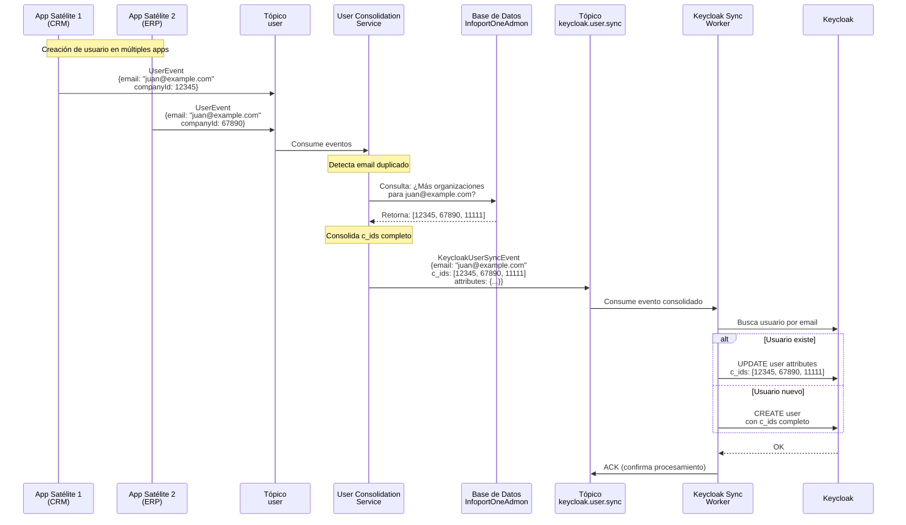
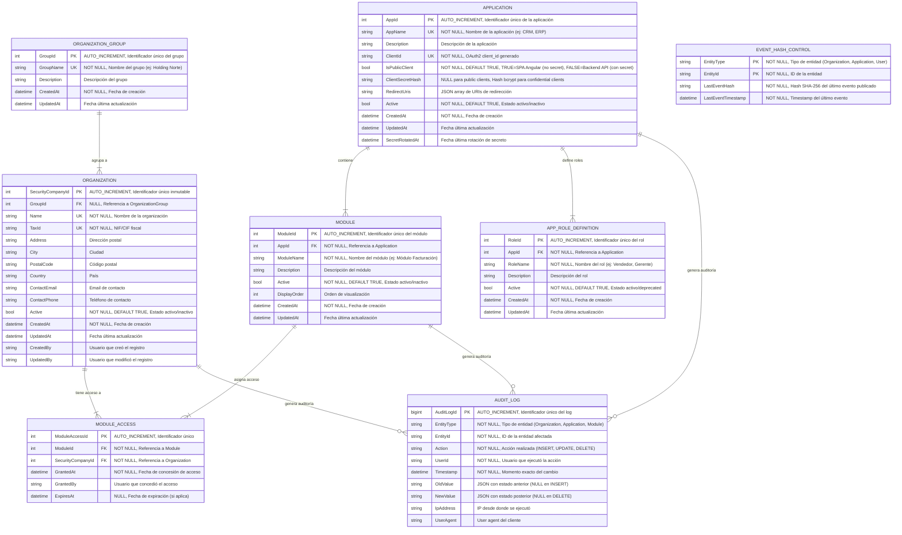

## Índice

0. [Ficha del proyecto](#0-ficha-del-proyecto)
1. [Descripción general del producto](#1-descripción-general-del-producto)
2. [Arquitectura del sistema](#2-arquitectura-del-sistema)
3. [Modelo de datos](#3-modelo-de-datos)
4. [Especificación de la API](#4-especificación-de-la-api)
5. [Historias de usuario](#5-historias-de-usuario)
6. [Tickets de trabajo](#6-tickets-de-trabajo)
7. [Pull requests](#7-pull-requests)

---

## 0. Ficha del proyecto

### **0.1. Tu nombre completo: Miguel Albert Villanova**

### **0.2. Nombre del proyecto: InfoportOneAdmon**

### **0.3. Descripción breve del proyecto:**

**InfoportOneAdmon** es la plataforma administrativa centralizada diseñada para la gestión integral del **portfolio de aplicaciones empresariales** de la Organización Propietaria. Actúa como el núcleo de gobierno y control de acceso del ecosistema, permitiendo a la Organización Propietaria determinar de forma centralizada qué organizaciones clientes tienen acceso a cada aplicación del portfolio, qué módulos funcionales pueden utilizar dentro de cada una, y qué roles de seguridad están disponibles para sus usuarios en el sistema.

A diferencia de modelos SaaS de auto-servicio, en este ecosistema **las organizaciones no se registran por sí mismas**. Es la Organización Propietaria quien, a través de InfoportOneAdmon, ejecuta el proceso completo de onboarding: da de alta las organizaciones clientes, las agrupa lógicamente, configura sus permisos de acceso a aplicaciones y módulos, y provisiona su identidad digital mediante integración con **Keycloak** para la gestión unificada de usuarios y autenticación.

**InfoportOneAdmon actúa como la Fuente de la Verdad para:**
- **Gestión del Portfolio de Aplicaciones**: Registro y configuración de las aplicaciones satélite del ecosistema, incluyendo credenciales OAuth2 y definición de módulos funcionales
- **Control de Acceso por Organización**: Determinación granular de qué organizaciones clientes tienen acceso a qué aplicaciones y a qué módulos específicos dentro de cada aplicación
- **Gestión de Inquilinos (Tenants)**: Control del ciclo de vida completo de las organizaciones clientes, desde el alta hasta la desactivación
- **Gestión de Grupos de Organizaciones**: Creación y mantenimiento de agrupaciones lógicas (holdings, consorcios) para facilitar la gestión colectiva
- **Catálogo Maestro de Roles**: Definición centralizada y consistente de los roles de seguridad disponibles en cada aplicación del portfolio
- **Gobierno de Identidad y Usuarios**: Orquestación con Keycloak para la gestión de usuarios multi-organización, autenticación SSO y tokens JWT con claims personalizados que habilitan el acceso segmentado por organización

El sistema utiliza una arquitectura orientada a eventos basada en **ActiveMQ Artemis** con patrón "State Transfer Event", garantizando desacoplamiento total entre InfoportOneAdmon y las aplicaciones satélite, permitiendo que cada aplicación mantenga su propia autonomía operacional mientras sincroniza automáticamente los datos maestros de organizaciones, roles y permisos.

### **0.4. URL del proyecto:**

> Puede ser pública o privada, en cuyo caso deberás compartir los accesos de manera segura. Puedes enviarlos a [alvaro@lidr.co](mailto:alvaro@lidr.co) usando algún servicio como [onetimesecret](https://onetimesecret.com/).

### 0.5. URL o archivo comprimido del repositorio

> Puedes tenerlo alojado en público o en privado, en cuyo caso deberás compartir los accesos de manera segura. Puedes enviarlos a [alvaro@lidr.co](mailto:alvaro@lidr.co) usando algún servicio como [onetimesecret](https://onetimesecret.com/). También puedes compartir por correo un archivo zip con el contenido


---

## 1. Descripción general del producto

### **1.1. Objetivo:**

#### **Propósito del Producto**

InfoportOneAdmon centraliza la complejidad administrativa del ecosistema de aplicaciones empresariales para que las aplicaciones de negocio (Sintraport, Translate, etc.) puedan centrarse exclusivamente en su lógica funcional y en la gestión de sus propios usuarios finales.

**Misión**: Centralizar la gestión del portfolio de aplicaciones, el onboarding de organizaciones clientes, la configuración de accesos granulares por aplicación y módulo, y el gobierno de identidad, liberando a las aplicaciones satélite de la complejidad de gestión multi-tenant y seguridad transversal.

#### **Valor que Aporta**

1. **Control Total del Ecosistema**: Permite a la Organización Propietaria mantener un control absoluto sobre quién accede al ecosistema, a qué aplicaciones, y con qué permisos, sin depender de auto-registros incontrolados.

2. **Simplificación de Aplicaciones Satélite**: Las aplicaciones del portfolio no necesitan implementar lógica compleja de multi-organización ni gestión de tenants. Solo deben validar tokens JWT y consumir eventos de sincronización.

3. **Seguridad Centralizada y Consistente**: Al orquestar Keycloak desde un único punto, se garantiza coherencia en la autenticación, autorización y claims personalizados en todo el ecosistema.

4. **Flexibilidad Comercial**: Permite modelos de negocio sofisticados donde no todas las organizaciones contratan todas las funcionalidades. El sistema de módulos habilita ventas granulares por funcionalidad.

5. **Escalabilidad mediante Desacoplamiento**: La arquitectura orientada a eventos (ActiveMQ Artemis) permite que el ecosistema crezca sin crear dependencias síncronas entre sistemas.

6. **Auditoría y Compliance**: Proporciona trazabilidad completa de todos los cambios administrativos (altas, bajas, modificaciones de acceso), esencial para cumplimiento normativo.

#### **Qué Soluciona**

- **Problema de Onboarding Manual**: Elimina procesos manuales y descentralizados de alta de clientes. Todo el provisioning se ejecuta desde una única interfaz.

- **Inconsistencia de Roles**: Sin un catálogo maestro, cada aplicación podría definir roles con nombres diferentes para conceptos similares. InfoportOneAdmon garantiza coherencia.

- **Complejidad de Multi-Organización**: Resuelve el desafío técnico de usuarios que trabajan para múltiples organizaciones mediante claims, algo que la feature nativa de Organizations de Keycloak no soporta.

- **Falta de Gobierno de Acceso**: Sin InfoportOneAdmon, cada aplicación tendría que gestionar individualmente qué organizaciones tienen acceso, creando inconsistencias y agujeros de seguridad.

- **Acoplamiento Técnico**: Evita que las aplicaciones satélite dependan síncronamente de un sistema central de configuración. Los eventos permiten que cada app opere autónomamente con su copia local de datos maestros.

#### **Para Quién**

**Usuario Principal**: **Administradores de la Organización Propietaria**
- Responsables del onboarding de nuevos clientes (organizaciones)
- Gestores de seguridad que configuran accesos a aplicaciones y módulos
- Administradores de identidad que orquestan usuarios y roles

**Beneficiarios Indirectos**:
- **Equipos de Desarrollo de Aplicaciones Satélite**: Consumen datos maestros de organizaciones y roles sin implementar lógica administrativa compleja
- **Usuarios Finales de las Organizaciones Clientes**: Experimentan SSO fluido y acceso coherente a todas las aplicaciones del ecosistema
- **Dirección Ejecutiva**: Obtiene visibilidad y control total sobre el portfolio de aplicaciones y la base de clientes

**Tipo de Ecosistema**: Diseñado para organizaciones que gestionan un **portfolio de aplicaciones B2B propias** donde los clientes son otras empresas (no consumidores finales) y donde la Organización Propietaria necesita control total sobre el acceso y la seguridad.

### **1.2. Características y funcionalidades principales:**

InfoportOneAdmon ofrece seis módulos funcionales principales que cubren todo el ciclo de vida administrativo del ecosistema de aplicaciones:

#### **1.2.1. Gestión de Organizaciones (Clientes)**

Módulo que permite gestionar el ciclo de vida completo de las empresas clientes del ecosistema.

**Capacidades principales:**
- ✅ **Onboarding de Clientes**: Alta de nueva organización en un único paso, generando automáticamente su `SecurityCompanyId` (identificador único inmutable)
- 🛠️ **Gestión de Configuración**: Modificación de datos corporativos (nombre, dirección, datos fiscales)
- 🔌 **Kill-Switch (Desactivación)**: Bloqueo inmediato de acceso de una organización a todo el ecosistema mediante flag de activación/desactivación
- 🧾 **Auditoría de Tenant**: Trazabilidad completa de todos los cambios realizados sobre cada organización
- 📢 **Publicación de Eventos**: Cada cambio genera un `OrganizationEvent` que se publica en ActiveMQ Artemis para sincronización con aplicaciones satélite

**Objetivo**: Centralizar el alta administrativa y técnica de clientes en un solo paso, garantizando coherencia en todo el ecosistema.

#### **1.2.2. Gestión de Grupos de Organizaciones**

Permite agrupar organizaciones lógicamente para facilitar la administración colectiva (ej: holdings, consorcios, franquicias).

**Capacidades principales:**
- 🆕 **Creación de Grupos**: Definir nuevos grupos de organizaciones (ej: "Grupo Logístico Peninsular", "Holding Financiero Norte")
- 🔄 **Asociación de Miembros**: Asignar o modificar el `GroupId` de una organización para incluirla en un grupo
- 🗑️ **Gestión del Ciclo de Vida**: Modificar grupos. Las aplicaciones satélite eliminan automáticamente grupos sin organizaciones
- 📢 **Propagación de Cambios**: Los cambios en grupos se publican mediante `OrganizationEvent` (incluyen campos `GroupId` y `GroupName`)

**Nota importante**: Los grupos NO tienen eventos propios; se propagan como parte del evento de organización.

#### **1.2.3. Gestión del Portfolio de Aplicaciones**

Permite registrar y configurar las aplicaciones satélite que forman parte del ecosistema.

**Capacidades principales:**
- 🆕 **Registro de Aplicación Frontend (Angular SPA)**: Alta como public client con `client_id` únicamente, habilitando PKCE para autenticación segura sin secretos
- 🔐 **Registro de Aplicación Backend (API)**: Alta como confidential client con generación de `client_id` y `client_secret`, con gestión segura de credenciales
- 🔄 **Gestión de Secretos**: Rotación y administración segura de credenciales solo para confidential clients (backends)
- 🚦 **Control de Acceso**: Definir si una aplicación está activa, en mantenimiento o desactivada
- 🧩 **Definición de Módulos**: Cada aplicación debe tener al menos un módulo. Los módulos representan agrupaciones funcionales vendibles por separado
- 📘 **Catálogo de Roles**: Definir qué roles existen dentro de cada aplicación (ej: "Tráfico", "Mensajería", "Administrador")
- ✨ **Sincronización de Datos**: Funcionalidad para enviar catálogos completos publicando eventos cuyo `Payload` contiene listas de objetos

**Nota sobre seguridad**: Las aplicaciones Angular (public clients) utilizan Authorization Code Flow with PKCE (S256) y no requieren almacenar secretos. Solo las APIs backend (confidential clients) requieren `client_secret`.

**Objetivo**: Mantener el inventario completo del portfolio de aplicaciones y sus capacidades (módulos y roles).

#### **1.2.4. Gestión de Módulos por Aplicación**

Define agrupaciones funcionales (módulos) dentro de cada aplicación y configura qué organizaciones tienen acceso a cada módulo.

**Capacidades principales:**
- 🧩 **Definición de Módulos**: Crear módulos para una aplicación (ej: "Módulo CRM", "Módulo Facturación", "Módulo Reporting Avanzado")
- ⚙️ **Configuración de Acceso**: Asignar qué organizaciones tienen acceso a qué módulos (relación N:M)
- 📢 **Propagación de Cambios**: Los cambios se publican en eventos `ApplicationEvent` que incluyen módulos y sus asignaciones
- 📊 **Visibilidad de Contratación**: Permite a las aplicaciones saber exactamente qué funcionalidades están habilitadas para cada organización

**Regla de negocio**: Toda aplicación debe tener como mínimo un módulo. Los módulos son obligatorios.

**Objetivo**: Habilitar un modelo de negocio flexible donde no todas las organizaciones contratan todas las funcionalidades de una aplicación.

#### **1.2.5. Gestión de Definiciones de Roles (Catálogo)**

Define qué roles existen dentro de cada aplicación del ecosistema. Los roles se sincronizan como parte del `ApplicationEvent`.

**Capacidades principales:**
- 📘 **Definición de Roles**: Definir roles para una aplicación con nombre y descripción
- 🧪 **Deprecación**: Marcar roles como obsoletos mediante el flag `Active`
- 🔄 **Sincronización**: Los roles se publican automáticamente con el `ApplicationEvent` (junto con módulos)
- 📋 **Catálogo Único**: Asegura que todos los sistemas usen nombres consistentes para los mismos conceptos de rol

**Principio clave**: InfoportOneAdmon define los roles (catálogo), las aplicaciones satélite los asignan a usuarios.

**Objetivo**: Garantizar coherencia en los nombres de roles y flexibilidad en su asignación por las aplicaciones.

#### **1.2.6. Integración Transparente con Keycloak**

Abstrae la complejidad de Keycloak. Los administradores no necesitan acceder directamente a su consola.

**Capacidades principales:**
- 🔄 **Sincronización de Usuarios**: Consumo de eventos `UserEvent` publicados por aplicaciones satélite para crear/actualizar usuarios en Keycloak
- 🧩 **Claims Personalizados**: Configuración automática del claim `c_ids` (company ids) con la lista de `SecurityCompanyId` de todas las organizaciones del usuario
- 🔑 **Mapeo de Protocol Mappers**: Configuración automática para incluir claims personalizados en tokens JWT
- 👥 **Gestión Multi-Organización**: Detección automática de usuarios existentes por email y fusión de organizaciones en el claim `c_ids`
- 🏢 **Single Realm**: Utiliza un único realm (InfoportOne) para todo el ecosistema, habilitando SSO real
- 🔐 **PKCE para SPAs**: Configuración automática de clientes públicos con PKCE (Proof Key for Code Exchange) para aplicaciones Angular, eliminando la necesidad de secretos en el cliente

**Nota importante**: No se utiliza la feature nativa de Organizations de Keycloak porque no soporta usuarios en múltiples organizaciones.

**Objetivo**: Proporcionar gobierno de identidad centralizado sin que los administradores necesiten conocer Keycloak.

#### **1.2.7. Arquitectura Orientada a Eventos (ActiveMQ Artemis)**

Mecanismo de comunicación asíncrona basado en el patrón **"State Transfer Event"** con especialización para usuarios multi-organización.

**Capacidades principales:**
- 📣 **Publicación de Eventos de Estado**: En lugar de notificar acciones (ej. "se creó X"), se notifica el estado final de la entidad
- 🔄 **Sincronización Robusta**: Los consumidores aplican lógica "upsert" (si existe actualiza, si no crea) o eliminan si `IsDeleted=true`
- 📋 **Tópicos por Entidad**: 
  - `infoportone.events.organization`: Organizaciones y grupos
  - `infoportone.events.application`: Aplicaciones, módulos y roles
  - `infoportone.events.user`: Usuarios publicados por apps satélite (eventos individuales)
  - `infoportone.events.keycloak.user.sync`: Usuarios consolidados para Keycloak (con `c_ids` completo)
- 📦 **Payload como Lista**: Cada evento transporta un array de objetos, permitiendo sincronizaciones masivas
- 🔒 **Prevención de Duplicados**: Sistema de hash SHA-256 que evita publicar eventos idénticos consecutivos, reduciendo tráfico innecesario
- 🆔 **Trazabilidad**: Cada evento incluye `EventId` (UUID), `TraceId` (correlación), `OriginApplicationId` (emisor)
- 🧩 **Patrón Aggregator para Usuarios**: Consolidación automática de usuarios multi-organización antes de sincronizar con Keycloak

**Flujo de Sincronización de Usuarios Multi-Organización:**



**Ventajas de la arquitectura de dos fases:**
1. **Apps satélite simplificadas**: Solo publican eventos con su `companyId` local
2. **Consistencia garantizada**: InfoportOneAdmon es fuente de verdad para relaciones usuario-organización
3. **Keycloak siempre sincronizado**: El claim `c_ids` refleja todas las organizaciones reales del usuario
4. **Tolerancia a fallos**: Si Keycloak está caído, los eventos consolidados se procesan cuando se recupere
5. **Escalabilidad**: El Keycloak Sync Worker puede escalar independientemente

**Objetivo**: Garantizar desacoplamiento total entre InfoportOneAdmon y las aplicaciones satélite, permitiendo autonomía operacional mientras se mantiene consistencia en la identidad multi-organización.

### **1.3. Diseño y experiencia de usuario:**

> Proporciona imágenes y/o videotutorial mostrando la experiencia del usuario desde que aterriza en la aplicación, pasando por todas las funcionalidades principales.0

### **1.3.1. Modelo de Datos de Eventos (Event Schema)**

InfoportOneAdmon utiliza un modelo estandarizado para todos los eventos publicados en ActiveMQ Artemis, garantizando consistencia y facilidad de integración para las aplicaciones satélite.

#### **Estructura Base de Evento (Envelope)**

Todos los eventos comparten una estructura común (envelope) que contiene metadatos de trazabilidad y el payload específico:

```json
{
  "EventId": "f47ac10b-58cc-4372-a567-0e02b2c3d479",
  "EventType": "USER_SYNC",
  "EventTimestamp": "2026-01-15T14:35:22.123Z",
  "TraceId": "trace-abc-123-xyz",
  "OriginApplicationId": "infoportone-admon",
  "SchemaVersion": "1.0",
  "Payload": [
    { /* objetos específicos del evento */ }
  ]
}
```

**Campos del Envelope:**
- `EventId` (UUID): Identificador único del evento, permite deduplicación
- `EventType` (string): Tipo de evento (`ORGANIZATION`, `APPLICATION`, `USER`, `USER_SYNC`)
- `EventTimestamp` (ISO 8601): Marca temporal de publicación en UTC
- `TraceId` (string): Identificador de correlación para debugging distribuido
- `OriginApplicationId` (string): Aplicación que publicó el evento
- `SchemaVersion` (string): Versión del esquema del payload (versionado evolutivo)
- `Payload` (array): Lista de objetos del tipo correspondiente

#### **Evento de Usuario (Apps Satélite → InfoportOneAdmon)**

**Tópico**: `infoportone.events.user`

**Publicado por**: Aplicaciones satélite cuando crean/modifican/eliminan usuarios

**Estructura del Payload**:
```json
{
  "EventId": "uuid-123",
  "EventType": "USER",
  "EventTimestamp": "2026-01-15T14:35:22Z",
  "TraceId": "trace-crm-001",
  "OriginApplicationId": "crm-app-backend",
  "SchemaVersion": "1.0",
  "Payload": [
    {
      "Email": "juan.perez@example.com",
      "FirstName": "Juan",
      "LastName": "Pérez",
      "SecurityCompanyId": 12345,
      "IsActive": true,
      "IsDeleted": false,
      "Roles": ["Sales", "Manager"],
      "Attributes": {
        "Department": "Ventas",
        "Phone": "+34 600 123 456",
        "EmployeeId": "EMP-001"
      },
      "CreatedBy": "admin@crm.com",
      "CreatedDate": "2026-01-15T14:30:00Z"
    }
  ]
}
```

**Campos del objeto USER:**
- `Email` (string, required): Email del usuario (único, clave de búsqueda)
- `FirstName` (string, required): Nombre
- `LastName` (string, required): Apellidos
- `SecurityCompanyId` (int, required): ID de la organización a la que pertenece en esta app
- `IsActive` (bool): Si el usuario está activo en esta organización
- `IsDeleted` (bool): Flag de soft delete (true = eliminar de Keycloak)
- `Roles` (string[]): Roles asignados en la aplicación origen
- `Attributes` (object): Atributos personalizados adicionales
- `CreatedBy` (string): Usuario que creó el registro
- `CreatedDate` (ISO 8601): Fecha de creación

**Nota importante**: En esta fase, el evento contiene **solo una organización** (`SecurityCompanyId`). La consolidación multi-organización la realiza InfoportOneAdmon.

#### **Evento de Sincronización con Keycloak (InfoportOneAdmon → Keycloak Sync Worker)**

**Tópico**: `infoportone.events.keycloak.user.sync`

**Publicado por**: User Consolidation Service (componente de InfoportOneAdmon)

**Consumido por**: Keycloak Sync Worker

**Estructura del Payload**:
```json
{
  "EventId": "uuid-456",
  "EventType": "USER_SYNC",
  "EventTimestamp": "2026-01-15T14:35:25Z",
  "TraceId": "trace-crm-001",
  "OriginApplicationId": "infoportone-user-consolidator",
  "SchemaVersion": "1.0",
  "Payload": [
    {
      "Email": "juan.perez@example.com",
      "FirstName": "Juan",
      "LastName": "Pérez",
      "CompanyIds": [12345, 67890, 11111],
      "IsActive": true,
      "IsDeleted": false,
      "Attributes": {
        "Department": "Ventas",
        "Phone": "+34 600 123 456",
        "EmployeeId": "EMP-001",
        "PrimaryCompanyId": 12345
      },
      "ConsolidatedRoles": {
        "12345": ["Sales", "Manager"],
        "67890": ["Viewer"],
        "11111": ["Admin"]
      },
      "LastConsolidationDate": "2026-01-15T14:35:24Z",
      "SourceEvents": ["uuid-123", "uuid-124"]
    }
  ]
}
```

**Campos del objeto USER_SYNC:**
- `Email` (string, required): Email del usuario (clave única)
- `FirstName` (string, required): Nombre
- `LastName` (string, required): Apellidos
- `CompanyIds` (int[], required): **Lista completa de organizaciones** (claim `c_ids`)
- `IsActive` (bool): Si el usuario está activo globalmente
- `IsDeleted` (bool): Si el usuario debe ser eliminado de Keycloak
- `Attributes` (object): Atributos consolidados
  - `PrimaryCompanyId`: Organización principal del usuario
- `ConsolidatedRoles` (object): Mapa de roles por organización
- `LastConsolidationDate` (ISO 8601): Timestamp de la consolidación
- `SourceEvents` (string[]): Lista de `EventId` de eventos originales (trazabilidad)

**Diferencia clave**: Este evento contiene **todas las organizaciones** del usuario, consolidadas desde múltiples eventos individuales y validadas contra la base de datos de InfoportOneAdmon.

#### **Evento de Organización**

**Tópico**: `infoportone.events.organization`

**Publicado por**: InfoportOneAdmon (módulo de Organizaciones)

**Consumido por**: Todas las aplicaciones satélite

**Estructura del Payload**:
```json
{
  "EventId": "uuid-789",
  "EventType": "ORGANIZATION",
  "EventTimestamp": "2026-01-15T15:00:00Z",
  "TraceId": "trace-admin-001",
  "OriginApplicationId": "infoportone-admon",
  "SchemaVersion": "1.0",
  "Payload": [
    {
      "SecurityCompanyId": 12345,
      "Name": "ACME Corporation",
      "TaxId": "A12345678",
      "Address": "Calle Mayor 123",
      "City": "Madrid",
      "Country": "España",
      "IsActive": true,
      "IsDeleted": false,
      "GroupId": 100,
      "GroupName": "Holding Empresarial",
      "CreatedDate": "2025-06-01T10:00:00Z",
      "ModifiedDate": "2026-01-15T15:00:00Z"
    }
  ]
}
```

#### **Evento de Aplicación (incluye Módulos y Roles)**

**Tópico**: `infoportone.events.application`

**Estructura del Payload**:
```json
{
  "EventId": "uuid-999",
  "EventType": "APPLICATION",
  "EventTimestamp": "2026-01-15T16:00:00Z",
  "TraceId": "trace-admin-002",
  "OriginApplicationId": "infoportone-admon",
  "SchemaVersion": "1.0",
  "Payload": [
    {
      "ApplicationId": 5,
      "Name": "CRM Application",
      "ClientId": "crm-app-backend",
      "IsActive": true,
      "Modules": [
        {
          "ModuleId": 10,
          "Name": "Sales Module",
          "Description": "Gestión de ventas",
          "IsActive": true,
          "AccessibleByCompanies": [12345, 67890]
        },
        {
          "ModuleId": 11,
          "Name": "Reporting Module",
          "Description": "Reportes avanzados",
          "IsActive": true,
          "AccessibleByCompanies": [12345]
        }
      ],
      "Roles": [
        {
          "RoleId": 20,
          "Name": "Sales",
          "Description": "Vendedor",
          "IsActive": true
        },
        {
          "RoleId": 21,
          "Name": "Manager",
          "Description": "Gerente",
          "IsActive": true
        }
      ]
    }
  ]
}
```

#### **Patrones de Procesamiento de Eventos**

**Para consumidores (Apps Satélite y Workers):**

```csharp
// Pseudocódigo de consumo idempotente
public async Task ProcessEvent(EventEnvelope envelope)
{
    foreach (var item in envelope.Payload)
    {
        if (item.IsDeleted)
        {
            await DeleteLocalEntity(item);
        }
        else
        {
            // Upsert: Update si existe, Insert si no
            await UpsertLocalEntity(item);
        }
    }
}
```

**Validación de esquema:**
```csharp
public bool ValidateEventSchema(EventEnvelope envelope)
{
    // Validar que SchemaVersion es compatible
    if (!IsSupportedVersion(envelope.SchemaVersion))
        return false;
    
    // Validar campos requeridos según tipo de evento
    if (envelope.EventType == "USER_SYNC")
    {
        foreach (var user in envelope.Payload)
        {
            if (string.IsNullOrEmpty(user.Email)) return false;
            if (user.CompanyIds == null || user.CompanyIds.Length == 0) return false;
        }
    }
    
    return true;
}
```

#### **Versionado de Esquemas**

El sistema soporta evolución de esquemas mediante el campo `SchemaVersion`:

- **v1.0**: Versión inicial
- **v1.1**: Podría agregar campos opcionales sin romper compatibilidad
- **v2.0**: Cambios que rompen compatibilidad (requieren actualización de consumidores)

**Estrategia de migración:**
1. Publicar eventos con ambas versiones durante período de transición
2. Consumidores implementan lógica para soportar múltiples versiones
3. Deprecación gradual de versiones antiguas con notificaciones

### **1.4. Instrucciones de instalación:**

InfoportOneAdmon está construido sobre el framework Helix6 para .NET 8. A continuación se detallan los pasos para instalar y poner en marcha el proyecto en un entorno de desarrollo local.

#### **1.4.1. Requisitos Previos**

**Software necesario**:
- **.NET 8 SDK** (8.0 o superior)
- **Visual Studio 2022** (17.8+) o **Visual Studio Code** con extensión C#
- **SQL Server 2022** o **PostgreSQL 15+**
- **Node.js 20+** y **npm** (para el frontend Angular)
- **Docker Desktop** (opcional, para ejecutar ActiveMQ Artemis y Keycloak localmente)
- **Git** para control de versiones

**Puertos requeridos** (configurables):
- `5000`: API Backend (HTTP)
- `5001`: API Backend (HTTPS)
- `4200`: Angular Frontend (desarrollo)
- `61616`: ActiveMQ Artemis (AMQP)
- `8080`: Keycloak

#### **1.4.2. Instalación del Backend (InfoportOneAdmon.Api)**

**Paso 1: Clonar el repositorio**
```powershell
git clone https://github.com/organizacion/InfoportOneAdmon.git
cd InfoportOneAdmon
```

**Paso 2: Restaurar dependencias NuGet**
```powershell
cd InfoportOneAdmon.Api
dotnet restore
```

**Dependencias principales de Helix6**:
- `Helix6.Base` (9.0.2) - Framework base
- `Helix6.Base.Domain` (9.0.2) - Dominio y contratos
- `Helix6.Base.Utils` (9.0.2) - Utilidades
- `Microsoft.EntityFrameworkCore` (9.0.2)
- `Mapster` (7.4.0)
- `Serilog.AspNetCore` (9.0.2)

**Paso 3: Configurar la cadena de conexión**

Editar `appsettings.Development.json`:
```json
{
  "ConnectionStrings": {
    "DefaultConnection": "Server=localhost;Database=InfoportOneAdmon;User Id=sa;Password=***;TrustServerCertificate=True;",
    "ConnectionStringType": "SqlServer"
  },
  "ApplicationContext": {
    "ApplicationName": "InfoportOneAdmon",
    "DBMSType": "SqlServer",
    "RolPrefixes": ["InfoportOne_"]
  },
  "Keycloak": {
    "AdminApiUrl": "http://localhost:8080/admin/realms/InfoportOne",
    "Realm": "InfoportOne",
    "ClientId": "infoportone-admin",
    "ClientSecret": "***"
  },
  "ActiveMQ": {
    "BrokerUri": "tcp://localhost:61616",
    "Username": "artemis",
    "Password": "artemis",
    "Topics": {
      "Organization": "infoportone.events.organization",
      "Application": "infoportone.events.application",
      "User": "infoportone.events.user",
      "KeycloakUserSync": "infoportone.events.keycloak.user.sync"
    }
  }
}
```

> **Gestión de secretos en desarrollo**: Para desarrollo local, utilizar `dotnet user-secrets` en lugar de almacenar secretos en archivos:
> ```powershell
> dotnet user-secrets init
> dotnet user-secrets set "Keycloak:ClientSecret" "tu-secret-aqui"
> dotnet user-secrets set "ActiveMQ:Password" "tu-password-aqui"
> ```

**Paso 4: Crear y migrar la base de datos**

El proyecto utiliza **Entity Framework Core Code First**. Para crear la base de datos y aplicar las migraciones:

```powershell
# Instalar herramientas de EF Core (si no están instaladas)
dotnet tool install --global dotnet-ef

# Crear la migración inicial (si no existe)
dotnet ef migrations add InitialCreate --project InfoportOneAdmon.Data --startup-project InfoportOneAdmon.Api

# Aplicar migraciones a la base de datos
dotnet ef database update --project InfoportOneAdmon.Data --startup-project InfoportOneAdmon.Api
```

**Estructura de tablas creadas** (principales):
- `Organizations`: Entidades de organizaciones clientes
- `OrganizationGroups`: Agrupaciones de organizaciones
- `Applications`: Aplicaciones satélite registradas
- `Modules`: Módulos funcionales por aplicación
- `ModuleAccess`: Relación N:M entre módulos y organizaciones
- `AppRoleDefinitions`: Catálogo de roles
- `AuditLog`: Auditoría de cambios
- `EventHashControl`: Control de eventos duplicados

> **Nota Helix6**: Todas las entidades heredan de `IEntityBase` e incluyen automáticamente campos de auditoría (`AuditCreationUser`, `AuditModificationUser`, `AuditCreationDate`, `AuditModificationDate`, `AuditDeletionDate`). Ver detalles en [Helix6_Backend_Architecture.md - Sección 2.5](Helix6_Backend_Architecture.md#25-proyectodatamodel-capa-de-modelo-de-datos).

**Paso 5: Poblar datos semilla (seed data)**

El proyecto puede incluir un seeder inicial. Ejecutar:

```powershell
dotnet run --project InfoportOneAdmon.Api --seed
```

O ejecutar scripts SQL manualmente:
```sql
-- Insertar organización propietaria
INSERT INTO Organizations (Name, TaxId, Active, SecurityCompanyId)
VALUES ('Organización Propietaria', 'A12345678', 1, 1);

-- Insertar aplicación de ejemplo
INSERT INTO Applications (Name, ClientId, ClientType, Active)
VALUES ('CRM App', 'crm-app-frontend', 'Public', 1);
```

**Paso 6: Ejecutar el backend**

```powershell
dotnet run --project InfoportOneAdmon.Api
```

La API estará disponible en:
- HTTP: `http://localhost:5000`
- HTTPS: `https://localhost:5001`
- Swagger UI: `https://localhost:5001/swagger`

> **Configuración de Serilog**: Los logs se escriben en `logs/log-{Date}.txt` y en consola. Configuración detallada en `appsettings.json` sección `Serilog`. Ver [Helix6_Backend_Architecture.md - Sección 7](Helix6_Backend_Architecture.md#7-bootstrapping-y-programcs) para detalles del bootstrapping.

#### **1.4.3. Instalación del Frontend (Angular)**

**Paso 1: Instalar dependencias**
```powershell
cd InfoportOneAdmon.Frontend
npm install
```

**Dependencias principales**:
- `@angular/core`: 20.x
- `@angular/router`: 20.x
- `@angular/common/http`: 20.x
- `oidc-client-ts`: Autenticación OAuth2/OIDC

**Paso 2: Configurar el entorno**

Editar `src/environments/environment.development.ts`:
```typescript
export const environment = {
  production: false,
  apiUrl: 'https://localhost:5001/api',
  keycloak: {
    issuer: 'http://localhost:8080/realms/InfoportOne',
    clientId: 'infoportone-admin-frontend',
    redirectUri: 'http://localhost:4200/callback',
    scope: 'openid profile email',
    responseType: 'code',
    pkce: true
  }
};
```

**Paso 3: Ejecutar el frontend**
```powershell
npm start
```

El frontend estará disponible en: `http://localhost:4200`

#### **1.4.4. Instalación de ActiveMQ Artemis (Message Broker)**

**Opción 1: Docker (Recomendado para desarrollo)**

```powershell
docker run -d --name artemis `
  -p 61616:61616 `
  -p 8161:8161 `
  -e ARTEMIS_USERNAME=artemis `
  -e ARTEMIS_PASSWORD=artemis `
  apache/activemq-artemis:latest
```

Consola web: `http://localhost:8161` (usuario: `artemis`, password: `artemis`)

**Opción 2: Instalación local**

1. Descargar desde https://activemq.apache.org/components/artemis/
2. Extraer y ejecutar:
```powershell
cd apache-artemis-2.31.0\bin
.\artemis create mybroker
cd ..\mybroker\bin
.\artemis run
```

**Configuración de tópicos**:
Los tópicos se crean automáticamente cuando InfoportOneAdmon publica el primer evento. No requiere configuración previa.

#### **1.4.5. Instalación de Keycloak (Identity Provider)**

**Opción 1: Docker (Recomendado para desarrollo)**

```powershell
docker run -d --name keycloak `
  -p 8080:8080 `
  -e KEYCLOAK_ADMIN=admin `
  -e KEYCLOAK_ADMIN_PASSWORD=admin `
  quay.io/keycloak/keycloak:23.0 `
  start-dev
```

Consola de administración: `http://localhost:8080` (usuario: `admin`, password: `admin`)

**Opción 2: Instalación local**

1. Descargar desde https://www.keycloak.org/downloads
2. Ejecutar:
```powershell
cd keycloak-23.0.0\bin
.\kc.bat start-dev
```

**Configuración inicial de Keycloak**:

1. **Crear el realm `InfoportOne`**:
   - Login en consola de administración
   - Crear nuevo realm: `InfoportOne`

2. **Registrar el cliente de InfoportOneAdmon**:
   ```json
   {
     "clientId": "infoportone-admin-frontend",
     "enabled": true,
     "publicClient": true,
     "redirectUris": ["http://localhost:4200/*"],
     "webOrigins": ["http://localhost:4200"],
     "standardFlowEnabled": true,
     "pkceCodeChallengeMethod": "S256"
   }
   ```

3. **Configurar Protocol Mapper para `c_ids`**:
   - Crear mapper de tipo "User Attribute"
   - Nombre: `company-ids-mapper`
   - User Attribute: `c_ids`
   - Token Claim Name: `c_ids`
   - Claim JSON Type: Array
   - Add to ID token: ON
   - Add to access token: ON

> **Implementación de claims en Helix6**: El framework proporciona `KeyCloakUserClaimsMapping` que maneja automáticamente la lectura del claim `c_ids` y otros claims de Keycloak. Ver [Helix6_Backend_Architecture.md - Sección 10.5](Helix6_Backend_Architecture.md#105-mapeo-de-claims-según-identity-server).

#### **1.4.6. Verificación de la Instalación**

**Test 1: API Backend**
```powershell
curl https://localhost:5001/api/health
# Respuesta esperada: {"status": "Healthy"}
```

**Test 2: Swagger**
- Abrir navegador: `https://localhost:5001/swagger`
- Verificar que aparecen todos los endpoints generados

**Test 3: Keycloak**
- Login en `http://localhost:8080`
- Verificar realm `InfoportOne`

**Test 4: ActiveMQ Artemis**
- Abrir `http://localhost:8161`
- Verificar broker activo

**Test 5: Frontend Angular**
- Abrir `http://localhost:4200`
- Verificar redirección a Keycloak para login

**Test 6: Flujo completo (End-to-End)**
1. Login en el frontend Angular
2. Crear una organización nueva
3. Verificar en la base de datos que se creó el registro
4. Verificar en Artemis que se publicó el evento `OrganizationEvent`
5. Verificar en la tabla `EventHashControl` el hash del evento

#### **1.4.7. Troubleshooting Común**

**Problema**: Error de conexión a SQL Server
```
Microsoft.Data.SqlClient.SqlException: A network-related or instance-specific error...
```
**Solución**: Verificar que SQL Server está ejecutándose y que el puerto 1433 está abierto. En desarrollo, usar `TrustServerCertificate=True`.

**Problema**: Error de autenticación con Keycloak
```
IDX10501: Signature validation failed. Unable to match key...
```
**Solución**: Limpiar caché de claves públicas y reiniciar la API. Verificar que el `issuer` en `appsettings.json` coincide exactamente con el de Keycloak.

**Problema**: Eventos no se publican en Artemis
```
System.NullReferenceException at EventPublisher.Publish()
```
**Solución**: Verificar que ActiveMQ Artemis está ejecutándose y que las credenciales en `appsettings.json` son correctas.

**Problema**: Endpoints no aparecen en Swagger
**Solución**: Regenerar código con Helix Generator:
```powershell
cd InfoportOneAdmon.HelixGenerator
dotnet run
```

> **Documentación completa de arquitectura**: Para comprender el flujo de datos, ciclo de vida de peticiones y patrones implementados, consultar [Helix6_Backend_Architecture.md](Helix6_Backend_Architecture.md).

---

## 2. Arquitectura del Sistema

### **2.1. Diagrama de arquitectura:**

#### **Arquitectura Lógica del Sistema**

InfoportOneAdmon sigue una **arquitectura orientada a eventos (Event-Driven Architecture - EDA)** con patrón "State Transfer Event", orquestando la seguridad y los datos maestros del ecosistema de aplicaciones.

```mermaid
graph TB
    subgraph "Cliente - Administrador Propietario"
        Admin[👤 Administrador<br/>Organización Propietaria]
    end
    
    subgraph "InfoportOneAdmon - Back Office"
        UI[🖥️ Interfaz Web Administrativa]
        API[🔌 API REST Backend]
        
        subgraph "Módulos de Negocio"
            MOrgModule[📦 Módulo Organizaciones]
            MAppModule[📦 Módulo Aplicaciones]
            MRoleModule[📦 Módulo Roles]
            MModuleModule[📦 Módulo Módulos]
        end
        
        UserConsolidator[🔄 User Consolidation<br/>Service]
        EventPublisher[📢 Publicador de Eventos]
        
        DB[(💾 Base de Datos Core<br/>Fuente de la Verdad)]
    end
    
    subgraph "Keycloak Sync Worker - Servicio Independiente"
        KCWorker[⚡ Keycloak Sync<br/>Worker Service]
    end
    
    subgraph "Infraestructura de Mensajería"
        Artemis[🚀 ActiveMQ Artemis<br/>Message Broker]
        
        subgraph "Tópicos de Eventos"
            T1[📣 organization]
            T2[📣 application]
            T3[📣 user<br/>sin consolidar]
            T4[📣 keycloak.user.sync<br/>consolidado]
        end
    end
    
    subgraph "Keycloak - Servidor de Identidad"
        KC[🔐 Keycloak<br/>Realm: InfoportOne]
        KCUsers[(👥 Usuarios)]
        KCClients[🔑 Clients OAuth2]
        KCMappers[🏷️ Protocol Mappers<br/>Claims c_ids]
    end
    
    subgraph "Aplicaciones Satélite del Ecosistema"
        App1[📱 App Satélite 1<br/>ej: CRM]
        App2[📱 App Satélite 2<br/>ej: ERP]
        App3[📱 App Satélite N<br/>ej: BI]
        
        Cache1[(⚡ Caché Local<br/>Orgs, Roles, Módulos)]
        Cache2[(⚡ Caché Local<br/>Orgs, Roles, Módulos)]
        Cache3[(⚡ Caché Local<br/>Orgs, Roles, Módulos)]
    end
    
    subgraph "Usuarios Finales"
        EndUser[👤 Usuario Final<br/>Organización Cliente]
    end
    
    %% Flujos del Administrador
    Admin -->|Gestiona Orgs,<br/>Apps, Roles, Módulos| UI
    UI --> API
    API --> MOrgModule
    API --> MAppModule
    API --> MRoleModule
    API --> MModuleModule
    
    %% Persistencia
    MOrgModule --> DB
    MAppModule --> DB
    MRoleModule --> DB
    MModuleModule --> DB
    
    %% Publicación de Eventos
    MOrgModule --> EventPublisher
    MAppModule --> EventPublisher
    EventPublisher -->|Publica Estado| Artemis
    
    Artemis --> T1
    Artemis --> T2
    Artemis --> T3
    Artemis --> T4
    
    %% FLUJO DE CONSOLIDACIÓN DE USUARIOS (NUEVO)
    App1 -.->|Publica UserEvent<br/>companyId: 12345| T3
    App2 -.->|Publica UserEvent<br/>companyId: 67890| T3
    App3 -.->|Publica UserEvent<br/>companyId: 11111| T3
    
    T3 -->|Consume eventos| UserConsolidator
    UserConsolidator -->|Consulta organizaciones| DB
    UserConsolidator -->|Publica evento consolidado<br/>c_ids: [12345,67890,11111]| T4
    
    T4 -->|Consume KeycloakUserSyncEvent| KCWorker
    KCWorker -->|Admin API<br/>CREATE/UPDATE user| KC
    KC --> KCUsers
    KC --> KCMappers
    
    %% Sincronización Apps
    T1 -->|OrganizationEvent| App1
    T1 -->|OrganizationEvent| App2
    T1 -->|OrganizationEvent| App3
    
    T2 -->|ApplicationEvent<br/>Módulos, Roles| App1
    T2 -->|ApplicationEvent<br/>Módulos, Roles| App2
    T2 -->|ApplicationEvent<br/>Módulos, Roles| App3
    
    App1 --> Cache1
    App2 --> Cache2
    App3 --> Cache3
    
    %% Registro de Aplicaciones en Keycloak
    MAppModule -.->|Registrar Client OAuth2| KC
    KC --> KCClients
    
    %% Autenticación Usuario Final
    EndUser -->|1. Login| App1
    App1 -->|2. OAuth2 Flow| KC
    KC -->|3. JWT Token<br/>con c_ids| App1
    App1 -->|4. Valida Token<br/>y c_ids| EndUser
    
    %% Estilos
    style Admin fill:#FFE5B4
    style UI fill:#B4D7FF
    style API fill:#B4D7FF
    style DB fill:#D4B4FF
    style Artemis fill:#FFB4B4
    style KC fill:#B4FFB4
    style App1 fill:#FFD4B4
    style App2 fill:#FFD4B4
    style App3 fill:#FFD4B4
    style EndUser fill:#FFE5B4
    style UserConsolidator fill:#C4E5FF
    style KCWorker fill:#FFE5C4
    style T4 fill:#FFD700
```
    EventPublisher -->|Publica Estado| Artemis
    
    Artemis --> T1
    Artemis --> T2
    Artemis --> T3
    
    %% Consumo de Eventos (User)
    T3 -->|UserEvent| EventConsumer
    EventConsumer -->|Sincronizar Usuario| OrchService
    OrchService -->|Crear/Actualizar<br/>con c_ids| KCUsers
    
    %% Sincronización Apps
    T1 -->|OrganizationEvent| App1
    T1 -->|OrganizationEvent| App2
    T1 -->|OrganizationEvent| App3
    
    T2 -->|ApplicationEvent<br/>Módulos, Roles| App1
    T2 -->|ApplicationEvent<br/>Módulos, Roles| App2
    T2 -->|ApplicationEvent<br/>Módulos, Roles| App3
    
    App1 --> Cache1
    App2 --> Cache2
    App3 --> Cache3
    
    %% Publicación de UserEvent desde Apps
    App1 -.->|Publica UserEvent| T3
    App2 -.->|Publica UserEvent| T3
    App3 -.->|Publica UserEvent| T3
    
    %% Autenticación Usuario Final
    EndUser -->|1. Login| App1
    App1 -->|2. OAuth2 Flow| KC
    KC -->|3. JWT Token<br/>con c_ids| App1
    App1 -->|4. Valida Token<br/>y c_ids| EndUser
    
    %% Estilos
    style Admin fill:#FFE5B4
    style UI fill:#B4D7FF
    style API fill:#B4D7FF
    style DB fill:#D4B4FF
    style Artemis fill:#FFB4B4
    style KC fill:#B4FFB4
    style App1 fill:#FFD4B4
    style App2 fill:#FFD4B4
    style App3 fill:#FFD4B4
    style EndUser fill:#FFE5B4
```

#### **Patrón Arquitectónico**

El sistema implementa una **arquitectura híbrida** que combina:

1. **Event-Driven Architecture (EDA)**: Comunicación asíncrona mediante eventos de estado publicados en ActiveMQ Artemis
2. **Microservicios Ligeros**: Módulos internos independientes (Organizaciones, Aplicaciones, Roles, Módulos)
3. **Orchestration Pattern**: Servicio de orquestación que abstrae la complejidad de Keycloak Admin API
4. **CQRS Ligero**: Separación implícita entre escritura (InfoportOneAdmon) y lectura (cachés locales de apps)

#### **Justificación de la Arquitectura**

**¿Por qué Event-Driven con State Transfer?**

1. **Desacoplamiento Total**: Las aplicaciones satélite nunca invocan directamente a InfoportOneAdmon. Pueden operar autónomamente incluso si InfoportOneAdmon está en mantenimiento.

2. **Escalabilidad Horizontal**: Nuevas aplicaciones se añaden al ecosistema simplemente suscribiéndose a los tópicos de eventos, sin modificar InfoportOneAdmon.

3. **Resiliencia**: Si una aplicación está caída durante una actualización administrativa, procesará los cambios cuando se reconecte (mensajería persistente).

4. **Idempotencia Natural**: El patrón "State Transfer" (enviar estado final, no acciones) hace que los consumidores sean más simples y robustos mediante lógica upsert.

5. **Prevención de Cascadas**: El sistema de hash SHA-256 evita publicar eventos duplicados, previniendo actualizaciones circulares infinitas.

**¿Por qué Single Realm en Keycloak?**

- Habilita **SSO real** entre todas las aplicaciones del ecosistema
- Simplifica la administración de usuarios (un único lugar)
- Permite users multi-organización mediante claims personalizados (`c_ids`)

**¿Por qué NO usar Organizations de Keycloak?**

La feature nativa de Organizations de Keycloak **no soporta usuarios en múltiples organizaciones**, requisito fundamental para consultores, auditores y usuarios que trabajan para varias empresas clientes.

#### **Beneficios Principales**

| Beneficio | Descripción | Impacto |
|-----------|-------------|---------|
| **Autonomía de Apps** | Cada app opera con su caché local sin depender de InfoportOneAdmon en tiempo real | Alta disponibilidad del ecosistema |
| **Bajo Acoplamiento** | Comunicación exclusiva por eventos asíncronos | Facilita evolución independiente de componentes |
| **Seguridad Stateless** | Validación de tokens JWT sin consultar servicios centrales | Rendimiento óptimo en autenticación |
| **Escalabilidad Lineal** | Añadir apps no aumenta complejidad de InfoportOneAdmon | Crecimiento sostenible del ecosistema |
| **Trazabilidad Completa** | EventId, TraceId y auditoría en DB | Compliance y debugging facilitados |
| **Tolerancia a Fallos** | Mensajería persistente garantiza entrega eventual | No se pierden cambios administrativos |

#### **Sacrificios y Déficits**

| Sacrificio | Descripción | Mitigación |
|------------|-------------|------------|
| **Consistencia Eventual** | Los cambios en InfoportOneAdmon no se reflejan instantáneamente en apps | Aceptable para datos maestros que cambian poco frecuentemente |
| **Complejidad Operacional** | Requiere gestión de ActiveMQ Artemis y monitorización de colas | Automatización de despliegue y alertas de lag en consumidores |
| **Sincronización Inicial** | Las apps nuevas necesitan poblar su caché en el primer arranque | Proceso de sincronización bajo demanda disparado desde InfoportOneAdmon |
| **Duplicación de Datos** | Cada app mantiene copia de organizaciones, roles y módulos | Trade-off aceptado para ganar autonomía y rendimiento |
| **Debugging Distribuido** | Rastrear un flujo requiere correlación por TraceId entre sistemas | Logging estructurado y herramientas de observabilidad (APM) |

#### **Tecnologías Utilizadas**

- **Backend**: .NET 8 / ASP.NET Core (API REST) sobre **Framework Helix6**
- **Frontend**: Angular 20 (Interfaz administrativa y aplicaciones satélite). Algunas aplicaciones legacy pueden estar en otras tecnologías.
- **Message Broker**: Apache ActiveMQ Artemis
- **Identity Provider**: Keycloak (OAuth2 / OpenID Connect)
- **Base de Datos**: SQL Server / PostgreSQL
- **ORM**: Entity Framework Core 9.0.2 (escrituras) + Dapper 2.1.66 (lecturas optimizadas)
- **Mapeo de Objetos**: Mapster 7.4.0
- **Logging**: Serilog 9.0.2 con sinks a archivo y consola
- **Serialización**: JSON para eventos (System.Text.Json)
- **Prevención de Duplicados**: SHA-256 hashing

> **Framework Base Helix6**: Proporciona la infraestructura técnica completa (repositorios base, servicios genéricos, generación automática de endpoints, sistema de seguridad, validaciones, auditoría automática) permitiendo que InfoportOneAdmon se enfoque exclusivamente en su lógica de negocio específica. Ver documentación completa en [Helix6_Backend_Architecture.md](Helix6_Backend_Architecture.md).

> Usa el formato que consideres más adecuado para representar los componentes principales de la aplicación y las tecnologías utilizadas. Explica si sigue algún patrón predefinido, justifica por qué se ha elegido esta arquitectura, y destaca los beneficios principales que aportan al proyecto y justifican su uso, así como sacrificios o déficits que implica.


### **2.2. Descripción de componentes principales:**

El sistema InfoportOneAdmon se compone de módulos internos de aplicación y sistemas de infraestructura crítica, desacoplados mediante una arquitectura orientada a eventos.

> **Nota sobre el Framework Base**: Los componentes backend de InfoportOneAdmon están implementados sobre el **Framework Helix6**, una arquitectura en N-Capas para Web APIs con .NET 8 que implementa patrones de Clean Architecture y DDD. Helix6 proporciona la infraestructura base (repositorios, servicios, endpoints, seguridad) permitiendo que InfoportOneAdmon se enfoque exclusivamente en su lógica de negocio específica. Para detalles completos sobre la arquitectura base, consultar [Helix6_Backend_Architecture.md](Helix6_Backend_Architecture.md).

#### **2.2.1. Módulo de Organizaciones**

**Responsabilidad**: Gestionar el ciclo de vida completo de los clientes (alta, activación, desactivación).

**Tecnología**: 
- ASP.NET Core 8 (Web API) sobre **Framework Helix6**
- Entity Framework Core (ORM)
- FluentValidation (validación de modelos)

**Implementación Helix6**:
- Entidad `Organization` en capa DataModel
- `OrganizationService` hereda de `BaseService<OrganizationView, Organization, OrganizationViewMetadata>`
- `OrganizationRepository` hereda de `BaseRepository<Organization>`
- Endpoints generados automáticamente mediante Helix Generator
- Auditoría automática gestionada por el framework (campos `AuditCreationUser`, `AuditModificationUser`, `AuditDeletionDate`)

**Funcionalidades principales**:
- CRUD de organizaciones con generación automática de `SecurityCompanyId`
- Gestión de grupos de organizaciones (asignación de `GroupId`)
- Flag de activación/desactivación (kill-switch)
- Auditoría de cambios en tabla `AuditLog`

**Interacciones**:
- Escribe en la **Base de Datos Core**
- Utiliza el **Servicio de Orquestación** para sincronizar con Keycloak
- Publica eventos `OrganizationEvent` a **ActiveMQ Artemis**

#### **2.2.2. Módulo de Aplicaciones**

**Responsabilidad**: Registrar nuevas aplicaciones satélite y gestionar sus credenciales OAuth2.

**Tecnología**:
- ASP.NET Core 8 (Web API)
- Gestión segura de secretos (Azure Key Vault / HashiCorp Vault) solo para confidential clients
- Entity Framework Core

**Funcionalidades principales**:
- Alta de aplicaciones frontend (Angular SPAs) como public clients con `client_id` únicamente
- Alta de aplicaciones backend como confidential clients con generación de `client_id` y `client_secret`
- Definición de módulos funcionales por aplicación
- Configuración de acceso a módulos por organización (relación N:M)
- Rotación de credenciales OAuth2 para confidential clients

**Interacciones**:
- Escribe en la **Base de Datos Core**
- Utiliza el **Servicio de Orquestación** para registrar clientes en Keycloak
- Publica eventos `ApplicationEvent` (incluye módulos, roles y permisos) a **ActiveMQ Artemis**

#### **2.2.3. Módulo de Catálogo de Roles**

**Responsabilidad**: Definir y almacenar las plantillas de roles disponibles en cada aplicación.

**Tecnología**:
- ASP.NET Core 8 (Web API)
- Entity Framework Core

**Funcionalidades principales**:
- CRUD de definiciones de roles (`AppRoleDefinition`)
- Flag `Active` para deprecar roles obsoletos
- Validación de unicidad de nombres de rol por aplicación

**Interacciones**:
- Escribe en la **Base de Datos Core**
- Los roles se sincronizan como parte del **ApplicationEvent** (no tienen evento propio)

**Nota importante**: InfoportOneAdmon define los roles (catálogo), las aplicaciones satélite los asignan a usuarios.

#### **2.2.4. Módulo de Módulos**

**Responsabilidad**: Gestionar los módulos funcionales de cada aplicación y configurar qué organizaciones tienen acceso a cada módulo.

**Tecnología**:
- ASP.NET Core 8 (Web API)
- Entity Framework Core

**Funcionalidades principales**:
- CRUD de módulos por aplicación
- Configuración de acceso por organización (tabla `ModuleAccess`)
- Validación de regla de negocio: toda aplicación debe tener al menos un módulo

**Interacciones**:
- Escribe en la **Base de Datos Core**
- Publica cambios mediante **ApplicationEvent** que incluye la configuración completa de módulos

#### **2.2.5. Servicio de Sincronización con Keycloak (Keycloak Sync Worker)**

**Responsabilidad**: Proceso backend dedicado y autónomo que sincroniza usuarios consolidados con Keycloak, gestionando el claim `c_ids` multi-organización.

**Tipo de componente**: Worker Service / Background Service independiente (puede ejecutarse como contenedor separado)

**Tecnología**:
- ASP.NET Core 8 (Worker Service)
- Keycloak.AuthServices.Sdk (cliente Admin API)
- Apache.NMS.ActiveMQ (consumidor de eventos)
- Patrón Adapter para abstraer Keycloak

**Funcionalidades principales**:
- **Consumo de eventos consolidados**: Suscripción al tópico `infoportone.events.keycloak.user.sync`
- **Sincronización idempotente**: Creación/actualización de usuarios en Keycloak con claim `c_ids` completo
- **Detección de usuarios existentes**: Búsqueda por email y fusión de organizaciones
- **Gestión del ciclo de vida**: Desactivación de usuarios cuando `IsDeleted=true`
- **Registro de clientes OAuth2**: Alta de aplicaciones satélite en Keycloak
- **Configuración de Protocol Mappers**: Inyección automática del claim `c_ids` en tokens JWT
- **Retry inteligente**: Política de reintentos con backoff exponencial
- **Telemetría**: Logging estructurado de todas las operaciones con Keycloak

**Interacciones**:
- Consume eventos `KeycloakUserSyncEvent` desde tópico **`infoportone.events.keycloak.user.sync`**
- Invoca **Keycloak Admin API** (REST) para operaciones CRUD de usuarios
- **NO accede a la Base de Datos Core** directamente (arquitectura desacoplada)
- Publica eventos de confirmación/error a tópico de auditoría (opcional)

**Flujo de procesamiento**:
1. Recibe evento consolidado con `c_ids` completo
2. Valida estructura del evento (schema validation)
3. Busca usuario en Keycloak por email
4. Si existe: actualiza claim `c_ids` fusionando organizaciones
5. Si no existe: crea usuario con todos los atributos y claim `c_ids`
6. Confirma procesamiento (ACK) o envía a DLQ si falla tras reintentos

**Ventajas de la separación**:
- **Escalabilidad independiente**: Se puede escalar horizontalmente sin afectar InfoportOneAdmon
- **Tolerancia a fallos**: Si Keycloak está caído, los eventos se acumulan y procesan cuando se recupere
- **Desacoplamiento**: InfoportOneAdmon no depende de la disponibilidad de Keycloak
- **Especialización**: Componente dedicado con una única responsabilidad (Single Responsibility Principle)

**Principio clave**: Los administradores nunca interactúan directamente con la consola de Keycloak; toda la sincronización se orquesta mediante eventos.

#### **2.2.6. Publicador de Eventos (Event Publisher)**

**Responsabilidad**: Componente que gestiona la publicación de eventos al message broker.

**Tecnología**:
- Apache.NMS.ActiveMQ (cliente .NET para Artemis)
- System.Text.Json (serialización)
- SHA-256 para hash de eventos

**Funcionalidades principales**:
- Serialización de eventos a JSON
- Cálculo de hash SHA-256 del `Payload` para prevención de duplicados
- Consulta/actualización de tabla `EventHashControl`
- Publicación a tópicos específicos en ActiveMQ Artemis
- Gestión de `EventId` (UUID v4) y `TraceId`

**Lógica de prevención de duplicados**:
1. Calcula hash del `Payload` (excluye `EventId`, `EventTimestamp`, `TraceId`)
2. Consulta `EventHashControl` por `EntityType` y `EntityId`
3. Si el hash coincide con `LastEventHash`, **NO publica** el evento
4. Si difiere, publica y actualiza `EventHashControl` con nuevo hash y timestamp

#### **2.2.7. Servicio Consolidador de Usuarios (User Consolidation Service)**

**Responsabilidad**: Consumir eventos de usuario publicados por aplicaciones satélite, detectar usuarios multi-organización y consolidar la lista completa de `c_ids` antes de publicar evento de sincronización con Keycloak.

**Tecnología**:
- ASP.NET Core 8 (parte de InfoportOneAdmon o Worker independiente)
- Apache.NMS.ActiveMQ (cliente .NET)
- System.Text.Json (deserialización/serialización)
- Entity Framework Core (consulta de organizaciones)
- Patrón Aggregator (EIP - Enterprise Integration Pattern)

**Funcionalidades principales**:
- **Consumo de eventos de apps**: Suscripción durable al tópico `infoportone.events.user`
- **Detección de usuarios duplicados**: Búsqueda por email en eventos previos y en base de datos
- **Consolidación de organizaciones**: Agregación de todos los `SecurityCompanyId` asociados al email
- **Validación de organizaciones**: Verificación de que las organizaciones existen y están activas
- **Publicación de evento consolidado**: Genera `KeycloakUserSyncEvent` con lista completa de `c_ids`
- **Deduplicación**: Previene publicar múltiples eventos para el mismo usuario en ventanas de tiempo cortas

**Flujo de consolidación** (ejemplo del caso descrito):
```
1. App Satélite 1 publica: UserEvent { email: "juan@example.com", companyId: 12345 }
   → InfoportOneAdmon consume y almacena temporalmente
   
2. App Satélite 2 publica: UserEvent { email: "juan@example.com", companyId: 67890 }
   → InfoportOneAdmon detecta email duplicado
   
3. Consolidación:
   - Consulta BD: ¿Existen más organizaciones para juan@example.com?
   - Encuentra: companyId 11111 (registro histórico)
   - Construye lista completa: c_ids = [12345, 67890, 11111]
   
4. Publicación a Keycloak:
   → Publica KeycloakUserSyncEvent { 
       email: "juan@example.com", 
       c_ids: [12345, 67890, 11111],
       attributes: {...}
     } al tópico infoportone.events.keycloak.user.sync
```

**Interacciones**:
- Consume eventos desde tópico **`infoportone.events.user`** (publicados por apps satélite)
- Consulta **Base de Datos Core** para detectar organizaciones adicionales
- Publica eventos consolidados a **`infoportone.events.keycloak.user.sync`**
- Utiliza tabla auxiliar `UserConsolidationCache` para optimizar detección de duplicados

**Tabla auxiliar: UserConsolidationCache**
```sql
CREATE TABLE UserConsolidationCache (
  Email NVARCHAR(255) PRIMARY KEY,
  ConsolidatedCompanyIds NVARCHAR(MAX), -- JSON array de c_ids
  LastConsolidationDate DATETIME2,
  LastEventHash NVARCHAR(64)
);
```

**Gestión de errores**:
- Retry con backoff exponencial
- Dead Letter Queue (DLQ) para mensajes con errores de validación
- Alertas cuando se detectan organizaciones inválidas o eliminadas

**Ventajas del patrón de consolidación**:
- **Usuarios multi-organización correctos**: Garantiza que Keycloak siempre tiene la lista completa de organizaciones
- **Desacoplamiento de sincronización**: Las apps satélite publican eventos simples, la complejidad está centralizada
- **Fuente de verdad única**: La base de datos de InfoportOneAdmon es la fuente autoritativa de relaciones usuario-organización

#### **2.2.8. Base de Datos Core**

**Responsabilidad**: Persistencia de la fuente de la verdad para organizaciones, aplicaciones, roles y auditoría.

**Tecnología**:
- SQL Server 2022 / PostgreSQL 15
- Entity Framework Core 8 (Code First)

**Entidades principales**:
- `Organization`: Clientes del ecosistema
- `OrganizationGroup`: Agrupaciones lógicas de organizaciones
- `Application`: Aplicaciones satélite registradas
- `Module`: Módulos funcionales por aplicación
- `ModuleAccess`: Relación N:M entre módulos y organizaciones
- `AppRoleDefinition`: Catálogo de roles por aplicación
- `AuditLog`: Registro inmutable de cambios
- `EventHashControl`: Control de duplicados con hash SHA-256

**Restricciones clave**:
- `SecurityCompanyId`: Unique, Auto-increment
- `Email` en usuarios: Unique (índice único)
- Foreign keys con cascada configurada según entidad

#### **2.2.9. ActiveMQ Artemis (Message Broker)**

**Responsabilidad**: Bus de mensajería empresarial que garantiza la entrega asíncrona y coherencia de datos.

**Tecnología**:
- Apache ActiveMQ Artemis 2.31+
- Protocolo AMQP 1.0 / Core Protocol
- Persistencia en disco (Journal)

**Tópicos configurados**:
- `infoportone.events.organization`: Eventos de organizaciones (incluye grupos)
- `infoportone.events.application`: Eventos de aplicaciones (incluye módulos y roles)
- `infoportone.events.user`: Eventos de usuarios **publicados por apps satélite** (sin consolidar)
- `infoportone.events.keycloak.user.sync`: Eventos de usuarios **consolidados** para sincronización con Keycloak (con `c_ids` completo)

**Segregación de responsabilidades por tópico**:
- **`infoportone.events.user`**: Consumido por InfoportOneAdmon (Consolidador)
- **`infoportone.events.keycloak.user.sync`**: Consumido por Keycloak Sync Worker

**Características**:
- **Mensajería persistente**: Los mensajes sobreviven a reinicios del broker
- **Durabilidad de suscripciones**: Los consumidores offline reciben mensajes al reconectarse
- **Dead Letter Queue (DLQ)**: Mensajes fallidos tras reintentos se mueven a DLQ
- **Monitorización**: JMX y consola web para observabilidad

#### **2.2.10. Keycloak (Identity Provider)**

**Responsabilidad**: Servidor de identidad centralizado para autenticación y autorización.

**Tecnología**:
- Keycloak 23+ (Red Hat SSO)
- OAuth 2.0 / OpenID Connect (OIDC)
- PostgreSQL (base de datos de Keycloak)

**Configuración**:
- **Realm único**: `InfoportOne` (todo el ecosistema)
- **Clients**: Uno por cada aplicación satélite (confidential clients)
- **Protocol Mappers**: Mapper personalizado para claim `c_ids`
- **Users**: Usuarios finales de todas las organizaciones

**Claim personalizado `c_ids`**:
```json
{
  "c_ids": [12345, 67890, 11111]
}
```
Este array contiene los `SecurityCompanyId` de todas las organizaciones a las que pertenece el usuario.

**Razón de NO usar Organizations de Keycloak**: La feature nativa no soporta usuarios en múltiples organizaciones simultáneamente.

#### **2.2.11. Aplicaciones Satélite (Consumidores)**

**Responsabilidad**: Aplicaciones de negocio del ecosistema (CRM, ERP, BI, etc.) que consumen eventos para sincronizar datos maestros.

**Tecnología Frontend**:
- **Angular 20**: Tecnología principal para SPAs del ecosistema
- Aplicaciones legacy ocasionales en otras tecnologías
- Autenticación mediante Authorization Code Flow with PKCE (sin almacenar secretos)

**Tecnología Backend** (variable según aplicación):
- .NET 8, Java, Node.js, Python, etc.
- Cliente AMQP/ActiveMQ según plataforma
- Caché local (Redis, In-Memory, SQL local)

**Funcionalidades principales**:
- Suscripción a tópicos `organization` y `application`
- Deserialización de eventos con `Payload` como lista
- Procesamiento idempotente: para cada objeto en `Payload`, aplicar upsert o delete según `IsDeleted`
- Mantenimiento de caché local de organizaciones, roles y módulos
- Validación de tokens JWT (verifica firma y claim `c_ids`)
- Publicación de `UserEvent` cuando crean/modifican usuarios

**Principio clave**: Las apps **NUNCA** invocan directamente a InfoportOneAdmon. La comunicación es exclusivamente por eventos.

#### **Tabla Resumen de Componentes**

| Componente | Rol | Tecnología Principal | Interacciones Clave |
|------------|-----|---------------------|---------------------|
| **Módulo Organizaciones** | Gestión de clientes | ASP.NET Core 8 | DB, Keycloak Orch, Artemis |
| **Módulo Aplicaciones** | Gestión de portfolio | ASP.NET Core 8 | DB, Keycloak Orch, Artemis |
| **Módulo Roles** | Catálogo de roles | ASP.NET Core 8 | DB (sincroniza con AppEvent) |
| **Módulo Módulos** | Configuración modular | ASP.NET Core 8 | DB, Artemis (via AppEvent) |
| **User Consolidation Service** | Consolidador de usuarios multi-org | ASP.NET Core 8 | DB, Artemis (pub/sub) |
| **Keycloak Sync Worker** | Sincronización con Keycloak | Worker Service | Artemis, Keycloak Admin API |
| **Event Publisher** | Publicación eventos | Apache.NMS | Artemis, EventHashControl |
| **Base de Datos Core** | Fuente de la verdad | SQL Server/PostgreSQL | Todos los módulos |
| **ActiveMQ Artemis** | Message broker | Artemis 2.31+ | Publisher, Consumer, Apps |
| **Keycloak** | Identity Provider | Keycloak 23+ | Servicio Orquestación, Apps |
| **Apps Satélite** | Consumidores eventos | Variable (.NET, Java, etc.) | Artemis, Keycloak (OAuth2) |

### **2.3. Descripción de alto nivel del proyecto y estructura de ficheros**

InfoportOneAdmon sigue la **arquitectura Helix6**, una implementación de N-Capas con Clean Architecture para proyectos Web API en .NET 8. La estructura se organiza en capas claramente separadas con dependencias unidireccionales hacia el núcleo.

#### **Estructura de Proyectos**

```
InfoportOneAdmon/
├── InfoportOneAdmon.Api/              # Capa de Presentación (Punto de entrada)
│   ├── Endpoints/
│   │   ├── Base/Generator/            # Endpoints generados automáticamente
│   │   │   ├── OrganizationEndpoints.cs
│   │   │   ├── ApplicationEndpoints.cs
│   │   │   └── ...
│   │   ├── GenericEndpoints.cs        # Mapeo centralizado de endpoints
│   │   └── Endpoints.cs               # Endpoints personalizados/manuales
│   ├── Extensions/
│   │   ├── DependencyInjection.cs     # Auto-registro de servicios/repositorios
│   │   └── AuthConfiguration.cs       # Configuración JWT y autenticación
│   ├── Security/
│   │   └── KeyCloakUserClaimsMapping.cs  # Mapeo de claims de Keycloak
│   ├── Program.cs                     # Bootstrapping de la aplicación
│   ├── appsettings.json               # Configuración principal
│   └── HelixEntities.xml              # Configuración de generación de código
│
├── InfoportOneAdmon.Services/         # Capa de Lógica de Negocio
│   ├── OrganizationService.cs         # Servicios de dominio
│   ├── ApplicationService.cs
│   ├── ModuleService.cs
│   ├── RoleService.cs
│   ├── KeycloakOrchestrationService.cs # Orquestación de Keycloak
│   ├── EventPublisherService.cs       # Publicación de eventos
│   ├── EventConsumerService.cs        # Consumo de eventos
│   └── ServiceConsts.cs               # Constantes de validación
│
├── InfoportOneAdmon.Entities/         # Capa de DTOs/Views
│   ├── Views/
│   │   ├── OrganizationView.cs        # Views generadas (partial classes)
│   │   ├── ApplicationView.cs
│   │   └── ...
│   └── Views/Metadata/
│       ├── OrganizationViewMetadata.cs # Metadatos de validación
│       ├── ApplicationViewMetadata.cs
│       └── ...
│
├── InfoportOneAdmon.Data/             # Capa de Acceso a Datos
│   ├── DataModel/
│   │   └── EntityModel.cs             # DbContext de Entity Framework
│   └── Repository/
│       ├── Interfaces/
│       │   ├── IOrganizationRepository.cs
│       │   └── ...
│       ├── OrganizationRepository.cs  # Implementaciones concretas
│       └── ...
│
├── InfoportOneAdmon.DataModel/        # Capa de Modelo de Datos
│   ├── Organization.cs                # Entidades que mapean a BD
│   ├── OrganizationGroup.cs
│   ├── Application.cs
│   ├── Module.cs
│   ├── ModuleAccess.cs
│   ├── AppRoleDefinition.cs
│   ├── AuditLog.cs
│   └── EventHashControl.cs
│
├── Helix6.Base/                       # Framework Base (librería compartida)
│   ├── Repository/                    # Repositorios base genéricos
│   ├── Service/                       # Servicios base genéricos
│   ├── Endpoints/                     # Helpers de generación de endpoints
│   ├── Middleware/                    # Middleware personalizado
│   ├── Security/                      # Componentes de seguridad
│   └── Extensions/                    # Métodos de extensión
│
├── Helix6.Base.Domain/                # Dominio Base (contratos e interfaces)
│   ├── BaseInterfaces/
│   │   ├── IEntityBase.cs
│   │   └── IViewBase.cs
│   ├── Configuration/
│   │   ├── AppSettings.cs
│   │   └── ApplicationContext.cs
│   ├── Security/
│   │   ├── IUserContext.cs
│   │   └── IUserPermissions.cs
│   └── HelixEnums.cs
│
└── Helix6.Base.Utils/                 # Utilidades compartidas
    ├── FileHelper.cs
    └── MailHelper.cs
```

#### **Principios Arquitectónicos Helix6**

**Separación de Responsabilidades (Separation of Concerns)**:
- **Api**: Exposición HTTP, autenticación, inyección de dependencias, configuración
- **Services**: Lógica de negocio, validaciones, orquestación, mapeo Entity↔View
- **Entities**: Contratos de transferencia de datos (DTOs/Views)
- **Data**: Implementación de repositorios, transacciones, patrón Unit of Work
- **DataModel**: Representación fiel de tablas de base de datos
- **Base/Domain**: Infraestructura reutilizable y agnóstica del dominio

**Flujo de Dependencias** (Dependency Rule):
```
Api → Services → Data → DataModel
  ↓       ↓        ↓        ↓
  └───────┴────────┴────────→ Base/Domain
```
Las capas externas dependen de las internas. Las capas base no tienen dependencias de negocio.

**Patrón Repository + Unit of Work**:
- Cada entidad tiene un repositorio que hereda de `BaseRepository<TEntity>`
- `EntityModel` (DbContext) actúa como Unit of Work
- Dual-ORM: Entity Framework para escrituras, Dapper para lecturas optimizadas

**Patrón Service con Hooks Extensibles**:
- Servicios heredan de `BaseService<TView, TEntity, TMetadata>`
- Pipeline estándar: `ValidateView` → `PreviousActions` → `MapViewToEntity` → Repositorio → `PostActions` → `MapEntityToView`
- Hooks virtuales permiten inyectar lógica personalizada sin romper el flujo

**Generación Automática de Código**:
- `HelixEntities.xml` define qué entidades exponer y qué endpoints generar
- Helix Generator produce Views, ViewMetadata y Endpoints automáticamente
- Elimina código boilerplate, enfoca desarrollo en lógica de negocio

#### **Personalización para InfoportOneAdmon**

Además de la estructura base de Helix6, InfoportOneAdmon añade:

**Componentes Específicos**:
- `KeycloakOrchestrationService`: Abstracción de Keycloak Admin API
- `EventPublisherService`: Sistema de publicación de eventos con hash SHA-256
- `EventConsumerService`: Consumo de eventos desde ActiveMQ Artemis
- `EventHashControl` (tabla): Prevención de eventos duplicados

**Configuración Personalizada**:
```json
{
  "ActiveMQ": {
    "BrokerUri": "tcp://artemis.infoportone.com:61616",
    "Topics": {
      "Organization": "infoportone.events.organization",
      "Application": "infoportone.events.application",
      "User": "infoportone.events.user"
    }
  },
  "Keycloak": {
    "AdminApiUrl": "https://keycloak.infoportone.com/admin/realms/InfoportOne",
    "Realm": "InfoportOne"
  }
}
```

**Extensiones del Modelo de Datos**:
- Todas las entidades incluyen auditoría automática (Helix6)
- `EventHashControl` para gestión de duplicados (específico de InfoportOne)
- Soft Delete mediante `AuditDeletionDate` (Helix6)

> **Documentación Técnica Completa**: Para entender en profundidad la arquitectura base, patrones implementados, ciclo de vida de peticiones y convenciones de código, consultar [Helix6_Backend_Architecture.md](Helix6_Backend_Architecture.md).

### **2.4. Infraestructura y despliegue**

> Detalla la infraestructura del proyecto, incluyendo un diagrama en el formato que creas conveniente, y explica el proceso de despliegue que se sigue

### **2.5. Seguridad**

InfoportOneAdmon implementa múltiples capas de seguridad que garantizan la protección de datos, autenticación robusta, autorización granular y trazabilidad completa. A continuación se describen las prácticas de seguridad principales implementadas en el proyecto:

#### **2.5.1. Autenticación y Autorización mediante OAuth 2.0 / OpenID Connect**

**Descripción**: Todo el ecosistema utiliza Keycloak como Identity Provider centralizado, implementando los estándares OAuth 2.0 y OpenID Connect.

**Implementación**:
- **Single Sign-On (SSO)**: Un único realm (`InfoportOne`) permite a los usuarios autenticarse una sola vez para acceder a todas las aplicaciones del ecosistema
- **Public Clients (SPAs)**: Las aplicaciones Angular se registran como clientes públicos sin `client_secret`
- **Confidential Clients (Backend APIs)**: Las APIs backend se registran como clientes confidenciales con `client_id` y `client_secret`
- **Authorization Code Flow with PKCE**: Flujo estándar para Single Page Applications (Angular) que no requiere almacenar secretos en el cliente
- **Authorization Code Flow**: Flujo tradicional para aplicaciones con backend seguro
- **Refresh Tokens**: Tokens de larga duración para renovar access tokens sin re-autenticación

**Ejemplo de configuración de cliente público (SPA Angular) en Keycloak**:
```json
{
  "clientId": "crm-app-frontend",
  "enabled": true,
  "publicClient": true,
  "redirectUris": ["https://crm.infoportone.com/*"],
  "webOrigins": ["https://crm.infoportone.com"],
  "standardFlowEnabled": true,
  "implicitFlowEnabled": false,
  "directAccessGrantsEnabled": false,
  "pkceCodeChallengeMethod": "S256"
}
```

**Ejemplo de configuración de cliente confidencial (Backend API) en Keycloak**:
```json
{
  "clientId": "crm-api-backend",
  "enabled": true,
  "publicClient": false,
  "clientAuthenticatorType": "client-secret",
  "secret": "********************",
  "serviceAccountsEnabled": true,
  "directAccessGrantsEnabled": false
}
```

#### **2.5.2. Tokens JWT con Claims Personalizados (c_ids)**

**Descripción**: Los tokens JWT incluyen un claim personalizado `c_ids` que contiene la lista de `SecurityCompanyId` de todas las organizaciones a las que pertenece el usuario.

**Implementación**:
- **Protocol Mapper personalizado** en Keycloak que inyecta el array `c_ids` en el token
- El claim se genera dinámicamente consultando las relaciones usuario-organización
- Las aplicaciones satélite validan el claim para verificar acceso a recursos específicos de una organización

**Ejemplo de token JWT decodificado**:
```json
{
  "sub": "f47ac10b-58cc-4372-a567-0e02b2c3d479",
  "email": "juan.perez@consultora.com",
  "name": "Juan Pérez",
  "c_ids": [12345, 67890, 11111],
  "iss": "https://keycloak.infoportone.com/realms/InfoportOne",
  "aud": "crm-app-prod",
  "exp": 1736345678,
  "iat": 1736342078
}
```

**Validación en aplicaciones satélite** (ejemplo en C#):
```csharp
// Extraer claim c_ids del token
var companyIds = User.Claims
    .FirstOrDefault(c => c.Type == "c_ids")
    ?.Value;

// Verificar si el usuario tiene acceso a la organización solicitada
if (!companyIds.Contains(requestedCompanyId))
{
    return Forbid(); // 403 Forbidden
}
```

#### **2.5.3. Validación Stateless de Tokens (Sin Llamadas a Keycloak)**

**Descripción**: Las aplicaciones satélite validan tokens JWT localmente mediante verificación criptográfica, sin necesidad de consultar a Keycloak en cada petición.

**Implementación**:
- **Firma Digital**: Los tokens están firmados con RS256 (RSA + SHA-256)
- **Clave Pública**: Las aplicaciones obtienen la clave pública de Keycloak una sola vez y la cachean
- **Validación Local**: Verifica firma, expiración (`exp`), emisor (`iss`) y audiencia (`aud`)

**Beneficios**:
- **Rendimiento**: No hay latencia de red en cada validación
- **Escalabilidad**: Keycloak no se convierte en cuello de botella
- **Disponibilidad**: Las apps pueden validar tokens incluso si Keycloak está temporalmente inaccesible

**Ejemplo de validación** (pseudocódigo):
```csharp
var tokenHandler = new JwtSecurityTokenHandler();
var validationParameters = new TokenValidationParameters
{
    ValidateIssuerSigningKey = true,
    IssuerSigningKey = GetKeycloakPublicKey(), // Cacheada
    ValidateIssuer = true,
    ValidIssuer = "https://keycloak.infoportone.com/realms/InfoportOne",
    ValidateAudience = true,
    ValidAudience = "crm-app-prod",
    ValidateLifetime = true,
    ClockSkew = TimeSpan.FromMinutes(5)
};

var principal = tokenHandler.ValidateToken(token, validationParameters, out _);
```

> **Implementación en Helix6**: El framework proporciona `KeyCloakUserClaimsMapping` que abstrae el mapeo de claims desde la estructura compleja de KeyCloak (`realm_access`, `resource_access`). Ver detalles en [Helix6_Backend_Architecture.md - Sección 10.5](Helix6_Backend_Architecture.md#105-mapeo-de-claims-según-identity-server).

#### **2.5.4. Segregación de Datos por Organización (Multi-Tenancy)**

**Descripción**: Todas las consultas a base de datos en aplicaciones satélite deben filtrar por `SecurityCompanyId` para garantizar aislamiento de datos entre organizaciones.

**Implementación**:
- **Filtro Global en Entity Framework**: Middleware que añade automáticamente `WHERE SecurityCompanyId IN (c_ids)` a todas las queries
- **Row-Level Security (RLS)**: En PostgreSQL, se pueden implementar políticas de seguridad a nivel de fila
- **Validación en API**: Verificar que el `SecurityCompanyId` solicitado está en el claim `c_ids` del usuario

**Ejemplo de filtro global** (C# + Entity Framework):
```csharp
protected override void OnModelCreating(ModelBuilder modelBuilder)
{
    // Obtener c_ids del contexto HTTP
    var companyIds = _httpContext.User.FindFirst("c_ids")?.Value;
    
    // Aplicar filtro global a todas las entidades con SecurityCompanyId
    modelBuilder.Entity<Customer>()
        .HasQueryFilter(e => companyIds.Contains(e.SecurityCompanyId));
    
    modelBuilder.Entity<Invoice>()
        .HasQueryFilter(e => companyIds.Contains(e.SecurityCompanyId));
}
```

#### **2.5.5. Gestión Segura de Secretos**

**Descripción**: Los secretos sensibles (`client_secret` de APIs backend, cadenas de conexión, claves de cifrado) nunca se almacenan en código fuente ni en archivos de configuración.

**Alcance**: Esta gestión aplica **exclusivamente a confidential clients** (APIs backend, servicios del servidor). Las aplicaciones Angular (public clients) utilizan PKCE y **no requieren almacenar secretos**.

**Implementación**:
- **Azure Key Vault / HashiCorp Vault**: Almacenamiento centralizado de secretos para backends
- **Variables de Entorno**: En desarrollo local, uso de `dotnet user-secrets` para APIs backend
- **Rotación Automática**: Proceso automatizado para rotar `client_secret` de APIs backend cada 90 días
- **Principio de Mínimo Privilegio**: Cada aplicación solo tiene acceso a sus propios secretos
- **PKCE para SPAs**: Las aplicaciones Angular no almacenan secretos; usan code verifier/challenge dinámico por sesión

**Ejemplo de acceso a Key Vault** (C#):
```csharp
var keyVaultUrl = configuration["KeyVault:Url"];
var client = new SecretClient(new Uri(keyVaultUrl), new DefaultAzureCredential());

KeyVaultSecret secret = await client.GetSecretAsync("CrmApp-ClientSecret");
string clientSecret = secret.Value;
```

#### **2.5.6. Auditoría Completa de Cambios Administrativos**

**Descripción**: Todos los cambios en organizaciones, aplicaciones, módulos y roles se registran en una tabla de auditoría inmutable.

**Implementación**:
- **Tabla `AuditLog`**: Registra qué cambió, quién lo cambió, cuándo y el estado anterior/posterior
- **Auditoría Automática de Helix6**: El framework gestiona automáticamente los campos de auditoría en todas las entidades (`AuditCreationUser`, `AuditModificationUser`, `AuditCreationDate`, `AuditModificationDate`, `AuditDeletionDate`)
- **Triggers de Base de Datos**: Capturan automáticamente INSERT, UPDATE, DELETE para registros detallados
- **Campos clave**: `EntityType`, `EntityId`, `Action`, `UserId`, `Timestamp`, `OldValue`, `NewValue`

> **Implementación en Helix6**: El framework automáticamente inyecta el `UserId` desde `IUserContext` en las operaciones de escritura. El `DbContext` sobreescribe `SaveChanges` para poblar los campos de auditoría antes de persistir. Ver [Helix6_Backend_Architecture.md - Sección 2.6](Helix6_Backend_Architecture.md#26-proyectodata-capa-de-acceso-a-datos) para detalles de la implementación del DbContext.

**Ejemplo de registro de auditoría**:
```json
{
  "auditLogId": 98765,
  "entityType": "Organization",
  "entityId": "12345",
  "action": "UPDATE",
  "userId": "admin@infoportone.com",
  "timestamp": "2026-01-08T14:35:22Z",
  "oldValue": "{\"Active\": true}",
  "newValue": "{\"Active\": false}",
  "ipAddress": "192.168.1.100"
}
```

**Uso en compliance**:
- Responder a auditorías regulatorias (GDPR, ISO 27001)
- Investigar incidentes de seguridad
- Demostrar trazabilidad de cambios críticos

#### **2.5.7. Protección contra Inyección SQL y XSS**

**Descripción**: Implementación de defensas contra las vulnerabilidades más comunes (OWASP Top 10).

**Implementación**:
- **Prepared Statements**: Entity Framework Core usa queries parametrizadas por defecto, previniendo SQL Injection
- **Validación de Entrada**: FluentValidation para validar datos de entrada en todas las APIs
- **Encoding de Salida**: En frontend, sanitización automática de HTML (React escapa por defecto)
- **Content Security Policy (CSP)**: Headers HTTP que previenen XSS

**Ejemplo de validación** (FluentValidation):
```csharp
public class CreateOrganizationValidator : AbstractValidator<CreateOrganizationDto>
{
    public CreateOrganizationValidator()
    {
        RuleFor(x => x.Name)
            .NotEmpty()
            .MaximumLength(200)
            .Matches("^[a-zA-Z0-9 .,&()-]+$"); // Solo caracteres seguros
        
        RuleFor(x => x.TaxId)
            .NotEmpty()
            .Matches(@"^[A-Z]\d{8}$"); // Formato específico
    }
}
```

#### **2.5.8. Comunicación Segura (TLS/SSL)**

**Descripción**: Todas las comunicaciones entre componentes utilizan canales cifrados.

**Implementación**:
- **HTTPS obligatorio**: Certificados TLS 1.3 en todas las APIs y frontends
- **mTLS para ActiveMQ Artemis**: Autenticación mutua entre InfoportOneAdmon y el broker
- **Certificados Gestionados**: Let's Encrypt o certificados corporativos con renovación automática

**Configuración de Artemis con TLS**:
```xml
<acceptor name="artemis-ssl">
  tcp://0.0.0.0:61617?sslEnabled=true;
  keyStorePath=/path/to/broker.ks;
  keyStorePassword=***;
  trustStorePath=/path/to/client.ts;
  trustStorePassword=***;
  needClientAuth=true
</acceptor>
```

#### **2.5.9. Control de Acceso Basado en Roles (RBAC) en InfoportOneAdmon**

**Descripción**: La propia interfaz de InfoportOneAdmon implementa RBAC para distinguir entre diferentes tipos de administradores.

**Roles definidos**:
- **SuperAdmin**: Acceso total (gestión de organizaciones, apps, roles, módulos)
- **OrgManager**: Solo gestión de organizaciones y grupos
- **AppManager**: Solo gestión de aplicaciones y módulos
- **Auditor**: Solo lectura de auditorías y logs (sin modificación)

**Implementación**:
```csharp
[Authorize(Roles = "SuperAdmin")]
[HttpPost("api/organizations")]
public async Task<IActionResult> CreateOrganization(...)

[Authorize(Roles = "SuperAdmin,Auditor")]
[HttpGet("api/audit-logs")]
public async Task<IActionResult> GetAuditLogs(...)
```

#### **2.5.10. Prevención de Duplicados mediante Hash (Integridad de Eventos)**

**Descripción**: El sistema de hash SHA-256 no solo optimiza tráfico, también garantiza que los eventos publicados representan cambios reales y no manipulaciones.

**Implementación**:
- Cada evento tiene un hash calculado sobre su `Payload` (excluye metadatos variables)
- Si el hash no cambia, se previene la publicación
- Protege contra ataques de replay o publicación maliciosa de eventos idénticos

**Seguridad adicional**:
```csharp
public string ComputeEventHash(object payload)
{
    var json = JsonSerializer.Serialize(payload, new JsonSerializerOptions 
    { 
        PropertyNamingPolicy = JsonNamingPolicy.CamelCase,
        DefaultIgnoreCondition = JsonIgnoreCondition.WhenWritingNull,
        WriteIndented = false // Formato consistente
    });
    
    using var sha256 = SHA256.Create();
    var hashBytes = sha256.ComputeHash(Encoding.UTF8.GetBytes(json));
    return Convert.ToBase64String(hashBytes);
}
```

#### **Tabla Resumen de Prácticas de Seguridad**

| Práctica | Capa | Tecnología/Estándar | Beneficio Principal |
|----------|------|---------------------|---------------------|
| OAuth 2.0 / OIDC | Autenticación | Keycloak | SSO y estándar de industria |
| PKCE para SPAs | Autenticación | Code + PKCE (S256) | Seguridad sin secretos en cliente |
| Claims personalizados (c_ids) | Autorización | JWT | Multi-organización flexible |
| Validación stateless | Rendimiento | RS256 + JWT | Escalabilidad sin bottleneck |
| Segregación por tenant | Datos | EF Core Filters | Aislamiento de organizaciones |
| Gestión de secretos | Infraestructura | Azure Key Vault | Sin secretos en código (solo backends) |
| Auditoría inmutable | Compliance | AuditLog table | Trazabilidad completa |
| Prepared Statements | Datos | EF Core | Prevención SQL Injection |
| TLS/mTLS | Red | TLS 1.3 | Cifrado end-to-end |
| RBAC | Acceso | ASP.NET Core | Principio mínimo privilegio |
| Hash de eventos | Integridad | SHA-256 | Prevención de duplicados/replay |

> Enumera y describe las prácticas de seguridad principales que se han implementado en el proyecto, añadiendo ejemplos si procede

### **2.6. Tests**

> Describe brevemente algunos de los tests realizados

---

## 3. Modelo de Datos

### **3.1. Diagrama del modelo de datos:**

El modelo de datos de InfoportOneAdmon representa la fuente de la verdad para organizaciones, aplicaciones, módulos, roles y auditoría. A continuación se presenta el diagrama completo con todas las relaciones, claves y restricciones:



#### **Descripción de Relaciones**

| Relación | Cardinalidad | Descripción | Comportamiento Cascada |
|----------|--------------|-------------|------------------------|
| OrganizationGroup → Organization | 1:N | Un grupo agrupa múltiples organizaciones | ON DELETE SET NULL |
| Application → Module | 1:N | Una aplicación contiene múltiples módulos | ON DELETE CASCADE |
| Application → AppRoleDefinition | 1:N | Una aplicación define múltiples roles | ON DELETE CASCADE |
| Module → ModuleAccess | 1:N | Un módulo puede asignarse a múltiples organizaciones | ON DELETE CASCADE |
| Organization → ModuleAccess | 1:N | Una organización puede tener acceso a múltiples módulos | ON DELETE CASCADE |
| Organization → AuditLog | 1:N | Una organización genera múltiples registros de auditoría | ON DELETE NO ACTION |
| Application → AuditLog | 1:N | Una aplicación genera múltiples registros de auditoría | ON DELETE NO ACTION |

#### **Índices Principales**

Para optimizar las consultas más frecuentes, se definen los siguientes índices:

```sql
-- Índices únicos (restricciones de negocio)
CREATE UNIQUE INDEX UX_Organization_Name ON ORGANIZATION(Name);
CREATE UNIQUE INDEX UX_Organization_TaxId ON ORGANIZATION(TaxId);
CREATE UNIQUE INDEX UX_Application_AppName ON APPLICATION(AppName);
CREATE UNIQUE INDEX UX_Application_ClientId ON APPLICATION(ClientId);
CREATE UNIQUE INDEX UX_OrganizationGroup_GroupName ON ORGANIZATION_GROUP(GroupName);

-- Índices compuestos para módulos (evitar duplicados)
CREATE UNIQUE INDEX UX_Module_AppId_ModuleName ON MODULE(AppId, ModuleName);
CREATE UNIQUE INDEX UX_AppRole_AppId_RoleName ON APP_ROLE_DEFINITION(AppId, RoleName);
CREATE UNIQUE INDEX UX_ModuleAccess_Module_Company ON MODULE_ACCESS(ModuleId, SecurityCompanyId);

-- Índices de búsqueda frecuente
CREATE INDEX IX_Organization_GroupId ON ORGANIZATION(GroupId);
CREATE INDEX IX_Organization_Active ON ORGANIZATION(Active);
CREATE INDEX IX_Module_AppId ON MODULE(AppId);
CREATE INDEX IX_ModuleAccess_SecurityCompanyId ON MODULE_ACCESS(SecurityCompanyId);
CREATE INDEX IX_AuditLog_EntityType_EntityId ON AUDIT_LOG(EntityType, EntityId);
CREATE INDEX IX_AuditLog_Timestamp ON AUDIT_LOG(Timestamp DESC);
CREATE INDEX IX_EventHashControl_EntityType_EntityId ON EVENT_HASH_CONTROL(EntityType, EntityId);
```

#### **Reglas de Integridad y Restricciones**

1. **Organización debe tener nombre y TaxId únicos**: Previene duplicación de clientes
2. **Aplicación debe tener al menos un módulo**: Validado a nivel de negocio (no FK)
3. **ModuleAccess es relación N:M con restricción única**: Una organización no puede tener el mismo módulo asignado dos veces
4. **AuditLog es append-only**: No permite UPDATE ni DELETE (tabla inmutable)
5. **EventHashControl tiene clave compuesta**: (EntityType, EntityId) para prevención de duplicados
6. **ClientSecretHash nunca almacena texto plano**: Siempre se hashea con bcrypt antes de insertar
7. **Active por defecto es TRUE**: Nuevas organizaciones y aplicaciones nacen activas

#### **Notas sobre el Diseño**

**¿Por qué OrganizationGroup no tiene campo Active?**
- Los grupos se mantienen implícitamente por las aplicaciones satélite basándose en el `GroupId` de las organizaciones
- Si un grupo queda sin organizaciones, las apps lo eliminan automáticamente de su caché local
- InfoportOneAdmon puede eliminar grupos huérfanos mediante un job periódico

**¿Por qué EventHashControl tiene clave compuesta?**
- Permite búsqueda rápida del último hash por entidad específica
- Ejemplo: (EntityType='Organization', EntityId='12345') → último hash conocido
- Evita escaneos de tabla completa en cada publicación de evento

**¿Por qué AuditLog usa EntityId como string y no int?**
- Flexibilidad para auditar diferentes tipos de entidades con diferentes tipos de ID
- Permite auditar usuarios (ID UUID de Keycloak) sin cambiar el esquema

> Recomendamos usar mermaid para el modelo de datos, y utilizar todos los parámetros que permite la sintaxis para dar el máximo detalle, por ejemplo las claves primarias y foráneas.


### **3.2. Descripción de entidades principales:**

A continuación se describen en detalle las 8 entidades principales del modelo de datos de InfoportOneAdmon, incluyendo todos sus atributos, tipos, restricciones, relaciones y reglas de negocio.

---

#### **3.2.1. ORGANIZATION_GROUP**

**Propósito**: Representa agrupaciones lógicas de organizaciones como holdings, consorcios, franquicias o grupos empresariales.

**Tabla de Atributos**:

| Nombre Campo | Tipo | Restricciones | Descripción |
|--------------|------|---------------|-------------|
| **GroupId** | INT | PK, AUTO_INCREMENT, NOT NULL | Identificador único del grupo. Clave primaria. |
| **GroupName** | VARCHAR(200) | UNIQUE, NOT NULL | Nombre del grupo (ej: "Holding Norte", "Consorcio Logístico"). Debe ser único en toda la base de datos. |
| **Description** | VARCHAR(500) | NULL | Descripción opcional del grupo y su propósito. |
| **CreatedAt** | DATETIME | NOT NULL, DEFAULT CURRENT_TIMESTAMP | Fecha y hora de creación del grupo. |
| **UpdatedAt** | DATETIME | NULL, ON UPDATE CURRENT_TIMESTAMP | Fecha y hora de la última modificación. |

**Relaciones**:
- **1:N con Organization**: Un grupo puede contener múltiples organizaciones. Relación opcional (una organización puede no pertenecer a ningún grupo).

**Restricciones de Negocio**:
- El nombre del grupo debe ser único (índice `UX_OrganizationGroup_GroupName`)
- No tiene campo `Active` porque los grupos se mantienen implícitamente basándose en las organizaciones que contienen
- Un grupo sin organizaciones puede ser eliminado automáticamente por jobs de limpieza

**Índices**:
```sql
PK: GroupId
UK: GroupName
```

**Nota de Diseño**: Los grupos NO tienen eventos propios; se propagan mediante el campo `GroupId` en los `OrganizationEvent`.

---

#### **3.2.2. ORGANIZATION**

**Propósito**: Representa a las organizaciones clientes del ecosistema. Es la entidad central para la multi-tenancy y segregación de datos.

**Tabla de Atributos**:

| Nombre Campo | Tipo | Restricciones | Descripción |
|--------------|------|---------------|-------------|
| **SecurityCompanyId** | INT | PK, AUTO_INCREMENT, NOT NULL | Identificador único inmutable de la organización. Es el pilar de la seguridad multi-tenant. Se incluye en el claim `c_ids` de los tokens JWT. |
| **GroupId** | INT | FK → OrganizationGroup.GroupId, NULL | Referencia opcional al grupo al que pertenece. NULL si no pertenece a ningún grupo. |
| **Name** | VARCHAR(200) | UNIQUE, NOT NULL | Nombre comercial de la organización. Debe ser único. |
| **TaxId** | VARCHAR(50) | UNIQUE, NOT NULL | Identificador fiscal (NIF/CIF/RFC). Debe ser único. |
| **Address** | VARCHAR(300) | NULL | Dirección postal completa. |
| **City** | VARCHAR(100) | NULL | Ciudad. |
| **PostalCode** | VARCHAR(20) | NULL | Código postal. |
| **Country** | VARCHAR(100) | NULL | País. |
| **ContactEmail** | VARCHAR(255) | NULL | Email de contacto administrativo. |
| **ContactPhone** | VARCHAR(50) | NULL | Teléfono de contacto. |
| **Active** | BIT/BOOLEAN | NOT NULL, DEFAULT TRUE | Estado activo/inactivo (kill-switch). Si es FALSE, la organización no puede acceder al ecosistema. |
| **CreatedAt** | DATETIME | NOT NULL, DEFAULT CURRENT_TIMESTAMP | Fecha de creación (onboarding). |
| **UpdatedAt** | DATETIME | NULL, ON UPDATE CURRENT_TIMESTAMP | Fecha de última modificación. |
| **CreatedBy** | VARCHAR(255) | NULL | Email del administrador que creó la organización. |
| **UpdatedBy** | VARCHAR(255) | NULL | Email del administrador que realizó la última modificación. |

**Relaciones**:
- **N:1 con OrganizationGroup** (opcional): Una organización puede pertenecer a un grupo. FK: `GroupId`. ON DELETE SET NULL.
- **1:N con ModuleAccess**: Una organización puede tener acceso a múltiples módulos de diferentes aplicaciones.
- **1:N con AuditLog**: Una organización genera múltiples registros de auditoría a lo largo de su ciclo de vida.

**Restricciones de Negocio**:
- `Name` debe ser único (índice `UX_Organization_Name`)
- `TaxId` debe ser único (índice `UX_Organization_TaxId`)
- `SecurityCompanyId` es inmutable; una vez creado, nunca cambia
- Cuando `Active = FALSE`, las aplicaciones satélite deben denegar acceso a todos los usuarios de esa organización

**Índices**:
```sql
PK: SecurityCompanyId
UK: Name
UK: TaxId
IX: GroupId
IX: Active
```

**Ejemplo de Registro**:
```sql
SecurityCompanyId: 12345
GroupId: 10
Name: "Transportes Rápidos S.L."
TaxId: "B12345678"
Active: TRUE
ContactEmail: "admin@transportesrapidos.com"
CreatedBy: "admin@infoportone.com"
```

---

#### **3.2.3. APPLICATION**

**Propósito**: Representa las aplicaciones satélite del ecosistema (CRM, ERP, BI, etc.). Almacena credenciales OAuth2 y configuración de seguridad.

**Tabla de Atributos**:

| Nombre Campo | Tipo | Restricciones | Descripción |
|--------------|------|---------------|-------------|
| **AppId** | INT | PK, AUTO_INCREMENT, NOT NULL | Identificador único de la aplicación. |
| **AppName** | VARCHAR(100) | UNIQUE, NOT NULL | Nombre de la aplicación (ej: "CRM", "ERP Financiero"). Debe ser único. |
| **Description** | VARCHAR(500) | NULL | Descripción de la aplicación y su propósito. |
| **ClientId** | VARCHAR(255) | UNIQUE, NOT NULL | OAuth2 client_id generado automáticamente (ej: "crm-app-frontend", "crm-api-backend"). |
| **IsPublicClient** | BIT/BOOLEAN | NOT NULL, DEFAULT TRUE | TRUE para SPAs Angular (no requiere secret), FALSE para APIs backend (confidential). |
| **ClientSecretHash** | VARCHAR(255) | NULL | Hash bcrypt del client_secret. NULL para public clients (Angular SPAs). Solo se almacena para confidential clients (backends). NUNCA se almacena en texto plano. |
| **RedirectUris** | TEXT (JSON) | NULL | Array JSON de URIs de redirección permitidas para OAuth2 (ej: `["https://crm.infoportone.com/*"]`). |
| **Active** | BIT/BOOLEAN | NOT NULL, DEFAULT TRUE | Estado activo/en mantenimiento. Si es FALSE, la aplicación no puede autenticar usuarios. |
| **CreatedAt** | DATETIME | NOT NULL, DEFAULT CURRENT_TIMESTAMP | Fecha de registro de la aplicación en el ecosistema. |
| **UpdatedAt** | DATETIME | NULL, ON UPDATE CURRENT_TIMESTAMP | Fecha de última modificación. |
| **SecretRotatedAt** | DATETIME | NULL | Fecha de la última rotación del client_secret (solo aplica a confidential clients). |

**Relaciones**:
- **1:N con Module**: Una aplicación contiene múltiples módulos. FK en Module: `AppId`. ON DELETE CASCADE (si se elimina la app, se eliminan sus módulos).
- **1:N con AppRoleDefinition**: Una aplicación define múltiples roles. FK en AppRoleDefinition: `AppId`. ON DELETE CASCADE.
- **1:N con AuditLog**: Una aplicación genera registros de auditoría.

**Restricciones de Negocio**:
- `AppName` debe ser único (índice `UX_Application_AppName`)
- `ClientId` debe ser único (índice `UX_Application_ClientId`)
- **Regla de negocio**: Toda aplicación debe tener al menos un módulo (validado a nivel de aplicación)
- `ClientSecretHash` es NULL para public clients (Angular SPAs con PKCE)
- `ClientSecretHash` es obligatorio para confidential clients (APIs backend)
- `ClientSecretHash` nunca se devuelve en APIs; solo se muestra el secreto en texto plano en el momento de creación de confidential clients
- Se recomienda rotar `ClientSecretHash` cada 90 días para confidential clients (campo `SecretRotatedAt` para tracking)
- Public clients (Angular) usan PKCE y no almacenan secretos

**Índices**:
```sql
PK: AppId
UK: AppName
UK: ClientId
IX: Active
```

**Ejemplo de Registro (Public Client - Angular SPA)**:
```sql
AppId: 5
AppName: "CRM Comercial Frontend"
ClientId: "crm-app-frontend"
IsPublicClient: TRUE
ClientSecretHash: NULL
RedirectUris: '["https://crm.infoportone.com/*"]'
Active: TRUE
```

**Ejemplo de Registro (Confidential Client - Backend API)**:
```sql
AppId: 6
AppName: "CRM Comercial API"
ClientId: "crm-api-backend"
IsPublicClient: FALSE
ClientSecretHash: "$2a$12$K1.B1/sZQN..." (bcrypt hash)
RedirectUris: NULL
Active: TRUE
```

---

#### **3.2.4. MODULE**

**Propósito**: Representa módulos funcionales dentro de una aplicación. Permite habilitar/deshabilitar funcionalidades por organización.

**Tabla de Atributos**:

| Nombre Campo | Tipo | Restricciones | Descripción |
|--------------|------|---------------|-------------|
| **ModuleId** | INT | PK, AUTO_INCREMENT, NOT NULL | Identificador único del módulo. |
| **AppId** | INT | FK → Application.AppId, NOT NULL | Aplicación a la que pertenece el módulo. |
| **ModuleName** | VARCHAR(100) | NOT NULL | Nombre del módulo (ej: "Módulo Facturación", "Módulo Reporting Avanzado"). |
| **Description** | VARCHAR(500) | NULL | Descripción de las funcionalidades que ofrece el módulo. |
| **Active** | BIT/BOOLEAN | NOT NULL, DEFAULT TRUE | Estado activo/deprecated. Si es FALSE, el módulo no se puede asignar a nuevas organizaciones. |
| **DisplayOrder** | INT | NULL, DEFAULT 0 | Orden de visualización en interfaces (menor número = mayor prioridad). |
| **CreatedAt** | DATETIME | NOT NULL, DEFAULT CURRENT_TIMESTAMP | Fecha de creación del módulo. |
| **UpdatedAt** | DATETIME | NULL, ON UPDATE CURRENT_TIMESTAMP | Fecha de última modificación. |

**Relaciones**:
- **N:1 con Application**: Un módulo pertenece a una aplicación. FK: `AppId`. ON DELETE CASCADE.
- **1:N con ModuleAccess**: Un módulo puede asignarse a múltiples organizaciones.

**Restricciones de Negocio**:
- Combinación (`AppId`, `ModuleName`) debe ser única (índice `UX_Module_AppId_ModuleName`)
- Toda aplicación debe tener al menos un módulo activo
- Cuando `Active = FALSE`, el módulo está deprecated pero organizaciones existentes pueden seguir usándolo

**Índices**:
```sql
PK: ModuleId
UK: (AppId, ModuleName)
IX: AppId
IX: Active
```

**Ejemplo de Registro**:
```sql
ModuleId: 101
AppId: 5
ModuleName: "Módulo Facturación Electrónica"
Description: "Emisión y gestión de facturas electrónicas con firma digital"
Active: TRUE
DisplayOrder: 10
```

---

#### **3.2.5. MODULE_ACCESS**

**Propósito**: Tabla de relación N:M entre módulos y organizaciones. Define qué organizaciones tienen acceso a qué módulos.

**Tabla de Atributos**:

| Nombre Campo | Tipo | Restricciones | Descripción |
|--------------|------|---------------|-------------|
| **ModuleAccessId** | INT | PK, AUTO_INCREMENT, NOT NULL | Identificador único del registro de acceso. |
| **ModuleId** | INT | FK → Module.ModuleId, NOT NULL | Módulo al que se concede acceso. |
| **SecurityCompanyId** | INT | FK → Organization.SecurityCompanyId, NOT NULL | Organización que recibe el acceso. |
| **GrantedAt** | DATETIME | NOT NULL, DEFAULT CURRENT_TIMESTAMP | Fecha y hora en que se concedió el acceso. |
| **GrantedBy** | VARCHAR(255) | NULL | Email del administrador que concedió el acceso. |
| **ExpiresAt** | DATETIME | NULL | Fecha de expiración del acceso (para licencias temporales). NULL = sin expiración. |

**Relaciones**:
- **N:1 con Module**: FK: `ModuleId`. ON DELETE CASCADE.
- **N:1 con Organization**: FK: `SecurityCompanyId`. ON DELETE CASCADE.

**Restricciones de Negocio**:
- Combinación (`ModuleId`, `SecurityCompanyId`) debe ser única (índice `UX_ModuleAccess_Module_Company`)
- Una organización no puede tener el mismo módulo asignado dos veces
- Si `ExpiresAt` está en el pasado, las aplicaciones deben denegar acceso al módulo

**Índices**:
```sql
PK: ModuleAccessId
UK: (ModuleId, SecurityCompanyId)
IX: SecurityCompanyId
IX: ExpiresAt
```

**Ejemplo de Registro**:
```sql
ModuleAccessId: 5001
ModuleId: 101
SecurityCompanyId: 12345
GrantedAt: "2026-01-01 10:00:00"
GrantedBy: "admin@infoportone.com"
ExpiresAt: NULL
```

**Uso en Aplicaciones**:
Las aplicaciones satélite consultan esta relación (sincronizada vía `ApplicationEvent`) para validar si una organización puede acceder a un módulo específico:
```csharp
bool HasModuleAccess(int companyId, int moduleId)
{
    return _moduleAccessCache.Any(ma => 
        ma.SecurityCompanyId == companyId && 
        ma.ModuleId == moduleId &&
        (ma.ExpiresAt == null || ma.ExpiresAt > DateTime.UtcNow));
}
```

---

#### **3.2.6. APP_ROLE_DEFINITION**

**Propósito**: Catálogo maestro de roles disponibles en cada aplicación. Define "qué roles existen" (no quién los tiene).

**Tabla de Atributos**:

| Nombre Campo | Tipo | Restricciones | Descripción |
|--------------|------|---------------|-------------|
| **RoleId** | INT | PK, AUTO_INCREMENT, NOT NULL | Identificador único del rol. |
| **AppId** | INT | FK → Application.AppId, NOT NULL | Aplicación a la que pertenece el rol. |
| **RoleName** | VARCHAR(100) | NOT NULL | Nombre del rol (ej: "Vendedor", "Gerente", "Administrador"). |
| **Description** | VARCHAR(500) | NULL | Descripción de los permisos y responsabilidades del rol. |
| **Active** | BIT/BOOLEAN | NOT NULL, DEFAULT TRUE | Estado activo/deprecated. Si es FALSE, el rol no se puede asignar a nuevos usuarios. |
| **CreatedAt** | DATETIME | NOT NULL, DEFAULT CURRENT_TIMESTAMP | Fecha de creación del rol. |
| **UpdatedAt** | DATETIME | NULL, ON UPDATE CURRENT_TIMESTAMP | Fecha de última modificación. |

**Relaciones**:
- **N:1 con Application**: Un rol pertenece a una aplicación. FK: `AppId`. ON DELETE CASCADE.

**Restricciones de Negocio**:
- Combinación (`AppId`, `RoleName`) debe ser única (índice `UX_AppRole_AppId_RoleName`)
- Cuando `Active = FALSE`, el rol está deprecated pero usuarios existentes pueden mantenerlo
- **Principio de responsabilidad**: InfoportOneAdmon define roles, aplicaciones satélite los asignan a usuarios

**Índices**:
```sql
PK: RoleId
UK: (AppId, RoleName)
IX: AppId
IX: Active
```

**Ejemplo de Registro**:
```sql
RoleId: 201
AppId: 5
RoleName: "Gerente de Ventas"
Description: "Puede ver y gestionar oportunidades, crear presupuestos y aprobar descuentos hasta 15%"
Active: TRUE
```

**Sincronización**: Los roles se sincronizan como parte del `ApplicationEvent`, no tienen evento propio.

---

#### **3.2.7. AUDIT_LOG**

**Propósito**: Registro inmutable de todas las acciones administrativas realizadas en InfoportOneAdmon. Esencial para compliance y auditorías.

**Tabla de Atributos**:

| Nombre Campo | Tipo | Restricciones | Descripción |
|--------------|------|---------------|-------------|
| **AuditLogId** | BIGINT | PK, AUTO_INCREMENT, NOT NULL | Identificador único del registro de auditoría. |
| **EntityType** | VARCHAR(50) | NOT NULL | Tipo de entidad afectada ("Organization", "Application", "Module", "AppRoleDefinition"). |
| **EntityId** | VARCHAR(100) | NOT NULL | ID de la entidad afectada (como string para flexibilidad). |
| **Action** | VARCHAR(20) | NOT NULL | Acción realizada: "INSERT", "UPDATE", "DELETE". |
| **UserId** | VARCHAR(255) | NOT NULL | Email o ID del administrador que ejecutó la acción. |
| **Timestamp** | DATETIME | NOT NULL, DEFAULT CURRENT_TIMESTAMP | Momento exacto en que se ejecutó la acción (UTC). |
| **OldValue** | TEXT (JSON) | NULL | Estado anterior de la entidad en formato JSON. NULL en INSERT. |
| **NewValue** | TEXT (JSON) | NULL | Estado posterior de la entidad en formato JSON. NULL en DELETE. |
| **IpAddress** | VARCHAR(50) | NULL | IP desde donde se ejecutó la acción. |
| **UserAgent** | VARCHAR(500) | NULL | User agent del cliente HTTP. |

**Relaciones**:
- **N:1 con Organization** (lógica): Múltiples logs pueden referenciar la misma organización.
- **N:1 con Application** (lógica): Múltiples logs pueden referenciar la misma aplicación.

**Restricciones de Negocio**:
- **Tabla append-only**: NO se permite UPDATE ni DELETE. Solo INSERT.
- Los registros son inmutables para garantizar integridad de auditoría
- `EntityId` es string para soportar diferentes tipos de ID (int, UUID, etc.)

**Índices**:
```sql
PK: AuditLogId
IX: (EntityType, EntityId)
IX: Timestamp DESC
IX: UserId
```

**Ejemplo de Registro**:
```sql
AuditLogId: 987654
EntityType: "Organization"
EntityId: "12345"
Action: "UPDATE"
UserId: "admin@infoportone.com"
Timestamp: "2026-01-08 14:35:22"
OldValue: '{"Active": true}'
NewValue: '{"Active": false}'
IpAddress: "192.168.1.100"
UserAgent: "Mozilla/5.0..."
```

**Uso en Compliance**:
- Demostrar quién desactivó una organización y cuándo
- Rastrear cambios en configuración de módulos y permisos
- Responder a auditorías regulatorias (GDPR Article 30, ISO 27001)

---

#### **3.2.8. EVENT_HASH_CONTROL**

**Propósito**: Tabla de control para prevención de duplicados en la publicación de eventos. Almacena el hash SHA-256 del último evento publicado para cada entidad.

**Tabla de Atributos**:

| Nombre Campo | Tipo | Restricciones | Descripción |
|--------------|------|---------------|-------------|
| **EntityType** | VARCHAR(50) | PK (compuesta), NOT NULL | Tipo de entidad ("Organization", "Application", "User"). |
| **EntityId** | VARCHAR(100) | PK (compuesta), NOT NULL | ID de la entidad (como string para flexibilidad). |
| **LastEventHash** | VARCHAR(64) | NOT NULL | Hash SHA-256 (en Base64) del último `Payload` publicado para esta entidad. |
| **LastEventTimestamp** | DATETIME | NOT NULL | Timestamp del último evento publicado. |

**Clave Primaria Compuesta**: (`EntityType`, `EntityId`)

**Relaciones**: 
- No tiene FKs explícitas, pero lógicamente referencia a Organization, Application y usuarios de Keycloak.

**Restricciones de Negocio**:
- **Unicidad garantizada por PK compuesta**: Solo puede haber un registro por combinación (EntityType, EntityId)
- El hash se calcula sobre el `Payload` del evento (excluyendo `EventId`, `EventTimestamp`, `TraceId`)
- Si el hash coincide con `LastEventHash`, el evento NO se publica al broker

**Índices**:
```sql
PK: (EntityType, EntityId)
IX: LastEventTimestamp DESC
```

**Ejemplo de Registro**:
```sql
EntityType: "Organization"
EntityId: "12345"
LastEventHash: "a3f5b8c9d2e1f4g6h7i8j9k0l1m2n3o4p5q6r7s8t9u0v1w2x3y4z5a6b7c8d9e0f1"
LastEventTimestamp: "2026-01-08 15:20:45"
```

**Algoritmo de Prevención de Duplicados**:
```csharp
// 1. Calcular hash del Payload actual
var currentHash = ComputeSHA256Hash(payload);

// 2. Consultar EventHashControl
var control = await _db.EventHashControls
    .FirstOrDefaultAsync(e => e.EntityType == "Organization" && e.EntityId == "12345");

// 3. Comparar hashes
if (control != null && control.LastEventHash == currentHash)
{
    // NO publicar: los datos no han cambiado
    _logger.LogInformation("Event skipped (duplicate hash): {EntityType}/{EntityId}", entityType, entityId);
    return;
}

// 4. Publicar evento y actualizar control
await _eventPublisher.Publish(event);
await UpdateEventHashControl(entityType, entityId, currentHash, DateTime.UtcNow);
```

**Beneficios**:
- Reduce tráfico en ActiveMQ Artemis (solo eventos con cambios reales)
- Evita procesamiento innecesario en aplicaciones satélite
- Previene cascadas infinitas de actualizaciones circulares

---

#### **Resumen de Entidades**

| Entidad | Propósito | PK | FKs | Restricciones Únicas | Relaciones |
|---------|-----------|----|----|---------------------|------------|
| **OrganizationGroup** | Agrupación de organizaciones | GroupId | - | GroupName | 1:N con Organization |
| **Organization** | Cliente del ecosistema | SecurityCompanyId | GroupId | Name, TaxId | N:1 con Group, 1:N con ModuleAccess |
| **Application** | App satélite del portfolio | AppId | - | AppName, ClientId | 1:N con Module, 1:N con AppRole |
| **Module** | Módulo funcional de app | ModuleId | AppId | (AppId, ModuleName) | N:1 con App, 1:N con ModuleAccess |
| **ModuleAccess** | Acceso módulo-organización | ModuleAccessId | ModuleId, SecurityCompanyId | (ModuleId, SecurityCompanyId) | N:1 con Module y Organization |
| **AppRoleDefinition** | Catálogo de roles | RoleId | AppId | (AppId, RoleName) | N:1 con Application |
| **AuditLog** | Registro de auditoría | AuditLogId | - | - | N:1 lógico con todas las entidades |
| **EventHashControl** | Control de duplicados | (EntityType, EntityId) | - | - | Ninguna (tabla de control) |

> Recuerda incluir el máximo detalle de cada entidad, como el nombre y tipo de cada atributo, descripción breve si procede, claves primarias y foráneas, relaciones y tipo de relación, restricciones (unique, not null…), etc.

---

## 4. Especificación de la API

> Si tu backend se comunica a través de API, describe los endpoints principales (máximo 3) en formato OpenAPI. Opcionalmente puedes añadir un ejemplo de petición y de respuesta para mayor claridad

---

## 5. Historias de Usuario

> Documenta 3 de las historias de usuario principales utilizadas durante el desarrollo, teniendo en cuenta las buenas prácticas de producto al respecto.

**Historia de Usuario 1**

**Historia de Usuario 2**

**Historia de Usuario 3**

---

## 6. Tickets de Trabajo

> Documenta 3 de los tickets de trabajo principales del desarrollo, uno de backend, uno de frontend, y uno de bases de datos. Da todo el detalle requerido para desarrollar la tarea de inicio a fin teniendo en cuenta las buenas prácticas al respecto. 

**Ticket 1**

**Ticket 2**

**Ticket 3**

---

## 7. Pull Requests

> Documenta 3 de las Pull Requests realizadas durante la ejecución del proyecto

**Pull Request 1**

**Pull Request 2**

**Pull Request 3**

