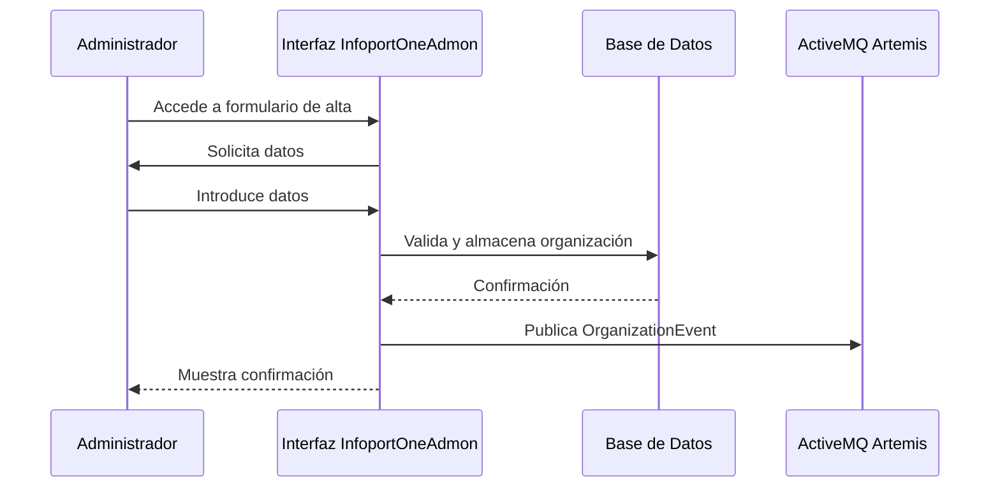

# Casos de Uso - InfoportOneAdmon

## Índice

1. [Introducción](#introducción)
2. [Casos de uso por requerimiento funcional](#casos-de-uso-por-requerimiento-funcional)
   - [Gestión de Organizaciones (RF-001 a RF-007)](#gestión-de-organizaciones-rf-001-a-rf-007)
   - [Gestión de Aplicaciones (RF-008 a RF-014)](#gestión-de-aplicaciones-rf-008-a-rf-014)
   - [Gestión de Roles y Módulos (RF-015 a RF-018)](#gestión-de-roles-y-módulos-rf-015-a-rf-018)
   - [Arquitectura de Eventos (RF-019 a RF-024)](#arquitectura-de-eventos-rf-019-a-rf-024)
   - [Integración con Keycloak (RF-025 a RF-029)](#integración-con-keycloak-rf-025-a-rf-029)
   - [Consolidación de Usuarios (RF-030 a RF-035)](#consolidación-de-usuarios-rf-030-a-rf-035)
3. [Diagramas UML relevantes](#diagramas-uml-relevantes)

---

## Introducción

Este documento describe los casos de uso del sistema InfoportOneAdmon, agrupados por requerimiento funcional (RF-XXX) según la especificación de requisitos y la documentación general del producto. Para los casos de uso más relevantes se incluyen diagramas UML en formato mermaid.

Cada caso de uso incluye:
- Nombre
- Objetivo
- Actores
- Precondiciones
- Flujo principal
- Flujos alternativos
- Criterios de éxito

---

## Casos de uso por requerimiento funcional

### Gestión de Organizaciones (RF-001 a RF-007)

#### RF-001: Crear organización cliente
- **Nombre:** Alta de organización cliente
- **Objetivo:** Registrar una nueva organización cliente con información básica y generar un identificador único.
- **Actores:** Administrador InfoportOneAdmon
- **Precondiciones:** El usuario tiene permisos de administrador.
- **Flujo principal:**
  1. El administrador accede al formulario de alta de organización.
  2. Introduce los datos obligatorios (nombre, CIF, dirección, contacto).
  3. El sistema valida los campos.
  4. Se genera un SecurityCompanyId único.
  5. Se almacena la organización en la base de datos.
  6. Se publica un OrganizationEvent al broker.
- **Flujos alternativos:**
  - Si la validación falla, se muestra un mensaje de error y no se registra la organización.
- **Criterios de éxito:**
  - La organización queda registrada y se publica el evento correspondiente.

#### RF-002: Editar organización existente
- **Nombre:** Edición de organización
- **Objetivo:** Modificar los datos de una organización existente.
- **Actores:** Administrador InfoportOneAdmon
- **Precondiciones:** El usuario es administrador y la organización existe.
- **Flujo principal:**
  1. El administrador selecciona la organización a editar.
  2. Modifica los datos requeridos.
  3. El sistema valida los cambios.
  4. Se actualiza la información en la base de datos.
  5. Se registra la auditoría de la modificación.
  6. Se publica un OrganizationEvent actualizado.
- **Flujos alternativos:**
  - Si la validación falla, se muestra un error y no se actualizan los datos.
- **Criterios de éxito:**
  - Los cambios quedan reflejados y auditados, y se publica el evento actualizado.

#### RF-003: Desactivar organización (soft delete)
- **Nombre:** Desactivación de organización
- **Objetivo:** Cambiar el estado de una organización a inactiva sin eliminarla físicamente.
- **Actores:** Administrador InfoportOneAdmon
- **Precondiciones:** La organización existe y está activa.
- **Flujo principal:**
  1. El administrador selecciona la organización a desactivar.
  2. El sistema cambia el estado a IsDeleted=true.
  3. Se publica un OrganizationEvent con el flag IsDeleted.
  4. Se mantiene el histórico en la base de datos.
- **Criterios de éxito:**
  - La organización aparece como inactiva y el evento es publicado.

#### RF-004: Agrupar organizaciones en grupos
- **Nombre:** Gestión de grupos de organizaciones
- **Objetivo:** Crear y gestionar grupos de organizaciones para administración colectiva.
- **Actores:** Administrador InfoportOneAdmon
- **Precondiciones:** Existen organizaciones registradas.
- **Flujo principal:**
  1. El administrador crea un grupo con nombre y descripción.
  2. Asigna organizaciones al grupo.
  3. El sistema actualiza la relación y publica OrganizationEvent con GroupId.
  4. Si un grupo queda vacío, se elimina automáticamente.
- **Criterios de éxito:**
  - El grupo se crea, se asignan organizaciones y los eventos se publican correctamente.

#### RF-005: Publicar eventos de organización
- **Nombre:** Publicación de OrganizationEvent
- **Objetivo:** Sincronizar el estado de las organizaciones con las aplicaciones satélite mediante eventos.
- **Actores:** Sistema InfoportOneAdmon
- **Precondiciones:** Se produce una alta, edición o baja de organización.
- **Flujo principal:**
  1. El sistema detecta el cambio en la organización.
  2. Construye el payload del evento.
  3. Calcula el hash SHA-256 para evitar duplicados.
  4. Publica el evento en el tópico correspondiente.
- **Criterios de éxito:**
  - El evento se publica solo si el hash es diferente al anterior.

#### RF-006: Listar organizaciones con filtros y paginación
- **Nombre:** Listado de organizaciones
- **Objetivo:** Permitir la consulta eficiente de organizaciones con filtros y paginación.
- **Actores:** Administrador InfoportOneAdmon
- **Precondiciones:** Existen organizaciones registradas.
- **Flujo principal:**
  1. El administrador accede al listado.
  2. Aplica filtros y selecciona la paginación.
  3. El sistema muestra los resultados según los criterios.
- **Criterios de éxito:**
  - El listado es preciso, rápido y configurable.

#### RF-007: Mostrar detalle de organización
- **Nombre:** Visualización de detalle de organización
- **Objetivo:** Consultar toda la información relevante de una organización, incluyendo aplicaciones y módulos contratados.
- **Actores:** Administrador InfoportOneAdmon
- **Precondiciones:** La organización existe.
- **Flujo principal:**
  1. El administrador selecciona una organización del listado.
  2. El sistema muestra el detalle completo, aplicaciones y módulos asociados.
- **Criterios de éxito:**
  - La información es completa y actualizada.

---

### Gestión de Aplicaciones (RF-008 a RF-014)
#### RF-008: Registrar aplicación satélite
- **Nombre:** Alta de aplicación satélite
- **Objetivo:** Registrar una nueva aplicación del portfolio con información técnica, prefijo de aplicación y credenciales OAuth2.
- **Actores:** Administrador InfoportOneAdmon
- **Precondiciones:** El usuario tiene permisos de administrador.
- **Flujo principal:**
  1. El administrador accede al formulario de alta de aplicación.
  2. Introduce los datos técnicos requeridos, incluyendo el prefijo de aplicación (ej: STP para Sintraport).
  3. El sistema genera ClientId y ClientSecret para Keycloak.
  4. Se configuran RedirectURIs y se almacenan credenciales de forma segura.
  5. Se almacena la aplicación en la base de datos.
  6. Se publica ApplicationEvent al broker.
- **Criterios de éxito:**
  - La aplicación queda registrada con su prefijo único y sincronizada con Keycloak y el ecosistema.

#### RF-009: Definir roles de seguridad por aplicación
- **Nombre:** Gestión de roles por aplicación
- **Objetivo:** Permitir la creación, edición y eliminación de roles de seguridad para cada aplicación usando el prefijo de la aplicación.
- **Actores:** Administrador InfoportOneAdmon
- **Precondiciones:** La aplicación existe.
- **Flujo principal:**
  1. El administrador accede a la sección de roles de una aplicación.
  2. Crea, edita o elimina roles según necesidad, usando el prefijo de la aplicación (ej: STP_AsignadorTransporte para Sintraport).
  3. El sistema valida la unicidad de nombres de rol.
  4. Se actualiza la base de datos y se publica ApplicationEvent.
- **Criterios de éxito:**
  - Los roles quedan correctamente gestionados con el prefijo adecuado y sincronizados.

#### RF-010: Definir módulos funcionales por aplicación
- **Nombre:** Gestión de módulos por aplicación
- **Objetivo:** Permitir la creación, edición y eliminación de módulos funcionales para cada aplicación usando la nomenclatura M + prefijo.
- **Actores:** Administrador InfoportOneAdmon
- **Precondiciones:** La aplicación existe.
- **Flujo principal:**
  1. El administrador accede a la sección de módulos de una aplicación.
  2. Crea, edita o elimina módulos usando la nomenclatura M + prefijo de aplicación (ej: MSTP_Trafico para Sintraport).
  3. El sistema valida los datos y la asociación a la aplicación.
  4. Se actualiza la base de datos y se publica ApplicationEvent.
- **Criterios de éxito:**
  - Los módulos quedan correctamente gestionados con la nomenclatura correcta y sincronizados.

#### RF-011: Configurar acceso de organizaciones a módulos
- **Nombre:** Configuración de acceso a módulos
- **Objetivo:** Definir qué organizaciones tienen acceso a qué módulos de cada aplicación.
- **Actores:** Administrador InfoportOneAdmon
- **Precondiciones:** Existen organizaciones y módulos definidos.
- **Flujo principal:**
  1. El administrador accede a la matriz de permisos organización-módulo.
  2. Configura los accesos de forma masiva o individual.
  3. El sistema valida y actualiza la configuración.
  4. Se publica ApplicationEvent con la nueva configuración.
- **Criterios de éxito:**
  - Los accesos quedan correctamente configurados y sincronizados.

#### RF-012: Registro automático de aplicación en Keycloak
- **Nombre:** Registro OAuth2 en Keycloak
- **Objetivo:** Registrar automáticamente cada aplicación como cliente OAuth2 en Keycloak.
- **Actores:** Sistema InfoportOneAdmon
- **Precondiciones:** Se registra una nueva aplicación.
- **Flujo principal:**
  1. El sistema realiza una llamada a la Admin API de Keycloak para crear el cliente.
  2. Configura Protocol Mappers y el flujo Authorization Code + PKCE.
  3. Maneja errores y realiza rollback si es necesario.
- **Criterios de éxito:**
  - La aplicación queda registrada en Keycloak y lista para autenticación.

#### RF-013: Publicar eventos de aplicación
- **Nombre:** Publicación de ApplicationEvent
- **Objetivo:** Sincronizar el estado de las aplicaciones con las aplicaciones satélite mediante eventos.
- **Actores:** Sistema InfoportOneAdmon
- **Precondiciones:** Se produce una alta, edición o baja de aplicación.
- **Flujo principal:**
  1. El sistema detecta el cambio en la aplicación.
  2. Construye el payload del evento, incluyendo roles y módulos.
  3. Calcula el hash SHA-256 para evitar duplicados.
  4. Publica el evento en el tópico correspondiente.
- **Criterios de éxito:**
  - El evento se publica solo si el hash es diferente al anterior.

#### RF-014: Visualizar catálogo de aplicaciones
- **Nombre:** Listado de aplicaciones
- **Objetivo:** Permitir la consulta eficiente del catálogo de aplicaciones con filtros y estado.
- **Actores:** Administrador InfoportOneAdmon
- **Precondiciones:** Existen aplicaciones registradas.
- **Flujo principal:**
  1. El administrador accede al listado de aplicaciones.
  2. Aplica filtros y visualiza el estado de cada aplicación.
- **Criterios de éxito:**
  - El listado es preciso, rápido y configurable.

### Gestión de Roles y Módulos (RF-015 a RF-018)
#### RF-015: Mantener catálogo maestro de roles
- **Nombre:** Catálogo maestro de roles
- **Objetivo:** Mantener un catálogo único de roles por aplicación.
- **Actores:** Administrador InfoportOneAdmon
- **Precondiciones:** Existen aplicaciones registradas.
- **Flujo principal:**
  1. El administrador accede al catálogo de roles de una aplicación.
  2. Añade, edita o elimina roles.
  3. El sistema valida la unicidad y actualiza la base de datos.
- **Criterios de éxito:**
  - El catálogo de roles es único y consistente.

#### RF-016: Incluir roles en ApplicationEvent
- **Nombre:** Sincronización de roles en eventos
- **Objetivo:** Incluir la lista de roles en cada ApplicationEvent para sincronización atómica.
- **Actores:** Sistema InfoportOneAdmon
- **Precondiciones:** Se produce un cambio en roles o aplicaciones.
- **Flujo principal:**
  1. El sistema detecta el cambio.
  2. Incluye la lista de roles en el evento.
  3. Publica el ApplicationEvent.
- **Criterios de éxito:**
  - Los roles se sincronizan siempre junto con la aplicación.

#### RF-017: Definir módulos con metadata descriptiva
- **Nombre:** Gestión de metadata de módulos
- **Objetivo:** Permitir definir módulos con nombre, descripción y funcionalidad.
- **Actores:** Administrador InfoportOneAdmon
- **Precondiciones:** La aplicación existe.
- **Flujo principal:**
  1. El administrador accede a la sección de módulos.
  2. Define o edita la metadata de cada módulo.
  3. El sistema valida y actualiza la información.
- **Criterios de éxito:**
  - Los módulos tienen metadata completa y válida.

#### RF-018: Incluir módulos y organizaciones en ApplicationEvent
- **Nombre:** Sincronización de módulos y accesos
- **Objetivo:** Incluir en cada ApplicationEvent la lista de módulos y las organizaciones con acceso a cada uno.
- **Actores:** Sistema InfoportOneAdmon
- **Precondiciones:** Se produce un cambio en módulos o accesos.
- **Flujo principal:**
  1. El sistema detecta el cambio.
  2. Incluye la información en el evento.
  3. Publica el ApplicationEvent.
- **Criterios de éxito:**
  - Los módulos y accesos quedan sincronizados en las aplicaciones satélite.

### Arquitectura de Eventos (RF-019 a RF-024)
#### RF-019: Publicar eventos con patrón State Transfer Event
- **Nombre:** Publicación de eventos de estado completo
- **Objetivo:** Publicar eventos que reflejen el estado completo de la entidad.
- **Actores:** Sistema InfoportOneAdmon
- **Precondiciones:** Se produce un cambio relevante en una entidad.
- **Flujo principal:**
  1. El sistema detecta el cambio.
  2. Construye el evento con el estado completo.
  3. Publica el evento al broker.
- **Criterios de éxito:**
  - El evento refleja el estado completo y es consumido correctamente.

#### RF-020: Mantener 3 tópicos de eventos
- **Nombre:** Gestión de tópicos de eventos
- **Objetivo:** Mantener solo los tópicos organization, application y user.
- **Actores:** Sistema InfoportOneAdmon
- **Precondiciones:** El sistema está configurado con los tópicos correctos.
- **Flujo principal:**
  1. El sistema publica eventos solo en los tópicos definidos.
- **Criterios de éxito:**
  - No existen otros tópicos y la mensajería es consistente.

#### RF-021: Prevenir duplicados mediante hash SHA-256
- **Nombre:** Prevención de duplicados en eventos
- **Objetivo:** Calcular hash SHA-256 del payload para evitar duplicados.
- **Actores:** Sistema InfoportOneAdmon
- **Precondiciones:** Se va a publicar un evento.
- **Flujo principal:**
  1. El sistema calcula el hash del payload.
  2. Verifica si es diferente al anterior.
  3. Publica solo si es nuevo.
- **Criterios de éxito:**
  - No se publican eventos duplicados.

#### RF-022: Incluir metadatos de trazabilidad en eventos
- **Nombre:** Inclusión de metadatos en eventos
- **Objetivo:** Añadir EventId, TraceId, Timestamp y OriginApplicationId en cada evento.
- **Actores:** Sistema InfoportOneAdmon
- **Precondiciones:** Se va a publicar un evento.
- **Flujo principal:**
  1. El sistema añade los metadatos requeridos.
  2. Publica el evento.
- **Criterios de éxito:**
  - Todos los eventos incluyen los metadatos requeridos.

#### RF-023: Republicar eventos completos para sincronización inicial
- **Nombre:** Republicación de eventos para sincronización
- **Objetivo:** Permitir la republicación de snapshots completos para nuevas aplicaciones satélite.
- **Actores:** Administrador InfoportOneAdmon
- **Precondiciones:** Se requiere sincronización inicial.
- **Flujo principal:**
  1. El administrador solicita la republicación.
  2. El sistema recopila el estado completo y publica el evento.
- **Criterios de éxito:**
  - La aplicación satélite recibe el snapshot completo.

#### RF-024: Garantizar mensajería persistente
- **Nombre:** Mensajería persistente en ActiveMQ Artemis
- **Objetivo:** Garantizar la persistencia y entrega de eventos.
- **Actores:** Sistema InfoportOneAdmon
- **Precondiciones:** El broker está configurado correctamente.
- **Flujo principal:**
  1. El sistema publica eventos con persistencia habilitada.
- **Criterios de éxito:**
  - Los eventos no se pierden y la entrega es garantizada.

### Integración con Keycloak (RF-025 a RF-029)
#### RF-025: Interactuar con Keycloak vía Admin API REST
- **Nombre:** Integración con Keycloak Admin API
- **Objetivo:** Gestionar Keycloak exclusivamente mediante su API REST.
- **Actores:** Sistema InfoportOneAdmon
- **Precondiciones:** El sistema tiene credenciales de service account.
- **Flujo principal:**
  1. El sistema realiza operaciones de alta, edición y consulta en Keycloak vía API REST.
- **Criterios de éxito:**
  - Todas las operaciones se realizan correctamente y de forma segura.

#### RF-026: Crear automáticamente clients OAuth2 en Keycloak
- **Nombre:** Alta automática de clientes OAuth2
- **Objetivo:** Crear y configurar automáticamente clientes OAuth2 en Keycloak al registrar una aplicación.
- **Actores:** Sistema InfoportOneAdmon
- **Precondiciones:** Se registra una nueva aplicación.
- **Flujo principal:**
  1. El sistema realiza un POST a la API de Keycloak para crear el cliente.
  2. Configura clientId, secret, redirectUris y PKCE.
  3. Maneja errores y realiza rollback si es necesario.
- **Criterios de éxito:**
  - El cliente queda correctamente creado y configurado.

#### RF-027: Configurar Protocol Mappers para claim c_ids
- **Nombre:** Configuración de Protocol Mappers
- **Objetivo:** Incluir el claim personalizado c_ids en los tokens JWT.
- **Actores:** Sistema InfoportOneAdmon
- **Precondiciones:** El cliente OAuth2 está creado.
- **Flujo principal:**
  1. El sistema configura el Protocol Mapper en Keycloak.
- **Criterios de éxito:**
  - El claim c_ids aparece en los tokens JWT.

#### RF-028: Operar sobre un único realm
- **Nombre:** Gestión de realm único
- **Objetivo:** Operar exclusivamente sobre el realm InfoportOne.
- **Actores:** Sistema InfoportOneAdmon
- **Precondiciones:** El realm está configurado.
- **Flujo principal:**
  1. El sistema realiza todas las operaciones sobre el realm InfoportOne.
- **Criterios de éxito:**
  - No existen operaciones fuera del realm definido.

#### RF-029: Sincronizar usuarios en Keycloak
- **Nombre:** Sincronización de usuarios en Keycloak
- **Objetivo:** Sincronizar usuarios mediante operaciones CREATE y UPDATE vía Admin API.
- **Actores:** Sistema InfoportOneAdmon
- **Precondiciones:** El usuario existe o se va a crear.
- **Flujo principal:**
  1. El sistema busca el usuario por email.
  2. Si no existe, lo crea; si existe, lo actualiza.
  3. Actualiza el atributo `c_ids` como **atributo multivalor** (array de strings) con todos los SecurityCompanyIds del usuario.
  4. Sincroniza roles consolidados de todas las aplicaciones.
- **Criterios de éxito:**
  - El usuario queda correctamente sincronizado en Keycloak con c_ids y roles actualizados.

### Consolidación de Usuarios (RF-030 a RF-035)
#### RF-030: Suscribirse a eventos de usuario
- **Nombre:** Suscripción a infoportone.events.user
- **Objetivo:** El Background Worker consume eventos de usuario para sincronización.
- **Actores:** Background Worker InfoportOneAdmon
- **Precondiciones:** El tópico está configurado y activo.
- **Flujo principal:**
  1. El worker se suscribe al tópico.
  2. Procesa eventos de usuario de forma idempotente.
  3. Realiza ACK solo tras sincronización exitosa con Keycloak.
- **Criterios de éxito:**
  - Todos los eventos se procesan correctamente y sin duplicados.

#### RF-031: Detectar usuarios duplicados por email
- **Nombre:** Detección de duplicados de usuario
- **Objetivo:** Identificar usuarios con el mismo email en múltiples organizaciones.
- **Actores:** Background Worker InfoportOneAdmon
- **Precondiciones:** Existen usuarios en varias organizaciones.
- **Flujo principal:**
  1. El worker busca usuarios por email en la base de datos.
  2. Identifica SecurityCompanyIds asociados.
  3. Aplica ventana de consolidación.
- **Criterios de éxito:**
  - Los duplicados se detectan y consolidan correctamente.

#### RF-032: Consolidar organizaciones y roles en claims
- **Nombre:** Consolidación de organizaciones y roles en claims
- **Objetivo:** Construir el array completo de SecurityCompanyIds para cada usuario y consolidar todos sus roles de las distintas aplicaciones.
- **Actores:** Background Worker InfoportOneAdmon
- **Precondiciones:** Existen usuarios con múltiples organizaciones y/o roles en distintas aplicaciones.
- **Flujo principal:**
  1. El worker consulta todas las organizaciones activas del usuario.
  2. Construye el array c_ids.
  3. Valida la existencia y estado de las organizaciones.
  4. Consulta todos los roles del usuario desde todas las aplicaciones en BD.
  5. Construye array de roles consolidados usando prefijos de aplicación para evitar conflictos.
- **Criterios de éxito:**
  - El claim c_ids refleja todas las organizaciones activas del usuario y todos sus roles están consolidados con prefijos únicos.

#### RF-033: Sincronizar con Keycloak sin publicar eventos adicionales
- **Nombre:** Sincronización directa con Keycloak
- **Objetivo:** Consolidar y sincronizar usuarios sin publicar eventos adicionales.
- **Actores:** Background Worker InfoportOneAdmon
- **Precondiciones:** Se ha consolidado la información del usuario.
- **Flujo principal:**
  1. El worker actualiza Keycloak directamente.
  2. No publica eventos de vuelta al broker.
- **Criterios de éxito:**
  - No existen ciclos infinitos de eventos y la sincronización es correcta.

#### RF-034: Implementar retry con backoff exponencial
- **Nombre:** Retry ante fallos de Keycloak
- **Objetivo:** Reintentar operaciones fallidas con backoff exponencial.
- **Actores:** Background Worker InfoportOneAdmon
- **Precondiciones:** Se produce un fallo al sincronizar con Keycloak.
- **Flujo principal:**
  1. El worker reintenta la operación según política configurada.
  2. Aplica backoff exponencial.
  3. Envía a DLQ tras fallos definitivos.
- **Criterios de éxito:**
  - Los fallos temporales se recuperan y los definitivos se gestionan correctamente.

#### RF-035: Mantener caché de consolidación de usuarios
- **Nombre:** Caché de consolidación de usuarios
- **Objetivo:** Optimizar el procesamiento mediante caché de consolidación.
- **Actores:** Background Worker InfoportOneAdmon
- **Precondiciones:** El sistema tiene caché habilitada.
- **Flujo principal:**
  1. El worker consulta y actualiza la tabla UserConsolidationCache.
  2. Reduce queries a la base de datos.
- **Criterios de éxito:**
  - El procesamiento es más eficiente y la caché se mantiene actualizada.

<!-- ...continúa con la misma estructura para los siguientes requerimientos... -->

---

## Diagramas UML relevantes

- [Alta de organización cliente (RF-001)](#rf-001-crear-organización-cliente)

<!-- Agregar aquí más diagramas a medida que se desarrollen los casos de uso relevantes -->
