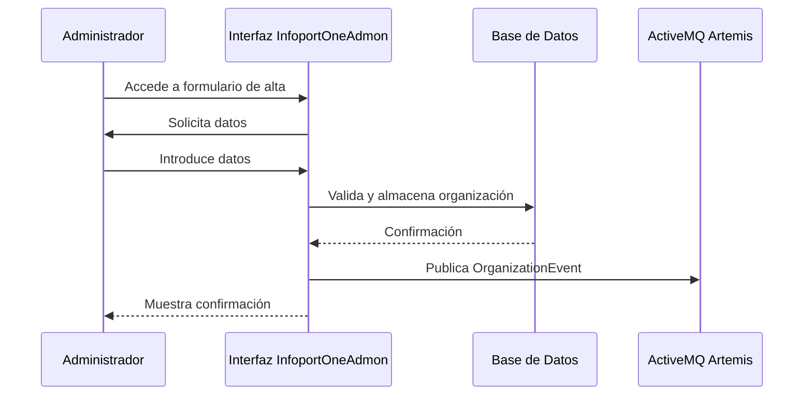

# Casos de Uso - InfoportOneAdmon

## Índice

1. [Introducción](#introducción)
2. [Casos de uso por requerimiento funcional](#casos-de-uso-por-requerimiento-funcional)
   - [Gestión de Organizaciones (RF-001 a RF-007)](#gestión-de-organizaciones-rf-001-a-rf-007)
   - [Gestión de Aplicaciones (RF-008 a RF-014)](#gestión-de-aplicaciones-rf-008-a-rf-014)
   - [Gestión de Roles y Módulos (RF-015 a RF-018)](#gestión-de-roles-y-módulos-rf-015-a-rf-018)
   - [Arquitectura de Eventos (RF-019 a RF-024)](#arquitectura-de-eventos-rf-019-a-rf-024)
   - [Integración con Keycloak (RF-025 a RF-029)](#integración-con-keycloak-rf-025-a-rf-029)
   - [Consolidación de Usuarios (RF-030 a RF-035)](#consolidación-de-usuarios-rf-030-a-rf-035)
3. [Diagramas UML relevantes](#diagramas-uml-relevantes)

---

## Introducción

Este documento describe los casos de uso del sistema InfoportOneAdmon, agrupados por requerimiento funcional (RF-XXX) según la especificación de requisitos y la documentación general del producto. Para los casos de uso más relevantes se incluyen diagramas UML en formato mermaid.

Cada caso de uso incluye:
- Nombre
- Objetivo
- Actores
- Precondiciones
- Flujo principal
- Flujos alternativos
- Criterios de éxito

---

## Casos de uso por requerimiento funcional

### Gestión de Organizaciones (RF-001 a RF-007)

#### RF-001: Crear organización cliente
- **Nombre:** Alta de organización cliente
- **Objetivo:** Registrar una nueva organización cliente con información básica y generar un identificador único.
- **Actores:** Administrador InfoportOneAdmon
- **Precondiciones:** El usuario tiene permisos de administrador.
- **Flujo principal:**
  1. El administrador accede al formulario de alta de organización.
  2. Introduce los datos obligatorios (nombre, CIF, dirección, contacto).
  3. El sistema valida los campos.
  4. Se genera un SecurityCompanyId único.
  5. Se almacena la organización en la base de datos.
  6. Se publica un OrganizationEvent al broker.
- **Flujos alternativos:**
  - Si la validación falla, se muestra un mensaje de error y no se registra la organización.
- **Criterios de éxito:**
  - La organización queda registrada y se publica el evento correspondiente.

#### RF-002: Editar organización existente
- **Nombre:** Edición de organización
- **Objetivo:** Modificar los datos de una organización existente.
- **Actores:** Administrador InfoportOneAdmon
- **Precondiciones:** El usuario es administrador y la organización existe.
- **Flujo principal:**
  1. El administrador selecciona la organización a editar.
  2. Modifica los datos requeridos.
  3. El sistema valida los cambios.
  4. Se actualiza la información en la base de datos.
  5. Se registra la auditoría de la modificación.
  6. Se publica un OrganizationEvent actualizado.
- **Flujos alternativos:**
  - Si la validación falla, se muestra un error y no se actualizan los datos.
- **Criterios de éxito:**
  - Los cambios quedan reflejados y auditados, y se publica el evento actualizado.

#### RF-003: Desactivar organización (soft delete)
- **Nombre:** Desactivación de organización
- **Objetivo:** Cambiar el estado de una organización a inactiva sin eliminarla físicamente.
- **Actores:** Administrador InfoportOneAdmon
- **Precondiciones:** La organización existe y está activa.
- **Flujo principal:**
  1. El administrador selecciona la organización a desactivar.
  2. El sistema cambia el estado a IsDeleted=true.
  3. Se publica un OrganizationEvent con el flag IsDeleted.
  4. Se mantiene el histórico en la base de datos.
- **Criterios de éxito:**
  - La organización aparece como inactiva y el evento es publicado.

#### RF-004: Agrupar organizaciones en grupos
- **Nombre:** Gestión de grupos de organizaciones
- **Objetivo:** Crear y gestionar grupos de organizaciones para administración colectiva.
- **Actores:** Administrador InfoportOneAdmon
- **Precondiciones:** Existen organizaciones registradas.
- **Flujo principal:**
  1. El administrador crea un grupo con nombre y descripción.
  2. Asigna organizaciones al grupo.
  3. El sistema actualiza la relación y publica OrganizationEvent con GroupId.
  4. Si un grupo queda vacío, se elimina automáticamente.
- **Criterios de éxito:**
  - El grupo se crea, se asignan organizaciones y los eventos se publican correctamente.

#### RF-005: Publicar eventos de organización
- **Nombre:** Publicación de OrganizationEvent
- **Objetivo:** Sincronizar el estado de las organizaciones con las aplicaciones satélite mediante eventos.
- **Actores:** Sistema InfoportOneAdmon
- **Precondiciones:** Se produce una alta, edición o baja de organización.
- **Flujo principal:**
  1. El sistema detecta el cambio en la organización.
  2. Construye el payload del evento.
  3. Calcula el hash SHA-256 para evitar duplicados.
  4. Publica el evento en el tópico correspondiente.
- **Criterios de éxito:**
  - El evento se publica solo si el hash es diferente al anterior.

#### RF-006: Listar organizaciones con filtros y paginación
- **Nombre:** Listado de organizaciones
- **Objetivo:** Permitir la consulta eficiente de organizaciones con filtros y paginación.
- **Actores:** Administrador InfoportOneAdmon
- **Precondiciones:** Existen organizaciones registradas.
- **Flujo principal:**
  1. El administrador accede al listado.
  2. Aplica filtros y selecciona la paginación.
  3. El sistema muestra los resultados según los criterios.
- **Criterios de éxito:**
  - El listado es preciso, rápido y configurable.

#### RF-007: Mostrar detalle de organización
- **Nombre:** Visualización de detalle de organización
- **Objetivo:** Consultar toda la información relevante de una organización, incluyendo aplicaciones y módulos contratados.
- **Actores:** Administrador InfoportOneAdmon
- **Precondiciones:** La organización existe.
- **Flujo principal:**
  1. El administrador selecciona una organización del listado.
  2. El sistema muestra el detalle completo, aplicaciones y módulos asociados.
- **Criterios de éxito:**
  - La información es completa y actualizada.

---

### Gestión de Aplicaciones (RF-008 a RF-014)

<!-- ...continúa con la misma estructura para los siguientes requerimientos... -->

---

## Diagramas UML relevantes

- [Alta de organización cliente (RF-001)](#rf-001-crear-organización-cliente)

<!-- Agregar aquí más diagramas a medida que se desarrollen los casos de uso relevantes -->
