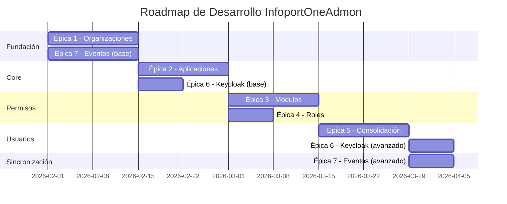

# Historias de Usuario - InfoportOneAdmon

## Índice

1. [Avatares y Buyer Personas](#1-avatares-y-buyer-personas)
2. [Épicas del Proyecto](#2-épicas-del-proyecto)
3. [Roadmap y Dependencias](#3-roadmap-y-dependencias)
4. [Historias de Usuario por Épica](#4-historias-de-usuario-por-épica)
   - 4.1. [Épica 1: Gestión del Portfolio de Organizaciones Clientes](#41-épica-1-gestión-del-portfolio-de-organizaciones-clientes)
   - 4.2. [Épica 2: Administración de Aplicaciones del Ecosistema](#42-épica-2-administración-de-aplicaciones-del-ecosistema)
   - 4.3. [Épica 3: Configuración de Módulos y Permisos de Acceso](#43-épica-3-configuración-de-módulos-y-permisos-de-acceso)
   - 4.4. [Épica 4: Gobierno de Roles y Seguridad](#44-épica-4-gobierno-de-roles-y-seguridad)
   - 4.5. [Épica 5: Sincronización y Consolidación de Usuarios Multi-Organización](#45-épica-5-sincronización-y-consolidación-de-usuarios-multi-organización)
   - 4.6. [Épica 6: Integración con Keycloak e Identity Management](#46-épica-6-integración-con-keycloak-e-identity-management)
   - 4.7. [Épica 7: Arquitectura de Eventos y Sincronización](#47-épica-7-arquitectura-de-eventos-y-sincronización)
5. [Product Backlog Priorizado](#5-product-backlog-priorizado)
6. [MVP - Producto Mínimo Viable](#6-mvp---producto-mínimo-viable)

---

## 1. Avatares y Buyer Personas

### **Avatar 1: Laura - Administradora de la Organización Propietaria**

**Perfil:**
- **Rol**: Responsable de Onboarding y Gestión de Clientes
- **Edad**: 35 años
- **Experiencia**: 8 años en gestión de clientes B2B
- **Objetivos**: Incorporar nuevos clientes de forma rápida y sin errores, mantener información actualizada de organizaciones
- **Frustraciones**: Procesos manuales que generan errores, falta de visibilidad sobre el estado de cada cliente
- **Habilidades técnicas**: Medias - Maneja interfaces web pero no es desarrolladora
- **Cita**: "Necesito poder dar de alta un cliente en minutos, no en días. Cada error en los datos nos cuesta tiempo y credibilidad."

### **Avatar 2: Carlos - Gestor de Seguridad**

**Perfil:**
- **Rol**: Administrador de Accesos y Permisos
- **Edad**: 42 años
- **Experiencia**: 12 años en ciberseguridad y gestión de identidades
- **Objetivos**: Garantizar que solo las organizaciones autorizadas accedan a cada aplicación, controlar permisos de forma granular
- **Frustraciones**: Procesos de autorización lentos, falta de auditoría clara de cambios de permisos
- **Habilidades técnicas**: Altas - Conoce OAuth2, tokens JWT, conceptos de seguridad
- **Cita**: "La seguridad no puede ser un cuello de botella. Necesito poder revocar accesos inmediatamente si hay una incidencia."

### **Avatar 3: Mónica - Administradora de Aplicaciones**

**Perfil:**
- **Rol**: Product Owner de las aplicaciones satélite del ecosistema
- **Edad**: 38 años
- **Experiencia**: 10 años en gestión de producto de software empresarial
- **Objetivos**: Configurar qué funcionalidades (módulos) están disponibles para cada cliente, gestionar el portfolio de aplicaciones
- **Frustraciones**: Descoordinación entre equipos, configuraciones inconsistentes entre aplicaciones
- **Habilidades técnicas**: Medias-Altas - Entiende arquitectura de software pero no programa
- **Cita**: "Cada aplicación tiene sus propias reglas. Necesito un lugar centralizado donde definir qué ofrece cada una y a quién."

### **Avatar 4: David - Auditor / Compliance Officer**

**Perfil:**
- **Rol**: Responsable de Cumplimiento Normativo
- **Edad**: 45 años
- **Experiencia**: 15 años en auditoría de sistemas y compliance (ISO 27001, GDPR)
- **Objetivos**: Verificar trazabilidad de todos los cambios, demostrar cumplimiento en auditorías externas
- **Frustraciones**: Logs dispersos, falta de información de "quién hizo qué y cuándo"
- **Habilidades técnicas**: Medias - Lee logs y reportes pero no accede a bases de datos directamente
- **Cita**: "En una auditoría, me piden demostrar que solo usuarios autorizados modificaron configuraciones críticas. Si no puedo, hay multas."

### **Avatar 5: Ana - Usuario Final de Organización Cliente (Beneficiario Indirecto)**

**Perfil:**
- **Rol**: Gerente de Operaciones en empresa cliente
- **Edad**: 40 años
- **Experiencia**: 15 años en logística y operaciones
- **Objetivos**: Acceder fácilmente a las aplicaciones del ecosistema (CRM, ERP, BI) sin problemas de autenticación
- **Frustraciones**: Tener que recordar múltiples contraseñas, retrasos cuando cambia de empresa y necesita nuevos accesos
- **Habilidades técnicas**: Bajas - Usuaria de aplicaciones, no técnica
- **Cita**: "Solo quiero que cuando hago login una vez, pueda acceder a todas las herramientas que necesito. SSO debería ser invisible."

---

## 2. Épicas del Proyecto

### **Épica 1: Gestión del Portfolio de Organizaciones Clientes**

**Objetivo de Negocio:** Permitir a la Organización Propietaria gestionar de forma centralizada y eficiente todo el ciclo de vida de las organizaciones clientes del ecosistema.

**Valor que aporta:** 
- Reduce tiempo de onboarding de días a minutos
- Elimina errores manuales en datos de organizaciones
- Proporciona visibilidad completa del portfolio de clientes
- Permite control inmediato de acceso mediante kill-switch

**Criterios de aceptación de la épica:**
- Alta, edición y desactivación de organizaciones completamente funcionales
- Agrupación de organizaciones en grupos lógicos operativa
- Trazabilidad completa de cambios en organizaciones
- Sincronización automática con todas las aplicaciones satélite mediante eventos

---

### **Épica 2: Administración de Aplicaciones del Ecosistema**

**Objetivo de Negocio:** Gestionar el catálogo completo de aplicaciones del portfolio, incluyendo credenciales OAuth2, módulos funcionales y roles de seguridad.

**Valor que aporta:**
- Inventario centralizado de todas las aplicaciones del ecosistema
- Gestión segura de credenciales diferenciadas (frontend/backend)
- Definición clara de capacidades (módulos) y roles de cada aplicación
- Automatización del registro en Keycloak

**Criterios de aceptación de la épica:**
- Registro de aplicaciones con credenciales CODE (SPAs) y ClientCredentials (APIs) funcional
- Definición y gestión de módulos por aplicación operativa
- Catálogo de roles por aplicación sincronizado con aplicaciones satélite
- Integración automática con Keycloak Admin API sin intervención manual

---

### **Épica 3: Configuración de Módulos y Permisos de Acceso**

**Objetivo de Negocio:** Permitir configuración granular de qué organizaciones tienen acceso a qué módulos funcionales de cada aplicación.

**Valor que aporta:**
- Modelo de negocio flexible (venta por módulos, no por aplicación completa)
- Control preciso de funcionalidades por cliente
- Sincronización automática de permisos a aplicaciones satélite
- Facilita ventas incrementales (activar módulos adicionales sin redeployment)

**Criterios de aceptación de la épica:**
- Matriz de permisos organización-módulo completamente funcional
- Asignación masiva y granular de accesos operativa
- Sincronización de permisos mediante OrganizationEvent validada
- Aplicaciones satélite respetan permisos sin consultas adicionales

---

### **Épica 4: Gobierno de Roles y Seguridad**

**Objetivo de Negocio:** Establecer un catálogo maestro de roles por aplicación que garantice coherencia en todo el ecosistema.

**Valor que aporta:**
- Nomenclatura consistente de roles usando prefijos de aplicación
- Evita conflictos de nombres entre aplicaciones
- Permite identificar origen de cada rol fácilmente
- Simplifica gestión de permisos en aplicaciones satélite

**Criterios de aceptación de la épica:**
- Catálogo de roles por aplicación completamente operativo
- Validación automática de nomenclatura con prefijos funcionando
- Sincronización de roles mediante ApplicationEvent validada
- Aplicaciones satélite asignan roles del catálogo sin inconsistencias

---

### **Épica 5: Sincronización y Consolidación de Usuarios Multi-Organización**

**Objetivo de Negocio:** Gestionar usuarios que trabajan para múltiples organizaciones clientes, consolidando su identidad y permisos.

**Valor que aporta:**
- Usuarios acceden a datos de todas sus organizaciones con un solo login (SSO real)
- Consolidación automática de roles de múltiples aplicaciones
- Optimización de experiencia de usuario (consultores, auditores, multi-empresa)
- Reducción de cuentas duplicadas y confusión de identidades

**Criterios de aceptación de la épica:**
- Detección automática de usuarios duplicados por email funcionando
- Claim c_ids con todas las organizaciones del usuario en token JWT
- Consolidación de roles multi-aplicación con prefijos únicos
- Sincronización directa con Keycloak sin eventos adicionales

---

### **Épica 6: Integración con Keycloak e Identity Management**

**Objetivo de Negocio:** Abstraer la complejidad de Keycloak para que administradores gestionen identidad sin acceder directamente a su consola.

**Valor que aporta:**
- Administradores no necesitan conocer Keycloak
- Registro automático de clientes OAuth2 en Keycloak
- Configuración automática de Protocol Mappers para claims personalizados
- SSO funcional en todo el ecosistema sin configuración manual

**Criterios de aceptación de la épica:**
- Registro automático de aplicaciones en Keycloak via Admin API funcional
- Configuración de claim c_ids como atributo multivalor operativa
- Sincronización CREATE/UPDATE de usuarios sin intervención manual
- PKCE para SPAs y ClientCredentials para APIs correctamente configurados

---

### **Épica 7: Arquitectura de Eventos y Sincronización**

**Objetivo de Negocio:** Garantizar desacoplamiento total entre InfoportOneAdmon y aplicaciones satélite mediante eventos de estado.

**Valor que aporta:**
- Aplicaciones satélite operan autónomamente sin depender de InfoportOneAdmon en tiempo real
- Escalabilidad horizontal sin modificar InfoportOneAdmon
- Resiliencia: aplicaciones procesan cambios cuando se reconectan
- Prevención de duplicados reduce tráfico y procesamiento innecesario

**Criterios de aceptación de la épica:**
- Publicación de eventos OrganizationEvent, ApplicationEvent, UserEvent funcional
- Sistema de hash SHA-256 para prevención de duplicados operativo
- Consumo idempotente en Background Workers validado
- Sincronización inicial completa mediante republicación de eventos funcionando

---

## 3. Roadmap y Dependencias



**Hitos clave:**
- **Hito 1 (Semana 2)**: Gestión básica de organizaciones y publicación de eventos
- **Hito 2 (Semana 4)**: Catálogo de aplicaciones y registro en Keycloak
- **Hito 3 (Semana 6)**: Configuración completa de módulos y roles
- **Hito 4 (Semana 8)**: Consolidación de usuarios multi-organización operativa
- **Hito 5 (Semana 9)**: Sistema completo en producción

---

## 4. Historias de Usuario por Épica

### 4.1. Épica 1: Gestión del Portfolio de Organizaciones Clientes

#### **Tabla Resumen de User Stories**

| ID | Título | Prioridad | Estimación | Dependencias |
|----|--------|-----------|------------|--------------|
| US-001 | Crear nueva organización cliente | Alta | 5 | Ninguna |
| US-002 | Editar información de organización existente | Alta | 3 | US-001 |
| US-003 | Desactivar organización (kill-switch) | Alta | 2 | US-001 |
| US-004 | Listar organizaciones con filtros y paginación | Media | 5 | US-001 |
| US-005 | Ver detalle completo de organización | Media | 3 | US-001 |
| US-006 | Crear grupo de organizaciones | Media | 3 | US-001 |
| US-007 | Asignar organizaciones a un grupo | Media | 2 | US-001, US-006 |
| US-008 | Consultar auditoría de cambios en organización | Media | 5 | US-001 |

---

#### **US-001: Crear nueva organización cliente**

**Épica:** Gestión del Portfolio de Organizaciones Clientes  
**Avatar:** Laura - Administradora de la Organización Propietaria  
**Prioridad:** Alta | **Estimación:** 5 Story Points

**Historia:**
```
Como Laura, administradora responsable del onboarding de clientes,
quiero dar de alta una nueva organización cliente completando un formulario simple con sus datos básicos (nombre, CIF, dirección, contacto),
para iniciar su proceso de incorporación al ecosistema en pocos minutos y sin cometer errores que retrasen su acceso a las aplicaciones.
```

**Contexto adicional:**
Laura acaba de cerrar un contrato con una nueva empresa de logística que necesita acceder al ecosistema de aplicaciones. El cliente espera comenzar a usar las herramientas en 48 horas. Laura no puede permitirse errores en los datos ni procesos manuales complejos.

**Criterios de aceptación:**
- **Given:** Laura accede a la sección de "Organizaciones" en InfoportOneAdmon
- **When:** Hace clic en "Crear nueva organización"
- **Then:** Se muestra un formulario con campos: Nombre (obligatorio), CIF (obligatorio), Dirección, Ciudad, Código Postal, País, Email de contacto (obligatorio), Teléfono
- **And:** El formulario valida que nombre, CIF y email sean obligatorios antes de enviar
- **And:** El sistema verifica que el CIF no esté duplicado (validación de unicidad)
- **When:** Laura completa los campos y hace clic en "Guardar"
- **Then:** El sistema genera automáticamente un `SecurityCompanyId` único e inmutable
- **And:** Se muestra un mensaje de confirmación: "Organización [Nombre] creada exitosamente con ID [SecurityCompanyId]"
- **And:** El registro queda visible inmediatamente en el listado de organizaciones con estado "Activa"
- **And:** Se publica un `OrganizationEvent` al tópico `infoportone.events.organization` en ActiveMQ Artemis
- **And:** Se registra en la tabla `AuditLog` quién (Laura) y cuándo creó la organización

**Definición de hecho (DoD):**
- Código implementado y revisado (code review aprobado)
- Tests unitarios y de integración pasando (cobertura >80%)
- Validaciones de frontend y backend funcionando
- Evento publicado correctamente verificado en broker
- Documentación de API actualizada (Swagger)
- Probado en entorno de staging
- Campos de auditoría Helix6 populados automáticamente

**Dependencias:** Ninguna (historia fundacional del MVP)

**Notas técnicas:**
- Usar Entity Framework Core para persistencia
- `SecurityCompanyId` se genera mediante secuencia de PostgreSQL independiente
- La auditoría se gestiona automáticamente por Helix6 (campos `AuditCreationUser`, `AuditCreationDate`)
- El evento debe incluir flag `IsDeleted: false` y todos los campos de la organización

---

#### **US-002: Editar información de organización existente**

**Épica:** Gestión del Portfolio de Organizaciones Clientes  
**Avatar:** Laura - Administradora de la Organización Propietaria  
**Prioridad:** Alta | **Estimación:** 3 Story Points

**Historia:**
```
Como Laura, administradora responsable de mantener datos actualizados de clientes,
quiero modificar la información de una organización existente (dirección, contacto, etc.) cuando el cliente nos notifica cambios,
para garantizar que toda la información del ecosistema esté actualizada y evitar comunicaciones a direcciones o emails obsoletos.
```

**Contexto adicional:**
Una organización cliente se ha mudado de oficina y ha cambiado su email de contacto administrativo. Laura necesita actualizar estos datos rápidamente para que las notificaciones del sistema lleguen a la dirección correcta.

**Criterios de aceptación:**
- **Given:** Laura accede al detalle de una organización existente
- **When:** Hace clic en "Editar organización"
- **Then:** Se muestra el formulario con los datos actuales pre-rellenados
- **And:** El campo `SecurityCompanyId` NO es editable (es inmutable)
- **When:** Laura modifica dirección, email de contacto y hace clic en "Guardar cambios"
- **Then:** El sistema valida los cambios (email válido, campos obligatorios completos)
- **And:** Se actualiza el registro en la base de datos
- **And:** Se muestra confirmación: "Organización actualizada exitosamente"
- **And:** Se publica un `OrganizationEvent` actualizado al broker (con flag `IsDeleted: false`)
- **And:** Se registra en `AuditLog`: usuario que modificó, timestamp, valores anteriores (OldValue) y nuevos (NewValue)
- **And:** Los campos `AuditModificationUser` y `AuditModificationDate` se actualizan automáticamente

**Definición de hecho:**
- Formulario de edición funcional con datos pre-rellenados
- Validación de inmutabilidad de `SecurityCompanyId`
- Evento actualizado publicado correctamente
- Registro de auditoría detallado con before/after
- Tests de validación pasando

**Dependencias:** US-001

**Preguntas para el equipo:**
- ¿Debemos notificar vía email a la organización cliente cuando se cambia su información de contacto?
- ¿Hay campos que solo ciertos roles pueden modificar (ej: campos fiscales)?

---

#### **US-003: Desactivar organización (kill-switch)**

**Épica:** Gestión del Portfolio de Organizaciones Clientes  
**Avatar:** Carlos - Gestor de Seguridad  
**Prioridad:** Alta | **Estimación:** 2 Story Points

**Historia:**
```
Como Carlos, gestor de seguridad,
quiero desactivar inmediatamente una organización cliente sin eliminar su información,
para bloquear su acceso a todas las aplicaciones del ecosistema en caso de impago, incidencia de seguridad o fin de contrato.
```

**Contexto adicional:**
Una organización cliente acumula 3 meses de impago. El departamento comercial ha solicitado a Carlos que suspenda su acceso hasta que regularice la situación. Carlos necesita hacerlo inmediatamente sin perder el histórico de datos.

**Criterios de aceptación:**
- **Given:** Carlos accede al detalle de una organización activa
- **When:** Hace clic en "Desactivar organización"
- **Then:** Se muestra un modal de confirmación: "¿Está seguro? Esto bloqueará el acceso de todos los usuarios de esta organización"
- **When:** Carlos confirma la acción
- **Then:** El sistema establece `AuditDeletionDate` a la fecha actual (soft delete)
- **And:** Se muestra confirmación: "Organización desactivada. Los usuarios no podrán acceder a las aplicaciones"
- **And:** Se publica un `OrganizationEvent` con flag `IsDeleted: true`
- **And:** Las aplicaciones satélite que reciben el evento deniegan acceso a usuarios con `SecurityCompanyId` de esa organización
- **And:** El registro NO se elimina físicamente de la base de datos (soft delete)
- **And:** Se registra en auditoría quién y cuándo desactivó la organización

**Definición de hecho:**
- Modal de confirmación implementado
- Soft delete funcional (campo `AuditDeletionDate`)
- Evento con `IsDeleted: true` publicado
- Aplicaciones satélite respetan la desactivación (validado en tests de integración)
- Histórico de la organización se mantiene accesible para auditoría

**Dependencias:** US-001

**Notas técnicas:**
- NO usar DELETE de SQL, solo UPDATE para establecer `AuditDeletionDate`
- El evento debe incluir todo el estado de la organización incluso si está `IsDeleted: true`
- Las aplicaciones satélite deben implementar filtro para excluir organizaciones con `AuditDeletionDate != NULL`

**Conversaciones pendientes:**
- ¿Debe haber un proceso de reactivación? (Futura US-003v2)
- ¿Los datos de organizaciones desactivadas se archivan tras X meses?

---

#### **US-004: Listar organizaciones con filtros y paginación**

**Épica:** Gestión del Portfolio de Organizaciones Clientes  
**Avatar:** Laura - Administradora de la Organización Propietaria  
**Prioridad:** Media | **Estimación:** 5 Story Points

**Historia:**
```
Como Laura, administradora que gestiona cientos de organizaciones clientes,
quiero visualizar el listado de organizaciones con opciones de filtrado (por nombre, estado, grupo) y paginación,
para encontrar rápidamente la organización que busco sin tener que desplazarme por listas interminables.
```

**Criterios de aceptación:**
- El listado muestra: Nombre, CIF, Estado (Activa/Inactiva), Grupo, Ciudad, Email de contacto
- Filtros disponibles: Nombre (búsqueda parcial), Estado (Activa/Inactiva/Todas), Grupo (dropdown)
- Paginación configurable: 10, 25, 50 items por página
- Ordenación: Por nombre (A-Z, Z-A), por fecha de creación (más reciente primero)
- Al aplicar filtros, la paginación se reinicia a página 1
- El listado se actualiza sin recargar la página completa (SPA)
- Indicador visual de organizaciones inactivas (ej: texto gris, icono de advertencia)

**Definición de hecho:**
- Filtros funcionales con actualización en tiempo real
- Paginación del lado servidor implementada (no cargar todas las organizaciones)
- Ordenación multi-columna funcional
- Rendimiento: Respuesta <200ms para listados de hasta 1000 organizaciones
- Tests de UI para interacción de filtros

**Dependencias:** US-001

**Notas técnicas:**
- Usar query parameters en URL para mantener estado de filtros (bookmarkable)
- Implementar índices en BD para campos de búsqueda frecuente (Nombre, Active)

---

#### **US-005: Ver detalle completo de organización**

**Épica:** Gestión del Portfolio de Organizaciones Clientes  
**Avatar:** Laura - Administradora de la Organización Propietaria  
**Prioridad:** Media | **Estimación:** 3 Story Points

**Historia:**
```
Como Laura, administradora,
quiero ver toda la información detallada de una organización incluyendo aplicaciones y módulos contratados,
para tener una visión completa de qué servicios tiene activos el cliente y poder responder consultas comerciales.
```

**Criterios de aceptación:**
- Vista detallada muestra: Datos básicos, Grupo (si aplica), Lista de aplicaciones con acceso, Módulos contratados por aplicación
- Sección de metadatos: Fecha de creación, Usuario que creó, Fecha de última modificación, Usuario que modificó
- Botones de acción: Editar, Desactivar, Ver auditoría
- Información organizada en pestañas o secciones colapsables
- Carga rápida (<300ms) incluso con muchas aplicaciones

**Definición de hecho:**
- Vista detallada completamente funcional
- Datos de aplicaciones y módulos sincronizados desde relaciones N:M
- Navegación fluida entre listado y detalle

**Dependencias:** US-001

---

#### **US-006: Crear grupo de organizaciones**

**Épica:** Gestión del Portfolio de Organizaciones Clientes  
**Avatar:** Mónica - Administradora de Aplicaciones  
**Prioridad:** Media | **Estimación:** 3 Story Points

**Historia:**
```
Como Mónica, administradora de aplicaciones que gestiona holdings empresariales,
quiero crear grupos lógicos de organizaciones (ej: "Holding Logístico Norte", "Consorcio Financiero"),
para que las aplicaciones satélite puedan implementar funcionalidades colaborativas entre organizaciones del mismo grupo.
```

**Contexto adicional:**
Un holding de transporte tiene 5 empresas subsidiarias que necesitan compartir ciertos datos (ej: flotas de camiones, rutas compartidas). Mónica necesita agruparlas para que la aplicación de logística pueda identificarlas como parte del mismo ecosistema empresarial.

**Criterios de aceptación:**
- Formulario de creación de grupo con campos: Nombre del grupo (obligatorio, único), Descripción
- El sistema valida unicidad del nombre del grupo
- Se muestra confirmación de creación exitosa
- El grupo queda disponible inmediatamente en el dropdown de asignación de organizaciones

**Definición de hecho:**
- CRUD básico de grupos funcional
- Validación de unicidad implementada
- Grupos visibles en interfaces de asignación

**Dependencias:** US-001

**Notas técnicas:**
- Los grupos NO tienen eventos propios; se propagan mediante `GroupId` en `OrganizationEvent`
- No tienen campo `Active` porque su existencia depende de si tienen organizaciones asignadas

---

#### **US-007: Asignar organizaciones a un grupo**

**Épica:** Gestión del Portfolio de Organizaciones Clientes  
**Avatar:** Mónica - Administradora de Aplicaciones  
**Prioridad:** Media | **Estimación:** 2 Story Points

**Historia:**
```
Como Mónica, administradora de aplicaciones,
quiero asignar (o reasignar) una organización a un grupo específico,
para reflejar la estructura empresarial real de holdings o consorcios en el sistema.
```

**Criterios de aceptación:**
- Desde el detalle de organización, dropdown para seleccionar grupo
- Opción "Sin grupo" para organizaciones independientes
- Al cambiar de grupo, se actualiza inmediatamente
- Se publica `OrganizationEvent` actualizado con nuevo `GroupId`
- Si una organización se mueve a "Sin grupo", `GroupId` queda NULL en el evento

**Definición de hecho:**
- Asignación/reasignación funcional
- Eventos publicados con `GroupId` correcto
- Apps satélite reciben cambios de grupo

**Dependencias:** US-001, US-006

---

#### **US-008: Consultar auditoría de cambios en organización**

**Épica:** Gestión del Portfolio de Organizaciones Clientes  
**Avatar:** David - Auditor / Compliance Officer  
**Prioridad:** Media | **Estimación:** 5 Story Points

**Historia:**
```
Como David, auditor responsable de compliance,
quiero consultar el historial completo de cambios realizados en una organización específica,
para demostrar en auditorías externas que solo usuarios autorizados modificaron datos críticos y verificar trazabilidad completa.
```

**Contexto adicional:**
David debe preparar evidencias para una auditoría ISO 27001. Necesita demostrar que cuando se cambió la dirección fiscal de la organización "Transportes Rápidos", fue realizado por un administrador autorizado, en una fecha específica, y se registró el valor anterior.

**Criterios de aceptación:**
- Vista de auditoría accesible desde detalle de organización
- Listado cronológico inverso (más reciente primero) de todos los cambios
- Cada entrada muestra: Fecha/hora, Usuario que realizó el cambio, Acción (CREATE/UPDATE/DELETE), Campos modificados con valores before/after
- Filtros por: Rango de fechas, Usuario que modificó, Tipo de acción
- Exportación a CSV para evidencias de auditoría
- Datos inmutables (no se pueden editar logs de auditoría)

**Definición de hecho:**
- Consulta de `AuditLog` funcional filtrando por `EntityType='Organization'` y `EntityId`
- Visualización clara de cambios con before/after
- Exportación a CSV implementada
- Rendimiento: <500ms para consultar 1000 logs

**Dependencias:** US-001, US-002

**Notas técnicas:**
- Los logs de auditoría se generan automáticamente por triggers de BD o por el `DbContext` de Helix6
- La tabla `AuditLog` es append-only (no permite UPDATE ni DELETE)

---

### 4.2. Épica 2: Administración de Aplicaciones del Ecosistema

#### **Tabla Resumen de User Stories**

| ID | Título | Prioridad | Estimación | Dependencias |
|----|--------|-----------|------------|--------------|
| US-009 | Registrar aplicación frontend (SPA Angular) | Alta | 5 | US-001 |
| US-010 | Registrar aplicación backend (API) | Alta | 5 | US-001 |
| US-011 | Definir prefijo único de aplicación | Alta | 2 | US-009, US-010 |
| US-012 | Agregar credencial adicional a aplicación | Media | 3 | US-009, US-010 |
| US-013 | Rotar secreto de aplicación backend | Media | 3 | US-010 |
| US-014 | Listar catálogo de aplicaciones | Media | 3 | US-009 |
| US-015 | Desactivar aplicación temporalmente | Media | 2 | US-009 |

---

#### **US-009: Registrar aplicación frontend (SPA Angular)**

**Épica:** Administración de Aplicaciones del Ecosistema  
**Avatar:** Mónica - Administradora de Aplicaciones  
**Prioridad:** Alta | **Estimación:** 5 Story Points

**Historia:**
```
Como Mónica, administradora del portfolio de aplicaciones,
quiero registrar una nueva aplicación frontend (Angular SPA) como cliente público OAuth2 sin almacenar secretos,
para que los usuarios puedan autenticarse de forma segura usando PKCE sin exponer credenciales en el navegador.
```

**Contexto adicional:**
El equipo de desarrollo acaba de completar una nueva aplicación de Business Intelligence en Angular 20. Mónica necesita registrarla en el ecosistema para que use el SSO de Keycloak sin configurar secretos que podrían comprometerse en el cliente.

**Criterios de aceptación:**
- Formulario de registro con campos: Nombre de la aplicación, Descripción, Prefijo de aplicación (ej: "BI"), RedirectURIs (múltiples)
- El sistema valida unicidad de Nombre y Prefijo
- Al enviar, el sistema:
  - Genera un `client_id` único (ej: "bi-app-frontend")
  - Registra la aplicación en tabla `APPLICATION`
  - Crea credencial en tabla `APPLICATION_SECURITY` con `CredentialType: CODE`, `ClientSecretHash: NULL`, RedirectURIs especificados
  - Registra el client en Keycloak como public client con PKCE habilitado (S256)
  - Configura Protocol Mappers para claim `c_ids`
- Se muestra confirmación con el `client_id` generado
- Se publica `ApplicationEvent` al broker

**Definición de hecho:**
- Registro en tablas `APPLICATION` y `APPLICATION_SECURITY` funcional
- Integración con Keycloak Admin API validada (client creado correctamente)
- PKCE (S256) configurado automáticamente
- Protocol Mapper de `c_ids` añadido automáticamente
- Tests de integración con Keycloak pasando

**Dependencias:** US-001 (para entender el flujo de registro)

**Notas técnicas:**
- `ClientSecretHash` debe quedar NULL para public clients
- RedirectURIs se almacena como JSON array: `["https://bi.infoportone.com/*"]`
- El `client_id` sigue patrón: `{prefijo}-app-frontend` (todo en minúsculas)

---

#### **US-010: Registrar aplicación backend (API)**

**Épica:** Administración de Aplicaciones del Ecosistema  
**Avatar:** Mónica - Administradora de Aplicaciones  
**Prioridad:** Alta | **Estimación:** 5 Story Points

**Historia:**
```
Como Mónica, administradora del portfolio de aplicaciones,
quiero registrar una nueva aplicación backend (API) como cliente confidencial OAuth2 con secret seguro,
para que pueda autenticarse en Keycloak y obtener tokens para comunicarse con otros servicios del ecosistema.
```

**Criterios de aceptación:**
- Formulario de registro similar a US-009 pero sin RedirectURIs
- Al enviar, el sistema:
  - Genera `client_id` (ej: "crm-api-backend")
  - Genera `client_secret` aleatorio criptográficamente seguro (32 caracteres)
  - Hashea el secret con bcrypt antes de almacenar en `ClientSecretHash`
  - Registra el client en Keycloak como confidential client con `clientAuthenticatorType: client-secret`
- **CRÍTICO:** El `client_secret` en texto plano se muestra UNA SOLA VEZ en modal con advertencia: "Copie este secreto ahora. No se podrá recuperar después"
- Opción de copiar al portapapeles
- Se publica `ApplicationEvent`

**Definición de hecho:**
- Secret generado de forma segura (crypto.randomBytes o equivalente)
- Hash bcrypt almacenado correctamente (nunca texto plano)
- Modal de "copiar secreto una sola vez" funcional
- Client confidential creado en Keycloak correctamente
- Validación: secret NO se puede recuperar en futuras consultas (solo se muestra "***")

**Dependencias:** US-001

**Notas técnicas:**
- Usar bcrypt con factor de trabajo 12 para hashear
- El secret debe cumplir requisitos: mínimo 32 caracteres, incluir mayúsculas, minúsculas, números, símbolos
- Implementar rate limiting en endpoint de generación de secretos

**Preguntas para el equipo:**
- ¿Implementamos política de rotación automática cada 90 días? (Futura US)
- ¿Enviamos el secreto por email al administrador como backup?

---

#### **US-011: Definir prefijo único de aplicación**

**Épica:** Administración de Aplicaciones del Ecosistema  
**Avatar:** Mónica - Administradora de Aplicaciones  
**Prioridad:** Alta | **Estimación:** 2 Story Points

**Historia:**
```
Como Mónica, administradora de aplicaciones,
quiero asignar un prefijo único a cada aplicación (ej: "CRM", "STP", "BI"),
para establecer una nomenclatura consistente de roles y módulos que evite conflictos de nombres entre aplicaciones.
```

**Contexto adicional:**
Dos aplicaciones diferentes podrían tener un rol llamado "Admin". Con prefijos, se distinguen claramente: "CRM_Admin" vs "ERP_Admin". Esto evita confusión cuando un usuario tiene roles en múltiples aplicaciones.

**Criterios de aceptación:**
- Campo `RolePrefix` obligatorio en formulario de registro de aplicación
- El prefijo debe ser: 2-5 caracteres, solo letras mayúsculas, único en todo el sistema
- Validación automática que rechaza prefijos duplicados
- Una vez asignado, el prefijo NO se puede modificar (inmutable)
- Al crear roles: sistema valida que el nombre comience con `{RolePrefix}_` (ej: CRM_Vendedor)
- Al crear módulos: sistema valida que el nombre comience con `M{RolePrefix}_` (ej: MCRM_Facturacion)

**Definición de hecho:**
- Validación de unicidad implementada
- Validación de formato implementada (regex: `^[A-Z]{2,5}$`)
- Inmutabilidad del prefijo garantizada (campo readonly en edición)
- Validación de nomenclatura de roles/módulos usando prefijo funcional

**Dependencias:** US-009, US-010

**Notas técnicas:**
- El prefijo se almacena en campo `RolePrefix` de tabla `APPLICATION`
- Crear índice único en `RolePrefix` para garantizar unicidad a nivel de BD

---

#### **US-012: Agregar credencial adicional a aplicación**

**Épica:** Administración de Aplicaciones del Ecosistema  
**Avatar:** Mónica - Administradora de Aplicaciones  
**Prioridad:** Media | **Estimación:** 3 Story Points

**Historia:**
```
Como Mónica, administradora de aplicaciones,
quiero agregar una segunda credencial OAuth2 a una aplicación existente (ej: backend API a una app que solo tenía frontend),
para soportar arquitecturas donde una aplicación tiene múltiples componentes que se autentican de forma diferente.
```

**Contexto adicional:**
La aplicación de CRM inicialmente solo tenía frontend Angular. Ahora se desarrolló una API backend que necesita autenticarse para publicar eventos. Mónica necesita agregar credenciales de tipo ClientCredentials sin afectar las credenciales CODE del frontend.

**Criterios de aceptación:**
- Desde detalle de aplicación, botón "Agregar credencial"
- Formulario para seleccionar tipo: CODE o ClientCredentials
- Proceso de creación similar a US-009 o US-010 según el tipo
- Ambas credenciales quedan activas simultáneamente (`IsActive: true`)
- Se registran ambos clients en Keycloak con `client_id` diferente
- Listado de credenciales muestra: Tipo, ClientId, Estado, Fecha de creación

**Definición de hecho:**
- Múltiples credenciales por aplicación funcionales
- Ambas credenciales autentican correctamente en Keycloak
- Tabla `APPLICATION_SECURITY` permite múltiples registros por `ApplicationId`

**Dependencias:** US-009, US-010

---

#### **US-013: Rotar secreto de aplicación backend**

**Épica:** Administración de Aplicaciones del Ecosistema  
**Avatar:** Carlos - Gestor de Seguridad  
**Prioridad:** Media | **Estimación:** 3 Story Points

**Historia:**
```
Como Carlos, gestor de seguridad,
quiero rotar el `client_secret` de una aplicación backend sin afectar su disponibilidad,
para cumplir con políticas de seguridad que exigen renovación periódica de credenciales.
```

**Criterios de aceptación:**
- Desde detalle de credencial de tipo ClientCredentials, botón "Rotar secreto"
- Modal de confirmación advierte que el secreto anterior dejará de funcionar
- Al confirmar:
  - Se genera nuevo `client_secret`
  - Se hashea con bcrypt
  - Se actualiza `ClientSecretHash` en BD
  - Se actualiza el client en Keycloak con nuevo secret
  - Se muestra el nuevo secreto UNA SOLA VEZ
- Opción de mantener ambos secretos activos temporalmente (período de gracia de 24h) para migración sin downtime

**Definición de hecho:**
- Rotación funcional con actualización en Keycloak
- Período de gracia opcional implementado
- Logs de auditoría registran cuándo se rotó cada secreto

**Dependencias:** US-010

**Preguntas para el equipo:**
- ¿Implementamos notificación automática al equipo de la aplicación cuando se rota un secreto?

---

#### **US-014: Listar catálogo de aplicaciones**

**Épica:** Administración de Aplicaciones del Ecosistema  
**Avatar:** Mónica - Administradora de Aplicaciones  
**Prioridad:** Media | **Estimación:** 3 Story Points

**Historia:**
```
Como Mónica, administradora del portfolio,
quiero visualizar el catálogo completo de aplicaciones registradas con su estado y prefijo,
para tener visibilidad de todo el ecosistema en un solo lugar.
```

**Criterios de aceptación:**
- Listado muestra: Nombre, Prefijo, Número de módulos, Número de roles, Estado (Activa/Inactiva), Fecha de registro
- Filtros por: Nombre, Estado
- Ordenación por nombre, fecha de registro
- Clic en aplicación navega a detalle completo

**Definición de hecho:**
- Listado funcional con filtros
- Conteo de módulos y roles calculado dinámicamente

**Dependencias:** US-009

---

#### **US-015: Desactivar aplicación temporalmente**

**Épica:** Administración de Aplicaciones del Ecosistema  
**Avatar:** Carlos - Gestor de Seguridad  
**Prioridad:** Media | **Estimación:** 2 Story Points

**Historia:**
```
Como Carlos, gestor de seguridad,
quiero desactivar temporalmente una aplicación sin eliminarla,
para bloquear autenticaciones durante mantenimientos programados o incidencias de seguridad.
```

**Criterios de aceptación:**
- Campo `Active` en tabla `APPLICATION` controla el estado
- Al desactivar, se establece `AuditDeletionDate` (soft delete)
- Se publica `ApplicationEvent` con `IsDeleted: true`
- Keycloak deshabilita los clients asociados
- Usuarios no pueden autenticarse en la aplicación
- Opción de reactivación invierte el proceso

**Definición de hecho:**
- Desactivación y reactivación funcionales
- Sincronización con Keycloak validada

**Dependencias:** US-009

---

### 4.3. Épica 3: Configuración de Módulos y Permisos de Acceso

#### **Tabla Resumen de User Stories**

| ID | Título | Prioridad | Estimación | Dependencias |
|----|--------|-----------|------------|--------------|
| US-016 | Definir módulos funcionales de una aplicación | Alta | 5 | US-009 |
| US-017 | Asignar módulos a organización | Alta | 5 | US-001, US-016 |
| US-018 | Configurar acceso masivo de módulos | Media | 5 | US-016, US-017 |
| US-019 | Revocar acceso a módulo de organización | Media | 2 | US-017 |
| US-020 | Visualizar matriz de permisos organización-módulo | Media | 5 | US-017 |

---

#### **US-016: Definir módulos funcionales de una aplicación**

**Épica:** Configuración de Módulos y Permisos de Acceso  
**Avatar:** Mónica - Administradora de Aplicaciones  
**Prioridad:** Alta | **Estimación:** 5 Story Points

**Historia:**
```
Como Mónica, administradora de aplicaciones,
quiero definir los módulos funcionales de una aplicación usando la nomenclatura "M + Prefijo + Nombre" (ej: MCRM_Facturacion),
para establecer el catálogo de funcionalidades que se pueden vender y activar de forma granular por cliente.
```

**Contexto adicional:**
La aplicación de CRM tiene 5 grandes módulos vendibles por separado: Facturación, Reporting Avanzado, Integración con ERPs, Gestión de Oportunidades y Marketing Automation. Mónica necesita registrar cada uno como módulo independiente para que comercial pueda activarlos según el paquete contratado por cada cliente.

**Criterios de aceptación:**
- Desde detalle de aplicación, sección "Módulos"
- Botón "Agregar módulo" abre formulario con: Nombre del módulo, Descripción, DisplayOrder
- El nombre debe seguir nomenclatura: `M{RolePrefix}_{NombreDescriptivo}` (ej: MCRM_Facturacion si RolePrefix=CRM)
- Validación automática rechaza nombres que no cumplan el patrón
- El sistema valida unicidad del nombre dentro de la aplicación
- Cada aplicación debe tener AL MENOS un módulo (regla de negocio)
- Se actualiza `ApplicationEvent` con lista completa de módulos

**Definición de hecho:**
- CRUD de módulos funcional
- Validación de nomenclatura implementada (regex: `^M{RolePrefix}_[A-Za-z0-9]+$`)
- Validación: no se puede eliminar el último módulo de una aplicación
- Evento `ApplicationEvent` incluye array de módulos

**Dependencias:** US-009

**Notas técnicas:**
- Tabla `MODULE` con FK `ApplicationId`
- Índice único compuesto en (`ApplicationId`, `ModuleName`)

---

#### **US-017: Asignar módulos a organización**

**Épica:** Configuración de Módulos y Permisos de Acceso  
**Avatar:** Mónica - Administradora de Aplicaciones  
**Prioridad:** Alta | **Estimación:** 5 Story Points

**Historia:**
```
Como Mónica, administradora responsable de configurar permisos,
quiero asignar módulos específicos de una aplicación a una organización cliente,
para que sus usuarios solo puedan acceder a las funcionalidades que han contratado.
```

**Contexto adicional:**
La organización "Transportes Rápidos" contrató el CRM pero solo el paquete básico que incluye Gestión de Oportunidades y Facturación. NO tienen acceso a Marketing Automation ni Reporting Avanzado. Mónica necesita configurar estos permisos granularmente.

**Criterios de aceptación:**
- Desde detalle de organización, sección "Aplicaciones y módulos"
- Por cada aplicación, checklist de módulos disponibles
- Al marcar/desmarcar módulos y guardar:
  - Se crean/eliminan registros en tabla `MODULE_ACCESS` (relación N:M)
  - Se publica `OrganizationEvent` actualizado con array `Apps` que contiene `ApplicationId` y `AccessibleModules` (lista de IDs de módulos)
- Los cambios se sincronizan inmediatamente a aplicaciones satélite vía evento
- Las apps satélite validan permisos de módulo sin consultar InfoportOneAdmon

**Definición de hecho:**
- Interfaz de asignación de módulos funcional
- Tabla `MODULE_ACCESS` correctamente poblada
- `OrganizationEvent` incluye estructura `Apps` con módulos accesibles
- Tests de integración: aplicaciones satélite respetan permisos

**Dependencias:** US-001, US-016

**Notas técnicas:**
- Soft delete: cuando se revoca acceso, establecer `AuditDeletionDate` en `MODULE_ACCESS` en lugar de DELETE
- El evento debe incluir solo módulos con `AuditDeletionDate = NULL` (activos)

---

#### **US-018: Configurar acceso masivo de módulos**

**Épica:** Configuración de Módulos y Permisos de Acceso  
**Avatar:** Mónica - Administradora de Aplicaciones  
**Prioridad:** Media | **Estimación:** 5 Story Points

**Historia:**
```
Como Mónica, administradora que debe configurar accesos para múltiples clientes,
quiero asignar un conjunto de módulos a múltiples organizaciones de una sola vez,
para ahorrar tiempo cuando tengo que activar el mismo paquete de funcionalidades para varias organizaciones.
```

**Contexto adicional:**
El departamento comercial acaba de cerrar contratos con 10 nuevas empresas de logística, todas con el "Paquete Estándar" que incluye los mismos 3 módulos del CRM. Mónica necesita configurar los permisos sin hacer la asignación 10 veces manualmente.

**Criterios de aceptación:**
- Vista de "Configuración masiva" con selector múltiple de organizaciones
- Selector de aplicación
- Checklist de módulos a asignar
- Botón "Aplicar a todas las organizaciones seleccionadas"
- Confirmación muestra resumen: "Se asignarán 3 módulos a 10 organizaciones (30 permisos totales)"
- Al confirmar:
  - Se crean registros en `MODULE_ACCESS` en batch
  - Se publican `OrganizationEvent` para cada organización afectada
- Indicador de progreso durante el procesamiento

**Definición de hecho:**
- Interfaz de asignación masiva funcional
- Procesamiento en batch optimizado (no 1 query por permiso)
- Eventos publicados correctamente para cada organización
- Validación: no crear duplicados si el permiso ya existe

**Dependencias:** US-016, US-017

**Notas técnicas:**
- Usar transacciones para garantizar atomicidad (todo o nada)
- Implementar validación de concurrencia si múltiples admins configuran permisos simultáneamente

---

#### **US-019: Revocar acceso a módulo de organización**

**Épica:** Configuración de Módulos y Permisos de Acceso  
**Avatar:** Carlos - Gestor de Seguridad  
**Prioridad:** Media | **Estimación:** 2 Story Points

**Historia:**
```
Como Carlos, gestor de seguridad,
quiero revocar inmediatamente el acceso de una organización a un módulo específico,
para bloquear funcionalidades cuando hay impago, downgrade de contrato o incidencia de seguridad.
```

**Criterios de aceptación:**
- Desde matriz de permisos, botón "Revocar" por cada módulo asignado
- Modal de confirmación advierte del impacto
- Al confirmar, se establece `AuditDeletionDate` en registro de `MODULE_ACCESS` (soft delete)
- Se publica `OrganizationEvent` actualizado excluyendo el módulo revocado de `AccessibleModules`
- La aplicación satélite deniega acceso al módulo inmediatamente tras procesar el evento

**Definición de hecho:**
- Revocación funcional con soft delete
- Evento publicado sin el módulo revocado
- Aplicaciones satélite respetan la revocación

**Dependencias:** US-017

---

#### **US-020: Visualizar matriz de permisos organización-módulo**

**Épica:** Configuración de Módulos y Permisos de Acceso  
**Avatar:** Mónica - Administradora de Aplicaciones  
**Prioridad:** Media | **Estimación:** 5 Story Points

**Historia:**
```
Como Mónica, administradora,
quiero visualizar una matriz completa que cruce organizaciones con módulos de todas las aplicaciones,
para tener una vista consolidada de qué cliente tiene acceso a qué funcionalidades y detectar inconsistencias fácilmente.
```

**Criterios de aceptación:**
- Matriz con organizaciones en filas y módulos (agrupados por aplicación) en columnas
- Celdas muestran: ✓ (tiene acceso), ✗ (no tiene acceso)
- Filtros por: Aplicación, Organización, Grupo de organizaciones
- Exportación a Excel para reporting comercial
- Indicadores visuales de organizaciones inactivas

**Definición de hecho:**
- Matriz renderizada eficientemente (sin lag con 100+ organizaciones)
- Filtros funcionales
- Exportación a Excel implementada

**Dependencias:** US-017

---

### 4.4. Épica 4: Gobierno de Roles y Seguridad

#### **Tabla Resumen de User Stories**

| ID | Título | Prioridad | Estimación | Dependencias |
|----|--------|-----------|------------|--------------|
| US-021 | Definir catálogo de roles de una aplicación | Alta | 5 | US-009 |
| US-022 | Validar nomenclatura de roles con prefijo | Alta | 3 | US-011, US-021 |
| US-023 | Deprecar rol obsoleto sin eliminarlo | Media | 2 | US-021 |
| US-024 | Sincronizar roles en ApplicationEvent | Alta | 3 | US-021 |

---

#### **US-021: Definir catálogo de roles de una aplicación**

**Épica:** Gobierno de Roles y Seguridad  
**Avatar:** Carlos - Gestor de Seguridad  
**Prioridad:** Alta | **Estimación:** 5 Story Points

**Historia:**
```
Como Carlos, gestor de seguridad,
quiero definir el catálogo maestro de roles de una aplicación usando el prefijo de la aplicación (ej: CRM_Vendedor, CRM_Gerente),
para garantizar nomenclatura consistente y evitar conflictos de nombres cuando un usuario tiene roles en múltiples aplicaciones.
```

**Contexto adicional:**
La aplicación de CRM define 5 roles: Vendedor, GerenteVentas, Supervisor, Operador, Administrador. Carlos necesita registrarlos con el prefijo CRM_ para que queden como CRM_Vendedor, CRM_GerenteVentas, etc. Esto evita confusión cuando un usuario tiene también el rol ERP_Administrador en otra aplicación.

**Criterios de aceptación:**
- Desde detalle de aplicación, sección "Roles"
- Formulario de creación: Nombre del rol, Descripción
- El nombre debe seguir nomenclatura: `{RolePrefix}_{NombreDescriptivo}` (ej: CRM_Vendedor)
- Validación automática rechaza nombres sin prefijo correcto
- El sistema valida unicidad del nombre dentro de la aplicación
- Campo `Active` permite marcar roles como activos o deprecated
- Se actualiza `ApplicationEvent` con lista completa de roles

**Definición de hecho:**
- CRUD de roles funcional
- Validación de nomenclatura con prefijo implementada
- Unicidad dentro de aplicación garantizada
- Evento `ApplicationEvent` incluye array de roles

**Dependencias:** US-009

**Notas técnicas:**
- Tabla `APP_ROLE_DEFINITION` con FK `ApplicationId`
- Índice único compuesto en (`ApplicationId`, `RoleName`)
- Los roles se definen en InfoportOneAdmon pero las aplicaciones satélite los asignan a usuarios

---

#### **US-022: Validar nomenclatura de roles con prefijo**

**Épica:** Gobierno de Roles y Seguridad  
**Avatar:** Sistema InfoportOneAdmon  
**Prioridad:** Alta | **Estimación:** 3 Story Points

**Historia:**
```
Como el sistema InfoportOneAdmon,
quiero validar automáticamente que todos los roles y módulos creados sigan la nomenclatura estándar basada en el prefijo de la aplicación,
para mantener coherencia en todo el ecosistema y rechazar nombres incorrectos con mensajes de error claros.
```

**Criterios de aceptación:**
- Al crear/editar un rol:
  - Si el nombre no comienza con `{RolePrefix}_`, se rechaza con HTTP 400 Bad Request
  - Mensaje de error: "El nombre del rol debe comenzar con {RolePrefix}_ (ej: CRM_Vendedor)"
- Al crear/editar un módulo:
  - Si el nombre no comienza con `M{RolePrefix}_`, se rechaza
  - Mensaje de error: "El nombre del módulo debe comenzar con M{RolePrefix}_ (ej: MCRM_Facturacion)"
- La validación se ejecuta en backend (no confiar solo en validación de frontend)

**Definición de hecho:**
- Validaciones implementadas en capa de servicio
- Tests unitarios cubren casos válidos e inválidos
- Mensajes de error claros y accionables

**Dependencias:** US-011, US-021

**Notas técnicas:**
- Implementar validador personalizado con FluentValidation
- Regex para roles: `^{RolePrefix}_[A-Za-z0-9]+$`
- Regex para módulos: `^M{RolePrefix}_[A-Za-z0-9]+$`

---

#### **US-023: Deprecar rol obsoleto sin eliminarlo**

**Épica:** Gobierno de Roles y Seguridad  
**Avatar:** Carlos - Gestor de Seguridad  
**Prioridad:** Media | **Estimación:** 2 Story Points

**Historia:**
```
Como Carlos, gestor de seguridad,
quiero marcar un rol como "deprecated" sin eliminarlo físicamente,
para evitar que se asigne a nuevos usuarios pero permitir que usuarios existentes con ese rol mantengan su acceso.
```

**Criterios de aceptación:**
- Campo `Active` en tabla `APP_ROLE_DEFINITION`
- Botón "Deprecar rol" cambia `Active` a FALSE y establece `AuditDeletionDate`
- Roles deprecated se muestran en gris en el catálogo
- Al intentar asignar rol deprecated a nuevo usuario, se rechaza
- Usuarios con rol deprecated existente mantienen su acceso (backward compatibility)

**Definición de hecho:**
- Deprecación funcional
- Validación: no permitir asignar roles inactivos
- Roles deprecated visibles pero claramente distinguidos

**Dependencias:** US-021

---

#### **US-024: Sincronizar roles en ApplicationEvent**

**Épica:** Gobierno de Roles y Seguridad  
**Avatar:** Sistema InfoportOneAdmon  
**Prioridad:** Alta | **Estimación:** 3 Story Points

**Historia:**
```
Como el sistema InfoportOneAdmon,
quiero incluir automáticamente la lista completa de roles en cada ApplicationEvent,
para garantizar que las aplicaciones satélite siempre tengan el catálogo actualizado sin eventos separados.
```

**Criterios de aceptación:**
- El payload de `ApplicationEvent` incluye array `Roles` con: RoleId, RoleName, Description, Active
- Al crear/editar/deprecar un rol, se republica el `ApplicationEvent` completo
- Las aplicaciones satélite reciben roles y módulos en un solo evento (sincronización atómica)

**Definición de hecho:**
- Estructura de evento actualizada con array de roles
- Aplicaciones satélite procesan correctamente el catálogo de roles

**Dependencias:** US-021

---

### 4.5. Épica 5: Sincronización y Consolidación de Usuarios Multi-Organización

#### **Tabla Resumen de User Stories**

| ID | Título | Prioridad | Estimación | Dependencias |
|----|--------|-----------|------------|--------------|
| US-025 | Consumir UserEvent desde aplicaciones satélite | Alta | 5 | US-009 |
| US-026 | Detectar usuarios duplicados por email | Alta | 5 | US-025 |
| US-027 | Consolidar organizaciones en claim c_ids | Alta | 8 | US-026 |
| US-028 | Consolidar roles multi-aplicación con prefijos | Alta | 8 | US-027 |
| US-029 | Sincronizar claim c_ids con Keycloak | Alta | 5 | US-027 |
| US-030 | Optimizar consolidación con caché | Media | 5 | US-027 |

---

#### **US-025: Consumir UserEvent desde aplicaciones satélite**

**Épica:** Sincronización y Consolidación de Usuarios Multi-Organización  
**Avatar:** Sistema InfoportOneAdmon (Background Worker)  
**Prioridad:** Alta | **Estimación:** 5 Story Points

**Historia:**
```
Como el Background Worker de InfoportOneAdmon,
quiero suscribirme al tópico infoportone.events.user y consumir eventos de usuario publicados por aplicaciones satélite,
para centralizar la gestión de identidades y mantener Keycloak sincronizado sin que las apps accedan directamente a su Admin API.
```

**Criterios de aceptación:**
- Background Worker (IHostedService en .NET) se suscribe al tópico `infoportone.events.user`
- Suscripción durable: si el worker está caído, al reconectarse procesa mensajes pendientes
- Por cada evento recibido:
  - Deserializa el payload
  - Valida estructura del evento (schema validation)
  - Procesa idempotentemente (procesar mismo evento 2 veces no genera duplicados)
- ACK del mensaje solo tras procesamiento exitoso
- En caso de error: reintentos con backoff exponencial

**Definición de hecho:**
- Background Worker funcionando como servicio persistente
- Consumo de eventos validado con tests de integración
- Logs estructurados de cada evento procesado
- Métricas de consumo (eventos/segundo, lag de cola)

**Dependencias:** US-009 (para entender publicación de eventos)

**Notas técnicas:**
- Usar Apache.NMS.ActiveMQ como cliente .NET
- Configurar consumer group para permitir escalado horizontal del worker
- Implementar circuit breaker para proteger Keycloak de sobrecarga

---

#### **US-026: Detectar usuarios duplicados por email**

**Épica:** Sincronización y Consolidación de Usuarios Multi-Organización  
**Avatar:** Sistema InfoportOneAdmon (Background Worker)  
**Prioridad:** Alta | **Estimación:** 5 Story Points

**Historia:**
```
Como el Background Worker,
quiero detectar automáticamente cuando un usuario ya existe en otra organización (por email duplicado),
para iniciar el proceso de consolidación multi-organización en lugar de crear cuentas separadas.
```

**Contexto adicional:**
Juan Pérez trabaja como consultor para dos empresas clientes del ecosistema: "Transportes Rápidos" (SecurityCompanyId: 12345) y "Logística del Norte" (SecurityCompanyId: 67890). Ambas apps publican UserEvent con email "juan.perez@consultora.com". El sistema debe detectar el duplicado y consolidar las organizaciones en el claim c_ids.

**Criterios de aceptación:**
- Al recibir UserEvent con email "juan.perez@consultora.com":
  - El worker busca en tabla `UserConsolidationCache` por email
  - Si NO existe: crear entrada nueva
  - Si existe: detectar duplicado e iniciar consolidación
- Búsqueda case-insensitive (juan@example.com == Juan@Example.com)
- Ventana de consolidación configurable (ej: consolidar eventos recibidos en ventana de 5 minutos)

**Definición de hecho:**
- Detección de duplicados funcional
- Tabla `UserConsolidationCache` utilizada para optimización
- Tests unitarios con casos de usuarios únicos y duplicados

**Dependencias:** US-025

**Notas técnicas:**
- Implementar índice único case-insensitive en campo `Email` de `UserConsolidationCache`
- Manejar race conditions si dos eventos del mismo usuario llegan simultáneamente (locks optimistas)

---

#### **US-027: Consolidar organizaciones en claim c_ids**

**Épica:** Sincronización y Consolidación de Usuarios Multi-Organización  
**Avatar:** Sistema InfoportOneAdmon (Background Worker)  
**Prioridad:** Alta | **Estimación:** 8 Story Points

**Historia:**
```
Como el Background Worker,
quiero construir el array completo de SecurityCompanyIds de todas las organizaciones a las que pertenece un usuario,
para generar el claim c_ids que viajará en su token JWT y le permitirá acceder a datos de todas sus organizaciones con un solo login.
```

**Criterios de aceptación:**
- Al detectar usuario duplicado (US-026):
  - Consultar en BD todos los `SecurityCompanyId` asociados al email
  - Validar que las organizaciones existen y están activas (`AuditDeletionDate = NULL`)
  - Construir array `c_ids` completo: `[12345, 67890, 11111]`
  - Almacenar en campo `ConsolidatedCompanyIds` (JSON) de `UserConsolidationCache`
- Si una organización está inactiva, NO incluirla en c_ids
- Si una organización se reactiva, incluirla en la próxima consolidación

**Definición de hecho:**
- Consolidación de organizaciones funcional
- Validación de estado de organizaciones implementada
- Array c_ids construido correctamente
- Tests: usuario en 1, 2, 3+ organizaciones

**Dependencias:** US-026

**Notas técnicas:**
- Query eficiente para obtener SecurityCompanyIds: JOIN entre eventos de usuario y tabla Organizations
- Considerar usuarios que se mueven entre organizaciones (cambio de empresa)

**Preguntas para el equipo:**
- ¿Qué hacemos si un usuario tiene 20+ organizaciones? ¿Hay límite de tamaño del claim?

---

#### **US-028: Consolidar roles multi-aplicación con prefijos**

**Épica:** Sincronización y Consolidación de Usuarios Multi-Organización  
**Avatar:** Sistema InfoportOneAdmon (Background Worker)  
**Prioridad:** Alta | **Estimación:** 8 Story Points

**Historia:**
```
Como el Background Worker,
quiero consolidar todos los roles asignados a un usuario desde todas las aplicaciones del ecosistema,
para que su token JWT incluya roles únicos con prefijos que identifiquen la aplicación de origen.
```

**Contexto adicional:**
Juan Pérez tiene:
- En CRM: roles "Vendedor" y "GerenteVentas"
- En ERP: rol "Contable"
- En Sintraport: rol "AsignadorTransporte"

El sistema debe consolidar como: `["CRM_Vendedor", "CRM_GerenteVentas", "ERP_Contable", "STP_AsignadorTransporte"]`

**Criterios de aceptación:**
- Al consolidar usuario:
  - Obtener roles del evento actual (con `OriginApplicationId`)
  - Consultar roles previos del usuario desde otras aplicaciones en BD
  - Fusionar todos los roles garantizando prefijos correctos
  - Eliminar duplicados (si aparece CRM_Vendedor dos veces, incluir solo una vez)
  - Almacenar en campo `ConsolidatedRoles` (JSON) de `UserConsolidationCache`
- Los roles siguen nomenclatura: `{RolePrefix}_{RoleName}`

**Definición de hecho:**
- Consolidación de roles multi-aplicación funcional
- Array de roles únicos construido correctamente
- Prefijos preservan origen de cada rol
- Tests: usuario con roles en 1, 2, 3+ aplicaciones

**Dependencias:** US-027

**Notas técnicas:**
- Usar HashSet para eliminar duplicados eficientemente
- Validar que todos los roles tengan prefijo válido

---

#### **US-029: Sincronizar claim c_ids con Keycloak**

**Épica:** Sincronización y Consolidación de Usuarios Multi-Organización  
**Avatar:** Sistema InfoportOneAdmon (Background Worker)  
**Prioridad:** Alta | **Estimación:** 5 Story Points

**Historia:**
```
Como el Background Worker,
quiero sincronizar directamente con Keycloak el usuario consolidado (c_ids + roles) mediante Admin API,
para que su próximo login genere un token JWT con toda su información multi-organización sin publicar eventos adicionales.
```

**Criterios de aceptación:**
- Tras consolidar c_ids y roles:
  - Invocar Keycloak Admin API: `GET /users?email={email}`
  - Si NO existe: `POST /users` con email, firstName, lastName, attributes: {c_ids: [array]}
  - Si existe: `PUT /users/{id}` actualizando attributes.c_ids
  - El atributo `c_ids` debe enviarse como **atributo multivalor** (array de strings)
  - Asignar/actualizar roles del usuario en Keycloak
- Implementar retry con backoff exponencial ante fallos de Keycloak
- NO publicar eventos de vuelta al broker (patrón Aggregator puro)

**Definición de hecho:**
- Sincronización CREATE/UPDATE funcional
- Atributo c_ids como multivalor en Keycloak
- Roles asignados correctamente
- Retry con backoff implementado
- Tests de integración con Keycloak mock

**Dependencias:** US-027, US-028

**Notas técnicas:**
- Usar biblioteca Keycloak.AuthServices.Sdk
- En la API de Keycloak, los atributos multivalor se envían como: `{"c_ids": ["12345", "67890"]}`
- Configurar timeout de 10s para llamadas a Keycloak

---

#### **US-030: Optimizar consolidación con caché**

**Épica:** Sincronización y Consolidación de Usuarios Multi-Organización  
**Avatar:** Sistema InfoportOneAdmon (Background Worker)  
**Prioridad:** Media | **Estimación:** 5 Story Points

**Historia:**
```
Como el Background Worker,
quiero utilizar la tabla UserConsolidationCache para evitar consultas costosas a BD en cada evento,
para procesar miles de eventos de usuario por segundo sin degradar el rendimiento.
```

**Criterios de aceptación:**
- Al recibir UserEvent:
  - Consultar primero `UserConsolidationCache` por email
  - Si existe y el hash del evento es igual a `LastEventHash`: SKIP (evento duplicado)
  - Si existe pero hash diferente: usar datos de caché como base y actualizar con nueva info
  - Si NO existe: consultar BD completa y crear entrada de caché
- Actualizar caché tras cada consolidación exitosa

**Definición de hecho:**
- Caché utilizada eficientemente
- Reducción de queries a BD validada (métricas antes/después)
- Hash SHA-256 para detección de duplicados funcional

**Dependencias:** US-027

---

### 4.6. Épica 6: Integración con Keycloak e Identity Management

#### **Tabla Resumen de User Stories**

| ID | Título | Prioridad | Estimación | Dependencias |
|----|--------|-----------|------------|--------------|
| US-031 | Registrar aplicación automáticamente en Keycloak | Alta | 5 | US-009 |
| US-032 | Configurar Protocol Mapper de c_ids | Alta | 5 | US-031 |
| US-033 | Validar tokens JWT sin consultar Keycloak | Media | 3 | US-032 |
| US-034 | Implementar SSO entre aplicaciones | Media | 5 | US-031 |

---

#### **US-031: Registrar aplicación automáticamente en Keycloak**

**Épica:** Integración con Keycloak e Identity Management  
**Avatar:** Sistema InfoportOneAdmon  
**Prioridad:** Alta | **Estimación:** 5 Story Points

**Historia:**
```
Como el sistema InfoportOneAdmon,
quiero registrar automáticamente cada aplicación nueva en Keycloak como client OAuth2 al darla de alta,
para que los administradores no tengan que acceder manualmente a la consola de Keycloak.
```

**Criterios de aceptación:**
- Al completar US-009 o US-010:
  - Invocar Keycloak Admin API: `POST /admin/realms/InfoportOne/clients`
  - Configurar: clientId, clientAuthenticatorType (public/client-secret), redirectUris, pkceCodeChallengeMethod (S256 para public)
  - Para public clients: `publicClient: true, standardFlowEnabled: true`
  - Para confidential clients: `publicClient: false, secret: {generado}, serviceAccountsEnabled: true`
- Si falla la creación en Keycloak: rollback de registro en InfoportOneAdmon
- Se registra en logs el client creado en Keycloak

**Definición de hecho:**
- Integración con Keycloak Admin API funcional
- Rollback ante fallos implementado (transacciones distribuidas o compensación)
- Tests de integración con Keycloak pasando

**Dependencias:** US-009

**Notas técnicas:**
- Autenticación con Keycloak: service account con credenciales en variables de entorno
- Manejo robusto de errores (Keycloak caído, realm no existe, permisos insuficientes)

---

#### **US-032: Configurar Protocol Mapper de c_ids**

**Épica:** Integración con Keycloak e Identity Management  
**Avatar:** Sistema InfoportOneAdmon  
**Prioridad:** Alta | **Estimación:** 5 Story Points

**Historia:**
```
Como el sistema InfoportOneAdmon,
quiero configurar automáticamente el Protocol Mapper que inyecta el claim personalizado c_ids en los tokens JWT,
para que las aplicaciones satélite reciban la lista de organizaciones del usuario sin configuración manual en Keycloak.
```

**Criterios de aceptación:**
- Tras crear client en Keycloak (US-031):
  - Crear Protocol Mapper de tipo "User Attribute"
  - Configuración:
    - User Attribute: `c_ids`
    - Token Claim Name: `c_ids`
    - Claim JSON Type: JSON (para array)
    - Add to access token: ON
    - Add to ID token: ON
- Validar que el mapper quedó configurado correctamente

**Definición de hecho:**
- Mapper creado automáticamente
- Tokens JWT generados incluyen claim c_ids con array correcto
- Tests: login de usuario y verificación de claim en token

**Dependencias:** US-031

---

#### **US-033: Validar tokens JWT sin consultar Keycloak**

**Épica:** Integración con Keycloak e Identity Management  
**Avatar:** Aplicación Satélite (Backend API)  
**Prioridad:** Media | **Estimación:** 3 Story Points

**Historia:**
```
Como una aplicación satélite backend,
quiero validar tokens JWT localmente verificando su firma criptográfica,
para no tener que consultar Keycloak en cada petición y evitar que sea un cuello de botella.
```

**Criterios de aceptación:**
- La app obtiene la clave pública de Keycloak una sola vez (al arrancar o periódicamente)
- Por cada petición con token JWT:
  - Verifica firma con RS256
  - Verifica expiración (`exp`)
  - Verifica emisor (`iss`)
  - Verifica audiencia (`aud`)
  - Extrae claims (c_ids, email, etc.)
- Si el token es válido, permite el acceso sin consultar Keycloak
- Si el token es inválido/expirado, rechaza con HTTP 401

**Definición de hecho:**
- Validación stateless implementada
- Rendimiento: <10ms por validación de token
- Tests: tokens válidos, expirados, firma inválida

**Dependencias:** US-032

---

#### **US-034: Implementar SSO entre aplicaciones**

**Épica:** Integración con Keycloak e Identity Management  
**Avatar:** Ana - Usuario Final de Organización Cliente  
**Prioridad:** Media | **Estimación:** 5 Story Points

**Historia:**
```
Como Ana, usuaria final que trabaja con múltiples aplicaciones del ecosistema (CRM, ERP, BI),
quiero hacer login una sola vez y acceder a todas las aplicaciones sin volver a introducir credenciales,
para ahorrar tiempo y tener una experiencia fluida sin interrupciones por autenticaciones repetidas.
```

**Criterios de aceptación:**
- Ana hace login en CRM (primera aplicación)
- Cuando navega a ERP (segunda aplicación):
  - ERP redirige a Keycloak
  - Keycloak detecta sesión activa
  - Redirige automáticamente de vuelta a ERP con token
  - Ana accede sin introducir credenciales nuevamente
- El SSO funciona entre TODAS las aplicaciones del realm InfoportOne
- Al hacer logout en cualquier aplicación, se cierra sesión en Keycloak (logout centralizado)

**Definición de hecho:**
- SSO funcional entre al menos 2 aplicaciones de prueba
- Logout centralizado implementado
- Tests de flujo completo de SSO

**Dependencias:** US-031

---

### 4.7. Épica 7: Arquitectura de Eventos y Sincronización

#### **Tabla Resumen de User Stories**

| ID | Título | Prioridad | Estimación | Dependencias |
|----|--------|-----------|------------|--------------|
| US-035 | Publicar OrganizationEvent al crear/editar organización | Alta | 5 | US-001 |
| US-036 | Publicar ApplicationEvent al crear/editar aplicación | Alta | 5 | US-009 |
| US-037 | Implementar prevención de duplicados con hash SHA-256 | Alta | 5 | US-035 |
| US-038 | Republicar eventos completos para sincronización inicial | Media | 5 | US-035 |
| US-039 | Implementar consumo idempotente en apps satélite | Media | 5 | US-035 |

---

#### **US-035: Publicar OrganizationEvent al crear/editar organización**

**Épica:** Arquitectura de Eventos y Sincronización  
**Avatar:** Sistema InfoportOneAdmon (Event Publisher)  
**Prioridad:** Alta | **Estimación:** 5 Story Points

**Historia:**
```
Como el sistema InfoportOneAdmon,
quiero publicar automáticamente un OrganizationEvent completo al tópico infoportone.events.organization cada vez que se crea o modifica una organización,
para sincronizar su estado con todas las aplicaciones satélite sin que tengan que consultar InfoportOneAdmon vía API.
```

**Criterios de aceptación:**
- Al completar US-001, US-002, US-003:
  - Se serializa el estado completo de la organización como JSON
  - Se construye `OrganizationEvent` con: EventId (UUID), EventType ("ORGANIZATION"), EventTimestamp (UTC), Payload (array con la organización)
  - El Payload incluye: todos los campos de la organización + flag `IsDeleted` + array `Apps` con módulos accesibles
  - Se publica al tópico `infoportone.events.organization` en ActiveMQ Artemis
- Mensajería persistente: el mensaje sobrevive a reinicio del broker
- Se registra en logs: EventId, timestamp, SecurityCompanyId

**Definición de hecho:**
- Publicación de eventos funcional
- Estructura de evento conforme a schema definido
- Mensajes persisten en ActiveMQ Artemis
- Apps satélite consumen correctamente el evento

**Dependencias:** US-001

**Notas técnicas:**
- Usar System.Text.Json para serialización
- Configurar persistencia en producer: `deliveryMode: Persistent`

---

#### **US-036: Publicar ApplicationEvent al crear/editar aplicación**

**Épica:** Arquitectura de Eventos y Sincronización  
**Avatar:** Sistema InfoportOneAdmon (Event Publisher)  
**Prioridad:** Alta | **Estimación:** 5 Story Points

**Historia:**
```
Como el sistema InfoportOneAdmon,
quiero publicar automáticamente un ApplicationEvent completo al tópico infoportone.events.application cada vez que se crea, modifica una aplicación o sus módulos/roles,
para que las aplicaciones satélite sincronicen el catálogo actualizado.
```

**Criterios de aceptación:**
- Al completar US-009, US-016, US-021:
  - El Payload incluye: datos de aplicación + array `Modules` (todos los módulos) + array `Roles` (todos los roles)
  - Se publica al tópico `infoportone.events.application`
- El evento NO incluye información de permisos (eso va en OrganizationEvent)

**Definición de hecho:**
- ApplicationEvent publicado correctamente
- Catálogo de módulos y roles sincronizado atómicamente

**Dependencias:** US-009

---

#### **US-037: Implementar prevención de duplicados con hash SHA-256**

**Épica:** Arquitectura de Eventos y Sincronización  
**Avatar:** Sistema InfoportOneAdmon (Event Publisher)  
**Prioridad:** Alta | **Estimación:** 5 Story Points

**Historia:**
```
Como el sistema InfoportOneAdmon,
quiero calcular un hash SHA-256 del payload de cada evento y compararlo con el anterior antes de publicar,
para evitar publicar eventos duplicados que no contengan cambios reales y reducir tráfico innecesario en el broker.
```

**Criterios de aceptación:**
- Antes de publicar cualquier evento:
  - Calcular hash SHA-256 del Payload serializado (excluyendo EventId, EventTimestamp, TraceId)
  - Consultar tabla `EventHashControl` por (EntityType, EntityId)
  - Si el hash coincide con `LastEventHash`: NO publicar (log: "Event skipped - no changes")
  - Si el hash difiere: publicar y actualizar `EventHashControl` con nuevo hash y timestamp
- El hash solo considera el Payload (estado de la entidad)

**Definición de hecho:**
- Sistema de hashing funcional
- Tabla `EventHashControl` correctamente poblada
- Reducción de eventos duplicados validada (métricas)

**Dependencias:** US-035

**Notas técnicas:**
- Usar `System.Security.Cryptography.SHA256`
- Serializar Payload con opciones consistentes (sin indentación, propiedades ordenadas alfabéticamente)

---

#### **US-038: Republicar eventos completos para sincronización inicial**

**Épica:** Arquitectura de Eventos y Sincronización  
**Avatar:** Mónica - Administradora de Aplicaciones  
**Prioridad:** Media | **Estimación:** 5 Story Points

**Historia:**
```
Como Mónica, administradora que acaba de incorporar una nueva aplicación satélite al ecosistema,
quiero poder republicar el snapshot completo de organizaciones o aplicaciones,
para sincronizar la caché local de la nueva aplicación sin tener que esperar a que ocurran cambios naturales.
```

**Criterios de aceptación:**
- Vista administrativa con botón "Sincronizar aplicación nueva"
- Al hacer clic:
  - Seleccionar qué sincronizar: Todas las organizaciones, Todas las aplicaciones
  - Al confirmar, se publican eventos con Payload como array de todas las entidades
  - Ejemplo: `OrganizationEvent` con `Payload: [org1, org2, org3, ..., org100]`
- La aplicación satélite procesa el array y puebla su caché local
- Se registra en logs la sincronización masiva

**Definición de hecho:**
- Funcionalidad de republicación masiva implementada
- Apps satélite procesan correctamente arrays grandes
- Tests: sincronización inicial de app nueva

**Dependencias:** US-035

**Notas técnicas:**
- Limitar tamaño de Payload (ej: máximo 1000 entidades por evento)
- Si hay más, publicar múltiples eventos

---

#### **US-039: Implementar consumo idempotente en apps satélite**

**Épica:** Arquitectura de Eventos y Sincronización  
**Avatar:** Aplicación Satélite (Background Worker)  
**Prioridad:** Media | **Estimación:** 5 Story Points

**Historia:**
```
Como una aplicación satélite,
quiero consumir eventos de organización y aplicación de forma idempotente,
para garantizar que procesar el mismo evento dos veces no genere duplicados ni inconsistencias en mi caché local.
```

**Criterios de aceptación:**
- Al recibir OrganizationEvent o ApplicationEvent:
  - Por cada objeto en Payload:
    - Si `IsDeleted: true`: DELETE FROM cache WHERE id = item.Id
    - Si `IsDeleted: false`: UPSERT INTO cache (insert si no existe, update si existe)
- Procesar mismo evento 2 veces genera mismo resultado (idempotencia)
- No se generan registros duplicados en caché

**Definición de hecho:**
- Lógica de consumo idempotente implementada
- Tests: procesar evento 1 vez vs 2 veces (mismo resultado)
- Validación: no hay duplicados en caché

**Dependencias:** US-035

---

## 5. Product Backlog Priorizado

### **Sprint 1 - Fundación (Semanas 1-2)**
1. US-001 (5 SP) - Crear nueva organización cliente
2. US-035 (5 SP) - Publicar OrganizationEvent al crear/editar
3. US-037 (5 SP) - Prevención de duplicados con hash SHA-256
4. US-002 (3 SP) - Editar información de organización
5. US-003 (2 SP) - Desactivar organización (kill-switch)

**Total Sprint 1:** 20 SP

### **Sprint 2 - Aplicaciones y Keycloak (Semanas 3-4)**
6. US-009 (5 SP) - Registrar aplicación frontend (SPA)
7. US-010 (5 SP) - Registrar aplicación backend (API)
8. US-031 (5 SP) - Registrar aplicación automáticamente en Keycloak
9. US-011 (2 SP) - Definir prefijo único de aplicación
10. US-036 (5 SP) - Publicar ApplicationEvent

**Total Sprint 2:** 22 SP

### **Sprint 3 - Módulos y Permisos (Semanas 5-6)**
11. US-016 (5 SP) - Definir módulos funcionales de aplicación
12. US-017 (5 SP) - Asignar módulos a organización
13. US-021 (5 SP) - Definir catálogo de roles de aplicación
14. US-022 (3 SP) - Validar nomenclatura de roles con prefijo
15. US-024 (3 SP) - Sincronizar roles en ApplicationEvent

**Total Sprint 3:** 21 SP

### **Sprint 4 - Consolidación de Usuarios (Semanas 7-8)**
16. US-025 (5 SP) - Consumir UserEvent desde apps satélite
17. US-026 (5 SP) - Detectar usuarios duplicados por email
18. US-027 (8 SP) - Consolidar organizaciones en claim c_ids
19. US-028 (8 SP) - Consolidar roles multi-aplicación con prefijos
20. US-029 (5 SP) - Sincronizar claim c_ids con Keycloak
21. US-032 (5 SP) - Configurar Protocol Mapper de c_ids

**Total Sprint 4:** 36 SP (Sprint más denso - considerar dividir)

### **Sprint 5 - Completar MVP (Semana 9)**
22. US-030 (5 SP) - Optimizar consolidación con caché
23. US-034 (5 SP) - Implementar SSO entre aplicaciones
24. US-004 (5 SP) - Listar organizaciones con filtros
25. US-014 (3 SP) - Listar catálogo de aplicaciones
26. US-039 (5 SP) - Consumo idempotente en apps satélite

**Total Sprint 5:** 23 SP

---

## 6. MVP - Producto Mínimo Viable

### **Historias Críticas para MVP (Total: ~120 SP)**

El MVP incluye las User Stories esenciales para tener un sistema funcional end-to-end:

**✅ Gestión básica de organizaciones:**
- US-001, US-002, US-003

**✅ Gestión básica de aplicaciones:**
- US-009, US-010, US-011

**✅ Configuración de módulos y roles:**
- US-016, US-017, US-021, US-022

**✅ Consolidación de usuarios multi-organización:**
- US-025, US-026, US-027, US-028, US-029

**✅ Integración con Keycloak:**
- US-031, US-032, US-034

**✅ Arquitectura de eventos:**
- US-035, US-036, US-037, US-039

### **Funcionalidades Excluidas del MVP (para iteraciones futuras):**
- US-006, US-007 (Grupos de organizaciones)
- US-008 (Auditoría completa)
- US-012, US-013 (Múltiples credenciales, rotación de secretos)
- US-015 (Desactivar aplicación)
- US-018, US-019, US-020 (Configuración masiva de permisos, matriz de permisos)
- US-023 (Deprecar roles)
- US-030 (Optimización con caché - se hará en siguiente iteración)
- US-033 (Validación stateless de tokens)
- US-038 (Republicación masiva de eventos)

---

## Criterios de Priorización

Las User Stories fueron priorizadas considerando:

1. **Valor de negocio**: Capacidades que desbloquean funcionalidad core
2. **Dependencias técnicas**: Historias que son prerrequisito de otras
3. **Riesgo técnico**: Validar integraciones complejas (Keycloak, ActiveMQ) temprano
4. **Principio INVEST**: Historias independientes, estimables y valiosas
5. **Capacidad del equipo**: Sprints de ~20-25 Story Points

---

**Nota final**: Este backlog está vivo y evolucionará. Tras cada Sprint Review, se refinará y repriorizará según feedback de stakeholders y aprendizajes técnicos.
